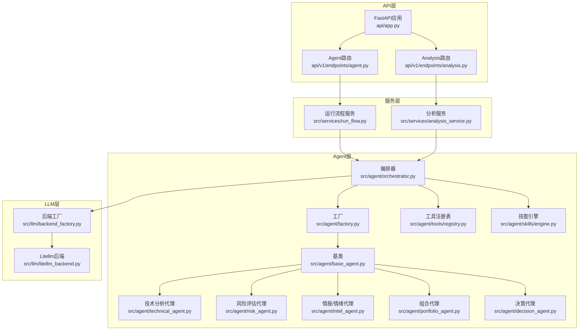
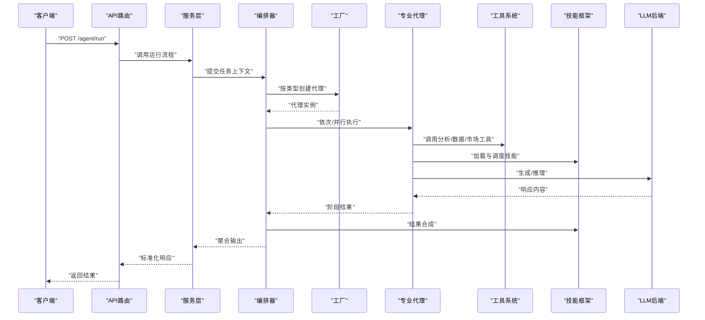
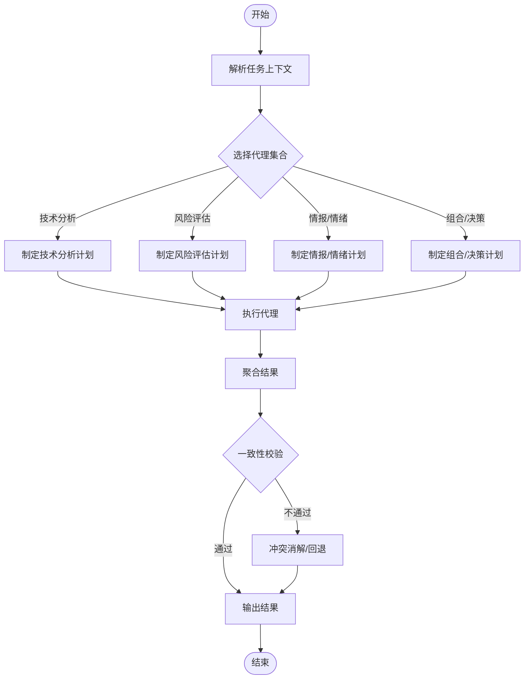
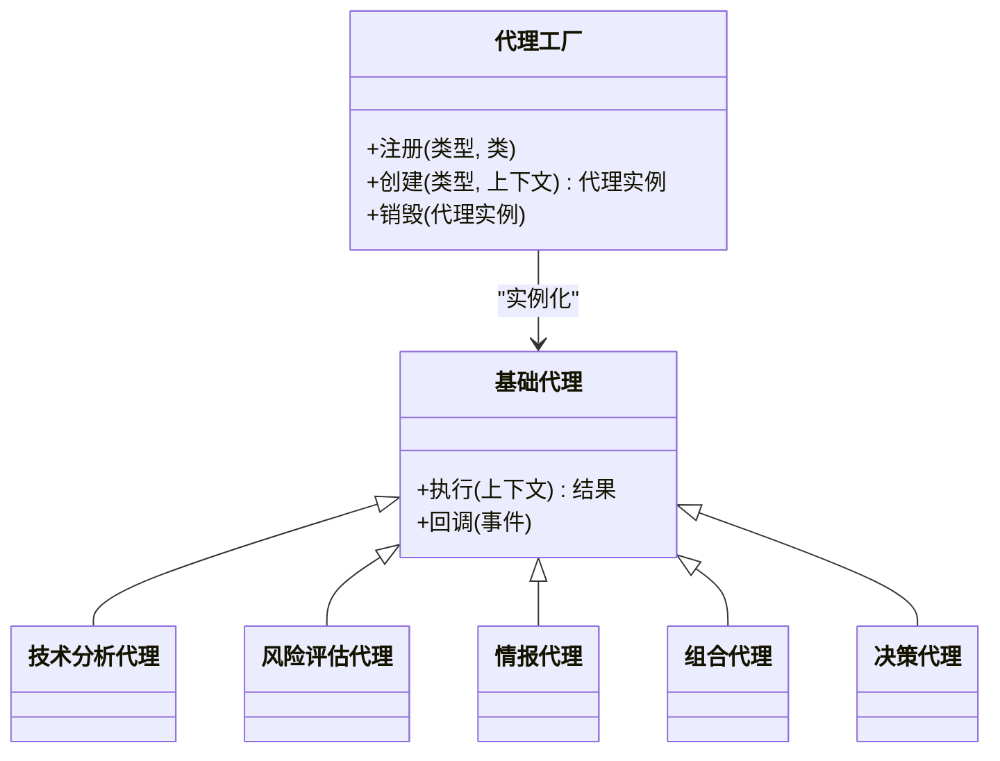
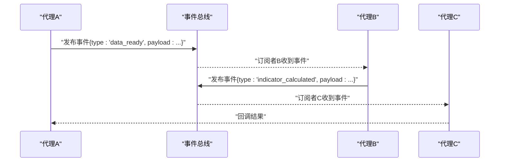
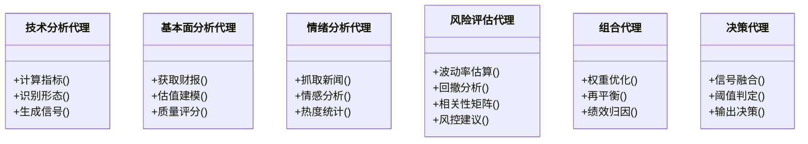
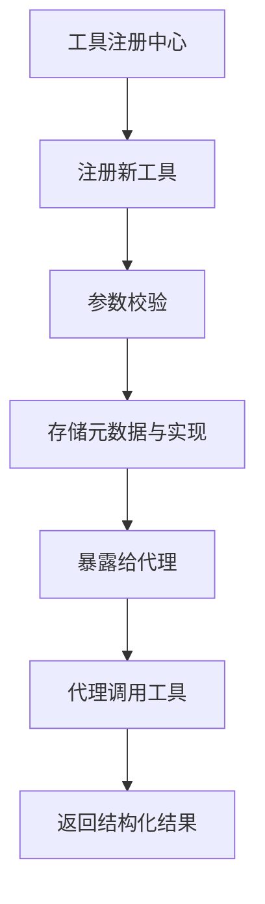
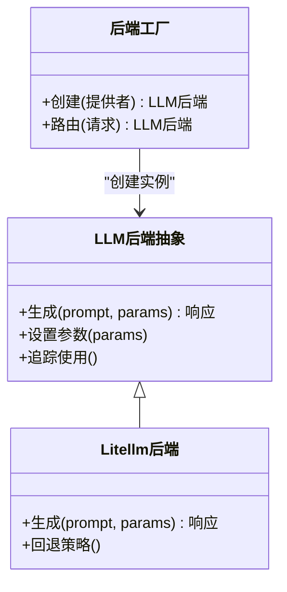
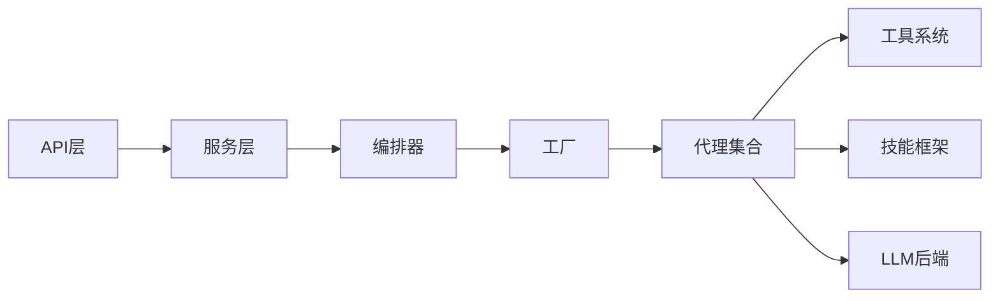

# AI代理系统

<cite>
**本文引用的文件**   
- [main.py](file://main.py)
- [server.py](file://server.py)
- [src/agent/orchestrator.py](file://src/agent/orchestrator.py)
- [src/agent/factory.py](file://src/agent/factory.py)
- [src/agent/base_agent.py](file://src/agent/base_agent.py)
- [src/agent/technical_agent.py](file://src/agent/technical_agent.py)
- [src/agent/risk_agent.py](file://src/agent/risk_agent.py)
- [src/agent/intel_agent.py](file://src/agent/intel_agent.py)
- [src/agent/portfolio_agent.py](file://src/agent/portfolio_agent.py)
- [src/agent/decision_agent.py](file://src/agent/decision_agent.py)
- [src/agent/tools/registry.py](file://src/agent/tools/registry.py)
- [src/agent/tools/analysis_tools.py](file://src/agent/tools/analysis_tools.py)
- [src/agent/tools/data_tools.py](file://src/agent/tools/data_tools.py)
- [src/agent/tools/market_tools.py](file://src/agent/tools/market_tools.py)
- [src/agent/skills/engine.py](file://src/agent/skills/engine.py)
- [src/agent/skills/router.py](file://src/agent/skills/router.py)
- [src/agent/skills/aggregator.py](file://src/agent/skills/aggregator.py)
- [src/agent/skills/synthesis.py](file://src/agent/skills/synthesis.py)
- [src/llm/backend_factory.py](file://src/llm/backend_factory.py)
- [src/llm/litellm_backend.py](file://src/llm/litellm_backend.py)
- [api/v1/endpoints/agent.py](file://api/v1/endpoints/agent.py)
- [api/v1/endpoints/analysis.py](file://api/v1/endpoints/analysis.py)
- [api/app.py](file://api/app.py)
- [src/services/run_flow.py](file://src/services/run_flow.py)
- [src/services/analysis_service.py](file://src/services/analysis_service.py)
- [src/core/config_manager.py](file://src/core/config_manager.py)
</cite>

## 目录
1. [简介](#简介)
2. [项目结构](#项目结构)
3. [核心组件](#核心组件)
4. [架构总览](#架构总览)
5. [详细组件分析](#详细组件分析)
6. [依赖关系分析](#依赖关系分析)
7. [性能考量](#性能考量)
8. [故障排查指南](#故障排查指南)
9. [结论](#结论)
10. [附录](#附录)

## 简介
本文件为 Daily Stock Analysis 的AI代理系统技术文档，面向希望理解与扩展该系统的开发者与使用者。内容涵盖多代理协作架构、代理编排器机制、代理工厂动态创建、代理间通信协议、专业分析代理（技术分析、基本面分析、情绪分析、风险评估）职责边界，工具系统的注册与使用、技能框架的加载调度与结果合成，以及配置与参数调优最佳实践。文末提供创建新代理类型与集成第三方AI服务的实践指引。

## 项目结构
系统采用分层模块化设计：
- API层：FastAPI应用入口与路由，暴露Agent、Analysis等接口
- 服务层：封装业务流程（如run_flow、analysis_service）
- Agent层：代理编排、工厂、具体代理实现、工具与技能子系统
- LLM层：统一后端抽象与Litellm适配
- 数据与存储：数据源适配器、仓库、缓存
- 前端与桌面端：Web UI与Electron桌面应用

**图表来源** 
- [api/app.py](file://api/app.py)
- [api/v1/endpoints/agent.py](file://api/v1/endpoints/agent.py)
- [api/v1/endpoints/analysis.py](file://api/v1/endpoints/analysis.py)
- [src/services/run_flow.py](file://src/services/run_flow.py)
- [src/services/analysis_service.py](file://src/services/analysis_service.py)
- [src/agent/orchestrator.py](file://src/agent/orchestrator.py)
- [src/agent/factory.py](file://src/agent/factory.py)
- [src/agent/base_agent.py](file://src/agent/base_agent.py)
- [src/agent/technical_agent.py](file://src/agent/technical_agent.py)
- [src/agent/risk_agent.py](file://src/agent/risk_agent.py)
- [src/agent/intel_agent.py](file://src/agent/intel_agent.py)
- [src/agent/portfolio_agent.py](file://src/agent/portfolio_agent.py)
- [src/agent/decision_agent.py](file://src/agent/decision_agent.py)
- [src/agent/tools/registry.py](file://src/agent/tools/registry.py)
- [src/agent/skills/engine.py](file://src/agent/skills/engine.py)
- [src/llm/backend_factory.py](file://src/llm/backend_factory.py)
- [src/llm/litellm_backend.py](file://src/llm/litellm_backend.py)

**章节来源**
- [main.py](file://main.py)
- [server.py](file://server.py)
- [api/app.py](file://api/app.py)

## 核心组件
- 代理编排器：负责解析任务、选择并实例化代理、编排执行顺序、聚合结果与错误处理
- 代理工厂：根据类型或策略动态创建代理实例，注入上下文与工具集
- 基础代理：定义统一的调用接口、生命周期、事件流与上下文管理
- 专业代理：技术分析、风险评估、情报/情绪、组合与决策代理各司其职
- 工具系统：集中注册与分析、数据、市场等能力，供代理按需调用
- 技能框架：技能的加载、路由、调度与结果合成，支持可插拔扩展
- LLM后端：统一抽象与Litellm适配，支持多模型与回退策略

**章节来源**
- [src/agent/orchestrator.py](file://src/agent/orchestrator.py)
- [src/agent/factory.py](file://src/agent/factory.py)
- [src/agent/base_agent.py](file://src/agent/base_agent.py)
- [src/agent/tools/registry.py](file://src/agent/tools/registry.py)
- [src/agent/skills/engine.py](file://src/agent/skills/engine.py)
- [src/llm/backend_factory.py](file://src/llm/backend_factory.py)
- [src/llm/litellm_backend.py](file://src/llm/litellm_backend.py)

## 架构总览
系统以“请求-编排-执行-聚合”为主线：
- API接收请求后进入服务层，服务层调用编排器
- 编排器根据输入决定需要哪些代理与技能，通过工厂创建实例
- 代理在执行过程中调用工具获取数据与计算指标，必要时触发技能
- 所有结果由编排器聚合，最终返回给API层

**图表来源** 
- [api/v1/endpoints/agent.py](file://api/v1/endpoints/agent.py)
- [src/services/run_flow.py](file://src/services/run_flow.py)
- [src/agent/orchestrator.py](file://src/agent/orchestrator.py)
- [src/agent/factory.py](file://src/agent/factory.py)
- [src/agent/tools/registry.py](file://src/agent/tools/registry.py)
- [src/agent/skills/engine.py](file://src/agent/skills/engine.py)
- [src/llm/litellm_backend.py](file://src/llm/litellm_backend.py)

## 详细组件分析

### 代理编排器工作机制
- 任务解析：从输入上下文提取股票范围、时间窗口、目标与约束
- 代理选择：依据任务类型与策略路由到对应代理集合
- 执行编排：支持串行、并行与条件分支；失败重试与降级
- 结果聚合：合并各代理输出，进行一致性校验与冲突消解
- 事件流：对外暴露SSE/事件流，便于前端实时展示进度

**图表来源** 
- [src/agent/orchestrator.py](file://src/agent/orchestrator.py)

**章节来源**
- [src/agent/orchestrator.py](file://src/agent/orchestrator.py)

### 代理工厂的动态创建过程
- 注册表驱动：通过类型键映射到代理类
- 上下文注入：将共享上下文、工具集、LLM后端注入代理实例
- 参数校验：对构造参数进行合法性检查与默认值填充
- 生命周期管理：创建、初始化、销毁钩子

**图表来源** 
- [src/agent/factory.py](file://src/agent/factory.py)
- [src/agent/base_agent.py](file://src/agent/base_agent.py)
- [src/agent/technical_agent.py](file://src/agent/technical_agent.py)
- [src/agent/risk_agent.py](file://src/agent/risk_agent.py)
- [src/agent/intel_agent.py](file://src/agent/intel_agent.py)
- [src/agent/portfolio_agent.py](file://src/agent/portfolio_agent.py)
- [src/agent/decision_agent.py](file://src/agent/decision_agent.py)

**章节来源**
- [src/agent/factory.py](file://src/agent/factory.py)
- [src/agent/base_agent.py](file://src/agent/base_agent.py)

### 代理间通信协议
- 消息格式：结构化上下文对象，包含股票代码、时间窗口、目标、约束、中间结果
- 事件总线：基于事件流的发布/订阅，支持进度、日志、错误与阶段性结果
- 状态同步：通过共享上下文与锁机制保证并发安全
- 错误传播：异常向上冒泡，编排器捕获并进行降级或重试

**图表来源** 
- [src/agent/orchestrator.py](file://src/agent/orchestrator.py)

**章节来源**
- [src/agent/orchestrator.py](file://src/agent/orchestrator.py)

### 专业分析代理功能说明
- 技术分析代理：计算技术指标、识别形态与趋势、生成交易信号
- 基本面分析代理：整合财务与估值数据，评估内在价值与质量
- 情绪分析代理：抓取新闻与社交信息，进行情感倾向与热度分析
- 风险评估代理：度量波动率、回撤、相关性、尾部风险，给出风控建议
- 组合代理：资产配置、权重优化、再平衡策略
- 决策代理：综合各代理输出，形成最终决策与建议

**图表来源** 
- [src/agent/technical_agent.py](file://src/agent/technical_agent.py)
- [src/agent/intel_agent.py](file://src/agent/intel_agent.py)
- [src/agent/risk_agent.py](file://src/agent/risk_agent.py)
- [src/agent/portfolio_agent.py](file://src/agent/portfolio_agent.py)
- [src/agent/decision_agent.py](file://src/agent/decision_agent.py)

**章节来源**
- [src/agent/technical_agent.py](file://src/agent/technical_agent.py)
- [src/agent/intel_agent.py](file://src/agent/intel_agent.py)
- [src/agent/risk_agent.py](file://src/agent/risk_agent.py)
- [src/agent/portfolio_agent.py](file://src/agent/portfolio_agent.py)
- [src/agent/decision_agent.py](file://src/agent/decision_agent.py)

### 工具系统的注册与使用机制
- 注册中心：集中管理工具名称、描述、参数签名与实现函数
- 内置工具：分析工具（指标计算）、数据工具（历史/实时行情）、市场工具（板块/指数）
- 扩展方式：通过装饰器或注册函数添加自定义工具，自动暴露给代理
- 调用约定：代理通过统一接口调用工具，返回结构化结果

**图表来源** 
- [src/agent/tools/registry.py](file://src/agent/tools/registry.py)
- [src/agent/tools/analysis_tools.py](file://src/agent/tools/analysis_tools.py)
- [src/agent/tools/data_tools.py](file://src/agent/tools/data_tools.py)
- [src/agent/tools/market_tools.py](file://src/agent/tools/market_tools.py)

**章节来源**
- [src/agent/tools/registry.py](file://src/agent/tools/registry.py)
- [src/agent/tools/analysis_tools.py](file://src/agent/tools/analysis_tools.py)
- [src/agent/tools/data_tools.py](file://src/agent/tools/data_tools.py)
- [src/agent/tools/market_tools.py](file://src/agent/tools/market_tools.py)

### 技能框架的工作原理
- 技能加载：扫描技能目录或配置，解析元数据与依赖
- 路由与调度：根据任务特征选择合适技能，支持优先级与条件路由
- 执行与合成：执行技能并收集结果，进行加权或投票合成
- 可插拔：新增技能无需修改核心逻辑，仅注册即可生效

```mermaid
sequenceDiagram
participant Orchestrator as "编排器"
participant SkillEngine as "技能引擎"
participant Router as "技能路由器"
participant Skill as "具体技能"
Orchestrator->>SkillEngine : "请求技能列表"
SkillEngine-->>Orchestrator : "返回已加载技能"
Orchestrator->>Router : "选择技能(基于上下文)"
Router-->>Orchestrator : "选定技能"
Orchestrator->>Skill : "执行技能"
Skill-->>Orchestrator : "技能结果"
Orchestrator->>SkillEngine : "合成结果"
SkillEngine-->>Orchestrator : "合成输出"
```

**图表来源** 
- [src/agent/skills/engine.py](file://src/agent/skills/engine.py)
- [src/agent/skills/router.py](file://src/agent/skills/router.py)
- [src/agent/skills/aggregator.py](file://src/agent/skills/aggregator.py)
- [src/agent/skills/synthesis.py](file://src/agent/skills/synthesis.py)

**章节来源**
- [src/agent/skills/engine.py](file://src/agent/skills/engine.py)
- [src/agent/skills/router.py](file://src/agent/skills/router.py)
- [src/agent/skills/aggregator.py](file://src/agent/skills/aggregator.py)
- [src/agent/skills/synthesis.py](file://src/agent/skills/synthesis.py)

### LLM后端与路由
- 统一抽象：定义生成接口、参数与响应结构
- 后端工厂：根据配置选择具体后端（如Litellm），支持多模型与回退
- 使用追踪：记录调用次数、成本与延迟，便于监控与优化

**图表来源** 
- [src/llm/backend_factory.py](file://src/llm/backend_factory.py)
- [src/llm/litellm_backend.py](file://src/llm/litellm_backend.py)

**章节来源**
- [src/llm/backend_factory.py](file://src/llm/backend_factory.py)
- [src/llm/litellm_backend.py](file://src/llm/litellm_backend.py)

## 依赖关系分析
- 低耦合高内聚：代理与工具、技能、LLM后端通过接口解耦
- 明确依赖方向：API→服务→编排器→工厂→代理→工具/技能/LLM
- 外部依赖：数据源适配器、通知发送器、存储与缓存

**图表来源** 
- [api/app.py](file://api/app.py)
- [src/services/run_flow.py](file://src/services/run_flow.py)
- [src/agent/orchestrator.py](file://src/agent/orchestrator.py)
- [src/agent/factory.py](file://src/agent/factory.py)

**章节来源**
- [api/app.py](file://api/app.py)
- [src/services/run_flow.py](file://src/services/run_flow.py)
- [src/agent/orchestrator.py](file://src/agent/orchestrator.py)
- [src/agent/factory.py](file://src/agent/factory.py)

## 性能考量
- 并发控制：代理并行执行时限制并发度，避免资源争用
- 缓存策略：对热点数据与指标计算结果进行缓存
- 批处理：批量拉取历史数据与新闻，减少网络往返
- 超时与重试：设置合理的超时与重试上限，提升鲁棒性
- 内存管理：及时释放大对象，避免内存泄漏

[本节为通用指导，不直接分析具体文件]

## 故障排查指南
- 常见问题：
  - 代理执行超时：检查LLM后端配置与网络状况
  - 工具调用失败：确认工具注册与权限
  - 技能加载失败：核对技能路径与依赖
  - 结果不一致：检查上下文一致性与随机种子
- 诊断步骤：
  - 查看事件流与日志定位卡点
  - 启用调试模式打印中间结果
  - 隔离测试单个代理与工具
  - 逐步替换LLM后端验证问题域

**章节来源**
- [src/agent/orchestrator.py](file://src/agent/orchestrator.py)
- [src/agent/tools/registry.py](file://src/agent/tools/registry.py)
- [src/agent/skills/engine.py](file://src/agent/skills/engine.py)
- [src/llm/litellm_backend.py](file://src/llm/litellm_backend.py)

## 结论
Daily Stock Analysis的AI代理系统通过清晰的层次与模块划分，实现了可扩展、可维护的多代理协作架构。编排器与工厂提供了灵活的执行与实例化机制，工具与技能子系统增强了能力边界，LLM后端抽象保障了多模型兼容。遵循本文档的最佳实践，可以快速扩展代理类型与第三方服务，提升系统整体性能与稳定性。

[本节为总结，不直接分析具体文件]

## 附录

### 配置与参数调优最佳实践
- 提示词工程：
  - 明确角色与目标，限定输出格式
  - 分步引导，避免一次性复杂指令
  - 引入示例与约束，提高一致性
- 上下文管理：
  - 精简上下文，只保留必要信息
  - 使用摘要与索引降低长度
  - 分段传递长文本，保持语义连贯
- 性能优化：
  - 合理设置温度、最大令牌数与频率惩罚
  - 启用缓存与批处理
  - 监控延迟与成本，动态调整策略

[本节为通用指导，不直接分析具体文件]

### 创建新代理类型的实践
- 步骤概览：
  - 继承基础代理，实现执行方法
  - 在工厂中注册新代理类型
  - 编写工具与技能支持
  - 在编排器中添加路由规则
- 参考路径：
  - 代理基类与实现：[src/agent/base_agent.py](file://src/agent/base_agent.py)、[src/agent/technical_agent.py](file://src/agent/technical_agent.py)
  - 工厂注册：[src/agent/factory.py](file://src/agent/factory.py)
  - 工具扩展：[src/agent/tools/registry.py](file://src/agent/tools/registry.py)
  - 技能接入：[src/agent/skills/engine.py](file://src/agent/skills/engine.py)

**章节来源**
- [src/agent/base_agent.py](file://src/agent/base_agent.py)
- [src/agent/technical_agent.py](file://src/agent/technical_agent.py)
- [src/agent/factory.py](file://src/agent/factory.py)
- [src/agent/tools/registry.py](file://src/agent/tools/registry.py)
- [src/agent/skills/engine.py](file://src/agent/skills/engine.py)

### 集成第三方AI服务的实践
- 步骤概览：
  - 实现LLM后端抽象接口
  - 在后端工厂中注册新后端
  - 配置环境变量与密钥
  - 测试连通性与回退策略
- 参考路径：
  - LLM后端抽象与Litellm实现：[src/llm/backend_factory.py](file://src/llm/backend_factory.py)、[src/llm/litellm_backend.py](file://src/llm/litellm_backend.py)
  - 配置管理：[src/core/config_manager.py](file://src/core/config_manager.py)

**章节来源**
- [src/llm/backend_factory.py](file://src/llm/backend_factory.py)
- [src/llm/litellm_backend.py](file://src/llm/litellm_backend.py)
- [src/core/config_manager.py](file://src/core/config_manager.py)