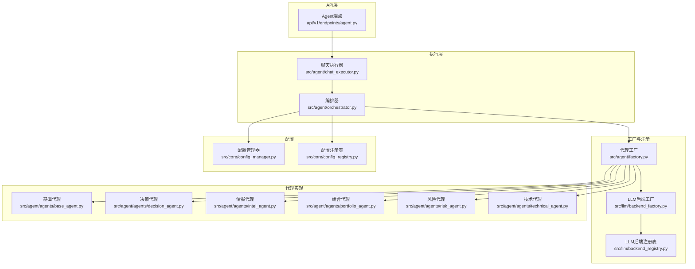
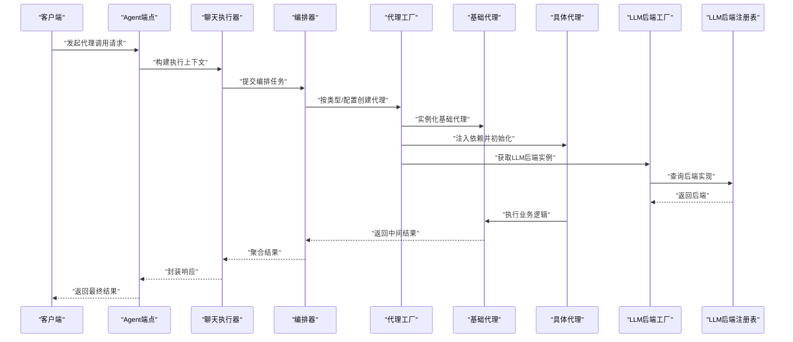
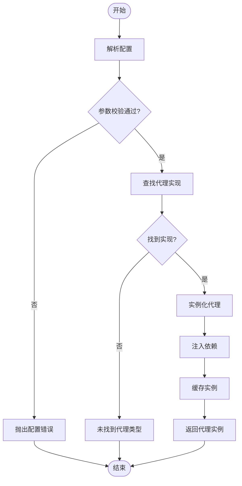
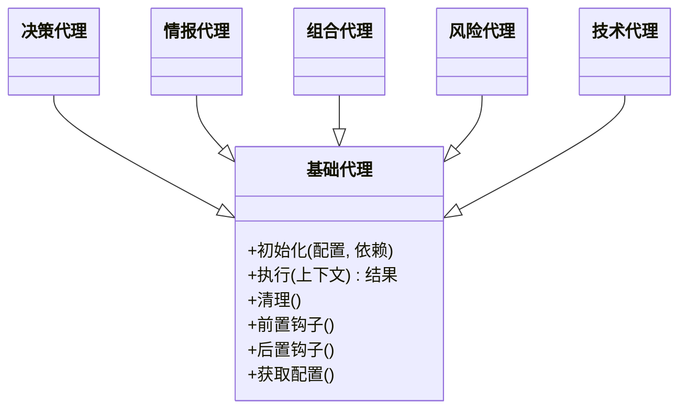
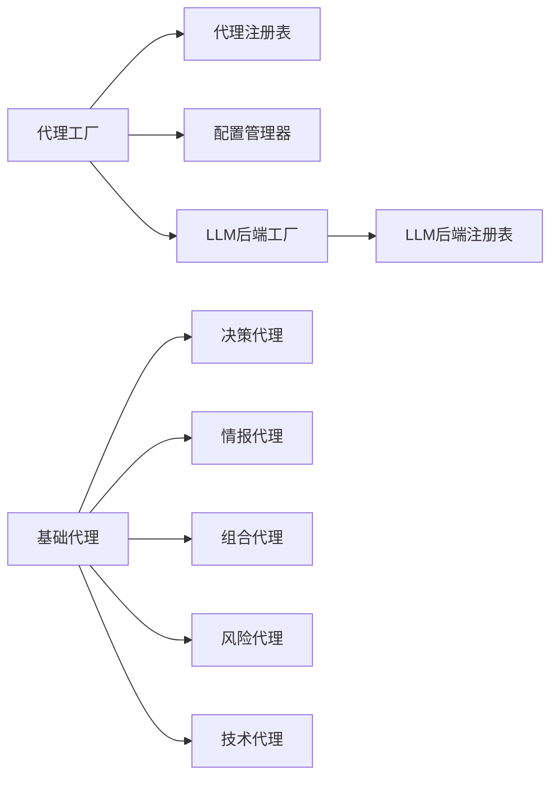

# 代理工厂

<cite>
**本文档引用的文件**   
- [src/agent/factory.py](file://src/agent/factory.py)
- [src/agent/agents/base_agent.py](file://src/agent/agents/base_agent.py)
- [src/agent/agents/decision_agent.py](file://src/agent/agents/decision_agent.py)
- [src/agent/agents/intel_agent.py](file://src/agent/agents/intel_agent.py)
- [src/agent/agents/portfolio_agent.py](file://src/agent/agents/portfolio_agent.py)
- [src/agent/agents/risk_agent.py](file://src/agent/agents/risk_agent.py)
- [src/agent/agents/technical_agent.py](file://src/agent/agents/technical_agent.py)
- [src/agent/orchestrator.py](file://src/agent/orchestrator.py)
- [src/agent/chat_executor.py](file://src/agent/chat_executor.py)
- [src/core/config_manager.py](file://src/core/config_manager.py)
- [src/core/config_registry.py](file://src/core/config_registry.py)
- [api/v1/endpoints/agent.py](file://api/v1/endpoints/agent.py)
- [src/llm/backend_factory.py](file://src/llm/backend_factory.py)
- [src/llm/backend_registry.py](file://src/llm/backend_registry.py)
</cite>

## 目录
1. [简介](#简介)
2. [项目结构](#项目结构)
3. [核心组件](#核心组件)
4. [架构总览](#架构总览)
5. [详细组件分析](#详细组件分析)
6. [依赖关系分析](#依赖关系分析)
7. [性能考量](#性能考量)
8. [故障排查指南](#故障排查指南)
9. [结论](#结论)
10. [附录：新增代理类型完整指南](#附录新增代理类型完整指南)

## 简介
本文件围绕“代理工厂”的设计与实现进行系统化说明，覆盖动态代理创建机制、代理类型注册与实例化流程、基础代理类的抽象接口设计（必需方法与扩展点）、代理配置的解析与校验、依赖注入与资源管理，以及从零到一创建新代理类型的完整实践。文档面向不同技术背景的读者，提供由浅入深的分层讲解与可视化图示，帮助快速理解并高效扩展系统能力。

## 项目结构
与代理工厂相关的代码主要分布在以下模块：
- 代理工厂与编排：src/agent/factory.py、src/agent/orchestrator.py
- 基础代理与具体代理：src/agent/agents/base_agent.py 及多个具体代理实现
- 配置管理与注册表：src/core/config_manager.py、src/core/config_registry.py
- API 入口与调用方：api/v1/endpoints/agent.py、src/agent/chat_executor.py
- LLM 后端工厂与注册（与代理协作）：src/llm/backend_factory.py、src/llm/backend_registry.py

图表来源
- [api/v1/endpoints/agent.py](file://api/v1/endpoints/agent.py)
- [src/agent/chat_executor.py](file://src/agent/chat_executor.py)
- [src/agent/orchestrator.py](file://src/agent/orchestrator.py)
- [src/agent/factory.py](file://src/agent/factory.py)
- [src/llm/backend_factory.py](file://src/llm/backend_factory.py)
- [src/llm/backend_registry.py](file://src/llm/backend_registry.py)
- [src/core/config_manager.py](file://src/core/config_manager.py)
- [src/core/config_registry.py](file://src/core/config_registry.py)
- [src/agent/agents/base_agent.py](file://src/agent/agents/base_agent.py)
- [src/agent/agents/decision_agent.py](file://src/agent/agents/decision_agent.py)
- [src/agent/agents/intel_agent.py](file://src/agent/agents/intel_agent.py)
- [src/agent/agents/portfolio_agent.py](file://src/agent/agents/portfolio_agent.py)
- [src/agent/agents/risk_agent.py](file://src/agent/agents/risk_agent.py)
- [src/agent/agents/technical_agent.py](file://src/agent/agents/technical_agent.py)

章节来源
- [src/agent/factory.py](file://src/agent/factory.py)
- [src/agent/orchestrator.py](file://src/agent/orchestrator.py)
- [src/agent/chat_executor.py](file://src/agent/chat_executor.py)
- [src/core/config_manager.py](file://src/core/config_manager.py)
- [src/core/config_registry.py](file://src/core/config_registry.py)
- [api/v1/endpoints/agent.py](file://api/v1/endpoints/agent.py)

## 核心组件
- 代理工厂：负责根据配置或运行时参数动态创建、缓存和复用代理实例；统一处理依赖注入、生命周期和资源释放。
- 基础代理类：定义所有代理必须实现的抽象接口（如初始化、执行、清理等），并提供可选扩展点（如钩子方法、日志埋点、指标上报）。
- 具体代理：继承基础代理类，实现领域特定的业务逻辑（如决策、情报、组合、风险、技术分析等）。
- 编排器：协调多个代理的调用顺序、上下文传递与结果聚合。
- 配置管理器与注册表：负责YAML配置文件的加载、校验、合并与运行时访问；维护代理类型与实现类的映射。
- LLM后端工厂与注册表：为代理提供统一的LLM调用抽象，支持多后端切换与参数路由。

章节来源
- [src/agent/factory.py](file://src/agent/factory.py)
- [src/agent/agents/base_agent.py](file://src/agent/agents/base_agent.py)
- [src/agent/orchestrator.py](file://src/agent/orchestrator.py)
- [src/core/config_manager.py](file://src/core/config_manager.py)
- [src/core/config_registry.py](file://src/core/config_registry.py)
- [src/llm/backend_factory.py](file://src/llm/backend_factory.py)
- [src/llm/backend_registry.py](file://src/llm/backend_registry.py)

## 架构总览
下图展示了从API请求到代理执行的端到端流程，包括工厂创建、依赖注入、LLM后端选择与返回结果。

图表来源
- [api/v1/endpoints/agent.py](file://api/v1/endpoints/agent.py)
- [src/agent/chat_executor.py](file://src/agent/chat_executor.py)
- [src/agent/orchestrator.py](file://src/agent/orchestrator.py)
- [src/agent/factory.py](file://src/agent/factory.py)
- [src/agent/agents/base_agent.py](file://src/agent/agents/base_agent.py)
- [src/llm/backend_factory.py](file://src/llm/backend_factory.py)
- [src/llm/backend_registry.py](file://src/llm/backend_registry.py)

## 详细组件分析

### 代理工厂（动态创建与注册）
- 职责
  - 根据类型标识或配置项创建对应代理实例
  - 管理实例的生命周期（初始化、缓存、销毁）
  - 注入依赖（如配置、服务、LLM后端）
  - 提供统一的错误处理与重试策略
- 关键流程
  - 解析配置：读取YAML中的代理类型、参数、依赖声明
  - 校验参数：类型检查、必填字段验证、默认值填充
  - 查找实现：通过注册表定位具体代理类
  - 实例化：构造对象并注入依赖
  - 缓存与复用：避免重复创建，提升性能
  - 资源释放：在进程退出或会话结束时释放外部资源

图表来源
- [src/agent/factory.py](file://src/agent/factory.py)
- [src/core/config_manager.py](file://src/core/config_manager.py)
- [src/core/config_registry.py](file://src/core/config_registry.py)

章节来源
- [src/agent/factory.py](file://src/agent/factory.py)
- [src/core/config_manager.py](file://src/core/config_manager.py)
- [src/core/config_registry.py](file://src/core/config_registry.py)

### 基础代理类（抽象接口与扩展点）
- 抽象接口（必需实现）
  - 初始化：接收配置与依赖，完成内部状态准备
  - 执行：接受输入上下文，返回结构化结果
  - 清理：释放资源、关闭连接、清理缓存
- 可选扩展点
  - 钩子方法：在执行前后插入自定义逻辑（如日志、监控、审计）
  - 配置扩展：允许子类声明额外配置项
  - 错误恢复：提供降级或重试策略
- 设计原则
  - 单一职责：每个代理专注一个领域
  - 开闭原则：对扩展开放，对修改封闭
  - 依赖倒置：通过接口与注册表解耦

图表来源
- [src/agent/agents/base_agent.py](file://src/agent/agents/base_agent.py)
- [src/agent/agents/decision_agent.py](file://src/agent/agents/decision_agent.py)
- [src/agent/agents/intel_agent.py](file://src/agent/agents/intel_agent.py)
- [src/agent/agents/portfolio_agent.py](file://src/agent/agents/portfolio_agent.py)
- [src/agent/agents/risk_agent.py](file://src/agent/agents/risk_agent.py)
- [src/agent/agents/technical_agent.py](file://src/agent/agents/technical_agent.py)

章节来源
- [src/agent/agents/base_agent.py](file://src/agent/agents/base_agent.py)
- [src/agent/agents/decision_agent.py](file://src/agent/agents/decision_agent.py)
- [src/agent/agents/intel_agent.py](file://src/agent/agents/intel_agent.py)
- [src/agent/agents/portfolio_agent.py](file://src/agent/agents/portfolio_agent.py)
- [src/agent/agents/risk_agent.py](file://src/agent/agents/risk_agent.py)
- [src/agent/agents/technical_agent.py](file://src/agent/agents/technical_agent.py)

### 编排器（多代理协作）
- 职责
  - 定义代理调用顺序与依赖关系
  - 管理上下文传递与数据共享
  - 聚合各代理输出，形成最终结果
- 关键点
  - 支持串行、并行与条件分支执行
  - 异常隔离与回退策略
  - 可观测性：记录每步执行耗时与状态

章节来源
- [src/agent/orchestrator.py](file://src/agent/orchestrator.py)

### 配置解析与校验（YAML）
- 配置文件结构
  - 代理类型映射：名称到实现类的映射
  - 参数定义：类型、默认值、是否必填、取值范围
  - 依赖声明：外部服务、数据库、缓存等
- 解析流程
  - 加载YAML文件
  - 合并环境变量与默认配置
  - 校验必填字段与类型约束
  - 生成运行时可用配置对象
- 校验策略
  - 静态校验：Schema验证、正则匹配、枚举限制
  - 动态校验：运行时依赖可用性检查

章节来源
- [src/core/config_manager.py](file://src/core/config_manager.py)
- [src/core/config_registry.py](file://src/core/config_registry.py)

### LLM后端工厂与注册（与代理协作）
- 职责
  - 根据配置选择具体LLM后端实现
  - 统一管理后端生命周期与参数
  - 提供统一调用接口供代理使用
- 关键点
  - 支持热插拔：新增后端无需修改现有代码
  - 参数路由：根据模型名称或标签选择最优后端
  - 错误处理：超时、限流、降级策略

章节来源
- [src/llm/backend_factory.py](file://src/llm/backend_factory.py)
- [src/llm/backend_registry.py](file://src/llm/backend_registry.py)

## 依赖关系分析
- 松耦合设计
  - 代理工厂通过注册表解耦类型与实现
  - 基础代理定义稳定接口，具体代理自由扩展
  - LLM后端工厂屏蔽底层差异
- 潜在循环依赖
  - 确保工厂不直接依赖具体代理类
  - 使用延迟导入或回调注册避免启动时循环
- 外部依赖
  - 配置文件加载器
  - 日志与监控系统
  - 网络客户端（HTTP、WebSocket等）

图表来源
- [src/agent/factory.py](file://src/agent/factory.py)
- [src/core/config_registry.py](file://src/core/config_registry.py)
- [src/core/config_manager.py](file://src/core/config_manager.py)
- [src/llm/backend_factory.py](file://src/llm/backend_factory.py)
- [src/llm/backend_registry.py](file://src/llm/backend_registry.py)
- [src/agent/agents/base_agent.py](file://src/agent/agents/base_agent.py)
- [src/agent/agents/decision_agent.py](file://src/agent/agents/decision_agent.py)
- [src/agent/agents/intel_agent.py](file://src/agent/agents/intel_agent.py)
- [src/agent/agents/portfolio_agent.py](file://src/agent/agents/portfolio_agent.py)
- [src/agent/agents/risk_agent.py](file://src/agent/agents/risk_agent.py)
- [src/agent/agents/technical_agent.py](file://src/agent/agents/technical_agent.py)

章节来源
- [src/agent/factory.py](file://src/agent/factory.py)
- [src/core/config_registry.py](file://src/core/config_registry.py)
- [src/core/config_manager.py](file://src/core/config_manager.py)
- [src/llm/backend_factory.py](file://src/llm/backend_factory.py)
- [src/llm/backend_registry.py](file://src/llm/backend_registry.py)

## 性能考量
- 实例缓存：避免重复创建高成本对象
- 懒加载：按需初始化依赖，减少启动时间
- 并发安全：线程池或异步执行，避免锁竞争
- 内存管理：及时释放大对象，防止内存泄漏
- 网络优化：连接池、超时设置、重试退避

## 故障排查指南
- 常见问题
  - 配置错误：字段缺失、类型不匹配、枚举值非法
  - 依赖注入失败：服务未注册、连接失败
  - 代理未找到：类型名拼写错误或未注册
  - LLM后端异常：认证失败、限流、超时
- 诊断步骤
  - 检查配置文件语法与必填字段
  - 查看注册表是否正确加载
  - 启用详细日志与追踪
  - 逐步隔离问题组件

章节来源
- [src/core/config_manager.py](file://src/core/config_manager.py)
- [src/core/config_registry.py](file://src/core/config_registry.py)
- [src/llm/backend_factory.py](file://src/llm/backend_factory.py)

## 结论
代理工厂通过清晰的抽象、灵活的注册机制与强大的配置管理能力，实现了高度可扩展的代理生态系统。遵循本文档的设计模式与实践指南，开发者可以快速添加新代理类型，同时保持系统的稳定性与可维护性。

## 附录：新增代理类型完整指南
- 步骤概览
  1. 继承基础代理类
  2. 实现必需方法（初始化、执行、清理）
  3. 可选实现扩展点（钩子、配置扩展）
  4. 在注册表中登记新代理类型
  5. 编写YAML配置并校验
  6. 集成到编排器与API端点
- 最佳实践
  - 保持单一职责，避免过度复杂
  - 充分测试边界条件与异常路径
  - 提供清晰的错误信息与日志
  - 使用依赖注入管理外部资源
- 示例参考
  - 简单代理：仅实现基本逻辑
  - 复杂代理：包含多步骤处理、外部服务调用、缓存与重试

章节来源
- [src/agent/agents/base_agent.py](file://src/agent/agents/base_agent.py)
- [src/core/config_registry.py](file://src/core/config_registry.py)
- [src/core/config_manager.py](file://src/core/config_manager.py)
- [src/agent/orchestrator.py](file://src/agent/orchestrator.py)
- [api/v1/endpoints/agent.py](file://api/v1/endpoints/agent.py)