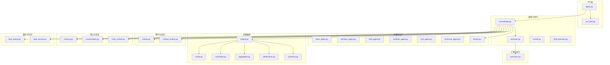
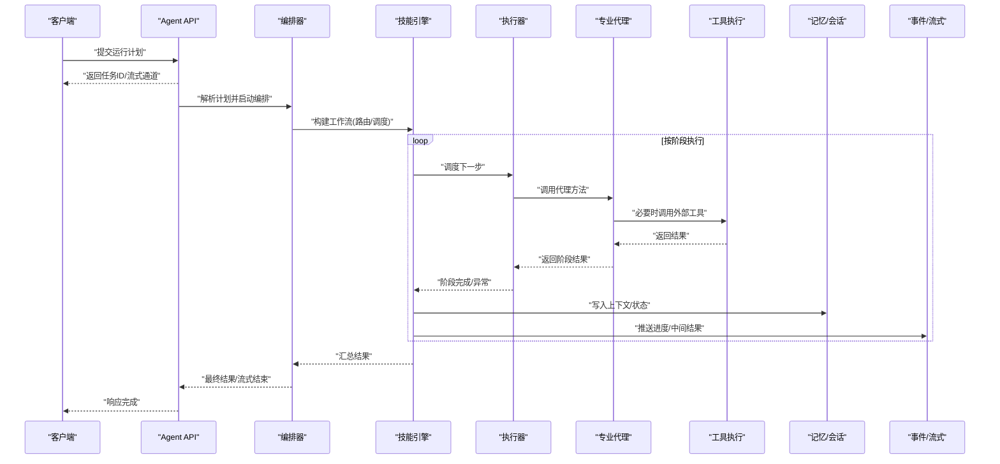
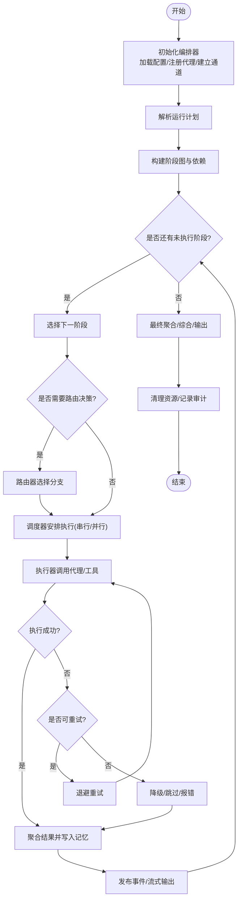
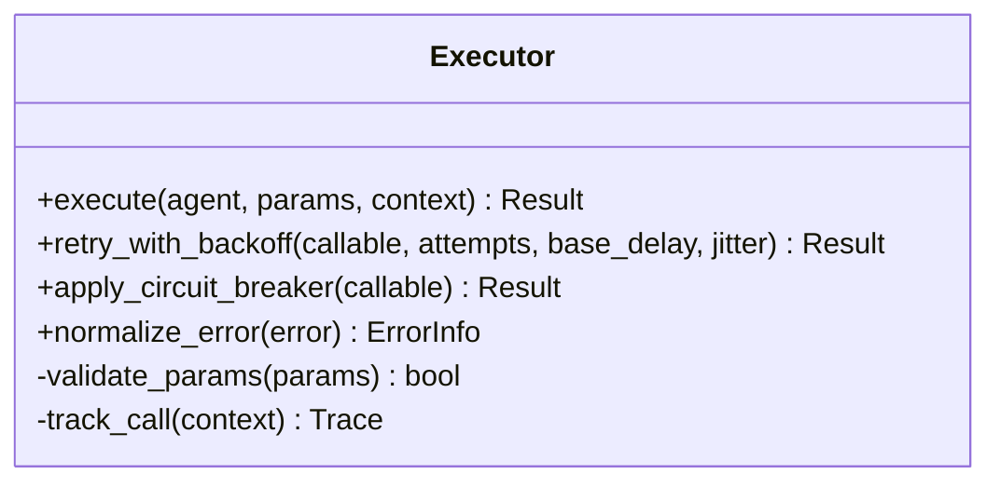
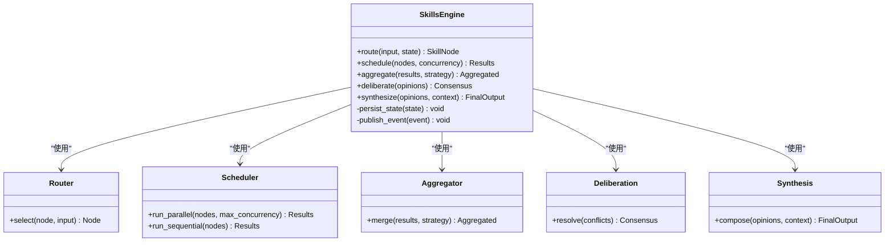
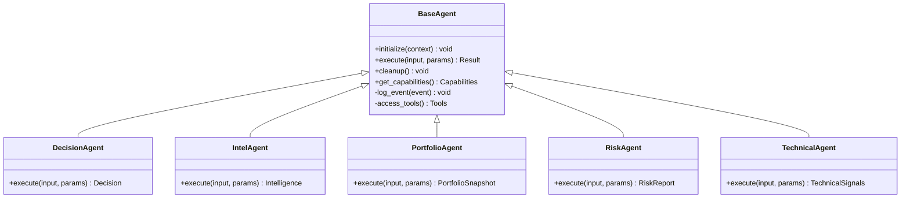
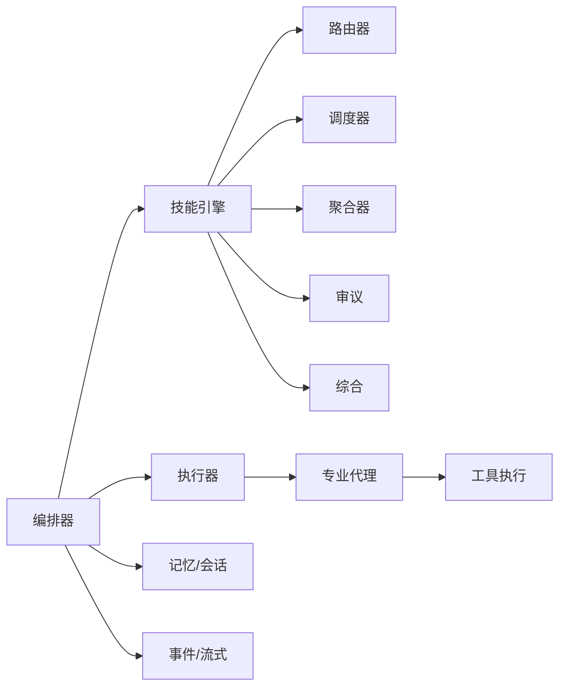

# 代理编排器

<cite>
**本文引用的文件**   
- [src/agent/orchestrator.py](file://src/agent/orchestrator.py)
- [src/agent/executor.py](file://src/agent/executor.py)
- [src/agent/chat_executor.py](file://src/agent/chat_executor.py)
- [src/agent/runner.py](file://src/agent/runner.py)
- [src/agent/factory.py](file://src/agent/factory.py)
- [src/agent/agents/base_agent.py](file://src/agent/agents/base_agent.py)
- [src/agent/agents/decision_agent.py](file://src/agent/agents/decision_agent.py)
- [src/agent/agents/intel_agent.py](file://src/agent/agents/intel_agent.py)
- [src/agent/agents/portfolio_agent.py](file://src/agent/agents/portfolio_agent.py)
- [src/agent/agents/risk_agent.py](file://src/agent/agents/risk_agent.py)
- [src/agent/agents/technical_agent.py](file://src/agent/agents/technical_agent.py)
- [src/agent/skills/engine.py](file://src/agent/skills/engine.py)
- [src/agent/skills/router.py](file://src/agent/skills/router.py)
- [src/agent/skills/scheduler.py](file://src/agent/skills/scheduler.py)
- [src/agent/skills/aggregator.py](file://src/agent/skills/aggregator.py)
- [src/agent/skills/deliberation.py](file://src/agent/skills/deliberation.py)
- [src/agent/skills/synthesis.py](file://src/agent/skills/synthesis.py)
- [src/agent/tools/execution.py](file://src/agent/tools/execution.py)
- [src/agent/events.py](file://src/agent/events.py)
- [src/agent/stream_events.py](file://src/agent/stream_events.py)
- [src/agent/memory.py](file://src/agent/memory.py)
- [src/agent/conversation.py](file://src/agent/conversation.py)
- [src/agent/chat_context.py](file://src/agent/chat_context.py)
- [src/services/task_queue.py](file://src/services/task_queue.py)
- [src/services/task_service.py](file://src/services/task_service.py)
- [api/v1/endpoints/agent.py](file://api/v1/endpoints/agent.py)
- [api/v1/schemas/run_flow.py](file://api/v1/schemas/run_flow.py)
</cite>

## 目录
1. [简介](#简介)
2. [项目结构](#项目结构)
3. [核心组件](#核心组件)
4. [架构总览](#架构总览)
5. [详细组件分析](#详细组件分析)
6. [依赖关系分析](#依赖关系分析)
7. [性能考量](#性能考量)
8. [故障排查指南](#故障排查指南)
9. [结论](#结论)
10. [附录](#附录)

## 简介
本文件面向“代理编排器”子系统，系统性阐述其在多专业分析代理协作中的职责与工作机制。内容涵盖：
- 编排目标：协调多个专业分析代理（技术面、基本面、风险、组合、情报等）的执行顺序、任务分配与结果聚合。
- 生命周期管理：代理的创建、初始化、执行与销毁流程。
- 异步任务处理：并发控制、错误处理与重试策略。
- 上下文传递：跨代理的数据流转与一致性保障。
- 配置与调优：编排器的可配置项与性能参数。
- 实战示例：如何配置复杂协作流程与自定义编排逻辑。

## 项目结构
围绕代理编排的核心代码主要分布在以下模块：
- 编排与执行层：orchestrator、executor、runner、chat_executor
- 代理定义与工厂：agents/*、factory
- 技能编排引擎：skills/engine、router、scheduler、aggregator、deliberation、synthesis
- 工具与执行：tools/execution
- 事件与流式输出：events、stream_events
- 记忆与会话：memory、conversation、chat_context
- 服务与队列：services/task_queue、services/task_service
- API 入口与模式：api/v1/endpoints/agent.py、api/v1/schemas/run_flow.py

图表来源
- [api/v1/endpoints/agent.py:1-200](file://api/v1/endpoints/agent.py#L1-L200)
- [api/v1/schemas/run_flow.py:1-200](file://api/v1/schemas/run_flow.py#L1-L200)
- [src/agent/orchestrator.py:1-300](file://src/agent/orchestrator.py#L1-L300)
- [src/agent/executor.py:1-200](file://src/agent/executor.py#L1-L200)
- [src/agent/runner.py:1-200](file://src/agent/runner.py#L1-L200)
- [src/agent/chat_executor.py:1-200](file://src/agent/chat_executor.py#L1-L200)
- [src/agent/factory.py:1-200](file://src/agent/factory.py#L1-L200)
- [src/agent/skills/engine.py:1-200](file://src/agent/skills/engine.py#L1-L200)
- [src/agent/skills/router.py:1-200](file://src/agent/skills/router.py#L1-L200)
- [src/agent/skills/scheduler.py:1-200](file://src/agent/skills/scheduler.py#L1-L200)
- [src/agent/skills/aggregator.py:1-200](file://src/agent/skills/aggregator.py#L1-L200)
- [src/agent/skills/deliberation.py:1-200](file://src/agent/skills/deliberation.py#L1-L200)
- [src/agent/skills/synthesis.py:1-200](file://src/agent/skills/synthesis.py#L1-L200)
- [src/agent/tools/execution.py:1-200](file://src/agent/tools/execution.py#L1-L200)
- [src/agent/events.py:1-200](file://src/agent/events.py#L1-L200)
- [src/agent/stream_events.py:1-200](file://src/agent/stream_events.py#L1-L200)
- [src/agent/memory.py:1-200](file://src/agent/memory.py#L1-L200)
- [src/agent/conversation.py:1-200](file://src/agent/conversation.py#L1-L200)
- [src/agent/chat_context.py:1-200](file://src/agent/chat_context.py#L1-L200)
- [src/services/task_queue.py:1-200](file://src/services/task_queue.py#L1-L200)
- [src/services/task_service.py:1-200](file://src/services/task_service.py#L1-L200)

章节来源
- [src/agent/orchestrator.py:1-300](file://src/agent/orchestrator.py#L1-L300)
- [src/agent/executor.py:1-200](file://src/agent/executor.py#L1-L200)
- [src/agent/skills/engine.py:1-200](file://src/agent/skills/engine.py#L1-L200)
- [api/v1/endpoints/agent.py:1-200](file://api/v1/endpoints/agent.py#L1-L200)
- [api/v1/schemas/run_flow.py:1-200](file://api/v1/schemas/run_flow.py#L1-L200)

## 核心组件
- 编排器（Orchestrator）：负责解析运行计划、调度技能引擎、管理代理生命周期、汇聚结果并驱动事件流。
- 执行器（Executor）：封装具体代理或技能的调用、超时、重试与错误传播。
- 技能引擎（Skills Engine）：提供路由、调度、聚合、审议与综合等编排原语，支持复杂工作流。
- 代理基类与专业代理：统一接口与能力扩展点，便于新增领域代理。
- 工具执行（Execution Tools）：对外部系统或工具的调用抽象，保证幂等与可观测性。
- 事件与流式输出（Events & Stream Events）：贯穿编排过程的状态与进度上报。
- 记忆与会话（Memory & Conversation）：跨步骤上下文持久化与共享。
- 任务队列与服务（Task Queue & Service）：异步任务入队、出队、限流与监控。

章节来源
- [src/agent/orchestrator.py:1-300](file://src/agent/orchestrator.py#L1-L300)
- [src/agent/executor.py:1-200](file://src/agent/executor.py#L1-L200)
- [src/agent/skills/engine.py:1-200](file://src/agent/skills/engine.py#L1-L200)
- [src/agent/agents/base_agent.py:1-200](file://src/agent/agents/base_agent.py#L1-L200)
- [src/agent/tools/execution.py:1-200](file://src/agent/tools/execution.py#L1-L200)
- [src/agent/events.py:1-200](file://src/agent/events.py#L1-L200)
- [src/agent/stream_events.py:1-200](file://src/agent/stream_events.py#L1-L200)
- [src/agent/memory.py:1-200](file://src/agent/memory.py#L1-L200)
- [src/agent/conversation.py:1-200](file://src/agent/conversation.py#L1-L200)
- [src/services/task_queue.py:1-200](file://src/services/task_queue.py#L1-L200)
- [src/services/task_service.py:1-200](file://src/services/task_service.py#L1-L200)

## 架构总览
下图展示了从 API 到编排器、技能引擎、代理与工具执行的端到端流程，以及事件与记忆的交互路径。

图表来源
- [api/v1/endpoints/agent.py:1-200](file://api/v1/endpoints/agent.py#L1-L200)
- [src/agent/orchestrator.py:1-300](file://src/agent/orchestrator.py#L1-L300)
- [src/agent/skills/engine.py:1-200](file://src/agent/skills/engine.py#L1-L200)
- [src/agent/executor.py:1-200](file://src/agent/executor.py#L1-L200)
- [src/agent/agents/base_agent.py:1-200](file://src/agent/agents/base_agent.py#L1-L200)
- [src/agent/tools/execution.py:1-200](file://src/agent/tools/execution.py#L1-L200)
- [src/agent/memory.py:1-200](file://src/agent/memory.py#L1-L200)
- [src/agent/events.py:1-200](file://src/agent/events.py#L1-L200)
- [src/agent/stream_events.py:1-200](file://src/agent/stream_events.py#L1-L200)

## 详细组件分析

### 编排器（Orchestrator）
- 职责
  - 解析运行计划（Run Flow），生成阶段图与依赖关系。
  - 维护代理生命周期：创建、初始化、执行、清理。
  - 驱动技能引擎进行路由、调度与聚合。
  - 收集并合并各阶段结果，形成最终输出。
  - 通过事件总线发布编排状态与进度。
- 关键流程
  - 初始化：加载配置、注册代理与技能、建立内存与事件通道。
  - 执行：按阶段图推进，遇到分支由路由器决策，遇到并行由调度器协调。
  - 聚合：使用聚合器合并同阶段或多阶段结果，必要时触发审议与综合。
  - 清理：释放资源、记录审计日志、更新记忆。
- 错误与恢复
  - 捕获异常并分类（网络、校验、业务），触发重试或降级。
  - 支持回滚部分状态（基于记忆快照）。

图表来源
- [src/agent/orchestrator.py:1-300](file://src/agent/orchestrator.py#L1-L300)
- [src/agent/skills/engine.py:1-200](file://src/agent/skills/engine.py#L1-L200)
- [src/agent/skills/router.py:1-200](file://src/agent/skills/router.py#L1-L200)
- [src/agent/skills/scheduler.py:1-200](file://src/agent/skills/scheduler.py#L1-L200)
- [src/agent/executor.py:1-200](file://src/agent/executor.py#L1-L200)
- [src/agent/memory.py:1-200](file://src/agent/memory.py#L1-L200)
- [src/agent/events.py:1-200](file://src/agent/events.py#L1-L200)

章节来源
- [src/agent/orchestrator.py:1-300](file://src/agent/orchestrator.py#L1-L300)
- [src/agent/skills/engine.py:1-200](file://src/agent/skills/engine.py#L1-L200)

### 执行器（Executor）
- 职责
  - 封装对代理或工具的调用，统一超时、重试、熔断与错误传播。
  - 维护调用上下文（请求ID、追踪信息、限流令牌）。
  - 将执行结果标准化为内部模型，供编排器与聚合器消费。
- 关键特性
  - 并发控制：基于线程池/协程池限制最大并发度。
  - 重试策略：指数退避、抖动、最大重试次数与条件重试。
  - 错误分类：区分可重试与不可重试错误，支持快速失败与优雅降级。

图表来源
- [src/agent/executor.py:1-200](file://src/agent/executor.py#L1-L200)

章节来源
- [src/agent/executor.py:1-200](file://src/agent/executor.py#L1-L200)

### 技能引擎（Skills Engine）
- 职责
  - 提供编排原语：路由（Router）、调度（Scheduler）、聚合（Aggregator）、审议（Deliberation）、综合（Synthesis）。
  - 根据运行计划动态组装工作流，支持条件分支、循环与并行。
  - 与编排器协同，确保阶段间数据一致性与状态可见性。
- 关键流程
  - 路由：依据输入特征或上一阶段结果选择下一技能/代理。
  - 调度：串行、扇出并行、扇入汇聚，支持超时与取消。
  - 聚合：合并多源结果，去重、排序、加权融合。
  - 审议：当存在分歧时触发协商机制，收敛至一致结论。
  - 综合：将审议后的结论整合为最终报告或决策。

图表来源
- [src/agent/skills/engine.py:1-200](file://src/agent/skills/engine.py#L1-L200)
- [src/agent/skills/router.py:1-200](file://src/agent/skills/router.py#L1-L200)
- [src/agent/skills/scheduler.py:1-200](file://src/agent/skills/scheduler.py#L1-L200)
- [src/agent/skills/aggregator.py:1-200](file://src/agent/skills/aggregator.py#L1-L200)
- [src/agent/skills/deliberation.py:1-200](file://src/agent/skills/deliberation.py#L1-L200)
- [src/agent/skills/synthesis.py:1-200](file://src/agent/skills/synthesis.py#L1-L200)

章节来源
- [src/agent/skills/engine.py:1-200](file://src/agent/skills/engine.py#L1-L200)
- [src/agent/skills/router.py:1-200](file://src/agent/skills/router.py#L1-L200)
- [src/agent/skills/scheduler.py:1-200](file://src/agent/skills/scheduler.py#L1-L200)
- [src/agent/skills/aggregator.py:1-200](file://src/agent/skills/aggregator.py#L1-L200)
- [src/agent/skills/deliberation.py:1-200](file://src/agent/skills/deliberation.py#L1-L200)
- [src/agent/skills/synthesis.py:1-200](file://src/agent/skills/synthesis.py#L1-L200)

### 代理基类与专业代理
- 代理基类（Base Agent）
  - 定义统一接口：initialize、execute、cleanup、get_capabilities。
  - 提供通用能力：上下文注入、工具访问、事件上报、指标采集。
- 专业代理
  - 决策代理（Decision Agent）：基于多源信号生成交易决策。
  - 情报代理（Intel Agent）：新闻、舆情、宏观数据采集与摘要。
  - 组合代理（Portfolio Agent）：持仓快照、风险暴露、收益归因。
  - 风险代理（Risk Agent）：压力测试、VaR、回撤与限额检查。
  - 技术代理（Technical Agent）：技术指标计算、形态识别、量价分析。

图表来源
- [src/agent/agents/base_agent.py:1-200](file://src/agent/agents/base_agent.py#L1-L200)
- [src/agent/agents/decision_agent.py:1-200](file://src/agent/agents/decision_agent.py#L1-L200)
- [src/agent/agents/intel_agent.py:1-200](file://src/agent/agents/intel_agent.py#L1-L200)
- [src/agent/agents/portfolio_agent.py:1-200](file://src/agent/agents/portfolio_agent.py#L1-L200)
- [src/agent/agents/risk_agent.py:1-200](file://src/agent/agents/risk_agent.py#L1-L200)
- [src/agent/agents/technical_agent.py:1-200](file://src/agent/agents/technical_agent.py#L1-L200)

章节来源
- [src/agent/agents/base_agent.py:1-200](file://src/agent/agents/base_agent.py#L1-L200)
- [src/agent/agents/decision_agent.py:1-200](file://src/agent/agents/decision_agent.py#L1-L200)
- [src/agent/agents/intel_agent.py:1-200](file://src/agent/agents/intel_agent.py#L1-L200)
- [src/agent/agents/portfolio_agent.py:1-200](file://src/agent/agents/portfolio_agent.py#L1-L200)
- [src/agent/agents/risk_agent.py:1-200](file://src/agent/agents/risk_agent.py#L1-L200)
- [src/agent/agents/technical_agent.py:1-200](file://src/agent/agents/technical_agent.py#L1-L200)

### 工具执行（Execution Tools）
- 职责
  - 封装对外部系统（行情、新闻、数据库、第三方API）的调用。
  - 提供统一的错误处理、重试与限流。
  - 支持幂等与事务性操作，保证数据一致性。
- 关键点
  - 连接池与超时配置。
  - 鉴权与签名。
  - 可观测性：埋点、指标、链路追踪。

章节来源
- [src/agent/tools/execution.py:1-200](file://src/agent/tools/execution.py#L1-L200)

### 事件与流式输出（Events & Stream Events）
- 职责
  - 在编排过程中发布结构化事件（阶段开始、执行中、完成、失败）。
  - 支持流式推送中间结果，提升用户体验与可调试性。
- 关键点
  - 事件模型与版本兼容。
  - 背压与缓冲策略。
  - 消费者订阅与过滤。

章节来源
- [src/agent/events.py:1-200](file://src/agent/events.py#L1-L200)
- [src/agent/stream_events.py:1-200](file://src/agent/stream_events.py#L1-L200)

### 记忆与会话（Memory & Conversation）
- 职责
  - 跨阶段共享上下文（如股票范围、时间窗口、市场状态）。
  - 持久化中间结果，支持断点续跑与回溯。
  - 会话级隔离与权限控制。
- 关键点
  - 读写分离与一致性。
  - 缓存策略与过期。
  - 序列化与迁移。

章节来源
- [src/agent/memory.py:1-200](file://src/agent/memory.py#L1-L200)
- [src/agent/conversation.py:1-200](file://src/agent/conversation.py#L1-L200)
- [src/agent/chat_context.py:1-200](file://src/agent/chat_context.py#L1-L200)

### 任务队列与服务（Task Queue & Service）
- 职责
  - 将编排任务入队，支持优先级、延迟与重试。
  - 消费者拉取任务并交由编排器执行。
  - 监控队列长度、吞吐与延迟。
- 关键点
  - 分布式安全与幂等。
  - 死信队列与告警。
  - 水平扩展与负载均衡。

章节来源
- [src/services/task_queue.py:1-200](file://src/services/task_queue.py#L1-L200)
- [src/services/task_service.py:1-200](file://src/services/task_service.py#L1-L200)

## 依赖关系分析
- 耦合与内聚
  - 编排器与技能引擎高内聚，通过明确接口解耦具体代理实现。
  - 执行器作为统一调用门面，降低上层对底层差异的感知。
  - 事件与记忆作为横切关注点，被各层复用。
- 外部依赖
  - 工具执行层对接外部系统，需做好容错与降级。
  - 任务队列可能依赖消息中间件，需考虑集群部署与分区。
- 潜在循环依赖
  - 通过接口与事件总线避免直接循环引用。

图表来源
- [src/agent/orchestrator.py:1-300](file://src/agent/orchestrator.py#L1-L300)
- [src/agent/skills/engine.py:1-200](file://src/agent/skills/engine.py#L1-L200)
- [src/agent/executor.py:1-200](file://src/agent/executor.py#L1-L200)
- [src/agent/memory.py:1-200](file://src/agent/memory.py#L1-L200)
- [src/agent/events.py:1-200](file://src/agent/events.py#L1-L200)
- [src/agent/agents/base_agent.py:1-200](file://src/agent/agents/base_agent.py#L1-L200)
- [src/agent/tools/execution.py:1-200](file://src/agent/tools/execution.py#L1-L200)

章节来源
- [src/agent/orchestrator.py:1-300](file://src/agent/orchestrator.py#L1-L300)
- [src/agent/skills/engine.py:1-200](file://src/agent/skills/engine.py#L1-L200)
- [src/agent/executor.py:1-200](file://src/agent/executor.py#L1-L200)

## 性能考量
- 并发控制
  - 合理设置最大并发度，避免资源争用与下游限流。
  - 使用非阻塞I/O与连接池，减少等待开销。
- 错误处理与重试
  - 针对瞬时错误采用指数退避与抖动，避免雪崩。
  - 对不可重试错误快速失败，缩短整体耗时。
- 聚合与综合
  - 优先使用增量聚合与流式聚合，降低内存峰值。
  - 对大规模结果进行分片处理与并行合并。
- 记忆与会话
  - 热点数据缓存，设置合理的TTL与淘汰策略。
  - 读写分离与只读副本，提高读取吞吐。
- 可观测性
  - 关键路径埋点与指标上报，便于定位瓶颈。
  - 链路追踪与采样，平衡精度与开销。

## 故障排查指南
- 常见问题
  - 代理执行超时：检查工具调用超时与并发上限。
  - 结果不一致：核对记忆快照与聚合策略。
  - 事件丢失：确认事件队列容量与消费者处理能力。
  - 重试风暴：调整退避参数与最大重试次数。
- 诊断步骤
  - 查看事件流与链路追踪，定位失败阶段。
  - 检查记忆键空间与过期策略。
  - 验证下游服务健康与限流阈值。
  - 启用更详细的日志级别与采样。

章节来源
- [src/agent/events.py:1-200](file://src/agent/events.py#L1-L200)
- [src/agent/stream_events.py:1-200](file://src/agent/stream_events.py#L1-L200)
- [src/agent/memory.py:1-200](file://src/agent/memory.py#L1-L200)
- [src/agent/executor.py:1-200](file://src/agent/executor.py#L1-L200)

## 结论
代理编排器通过清晰的职责划分与模块化设计，实现了多专业分析代理的高效协作。借助技能引擎的原语能力，编排器能够灵活构建复杂工作流，并通过执行器、事件与记忆等基础设施保障稳定性与可观测性。在生产环境中，建议结合监控与告警体系，持续优化并发、重试与聚合策略，以获得最佳性能与可靠性。

## 附录
- 配置与调优要点
  - 并发度：根据CPU与I/O特性调整线程/协程池大小。
  - 超时与重试：针对不同下游设置差异化策略。
  - 聚合策略：按场景选择加权、投票或规则融合。
  - 记忆存储：选择合适后端（内存/Redis/DB）与索引策略。
- 实战示例（概念性说明）
  - 配置一个包含“情报采集→技术分析→风险评估→组合评估→决策合成”的多阶段流程。
  - 在技术分析阶段并行计算多指标，并在风险评估阶段进行压力测试。
  - 当出现分歧时触发审议机制，最终由综合模块生成可解释的决策报告。
  - 通过事件流实时观察每个阶段的执行状态与中间结果。