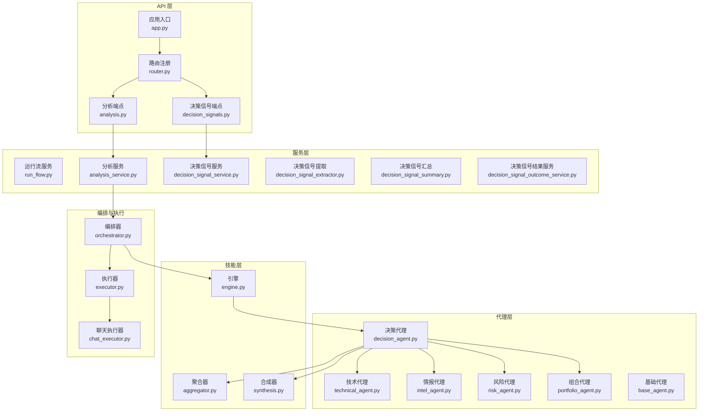
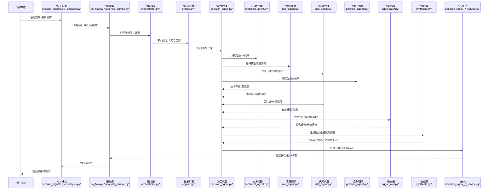
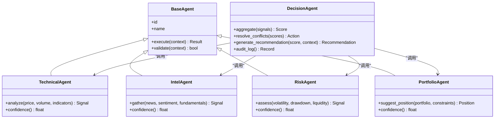
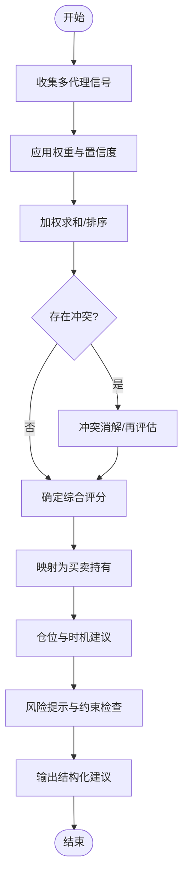
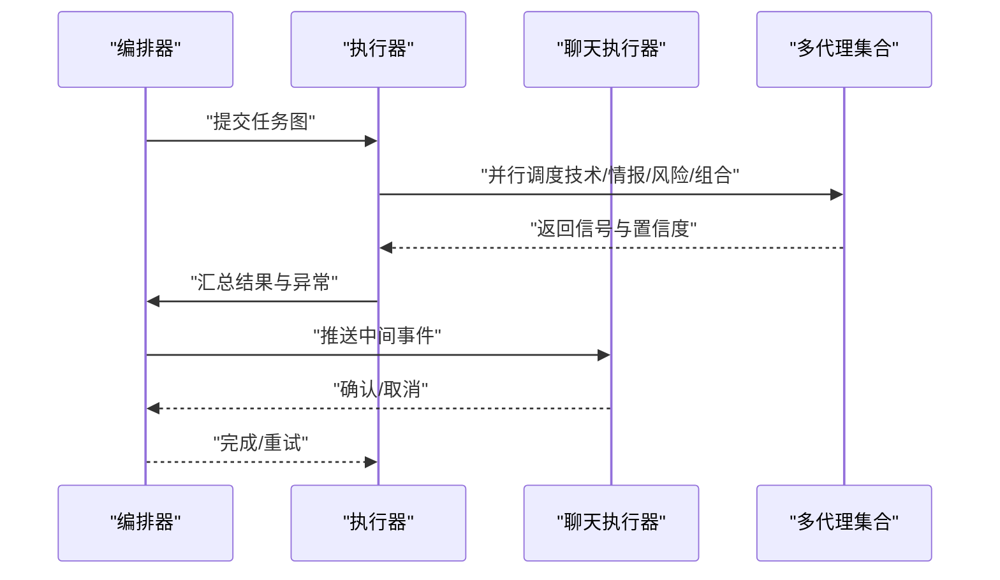
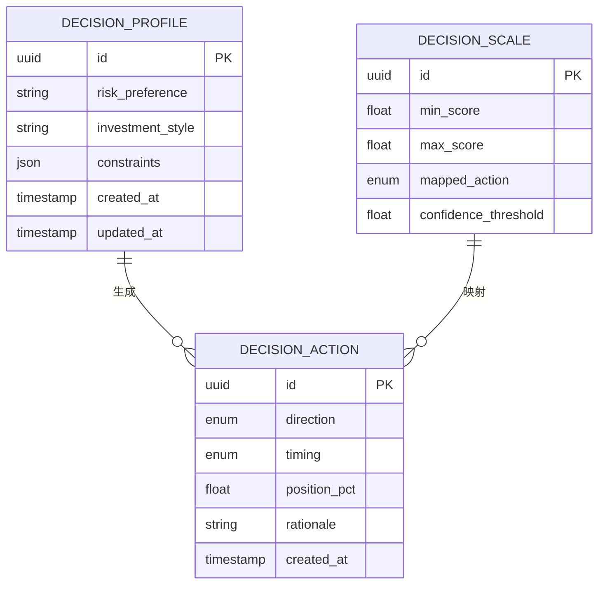
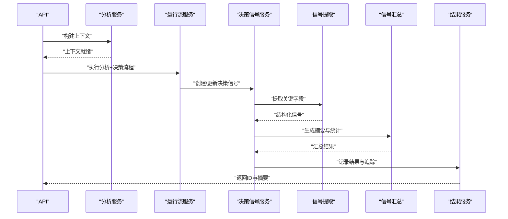
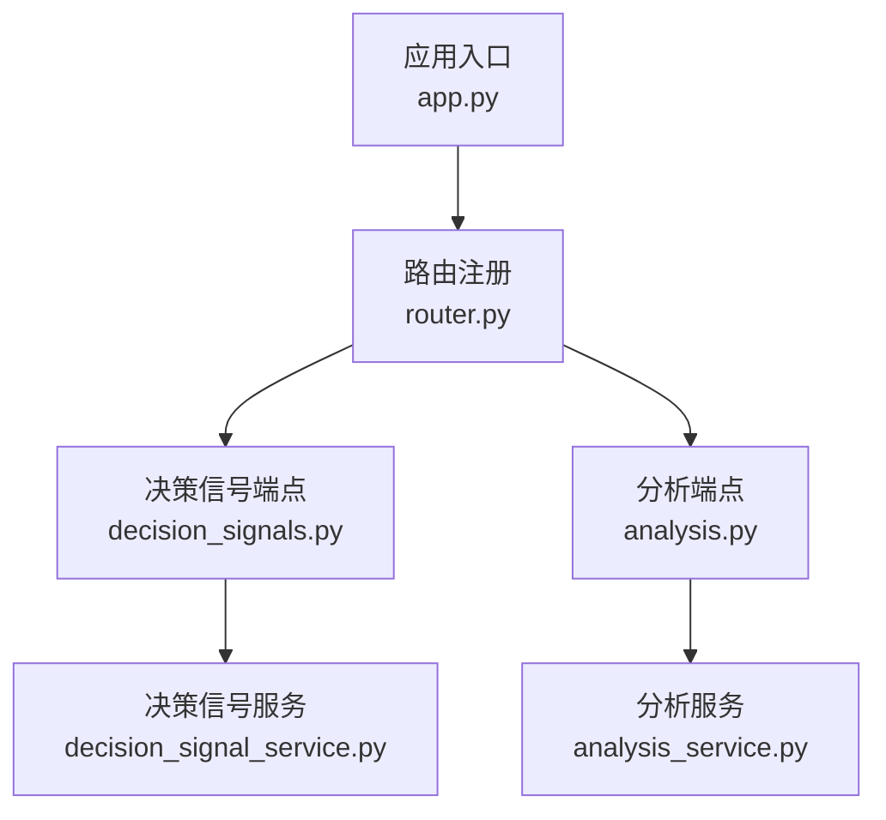
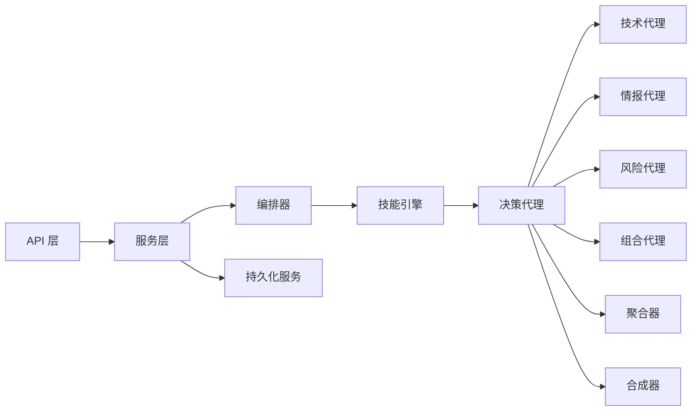

# 决策代理

<cite>
**本文档引用的文件**   
- [decision_agent.py](file://src/agent/agents/decision_agent.py)
- [base_agent.py](file://src/agent/agents/base_agent.py)
- [technical_agent.py](file://src/agent/agents/technical_agent.py)
- [intel_agent.py](file://src/agent/agents/intel_agent.py)
- [risk_agent.py](file://src/agent/agents/risk_agent.py)
- [portfolio_agent.py](file://src/agent/agents/portfolio_agent.py)
- [aggregator.py](file://src/agent/skills/aggregator.py)
- [synthesis.py](file://src/agent/skills/synthesis.py)
- [engine.py](file://src/agent/skills/engine.py)
- [orchestrator.py](file://src/agent/orchestrator.py)
- [executor.py](file://src/agent/executor.py)
- [chat_executor.py](file://src/agent/chat_executor.py)
- [final_explanation.py](file://src/agent/final_explanation.py)
- [disagreement.py](file://src/agent/disagreement.py)
- [decision_profile.py](file://src/schemas/decision_profile.py)
- [decision_action.py](file://src/schemas/decision_action.py)
- [decision_scale.py](file://src/schemas/decision_scale.py)
- [analysis_service.py](file://src/services/analysis_service.py)
- [run_flow.py](file://src/services/run_flow.py)
- [decision_signal_service.py](file://src/services/decision_signal_service.py)
- [decision_signal_extractor.py](file://src/services/decision_signal_extractor.py)
- [decision_signal_summary.py](file://src/services/decision_signal_summary.py)
- [decision_signal_outcome_service.py](file://src/services/decision_signal_outcome_service.py)
- [decision_signals.py](file://api/v1/endpoints/decision_signals.py)
- [analysis.py](file://api/v1/endpoints/analysis.py)
- [app.py](file://api/app.py)
- [router.py](file://api/v1/router.py)
- [schemas/__init__.py](file://api/v1/schemas/__init__.py)
- [schemas/decision_signals.py](file://api/v1/schemas/decision_signals.py)
- [schemas/analysis.py](file://api/v1/schemas/analysis.py)
</cite>

## 目录
1. [简介](#简介)
2. [项目结构](#项目结构)
3. [核心组件](#核心组件)
4. [架构总览](#架构总览)
5. [详细组件分析](#详细组件分析)
6. [依赖关系分析](#依赖关系分析)
7. [性能考量](#性能考量)
8. [故障排查指南](#故障排查指南)
9. [结论](#结论)
10. [附录](#附录)

## 简介
本文件面向“决策代理”模块，系统性阐述其综合分析流程、多代理结果整合、冲突解决与最终投资建议生成机制。文档覆盖以下关键主题：
- 多代理协作：技术分析、情报分析、风险评估、组合管理等专业代理的协同方式
- 决策算法：加权评分系统、置信度评估、风险提示机制
- 结构化输出：买入/卖出/持有建议、操作时机与仓位管理建议
- 个性化配置：风险偏好、投资风格匹配与约束条件处理
- 使用示例：如何获取投资决策并解读分析结果
- 可追溯性与审计：决策信号、结果追踪与日志记录

## 项目结构
决策代理位于 src/agent 目录下，围绕“代理（Agent）—技能（Skill）—编排器（Orchestrator）—执行器（Executor）”分层组织；API 层通过 v1 路由暴露接口，服务层提供业务编排与持久化能力。

图表来源
- [app.py](file://api/app.py)
- [router.py](file://api/v1/router.py)
- [decision_signals.py](file://api/v1/endpoints/decision_signals.py)
- [analysis.py](file://api/v1/endpoints/analysis.py)
- [run_flow.py](file://src/services/run_flow.py)
- [analysis_service.py](file://src/services/analysis_service.py)
- [decision_signal_service.py](file://src/services/decision_signal_service.py)
- [orchestrator.py](file://src/agent/orchestrator.py)
- [engine.py](file://src/agent/skills/engine.py)
- [decision_agent.py](file://src/agent/agents/decision_agent.py)
- [technical_agent.py](file://src/agent/agents/technical_agent.py)
- [intel_agent.py](file://src/agent/agents/intel_agent.py)
- [risk_agent.py](file://src/agent/agents/risk_agent.py)
- [portfolio_agent.py](file://src/agent/agents/portfolio_agent.py)
- [aggregator.py](file://src/agent/skills/aggregator.py)
- [synthesis.py](file://src/agent/skills/synthesis.py)
- [executor.py](file://src/agent/executor.py)
- [chat_executor.py](file://src/agent/chat_executor.py)

章节来源
- [app.py](file://api/app.py)
- [router.py](file://api/v1/router.py)
- [decision_signals.py](file://api/v1/endpoints/decision_signals.py)
- [analysis.py](file://api/v1/endpoints/analysis.py)
- [run_flow.py](file://src/services/run_flow.py)
- [analysis_service.py](file://src/services/analysis_service.py)
- [decision_signal_service.py](file://src/services/decision_signal_service.py)
- [orchestrator.py](file://src/agent/orchestrator.py)
- [engine.py](file://src/agent/skills/engine.py)
- [decision_agent.py](file://src/agent/agents/decision_agent.py)
- [technical_agent.py](file://src/agent/agents/technical_agent.py)
- [intel_agent.py](file://src/agent/agents/intel_agent.py)
- [risk_agent.py](file://src/agent/agents/risk_agent.py)
- [portfolio_agent.py](file://src/agent/agents/portfolio_agent.py)
- [aggregator.py](file://src/agent/skills/aggregator.py)
- [synthesis.py](file://src/agent/skills/synthesis.py)
- [executor.py](file://src/agent/executor.py)
- [chat_executor.py](file://src/agent/chat_executor.py)

## 核心组件
- 决策代理：作为总控，协调技术、情报、风险、组合等子代理，进行多源信息融合与最终决策生成
- 专业代理：
  - 技术代理：基于量价与技术指标生成信号
  - 情报代理：整合新闻、舆情、基本面事件等外部信息
  - 风险代理：评估波动、回撤、流动性与尾部风险
  - 组合代理：结合持仓、相关性、资金约束给出仓位建议
- 技能层：
  - 引擎：驱动代理执行与上下文装配
  - 聚合器：对多代理输出进行加权合并与冲突消解
  - 合成器：将聚合结果转化为结构化建议与解释
- 编排与执行：
  - 编排器：定义任务图、依赖与调度策略
  - 执行器：并发控制、重试与超时管理
  - 聊天执行器：面向对话式交互的执行封装

章节来源
- [decision_agent.py](file://src/agent/agents/decision_agent.py)
- [technical_agent.py](file://src/agent/agents/technical_agent.py)
- [intel_agent.py](file://src/agent/agents/intel_agent.py)
- [risk_agent.py](file://src/agent/agents/risk_agent.py)
- [portfolio_agent.py](file://src/agent/agents/portfolio_agent.py)
- [engine.py](file://src/agent/skills/engine.py)
- [aggregator.py](file://src/agent/skills/aggregator.py)
- [synthesis.py](file://src/agent/skills/synthesis.py)
- [orchestrator.py](file://src/agent/orchestrator.py)
- [executor.py](file://src/agent/executor.py)
- [chat_executor.py](file://src/agent/chat_executor.py)

## 架构总览
下图展示从 API 请求到多代理分析与最终决策输出的端到端流程。

图表来源
- [decision_signals.py](file://api/v1/endpoints/decision_signals.py)
- [analysis.py](file://api/v1/endpoints/analysis.py)
- [run_flow.py](file://src/services/run_flow.py)
- [analysis_service.py](file://src/services/analysis_service.py)
- [orchestrator.py](file://src/agent/orchestrator.py)
- [engine.py](file://src/agent/skills/engine.py)
- [decision_agent.py](file://src/agent/agents/decision_agent.py)
- [technical_agent.py](file://src/agent/agents/technical_agent.py)
- [intel_agent.py](file://src/agent/agents/intel_agent.py)
- [risk_agent.py](file://src/agent/agents/risk_agent.py)
- [portfolio_agent.py](file://src/agent/agents/portfolio_agent.py)
- [aggregator.py](file://src/agent/skills/aggregator.py)
- [synthesis.py](file://src/agent/skills/synthesis.py)
- [decision_signal_service.py](file://src/services/decision_signal_service.py)
- [decision_signal_extractor.py](file://src/services/decision_signal_extractor.py)
- [decision_signal_summary.py](file://src/services/decision_signal_summary.py)
- [decision_signal_outcome_service.py](file://src/services/decision_signal_outcome_service.py)

## 详细组件分析

### 决策代理（Decision Agent）
- 职责：统一协调各专业代理，收集多维信号，执行加权评分与冲突消解，生成最终建议
- 输入：标的代码、时间窗口、市场上下文、用户配置（风险偏好、风格、约束）
- 输出：结构化建议（方向、时机、仓位）、置信度、风险提示、依据摘要
- 关键逻辑：
  - 多源信号采集：技术、情报、风险、组合
  - 加权评分：按策略权重与动态置信度计算综合得分
  - 冲突解决：分歧检测、降级策略、再平衡
  - 建议生成：映射得分到买卖持有，结合约束确定仓位与时机
  - 审计记录：保存决策信号、过程摘要与结果

图表来源
- [base_agent.py](file://src/agent/agents/base_agent.py)
- [technical_agent.py](file://src/agent/agents/technical_agent.py)
- [intel_agent.py](file://src/agent/agents/intel_agent.py)
- [risk_agent.py](file://src/agent/agents/risk_agent.py)
- [portfolio_agent.py](file://src/agent/agents/portfolio_agent.py)
- [decision_agent.py](file://src/agent/agents/decision_agent.py)

章节来源
- [decision_agent.py](file://src/agent/agents/decision_agent.py)
- [base_agent.py](file://src/agent/agents/base_agent.py)
- [technical_agent.py](file://src/agent/agents/technical_agent.py)
- [intel_agent.py](file://src/agent/agents/intel_agent.py)
- [risk_agent.py](file://src/agent/agents/risk_agent.py)
- [portfolio_agent.py](file://src/agent/agents/portfolio_agent.py)

### 技能层：聚合器与合成器
- 聚合器：对多代理输出进行加权合并，支持动态权重调整与置信度衰减
- 合成器：将聚合结果转换为结构化建议，包含方向、时机、仓位与风险提示
- 关键特性：
  - 加权评分：按策略权重与历史表现自适应更新
  - 冲突消解：识别分歧、触发再评估或降级规则
  - 结构化输出：标准化建议格式，便于前端展示与下游消费

图表来源
- [aggregator.py](file://src/agent/skills/aggregator.py)
- [synthesis.py](file://src/agent/skills/synthesis.py)

章节来源
- [aggregator.py](file://src/agent/skills/aggregator.py)
- [synthesis.py](file://src/agent/skills/synthesis.py)

### 编排与执行：Orchestrator、Executor、ChatExecutor
- 编排器：定义任务依赖、并发度与重试策略，确保多代理并行执行与结果汇聚
- 执行器：负责实际的任务调度、错误处理与资源清理
- 聊天执行器：封装对话式调用，支持流式事件与中间状态反馈

图表来源
- [orchestrator.py](file://src/agent/orchestrator.py)
- [executor.py](file://src/agent/executor.py)
- [chat_executor.py](file://src/agent/chat_executor.py)

章节来源
- [orchestrator.py](file://src/agent/orchestrator.py)
- [executor.py](file://src/agent/executor.py)
- [chat_executor.py](file://src/agent/chat_executor.py)

### 数据模型与配置：决策画像、动作与量表
- 决策画像：定义风险偏好、投资风格、约束条件（最大仓位、止损止盈、行业限制等）
- 决策动作：标准化输出方向（买入/卖出/持有）、时机（立即/分批/观望）、仓位比例
- 决策量表：评分刻度与阈值映射，用于统一不同代理的输出尺度

图表来源
- [decision_profile.py](file://src/schemas/decision_profile.py)
- [decision_action.py](file://src/schemas/decision_action.py)
- [decision_scale.py](file://src/schemas/decision_scale.py)

章节来源
- [decision_profile.py](file://src/schemas/decision_profile.py)
- [decision_action.py](file://src/schemas/decision_action.py)
- [decision_scale.py](file://src/schemas/decision_scale.py)

### 服务层：分析、运行流与决策信号
- 分析服务：构建分析上下文、加载数据、准备提示与工具
- 运行流服务：串联分析、决策、回测与通知等步骤
- 决策信号服务：持久化决策信号、提取关键要素、汇总统计与结果跟踪

图表来源
- [analysis_service.py](file://src/services/analysis_service.py)
- [run_flow.py](file://src/services/run_flow.py)
- [decision_signal_service.py](file://src/services/decision_signal_service.py)
- [decision_signal_extractor.py](file://src/services/decision_signal_extractor.py)
- [decision_signal_summary.py](file://src/services/decision_signal_summary.py)
- [decision_signal_outcome_service.py](file://src/services/decision_signal_outcome_service.py)

章节来源
- [analysis_service.py](file://src/services/analysis_service.py)
- [run_flow.py](file://src/services/run_flow.py)
- [decision_signal_service.py](file://src/services/decision_signal_service.py)
- [decision_signal_extractor.py](file://src/services/decision_signal_extractor.py)
- [decision_signal_summary.py](file://src/services/decision_signal_summary.py)
- [decision_signal_outcome_service.py](file://src/services/decision_signal_outcome_service.py)

### API 层：决策信号与分析接口
- 决策信号端点：接收分析请求，返回决策信号与建议
- 分析端点：提供通用分析能力，供前端或外部系统调用
- 路由与应用：统一注册路由、挂载中间件与错误处理

图表来源
- [router.py](file://api/v1/router.py)
- [app.py](file://api/app.py)
- [decision_signals.py](file://api/v1/endpoints/decision_signals.py)
- [analysis.py](file://api/v1/endpoints/analysis.py)
- [decision_signal_service.py](file://src/services/decision_signal_service.py)
- [analysis_service.py](file://src/services/analysis_service.py)

章节来源
- [router.py](file://api/v1/router.py)
- [app.py](file://api/app.py)
- [decision_signals.py](file://api/v1/endpoints/decision_signals.py)
- [analysis.py](file://api/v1/endpoints/analysis.py)

## 依赖关系分析
- 低耦合高内聚：代理层专注于各自领域分析，通过聚合器与合成器解耦
- 明确接口契约：服务层与 API 层通过 Pydantic 模型与 Schema 保证一致性
- 可扩展性：新增代理只需实现基础接口并通过引擎注册即可接入
- 潜在循环依赖：需避免代理与服务之间的双向引用，建议使用事件或消息队列

图表来源
- [app.py](file://api/app.py)
- [router.py](file://api/v1/router.py)
- [decision_signals.py](file://api/v1/endpoints/decision_signals.py)
- [analysis.py](file://api/v1/endpoints/analysis.py)
- [run_flow.py](file://src/services/run_flow.py)
- [analysis_service.py](file://src/services/analysis_service.py)
- [orchestrator.py](file://src/agent/orchestrator.py)
- [engine.py](file://src/agent/skills/engine.py)
- [decision_agent.py](file://src/agent/agents/decision_agent.py)
- [technical_agent.py](file://src/agent/agents/technical_agent.py)
- [intel_agent.py](file://src/agent/agents/intel_agent.py)
- [risk_agent.py](file://src/agent/agents/risk_agent.py)
- [portfolio_agent.py](file://src/agent/agents/portfolio_agent.py)
- [aggregator.py](file://src/agent/skills/aggregator.py)
- [synthesis.py](file://src/agent/skills/synthesis.py)

章节来源
- [app.py](file://api/app.py)
- [router.py](file://api/v1/router.py)
- [decision_signals.py](file://api/v1/endpoints/decision_signals.py)
- [analysis.py](file://api/v1/endpoints/analysis.py)
- [run_flow.py](file://src/services/run_flow.py)
- [analysis_service.py](file://src/services/analysis_service.py)
- [orchestrator.py](file://src/agent/orchestrator.py)
- [engine.py](file://src/agent/skills/engine.py)
- [decision_agent.py](file://src/agent/agents/decision_agent.py)
- [technical_agent.py](file://src/agent/agents/technical_agent.py)
- [intel_agent.py](file://src/agent/agents/intel_agent.py)
- [risk_agent.py](file://src/agent/agents/risk_agent.py)
- [portfolio_agent.py](file://src/agent/agents/portfolio_agent.py)
- [aggregator.py](file://src/agent/skills/aggregator.py)
- [synthesis.py](file://src/agent/skills/synthesis.py)

## 性能考量
- 并发调度：多代理并行执行，减少端到端延迟
- 缓存与预取：行情与情报数据预取，降低重复 IO
- 权重自适应：根据历史表现动态调整策略权重，提升稳定性
- 超时与重试：关键路径设置超时与重试，增强鲁棒性
- 内存与序列化：大对象序列化优化，避免频繁 GC

[本节为通用指导，不直接分析具体文件]

## 故障排查指南
- 常见问题：
  - 数据源不可用：检查数据抓取器与健康检查端点
  - 代理执行失败：查看执行器日志与重试策略
  - 冲突未解决：检查聚合器冲突消解规则与置信度阈值
  - 建议不符合约束：核对决策画像与约束条件
- 调试建议：
  - 启用详细日志与事件流
  - 使用测试用例验证单代理与端到端流程
  - 通过 API 回放与快照对比定位问题

章节来源
- [executor.py](file://src/agent/executor.py)
- [aggregator.py](file://src/agent/skills/aggregator.py)
- [decision_profile.py](file://src/schemas/decision_profile.py)

## 结论
决策代理通过多代理协作、加权评分与冲突消解，形成稳健的投资建议生成体系。其模块化设计便于扩展与维护，配合服务层与 API 层提供完整的端到端能力。建议在持续迭代中强化数据质量监控、策略回测与审计追踪，以提升决策的可解释性与可靠性。

[本节为总结性内容，不直接分析具体文件]

## 附录
- 使用示例（概念性流程）：
  - 调用分析端点，传入标的代码、时间窗口与用户配置
  - 服务层构建上下文并编排多代理执行
  - 决策代理聚合结果并生成结构化建议
  - 返回建议、置信度与风险提示，同时持久化决策信号
- 解读建议：
  - 方向：买入/卖出/持有
  - 时机：立即/分批/观望
  - 仓位：目标仓位比例与分批计划
  - 风险：主要风险因素与应对建议

[本节为概念性说明，不直接分析具体文件]