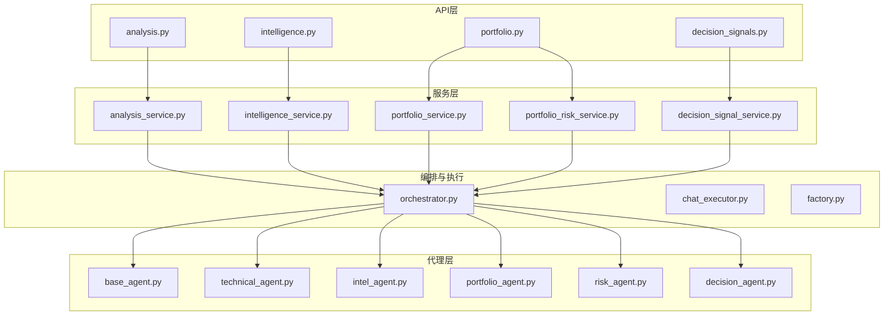
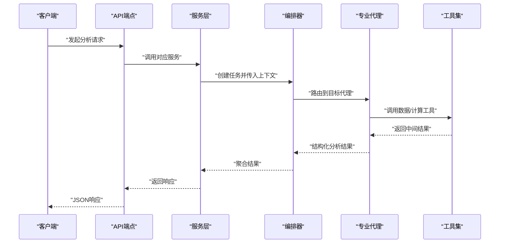
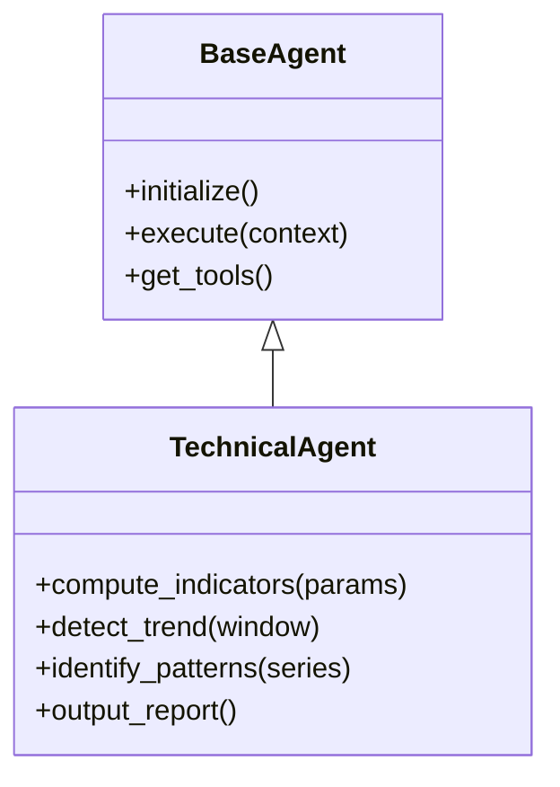
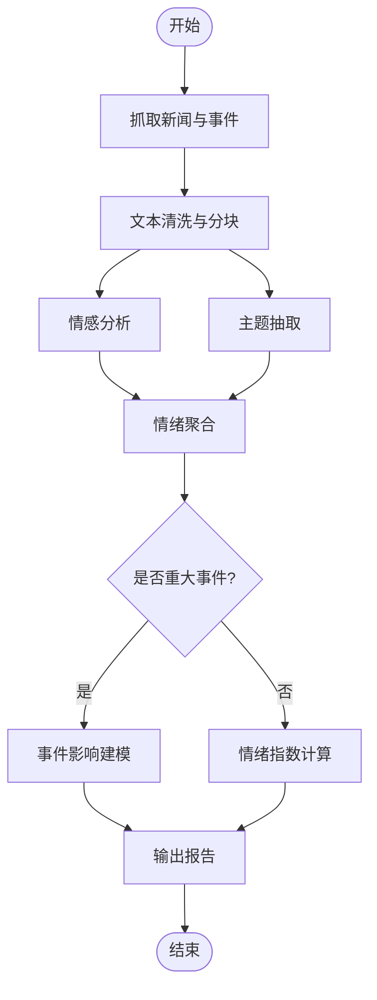
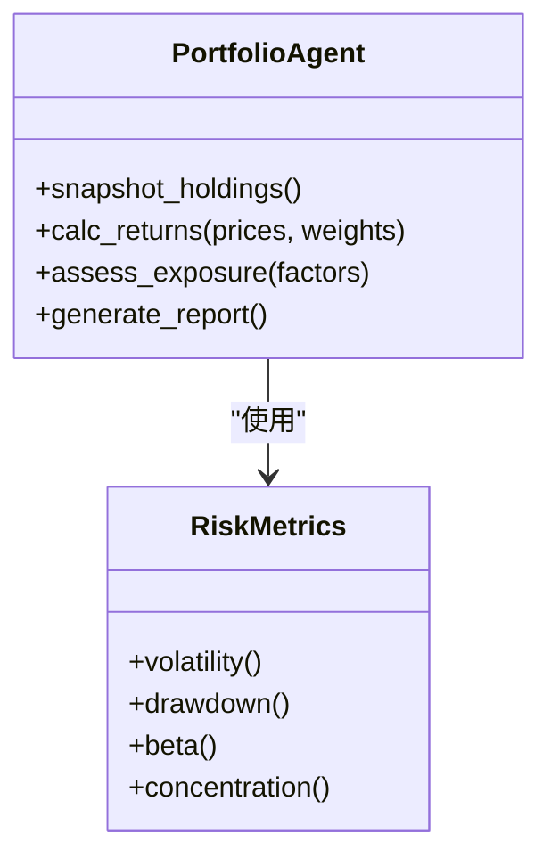
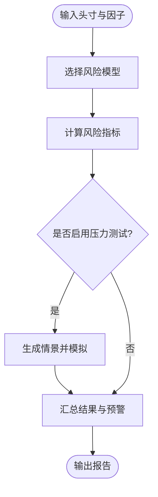
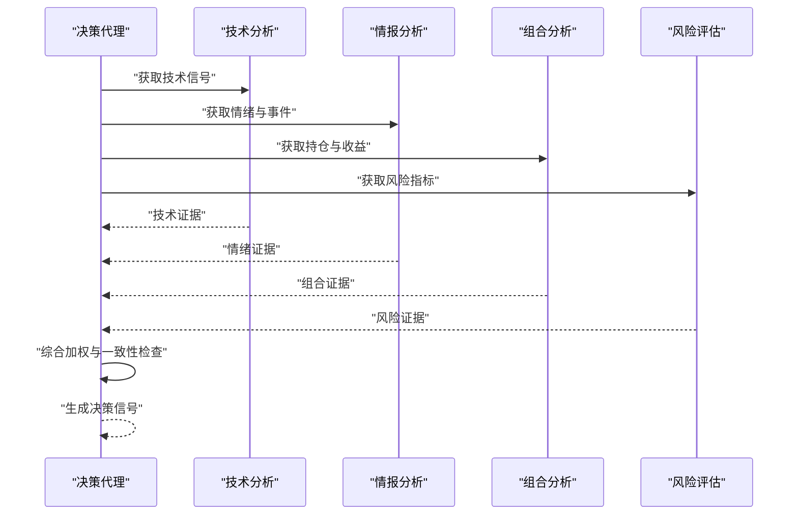
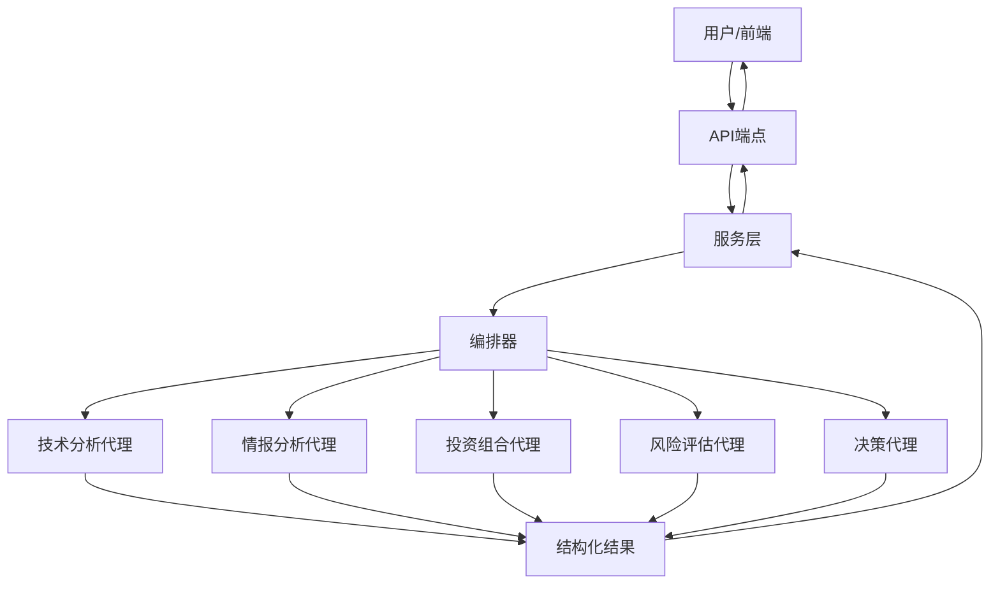
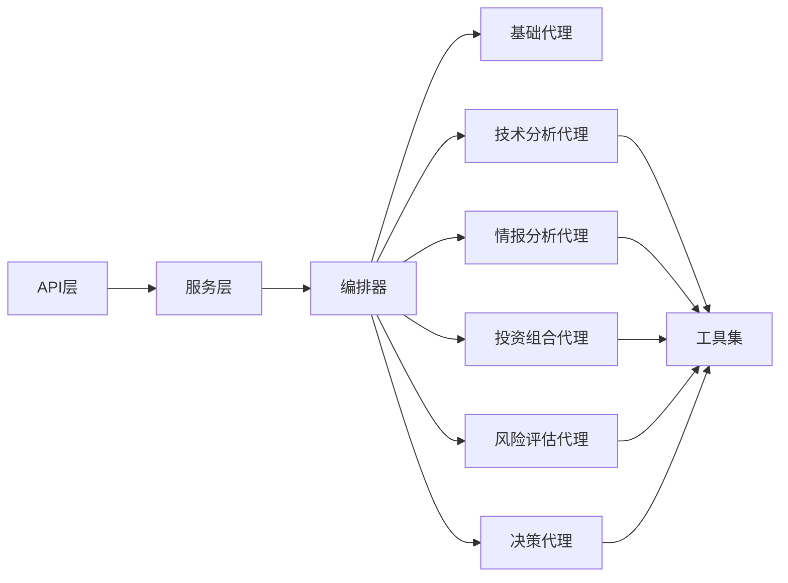

# 分析代理

<cite>
**本文引用的文件**   
- [src/agent/agents/base_agent.py](file://src/agent/agents/base_agent.py)
- [src/agent/agents/technical_agent.py](file://src/agent/agents/technical_agent.py)
- [src/agent/agents/intel_agent.py](file://src/agent/agents/intel_agent.py)
- [src/agent/agents/portfolio_agent.py](file://src/agent/agents/portfolio_agent.py)
- [src/agent/agents/risk_agent.py](file://src/agent/agents/risk_agent.py)
- [src/agent/agents/decision_agent.py](file://src/agent/agents/decision_agent.py)
- [src/agent/orchestrator.py](file://src/agent/orchestrator.py)
- [src/agent/factory.py](file://src/agent/factory.py)
- [src/agent/chat_executor.py](file://src/agent/chat_executor.py)
- [src/services/analysis_service.py](file://src/services/analysis_service.py)
- [src/services/intelligence_service.py](file://src/services/intelligence_service.py)
- [src/services/portfolio_service.py](file://src/services/portfolio_service.py)
- [src/services/portfolio_risk_service.py](file://src/services/portfolio_risk_service.py)
- [src/services/decision_signal_service.py](file://src/services/decision_signal_service.py)
- [api/v1/endpoints/analysis.py](file://api/v1/endpoints/analysis.py)
- [api/v1/endpoints/intelligence.py](file://api/v1/endpoints/intelligence.py)
- [api/v1/endpoints/portfolio.py](file://api/v1/endpoints/portfolio.py)
- [api/v1/endpoints/decision_signals.py](file://api/v1/endpoints/decision_signals.py)
- [api/v1/schemas/analysis.py](file://api/v1/schemas/analysis.py)
- [api/v1/schemas/intelligence.py](file://api/v1/schemas/intelligence.py)
- [api/v1/schemas/portfolio.py](file://api/v1/schemas/portfolio.py)
- [api/v1/schemas/decision_signals.py](file://api/v1/schemas/decision_signals.py)
</cite>

## 目录
1. [简介](#简介)
2. [项目结构](#项目结构)
3. [核心组件](#核心组件)
4. [架构总览](#架构总览)
5. [详细组件分析](#详细组件分析)
6. [依赖关系分析](#依赖关系分析)
7. [性能考量](#性能考量)
8. [故障排查指南](#故障排查指南)
9. [结论](#结论)
10. [附录](#附录)

## 简介
本文件面向“分析代理”子系统，系统性阐述技术分析代理、情报分析代理、投资组合代理、风险评估代理与决策代理的职责边界、工作原理、输入输出规范、配置参数与优化建议，并提供端到端组合使用示例。该子系统通过统一的编排器与服务层暴露API，支持多源数据接入、指标计算、情绪与事件驱动分析、风险度量与压力测试，以及最终的综合决策信号生成。

## 项目结构
分析代理相关代码主要分布在以下模块：
- 代理实现：位于 src/agent/agents，包含基础代理抽象与各专业代理（技术、情报、组合、风险、决策）。
- 编排与执行：src/agent/orchestrator.py、src/agent/chat_executor.py、src/agent/factory.py 负责调度、上下文构建与工具注入。
- 服务层：src/services 提供业务编排能力，如分析服务、情报服务、组合服务、风险服务与决策信号服务。
- API层：api/v1/endpoints 与 api/v1/schemas 定义REST接口与请求/响应模型。

图表来源
- [api/v1/endpoints/analysis.py](file://api/v1/endpoints/analysis.py)
- [api/v1/endpoints/intelligence.py](file://api/v1/endpoints/intelligence.py)
- [api/v1/endpoints/portfolio.py](file://api/v1/endpoints/portfolio.py)
- [api/v1/endpoints/decision_signals.py](file://api/v1/endpoints/decision_signals.py)
- [src/services/analysis_service.py](file://src/services/analysis_service.py)
- [src/services/intelligence_service.py](file://src/services/intelligence_service.py)
- [src/services/portfolio_service.py](file://src/services/portfolio_service.py)
- [src/services/portfolio_risk_service.py](file://src/services/portfolio_risk_service.py)
- [src/services/decision_signal_service.py](file://src/services/decision_signal_service.py)
- [src/agent/orchestrator.py](file://src/agent/orchestrator.py)
- [src/agent/chat_executor.py](file://src/agent/chat_executor.py)
- [src/agent/factory.py](file://src/agent/factory.py)
- [src/agent/agents/base_agent.py](file://src/agent/agents/base_agent.py)
- [src/agent/agents/technical_agent.py](file://src/agent/agents/technical_agent.py)
- [src/agent/agents/intel_agent.py](file://src/agent/agents/intel_agent.py)
- [src/agent/agents/portfolio_agent.py](file://src/agent/agents/portfolio_agent.py)
- [src/agent/agents/risk_agent.py](file://src/agent/agents/risk_agent.py)
- [src/agent/agents/decision_agent.py](file://src/agent/agents/decision_agent.py)

章节来源
- [src/agent/agents/base_agent.py](file://src/agent/agents/base_agent.py)
- [src/agent/orchestrator.py](file://src/agent/orchestrator.py)
- [src/agent/factory.py](file://src/agent/factory.py)
- [src/agent/chat_executor.py](file://src/agent/chat_executor.py)
- [api/v1/endpoints/analysis.py](file://api/v1/endpoints/analysis.py)
- [api/v1/endpoints/intelligence.py](file://api/v1/endpoints/intelligence.py)
- [api/v1/endpoints/portfolio.py](file://api/v1/endpoints/portfolio.py)
- [api/v1/endpoints/decision_signals.py](file://api/v1/endpoints/decision_signals.py)

## 核心组件
- 技术分析代理：负责技术指标计算、趋势分析与形态识别，为后续分析提供量化依据。
- 情报分析代理：整合新闻与事件信息，进行情感分析与市场情绪评估，并做事件驱动分析。
- 投资组合代理：维护持仓快照、计算收益与归因、评估风险敞口与集中度。
- 风险评估代理：基于统计与情景方法度量风险，支持压力测试与回测联动。
- 决策代理：综合技术、情报、组合与风险信息，生成可执行的决策信号与建议。

章节来源
- [src/agent/agents/technical_agent.py](file://src/agent/agents/technical_agent.py)
- [src/agent/agents/intel_agent.py](file://src/agent/agents/intel_agent.py)
- [src/agent/agents/portfolio_agent.py](file://src/agent/agents/portfolio_agent.py)
- [src/agent/agents/risk_agent.py](file://src/agent/agents/risk_agent.py)
- [src/agent/agents/decision_agent.py](file://src/agent/agents/decision_agent.py)

## 架构总览
系统采用“API -> 服务层 -> 编排器 -> 代理”的分层架构。API层接收请求并校验参数；服务层编排业务逻辑；编排器根据任务类型选择相应代理并注入工具与上下文；各代理专注自身领域，产出结构化结果供上层聚合或持久化。

图表来源
- [api/v1/endpoints/analysis.py](file://api/v1/endpoints/analysis.py)
- [src/services/analysis_service.py](file://src/services/analysis_service.py)
- [src/agent/orchestrator.py](file://src/agent/orchestrator.py)
- [src/agent/agents/technical_agent.py](file://src/agent/agents/technical_agent.py)

## 详细组件分析

### 技术分析代理
职责
- 技术指标计算：均线、动量、波动率、成交量等常用指标。
- 趋势分析：趋势方向、强度与阶段判定。
- 形态识别：K线形态、支撑阻力位、突破与回踩模式。

输入输出
- 输入：标的代码、时间窗口、频率、指标参数集合、过滤条件。
- 输出：指标序列、趋势标签、形态事件列表、置信度评分。

配置参数
- 指标开关与参数范围（如周期、阈值）。
- 形态识别规则库版本与灵敏度。
- 数据源与缓存策略。

性能优化
- 批量计算与向量化处理。
- 增量更新与滑动窗口缓存。
- 并行拉取历史数据与指标计算流水线。

图表来源
- [src/agent/agents/base_agent.py](file://src/agent/agents/base_agent.py)
- [src/agent/agents/technical_agent.py](file://src/agent/agents/technical_agent.py)

章节来源
- [src/agent/agents/technical_agent.py](file://src/agent/agents/technical_agent.py)
- [src/agent/tools/analysis_tools.py](file://src/agent/tools/analysis_tools.py)

### 情报分析代理
职责
- 新闻情感分析：对新闻标题与正文进行情感打分与主题抽取。
- 市场情绪评估：结合搜索与社交信号，形成情绪指数。
- 事件驱动分析：重大事件影响评估与短期冲击建模。

输入输出
- 输入：关键词、时间范围、新闻源配置、情绪权重。
- 输出：情感得分、主题分布、事件清单、情绪指数与趋势。

配置参数
- 新闻源与搜索引擎配置。
- 情感模型与阈值。
- 事件分类与影响等级映射。

性能优化
- 并发抓取与去重。
- 文本预处理缓存与向量检索加速。
- 流式处理大文本与分块分析。

图表来源
- [src/agent/agents/intel_agent.py](file://src/agent/agents/intel_agent.py)
- [src/services/intelligence_service.py](file://src/services/intelligence_service.py)

章节来源
- [src/agent/agents/intel_agent.py](file://src/agent/agents/intel_agent.py)
- [src/services/intelligence_service.py](file://src/services/intelligence_service.py)

### 投资组合代理
职责
- 持仓分析：按资产类别、行业、地域维度拆解持仓结构与权重。
- 收益计算：日频/周频/月频收益、累计收益、年化收益与回撤。
- 风险敞口评估：Beta、久期、行业集中度、流动性与杠杆暴露。

输入输出
- 输入：持仓快照、基准、价格序列、汇率与分红数据。
- 输出：收益曲线、风险指标、归因结果、敞口热力图。

配置参数
- 基准与再平衡规则。
- 风险因子与权重矩阵。
- 数据质量与缺失值处理策略。

性能优化
- 向量化收益与风险计算。
- 增量归因与滚动窗口优化。
- 缓存高频因子与中间结果。

图表来源
- [src/agent/agents/portfolio_agent.py](file://src/agent/agents/portfolio_agent.py)
- [src/services/portfolio_service.py](file://src/services/portfolio_service.py)

章节来源
- [src/agent/agents/portfolio_agent.py](file://src/agent/agents/portfolio_agent.py)
- [src/services/portfolio_service.py](file://src/services/portfolio_service.py)

### 风险评估代理
职责
- 风险度量：VaR、CVaR、最大回撤、波动率聚类、相关性断裂检测。
- 压力测试：宏观冲击、流动性枯竭、尾部事件情景模拟。
- 回测联动：与策略回测引擎对接，评估极端条件下的表现。

输入输出
- 输入：头寸、因子暴露、历史序列、情景参数。
- 输出：风险指标、压力测试结果、敏感性分析、预警信号。

配置参数
- 风险模型选择与参数校准。
- 情景模板与冲击幅度。
- 置信水平与回看窗口。

性能优化
- Monte Carlo并行采样。
- 因子协方差矩阵近似与降维。
- 增量VaR与滚动压力测试。

图表来源
- [src/agent/agents/risk_agent.py](file://src/agent/agents/risk_agent.py)
- [src/services/portfolio_risk_service.py](file://src/services/portfolio_risk_service.py)

章节来源
- [src/agent/agents/risk_agent.py](file://src/agent/agents/risk_agent.py)
- [src/services/portfolio_risk_service.py](file://src/services/portfolio_risk_service.py)

### 决策代理
职责
- 综合分析：融合技术、情报、组合与风险信息，形成多维证据链。
- 建议生成：给出买入/持有/卖出建议、仓位调整与风控措施。
- 信号管理：输出结构化决策信号，支持回测与追踪。

输入输出
- 输入：各代理输出摘要、当前市场环境、约束条件。
- 输出：决策信号、理由说明、置信度、触发条件与退出策略。

配置参数
- 权重分配与投票机制。
- 信号阈值与稳定性过滤。
- 风险预算与合规约束。

性能优化
- 异步聚合与短路评估。
- 缓存中间证据与相似度匹配。
- 分层推理减少LLM调用次数。

图表来源
- [src/agent/agents/decision_agent.py](file://src/agent/agents/decision_agent.py)
- [src/services/decision_signal_service.py](file://src/services/decision_signal_service.py)

章节来源
- [src/agent/agents/decision_agent.py](file://src/agent/agents/decision_agent.py)
- [src/services/decision_signal_service.py](file://src/services/decision_signal_service.py)

### 概念总览
下图展示从API到代理的端到端流程，便于非技术读者理解整体工作方式。

[本图为概念性流程图，不直接映射具体源码文件]

## 依赖关系分析
- 代理间耦合：决策代理依赖其他四类代理的输出，属于强聚合角色；其他代理相对独立，仅通过编排器协调。
- 服务层解耦：服务层屏蔽代理细节，对外提供统一接口，降低API与实现的耦合。
- 外部依赖：数据源、LLM后端、存储与消息通道通过工具层与配置注册表注入。

图表来源
- [src/agent/orchestrator.py](file://src/agent/orchestrator.py)
- [src/agent/factory.py](file://src/agent/factory.py)
- [src/agent/chat_executor.py](file://src/agent/chat_executor.py)

章节来源
- [src/agent/orchestrator.py](file://src/agent/orchestrator.py)
- [src/agent/factory.py](file://src/agent/factory.py)
- [src/agent/chat_executor.py](file://src/agent/chat_executor.py)

## 性能考量
- 计算密集型：技术指标与风险指标应优先使用向量化与并行化，避免逐条循环。
- I/O密集：新闻抓取与行情拉取需设置超时、重试与熔断，配合缓存与增量更新。
- LLM调用：在决策代理中尽量复用上下文与缓存相似证据，减少重复推理。
- 内存管理：大对象（如历史序列）采用分块与惰性加载，及时释放中间结果。
- 监控与可观测性：关键路径埋点与指标上报，定位瓶颈与异常。

[本节为通用指导，不直接分析具体文件]

## 故障排查指南
常见问题与定位要点：
- 数据源不可用：检查网络连通、认证与限流策略，查看错误日志与重试计数。
- 指标异常：核对参数范围与数据类型，确认缺失值填充与对齐方式。
- 情绪偏差：验证文本清洗与分词效果，检查情感模型版本与阈值。
- 风险失真：复核协方差矩阵正定性、因子暴露准确性与情景合理性。
- 决策不稳定：检查权重与阈值设置，增加稳定性过滤与一致性校验。

章节来源
- [api/v1/endpoints/analysis.py](file://api/v1/endpoints/analysis.py)
- [api/v1/endpoints/intelligence.py](file://api/v1/endpoints/intelligence.py)
- [api/v1/endpoints/portfolio.py](file://api/v1/endpoints/portfolio.py)
- [api/v1/endpoints/decision_signals.py](file://api/v1/endpoints/decision_signals.py)

## 结论
分析代理体系以清晰的分层与模块化设计，将复杂的多源分析与决策过程解耦为可维护、可扩展的组件。通过合理的配置与优化策略，可在保证准确性的同时提升吞吐与稳定性。建议在上线前完成充分的回归测试与压力测试，确保各代理协同稳定。

[本节为总结性内容，不直接分析具体文件]

## 附录

### API与Schema参考
- 技术分析API：请求包含标的、时间窗口与指标参数；响应包含指标序列、趋势与形态事件。
- 情报分析API：请求包含关键词、时间范围与源配置；响应包含情感得分、主题与事件清单。
- 投资组合API：请求包含持仓快照与基准；响应包含收益曲线、风险指标与归因。
- 决策信号API：请求包含各代理摘要与约束；响应包含信号、置信度与触发条件。

章节来源
- [api/v1/schemas/analysis.py](file://api/v1/schemas/analysis.py)
- [api/v1/schemas/intelligence.py](file://api/v1/schemas/intelligence.py)
- [api/v1/schemas/portfolio.py](file://api/v1/schemas/portfolio.py)
- [api/v1/schemas/decision_signals.py](file://api/v1/schemas/decision_signals.py)

### 实际使用示例（组合分析）
- 场景一：单标的技术分析+情报评估
  - 步骤：调用技术分析API获取趋势与形态，调用情报API获取情绪与事件，最后由决策代理生成信号。
- 场景二：组合视角的风险与决策
  - 步骤：提交持仓快照至组合服务，计算收益与风险；结合技术与情报结果，由决策代理输出调仓建议。
- 场景三：压力测试与回测联动
  - 步骤：在风险评估代理中设定情景参数，运行压力测试；将结果反馈至决策代理，生成稳健型建议。

[本节为概念性示例，不直接分析具体文件]