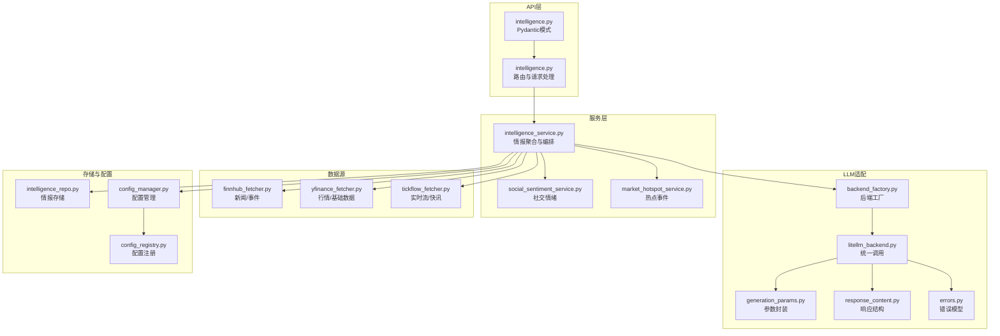
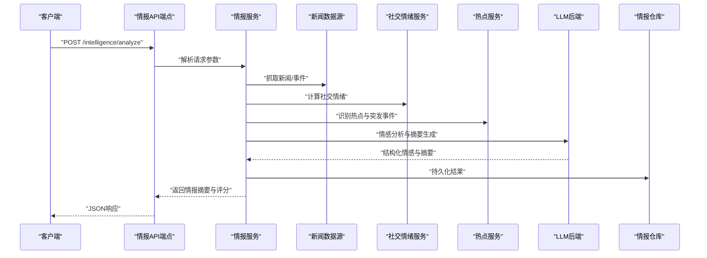
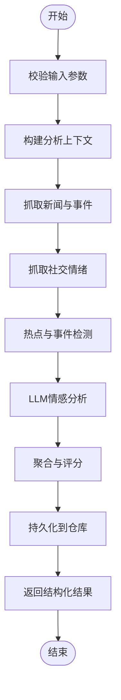
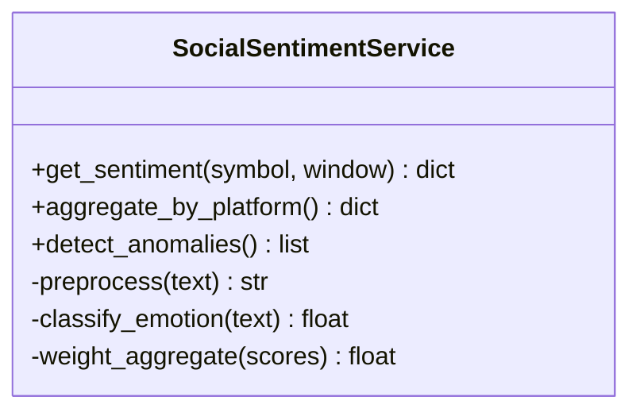
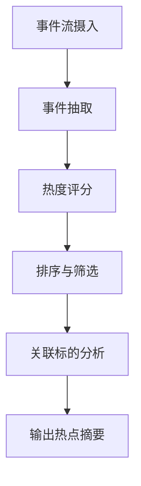
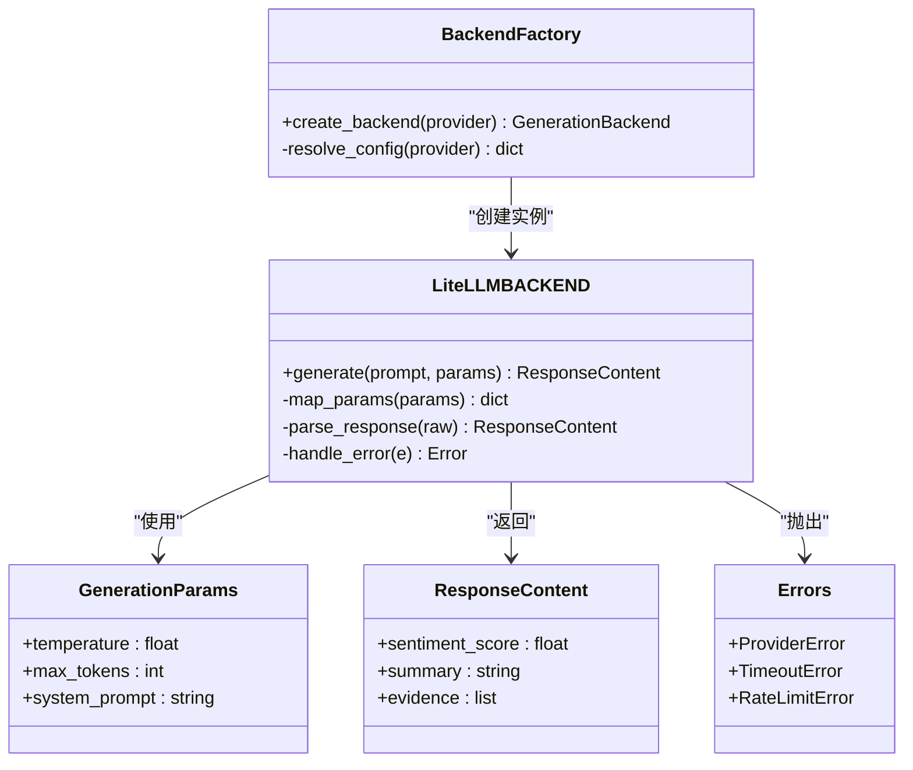
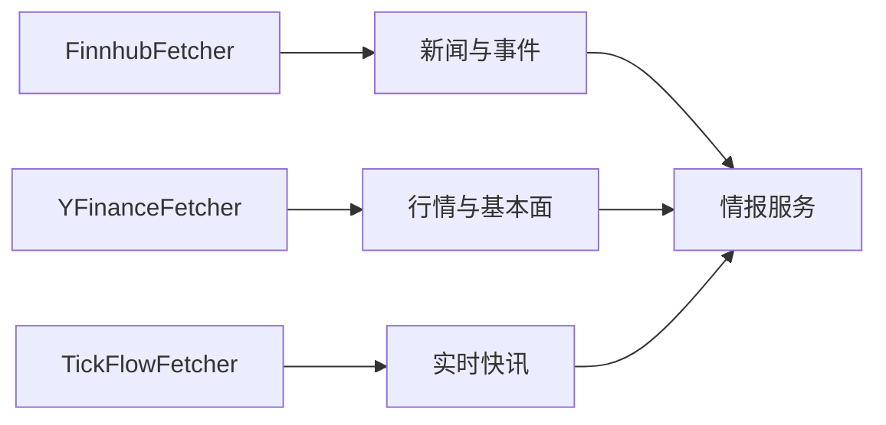
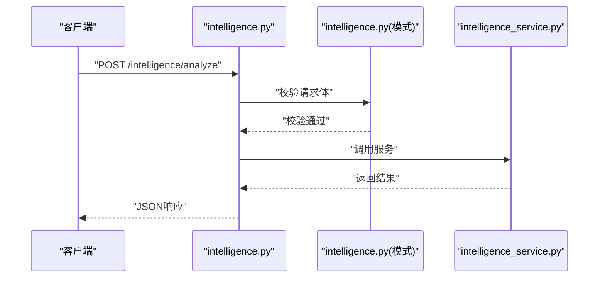
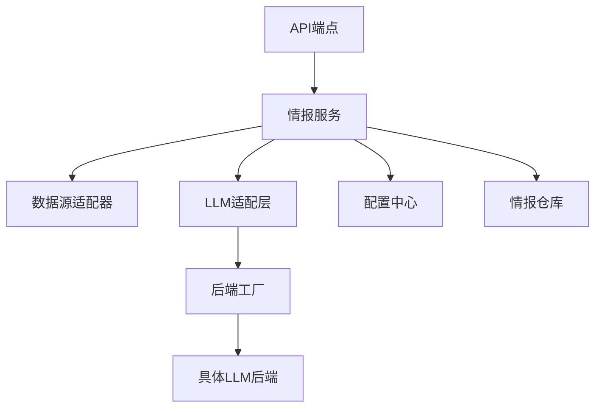

# 情报分析代理

<cite>
**本文引用的文件**
- [src/agent/agents/intel_agent.py](file://src/agent/agents/intel_agent.py)
- [src/services/intelligence_service.py](file://src/services/intelligence_service.py)
- [api/v1/endpoints/intelligence.py](file://api/v1/endpoints/intelligence.py)
- [api/v1/schemas/intelligence.py](file://api/v1/schemas/intelligence.py)
- [src/services/social_sentiment_service.py](file://src/services/social_sentiment_service.py)
- [src/services/market_hotspot_service.py](file://src/services/market_hotspot_service.py)
- [src/data_provider/tickflow_fetcher.py](file://src/data_provider/tickflow_fetcher.py)
- [src/data_provider/finnhub_fetcher.py](file://src/data_provider/finnhub_fetcher.py)
- [src/data_provider/yfinance_fetcher.py](file://src/data_provider/yfinance_fetcher.py)
- [src/repositories/intelligence_repo.py](file://src/repositories/intelligence_repo.py)
- [src/core/config_manager.py](file://src/core/config_manager.py)
- [src/core/config_registry.py](file://src/core/config_registry.py)
- [src/llm/backend_factory.py](file://src/llm/backend_factory.py)
- [src/llm/litellm_backend.py](file://src/llm/litellm_backend.py)
- [src/llm/generation_params.py](file://src/llm/generation_params.py)
- [src/llm/response_content.py](file://src/llm/response_content.py)
- [src/llm/errors.py](file://src/llm/errors.py)
- [src/logging_config.py](file://src/logging_config.py)
- [tests/test_intelligence_api.py](file://tests/test_intelligence_api.py)
- [tests/test_intelligence_service.py](file://tests/test_intelligence_service.py)
- [tests/test_news_intel.py](file://tests/test_news_intel.py)
- [tests/test_social_sentiment_service.py](file://tests/test_social_sentiment_service.py)
</cite>

## 目录
1. [简介](#简介)
2. [项目结构](#项目结构)
3. [核心组件](#核心组件)
4. [架构总览](#架构总览)
5. [详细组件分析](#详细组件分析)
6. [依赖关系分析](#依赖关系分析)
7. [性能考量](#性能考量)
8. [故障排查指南](#故障排查指南)
9. [结论](#结论)
10. [附录](#附录)

## 简介
本文件面向“情报分析代理”的完整技术文档，聚焦以下目标：
- 解释新闻情感分析、市场情绪评估与事件驱动分析机制的工作原理
- 说明如何集成多种情报源（财经新闻、社交媒体数据、分析师报告）
- 阐述情感分析算法（正面、负面、中立识别）的实现思路与配置
- 描述突发事件与市场热点的处理流程及实时情报摘要生成
- 提供配置选项（情报源选择、关键词过滤、情感阈值等）
- 给出实际使用示例（获取与分析特定股票的情报信息）
- 包含情报准确性评估与数据来源验证方法

## 项目结构
本项目采用分层与模块化设计，围绕“API层—服务层—数据提供者—LLM适配层—存储与配置”组织代码。与情报分析代理直接相关的核心路径包括：
- API 路由与模式定义：api/v1/endpoints/intelligence.py, api/v1/schemas/intelligence.py
- 代理服务：src/services/intelligence_service.py, src/services/social_sentiment_service.py, src/services/market_hotspot_service.py
- 数据源接入：src/data_provider/*（如 finnhub_fetcher.py, yfinance_fetcher.py, tickflow_fetcher.py）
- LLM 适配与生成：src/llm/*（backend_factory.py, litellm_backend.py, generation_params.py, response_content.py, errors.py）
- 持久化与配置：src/repositories/intelligence_repo.py, src/core/config_manager.py, src/core/config_registry.py
- 日志与可观测性：src/logging_config.py
- 测试用例：tests/test_intelligence_api.py, tests/test_intelligence_service.py, tests/test_news_intel.py, tests/test_social_sentiment_service.py

**图表来源**
- [api/v1/endpoints/intelligence.py](file://api/v1/endpoints/intelligence.py)
- [api/v1/schemas/intelligence.py](file://api/v1/schemas/intelligence.py)
- [src/services/intelligence_service.py](file://src/services/intelligence_service.py)
- [src/services/social_sentiment_service.py](file://src/services/social_sentiment_service.py)
- [src/services/market_hotspot_service.py](file://src/services/market_hotspot_service.py)
- [src/data_provider/finnhub_fetcher.py](file://src/data_provider/finnhub_fetcher.py)
- [src/data_provider/yfinance_fetcher.py](file://src/data_provider/yfinance_fetcher.py)
- [src/data_provider/tickflow_fetcher.py](file://src/data_provider/tickflow_fetcher.py)
- [src/llm/backend_factory.py](file://src/llm/backend_factory.py)
- [src/llm/litellm_backend.py](file://src/llm/litellm_backend.py)
- [src/llm/generation_params.py](file://src/llm/generation_params.py)
- [src/llm/response_content.py](file://src/llm/response_content.py)
- [src/llm/errors.py](file://src/llm/errors.py)
- [src/repositories/intelligence_repo.py](file://src/repositories/intelligence_repo.py)
- [src/core/config_manager.py](file://src/core/config_manager.py)
- [src/core/config_registry.py](file://src/core/config_registry.py)

**章节来源**
- [api/v1/endpoints/intelligence.py](file://api/v1/endpoints/intelligence.py)
- [api/v1/schemas/intelligence.py](file://api/v1/schemas/intelligence.py)
- [src/services/intelligence_service.py](file://src/services/intelligence_service.py)

## 核心组件
- 情报聚合服务（Intelligence Service）
  - 负责协调多源数据抓取、事件检测、情感分析与摘要生成
  - 通过配置管理器读取情报源开关、关键词过滤、情感阈值等参数
  - 将结果写入情报仓库并返回结构化响应
- 社交情绪服务（Social Sentiment Service）
  - 聚合社交媒体数据，计算整体情绪指标（正/负/中性比例、强度）
  - 支持按标的、时间窗口、平台维度聚合
- 市场热点服务（Market Hotspot Service）
  - 基于事件流与新闻热度，识别突发与热点主题
  - 输出事件摘要、影响范围与关联标的
- LLM 适配层
  - 统一调用不同大模型后端，封装参数与响应解析
  - 提供错误处理与重试策略
- 数据源适配器
  - 财经新闻（如 Finnhub）、行情与基础数据（如 YFinance）、实时快讯（如 TickFlow）
- 配置与存储
  - 配置中心管理全局与模块级配置
  - 情报仓库负责持久化与查询

**章节来源**
- [src/services/intelligence_service.py](file://src/services/intelligence_service.py)
- [src/services/social_sentiment_service.py](file://src/services/social_sentiment_service.py)
- [src/services/market_hotspot_service.py](file://src/services/market_hotspot_service.py)
- [src/llm/backend_factory.py](file://src/llm/backend_factory.py)
- [src/llm/litellm_backend.py](file://src/llm/litellm_backend.py)
- [src/data_provider/finnhub_fetcher.py](file://src/data_provider/finnhub_fetcher.py)
- [src/data_provider/yfinance_fetcher.py](file://src/data_provider/yfinance_fetcher.py)
- [src/data_provider/tickflow_fetcher.py](file://src/data_provider/tickflow_fetcher.py)
- [src/core/config_manager.py](file://src/core/config_manager.py)
- [src/repositories/intelligence_repo.py](file://src/repositories/intelligence_repo.py)

## 架构总览
情报分析代理的整体工作流如下：
- API 接收请求（股票代码、时间窗口、情报源选择、过滤条件）
- 服务层编排数据抓取（新闻、社交、行情、快讯）
- 事件检测与热点识别
- 情感分析（LLM或规则+模型）
- 生成摘要与评分，落库并返回

**图表来源**
- [api/v1/endpoints/intelligence.py](file://api/v1/endpoints/intelligence.py)
- [src/services/intelligence_service.py](file://src/services/intelligence_service.py)
- [src/services/social_sentiment_service.py](file://src/services/social_sentiment_service.py)
- [src/services/market_hotspot_service.py](file://src/services/market_hotspot_service.py)
- [src/llm/backend_factory.py](file://src/llm/backend_factory.py)
- [src/llm/litellm_backend.py](file://src/llm/litellm_backend.py)
- [src/repositories/intelligence_repo.py](file://src/repositories/intelligence_repo.py)

## 详细组件分析

### 情报聚合服务（Intelligence Service）
- 职责
  - 根据配置选择数据源（新闻、社交、行情、快讯）
  - 执行事件检测与热点识别
  - 调用LLM进行情感分析与摘要生成
  - 将结果写入情报仓库并返回
- 关键流程
  - 参数校验与上下文构建
  - 并发抓取与去重
  - 情感分数聚合与阈值判定
  - 摘要模板渲染与格式化
- 错误处理
  - 网络异常、超时、鉴权失败等重试与降级
  - 部分数据源不可用时的回退策略

**图表来源**
- [src/services/intelligence_service.py](file://src/services/intelligence_service.py)
- [src/services/social_sentiment_service.py](file://src/services/social_sentiment_service.py)
- [src/services/market_hotspot_service.py](file://src/services/market_hotspot_service.py)
- [src/llm/backend_factory.py](file://src/llm/backend_factory.py)
- [src/llm/litellm_backend.py](file://src/llm/litellm_backend.py)
- [src/repositories/intelligence_repo.py](file://src/repositories/intelligence_repo.py)

**章节来源**
- [src/services/intelligence_service.py](file://src/services/intelligence_service.py)

### 社交情绪服务（Social Sentiment Service）
- 功能
  - 从社交平台聚合帖子、评论、讨论
  - 计算情绪分布（正/负/中性）与强度
  - 支持按标的、时间窗口、平台维度聚合
- 算法要点
  - 文本预处理（清洗、分词、去噪）
  - 情感分类（规则词典+模型打分）
  - 权重聚合（平台权重、用户影响力权重）
- 输出
  - 情绪指标、趋势变化、异常波动提示

**图表来源**
- [src/services/social_sentiment_service.py](file://src/services/social_sentiment_service.py)

**章节来源**
- [src/services/social_sentiment_service.py](file://src/services/social_sentiment_service.py)

### 市场热点服务（Market Hotspot Service）
- 功能
  - 基于事件流与新闻热度识别热点主题
  - 输出事件摘要、影响范围与关联标的
- 处理逻辑
  - 事件抽取（实体识别、事件类型）
  - 热度计算（频次、传播度、时效性）
  - 关联分析（板块、产业链、上下游）
- 输出
  - 热点列表、事件详情、风险提示

**图表来源**
- [src/services/market_hotspot_service.py](file://src/services/market_hotspot_service.py)

**章节来源**
- [src/services/market_hotspot_service.py](file://src/services/market_hotspot_service.py)

### LLM 适配层（Backend Factory & LiteLLM Backend）
- 职责
  - 统一封装不同大模型后端的调用接口
  - 参数映射、响应解析、错误处理与重试
- 关键点
  - 后端工厂根据配置选择具体后端
  - 生成参数标准化（温度、最大长度、系统提示等）
  - 响应内容结构化（情感分数、摘要、证据引用）
  - 错误模型与异常传播

**图表来源**
- [src/llm/backend_factory.py](file://src/llm/backend_factory.py)
- [src/llm/litellm_backend.py](file://src/llm/litellm_backend.py)
- [src/llm/generation_params.py](file://src/llm/generation_params.py)
- [src/llm/response_content.py](file://src/llm/response_content.py)
- [src/llm/errors.py](file://src/llm/errors.py)

**章节来源**
- [src/llm/backend_factory.py](file://src/llm/backend_factory.py)
- [src/llm/litellm_backend.py](file://src/llm/litellm_backend.py)
- [src/llm/generation_params.py](file://src/llm/generation_params.py)
- [src/llm/response_content.py](file://src/llm/response_content.py)
- [src/llm/errors.py](file://src/llm/errors.py)

### 数据源适配器（新闻、社交、行情、快讯）
- 财经新闻（Finnhub）
  - 抓取公司相关新闻、公告、事件
  - 支持关键词过滤与时间窗口
- 行情与基础数据（YFinance）
  - 获取历史行情、财务指标、公司信息
  - 用于上下文增强与相关性分析
- 实时快讯（TickFlow）
  - 接入实时流，捕捉突发消息
  - 快速触发事件检测与热点更新

**图表来源**
- [src/data_provider/finnhub_fetcher.py](file://src/data_provider/finnhub_fetcher.py)
- [src/data_provider/yfinance_fetcher.py](file://src/data_provider/yfinance_fetcher.py)
- [src/data_provider/tickflow_fetcher.py](file://src/data_provider/tickflow_fetcher.py)

**章节来源**
- [src/data_provider/finnhub_fetcher.py](file://src/data_provider/finnhub_fetcher.py)
- [src/data_provider/yfinance_fetcher.py](file://src/data_provider/yfinance_fetcher.py)
- [src/data_provider/tickflow_fetcher.py](file://src/data_provider/tickflow_fetcher.py)

### API 端点与模式定义
- 端点
  - 提供REST接口用于发起情报分析请求
  - 支持分页、过滤、排序与导出
- 模式
  - 使用Pydantic定义请求与响应结构
  - 确保字段校验与类型安全

**图表来源**
- [api/v1/endpoints/intelligence.py](file://api/v1/endpoints/intelligence.py)
- [api/v1/schemas/intelligence.py](file://api/v1/schemas/intelligence.py)

**章节来源**
- [api/v1/endpoints/intelligence.py](file://api/v1/endpoints/intelligence.py)
- [api/v1/schemas/intelligence.py](file://api/v1/schemas/intelligence.py)

## 依赖关系分析
- 组件耦合
  - API端点依赖服务模式，服务依赖数据源与LLM适配层
  - 配置中心为各层提供统一配置入口
- 外部依赖
  - 数据源API（Finnhub、YFinance、TickFlow）
  - LLM后端（通过LiteLLM统一调用）
- 潜在循环依赖
  - 通过服务抽象与接口隔离避免循环
- 接口契约
  - Pydantic模式确保请求/响应一致性
  - LLM响应内容结构标准化

**图表来源**
- [api/v1/endpoints/intelligence.py](file://api/v1/endpoints/intelligence.py)
- [src/services/intelligence_service.py](file://src/services/intelligence_service.py)
- [src/llm/backend_factory.py](file://src/llm/backend_factory.py)
- [src/core/config_manager.py](file://src/core/config_manager.py)
- [src/repositories/intelligence_repo.py](file://src/repositories/intelligence_repo.py)

**章节来源**
- [src/services/intelligence_service.py](file://src/services/intelligence_service.py)
- [src/llm/backend_factory.py](file://src/llm/backend_factory.py)
- [src/core/config_manager.py](file://src/core/config_manager.py)

## 性能考量
- 并发抓取
  - 对多个数据源并行请求，减少端到端延迟
  - 设置合理的超时与重试策略
- 缓存与去重
  - 对高频数据（如指数、热门新闻）做短期缓存
  - 事件去重避免重复处理
- 流式处理
  - 实时快讯采用流式接入，降低内存占用
- 资源限制
  - 控制并发数与队列长度，防止雪崩
- 监控与告警
  - 记录关键指标（QPS、延迟、错误率）
  - 异常自动告警与降级

[本节为通用指导，不直接分析具体文件]

## 故障排查指南
- 常见问题
  - 数据源不可用：检查网络、鉴权、限流
  - LLM调用失败：检查后端配置、密钥、配额
  - 参数错误：校验请求体结构与必填字段
- 诊断步骤
  - 查看日志（src/logging_config.py）定位错误堆栈
  - 检查配置（config_manager.py）是否生效
  - 使用测试用例验证接口与行为
- 恢复策略
  - 自动重试与回退到备用数据源
  - 降级为规则引擎或简化分析流程

**章节来源**
- [src/logging_config.py](file://src/logging_config.py)
- [src/core/config_manager.py](file://src/core/config_manager.py)
- [tests/test_intelligence_api.py](file://tests/test_intelligence_api.py)
- [tests/test_intelligence_service.py](file://tests/test_intelligence_service.py)

## 结论
情报分析代理通过模块化设计与统一适配层，实现了对多源情报的高效聚合、情感分析与热点识别。其灵活的配置与可扩展的数据源接口，使其能够适应不同市场与场景需求。结合完善的错误处理与性能优化策略，可在高并发与不稳定环境下稳定运行。

[本节为总结性内容，不直接分析具体文件]

## 附录

### 配置选项说明
- 情报源选择
  - 启用/禁用新闻、社交、行情、快讯数据源
  - 指定API密钥与访问地址
- 关键词过滤
  - 白名单/黑名单关键词
  - 正则表达式支持
- 情感阈值
  - 正面/负面/中性阈值
  - 动态阈值调整策略
- 其他
  - 并发数、超时、重试次数
  - 缓存策略与有效期

**章节来源**
- [src/core/config_manager.py](file://src/core/config_manager.py)
- [src/core/config_registry.py](file://src/core/config_registry.py)

### 实际使用示例
- 获取特定股票情报
  - 调用API端点，传入股票代码、时间窗口、情报源选择
  - 返回情感分数、摘要、热点事件与证据引用
- 批量分析
  - 支持批量标的与时间窗口
  - 异步任务与进度查询

**章节来源**
- [api/v1/endpoints/intelligence.py](file://api/v1/endpoints/intelligence.py)
- [api/v1/schemas/intelligence.py](file://api/v1/schemas/intelligence.py)

### 情报准确性评估与数据来源验证
- 准确性评估
  - 对比历史预测与实际走势
  - 人工标注样本评估准确率、召回率、F1
- 数据来源验证
  - 交叉验证多源数据一致性
  - 异常值检测与剔除
- 持续改进
  - 反馈闭环与模型迭代
  - 定期审计与校准

**章节来源**
- [tests/test_news_intel.py](file://tests/test_news_intel.py)
- [tests/test_social_sentiment_service.py](file://tests/test_social_sentiment_service.py)