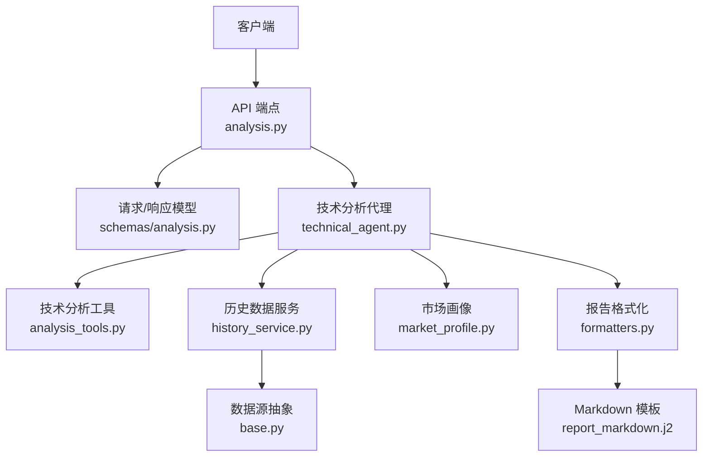
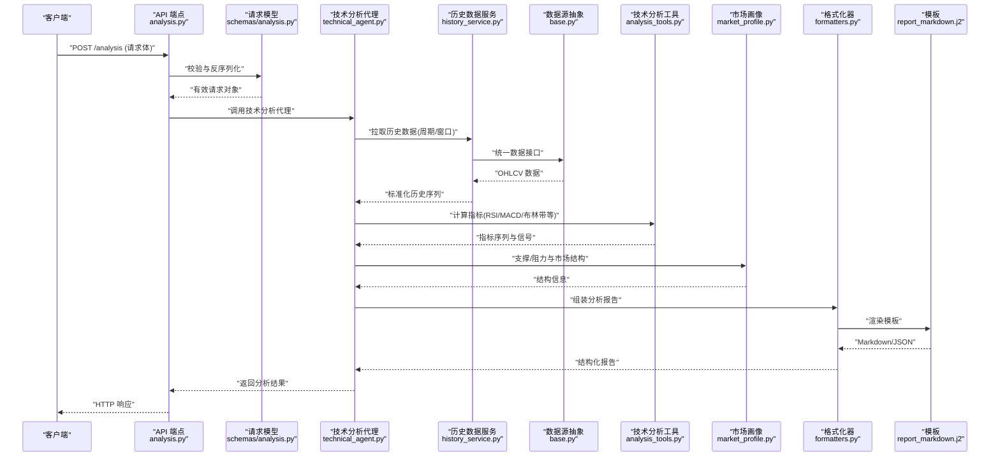
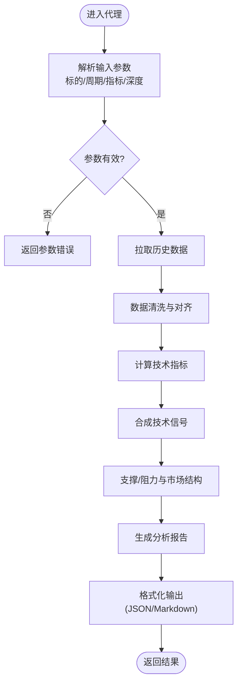
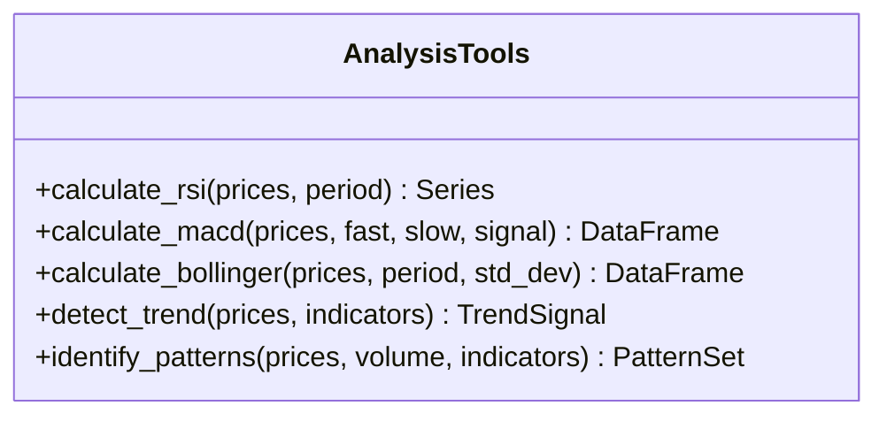
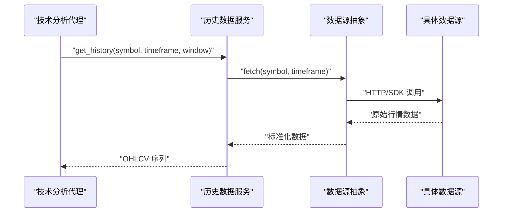
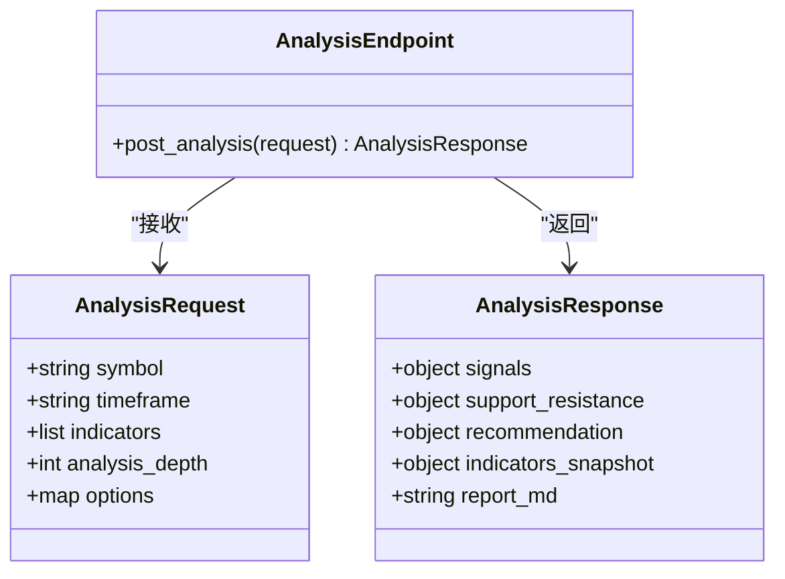
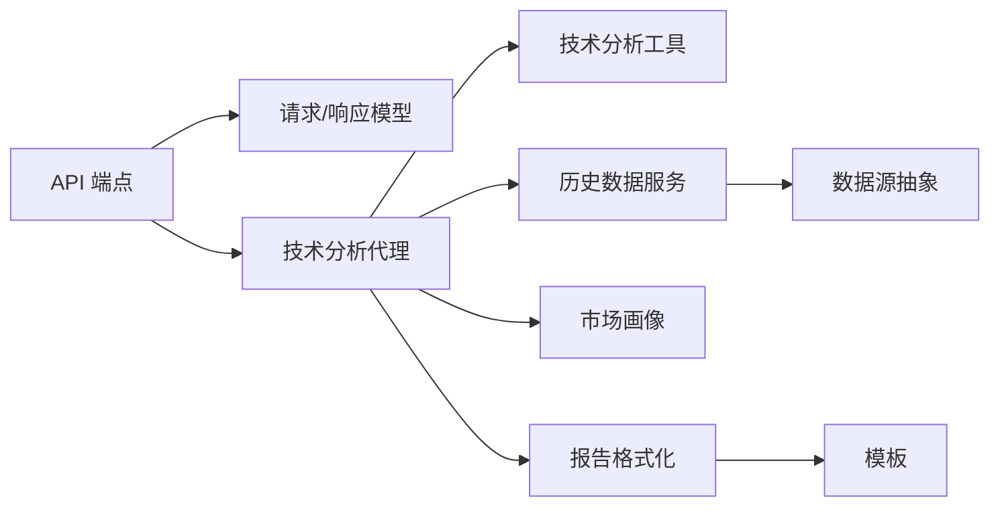

# 技术分析代理

<cite>
**本文引用的文件**   
- [src/agent/agents/technical_agent.py](file://src/agent/agents/technical_agent.py)
- [src/agent/tools/analysis_tools.py](file://src/agent/tools/analysis_tools.py)
- [src/services/history_service.py](file://src/services/history_service.py)
- [src/data_provider/base.py](file://src/data_provider/base.py)
- [api/v1/endpoints/analysis.py](file://api/v1/endpoints/analysis.py)
- [api/v1/schemas/analysis.py](file://api/v1/schemas/analysis.py)
- [src/core/market_profile.py](file://src/core/market_profile.py)
- [src/formatters.py](file://src/formatters.py)
- [templates/report_markdown.j2](file://templates/report_markdown.j2)
</cite>

## 目录
1. [简介](#简介)
2. [项目结构](#项目结构)
3. [核心组件](#核心组件)
4. [架构总览](#架构总览)
5. [详细组件分析](#详细组件分析)
6. [依赖关系分析](#依赖关系分析)
7. [性能考量](#性能考量)
8. [故障排查指南](#故障排查指南)
9. [结论](#结论)
10. [附录](#附录)

## 简介
本技术文档面向“技术分析代理”，系统性阐述其核心能力与实现方式，包括：
- 技术指标计算（如 RSI、MACD、布林带等）
- 趋势分析与形态识别思路
- 历史价格数据处理流程
- 输入参数配置（时间周期、指标类型、分析深度）
- 输出格式（技术信号、支撑阻力位、交易建议）
- 使用示例、性能优化建议与常见问题解决方案

该代理通过 API 层暴露接口，调用服务层获取历史数据，经由工具层完成指标计算与报告生成，最终返回结构化结果。

## 项目结构
围绕技术分析代理的关键代码分布在以下模块：
- 代理实现：src/agent/agents/technical_agent.py
- 技术分析工具：src/agent/tools/analysis_tools.py
- 历史数据服务：src/services/history_service.py
- 数据源抽象：src/data_provider/base.py
- API 路由与请求响应模型：api/v1/endpoints/analysis.py、api/v1/schemas/analysis.py
- 市场结构与画像辅助：src/core/market_profile.py
- 报告格式化与模板：src/formatters.py、templates/report_markdown.j2

图表来源
- [api/v1/endpoints/analysis.py](file://api/v1/endpoints/analysis.py)
- [api/v1/schemas/analysis.py](file://api/v1/schemas/analysis.py)
- [src/agent/agents/technical_agent.py](file://src/agent/agents/technical_agent.py)
- [src/agent/tools/analysis_tools.py](file://src/agent/tools/analysis_tools.py)
- [src/services/history_service.py](file://src/services/history_service.py)
- [src/data_provider/base.py](file://src/data_provider/base.py)
- [src/core/market_profile.py](file://src/core/market_profile.py)
- [src/formatters.py](file://src/formatters.py)
- [templates/report_markdown.j2](file://templates/report_markdown.j2)

章节来源
- [src/agent/agents/technical_agent.py](file://src/agent/agents/technical_agent.py)
- [src/agent/tools/analysis_tools.py](file://src/agent/tools/analysis_tools.py)
- [src/services/history_service.py](file://src/services/history_service.py)
- [src/data_provider/base.py](file://src/data_provider/base.py)
- [api/v1/endpoints/analysis.py](file://api/v1/endpoints/analysis.py)
- [api/v1/schemas/analysis.py](file://api/v1/schemas/analysis.py)
- [src/core/market_profile.py](file://src/core/market_profile.py)
- [src/formatters.py](file://src/formatters.py)
- [templates/report_markdown.j2](file://templates/report_markdown.j2)

## 核心组件
- 技术分析代理（Technical Agent）
  - 职责：编排历史数据拉取、指标计算、趋势与形态分析、报告生成与返回。
  - 关键行为：接收分析请求参数，调度工具与服务，聚合结果并格式化输出。
- 技术分析工具（Analysis Tools）
  - 职责：提供具体指标计算函数（RSI、MACD、布林带等）、趋势判断与形态识别逻辑。
- 历史数据服务（History Service）
  - 职责：封装多数据源的统一访问，按周期与窗口拉取 OHLCV 数据，处理缺失与异常。
- 数据源抽象（Data Provider Base）
  - 职责：定义数据获取接口规范，屏蔽不同数据源差异。
- 市场画像（Market Profile）
  - 职责：辅助识别支撑/阻力、波动区间与市场结构特征。
- 报告格式化（Formatters + Templates）
  - 职责：将结构化分析结果渲染为 Markdown 或 JSON 报告。

章节来源
- [src/agent/agents/technical_agent.py](file://src/agent/agents/technical_agent.py)
- [src/agent/tools/analysis_tools.py](file://src/agent/tools/analysis_tools.py)
- [src/services/history_service.py](file://src/services/history_service.py)
- [src/data_provider/base.py](file://src/data_provider/base.py)
- [src/core/market_profile.py](file://src/core/market_profile.py)
- [src/formatters.py](file://src/formatters.py)
- [templates/report_markdown.j2](file://templates/report_markdown.j2)

## 架构总览
技术分析代理采用分层架构：API 层负责协议与校验；代理层负责编排；工具层负责计算；服务层负责数据；底层数据源抽象屏蔽异构来源。

图表来源
- [api/v1/endpoints/analysis.py](file://api/v1/endpoints/analysis.py)
- [api/v1/schemas/analysis.py](file://api/v1/schemas/analysis.py)
- [src/agent/agents/technical_agent.py](file://src/agent/agents/technical_agent.py)
- [src/services/history_service.py](file://src/services/history_service.py)
- [src/data_provider/base.py](file://src/data_provider/base.py)
- [src/agent/tools/analysis_tools.py](file://src/agent/tools/analysis_tools.py)
- [src/core/market_profile.py](file://src/core/market_profile.py)
- [src/formatters.py](file://src/formatters.py)
- [templates/report_markdown.j2](file://templates/report_markdown.j2)

## 详细组件分析

### 技术分析代理（Technical Agent）
- 功能要点
  - 解析输入参数：标的、时间周期、指标集合、分析深度（窗口长度）。
  - 协调历史数据服务拉取数据，确保数据质量与完整性。
  - 调用技术分析工具计算指标，并结合市场画像进行支撑/阻力定位。
  - 生成结构化报告（信号、支撑阻力、交易建议），支持多种输出格式。
- 关键流程
  - 参数校验与默认值填充
  - 数据拉取与清洗
  - 指标计算与信号合成
  - 报告渲染与返回

章节来源
- [src/agent/agents/technical_agent.py](file://src/agent/agents/technical_agent.py)

### 技术分析工具（Analysis Tools）
- 功能要点
  - 指标计算：RSI、MACD、布林带、均线、成交量相关指标等。
  - 趋势判断：基于动量、价格位置与波动率综合判定。
  - 形态识别：常见形态（如头肩顶/底、双顶/底、三角形等）的启发式规则。
- 复杂度与性能
  - 指标计算多为 O(n) 线性扫描，注意滑动窗口大小对内存与 CPU 的影响。
  - 批量计算时建议向量化实现与缓存中间结果。

图表来源
- [src/agent/tools/analysis_tools.py](file://src/agent/tools/analysis_tools.py)

章节来源
- [src/agent/tools/analysis_tools.py](file://src/agent/tools/analysis_tools.py)

### 历史数据服务（History Service）
- 功能要点
  - 统一接口封装多数据源，按标的与周期拉取 OHLCV。
  - 处理缺失值、复权、时间对齐与异常回退。
  - 提供窗口切片与增量更新能力。
- 数据流
  - 请求 -> 数据源选择 -> 拉取 -> 标准化 -> 返回

图表来源
- [src/services/history_service.py](file://src/services/history_service.py)
- [src/data_provider/base.py](file://src/data_provider/base.py)

章节来源
- [src/services/history_service.py](file://src/services/history_service.py)
- [src/data_provider/base.py](file://src/data_provider/base.py)

### API 端点与模型（Analysis Endpoint & Schema）
- 端点职责
  - 接收分析请求，校验参数，调用代理，返回结构化结果。
- 模型约束
  - 明确输入字段（标的、周期、指标列表、分析深度等）与输出字段（信号、支撑阻力、建议、指标快照等）。

图表来源
- [api/v1/endpoints/analysis.py](file://api/v1/endpoints/analysis.py)
- [api/v1/schemas/analysis.py](file://api/v1/schemas/analysis.py)

章节来源
- [api/v1/endpoints/analysis.py](file://api/v1/endpoints/analysis.py)
- [api/v1/schemas/analysis.py](file://api/v1/schemas/analysis.py)

### 市场画像（Market Profile）
- 功能要点
  - 基于价格分布与成交量识别价值区间、支撑/阻力区域。
  - 结合波动率与趋势强度给出市场阶段判断。
- 应用场景
  - 作为技术分析代理的辅助模块，提升支撑/阻力与趋势判定的准确性。

章节来源
- [src/core/market_profile.py](file://src/core/market_profile.py)

### 报告格式化（Formatters 与模板）
- 功能要点
  - 将结构化分析结果渲染为 Markdown 或 JSON。
  - 模板化输出便于前端展示与归档。
- 扩展性
  - 新增报告样式可通过模板与格式化器扩展，无需改动核心逻辑。

章节来源
- [src/formatters.py](file://src/formatters.py)
- [templates/report_markdown.j2](file://templates/report_markdown.j2)

## 依赖关系分析
- 耦合与内聚
  - 代理层高内聚地编排数据、工具与报告；工具层专注计算；服务层专注数据访问；API 层专注协议。
- 外部依赖
  - 数据源抽象屏蔽第三方库差异，降低耦合度。
- 潜在循环依赖
  - 各层单向依赖，避免循环引用。

图表来源
- [api/v1/endpoints/analysis.py](file://api/v1/endpoints/analysis.py)
- [api/v1/schemas/analysis.py](file://api/v1/schemas/analysis.py)
- [src/agent/agents/technical_agent.py](file://src/agent/agents/technical_agent.py)
- [src/agent/tools/analysis_tools.py](file://src/agent/tools/analysis_tools.py)
- [src/services/history_service.py](file://src/services/history_service.py)
- [src/data_provider/base.py](file://src/data_provider/base.py)
- [src/core/market_profile.py](file://src/core/market_profile.py)
- [src/formatters.py](file://src/formatters.py)
- [templates/report_markdown.j2](file://templates/report_markdown.j2)

章节来源
- [api/v1/endpoints/analysis.py](file://api/v1/endpoints/analysis.py)
- [api/v1/schemas/analysis.py](file://api/v1/schemas/analysis.py)
- [src/agent/agents/technical_agent.py](file://src/agent/agents/technical_agent.py)
- [src/agent/tools/analysis_tools.py](file://src/agent/tools/analysis_tools.py)
- [src/services/history_service.py](file://src/services/history_service.py)
- [src/data_provider/base.py](file://src/data_provider/base.py)
- [src/core/market_profile.py](file://src/core/market_profile.py)
- [src/formatters.py](file://src/formatters.py)
- [templates/report_markdown.j2](file://templates/report_markdown.j2)

## 性能考量
- 数据拉取
  - 合理设置时间窗口与分析深度，避免过大请求导致超时与内存压力。
  - 利用缓存与增量更新减少重复拉取。
- 指标计算
  - 优先向量化计算，减少 Python 循环开销。
  - 对常用指标结果进行缓存，复用中间序列。
- 并发与限流
  - 对多标的并行分析需控制并发度，避免数据源限流。
  - 失败重试与熔断策略保障稳定性。
- 报告生成
  - 大报告按需渲染，避免一次性构建巨型字符串。

[本节为通用指导，不直接分析具体文件]

## 故障排查指南
- 常见问题
  - 数据缺失或不完整：检查数据源可用性、复权设置与时间对齐。
  - 指标异常值：确认窗口长度与参数合理性，检查极端行情下的数值溢出。
  - 超时与限流：调整并发与重试策略，增加退避机制。
  - 报告渲染失败：核对模板变量与数据结构一致性。
- 定位方法
  - 查看 API 日志与代理执行链路。
  - 打印中间结果（历史数据、指标序列、信号）以缩小问题范围。
  - 使用最小可复现用例验证。

章节来源
- [src/services/history_service.py](file://src/services/history_service.py)
- [src/agent/tools/analysis_tools.py](file://src/agent/tools/analysis_tools.py)
- [src/formatters.py](file://src/formatters.py)

## 结论
技术分析代理通过清晰的分层设计与模块化实现，提供了从数据拉取、指标计算到报告生成的完整技术面分析能力。借助统一的 API 与可扩展的工具链，用户可灵活配置时间周期、指标类型与分析深度，获得包含信号、支撑阻力与交易建议的结构化报告。在生产环境中，应重点关注数据质量、计算性能与稳定性保障。

[本节为总结性内容，不直接分析具体文件]

## 附录
- 输入参数配置建议
  - 时间周期：日线/周线/月线等，根据策略目标选择。
  - 指标类型：RSI、MACD、布林带、均线、成交量指标等按需组合。
  - 分析深度：窗口长度影响滞后性与灵敏度，需权衡。
- 输出格式说明
  - 技术信号：买入/卖出/中性及置信度。
  - 支撑阻力位：关键价位与区间。
  - 交易建议：基于多指标综合的策略建议。
- 使用示例（概念性）
  - 调用 API 提交标的、周期、指标与分析深度，获取结构化报告。
  - 前端渲染 Markdown 报告或解析 JSON 进行可视化。

[本节为概念性说明，不直接分析具体文件]