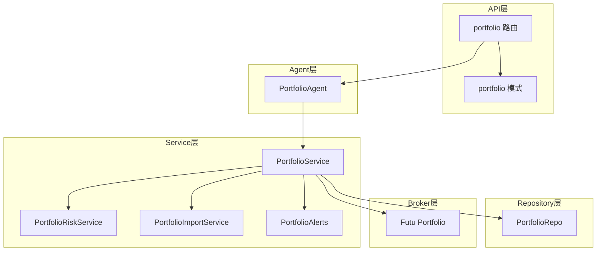
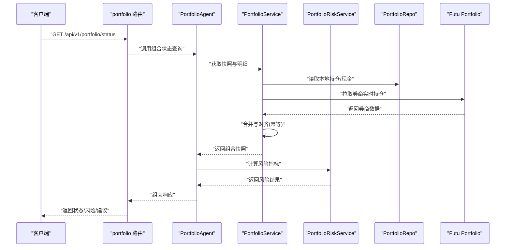
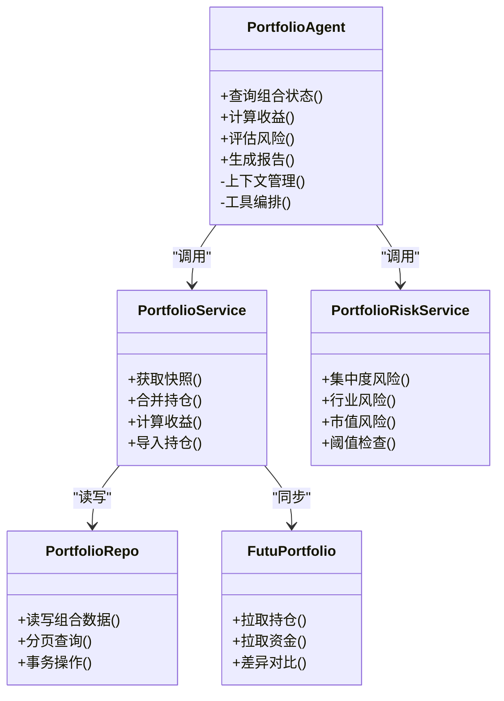
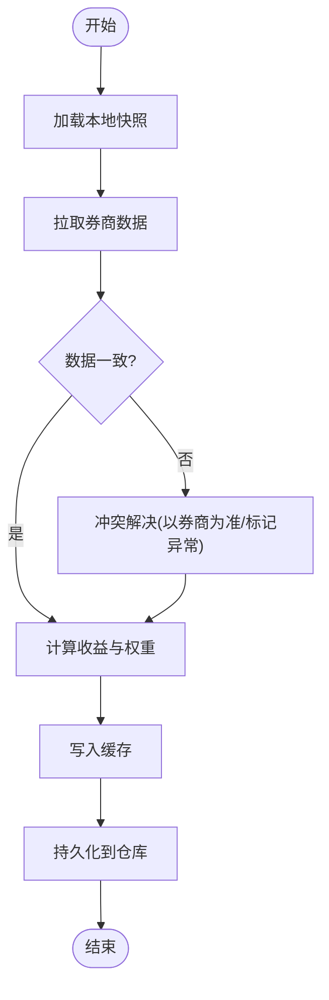
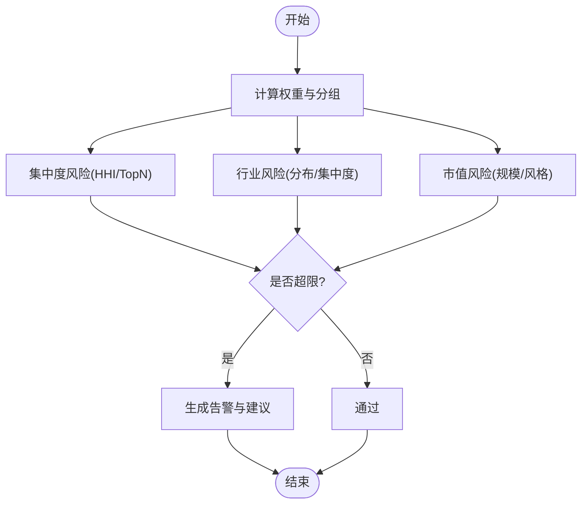
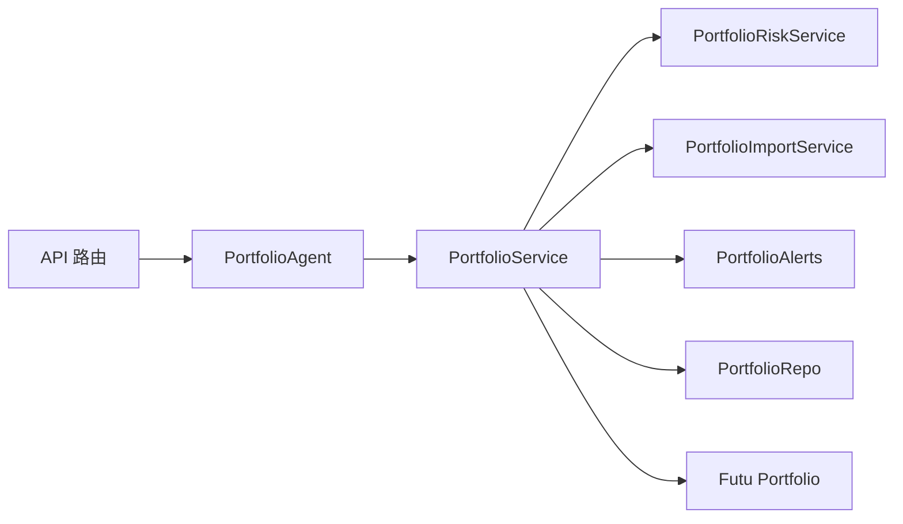

# 投资组合代理

<cite>
**本文引用的文件**   
- [portfolio_agent.py](file://src/agent/agents/portfolio_agent.py)
- [portfolio_service.py](file://src/services/portfolio_service.py)
- [portfolio_risk_service.py](file://src/services/portfolio_risk_service.py)
- [portfolio_import_service.py](file://src/services/portfolio_import_service.py)
- [portfolio_alerts.py](file://src/services/portfolio_alerts.py)
- [portfolio_repo.py](file://src/repositories/portfolio_repo.py)
- [portfolio.py](file://api/v1/endpoints/portfolio.py)
- [portfolio.py](file://api/v1/schemas/portfolio.py)
- [broker_portfolio.py](file://src/brokers/futu/portfolio.py)
- [test_main_portfolio.py](file://tests/test_main_portfolio.py)
- [test_portfolio_api.py](file://tests/test_portfolio_api.py)
- [test_portfolio_service.py](file://tests/test_portfolio_service.py)
- [test_data_tools_portfolio_snapshot.py](file://tests/test_data_tools_portfolio_snapshot.py)
</cite>

## 目录
1. [简介](#简介)
2. [项目结构](#项目结构)
3. [核心组件](#核心组件)
4. [架构总览](#架构总览)
5. [详细组件分析](#详细组件分析)
6. [依赖关系分析](#依赖关系分析)
7. [性能考虑](#性能考虑)
8. [故障排查指南](#故障排查指南)
9. [结论](#结论)
10. [附录](#附录)

## 简介
本文件面向“投资组合代理”的完整技术文档，聚焦以下目标：
- 职责与边界：持仓分析、收益计算、风险敞口评估、报告生成。
- 数据模型与跟踪：股票持仓、现金余额、资产配置比例。
- 收益计算方法：未实现损益、已实现损益、总收益率。
- 风险评估：集中度风险、行业风险、市值风险。
- 报告与建议：绩效分析与资产配置建议。
- 使用示例：查询组合状态、获取投资建议。
- 同步机制与性能优化：数据同步策略、缓存与并发控制。

## 项目结构
围绕投资组合代理的核心代码分布在 agent、services、repositories、brokers、api 等模块中：
- agent/agents/portfolio_agent.py：代理入口与编排逻辑。
- services/portfolio_service.py：组合业务服务（聚合、计算、持久化）。
- services/portfolio_risk_service.py：风险指标计算与评估。
- services/portfolio_import_service.py：导入与批量更新。
- services/portfolio_alerts.py：组合告警规则与触发。
- repositories/portfolio_repo.py：组合数据持久化接口。
- brokers/futu/portfolio.py：券商端持仓同步（以富途为例）。
- api/v1/endpoints/portfolio.py：HTTP 接口路由。
- api/v1/schemas/portfolio.py：请求/响应数据结构定义。
- tests/*：覆盖关键路径的测试用例。

图表来源
- [portfolio_agent.py:1-200](file://src/agent/agents/portfolio_agent.py#L1-L200)
- [portfolio_service.py:1-300](file://src/services/portfolio_service.py#L1-L300)
- [portfolio_risk_service.py:1-200](file://src/services/portfolio_risk_service.py#L1-L200)
- [portfolio_import_service.py:1-200](file://src/services/portfolio_import_service.py#L1-L200)
- [portfolio_alerts.py:1-200](file://src/services/portfolio_alerts.py#L1-L200)
- [portfolio_repo.py:1-200](file://src/repositories/portfolio_repo.py#L1-L200)
- [broker_portfolio.py:1-200](file://src/brokers/futu/portfolio.py#L1-L200)
- [portfolio.py](file://api/v1/endpoints/portfolio.py)
- [portfolio.py](file://api/v1/schemas/portfolio.py)

章节来源
- [portfolio_agent.py:1-200](file://src/agent/agents/portfolio_agent.py#L1-L200)
- [portfolio_service.py:1-300](file://src/services/portfolio_service.py#L1-L300)
- [portfolio_risk_service.py:1-200](file://src/services/portfolio_risk_service.py#L1-L200)
- [portfolio_import_service.py:1-200](file://src/services/portfolio_import_service.py#L1-L200)
- [portfolio_alerts.py:1-200](file://src/services/portfolio_alerts.py#L1-L200)
- [portfolio_repo.py:1-200](file://src/repositories/portfolio_repo.py#L1-L200)
- [broker_portfolio.py:1-200](file://src/brokers/futu/portfolio.py#L1-L200)
- [portfolio.py](file://api/v1/endpoints/portfolio.py)
- [portfolio.py](file://api/v1/schemas/portfolio.py)

## 核心组件
- 投资组合代理（PortfolioAgent）
  - 职责：对外暴露组合查询与分析能力，协调 Service 层完成数据聚合、收益计算、风险评估与报告生成。
  - 关键点：上下文管理、工具调用编排、事件流输出。
- 投资组合服务（PortfolioService）
  - 职责：组合快照、持仓明细、现金余额、资产权重、收益计算、历史回滚、导入导出。
  - 关键点：多源数据合并（本地仓库 + 券商同步）、幂等更新、缓存策略。
- 风险评估服务（PortfolioRiskService）
  - 职责：集中度风险、行业风险、市值风险、波动率与回撤估算、阈值告警。
  - 关键点：因子映射、分组统计、阈值配置。
- 导入服务（PortfolioImportService）
  - 职责：批量导入持仓、增量更新、冲突处理、校验与回滚。
- 告警服务（PortfolioAlerts）
  - 职责：基于规则的组合告警（如单票超配、行业集中度过高、净值跌破阈值）。
- 仓储（PortfolioRepo）
  - 职责：组合与持仓数据的增删改查、分页与过滤、事务保障。
- 券商同步（Futu Portfolio）
  - 职责：拉取真实账户持仓与资金，与本地快照对齐。

章节来源
- [portfolio_agent.py:1-200](file://src/agent/agents/portfolio_agent.py#L1-L200)
- [portfolio_service.py:1-300](file://src/services/portfolio_service.py#L1-L300)
- [portfolio_risk_service.py:1-200](file://src/services/portfolio_risk_service.py#1-L200)
- [portfolio_import_service.py:1-200](file://src/services/portfolio_import_service.py#L1-L200)
- [portfolio_alerts.py:1-200](file://src/services/portfolio_alerts.py#L1-L200)
- [portfolio_repo.py:1-200](file://src/repositories/portfolio_repo.py#L1-L200)
- [broker_portfolio.py:1-200](file://src/brokers/futu/portfolio.py#L1-L200)

## 架构总览
投资组合代理采用分层架构：API 层接收请求，Agent 层编排流程，Service 层承载核心计算与业务逻辑，Repository 层负责数据持久化，Broker 层对接外部券商数据。

图表来源
- [portfolio.py](file://api/v1/endpoints/portfolio.py)
- [portfolio_agent.py:1-200](file://src/agent/agents/portfolio_agent.py#L1-L200)
- [portfolio_service.py:1-300](file://src/services/portfolio_service.py#L1-L300)
- [portfolio_risk_service.py:1-200](file://src/services/portfolio_risk_service.py#L1-L200)
- [portfolio_repo.py:1-200](file://src/repositories/portfolio_repo.py#L1-L200)
- [broker_portfolio.py:1-200](file://src/brokers/futu/portfolio.py#L1-L200)

## 详细组件分析

### 投资组合代理（PortfolioAgent）
- 职责
  - 提供组合查询与分析的统一入口。
  - 编排 Service 层进行数据聚合、收益计算、风险评估与报告生成。
  - 管理对话上下文与工具调用生命周期。
- 关键流程
  - 解析请求参数（用户ID、时间窗口、指标开关）。
  - 调用 PortfolioService 获取快照与明细。
  - 调用 PortfolioRiskService 计算风险指标。
  - 根据配置生成建议与报告片段。
  - 将结果封装为统一响应格式并返回。

图表来源
- [portfolio_agent.py:1-200](file://src/agent/agents/portfolio_agent.py#L1-L200)
- [portfolio_service.py:1-300](file://src/services/portfolio_service.py#L1-L300)
- [portfolio_risk_service.py:1-200](file://src/services/portfolio_risk_service.py#L1-L200)
- [portfolio_repo.py:1-200](file://src/repositories/portfolio_repo.py#L1-L200)
- [broker_portfolio.py:1-200](file://src/brokers/futu/portfolio.py#L1-L200)

章节来源
- [portfolio_agent.py:1-200](file://src/agent/agents/portfolio_agent.py#L1-L200)

### 投资组合服务（PortfolioService）
- 职责
  - 维护组合快照（持仓明细、现金余额、总资产、权重）。
  - 计算收益（未实现损益、已实现损益、累计收益率）。
  - 支持导入与增量更新，确保数据一致性。
  - 与券商数据源对齐，处理差异与冲突。
- 收益计算方法
  - 未实现损益：按最新市价与成本价计算的浮动盈亏。
  - 已实现损益：基于成交记录与成本结转方法（如移动加权平均）计算。
  - 总收益率：综合未实现与已实现损益，结合现金变动计算年化或区间收益率。
- 数据同步
  - 本地快照优先，必要时拉取券商数据进行修正。
  - 幂等更新与版本控制，避免重复写入。
- 缓存策略
  - 对热点数据（如最新快照）进行短期缓存，降低 IO 压力。
  - 失效策略基于时间窗口与变更事件。

图表来源
- [portfolio_service.py:1-300](file://src/services/portfolio_service.py#L1-L300)
- [portfolio_repo.py:1-200](file://src/repositories/portfolio_repo.py#L1-L200)
- [broker_portfolio.py:1-200](file://src/brokers/futu/portfolio.py#L1-L200)

章节来源
- [portfolio_service.py:1-300](file://src/services/portfolio_service.py#L1-L300)

### 风险评估服务（PortfolioRiskService）
- 职责
  - 集中度风险：单票/前N票占比、赫芬达尔指数。
  - 行业风险：行业分布、行业集中度、相关性分析。
  - 市值风险：大盘/中小盘暴露、风格因子暴露。
  - 阈值检查：触发告警与降级建议。
- 指标计算
  - 权重归一化与分组统计。
  - 波动率与最大回撤估算（基于历史序列）。
  - 风险预算与限额校验。

图表来源
- [portfolio_risk_service.py:1-200](file://src/services/portfolio_risk_service.py#L1-L200)

章节来源
- [portfolio_risk_service.py:1-200](file://src/services/portfolio_risk_service.py#L1-L200)

### 导入服务（PortfolioImportService）
- 职责
  - 批量导入持仓与交易记录。
  - 增量更新与冲突处理（新增、修改、删除）。
  - 数据校验（字段完整性、数值范围、重复项去重）。
  - 回滚机制（失败时恢复至导入前状态）。
- 关键流程
  - 解析输入（CSV/JSON/Excel）。
  - 构建变更集（Diff）。
  - 执行事务性写入。
  - 生成导入报告。

章节来源
- [portfolio_import_service.py:1-200](file://src/services/portfolio_import_service.py#L1-L200)

### 告警服务（PortfolioAlerts）
- 职责
  - 基于规则的组合监控（如单票超配、行业集中度过高、净值跌破阈值）。
  - 触发通知（站内消息、邮件、IM）。
  - 告警历史与消音策略。
- 规则引擎
  - 条件表达式与阈值配置。
  - 动态权重与优先级。

章节来源
- [portfolio_alerts.py:1-200](file://src/services/portfolio_alerts.py#L1-L200)

### 仓储（PortfolioRepo）
- 职责
  - 组合与持仓数据的增删改查。
  - 分页、过滤、排序。
  - 事务保障与并发控制。
- 设计要点
  - 索引优化（股票代码、时间戳、用户ID）。
  - 软删除与审计日志。

章节来源
- [portfolio_repo.py:1-200](file://src/repositories/portfolio_repo.py#L1-L200)

### 券商同步（Futu Portfolio）
- 职责
  - 拉取真实账户持仓与资金。
  - 与本地快照对齐，处理差异与异常。
- 关键点
  - 连接池与重试机制。
  - 错误码映射与降级策略。

章节来源
- [broker_portfolio.py:1-200](file://src/brokers/futu/portfolio.py#L1-L200)

### API 层（portfolio 路由与模式）
- 路由
  - 组合状态查询、收益计算、风险评估、导入接口。
- 模式
  - 统一的请求/响应结构，包含字段校验与默认值。
- 错误处理
  - 标准化错误码与消息。

章节来源
- [portfolio.py](file://api/v1/endpoints/portfolio.py)
- [portfolio.py](file://api/v1/schemas/portfolio.py)

## 依赖关系分析
- 耦合与内聚
  - Agent 仅编排 Service，低耦合高内聚。
  - Service 依赖 Repo 与 Broker，职责清晰。
  - Risk 独立计算风险指标，可复用。
- 外部依赖
  - 券商接口（富途）用于真实数据同步。
  - LLM/报告渲染（可选）用于建议生成。
- 潜在循环依赖
  - 通过接口隔离与分层避免循环引用。

图表来源
- [portfolio.py](file://api/v1/endpoints/portfolio.py)
- [portfolio_agent.py:1-200](file://src/agent/agents/portfolio_agent.py#L1-L200)
- [portfolio_service.py:1-300](file://src/services/portfolio_service.py#L1-L300)
- [portfolio_risk_service.py:1-200](file://src/services/portfolio_risk_service.py#L1-L200)
- [portfolio_import_service.py:1-200](file://src/services/portfolio_import_service.py#L1-L200)
- [portfolio_alerts.py:1-200](file://src/services/portfolio_alerts.py#L1-L200)
- [portfolio_repo.py:1-200](file://src/repositories/portfolio_repo.py#L1-L200)
- [broker_portfolio.py:1-200](file://src/brokers/futu/portfolio.py#L1-L200)

章节来源
- [portfolio.py](file://api/v1/endpoints/portfolio.py)
- [portfolio_agent.py:1-200](file://src/agent/agents/portfolio_agent.py#L1-L200)
- [portfolio_service.py:1-300](file://src/services/portfolio_service.py#L1-L300)

## 性能考虑
- 缓存策略
  - 热点快照短期缓存，减少数据库与券商调用。
  - 失效策略基于时间与事件驱动。
- 并发控制
  - 使用队列与限流保护外部接口。
  - 读写分离与只读副本提升查询吞吐。
- 批处理与增量更新
  - 导入采用增量 Diff，避免全量重写。
  - 风险计算按需触发，避免全量重算。
- 索引与查询优化
  - 针对常用过滤字段建立索引。
  - 分页与游标查询避免大结果集。

[本节为通用指导，不直接分析具体文件]

## 故障排查指南
- 常见问题
  - 券商数据拉取失败：检查网络、认证、限流与错误码映射。
  - 数据不一致：核对本地快照与券商数据差异，查看冲突解决日志。
  - 收益计算偏差：确认成本结转方法与价格源一致性。
  - 告警误报：检查阈值配置与数据质量。
- 定位步骤
  - 查看 API 错误码与日志。
  - 检查 Service 层的合并与幂等逻辑。
  - 验证 Repo 的事务与索引。
  - 复现导入与同步流程。

章节来源
- [portfolio_service.py:1-300](file://src/services/portfolio_service.py#L1-L300)
- [portfolio_risk_service.py:1-200](file://src/services/portfolio_risk_service.py#L1-L200)
- [portfolio_import_service.py:1-200](file://src/services/portfolio_import_service.py#L1-L200)
- [portfolio_alerts.py:1-200](file://src/services/portfolio_alerts.py#L1-L200)
- [portfolio_repo.py:1-200](file://src/repositories/portfolio_repo.py#L1-L200)
- [broker_portfolio.py:1-200](file://src/brokers/futu/portfolio.py#L1-L200)

## 结论
投资组合代理通过清晰的层次结构与职责划分，实现了从数据同步、收益计算、风险评估到报告生成的完整闭环。其核心优势在于：
- 数据一致性：本地快照与券商数据对齐，幂等更新与冲突解决。
- 可扩展性：风险与服务模块化，便于扩展新指标与数据源。
- 性能优化：缓存、批处理与索引优化，满足高并发场景。
- 可观测性：告警与日志完善，便于问题定位与运维。

[本节为总结，不直接分析具体文件]

## 附录
- 使用示例
  - 查询组合状态：调用组合状态接口，返回持仓明细、现金余额、总资产与权重。
  - 获取投资建议：基于风险阈值与配置，生成调仓建议与风险提示。
  - 导入持仓：上传文件或提交 JSON，系统自动校验与增量更新。
- 参考测试
  - 组合主流程测试：验证端到端状态查询与收益计算。
  - API 契约测试：确保请求/响应结构稳定。
  - 数据快照测试：验证缓存与同步逻辑。

章节来源
- [test_main_portfolio.py](file://tests/test_main_portfolio.py)
- [test_portfolio_api.py](file://tests/test_portfolio_api.py)
- [test_portfolio_service.py](file://tests/test_portfolio_service.py)
- [test_data_tools_portfolio_snapshot.py](file://tests/test_data_tools_portfolio_snapshot.py)