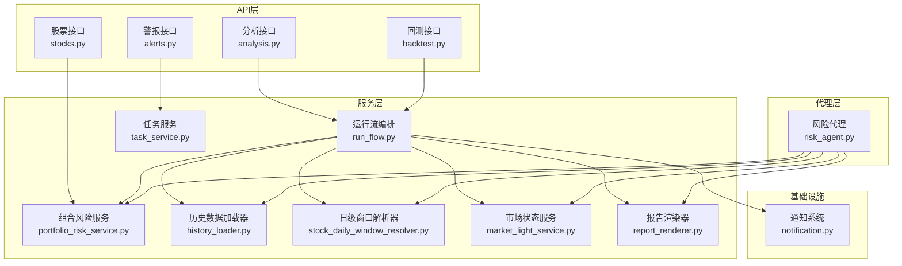
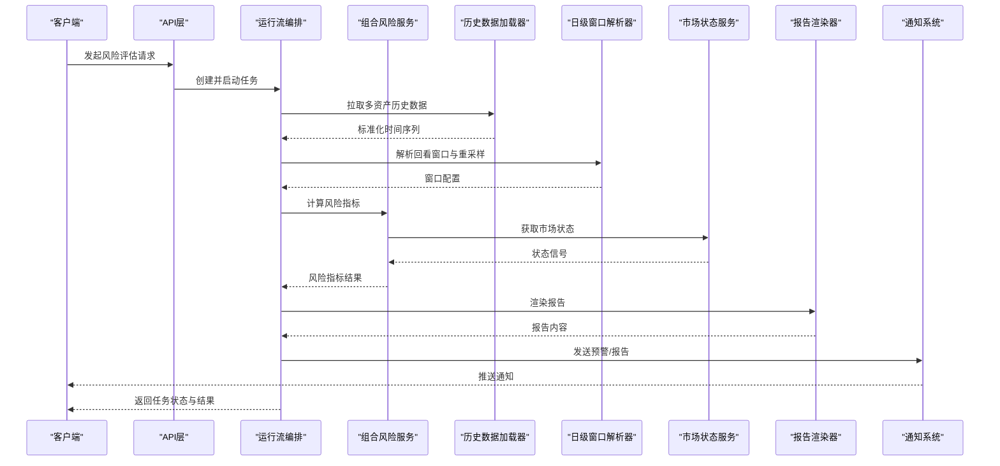
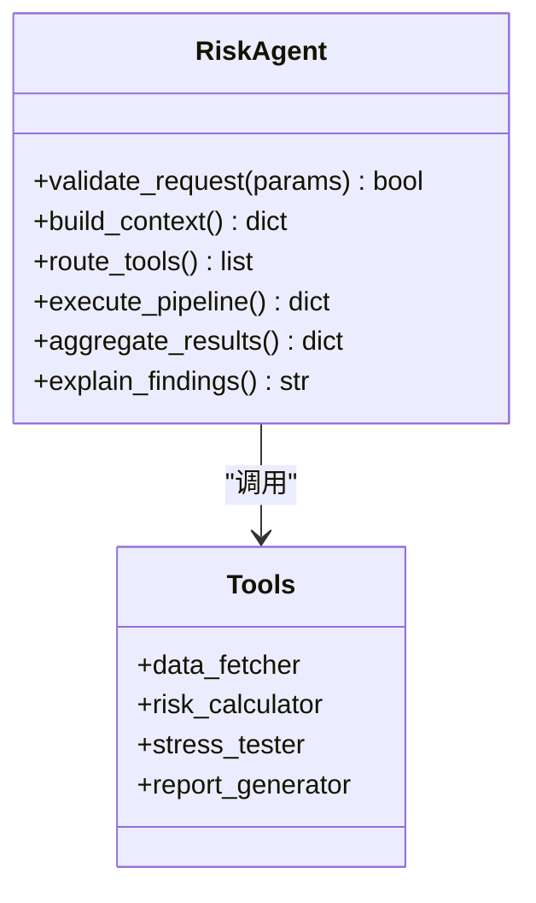
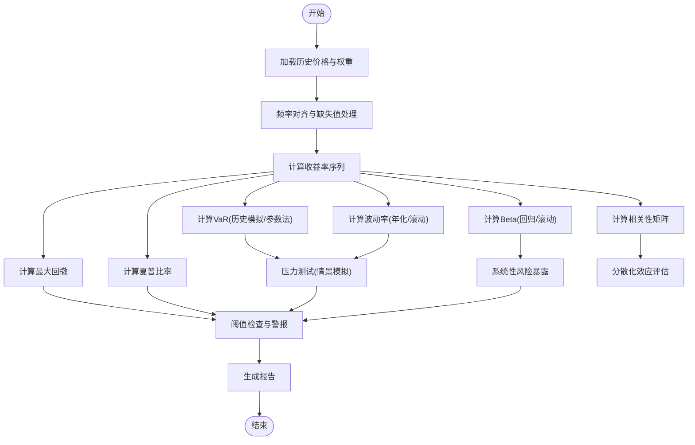
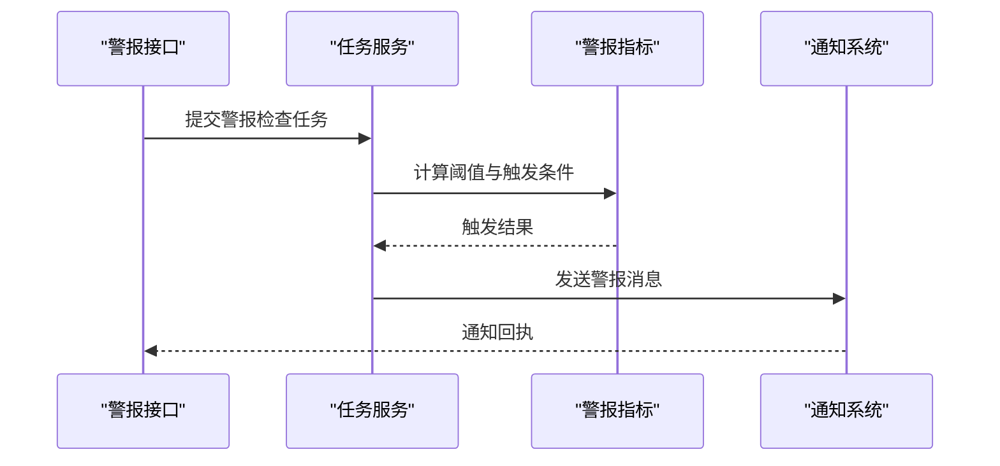
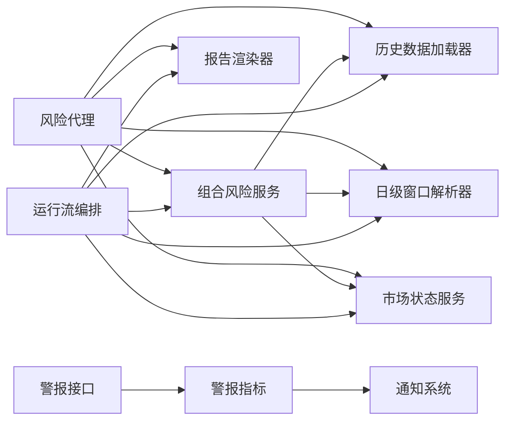

# 风险评估代理

<cite>
**本文档引用的文件**   
- [risk_agent.py](file://src/agent/agents/risk_agent.py)
- [portfolio_risk_service.py](file://src/services/portfolio_risk_service.py)
- [backtest_engine.py](file://src/core/backtest_engine.py)
- [alert_indicators.py](file://src/services/alert_indicators.py)
- [alerts.py](file://api/v1/endpoints/alerts.py)
- [analysis.py](file://api/v1/endpoints/analysis.py)
- [stocks.py](file://api/v1/endpoints/stocks.py)
- [backtest.py](file://api/v1/endpoints/backtest.py)
- [run_flow.py](file://src/services/run_flow.py)
- [task_service.py](file://src/services/task_service.py)
- [stock_daily_window_resolver.py](file://src/services/stock_daily_window_resolver.py)
- [history_loader.py](file://src/services/history_loader.py)
- [market_light_service.py](file://src/services/market_light_service.py)
- [report_renderer.py](file://src/services/report_renderer.py)
- [notification.py](file://src/notification.py)
</cite>

## 目录
1. [简介](#简介)
2. [项目结构](#项目结构)
3. [核心组件](#核心组件)
4. [架构总览](#架构总览)
5. [详细组件分析](#详细组件分析)
6. [依赖关系分析](#依赖关系分析)
7. [性能考虑](#性能考虑)
8. [故障排查指南](#故障排查指南)
9. [结论](#结论)
10. [附录](#附录)

## 简介
本文件面向“风险评估代理”的完整技术文档，聚焦以下目标：
- 风险度量模型：VaR（在险价值）计算、波动率分析与压力测试机制
- 单只股票风险特征评估：Beta系数、最大回撤与夏普比率
- 组合层面风险评估：相关性分析、分散化效应与系统性风险
- 压力测试：极端市场情景模拟与损失估算
- 风险预警：阈值监控与自动警报触发
- 使用示例：端到端风险评估与报告生成
- 模型校准与回测验证流程

本说明力求以循序渐进的方式呈现，既适合具备一定量化背景的读者，也便于初学者理解。

## 项目结构
围绕风险评估代理的核心代码分布在如下模块：
- 代理层：风险代理编排与工具调用
- 服务层：组合风险计算、历史数据加载、市场状态、报告渲染、任务调度
- API层：暴露风险查询、回测、警报等接口
- 基础设施：通知、存储、配置等

图表来源
- [analysis.py:1-200](file://api/v1/endpoints/analysis.py#L1-L200)
- [stocks.py:1-200](file://api/v1/endpoints/stocks.py#L1-L200)
- [backtest.py:1-200](file://api/v1/endpoints/backtest.py#L1-L200)
- [alerts.py:1-200](file://api/v1/endpoints/alerts.py#L1-L200)
- [portfolio_risk_service.py:1-300](file://src/services/portfolio_risk_service.py#L1-L300)
- [history_loader.py:1-200](file://src/services/history_loader.py#L1-L200)
- [stock_daily_window_resolver.py:1-200](file://src/services/stock_daily_window_resolver.py#L1-L200)
- [market_light_service.py:1-200](file://src/services/market_light_service.py#L1-L200)
- [report_renderer.py:1-200](file://src/services/report_renderer.py#L1-L200)
- [run_flow.py:1-200](file://src/services/run_flow.py#L1-L200)
- [task_service.py:1-200](file://src/services/task_service.py#L1-L200)
- [notification.py:1-200](file://src/notification.py#L1-L200)

章节来源
- [risk_agent.py:1-200](file://src/agent/agents/risk_agent.py#L1-L200)
- [portfolio_risk_service.py:1-300](file://src/services/portfolio_risk_service.py#L1-L300)
- [run_flow.py:1-200](file://src/services/run_flow.py#L1-L200)
- [task_service.py:1-200](file://src/services/task_service.py#L1-L200)

## 核心组件
- 风险代理（Risk Agent）
  - 职责：接收用户或上游系统的风险请求，协调数据获取、指标计算、压力测试与报告生成，并触发警报。
  - 关键能力：参数校验、上下文构建、工具路由、结果聚合与解释。
- 组合风险服务（Portfolio Risk Service）
  - 职责：实现VaR、波动率、Beta、最大回撤、夏普比率、相关性矩阵、分散化指数与系统性风险指标的计算。
  - 输入：资产价格序列、权重、基准、时间窗口；输出：多维风险指标与可视化数据。
- 历史数据加载器（History Loader）
  - 职责：统一拉取多源历史行情，清洗、对齐频率与时间戳，提供标准化时间序列。
- 日级窗口解析器（Daily Window Resolver）
  - 职责：根据策略或风控需求动态确定回看窗口、滚动计算区间与重采样规则。
- 市场状态服务（Market Light Service）
  - 职责：提供宏观与市场微观状态信号，用于压力测试情景选择与阈值调整。
- 报告渲染器（Report Renderer）
  - 职责：将结构化风险结果渲染为Markdown/HTML/PDF等多格式报告。
- 运行流编排（Run Flow）
  - 职责：串联数据、计算、渲染与通知步骤，支持异步任务与进度事件。
- 任务服务（Task Service）
  - 职责：管理长耗时任务的提交、执行、重试与状态查询。
- 通知系统（Notification）
  - 职责：多渠道发送风险预警与报告摘要。

章节来源
- [risk_agent.py:1-200](file://src/agent/agents/risk_agent.py#L1-L200)
- [portfolio_risk_service.py:1-300](file://src/services/portfolio_risk_service.py#L1-L300)
- [history_loader.py:1-200](file://src/services/history_loader.py#L1-L200)
- [stock_daily_window_resolver.py:1-200](file://src/services/stock_daily_window_resolver.py#L1-L200)
- [market_light_service.py:1-200](file://src/services/market_light_service.py#L1-L200)
- [report_renderer.py:1-200](file://src/services/report_renderer.py#L1-L200)
- [run_flow.py:1-200](file://src/services/run_flow.py#L1-L200)
- [task_service.py:1-200](file://src/services/task_service.py#L1-L200)
- [notification.py:1-200](file://src/notification.py#L1-L200)

## 架构总览
风险评估代理采用分层架构：API层暴露REST接口，服务层封装业务逻辑，代理层负责编排与决策，基础设施提供通用能力。

图表来源
- [analysis.py:1-200](file://api/v1/endpoints/analysis.py#L1-L200)
- [run_flow.py:1-200](file://src/services/run_flow.py#L1-L200)
- [portfolio_risk_service.py:1-300](file://src/services/portfolio_risk_service.py#L1-L300)
- [history_loader.py:1-200](file://src/services/history_loader.py#L1-L200)
- [stock_daily_window_resolver.py:1-200](file://src/services/stock_daily_window_resolver.py#L1-L200)
- [market_light_service.py:1-200](file://src/services/market_light_service.py#L1-L200)
- [report_renderer.py:1-200](file://src/services/report_renderer.py#L1-L200)
- [notification.py:1-200](file://src/notification.py#L1-L200)

## 详细组件分析

### 风险代理（Risk Agent）
- 功能要点
  - 接收风险评估请求，进行参数校验与上下文构建
  - 路由到相应工具：数据获取、指标计算、压力测试、报告生成
  - 聚合结果，生成可解释的风险结论与建议
- 设计模式
  - 工具注册与路由：通过工具表驱动不同计算路径
  - 事件驱动：在关键阶段产出流式事件，便于前端展示与追踪

图表来源
- [risk_agent.py:1-200](file://src/agent/agents/risk_agent.py#L1-L200)

章节来源
- [risk_agent.py:1-200](file://src/agent/agents/risk_agent.py#L1-L200)

### 组合风险服务（Portfolio Risk Service）
- 风险度量模型
  - VaR计算：基于历史模拟法与参数法（正态分布假设），支持置信水平与持有期配置
  - 波动率分析：年化波动率、滚动波动率、条件波动率（GARCH可选）
  - Beta系数：相对于基准的回归估计，含滚动Beta与稳健估计
  - 最大回撤：从峰值到谷底的最大累计跌幅
  - 夏普比率：超额收益与波动率的比值，支持无风险利率配置
  - 相关性分析：资产间相关矩阵、滚动相关性、尾部相关性
  - 分散化效应：组合波动率与加权平均波动率的差异度
  - 系统性风险：Beta加权暴露、因子暴露（如行业/风格）、集中度指标
- 输入输出
  - 输入：价格序列、权重、基准、时间窗口、置信水平
  - 输出：指标字典、时序数据、可视化数据、风险提示

图表来源
- [portfolio_risk_service.py:1-300](file://src/services/portfolio_risk_service.py#L1-L300)

章节来源
- [portfolio_risk_service.py:1-300](file://src/services/portfolio_risk_service.py#L1-L300)

### 历史数据加载器（History Loader）
- 功能要点
  - 统一接入多数据源（如A股、港股、美股、指数）
  - 数据清洗：去重、异常值处理、停牌填充、复权处理
  - 频率对齐：日线/分钟线重采样与时间戳对齐
- 错误处理
  - 网络超时与重试
  - 数据缺失与降级策略

章节来源
- [history_loader.py:1-200](file://src/services/history_loader.py#L1-L200)

### 日级窗口解析器（Daily Window Resolver）
- 功能要点
  - 根据策略或风控需求确定回看窗口长度与滚动步长
  - 支持固定窗口与自适应窗口（基于波动率或事件触发）
  - 输出标准化的窗口切片与索引映射

章节来源
- [stock_daily_window_resolver.py:1-200](file://src/services/stock_daily_window_resolver.py#L1-L200)

### 市场状态服务（Market Light Service）
- 功能要点
  - 提供市场状态信号（如趋势、波动、流动性）
  - 用于压力测试情景选择与阈值动态调整
  - 支持多市场与多指数的状态聚合

章节来源
- [market_light_service.py:1-200](file://src/services/market_light_service.py#L1-L200)

### 报告渲染器（Report Renderer）
- 功能要点
  - 将结构化风险结果渲染为Markdown/HTML/PDF
  - 模板化输出，支持多语言与主题定制
  - 包含图表数据与关键指标摘要

章节来源
- [report_renderer.py:1-200](file://src/services/report_renderer.py#L1-L200)

### 运行流编排（Run Flow）
- 功能要点
  - 串联数据获取、指标计算、压力测试、报告生成与通知
  - 支持异步任务、进度事件与失败重试
  - 提供统一的输入输出契约

章节来源
- [run_flow.py:1-200](file://src/services/run_flow.py#L1-L200)

### 任务服务（Task Service）
- 功能要点
  - 管理长耗时任务的提交、执行、状态查询与取消
  - 支持任务队列、优先级与并发控制
  - 提供任务日志与审计

章节来源
- [task_service.py:1-200](file://src/services/task_service.py#L1-L200)

### 警报与预警（Alert Indicators & Alerts API）
- 功能要点
  - 定义风险阈值（如VaR超限、波动率飙升、最大回撤突破）
  - 实时监控与自动警报触发
  - 多渠道通知（邮件、短信、IM等）

图表来源
- [alerts.py:1-200](file://api/v1/endpoints/alerts.py#L1-L200)
- [alert_indicators.py:1-200](file://src/services/alert_indicators.py#L1-L200)
- [task_service.py:1-200](file://src/services/task_service.py#L1-L200)
- [notification.py:1-200](file://src/notification.py#L1-L200)

章节来源
- [alerts.py:1-200](file://api/v1/endpoints/alerts.py#L1-L200)
- [alert_indicators.py:1-200](file://src/services/alert_indicators.py#L1-L200)

### 回测引擎（Backtest Engine）
- 功能要点
  - 支持策略回测与风险模型回测
  - 交易成本、滑点、冲击成本建模
  - 绩效归因与风险分解

章节来源
- [backtest_engine.py:1-200](file://src/core/backtest_engine.py#L1-L200)

## 依赖关系分析
- 组件耦合
  - 风险代理依赖服务层的所有核心组件
  - 服务层之间通过明确接口交互，降低耦合
- 外部依赖
  - 数据源适配器（历史数据加载器）
  - 通知渠道（邮件、IM等）
  - 存储与配置（任务持久化、环境配置）

图表来源
- [risk_agent.py:1-200](file://src/agent/agents/risk_agent.py#L1-L200)
- [portfolio_risk_service.py:1-300](file://src/services/portfolio_risk_service.py#L1-L300)
- [history_loader.py:1-200](file://src/services/history_loader.py#L1-L200)
- [stock_daily_window_resolver.py:1-200](file://src/services/stock_daily_window_resolver.py#L1-L200)
- [market_light_service.py:1-200](file://src/services/market_light_service.py#L1-L200)
- [report_renderer.py:1-200](file://src/services/report_renderer.py#L1-L200)
- [run_flow.py:1-200](file://src/services/run_flow.py#L1-L200)
- [alerts.py:1-200](file://api/v1/endpoints/alerts.py#L1-L200)
- [alert_indicators.py:1-200](file://src/services/alert_indicators.py#L1-L200)
- [notification.py:1-200](file://src/notification.py#L1-L200)

章节来源
- [run_flow.py:1-200](file://src/services/run_flow.py#L1-L200)
- [task_service.py:1-200](file://src/services/task_service.py#L1-L200)

## 性能考虑
- 数据加载优化
  - 批量拉取与缓存策略
  - 增量更新与断点续传
- 计算性能
  - 向量化计算与并行化
  - 滚动窗口计算的滑动更新
- 内存管理
  - 大数据集的分块处理
  - 及时释放中间结果
- I/O优化
  - 异步I/O与连接池
  - 压缩传输与本地缓存

[本节为通用指导，不直接分析具体文件]

## 故障排查指南
- 常见问题
  - 数据缺失：检查数据源可用性、复权方式与停牌处理
  - 计算异常：检查收益率序列的异常值与缺失值
  - 警报误报：调整阈值与平滑参数
  - 任务失败：查看任务日志与重试策略
- 调试建议
  - 启用详细日志与指标监控
  - 使用最小数据集复现问题
  - 逐步隔离组件定位问题

章节来源
- [task_service.py:1-200](file://src/services/task_service.py#L1-L200)
- [notification.py:1-200](file://src/notification.py#L1-L200)

## 结论
风险评估代理通过模块化设计与清晰的数据流，实现了全面的风险分析能力。其核心优势在于：
- 灵活的风险度量模型，支持多种计算方法与参数配置
- 强大的组合层面分析，涵盖相关性、分散化与系统性风险
- 完善的压力测试与预警机制，支持实时风险监控
- 可扩展的架构设计，便于集成新数据源与算法

建议在实际使用中：
- 合理配置时间窗口与置信水平
- 定期校准模型参数并进行回测验证
- 建立完善的警报阈值与通知策略
- 持续监控数据质量与系统性能

[本节为总结性内容，不直接分析具体文件]

## 附录

### 使用示例：全面风险评估与报告生成
- 步骤概览
  - 准备数据：资产列表、权重、基准、时间范围
  - 配置参数：VaR置信水平、波动率窗口、Beta基准
  - 执行评估：调用API或运行流编排
  - 查看结果：风险指标、压力测试结果、警报信息
  - 生成报告：导出Markdown/HTML/PDF格式报告
- 关键API
  - 分析接口：提交风险评估任务
  - 回测接口：执行策略与风险模型回测
  - 警报接口：配置与管理风险阈值

章节来源
- [analysis.py:1-200](file://api/v1/endpoints/analysis.py#L1-L200)
- [backtest.py:1-200](file://api/v1/endpoints/backtest.py#L1-L200)
- [alerts.py:1-200](file://api/v1/endpoints/alerts.py#L1-L200)
- [run_flow.py:1-200](file://src/services/run_flow.py#L1-L200)

### 风险模型校准与回测验证流程
- 校准方法
  - 参数扫描：对VaR置信水平、波动率窗口等进行网格搜索
  - 交叉验证：时间序列交叉验证，避免前视偏差
  - 稳健性检验：不同样本期与市场环境下的稳定性
- 回测验证
  - 历史回测：覆盖牛熊周期与极端事件
  - 绩效归因：分解收益来源与风险贡献
  - 压力测试：模拟黑天鹅事件与流动性枯竭

章节来源
- [backtest_engine.py:1-200](file://src/core/backtest_engine.py#L1-L200)
- [portfolio_risk_service.py:1-300](file://src/services/portfolio_risk_service.py#L1-L300)