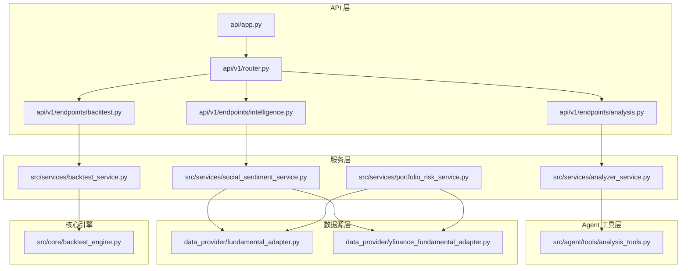
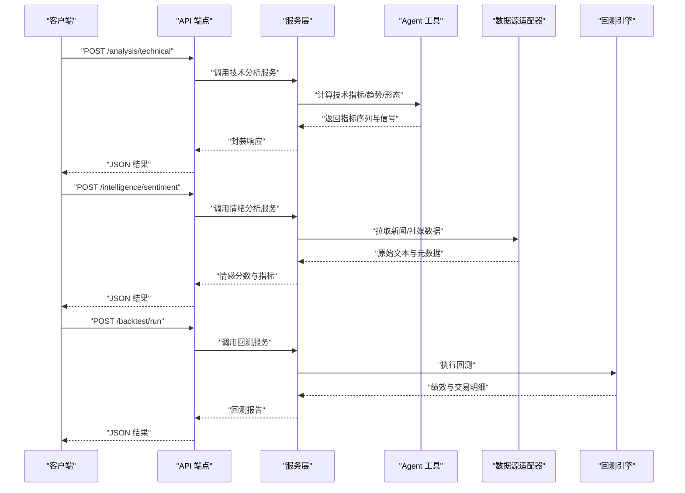
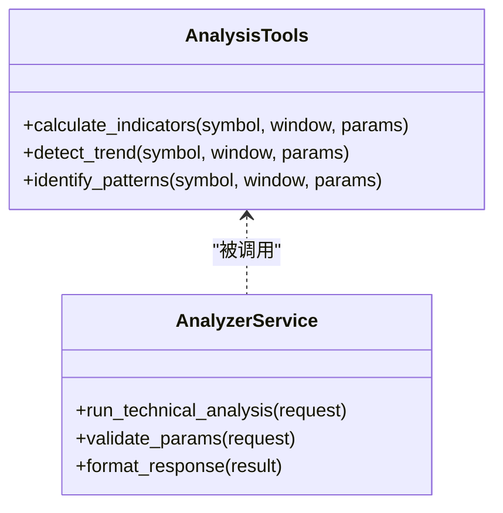
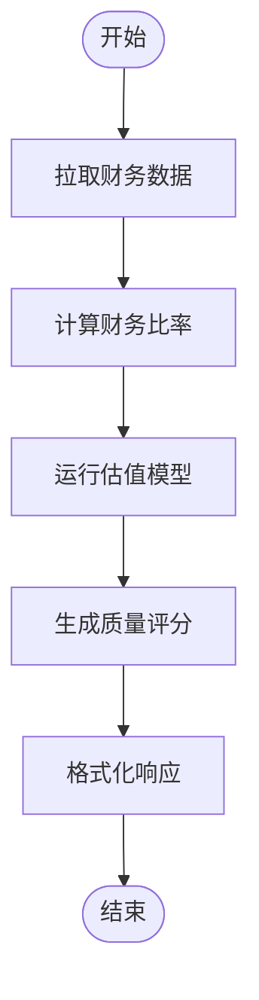
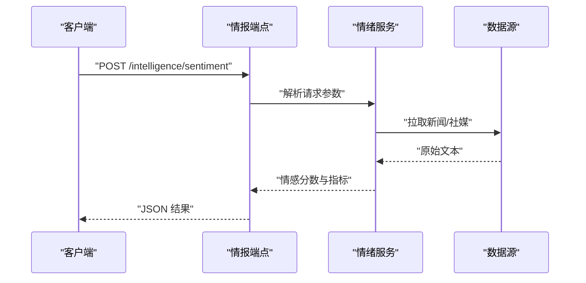
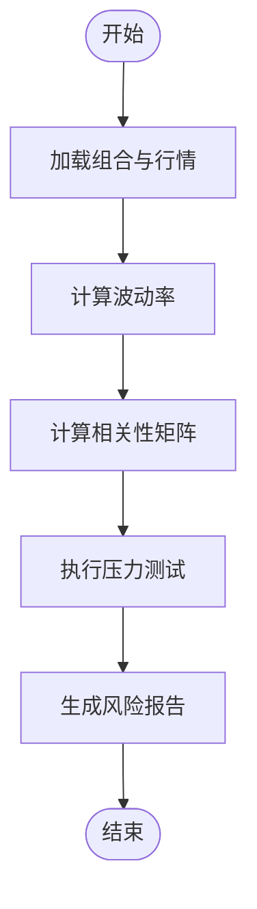
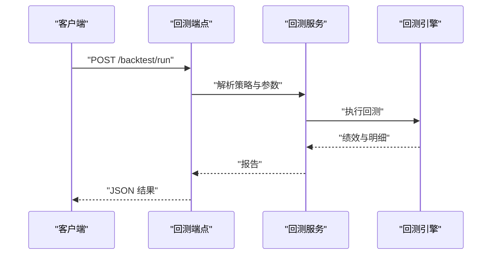
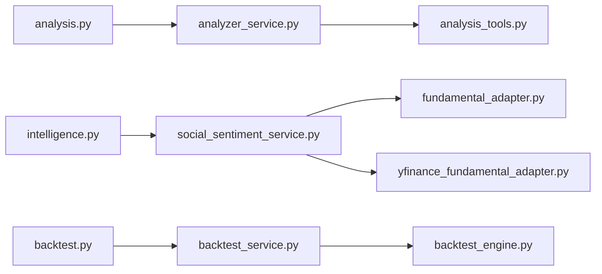

# 分析工具

<cite>
**本文引用的文件**   
- [main.py](file://main.py)
- [server.py](file://server.py)
- [api/app.py](file://api/app.py)
- [api/v1/router.py](file://api/v1/router.py)
- [src/agent/tools/analysis_tools.py](file://src/agent/tools/analysis_tools.py)
- [src/services/analyzer_service.py](file://src/services/analyzer_service.py)
- [src/services/social_sentiment_service.py](file://src/services/social_sentiment_service.py)
- [src/services/portfolio_risk_service.py](file://src/services/portfolio_risk_service.py)
- [data_provider/fundamental_adapter.py](file://data_provider/fundamental_adapter.py)
- [data_provider/yfinance_fundamental_adapter.py](file://data_provider/yfinance_fundamental_adapter.py)
- [src/core/backtest_engine.py](file://src/core/backtest_engine.py)
- [src/services/backtest_service.py](file://src/services/backtest_service.py)
- [api/v1/endpoints/analysis.py](file://api/v1/endpoints/analysis.py)
- [api/v1/endpoints/intelligence.py](file://api/v1/endpoints/intelligence.py)
- [api/v1/endpoints/backtest.py](file://api/v1/endpoints/backtest.py)
- [api/v1/schemas/analysis.py](file://api/v1/schemas/analysis.py)
- [api/v1/schemas/intelligence.py](file://api/v1/schemas/intelligence.py)
- [api/v1/schemas/backtest.py](file://api/v1/schemas/backtest.py)
</cite>

## 目录
1. [简介](#简介)
2. [项目结构](#项目结构)
3. [核心组件](#核心组件)
4. [架构总览](#架构总览)
5. [详细组件分析](#详细组件分析)
6. [依赖关系分析](#依赖关系分析)
7. [性能考虑](#性能考虑)
8. [故障排查指南](#故障排查指南)
9. [结论](#结论)
10. [附录](#附录)

## 简介
本文件面向“技术分析、基本面分析、情绪分析、风险评估”四大类分析工具的完整文档。内容覆盖：
- 技术指标计算与趋势分析、形态识别
- 财务指标计算、估值模型与质量评估
- 新闻情感分析、社交媒体监控与市场情绪指标
- 波动率计算、相关性分析与压力测试
并给出每个工具的参数说明、返回值格式、使用示例，以及批量处理与缓存策略等性能优化建议。

## 项目结构
本项目采用前后端分离与模块化设计：
- API 层：FastAPI 应用入口、路由与请求/响应 Schema
- 服务层：分析、回测、情绪、风险等业务服务
- 数据源层：多数据源适配器（A 股、美股、港股、指数等）
- Agent 工具层：面向智能体的可调用工具集合（技术、市场、数据、执行等）
- 前端与桌面客户端：Web 界面与 Electron 桌面应用
- 配置与部署：Docker、脚本、文档

图表来源 
- [api/app.py](file://api/app.py)
- [api/v1/router.py](file://api/v1/router.py)
- [api/v1/endpoints/analysis.py](file://api/v1/endpoints/analysis.py)
- [api/v1/endpoints/intelligence.py](file://api/v1/endpoints/intelligence.py)
- [api/v1/endpoints/backtest.py](file://api/v1/endpoints/backtest.py)
- [src/services/analyzer_service.py](file://src/services/analyzer_service.py)
- [src/services/social_sentiment_service.py](file://src/services/social_sentiment_service.py)
- [src/services/portfolio_risk_service.py](file://src/services/portfolio_risk_service.py)
- [src/services/backtest_service.py](file://src/services/backtest_service.py)
- [src/agent/tools/analysis_tools.py](file://src/agent/tools/analysis_tools.py)
- [data_provider/fundamental_adapter.py](file://data_provider/fundamental_adapter.py)
- [data_provider/yfinance_fundamental_adapter.py](file://data_provider/yfinance_fundamental_adapter.py)
- [src/core/backtest_engine.py](file://src/core/backtest_engine.py)

章节来源
- [main.py](file://main.py)
- [server.py](file://server.py)
- [api/app.py](file://api/app.py)
- [api/v1/router.py](file://api/v1/router.py)

## 核心组件
- 技术分析工具：提供技术指标计算、趋势判断与形态识别能力，供 Agent 与 API 调用
- 基本面分析工具：聚合财务指标、构建估值模型、输出质量评分
- 情绪分析工具：抓取新闻与社媒信息，进行情感打分与情绪指标汇总
- 风险评估工具：计算波动率、相关性矩阵、组合风险与压力测试结果
- 回测引擎：基于历史数据的策略回测与绩效统计

章节来源
- [src/agent/tools/analysis_tools.py](file://src/agent/tools/analysis_tools.py)
- [src/services/analyzer_service.py](file://src/services/analyzer_service.py)
- [src/services/social_sentiment_service.py](file://src/services/social_sentiment_service.py)
- [src/services/portfolio_risk_service.py](file://src/services/portfolio_risk_service.py)
- [src/core/backtest_engine.py](file://src/core/backtest_engine.py)
- [src/services/backtest_service.py](file://src/services/backtest_service.py)

## 架构总览
系统以 FastAPI 为对外接口，通过路由分发到各业务端点；端点调用服务层完成核心逻辑；服务层再调用 Agent 工具或数据源适配器获取数据与计算结果；回测模块由独立引擎驱动。

图表来源 
- [api/v1/endpoints/analysis.py](file://api/v1/endpoints/analysis.py)
- [api/v1/endpoints/intelligence.py](file://api/v1/endpoints/intelligence.py)
- [api/v1/endpoints/backtest.py](file://api/v1/endpoints/backtest.py)
- [src/services/analyzer_service.py](file://src/services/analyzer_service.py)
- [src/services/social_sentiment_service.py](file://src/services/social_sentiment_service.py)
- [src/services/backtest_service.py](file://src/services/backtest_service.py)
- [src/agent/tools/analysis_tools.py](file://src/agent/tools/analysis_tools.py)
- [src/core/backtest_engine.py](file://src/core/backtest_engine.py)

## 详细组件分析

### 技术分析工具
- 功能范围
  - 技术指标计算：如移动平均线、RSI、MACD、布林带等
  - 趋势分析：价格趋势方向、斜率、支撑阻力位
  - 形态识别：K 线形态与量价形态
- 关键实现
  - Agent 工具层暴露统一方法，便于 LLM/Agent 调用
  - 服务层负责参数校验、数据准备与结果组装
- 参数说明（典型）
  - 标的代码、时间窗口、周期、指标参数（如均线周期、RSI 周期）
  - 形态阈值、过滤条件（成交量、波动率）
- 返回值格式（典型）
  - 指标序列（时间戳 + 数值）、信号列表（买入/卖出/观望）、形态检测结果
- 使用示例
  - 通过 API 发送请求，包含标的、时间范围与指标参数，返回结构化 JSON

图表来源 
- [src/agent/tools/analysis_tools.py](file://src/agent/tools/analysis_tools.py)
- [src/services/analyzer_service.py](file://src/services/analyzer_service.py)

章节来源
- [src/agent/tools/analysis_tools.py](file://src/agent/tools/analysis_tools.py)
- [src/services/analyzer_service.py](file://src/services/analyzer_service.py)
- [api/v1/endpoints/analysis.py](file://api/v1/endpoints/analysis.py)
- [api/v1/schemas/analysis.py](file://api/v1/schemas/analysis.py)

### 基本面分析工具
- 功能范围
  - 财务指标计算：营收、利润、现金流、资产负债等比率
  - 估值模型：PE/PB/PS、DCF 简化版、同业对比
  - 质量评估：盈利稳定性、增长质量、杠杆健康度
- 关键实现
  - 数据源适配器统一抽象，支持多平台财务数据
  - 服务层整合指标与模型，输出评分与报告片段
- 参数说明（典型）
  - 标的代码、财报周期、行业分类、可比公司集合
  - 估值假设（折现率、永续增长率）
- 返回值格式（典型）
  - 财务指标字典、估值结果（区间与中枢）、质量评分与因子明细
- 使用示例
  - 通过 API 提交标的与假设，返回估值区间与质量评级

图表来源 
- [data_provider/fundamental_adapter.py](file://data_provider/fundamental_adapter.py)
- [data_provider/yfinance_fundamental_adapter.py](file://data_provider/yfinance_fundamental_adapter.py)

章节来源
- [data_provider/fundamental_adapter.py](file://data_provider/fundamental_adapter.py)
- [data_provider/yfinance_fundamental_adapter.py](file://data_provider/yfinance_fundamental_adapter.py)

### 情绪分析工具
- 功能范围
  - 新闻情感分析：对财经新闻标题与正文进行情感打分
  - 社交媒体监控：追踪社交平台讨论热度与情绪变化
  - 市场情绪指标：综合新闻与社媒形成情绪指数
- 关键实现
  - 服务层聚合多源数据，进行文本清洗与情感打分
  - 可选接入外部搜索与 NLP 服务
- 参数说明（典型）
  - 关键词/标的、时间范围、平台选择、情感模型版本
- 返回值格式（典型）
  - 情感分数（-1~1）、热度指标、情绪趋势曲线、事件摘要
- 使用示例
  - 通过 API 查询某标的近 N 日情绪，返回结构化指标

图表来源 
- [api/v1/endpoints/intelligence.py](file://api/v1/endpoints/intelligence.py)
- [src/services/social_sentiment_service.py](file://src/services/social_sentiment_service.py)

章节来源
- [api/v1/endpoints/intelligence.py](file://api/v1/endpoints/intelligence.py)
- [src/services/social_sentiment_service.py](file://src/services/social_sentiment_service.py)
- [api/v1/schemas/intelligence.py](file://api/v1/schemas/intelligence.py)

### 风险评估工具
- 功能范围
  - 波动率计算：历史波动率、隐含波动率（若可用）
  - 相关性分析：资产间相关系数矩阵与滚动相关性
  - 压力测试：极端情景下的组合回撤与 VaR
- 关键实现
  - 服务层基于历史行情与组合持仓计算风险指标
  - 支持多种风险度量方法与情景定义
- 参数说明（典型）
  - 组合权重、持有期、置信水平、压力情景参数
- 返回值格式（典型）
  - 波动率序列、相关性矩阵、VaR/CVaR、压力测试结果
- 使用示例
  - 提交组合与情景，返回风险报告与可视化数据

图表来源 
- [src/services/portfolio_risk_service.py](file://src/services/portfolio_risk_service.py)

章节来源
- [src/services/portfolio_risk_service.py](file://src/services/portfolio_risk_service.py)

### 回测引擎与服务
- 功能范围
  - 策略回测：入场/出场规则、滑点与手续费模拟
  - 绩效统计：年化收益、夏普比率、最大回撤、胜率
  - 交易明细：逐笔成交与持仓轨迹
- 关键实现
  - 引擎层负责事件驱动回测与撮合
  - 服务层封装请求、调度引擎与结果渲染
- 参数说明（典型）
  - 策略配置、初始资金、交易成本、回测区间
- 返回值格式（典型）
  - 绩效摘要、净值曲线、交易明细、风险指标
- 使用示例
  - 通过 API 提交策略与参数，返回回测报告

图表来源 
- [api/v1/endpoints/backtest.py](file://api/v1/endpoints/backtest.py)
- [src/services/backtest_service.py](file://src/services/backtest_service.py)
- [src/core/backtest_engine.py](file://src/core/backtest_engine.py)

章节来源
- [api/v1/endpoints/backtest.py](file://api/v1/endpoints/backtest.py)
- [src/services/backtest_service.py](file://src/services/backtest_service.py)
- [src/core/backtest_engine.py](file://src/core/backtest_engine.py)
- [api/v1/schemas/backtest.py](file://api/v1/schemas/backtest.py)

## 依赖关系分析
- API 端点依赖服务层，服务层依赖 Agent 工具与数据源适配器
- 回测服务依赖回测引擎
- 情绪与基本面服务依赖数据源适配器（新闻、财务）
- 风险服务依赖行情与组合数据

图表来源 
- [api/v1/endpoints/analysis.py](file://api/v1/endpoints/analysis.py)
- [api/v1/endpoints/intelligence.py](file://api/v1/endpoints/intelligence.py)
- [api/v1/endpoints/backtest.py](file://api/v1/endpoints/backtest.py)
- [src/services/analyzer_service.py](file://src/services/analyzer_service.py)
- [src/services/social_sentiment_service.py](file://src/services/social_sentiment_service.py)
- [src/services/backtest_service.py](file://src/services/backtest_service.py)
- [src/agent/tools/analysis_tools.py](file://src/agent/tools/analysis_tools.py)
- [data_provider/fundamental_adapter.py](file://data_provider/fundamental_adapter.py)
- [data_provider/yfinance_fundamental_adapter.py](file://data_provider/yfinance_fundamental_adapter.py)
- [src/core/backtest_engine.py](file://src/core/backtest_engine.py)

章节来源
- [api/v1/router.py](file://api/v1/router.py)
- [api/app.py](file://api/app.py)

## 性能考虑
- 批量处理
  - 对同批次标的的指标计算与情绪抓取进行合并请求与并行处理
  - 回测时按标的分片执行，减少单次内存占用
- 缓存策略
  - 对常用指标与情绪结果设置短期缓存（TTL），避免重复计算
  - 财务数据按财报周期缓存，降低频繁拉取
- I/O 优化
  - 数据源连接池与超时重试
  - 异步并发拉取新闻与行情
- 计算优化
  - 向量化计算技术指标，减少循环开销
  - 相关性矩阵使用高效线性代数库

[本节为通用指导，不直接分析具体文件]

## 故障排查指南
- 常见问题
  - 数据源不可用：检查网络、密钥与配额；查看错误日志
  - 参数非法：校验输入字段类型与取值范围
  - 回测失败：确认策略配置与数据对齐
- 定位步骤
  - 查看 API 错误码与消息
  - 检查服务层日志与数据源适配器状态
  - 验证缓存是否过期或损坏
- 恢复措施
  - 重试机制与降级策略（如切换数据源）
  - 清理缓存并重试

章节来源
- [api/v1/endpoints/analysis.py](file://api/v1/endpoints/analysis.py)
- [api/v1/endpoints/intelligence.py](file://api/v1/endpoints/intelligence.py)
- [api/v1/endpoints/backtest.py](file://api/v1/endpoints/backtest.py)

## 结论
本分析工具集围绕技术、基本面、情绪与风险四大维度提供完整的计算与分析能力。通过清晰的 API 分层与服务化架构，用户可便捷地调用各项功能，并结合批量处理与缓存策略提升性能。建议在集成时严格遵循参数规范与错误处理流程，以获得稳定可靠的分析结果。

[本节为总结性内容，不直接分析具体文件]

## 附录
- 术语表
  - 技术指标：用于描述价格与成交量等市场行为的数学变换
  - 情绪指标：衡量市场乐观/悲观程度的量化值
  - 波动率：价格变动的统计度量
  - VaR：在给定置信水平下的潜在损失上限
- 参考路径
  - 技术分析：[src/agent/tools/analysis_tools.py](file://src/agent/tools/analysis_tools.py)、[src/services/analyzer_service.py](file://src/services/analyzer_service.py)
  - 基本面分析：[data_provider/fundamental_adapter.py](file://data_provider/fundamental_adapter.py)、[data_provider/yfinance_fundamental_adapter.py](file://data_provider/yfinance_fundamental_adapter.py)
  - 情绪分析：[src/services/social_sentiment_service.py](file://src/services/social_sentiment_service.py)
  - 风险评估：[src/services/portfolio_risk_service.py](file://src/services/portfolio_risk_service.py)
  - 回测：[src/core/backtest_engine.py](file://src/core/backtest_engine.py)、[src/services/backtest_service.py](file://src/services/backtest_service.py)

[本节为补充信息，不直接分析具体文件]