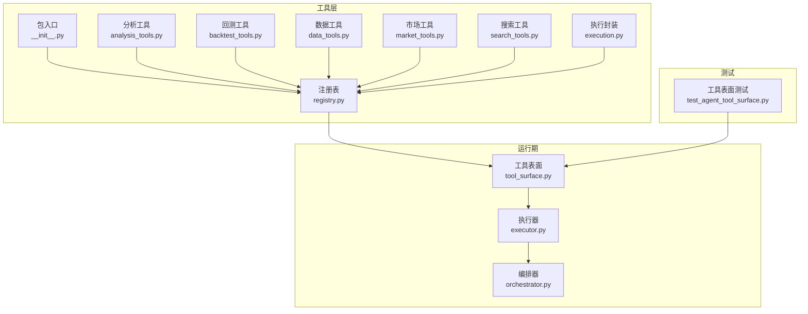
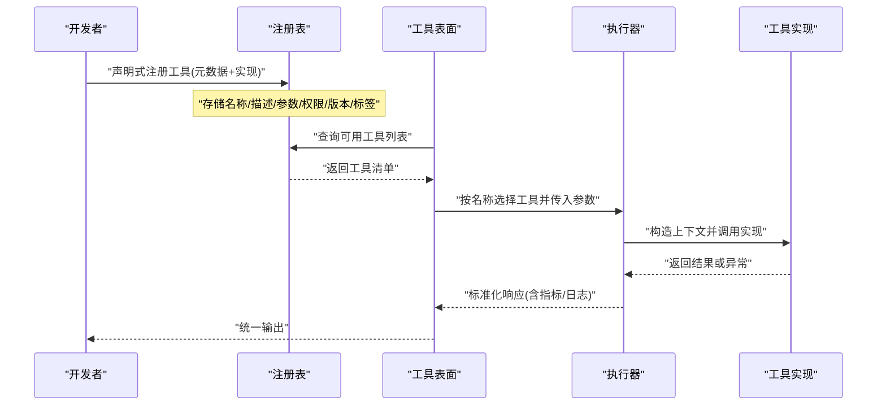
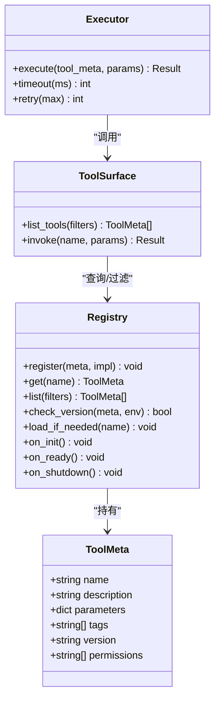
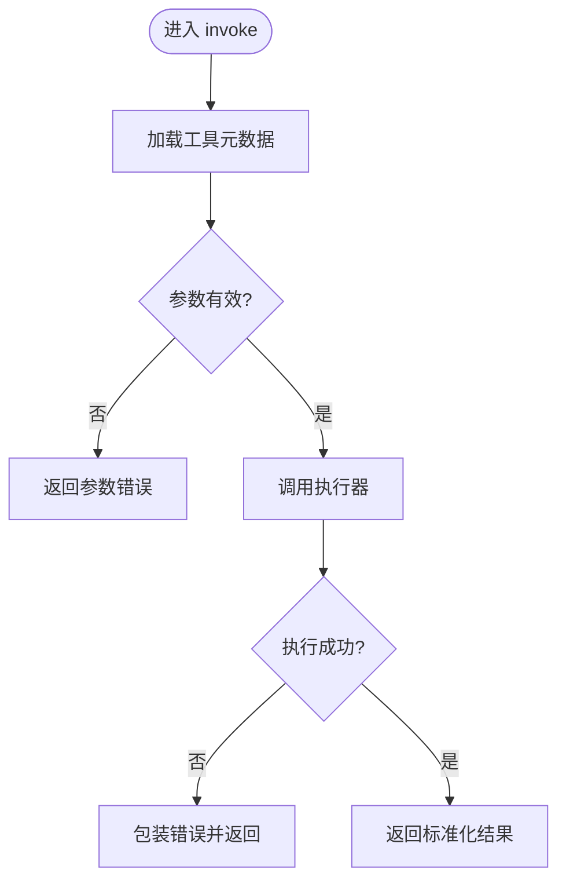
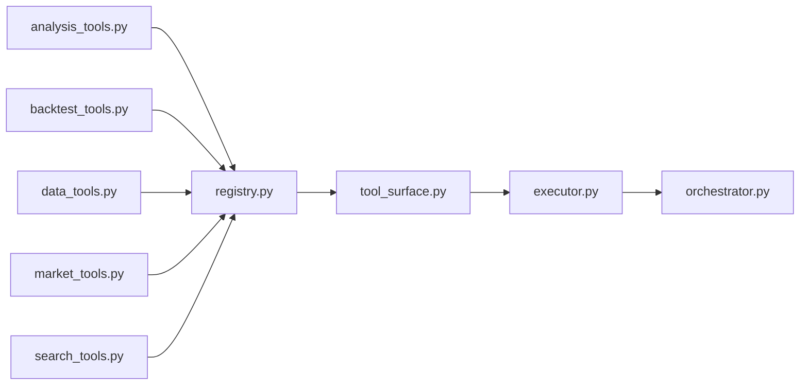

# 工具注册机制

<cite>
**本文引用的文件**   
- [src/agent/tools/registry.py](file://src/agent/tools/registry.py)
- [src/agent/tools/__init__.py](file://src/agent/tools/__init__.py)
- [src/agent/tools/analysis_tools.py](file://src/agent/tools/analysis_tools.py)
- [src/agent/tools/backtest_tools.py](file://src/agent/tools/backtest_tools.py)
- [src/agent/tools/data_tools.py](file://src/agent/tools/data_tools.py)
- [src/agent/tools/market_tools.py](file://src/agent/tools/market_tools.py)
- [src/agent/tools/search_tools.py](file://src/agent/tools/search_tools.py)
- [src/agent/tools/execution.py](file://src/agent/tools/execution.py)
- [src/agent/tool_surface.py](file://src/agent/tool_surface.py)
- [src/agent/executor.py](file://src/agent/executor.py)
- [src/agent/orchestrator.py](file://src/agent/orchestrator.py)
- [tests/test_agent_tool_surface.py](file://tests/test_agent_tool_surface.py)
</cite>

## 目录
1. [简介](#简介)
2. [项目结构](#项目结构)
3. [核心组件](#核心组件)
4. [架构总览](#架构总览)
5. [详细组件分析](#详细组件分析)
6. [依赖关系分析](#依赖关系分析)
7. [性能考量](#性能考量)
8. [故障排查指南](#故障排查指南)
9. [结论](#结论)
10. [附录](#附录)

## 简介
本文件系统性阐述项目的“工具注册机制”，覆盖以下关键主题：
- 工具注册表的工作原理与数据结构
- 工具的声明式定义、动态加载与生命周期管理
- 工具元数据规范（名称、描述、参数定义、权限设置）
- 工具发现机制（自动扫描、手动注册、条件加载）
- 工具版本管理与兼容性检查
- 最佳实践（命名规范、文档要求、错误处理策略）
- 具体示例（如何注册新工具与扩展现有工具集）

该机制位于 agent 子系统中，围绕 registry（注册表）、tool_surface（对外暴露面）、executor（执行器）和 orchestrator（编排器）等模块协作完成。

## 项目结构
与工具注册相关的代码主要分布在 src/agent/tools 目录下，并通过 src/agent/tool_surface.py 暴露统一接口，由 executor 与 orchestrator 在运行时调用。测试用例位于 tests/test_agent_tool_surface.py。

图表来源
- [src/agent/tools/registry.py](file://src/agent/tools/registry.py)
- [src/agent/tools/__init__.py](file://src/agent/tools/__init__.py)
- [src/agent/tools/analysis_tools.py](file://src/agent/tools/analysis_tools.py)
- [src/agent/tools/backtest_tools.py](file://src/agent/tools/backtest_tools.py)
- [src/agent/tools/data_tools.py](file://src/agent/tools/data_tools.py)
- [src/agent/tools/market_tools.py](file://src/agent/tools/market_tools.py)
- [src/agent/tools/search_tools.py](file://src/agent/tools/search_tools.py)
- [src/agent/tools/execution.py](file://src/agent/tools/execution.py)
- [src/agent/tool_surface.py](file://src/agent/tool_surface.py)
- [src/agent/executor.py](file://src/agent/executor.py)
- [src/agent/orchestrator.py](file://src/agent/orchestrator.py)
- [tests/test_agent_tool_surface.py](file://tests/test_agent_tool_surface.py)

章节来源
- [src/agent/tools/__init__.py](file://src/agent/tools/__init__.py)
- [src/agent/tools/registry.py](file://src/agent/tools/registry.py)
- [src/agent/tool_surface.py](file://src/agent/tool_surface.py)
- [src/agent/executor.py](file://src/agent/executor.py)
- [src/agent/orchestrator.py](file://src/agent/orchestrator.py)
- [tests/test_agent_tool_surface.py](file://tests/test_agent_tool_surface.py)

## 核心组件
- 工具注册表（Registry）
  - 职责：集中维护工具元数据与实现映射，提供查询、过滤、版本校验与生命周期钩子。
  - 关键能力：按名称/标签检索、按权限过滤、按版本兼容检查、按需延迟加载。
- 工具表面（Tool Surface）
  - 职责：为上层（executor/orchestrator）提供统一的工具发现与调用入口，屏蔽底层注册细节。
  - 关键能力：列出可用工具、解析参数契约、路由到具体实现、聚合错误信息。
- 执行器（Executor）
  - 职责：根据工具元数据构建上下文、序列化参数、调用实现并收集结果与指标。
  - 关键能力：超时控制、重试策略、资源清理、日志与追踪。
- 编排器（Orchestrator）
  - 职责：协调多个工具的执行顺序、分支与合并，管理会话级状态。
  - 关键能力：流程编排、条件分支、错误恢复、结果汇总。

章节来源
- [src/agent/tools/registry.py](file://src/agent/tools/registry.py)
- [src/agent/tool_surface.py](file://src/agent/tool_surface.py)
- [src/agent/executor.py](file://src/agent/executor.py)
- [src/agent/orchestrator.py](file://src/agent/orchestrator.py)

## 架构总览
下图展示了从“工具定义”到“运行时调用”的完整链路，包括注册、发现、参数校验、执行与返回。

图表来源
- [src/agent/tools/registry.py](file://src/agent/tools/registry.py)
- [src/agent/tool_surface.py](file://src/agent/tool_surface.py)
- [src/agent/executor.py](file://src/agent/executor.py)

## 详细组件分析

### 工具注册表（Registry）
- 设计要点
  - 以“名称→元数据+实现”为核心映射，支持按标签、权限、版本筛选。
  - 支持延迟加载：仅在首次使用时导入具体模块，降低启动开销。
  - 生命周期钩子：初始化、预热、销毁阶段可注入自定义逻辑。
- 元数据结构
  - 名称：唯一标识，建议采用小写下划线分隔。
  - 描述：用于 UI 展示与 LLM 提示词生成。
  - 参数定义：字段名、类型、默认值、是否必填、校验规则。
  - 权限：角色/范围限制，决定哪些调用者可使用。
  - 版本：语义化版本，配合兼容性矩阵进行校验。
  - 标签：分类与检索维度（如 data/market/backtest）。
- 动态加载
  - 通过约定路径或显式配置，按需 import 工具模块。
  - 失败时记录警告并跳过，避免影响整体启动。
- 版本与兼容
  - 比较当前运行环境与工具声明的最小/最大版本。
  - 不满足时拒绝加载或降级至兼容实现。

图表来源
- [src/agent/tools/registry.py](file://src/agent/tools/registry.py)
- [src/agent/tool_surface.py](file://src/agent/tool_surface.py)
- [src/agent/executor.py](file://src/agent/executor.py)

章节来源
- [src/agent/tools/registry.py](file://src/agent/tools/registry.py)

### 工具表面（Tool Surface）
- 职责
  - 暴露稳定的 API：列出工具、获取元数据、调用工具。
  - 对上游隐藏注册细节，便于替换实现或扩展。
- 关键行为
  - 参数校验：依据元数据的参数定义进行类型与必填校验。
  - 错误聚合：将底层异常转换为统一错误结构。
  - 缓存：对工具列表与元数据进行短期缓存，减少重复查询。

图表来源
- [src/agent/tool_surface.py](file://src/agent/tool_surface.py)
- [src/agent/executor.py](file://src/agent/executor.py)

章节来源
- [src/agent/tool_surface.py](file://src/agent/tool_surface.py)

### 执行器（Executor）
- 职责
  - 负责实际调用工具实现，管理超时、重试、资源清理。
  - 采集执行指标（耗时、错误率）并写入日志/追踪。
- 关键行为
  - 上下文构建：注入请求 ID、用户身份、租户信息等。
  - 幂等性：对可重试操作进行去重或幂等键管理。
  - 优雅退出：在进程关闭时取消未完成任务。

章节来源
- [src/agent/executor.py](file://src/agent/executor.py)

### 编排器（Orchestrator）
- 职责
  - 组合多个工具形成工作流，支持分支、循环、并行。
  - 管理会话级状态，确保跨工具的数据一致性。
- 关键行为
  - 条件路由：基于输入或中间结果选择不同工具链。
  - 错误恢复：捕获异常并尝试替代路径或回滚。

章节来源
- [src/agent/orchestrator.py](file://src/agent/orchestrator.py)

### 工具实现与声明式注册
- 典型工具模块
  - analysis_tools.py：分析与计算类工具
  - backtest_tools.py：回测相关工具
  - data_tools.py：数据获取与清洗工具
  - market_tools.py：市场信息与行情工具
  - search_tools.py：搜索与情报工具
- 声明式注册模式
  - 在模块内定义工具元数据与实现函数。
  - 通过注册表提供的装饰器或注册函数完成登记。
  - 支持按标签分组，便于 UI 与权限控制。

章节来源
- [src/agent/tools/analysis_tools.py](file://src/agent/tools/analysis_tools.py)
- [src/agent/tools/backtest_tools.py](file://src/agent/tools/backtest_tools.py)
- [src/agent/tools/data_tools.py](file://src/agent/tools/data_tools.py)
- [src/agent/tools/market_tools.py](file://src/agent/tools/market_tools.py)
- [src/agent/tools/search_tools.py](file://src/agent/tools/search_tools.py)
- [src/agent/tools/execution.py](file://src/agent/tools/execution.py)

## 依赖关系分析
- 模块耦合
  - tool_surface 依赖 registry 与 executor，保持低耦合。
  - executor 仅依赖 registry 的工具元数据与实现引用。
  - orchestrator 依赖 tool_surface 的统一接口，不直接访问 registry。
- 外部依赖
  - 工具实现可能依赖第三方库（如行情源、数据库），通过隔离与降级保证稳定性。
- 潜在循环依赖
  - 通过分层与接口抽象避免循环；工具实现不应反向依赖 orchestrator。

图表来源
- [src/agent/tools/registry.py](file://src/agent/tools/registry.py)
- [src/agent/tool_surface.py](file://src/agent/tool_surface.py)
- [src/agent/executor.py](file://src/agent/executor.py)
- [src/agent/orchestrator.py](file://src/agent/orchestrator.py)
- [src/agent/tools/analysis_tools.py](file://src/agent/tools/analysis_tools.py)
- [src/agent/tools/backtest_tools.py](file://src/agent/tools/backtest_tools.py)
- [src/agent/tools/data_tools.py](file://src/agent/tools/data_tools.py)
- [src/agent/tools/market_tools.py](file://src/agent/tools/market_tools.py)
- [src/agent/tools/search_tools.py](file://src/agent/tools/search_tools.py)

章节来源
- [src/agent/tools/registry.py](file://src/agent/tools/registry.py)
- [src/agent/tool_surface.py](file://src/agent/tool_surface.py)
- [src/agent/executor.py](file://src/agent/executor.py)
- [src/agent/orchestrator.py](file://src/agent/orchestrator.py)

## 性能考量
- 启动优化
  - 延迟加载工具模块，避免冷启动耗时。
  - 工具列表与元数据缓存，减少重复查询。
- 执行优化
  - 合理设置超时与重试上限，防止雪崩。
  - 批量操作与并发控制，提升吞吐。
- 内存与资源
  - 及时释放临时对象，避免长连接泄漏。
  - 大对象传递使用引用或流式处理。

[本节为通用指导，无需特定文件来源]

## 故障排查指南
- 常见问题
  - 工具未找到：检查名称拼写与注册时机，确认模块已导入。
  - 参数校验失败：核对元数据中的参数定义与实际入参。
  - 权限不足：检查调用方角色与工具权限配置。
  - 版本不兼容：查看运行环境版本与工具声明的兼容矩阵。
- 定位方法
  - 启用调试日志，关注注册与加载阶段的警告。
  - 使用工具表面提供的“列出工具”接口验证可见性。
  - 在 executor 中增加追踪 ID，串联调用链路。

章节来源
- [tests/test_agent_tool_surface.py](file://tests/test_agent_tool_surface.py)

## 结论
工具注册机制通过清晰的元数据模型、延迟加载与统一表面，实现了高内聚、低耦合的工具生态。借助版本兼容、权限控制与生命周期钩子，系统具备良好的可扩展性与可运维性。遵循本文的最佳实践，可快速安全地扩展工具集并保障质量。

[本节为总结性内容，无需特定文件来源]

## 附录

### 工具元数据规范
- 名称：唯一、可读、稳定
- 描述：简洁明确，面向 LLM 与人类双读
- 参数：字段名、类型、默认值、必填、校验规则
- 权限：最小权限原则，按角色/范围划分
- 版本：语义化版本，声明最小/最大兼容
- 标签：分类维度，便于检索与展示

[本节为概念说明，无需特定文件来源]

### 工具发现机制
- 自动扫描：按约定路径扫描工具模块并注册
- 手动注册：在应用启动时显式调用注册接口
- 条件加载：根据环境变量、功能开关或运行时条件决定是否加载

[本节为概念说明，无需特定文件来源]

### 版本管理与兼容性检查
- 版本比较：解析语义化版本，判断是否在允许区间
- 兼容矩阵：维护运行环境与工具版本的对应关系
- 降级策略：在不兼容时切换至兼容实现或禁用功能

[本节为概念说明，无需特定文件来源]

### 最佳实践
- 命名规范：小写下划线分隔，避免歧义
- 文档要求：每个工具提供清晰描述与参数说明
- 错误处理：统一错误码与消息，便于前端与日志分析
- 测试覆盖：为工具实现与注册流程编写单元测试

[本节为概念说明，无需特定文件来源]

### 示例：注册新工具与扩展现有工具集
- 新增工具步骤
  - 在 tools 目录下创建模块，定义元数据与实现函数
  - 使用注册表提供的注册方式登记工具
  - 添加标签与权限，完善描述
  - 在测试中验证注册与调用链路
- 扩展现有工具
  - 复用现有元数据模板，补充新功能参数
  - 通过版本升级与兼容矩阵管理变更
  - 更新测试用例与文档

章节来源
- [src/agent/tools/analysis_tools.py](file://src/agent/tools/analysis_tools.py)
- [src/agent/tools/backtest_tools.py](file://src/agent/tools/backtest_tools.py)
- [src/agent/tools/data_tools.py](file://src/agent/tools/data_tools.py)
- [src/agent/tools/market_tools.py](file://src/agent/tools/market_tools.py)
- [src/agent/tools/search_tools.py](file://src/agent/tools/search_tools.py)
- [src/agent/tools/execution.py](file://src/agent/tools/execution.py)
- [tests/test_agent_tool_surface.py](file://tests/test_agent_tool_surface.py)