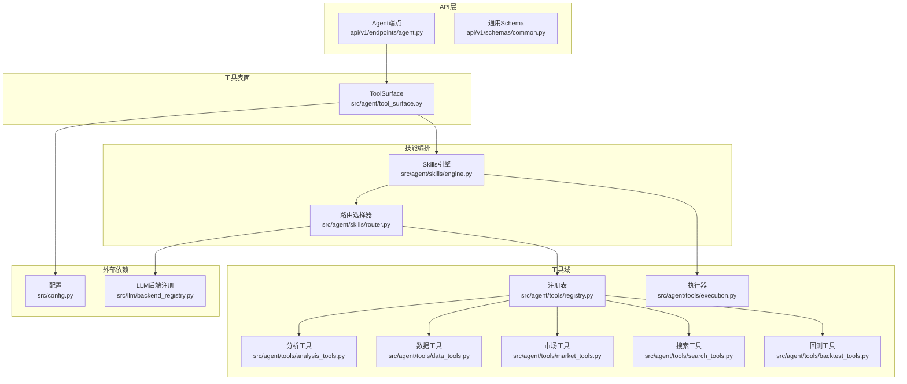
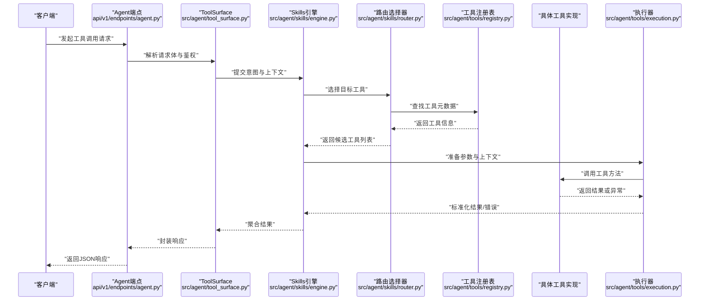
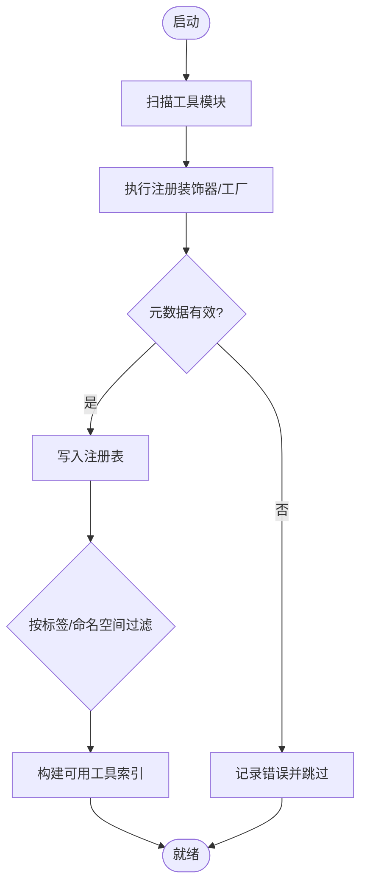
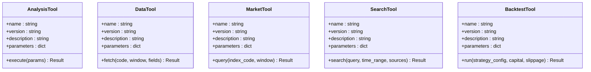
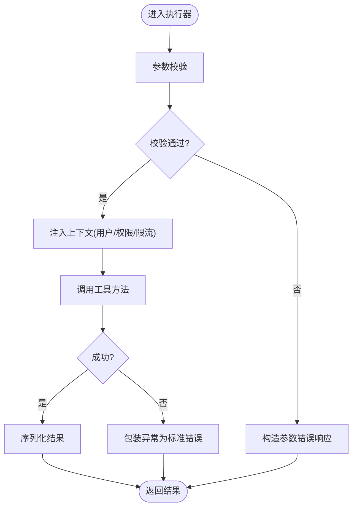
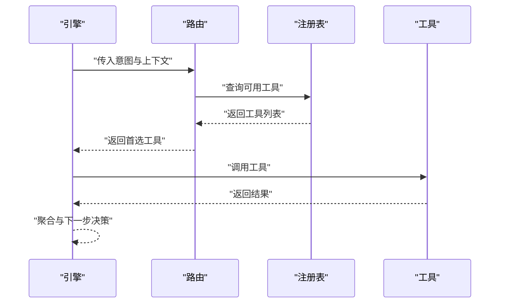
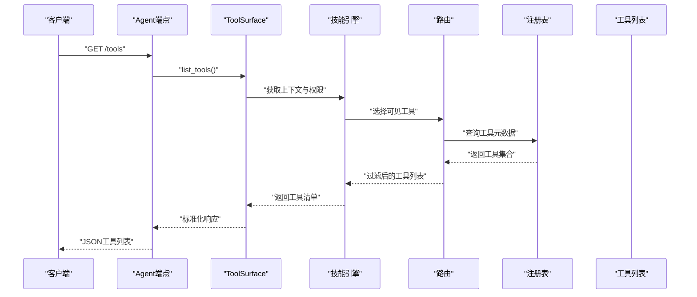
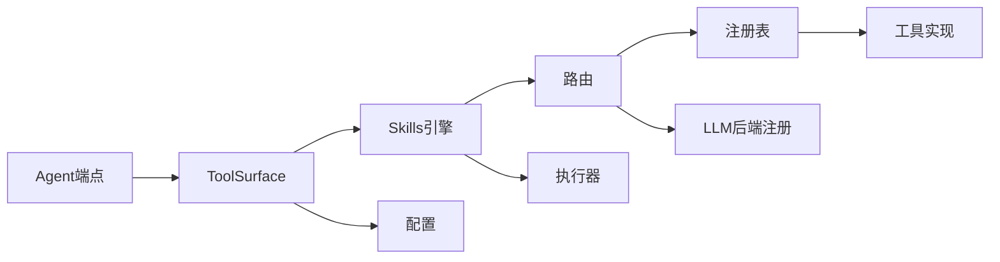

# 工具系统

<cite>
**本文引用的文件**   
- [src/agent/tools/registry.py](file://src/agent/tools/registry.py)
- [src/agent/tools/analysis_tools.py](file://src/agent/tools/analysis_tools.py)
- [src/agent/tools/data_tools.py](file://src/agent/tools/data_tools.py)
- [src/agent/tools/market_tools.py](file://src/agent/tools/market_tools.py)
- [src/agent/tools/search_tools.py](file://src/agent/tools/search_tools.py)
- [src/agent/tools/backtest_tools.py](file://src/agent/tools/backtest_tools.py)
- [src/agent/tools/execution.py](file://src/agent/tools/execution.py)
- [src/agent/skills/engine.py](file://src/agent/skills/engine.py)
- [src/agent/skills/router.py](file://src/agent/skills/router.py)
- [src/agent/tool_surface.py](file://src/agent/tool_surface.py)
- [api/v1/endpoints/agent.py](file://api/v1/endpoints/agent.py)
- [api/v1/schemas/common.py](file://api/v1/schemas/common.py)
- [src/llm/backend_registry.py](file://src/llm/backend_registry.py)
- [src/config.py](file://src/config.py)
</cite>

## 目录
1. [简介](#简介)
2. [项目结构](#项目结构)
3. [核心组件](#核心组件)
4. [架构总览](#架构总览)
5. [详细组件分析](#详细组件分析)
6. [依赖关系分析](#依赖关系分析)
7. [性能考量](#性能考量)
8. [故障排查指南](#故障排查指南)
9. [结论](#结论)
10. [附录](#附录)

## 简介
本文件面向“工具系统”的完整说明，覆盖工具的声明式定义、注册与发现机制、内置工具集（分析、数据获取、市场查询、搜索等）的功能边界、工具调用协议（参数传递、结果返回、错误处理）、权限控制与访问限制的实现方式，以及自定义工具开发指南（接口规范、参数校验、文档生成）。文档同时提供代码级架构图与流程图，帮助读者快速理解并扩展系统能力。

## 项目结构
工具系统位于 src/agent/tools 目录下，按功能域划分多个工具模块，并通过统一的注册表进行集中管理；上层通过 skills 引擎与路由进行调度，对外暴露于 agent API 端点。关键路径如下：
- 工具注册与发现：src/agent/tools/registry.py
- 工具实现：src/agent/tools/{analysis_tools,data_tools,market_tools,search_tools,backtest_tools}.py
- 执行编排与上下文注入：src/agent/tools/execution.py
- 技能引擎与路由：src/agent/skills/engine.py, src/agent/skills/router.py
- 工具表面（对外暴露）：src/agent/tool_surface.py
- Agent API 入口：api/v1/endpoints/agent.py
- 通用响应模型：api/v1/schemas/common.py
- LLM 后端注册（影响工具可用性与路由）：src/llm/backend_registry.py
- 全局配置（含鉴权与开关）：src/config.py

图表来源
- [api/v1/endpoints/agent.py](file://api/v1/endpoints/agent.py)
- [api/v1/schemas/common.py](file://api/v1/schemas/common.py)
- [src/agent/tool_surface.py](file://src/agent/tool_surface.py)
- [src/agent/skills/engine.py](file://src/agent/skills/engine.py)
- [src/agent/skills/router.py](file://src/agent/skills/router.py)
- [src/agent/tools/registry.py](file://src/agent/tools/registry.py)
- [src/agent/tools/analysis_tools.py](file://src/agent/tools/analysis_tools.py)
- [src/agent/tools/data_tools.py](file://src/agent/tools/data_tools.py)
- [src/agent/tools/market_tools.py](file://src/agent/tools/market_tools.py)
- [src/agent/tools/search_tools.py](file://src/agent/tools/search_tools.py)
- [src/agent/tools/backtest_tools.py](file://src/agent/tools/backtest_tools.py)
- [src/agent/tools/execution.py](file://src/agent/tools/execution.py)
- [src/config.py](file://src/config.py)
- [src/llm/backend_registry.py](file://src/llm/backend_registry.py)

章节来源
- [src/agent/tools/registry.py](file://src/agent/tools/registry.py)
- [src/agent/skills/engine.py](file://src/agent/skills/engine.py)
- [src/agent/skills/router.py](file://src/agent/skills/router.py)
- [src/agent/tool_surface.py](file://src/agent/tool_surface.py)
- [api/v1/endpoints/agent.py](file://api/v1/endpoints/agent.py)

## 核心组件
- 工具注册表（Registry）
  - 职责：维护工具元数据（名称、描述、参数Schema、权限标签、是否启用），支持动态加载与按需发现。
  - 关键点：声明式装饰器或工厂函数用于注册；启动时扫描模块并自动注册；运行时可热更新。
- 工具实现（Tools）
  - 分析工具：技术指标计算、形态识别、因子合成等。
  - 数据工具：历史行情、财务指标、资金流向、股票基础信息等。
  - 市场工具：指数行情、板块热度、宏观日历等。
  - 搜索工具：新闻、研报、公告检索与摘要。
  - 回测工具：策略回测、绩效统计、交易信号回放。
- 执行器（Execution）
  - 职责：统一参数校验、上下文注入（如用户ID、权限、租户）、限流与重试、结果序列化与错误包装。
- 技能引擎与路由（Engine & Router）
  - 职责：根据意图与上下文选择合适工具，编排多步调用，聚合结果。
- 工具表面（ToolSurface）
  - 职责：将内部工具以统一接口暴露给上层（如Agent、WebUI、Bot），屏蔽实现细节。
- 配置与权限（Config & Auth）
  - 职责：读取系统配置（开关、密钥、配额），结合中间件完成鉴权与访问控制。

章节来源
- [src/agent/tools/registry.py](file://src/agent/tools/registry.py)
- [src/agent/tools/analysis_tools.py](file://src/agent/tools/analysis_tools.py)
- [src/agent/tools/data_tools.py](file://src/agent/tools/data_tools.py)
- [src/agent/tools/market_tools.py](file://src/agent/tools/market_tools.py)
- [src/agent/tools/search_tools.py](file://src/agent/tools/search_tools.py)
- [src/agent/tools/backtest_tools.py](file://src/agent/tools/backtest_tools.py)
- [src/agent/tools/execution.py](file://src/agent/tools/execution.py)
- [src/agent/skills/engine.py](file://src/agent/skills/engine.py)
- [src/agent/skills/router.py](file://src/agent/skills/router.py)
- [src/agent/tool_surface.py](file://src/agent/tool_surface.py)
- [src/config.py](file://src/config.py)

## 架构总览
下图展示了从API到工具执行的端到端流程，包括注册、路由、执行与返回。

图表来源
- [api/v1/endpoints/agent.py](file://api/v1/endpoints/agent.py)
- [src/agent/tool_surface.py](file://src/agent/tool_surface.py)
- [src/agent/skills/engine.py](file://src/agent/skills/engine.py)
- [src/agent/skills/router.py](file://src/agent/skills/router.py)
- [src/agent/tools/registry.py](file://src/agent/tools/registry.py)
- [src/agent/tools/execution.py](file://src/agent/tools/execution.py)

## 详细组件分析

### 工具注册与发现（Registry）
- 设计要点
  - 声明式注册：通过装饰器或工厂函数在模块导入时完成注册，避免手动维护清单。
  - 元数据结构：包含名称、版本、描述、参数Schema（类型、必填、默认值、枚举）、权限标签、启用状态。
  - 动态加载：支持按命名空间或标签过滤，便于插件化扩展。
  - 冲突检测：同名工具注册时抛出明确错误，保证唯一性。
- 典型流程
  - 启动阶段扫描 tools 子模块，收集所有已注册工具。
  - 运行时根据路由策略筛选可用工具集合。
  - 支持热重载：重新扫描变更的工具模块并更新注册表。

图表来源
- [src/agent/tools/registry.py](file://src/agent/tools/registry.py)

章节来源
- [src/agent/tools/registry.py](file://src/agent/tools/registry.py)

### 工具实现（Analysis/Data/Market/Search/Backtest）
- 分析工具
  - 功能：技术指标计算、形态识别、因子合成、信号生成。
  - 输入：标的代码、时间窗口、指标参数。
  - 输出：结构化指标序列、信号标记、置信度。
- 数据工具
  - 功能：历史K线、财务指标、资金流向、股票基本信息。
  - 输入：标的、时间范围、字段选择。
  - 输出：DataFrame/字典结构，带缺失值与质量标记。
- 市场工具
  - 功能：指数行情、板块热度、宏观事件。
  - 输入：指数/板块代码、时间范围。
  - 输出：指数序列、热度评分、事件摘要。
- 搜索工具
  - 功能：新闻、研报、公告检索与摘要。
  - 输入：关键词、时间范围、来源过滤。
  - 输出：搜索结果列表、摘要、来源链接。
- 回测工具
  - 功能：策略回测、绩效统计、交易信号回放。
  - 输入：策略配置、初始资金、滑点手续费。
  - 输出：收益曲线、回撤、胜率、持仓明细。

图表来源
- [src/agent/tools/analysis_tools.py](file://src/agent/tools/analysis_tools.py)
- [src/agent/tools/data_tools.py](file://src/agent/tools/data_tools.py)
- [src/agent/tools/market_tools.py](file://src/agent/tools/market_tools.py)
- [src/agent/tools/search_tools.py](file://src/agent/tools/search_tools.py)
- [src/agent/tools/backtest_tools.py](file://src/agent/tools/backtest_tools.py)

章节来源
- [src/agent/tools/analysis_tools.py](file://src/agent/tools/analysis_tools.py)
- [src/agent/tools/data_tools.py](file://src/agent/tools/data_tools.py)
- [src/agent/tools/market_tools.py](file://src/agent/tools/market_tools.py)
- [src/agent/tools/search_tools.py](file://src/agent/tools/search_tools.py)
- [src/agent/tools/backtest_tools.py](file://src/agent/tools/backtest_tools.py)

### 执行器与上下文注入（Execution）
- 职责
  - 参数校验：基于Schema进行类型、必填、取值范围检查。
  - 上下文注入：用户ID、租户、权限标签、速率限制令牌。
  - 错误处理：捕获异常并转换为标准错误响应。
  - 结果序列化：统一为JSON兼容结构。
- 关键流程
  - 接收工具名与参数 -> 校验 -> 注入上下文 -> 调用工具 -> 捕获异常 -> 标准化返回。

图表来源
- [src/agent/tools/execution.py](file://src/agent/tools/execution.py)

章节来源
- [src/agent/tools/execution.py](file://src/agent/tools/execution.py)

### 技能引擎与路由（Engine & Router）
- 引擎（Engine）
  - 负责编排多步工具调用，维护会话状态，聚合中间结果。
  - 支持并行调用与超时控制。
- 路由（Router）
  - 根据意图、上下文与工具元数据选择最合适的工具。
  - 支持优先级、标签匹配与降级策略。

图表来源
- [src/agent/skills/engine.py](file://src/agent/skills/engine.py)
- [src/agent/skills/router.py](file://src/agent/skills/router.py)
- [src/agent/tools/registry.py](file://src/agent/tools/registry.py)

章节来源
- [src/agent/skills/engine.py](file://src/agent/skills/engine.py)
- [src/agent/skills/router.py](file://src/agent/skills/router.py)

### 工具表面（ToolSurface）与API端点
- ToolSurface
  - 统一封装工具调用，屏蔽内部实现差异。
  - 提供高层接口：list_tools、call_tool、batch_call。
- Agent端点
  - 接收HTTP请求，解析请求体，调用ToolSurface。
  - 使用通用Schema进行响应建模。

图表来源
- [api/v1/endpoints/agent.py](file://api/v1/endpoints/agent.py)
- [src/agent/tool_surface.py](file://src/agent/tool_surface.py)
- [src/agent/skills/engine.py](file://src/agent/skills/engine.py)
- [src/agent/skills/router.py](file://src/agent/skills/router.py)
- [src/agent/tools/registry.py](file://src/agent/tools/registry.py)

章节来源
- [api/v1/endpoints/agent.py](file://api/v1/endpoints/agent.py)
- [src/agent/tool_surface.py](file://src/agent/tool_surface.py)
- [api/v1/schemas/common.py](file://api/v1/schemas/common.py)

## 依赖关系分析
- 组件耦合
  - ToolSurface 依赖 Skills 引擎与路由；引擎依赖注册表；路由依赖注册表与LLM后端注册。
  - 执行器独立于工具实现，仅依赖Schema与配置。
- 外部依赖
  - LLM后端注册影响工具可用性（某些工具需要特定模型能力）。
  - 配置模块提供鉴权、开关、配额等。

图表来源
- [api/v1/endpoints/agent.py](file://api/v1/endpoints/agent.py)
- [src/agent/tool_surface.py](file://src/agent/tool_surface.py)
- [src/agent/skills/engine.py](file://src/agent/skills/engine.py)
- [src/agent/skills/router.py](file://src/agent/skills/router.py)
- [src/agent/tools/registry.py](file://src/agent/tools/registry.py)
- [src/agent/tools/execution.py](file://src/agent/tools/execution.py)
- [src/llm/backend_registry.py](file://src/llm/backend_registry.py)
- [src/config.py](file://src/config.py)

章节来源
- [src/agent/tools/registry.py](file://src/agent/tools/registry.py)
- [src/agent/skills/engine.py](file://src/agent/skills/engine.py)
- [src/agent/skills/router.py](file://src/agent/skills/router.py)
- [src/agent/tool_surface.py](file://src/agent/tool_surface.py)
- [src/agent/tools/execution.py](file://src/agent/tools/execution.py)
- [src/llm/backend_registry.py](file://src/llm/backend_registry.py)
- [src/config.py](file://src/config.py)

## 性能考量
- 注册表查询：建议使用索引（按名称、标签、命名空间）降低O(n)扫描成本。
- 工具调用：支持并发与超时控制，避免长尾阻塞。
- 结果缓存：对热点数据（如指数行情、热门新闻）做短期缓存。
- Schema校验：尽量在入口处完成，减少后续分支判断开销。
- 资源隔离：不同租户/用户间的配额与限流，防止资源争用。

[本节为通用指导，不直接分析具体文件]

## 故障排查指南
- 常见问题
  - 工具未注册：检查模块导入顺序与装饰器是否正确执行。
  - 参数校验失败：核对Schema定义与实际传参类型。
  - 权限不足：确认用户角色与工具权限标签匹配。
  - 调用超时：检查下游服务健康与网络状况。
- 定位步骤
  - 查看执行器日志中的参数校验与异常包装信息。
  - 检查注册表中的工具元数据与启用状态。
  - 验证配置项（鉴权、限流、开关）。
  - 使用API端点的诊断接口获取工具清单与状态。

章节来源
- [src/agent/tools/execution.py](file://src/agent/tools/execution.py)
- [src/agent/tools/registry.py](file://src/agent/tools/registry.py)
- [src/config.py](file://src/config.py)
- [api/v1/endpoints/agent.py](file://api/v1/endpoints/agent.py)

## 结论
工具系统通过声明式注册、统一执行与清晰的路由机制，实现了高内聚、低耦合的工具生态。内置工具覆盖分析、数据、市场、搜索与回测等核心场景，配合权限控制与配置开关，满足多样化业务需求。开发者可依据接口规范快速扩展自定义工具，保持与现有系统的无缝集成。

[本节为总结性内容，不直接分析具体文件]

## 附录

### 工具调用协议
- 参数传递
  - 使用JSON格式，字段类型与必填项由Schema定义。
  - 支持默认值与可选参数。
- 结果返回
  - 统一JSON结构，包含数据、元数据与状态码。
  - 错误响应包含错误码、消息与建议操作。
- 错误处理
  - 参数错误：400，提示缺失或类型不符。
  - 权限错误：403，提示无访问权限。
  - 服务错误：5xx，提示上游异常与重试建议。

章节来源
- [api/v1/schemas/common.py](file://api/v1/schemas/common.py)
- [src/agent/tools/execution.py](file://src/agent/tools/execution.py)

### 权限控制与访问限制
- 实现方式
  - 工具元数据中包含权限标签（如 read/write/admin）。
  - 路由阶段根据用户角色过滤可用工具。
  - 执行器注入用户上下文，确保审计与限流。
- 最佳实践
  - 最小权限原则：仅授予必要权限。
  - 动态开关：通过配置临时禁用高风险工具。
  - 审计日志：记录工具调用者与参数摘要。

章节来源
- [src/agent/tools/registry.py](file://src/agent/tools/registry.py)
- [src/agent/skills/router.py](file://src/agent/skills/router.py)
- [src/config.py](file://src/config.py)

### 自定义工具开发指南
- 接口规范
  - 定义工具元数据：名称、版本、描述、参数Schema、权限标签。
  - 实现执行方法：接收参数，返回结构化结果或抛出异常。
- 参数验证
  - 使用Schema定义字段类型、必填、默认值、枚举。
  - 在执行器中统一校验，避免重复逻辑。
- 文档生成
  - 从元数据自动生成API文档与示例。
  - 支持多语言描述与国际化。
- 最佳实践
  - 单一职责：每个工具聚焦一个功能域。
  - 幂等性：相同参数多次调用应得到一致结果。
  - 可观测性：记录关键指标与错误堆栈。

章节来源
- [src/agent/tools/registry.py](file://src/agent/tools/registry.py)
- [src/agent/tools/execution.py](file://src/agent/tools/execution.py)
- [api/v1/schemas/common.py](file://api/v1/schemas/common.py)

### 实际代码示例（路径指引）
- 分析工具示例：参见 [src/agent/tools/analysis_tools.py](file://src/agent/tools/analysis_tools.py)
- 数据工具示例：参见 [src/agent/tools/data_tools.py](file://src/agent/tools/data_tools.py)
- 市场工具示例：参见 [src/agent/tools/market_tools.py](file://src/agent/tools/market_tools.py)
- 搜索工具示例：参见 [src/agent/tools/search_tools.py](file://src/agent/tools/search_tools.py)
- 回测工具示例：参见 [src/agent/tools/backtest_tools.py](file://src/agent/tools/backtest_tools.py)
- 注册与执行示例：参见 [src/agent/tools/registry.py](file://src/agent/tools/registry.py), [src/agent/tools/execution.py](file://src/agent/tools/execution.py)
- 技能编排示例：参见 [src/agent/skills/engine.py](file://src/agent/skills/engine.py), [src/agent/skills/router.py](file://src/agent/skills/router.py)
- API端点示例：参见 [api/v1/endpoints/agent.py](file://api/v1/endpoints/agent.py)

[本节为路径指引，不直接展示代码内容]