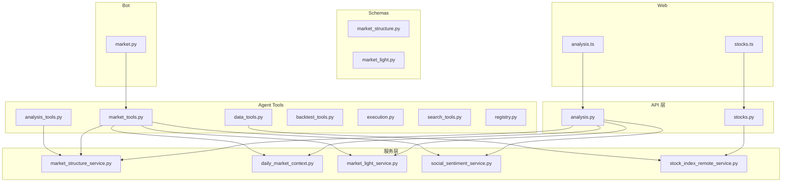
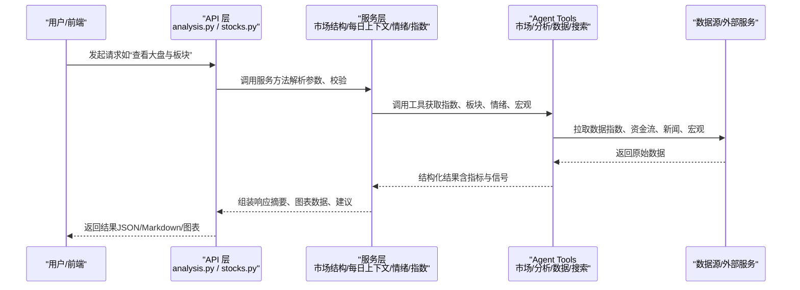
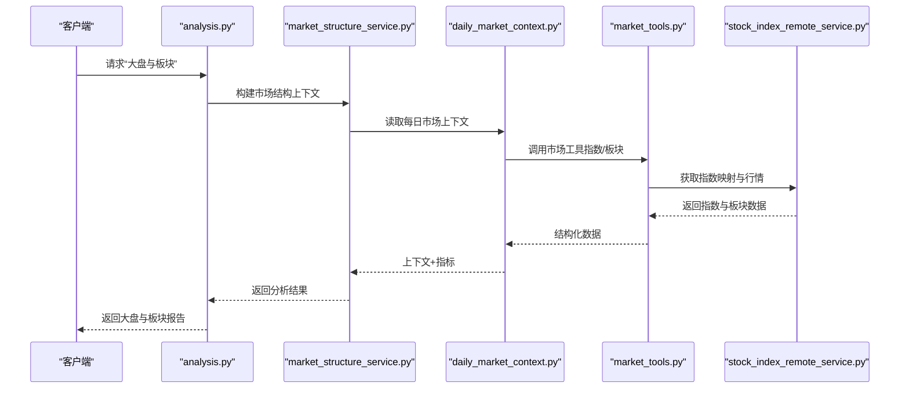
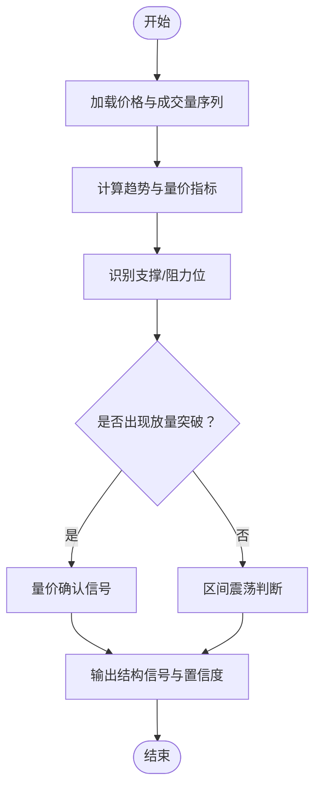
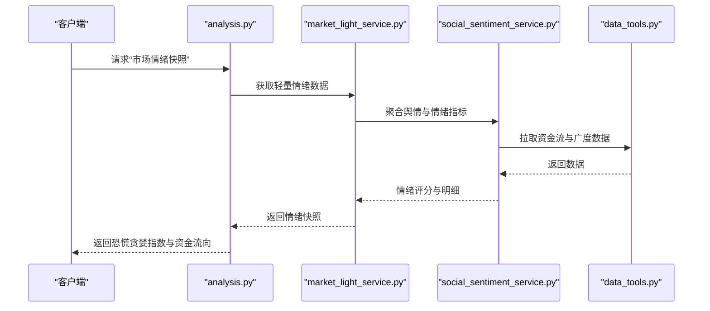
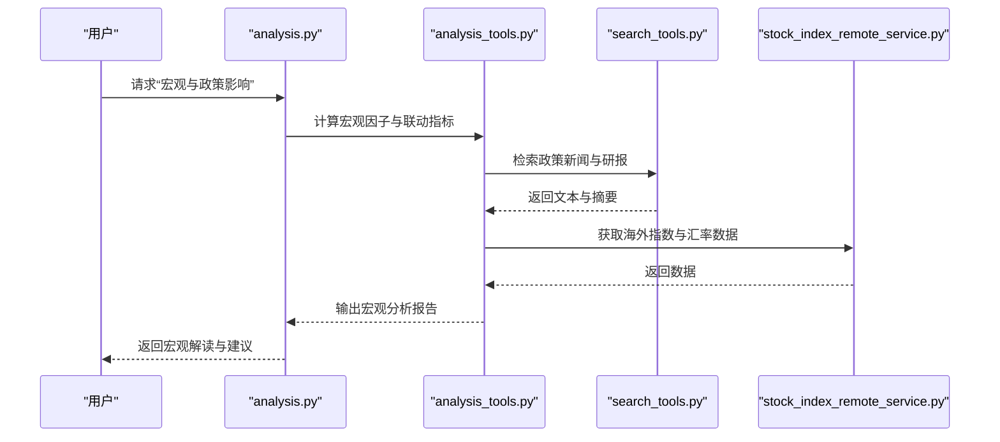
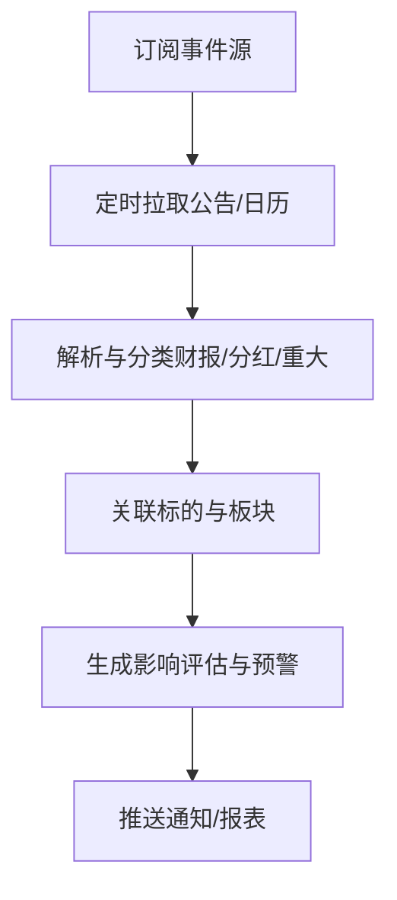
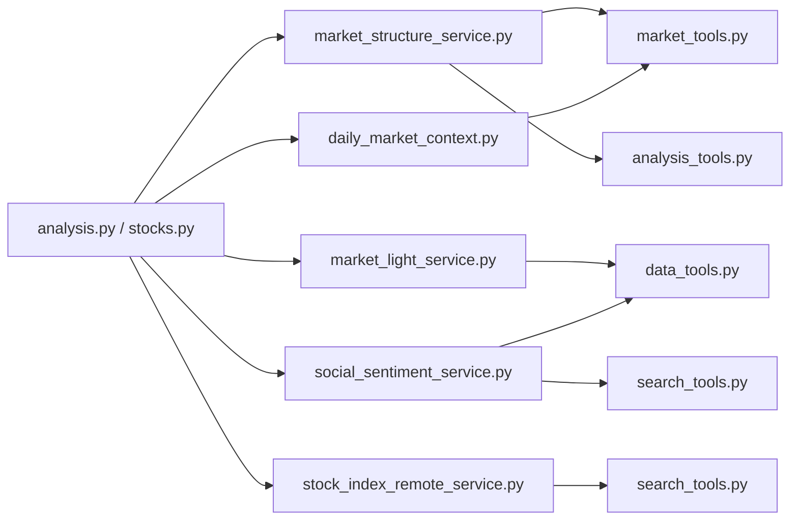

# 市场工具

<cite>
**本文引用的文件**   
- [market_tools.py](file://src/agent/tools/market_tools.py)
- [analysis_tools.py](file://src/agent/tools/analysis_tools.py)
- [data_tools.py](file://src/agent/tools/data_tools.py)
- [backtest_tools.py](file://src/agent/tools/backtest_tools.py)
- [execution.py](file://src/agent/tools/execution.py)
- [registry.py](file://src/agent/tools/registry.py)
- [search_tools.py](file://src/agent/tools/search_tools.py)
- [market_structure_service.py](file://src/services/market_structure_service.py)
- [daily_market_context.py](file://src/services/daily_market_context.py)
- [market_light_service.py](file://src/services/market_light_service.py)
- [social_sentiment_service.py](file://src/services/social_sentiment_service.py)
- [stock_index_remote_service.py](file://src/services/stock_index_remote_service.py)
- [market_analyzer.py](file://src/market_analyzer.py)
- [market_phase_summary.py](file://src/market_phase_summary.py)
- [market_structure_prompt.py](file://src/market_structure_prompt.py)
- [market_phase_prompt.py](file://src/market_phase_prompt.py)
- [schemas/market_structure.py](file://src/schemas/market_structure.py)
- [schemas/market_light.py](file://src/schemas/market_light.py)
- [api/v1/endpoints/analysis.py](file://api/v1/endpoints/analysis.py)
- [api/v1/endpoints/stocks.py](file://api/v1/endpoints/stocks.py)
- [api/v1/schemas/analysis.py](file://api/v1/schemas/analysis.py)
- [api/v1/schemas/stocks.py](file://api/v1/schemas/stocks.py)
- [bot/commands/market.py](file://bot/commands/market.py)
- [apps/dsa-web/src/api/analysis.ts](file://apps/dsa-web/src/api/analysis.ts)
- [apps/dsa-web/src/api/stocks.ts](file://apps/dsa-web/src/api/stocks.ts)
</cite>

## 目录
1. [简介](#简介)
2. [项目结构](#项目结构)
3. [核心组件](#核心组件)
4. [架构总览](#架构总览)
5. [详细组件分析](#详细组件分析)
6. [依赖关系分析](#依赖关系分析)
7. [性能考量](#性能考量)
8. [故障排查指南](#故障排查指南)
9. [结论](#结论)
10. [附录](#附录)

## 简介
本文件面向“市场工具”能力，系统性梳理并文档化以下模块：
- 市场状态查询工具：大盘指数、板块表现与行业轮动分析
- 市场结构分析工具：趋势判断、支撑阻力位识别与成交量分析
- 市场情绪工具：恐慌贪婪指数、资金流向分析与市场广度指标
- 宏观经济工具：经济指标查询、政策影响分析与国际市场分析
- 市场事件监控：财报发布、分红除权与重大事项公告
并提供具体使用场景与代码示例路径，帮助读者快速将市场工具用于投资决策支持。

## 项目结构
本项目采用分层与按功能域组织相结合的结构：
- API 层：对外暴露 REST 接口（分析、股票、历史等）
- 服务层：封装业务逻辑（市场结构、每日市场上下文、市场情绪等）
- Agent Tools：为智能体提供可调用工具（市场、数据、回测、执行、搜索等）
- Schemas：统一的数据模型定义
- Bot 命令：通过聊天机器人触发市场相关能力
- Web 前端：调用 API 展示结果

图表来源 
- [api/v1/endpoints/analysis.py](file://api/v1/endpoints/analysis.py)
- [api/v1/endpoints/stocks.py](file://api/v1/endpoints/stocks.py)
- [src/services/market_structure_service.py](file://src/services/market_structure_service.py)
- [src/services/daily_market_context.py](file://src/services/daily_market_context.py)
- [src/services/market_light_service.py](file://src/services/market_light_service.py)
- [src/services/social_sentiment_service.py](file://src/services/social_sentiment_service.py)
- [src/services/stock_index_remote_service.py](file://src/services/stock_index_remote_service.py)
- [src/agent/tools/market_tools.py](file://src/agent/tools/market_tools.py)
- [src/agent/tools/analysis_tools.py](file://src/agent/tools/analysis_tools.py)
- [src/agent/tools/data_tools.py](file://src/agent/tools/data_tools.py)
- [src/agent/tools/backtest_tools.py](file://src/agent/tools/backtest_tools.py)
- [src/agent/tools/execution.py](file://src/agent/tools/execution.py)
- [src/agent/tools/search_tools.py](file://src/agent/tools/search_tools.py)
- [src/agent/tools/registry.py](file://src/agent/tools/registry.py)
- [src/schemas/market_structure.py](file://src/schemas/market_structure.py)
- [src/schemas/market_light.py](file://src/schemas/market_light.py)
- [bot/commands/market.py](file://bot/commands/market.py)
- [apps/dsa-web/src/api/analysis.ts](file://apps/dsa-web/src/api/analysis.ts)
- [apps/dsa-web/src/api/stocks.ts](file://apps/dsa-web/src/api/stocks.ts)

章节来源
- [api/v1/endpoints/analysis.py](file://api/v1/endpoints/analysis.py)
- [api/v1/endpoints/stocks.py](file://api/v1/endpoints/stocks.py)
- [src/services/market_structure_service.py](file://src/services/market_structure_service.py)
- [src/services/daily_market_context.py](file://src/services/daily_market_context.py)
- [src/services/market_light_service.py](file://src/services/market_light_service.py)
- [src/services/social_sentiment_service.py](file://src/services/social_sentiment_service.py)
- [src/services/stock_index_remote_service.py](file://src/services/stock_index_remote_service.py)
- [src/agent/tools/market_tools.py](file://src/agent/tools/market_tools.py)
- [src/agent/tools/analysis_tools.py](file://src/agent/tools/analysis_tools.py)
- [src/agent/tools/data_tools.py](file://src/agent/tools/data_tools.py)
- [src/agent/tools/backtest_tools.py](file://src/agent/tools/backtest_tools.py)
- [src/agent/tools/execution.py](file://src/agent/tools/execution.py)
- [src/agent/tools/search_tools.py](file://src/agent/tools/search_tools.py)
- [src/agent/tools/registry.py](file://src/agent/tools/registry.py)
- [src/schemas/market_structure.py](file://src/schemas/market_structure.py)
- [src/schemas/market_light.py](file://src/schemas/market_light.py)
- [bot/commands/market.py](file://bot/commands/market.py)
- [apps/dsa-web/src/api/analysis.ts](file://apps/dsa-web/src/api/analysis.ts)
- [apps/dsa-web/src/api/stocks.ts](file://apps/dsa-web/src/api/stocks.ts)

## 核心组件
- 市场状态查询工具：聚合指数行情、板块涨跌与行业轮动信号，服务于大盘研判与热点追踪
- 市场结构分析工具：基于价格序列与成交量进行趋势判断、支撑阻力位识别与量价配合分析
- 市场情绪工具：整合恐慌贪婪指数、资金流向与市场广度指标，刻画短期情绪与资金态度
- 宏观经济工具：对接宏观数据源，输出关键指标解读、政策影响评估与国际市场联动
- 市场事件监控：跟踪财报、分红除权与重大事项，辅助事件驱动策略与风控

章节来源
- [src/agent/tools/market_tools.py](file://src/agent/tools/market_tools.py)
- [src/agent/tools/analysis_tools.py](file://src/agent/tools/analysis_tools.py)
- [src/agent/tools/data_tools.py](file://src/agent/tools/data_tools.py)
- [src/services/market_structure_service.py](file://src/services/market_structure_service.py)
- [src/services/daily_market_context.py](file://src/services/daily_market_context.py)
- [src/services/market_light_service.py](file://src/services/market_light_service.py)
- [src/services/social_sentiment_service.py](file://src/services/social_sentiment_service.py)
- [src/services/stock_index_remote_service.py](file://src/services/stock_index_remote_service.py)

## 架构总览
下图展示了从用户/前端到后端服务、再到数据源的端到端调用链路，以及 Agent Tools 如何被编排调用以完成市场分析与决策支持。

图表来源 
- [api/v1/endpoints/analysis.py](file://api/v1/endpoints/analysis.py)
- [api/v1/endpoints/stocks.py](file://api/v1/endpoints/stocks.py)
- [src/services/market_structure_service.py](file://src/services/market_structure_service.py)
- [src/services/daily_market_context.py](file://src/services/daily_market_context.py)
- [src/services/market_light_service.py](file://src/services/market_light_service.py)
- [src/services/social_sentiment_service.py](file://src/services/social_sentiment_service.py)
- [src/services/stock_index_remote_service.py](file://src/services/stock_index_remote_service.py)
- [src/agent/tools/market_tools.py](file://src/agent/tools/market_tools.py)
- [src/agent/tools/analysis_tools.py](file://src/agent/tools/analysis_tools.py)
- [src/agent/tools/data_tools.py](file://src/agent/tools/data_tools.py)
- [src/agent/tools/search_tools.py](file://src/agent/tools/search_tools.py)

## 详细组件分析

### 市场状态查询工具
- 功能要点
  - 大盘指数：主要指数点位、涨跌幅、波动率与相对强弱
  - 板块表现：行业/概念板块涨跌排行、领涨领跌、资金净流入
  - 行业轮动：板块热度变化、动量与均值回归信号、轮动节奏
- 实现要点
  - 通过 market_tools 聚合指数与板块数据，结合 daily_market_context 生成每日市场上下文
  - 使用 stock_index_remote_service 获取指数映射与跨市场指数数据
  - 借助 analysis_tools 计算动量、相对强度与轮动评分
- 典型调用流程

图表来源 
- [api/v1/endpoints/analysis.py](file://api/v1/endpoints/analysis.py)
- [src/services/market_structure_service.py](file://src/services/market_structure_service.py)
- [src/services/daily_market_context.py](file://src/services/daily_market_context.py)
- [src/agent/tools/market_tools.py](file://src/agent/tools/market_tools.py)
- [src/services/stock_index_remote_service.py](file://src/services/stock_index_remote_service.py)

章节来源
- [src/agent/tools/market_tools.py](file://src/agent/tools/market_tools.py)
- [src/services/daily_market_context.py](file://src/services/daily_market_context.py)
- [src/services/stock_index_remote_service.py](file://src/services/stock_index_remote_service.py)
- [src/agent/tools/analysis_tools.py](file://src/agent/tools/analysis_tools.py)

### 市场结构分析工具
- 功能要点
  - 趋势判断：多周期均线、趋势通道、高低点序列
  - 支撑阻力位：前高/前低、成交密集区、缺口与斐波那契回撤
  - 成交量分析：量价背离、放量突破、缩量回调
- 实现要点
  - analysis_tools 提供技术指标计算与形态识别
  - market_structure_service 将指标组合成结构信号（趋势、区间、突破）
  - schemas/market_structure.py 定义统一的输出结构
- 算法流程图（支撑阻力识别与量价确认）

图表来源 
- [src/agent/tools/analysis_tools.py](file://src/agent/tools/analysis_tools.py)
- [src/services/market_structure_service.py](file://src/services/market_structure_service.py)
- [src/schemas/market_structure.py](file://src/schemas/market_structure.py)

章节来源
- [src/agent/tools/analysis_tools.py](file://src/agent/tools/analysis_tools.py)
- [src/services/market_structure_service.py](file://src/services/market_structure_service.py)
- [src/schemas/market_structure.py](file://src/schemas/market_structure.py)

### 市场情绪工具
- 功能要点
  - 恐慌贪婪指数：综合波动率、资金面、新闻舆情的情绪打分
  - 资金流向分析：北向/南向、主力资金、ETF 申赎与行业流入
  - 市场广度指标：涨跌家数比、新高新低、涨停跌停数量
- 实现要点
  - social_sentiment_service 聚合舆情与情绪指标
  - market_light_service 提供轻量级市场情绪快照
  - data_tools 拉取资金流与广度数据
- 情绪快照时序图

图表来源 
- [api/v1/endpoints/analysis.py](file://api/v1/endpoints/analysis.py)
- [src/services/market_light_service.py](file://src/services/market_light_service.py)
- [src/services/social_sentiment_service.py](file://src/services/social_sentiment_service.py)
- [src/agent/tools/data_tools.py](file://src/agent/tools/data_tools.py)

章节来源
- [src/services/social_sentiment_service.py](file://src/services/social_sentiment_service.py)
- [src/services/market_light_service.py](file://src/services/market_light_service.py)
- [src/agent/tools/data_tools.py](file://src/agent/tools/data_tools.py)

### 宏观经济工具
- 功能要点
  - 经济指标查询：利率、通胀、就业、PMI、货币供应量等
  - 政策影响分析：央行决议、财政刺激、监管政策的量化影响
  - 国际市场分析：美股、欧股、日经、汇率与大宗商品联动
- 实现要点
  - stock_index_remote_service 扩展至宏观与海外指数映射
  - search_tools 检索宏观新闻与研报，辅助政策解读
  - analysis_tools 对宏观因子进行相关性与时序分析
- 宏观分析调用链

图表来源 
- [api/v1/endpoints/analysis.py](file://api/v1/endpoints/analysis.py)
- [src/agent/tools/analysis_tools.py](file://src/agent/tools/analysis_tools.py)
- [src/agent/tools/search_tools.py](file://src/agent/tools/search_tools.py)
- [src/services/stock_index_remote_service.py](file://src/services/stock_index_remote_service.py)

章节来源
- [src/agent/tools/analysis_tools.py](file://src/agent/tools/analysis_tools.py)
- [src/agent/tools/search_tools.py](file://src/agent/tools/search_tools.py)
- [src/services/stock_index_remote_service.py](file://src/services/stock_index_remote_service.py)

### 市场事件监控
- 功能要点
  - 财报发布：业绩披露时间、预期与实际对比
  - 分红除权：派息方案、除权除息日与影响评估
  - 重大事项公告：并购重组、监管处罚、股东增减持
- 实现要点
  - data_tools 拉取公告与事件日历
  - search_tools 抓取公告原文与媒体解读
  - market_light_service 汇总事件对市场的影响快照
- 事件监控流程

章节来源
- [src/agent/tools/data_tools.py](file://src/agent/tools/data_tools.py)
- [src/agent/tools/search_tools.py](file://src/agent/tools/search_tools.py)
- [src/services/market_light_service.py](file://src/services/market_light_service.py)

### 使用场景与示例
- 场景一：开盘前大盘与板块扫描
  - 目标：快速了解指数走势、板块涨跌与资金偏好
  - 步骤：调用 analysis API -> 市场结构服务 -> 市场工具 -> 指数远程服务
  - 参考路径：[api/v1/endpoints/analysis.py](file://api/v1/endpoints/analysis.py), [src/services/market_structure_service.py](file://src/services/market_structure_service.py), [src/agent/tools/market_tools.py](file://src/agent/tools/market_tools.py), [src/services/stock_index_remote_service.py](file://src/services/stock_index_remote_service.py)
- 场景二：盘中结构突破确认
  - 目标：识别支撑阻力位与量价突破信号
  - 步骤：调用 analysis API -> 分析工具 -> 市场结构服务 -> 输出信号
  - 参考路径：[api/v1/endpoints/analysis.py](file://api/v1/endpoints/analysis.py), [src/agent/tools/analysis_tools.py](file://src/agent/tools/analysis_tools.py), [src/services/market_structure_service.py](file://src/services/market_structure_service.py)
- 场景三：情绪极端时的仓位调整
  - 目标：恐慌贪婪指数与资金流向指导仓位管理
  - 步骤：调用 analysis API -> 情绪服务 -> 数据工具 -> 返回情绪快照
  - 参考路径：[api/v1/endpoints/analysis.py](file://api/v1/endpoints/analysis.py), [src/services/social_sentiment_service.py](file://src/services/social_sentiment_service.py), [src/agent/tools/data_tools.py](file://src/agent/tools/data_tools.py)
- 场景四：宏观事件驱动交易
  - 目标：政策发布后评估对内外市场的影响
  - 步骤：调用 analysis API -> 分析工具 -> 搜索工具 -> 指数远程服务
  - 参考路径：[api/v1/endpoints/analysis.py](file://api/v1/endpoints/analysis.py), [src/agent/tools/analysis_tools.py](file://src/agent/tools/analysis_tools.py), [src/agent/tools/search_tools.py](file://src/agent/tools/search_tools.py), [src/services/stock_index_remote_service.py](file://src/services/stock_index_remote_service.py)
- 场景五：事件驱动策略风控
  - 目标：财报/分红/重大事项前后降低风险敞口
  - 步骤：订阅事件 -> 解析分类 -> 关联标的 -> 生成预警
  - 参考路径：[src/agent/tools/data_tools.py](file://src/agent/tools/data_tools.py), [src/agent/tools/search_tools.py](file://src/agent/tools/search_tools.py), [src/services/market_light_service.py](file://src/services/market_light_service.py)

章节来源
- [api/v1/endpoints/analysis.py](file://api/v1/endpoints/analysis.py)
- [src/services/market_structure_service.py](file://src/services/market_structure_service.py)
- [src/agent/tools/market_tools.py](file://src/agent/tools/market_tools.py)
- [src/services/stock_index_remote_service.py](file://src/services/stock_index_remote_service.py)
- [src/agent/tools/analysis_tools.py](file://src/agent/tools/analysis_tools.py)
- [src/services/social_sentiment_service.py](file://src/services/social_sentiment_service.py)
- [src/agent/tools/data_tools.py](file://src/agent/tools/data_tools.py)
- [src/agent/tools/search_tools.py](file://src/agent/tools/search_tools.py)
- [src/services/market_light_service.py](file://src/services/market_light_service.py)

## 依赖关系分析
- 组件耦合与内聚
  - API 层仅负责路由与参数校验，业务逻辑下沉至服务层
  - 服务层通过 Agent Tools 解耦数据获取与分析计算
  - Schemas 统一数据结构，降低上下游耦合
- 直接/间接依赖
  - market_structure_service 依赖 daily_market_context、market_tools、analysis_tools
  - social_sentiment_service 依赖 data_tools、search_tools
  - stock_index_remote_service 依赖外部数据源与映射表
- 潜在循环依赖
  - 当前分层清晰，未见明显循环；需确保工具与服务单向依赖
- 外部依赖
  - 指数与行情数据源、新闻与研报检索、宏观数据接口

图表来源 
- [api/v1/endpoints/analysis.py](file://api/v1/endpoints/analysis.py)
- [api/v1/endpoints/stocks.py](file://api/v1/endpoints/stocks.py)
- [src/services/market_structure_service.py](file://src/services/market_structure_service.py)
- [src/services/daily_market_context.py](file://src/services/daily_market_context.py)
- [src/services/market_light_service.py](file://src/services/market_light_service.py)
- [src/services/social_sentiment_service.py](file://src/services/social_sentiment_service.py)
- [src/services/stock_index_remote_service.py](file://src/services/stock_index_remote_service.py)
- [src/agent/tools/market_tools.py](file://src/agent/tools/market_tools.py)
- [src/agent/tools/analysis_tools.py](file://src/agent/tools/analysis_tools.py)
- [src/agent/tools/data_tools.py](file://src/agent/tools/data_tools.py)
- [src/agent/tools/search_tools.py](file://src/agent/tools/search_tools.py)

章节来源
- [api/v1/endpoints/analysis.py](file://api/v1/endpoints/analysis.py)
- [api/v1/endpoints/stocks.py](file://api/v1/endpoints/stocks.py)
- [src/services/market_structure_service.py](file://src/services/market_structure_service.py)
- [src/services/daily_market_context.py](file://src/services/daily_market_context.py)
- [src/services/market_light_service.py](file://src/services/market_light_service.py)
- [src/services/social_sentiment_service.py](file://src/services/social_sentiment_service.py)
- [src/services/stock_index_remote_service.py](file://src/services/stock_index_remote_service.py)
- [src/agent/tools/market_tools.py](file://src/agent/tools/market_tools.py)
- [src/agent/tools/analysis_tools.py](file://src/agent/tools/analysis_tools.py)
- [src/agent/tools/data_tools.py](file://src/agent/tools/data_tools.py)
- [src/agent/tools/search_tools.py](file://src/agent/tools/search_tools.py)

## 性能考量
- 数据缓存与预取
  - 对高频指数与板块数据实施缓存，减少重复请求
  - 盘前批量预取当日上下文，缩短首屏延迟
- 并发与限流
  - 对数据源调用进行并发控制与超时保护
  - 限制外部搜索与宏观数据接口的调用频率
- 计算优化
  - 指标计算增量更新，避免全量重算
  - 复杂形态识别异步处理，主流程只返回关键信号
- 网络与容错
  - 多数据源冗余与降级策略
  - 异常重试与熔断机制

## 故障排查指南
- 常见问题定位
  - 指数或板块数据为空：检查 stock_index_remote_service 映射与数据源可用性
  - 情绪指标异常：核对 social_sentiment_service 的输入字段与权重配置
  - 结构信号不稳定：检查分析工具的参数窗口与阈值设置
- 日志与调试
  - 在 API 层记录请求参数与响应耗时
  - 在服务层打印关键中间结果与异常堆栈
  - 在工具层记录数据源返回码与错误信息
- 恢复策略
  - 启用备用数据源与默认值
  - 降级为只读模式，优先保证核心指标可用

章节来源
- [api/v1/endpoints/analysis.py](file://api/v1/endpoints/analysis.py)
- [src/services/market_structure_service.py](file://src/services/market_structure_service.py)
- [src/services/social_sentiment_service.py](file://src/services/social_sentiment_service.py)
- [src/services/stock_index_remote_service.py](file://src/services/stock_index_remote_service.py)
- [src/agent/tools/analysis_tools.py](file://src/agent/tools/analysis_tools.py)
- [src/agent/tools/data_tools.py](file://src/agent/tools/data_tools.py)

## 结论
市场工具体系通过清晰的层次划分与模块化设计，实现了从数据获取、指标计算到信号输出的完整闭环。借助 API 层、服务层与 Agent Tools 的协作，能够快速响应大盘、板块、情绪、宏观与事件等多维度需求，为投资决策提供稳定、可扩展的技术支撑。

## 附录
- 相关提示词与模型
  - market_phase_prompt.py、market_structure_prompt.py、market_phase_summary.py 提供市场阶段与结构分析的提示模板
- 前端集成
  - apps/dsa-web/src/api/analysis.ts、apps/dsa-web/src/api/stocks.ts 提供前端调用示例
- Bot 命令
  - bot/commands/market.py 提供命令行入口，便于快速验证与演示

章节来源
- [src/market_phase_prompt.py](file://src/market_phase_prompt.py)
- [src/market_structure_prompt.py](file://src/market_structure_prompt.py)
- [src/market_phase_summary.py](file://src/market_phase_summary.py)
- [apps/dsa-web/src/api/analysis.ts](file://apps/dsa-web/src/api/analysis.ts)
- [apps/dsa-web/src/api/stocks.ts](file://apps/dsa-web/src/api/stocks.ts)
- [bot/commands/market.py](file://bot/commands/market.py)