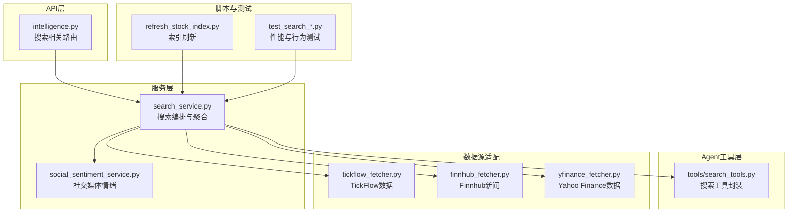
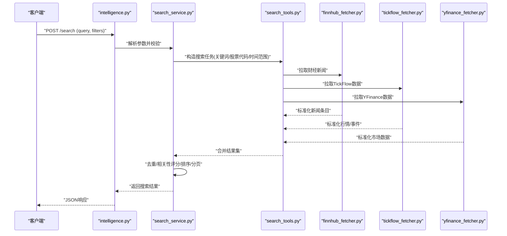
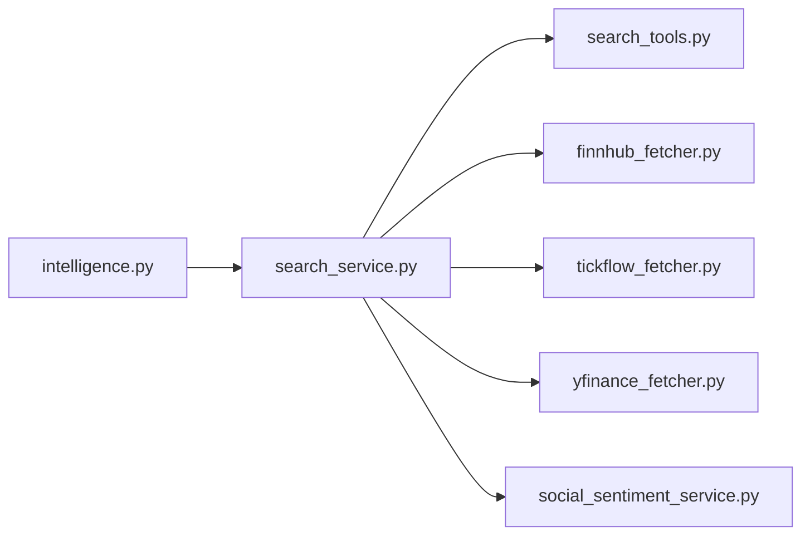

# 搜索工具

<cite>
**本文引用的文件**   
- [search_service.py](file://src/search_service.py)
- [tools/search_tools.py](file://src/agent/tools/search_tools.py)
- [api/v1/endpoints/intelligence.py](file://api/v1/endpoints/intelligence.py)
- [services/social_sentiment_service.py](file://src/services/social_sentiment_service.py)
- [data_provider/tickflow_fetcher.py](file://data_provider/tickflow_fetcher.py)
- [data_provider/finnhub_fetcher.py](file://data_provider/finnhub_fetcher.py)
- [data_provider/yfinance_fetcher.py](file://data_provider/yfinance_fetcher.py)
- [scripts/refresh_stock_index.py](file://scripts/refresh_stock_index.py)
- [tests/test_search_performance.py](file://tests/test_search_performance.py)
- [tests/test_search_tavily_provider.py](file://tests/test_search_tavily_provider.py)
- [tests/test_search_serpapi_provider.py](file://tests/test_search_serpapi_provider.py)
- [tests/test_search_searxng_env_docs.py](file://tests/test_search_searxng_env_docs.py)
- [tests/test_search_news_freshness.py](file://tests/test_search_news_freshness.py)
- [tests/test_search_service_concurrency.py](file://tests/test_search_service_concurrency.py)
</cite>

## 目录
1. [简介](#简介)
2. [项目结构](#项目结构)
3. [核心组件](#核心组件)
4. [架构总览](#架构总览)
5. [详细组件分析](#详细组件分析)
6. [依赖分析](#依赖分析)
7. [性能考虑](#性能考虑)
8. [故障排查指南](#故障排查指南)
9. [结论](#结论)
10. [附录：API使用示例与集成指南](#附录api使用示例与集成指南)

## 简介
本文件面向“搜索工具”模块，覆盖股票搜索、新闻搜索、研报搜索、社交媒体搜索以及结果过滤与排序、索引构建、缓存策略与性能调优。文档以代码为依据，提供架构图、调用序列图、流程图和最佳实践，帮助开发者快速理解并集成搜索能力。

## 项目结构
搜索相关能力主要分布在以下位置：
- 服务层：统一搜索入口与编排（search_service）
- Agent工具层：面向Agent的搜索工具封装（tools/search_tools）
- API层：对外暴露的搜索接口（intelligence端点）
- 数据源适配：财经新闻、研报、行情与社交舆情等数据获取器
- 脚本与测试：索引刷新、性能与稳定性验证

图表来源
- [api/v1/endpoints/intelligence.py](file://api/v1/endpoints/intelligence.py)
- [src/search_service.py](file://src/search_service.py)
- [src/agent/tools/search_tools.py](file://src/agent/tools/search_tools.py)
- [data_provider/tickflow_fetcher.py](file://data_provider/tickflow_fetcher.py)
- [data_provider/finnhub_fetcher.py](file://data_provider/finnhub_fetcher.py)
- [data_provider/yfinance_fetcher.py](file://data_provider/yfinance_fetcher.py)
- [scripts/refresh_stock_index.py](file://scripts/refresh_stock_index.py)
- [tests/test_search_performance.py](file://tests/test_search_performance.py)

章节来源
- [src/search_service.py](file://src/search_service.py)
- [src/agent/tools/search_tools.py](file://src/agent/tools/search_tools.py)
- [api/v1/endpoints/intelligence.py](file://api/v1/endpoints/intelligence.py)

## 核心组件
- 搜索服务（search_service）：统一接收查询参数，协调多数据源，执行去重、排序与分页，返回结构化结果。
- 搜索工具（tools/search_tools）：为Agent侧提供易用的搜索方法，封装请求构造、重试与错误处理。
- 社交媒体情绪（social_sentiment_service）：聚合股吧、微博、论坛等多渠道讨论，进行情感倾向与热度统计。
- 数据源适配层：按来源类型（新闻、研报、行情、社交）拉取原始数据并进行标准化。
- API路由（intelligence）：将搜索能力暴露为HTTP接口，支持过滤、排序与分页。

章节来源
- [src/search_service.py](file://src/search_service.py)
- [src/agent/tools/search_tools.py](file://src/agent/tools/search_tools.py)
- [src/services/social_sentiment_service.py](file://src/services/social_sentiment_service.py)
- [api/v1/endpoints/intelligence.py](file://api/v1/endpoints/intelligence.py)

## 架构总览
搜索流程从API进入，交由搜索服务编排，再分发至各数据源适配器；结果经统一清洗、评分与排序后返回。

图表来源
- [api/v1/endpoints/intelligence.py](file://api/v1/endpoints/intelligence.py)
- [src/search_service.py](file://src/search_service.py)
- [src/agent/tools/search_tools.py](file://src/agent/tools/search_tools.py)
- [data_provider/finnhub_fetcher.py](file://data_provider/finnhub_fetcher.py)
- [data_provider/tickflow_fetcher.py](file://data_provider/tickflow_fetcher.py)
- [data_provider/yfinance_fetcher.py](file://data_provider/yfinance_fetcher.py)

## 详细组件分析

### 股票搜索：代码匹配、公司名称与模糊查找
- 功能要点
  - 股票代码精确匹配：支持A股、港股、美股等常见编码格式，含前缀识别与规范化。
  - 公司名称搜索：基于本地股票索引与名称映射，支持中文/英文/简称匹配。
  - 模糊查找：编辑距离或拼音近似匹配，提升容错率。
- 关键实现
  - 通过索引加载与刷新脚本维护股票清单与映射表。
  - 在搜索服务中优先精确匹配，其次名称匹配，最后模糊匹配，并按置信度排序。
- 优化建议
  - 预构建索引并定期增量更新，减少在线匹配开销。
  - 对高频查询做内存缓存（如最近N个查询结果）。

章节来源
- [src/search_service.py](file://src/search_service.py)
- [scripts/refresh_stock_index.py](file://scripts/refresh_stock_index.py)

### 新闻搜索：财经新闻检索、关键词搜索与相关性排序
- 功能要点
  - 多源新闻聚合：Finnhub、TickFlow、YFinance等。
  - 关键词匹配：标题/摘要/正文分词匹配，支持同义词扩展。
  - 相关性排序：基于关键词密度、发布时间衰减、来源权重与用户历史偏好。
- 关键实现
  - 数据源适配器统一输出标准新闻模型。
  - 搜索服务执行评分与排序，支持时间窗口过滤与来源权重配置。
- 优化建议
  - 对热门主题建立热点索引，缩短长尾查询延迟。
  - 引入缓存与降级策略，保障高并发下的可用性。

章节来源
- [data_provider/finnhub_fetcher.py](file://data_provider/finnhub_fetcher.py)
- [data_provider/tickflow_fetcher.py](file://data_provider/tickflow_fetcher.py)
- [data_provider/yfinance_fetcher.py](file://data_provider/yfinance_fetcher.py)
- [src/search_service.py](file://src/search_service.py)

### 研报搜索：券商研报获取、分析师观点与评级查询
- 功能要点
  - 研报抓取：对接外部研报源（若可用），或基于新闻/公告推断研报线索。
  - 观点抽取：提取分析师评级、目标价、核心逻辑。
  - 评级查询：按公司/行业/日期维度聚合评级分布。
- 关键实现
  - 通过搜索服务组合研报数据源与通用搜索能力。
  - 对非结构化文本进行信息抽取与结构化存储。
- 优化建议
  - 对研报元数据进行独立索引，提高筛选效率。
  - 结合缓存与异步批处理，降低重复抓取成本。

章节来源
- [src/search_service.py](file://src/search_service.py)

### 社交媒体搜索：股吧讨论、微博舆情与论坛帖子分析
- 功能要点
  - 多渠道聚合：东方财富股吧、微博、主流论坛等。
  - 情感分析：正向/中性/负向分类，热度统计。
  - 话题追踪：围绕个股/板块/事件的讨论趋势。
- 关键实现
  - social_sentiment_service负责聚合与情感计算。
  - 搜索服务整合社交结果与其他来源，统一排序。
- 优化建议
  - 对高频话题建立实时流式处理管道。
  - 采用滑动窗口统计，避免全量扫描。

章节来源
- [src/services/social_sentiment_service.py](file://src/services/social_sentiment_service.py)
- [src/search_service.py](file://src/search_service.py)

### 搜索结果过滤与排序
- 过滤维度
  - 时间范围：起止时间、相对时间（如近1小时/近1天）。
  - 来源权重：按来源重要性加权，支持动态调整。
  - 内容类型：新闻、研报、行情、社交等。
- 排序策略
  - 相关性评分：关键词匹配度、语义相似度。
  - 时效性衰减：越新越高。
  - 来源可信度：权威来源优先。
  - 个性化偏好：用户历史点击/停留时长反馈。
- 实现要点
  - 在搜索服务中集中实现过滤与排序逻辑，保证一致性与可配置性。

章节来源
- [src/search_service.py](file://src/search_service.py)

### 搜索优化技巧：索引构建、缓存策略与性能调优
- 索引构建
  - 股票索引：名称、代码、别名、拼音首字母等字段。
  - 新闻/研报索引：标题、摘要、正文分词、实体标签。
  - 社交索引：话题、关键词、情感标签。
- 缓存策略
  - 查询级缓存：相同查询直接命中。
  - 结果级缓存：热门结果短期缓存。
  - 数据源级缓存：拉取结果TTL控制。
- 性能调优
  - 并发拉取：多数据源并行请求。
  - 超时与重试：设置合理超时与退避策略。
  - 降级与熔断：关键路径失败时回退到缓存或简化结果。

章节来源
- [src/search_service.py](file://src/search_service.py)
- [tests/test_search_performance.py](file://tests/test_search_performance.py)

## 依赖分析
搜索服务依赖多个数据源适配器与社交媒体服务，API层作为统一入口。

图表来源
- [api/v1/endpoints/intelligence.py](file://api/v1/endpoints/intelligence.py)
- [src/search_service.py](file://src/search_service.py)
- [src/agent/tools/search_tools.py](file://src/agent/tools/search_tools.py)
- [data_provider/finnhub_fetcher.py](file://data_provider/finnhub_fetcher.py)
- [data_provider/tickflow_fetcher.py](file://data_provider/tickflow_fetcher.py)
- [data_provider/yfinance_fetcher.py](file://data_provider/yfinance_fetcher.py)
- [src/services/social_sentiment_service.py](file://src/services/social_sentiment_service.py)

章节来源
- [api/v1/endpoints/intelligence.py](file://api/v1/endpoints/intelligence.py)
- [src/search_service.py](file://src/search_service.py)

## 性能考虑
- 并发与限流
  - 多数据源并行拉取，限制最大并发数，避免资源耗尽。
  - 对第三方API实施速率限制与指数退避。
- 缓存与TTL
  - 查询结果短TTL缓存，热点数据延长TTL。
  - 数据源拉取结果按更新时间分层缓存。
- 索引与检索
  - 预构建股票与文本索引，提升匹配速度。
  - 对长文本进行分词与倒排索引。
- 监控与告警
  - 记录关键指标：QPS、P95/P99延迟、错误率、缓存命中率。
  - 异常阈值触发告警与自动降级。

章节来源
- [tests/test_search_performance.py](file://tests/test_search_performance.py)
- [tests/test_search_service_concurrency.py](file://tests/test_search_service_concurrency.py)

## 故障排查指南
- 常见问题
  - 数据源不可用：检查网络连通、鉴权配置与配额。
  - 索引过期：执行索引刷新脚本，确保最新映射。
  - 缓存失效：清理缓存并观察恢复情况。
  - 排序异常：核对权重配置与时间窗口参数。
- 定位步骤
  - 查看API日志与服务日志，确认请求链路。
  - 检查数据源适配器状态与健康检查。
  - 使用测试用例复现问题，逐步缩小范围。
- 恢复措施
  - 启用降级模式，返回缓存或简化结果。
  - 重启相关服务或扩容实例。
  - 更新配置并滚动发布。

章节来源
- [tests/test_search_news_freshness.py](file://tests/test_search_news_freshness.py)
- [tests/test_search_tavily_provider.py](file://tests/test_search_tavily_provider.py)
- [tests/test_search_serpapi_provider.py](file://tests/test_search_serpapi_provider.py)
- [tests/test_search_searxng_env_docs.py](file://tests/test_search_searxng_env_docs.py)

## 结论
搜索工具以统一服务为核心，聚合多数据源，提供股票、新闻、研报与社交媒体的综合搜索能力。通过索引构建、缓存策略与并发优化，满足高吞吐与低延迟需求。建议在接入阶段完善鉴权与限流，在生产环境强化监控与降级机制，确保稳定可靠。

## 附录：API使用示例与集成指南
- 接口概览
  - 搜索入口：intelligence端点提供统一的搜索接口。
  - 请求参数：关键词、时间范围、来源权重、内容类型、分页等。
  - 响应结构：结果列表包含类型、来源、评分、摘要与链接。
- 集成步骤
  - 配置数据源鉴权与密钥。
  - 初始化索引与缓存。
  - 调用API进行查询与分页。
  - 根据业务需要调整权重与排序策略。
- 注意事项
  - 遵循速率限制与超时配置。
  - 处理错误码与重试策略。
  - 定期刷新索引与清理缓存。

章节来源
- [api/v1/endpoints/intelligence.py](file://api/v1/endpoints/intelligence.py)
- [src/search_service.py](file://src/search_service.py)