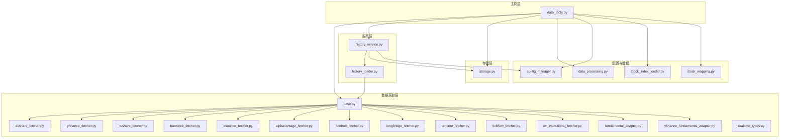
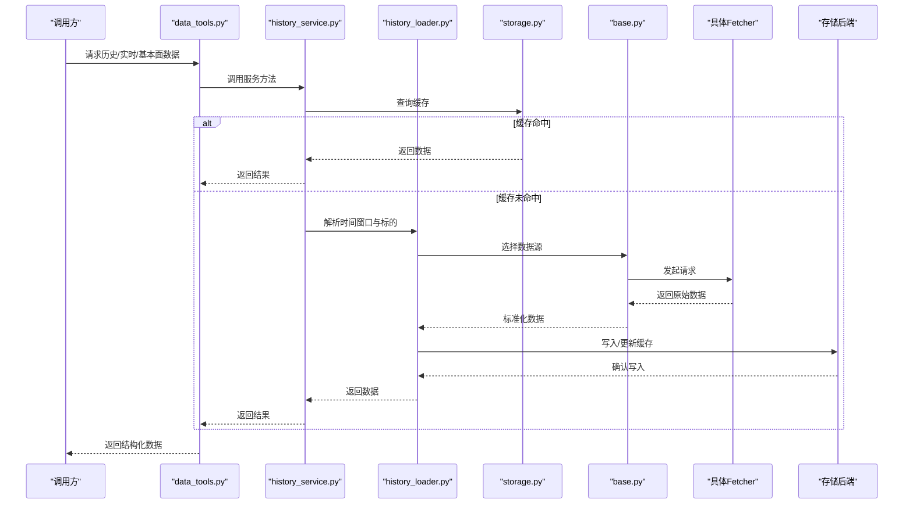
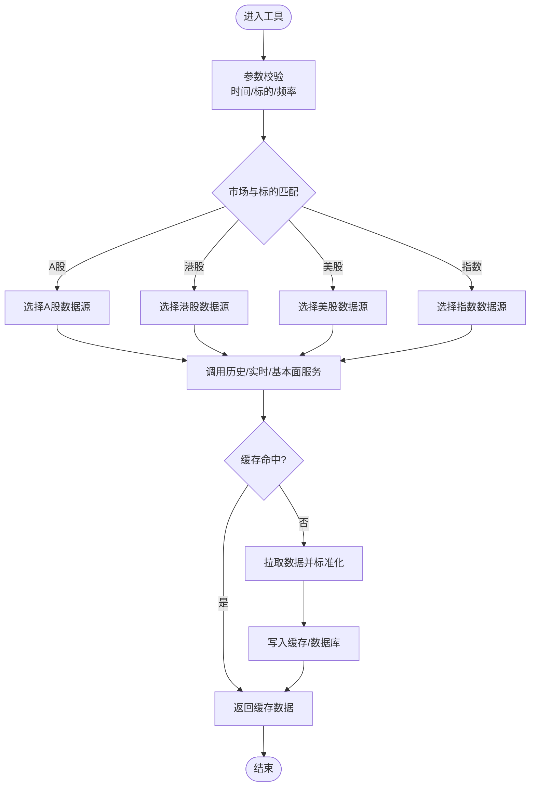
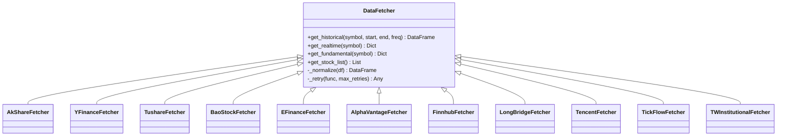
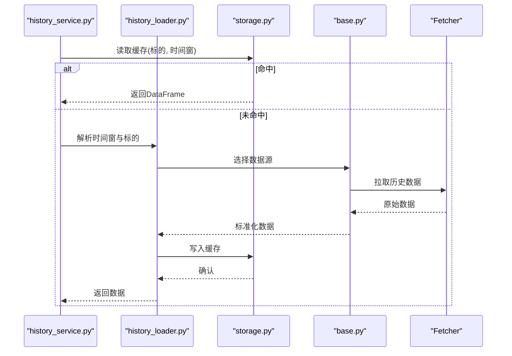
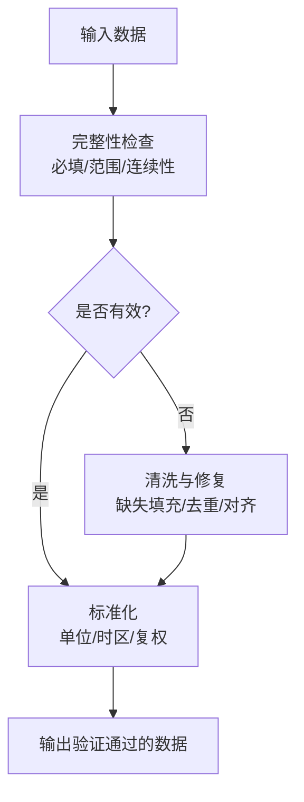
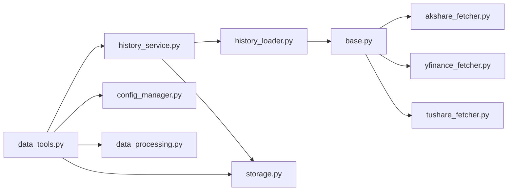

# 数据工具

<cite>
**本文引用的文件**   
- [data_tools.py](file://src/agent/tools/data_tools.py)
- [base.py](file://data_provider/base.py)
- [akshare_fetcher.py](file://data_provider/akshare_fetcher.py)
- [yfinance_fetcher.py](file://data_provider/yfinance_fetcher.py)
- [tushare_fetcher.py](file://data_provider/tushare_fetcher.py)
- [baostock_fetcher.py](file://data_provider/baostock_fetcher.py)
- [efinance_fetcher.py](file://data_provider/efinance_fetcher.py)
- [alphavantage_fetcher.py](file://data_provider/alphavantage_fetcher.py)
- [finnhub_fetcher.py](file://data_provider/finnhub_fetcher.py)
- [longbridge_fetcher.py](file://data_provider/longbridge_fetcher.py)
- [tencent_fetcher.py](file://data_provider/tencent_fetcher.py)
- [tickflow_fetcher.py](file://data_provider/tickflow_fetcher.py)
- [tw_institutional_fetcher.py](file://data_provider/tw_institutional_fetcher.py)
- [fundamental_adapter.py](file://data_provider/fundamental_adapter.py)
- [yfinance_fundamental_adapter.py](file://data_provider/yfinance_fundamental_adapter.py)
- [realtime_types.py](file://data_provider/realtime_types.py)
- [history_service.py](file://src/services/history_service.py)
- [history_loader.py](file://src/services/history_loader.py)
- [storage.py](file://src/storage.py)
- [config_manager.py](file://src/core/config_manager.py)
- [stock_index_loader.py](file://src/data/stock_index_loader.py)
- [stock_mapping.py](file://src/data/stock_mapping.py)
- [data_processing.py](file://src/utils/data_processing.py)
- [test_data_tools_daily_history_cache.py](file://tests/test_data_tools_daily_history_cache.py)
- [test_data_tools_get_capital_flow.py](file://tests/test_data_tools_get_capital_flow.py)
- [test_data_tools_get_stock_info.py](file://tests/test_data_tools_get_stock_info.py)
</cite>

## 目录
1. [简介](#简介)
2. [项目结构](#项目结构)
3. [核心组件](#核心组件)
4. [架构总览](#架构总览)
5. [详细组件分析](#详细组件分析)
6. [依赖关系分析](#依赖关系分析)
7. [性能考虑](#性能考虑)
8. [故障排查指南](#故障排查指南)
9. [结论](#结论)
10. [附录：使用示例与最佳实践](#附录使用示例与最佳实践)

## 简介
本文件面向“数据工具”子系统，系统性梳理数据获取、数据处理、数据存储与验证、以及数据源配置与管理等能力。该子系统覆盖历史行情、实时报价与基本面数据的统一接入，提供清洗、格式转换与时序处理工具，并内置本地缓存、数据库操作与同步机制，同时包含完整性检查、异常值检测与格式校验等数据验证能力。通过连接池、重试与故障转移策略，保障多数据源的稳定与高效。

## 项目结构
数据工具相关代码主要分布在以下模块：
- 数据获取层（data_provider）：抽象接口与各数据源实现（A股、港股、美股、指数、机构持仓等）
- 工具层（src/agent/tools/data_tools.py）：对外暴露的数据获取与处理工具函数
- 服务层（src/services/history_service.py, history_loader.py）：历史数据加载与服务编排
- 存储层（src/storage.py）：本地缓存、数据库读写与同步
- 配置管理（src/core/config_manager.py）：数据源配置、连接池、重试与故障转移
- 数据模型与类型（data_provider/realtime_types.py）：实时数据类型定义
- 数据处理工具（src/utils/data_processing.py）：清洗、转换与时序处理
- 索引与映射（src/data/stock_index_loader.py, stock_mapping.py）：股票列表与代码映射

**图示来源** 
- [data_tools.py:1-200](file://src/agent/tools/data_tools.py#L1-L200)
- [base.py:1-120](file://data_provider/base.py#L1-L120)
- [history_service.py:1-150](file://src/services/history_service.py#L1-L150)
- [history_loader.py:1-120](file://src/services/history_loader.py#L1-L120)
- [storage.py:1-150](file://src/storage.py#L1-L150)
- [config_manager.py:1-120](file://src/core/config_manager.py#L1-L120)
- [stock_index_loader.py:1-100](file://src/data/stock_index_loader.py#L1-L100)
- [stock_mapping.py:1-100](file://src/data/stock_mapping.py#L1-L100)
- [data_processing.py:1-120](file://src/utils/data_processing.py#L1-L120)

**章节来源**
- [data_tools.py:1-200](file://src/agent/tools/data_tools.py#L1-L200)
- [base.py:1-120](file://data_provider/base.py#L1-L120)
- [history_service.py:1-150](file://src/services/history_service.py#L1-L150)
- [history_loader.py:1-120](file://src/services/history_loader.py#L1-L120)
- [storage.py:1-150](file://src/storage.py#L1-L150)
- [config_manager.py:1-120](file://src/core/config_manager.py#L1-L120)
- [stock_index_loader.py:1-100](file://src/data/stock_index_loader.py#L1-L100)
- [stock_mapping.py:1-100](file://src/data/stock_mapping.py#L1-L100)
- [data_processing.py:1-120](file://src/utils/data_processing.py#L1-L120)

## 核心组件
- 数据获取工具（data_tools.py）：封装历史行情、实时报价、基本面数据的统一调用入口，支持按市场与标的路由到具体Fetcher。
- 数据源抽象与实现（base.py + 各fetcher）：统一的接口规范，屏蔽不同数据源的差异；实现类负责网络请求、解析与标准化。
- 历史数据服务（history_service.py, history_loader.py）：组合多个数据源，提供时间窗口解析、增量拉取、缓存命中与回退策略。
- 存储与缓存（storage.py）：本地文件缓存、SQLite/其他数据库的读写与同步，支持过期策略与一致性保证。
- 配置管理（config_manager.py）：数据源密钥、连接池大小、超时、重试次数、故障转移顺序等集中管理。
- 数据处理（data_processing.py）：缺失值填充、去重、对齐、频率转换、复权处理、时区与日期规范化。
- 数据模型（realtime_types.py）：实时报价字段定义与校验约束。

**章节来源**
- [data_tools.py:1-200](file://src/agent/tools/data_tools.py#L1-L200)
- [base.py:1-120](file://data_provider/base.py#L1-L120)
- [history_service.py:1-150](file://src/services/history_service.py#L1-L150)
- [history_loader.py:1-120](file://src/services/history_loader.py#L1-L120)
- [storage.py:1-150](file://src/storage.py#L1-L150)
- [config_manager.py:1-120](file://src/core/config_manager.py#L1-L120)
- [data_processing.py:1-120](file://src/utils/data_processing.py#L1-L120)
- [realtime_types.py:1-120](file://data_provider/realtime_types.py#L1-L120)

## 架构总览
数据工具采用“工具层 → 服务层 → 数据源抽象 → 具体实现”的分层架构。工具层暴露简洁API；服务层负责编排、缓存与回退；数据源抽象统一接口；具体实现对接外部数据源。存储层贯穿全链路，提供本地缓存与持久化。配置中心统一管理连接池、重试与故障转移。

**图示来源** 
- [data_tools.py:1-200](file://src/agent/tools/data_tools.py#L1-L200)
- [history_service.py:1-150](file://src/services/history_service.py#L1-L150)
- [history_loader.py:1-120](file://src/services/history_loader.py#L1-L120)
- [storage.py:1-150](file://src/storage.py#L1-L150)
- [base.py:1-120](file://data_provider/base.py#L1-L120)

## 详细组件分析

### 数据获取工具（data_tools.py）
- 功能要点
  - 统一入口：历史K线、分时、实时报价、资金流向、个股信息、基本面指标等
  - 自动路由：根据股票代码前缀与市场规则选择合适数据源
  - 参数校验：对时间范围、标的编码、频率等进行前置校验
  - 结果标准化：输出统一数据结构，便于下游消费
- 关键流程
  - 输入参数校验 → 数据源选择 → 调用服务层 → 缓存优先 → 失败回退 → 标准化输出

**图示来源** 
- [data_tools.py:1-200](file://src/agent/tools/data_tools.py#L1-L200)

**章节来源**
- [data_tools.py:1-200](file://src/agent/tools/data_tools.py#L1-L200)

### 数据源抽象与实现（base.py + fetchers）
- base.py
  - 定义统一接口：get_historical、get_realtime、get_fundamental、get_stock_list等
  - 公共逻辑：错误码映射、重试装饰器、日志与追踪
- 具体实现
  - akshare_fetcher.py：A股历史与实时数据
  - yfinance_fetcher.py：美股与部分国际数据
  - tushare_fetcher.py：A股基本面与历史数据
  - baostock_fetcher.py：A股历史数据补充
  - efinance_fetcher.py：A股实时与资金流
  - alphavantage_fetcher.py：美股与外汇数据
  - finnhub_fetcher.py：美股实时与新闻
  - longbridge_fetcher.py：港股与美股实时
  - tencent_fetcher.py：A股实时行情
  - tickflow_fetcher.py：盘口与逐笔
  - tw_institutional_fetcher.py：台湾地区机构持仓
  - fundamental_adapter.py / yfinance_fundamental_adapter.py：基本面数据适配与归一化

**图示来源** 
- [base.py:1-120](file://data_provider/base.py#L1-L120)
- [akshare_fetcher.py:1-120](file://data_provider/akshare_fetcher.py#L1-L120)
- [yfinance_fetcher.py:1-120](file://data_provider/yfinance_fetcher.py#L1-L120)
- [tushare_fetcher.py:1-120](file://data_provider/tushare_fetcher.py#L1-L120)
- [baostock_fetcher.py:1-120](file://data_provider/baostock_fetcher.py#L1-L120)
- [efinance_fetcher.py:1-120](file://data_provider/efinance_fetcher.py#L1-L120)
- [alphavantage_fetcher.py:1-120](file://data_provider/alphavantage_fetcher.py#L1-L120)
- [finnhub_fetcher.py:1-120](file://data_provider/finnhub_fetcher.py#L1-L120)
- [longbridge_fetcher.py:1-120](file://data_provider/longbridge_fetcher.py#L1-L120)
- [tencent_fetcher.py:1-120](file://data_provider/tencent_fetcher.py#L1-L120)
- [tickflow_fetcher.py:1-120](file://data_provider/tickflow_fetcher.py#L1-L120)
- [tw_institutional_fetcher.py:1-120](file://data_provider/tw_institutional_fetcher.py#L1-L120)

**章节来源**
- [base.py:1-120](file://data_provider/base.py#L1-L120)
- [akshare_fetcher.py:1-120](file://data_provider/akshare_fetcher.py#L1-L120)
- [yfinance_fetcher.py:1-120](file://data_provider/yfinance_fetcher.py#L1-L120)
- [tushare_fetcher.py:1-120](file://data_provider/tushare_fetcher.py#L1-L120)
- [baostock_fetcher.py:1-120](file://data_provider/baostock_fetcher.py#L1-L120)
- [efinance_fetcher.py:1-120](file://data_provider/efinance_fetcher.py#L1-L120)
- [alphavantage_fetcher.py:1-120](file://data_provider/alphavantage_fetcher.py#L1-L120)
- [finnhub_fetcher.py:1-120](file://data_provider/finnhub_fetcher.py#L1-L120)
- [longbridge_fetcher.py:1-120](file://data_provider/longbridge_fetcher.py#L1-L120)
- [tencent_fetcher.py:1-120](file://data_provider/tencent_fetcher.py#L1-L120)
- [tickflow_fetcher.py:1-120](file://data_provider/tickflow_fetcher.py#L1-L120)
- [tw_institutional_fetcher.py:1-120](file://data_provider/tw_institutional_fetcher.py#L1-L120)

### 历史数据服务（history_service.py, history_loader.py）
- 职责
  - 时间窗口解析：支持相对日期、交易日计算、节假日处理
  - 数据源选择与回退：主数据源失败自动切换备用源
  - 缓存策略：按标的+时间窗口的键生成缓存，避免重复拉取
  - 数据合并：多源数据去重、对齐与排序
- 典型流程
  - 解析请求 → 查缓存 → 命中则返回 → 未命中则调度loader → loader选择fetcher → 拉取→标准化→落库→返回

**图示来源** 
- [history_service.py:1-150](file://src/services/history_service.py#L1-L150)
- [history_loader.py:1-120](file://src/services/history_loader.py#L1-L120)
- [storage.py:1-150](file://src/storage.py#L1-L150)
- [base.py:1-120](file://data_provider/base.py#L1-L120)

**章节来源**
- [history_service.py:1-150](file://src/services/history_service.py#L1-L150)
- [history_loader.py:1-120](file://src/services/history_loader.py#L1-L120)

### 数据存储与同步（storage.py）
- 能力
  - 本地缓存：基于文件系统或轻量数据库的键值存储
  - 数据库操作：批量插入、更新、删除与事务控制
  - 同步机制：增量同步、冲突解决、幂等写入
  - 过期策略：TTL、LRU淘汰、空间回收
- 设计要点
  - 读写分离：读路径优先缓存，写路径异步落库
  - 一致性：版本号或时间戳确保最终一致
  - 容错：断点续传、重试与补偿任务

**章节来源**
- [storage.py:1-150](file://src/storage.py#L1-L150)

### 数据验证与清洗（data_processing.py + realtime_types.py）
- 数据验证
  - 完整性检查：必填字段、时间序列连续性、数值范围
  - 异常值检测：Z-Score、IQR、阈值告警
  - 格式校验：类型、单位、时区、编码
- 数据清洗
  - 缺失值处理：插值、前向/后向填充、剔除
  - 去重与对齐：按时间戳去重、频率统一、复权处理
  - 标准化：字段命名、单位换算、币种与指数基准

**图示来源** 
- [data_processing.py:1-120](file://src/utils/data_processing.py#L1-L120)
- [realtime_types.py:1-120](file://data_provider/realtime_types.py#L1-L120)

**章节来源**
- [data_processing.py:1-120](file://src/utils/data_processing.py#L1-L120)
- [realtime_types.py:1-120](file://data_provider/realtime_types.py#L1-L120)

### 数据源配置与管理（config_manager.py）
- 配置项
  - 数据源密钥与端点
  - 连接池大小、超时、并发限制
  - 重试策略：最大次数、退避算法
  - 故障转移：优先级与回退顺序
- 运行时行为
  - 动态重载：热更新配置不重启服务
  - 健康检查：定期探测数据源可用性
  - 限流与熔断：保护上游与自身稳定性

**章节来源**
- [config_manager.py:1-120](file://src/core/config_manager.py#L1-L120)

### 索引与映射（stock_index_loader.py, stock_mapping.py）
- 功能
  - 股票列表加载：从CSV/远程接口初始化
  - 代码映射：跨市场符号映射（如A股沪深、港股、美股）
  - 增量更新：差异对比与增量刷新
- 应用场景
  - 自动补全、路由决策、报表展示

**章节来源**
- [stock_index_loader.py:1-100](file://src/data/stock_index_loader.py#L1-L100)
- [stock_mapping.py:1-100](file://src/data/stock_mapping.py#L1-L100)

## 依赖关系分析
- 耦合度
  - data_tools.py与history_service.py强耦合（业务编排）
  - history_loader.py与base.py及具体Fetcher弱耦合（接口解耦）
  - storage.py被服务层与工具层共同依赖（横向支撑）
- 外部依赖
  - 各Fetcher依赖第三方库（akshare、yfinance、tushare等）
  - 存储层可能依赖SQLite/PostgreSQL/Redis等
- 潜在循环依赖
  - 通过分层与接口隔离避免循环引用

**图示来源** 
- [data_tools.py:1-200](file://src/agent/tools/data_tools.py#L1-L200)
- [history_service.py:1-150](file://src/services/history_service.py#L1-L150)
- [history_loader.py:1-120](file://src/services/history_loader.py#L1-L120)
- [base.py:1-120](file://data_provider/base.py#L1-L120)
- [storage.py:1-150](file://src/storage.py#L1-L150)
- [config_manager.py:1-120](file://src/core/config_manager.py#L1-L120)
- [data_processing.py:1-120](file://src/utils/data_processing.py#L1-L120)

**章节来源**
- [data_tools.py:1-200](file://src/agent/tools/data_tools.py#L1-L200)
- [history_service.py:1-150](file://src/services/history_service.py#L1-L150)
- [history_loader.py:1-120](file://src/services/history_loader.py#L1-L120)
- [base.py:1-120](file://data_provider/base.py#L1-L120)
- [storage.py:1-150](file://src/storage.py#L1-L150)
- [config_manager.py:1-120](file://src/core/config_manager.py#L1-L120)
- [data_processing.py:1-120](file://src/utils/data_processing.py#L1-L120)

## 性能考虑
- 缓存命中率优化：合理设置TTL与键粒度，减少重复拉取
- 并发与批处理：批量拉取与并行请求，降低网络开销
- 内存管理：大表分片、流式处理、及时释放
- 数据库优化：索引设计、批量写入、读写分离
- 连接池与限流：避免上游过载与资源耗尽

[本节为通用指导，无需特定文件来源]

## 故障排查指南
- 常见问题
  - 数据源不可用：检查密钥、网络连通性、限流与熔断状态
  - 缓存不一致：清理缓存键、检查版本与时间戳
  - 数据异常：查看清洗与验证日志，定位缺失与异常值
- 诊断步骤
  - 启用详细日志与追踪
  - 逐步隔离：关闭缓存、直连数据源
  - 回放请求：复现问题并定位根因

**章节来源**
- [test_data_tools_daily_history_cache.py:1-200](file://tests/test_data_tools_daily_history_cache.py#L1-L200)
- [test_data_tools_get_capital_flow.py:1-200](file://tests/test_data_tools_get_capital_flow.py#L1-L200)
- [test_data_tools_get_stock_info.py:1-200](file://tests/test_data_tools_get_stock_info.py#L1-L200)

## 结论
数据工具通过分层架构与统一接口，将多源异构数据整合为标准化、可信赖的数据资产。结合缓存、存储与配置管理，实现了高可用、高性能与易扩展的数据流水线。建议在生产环境中完善监控告警、容量规划与灾备策略，持续提升数据质量与系统韧性。

[本节为总结，无需特定文件来源]

## 附录：使用示例与最佳实践
- 历史行情获取
  - 指定标的与时间窗口，优先命中缓存，未命中则自动拉取并落库
  - 推荐：使用相对日期与交易日解析，避免节假日误差
- 实时报价获取
  - 高频场景下启用连接池与短超时，配合熔断与降级
  - 推荐：按市场分组订阅，减少无效请求
- 基本面数据获取
  - 使用适配器进行归一化，统一字段与单位
  - 推荐：定时增量更新，保留版本快照
- 数据清洗与验证
  - 先完整性检查，再缺失值处理，最后标准化输出
  - 推荐：建立数据质量看板，持续监控异常率
- 存储与同步
  - 读写分离与异步落库，避免阻塞主流程
  - 推荐：幂等写入与冲突解决策略，保证一致性

[本节为概念性内容，无需特定文件来源]