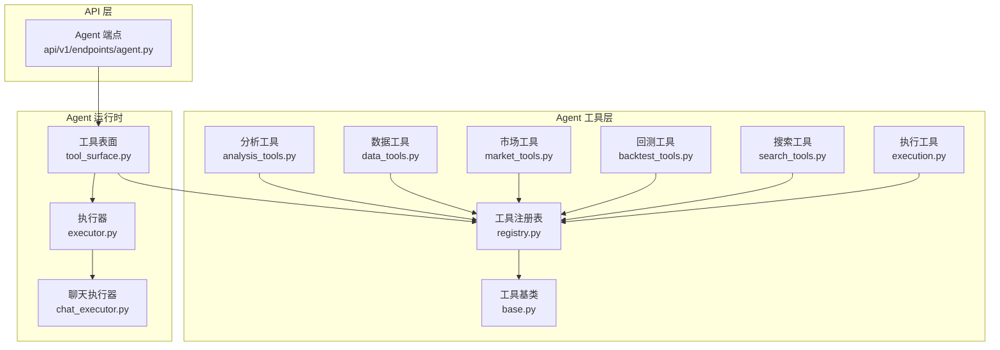
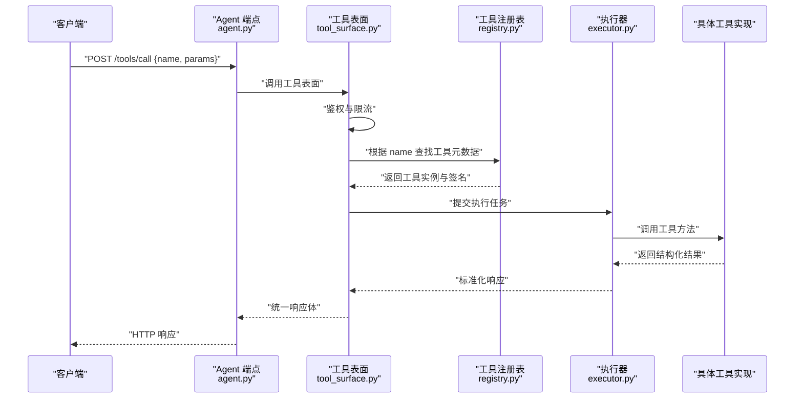
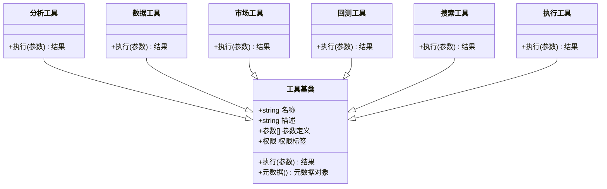
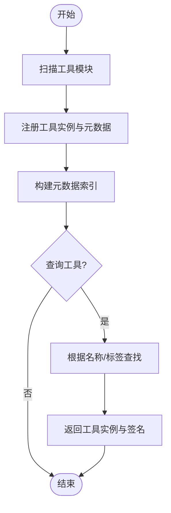
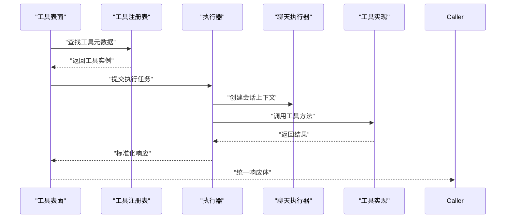
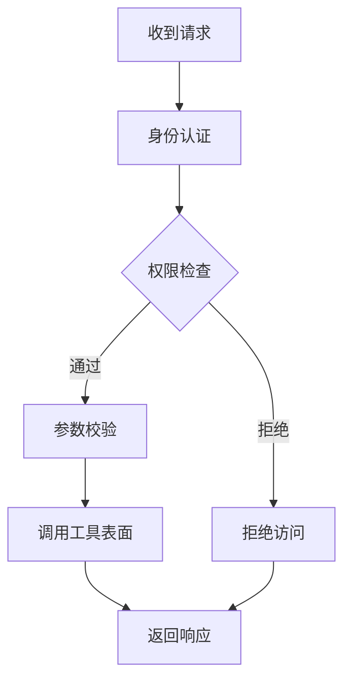
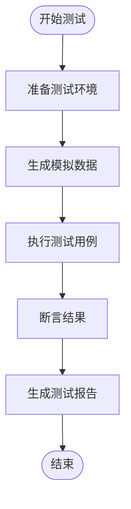
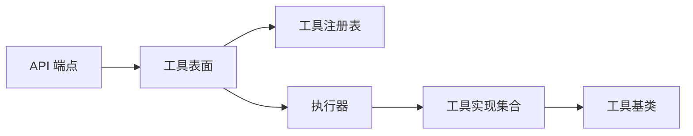

# 自定义工具开发

<cite>
**本文档引用的文件**   
- [src/agent/tools/registry.py](file://src/agent/tools/registry.py)
- [src/agent/tools/base.py](file://src/agent/tools/base.py)
- [src/agent/tools/analysis_tools.py](file://src/agent/tools/analysis_tools.py)
- [src/agent/tools/data_tools.py](file://src/agent/tools/data_tools.py)
- [src/agent/tools/market_tools.py](file://src/agent/tools/market_tools.py)
- [src/agent/tools/backtest_tools.py](file://src/agent/tools/backtest_tools.py)
- [src/agent/tools/search_tools.py](file://src/agent/tools/search_tools.py)
- [src/agent/tools/execution.py](file://src/agent/tools/execution.py)
- [src/agent/tool_surface.py](file://src/agent/tool_surface.py)
- [src/agent/executor.py](file://src/agent/executor.py)
- [src/agent/chat_executor.py](file://src/agent/chat_executor.py)
- [api/v1/endpoints/agent.py](file://api/v1/endpoints/agent.py)
- [tests/test_agent_tool_surface.py](file://tests/test_agent_tool_surface.py)
</cite>

## 目录
1. [简介](#简介)
2. [项目结构](#项目结构)
3. [核心组件](#核心组件)
4. [架构总览](#架构总览)
5. [详细组件分析](#详细组件分析)
6. [依赖关系分析](#依赖关系分析)
7. [性能考虑](#性能考虑)
8. [故障排查指南](#故障排查指南)
9. [结论](#结论)
10. [附录](#附录)

## 简介
本指南面向希望在本项目中开发“自定义工具”的工程师与研究者，围绕工具接口规范、元数据定义、权限控制、测试框架与文档生成等主题，提供从需求分析到部署上线的完整流程说明。本项目在 agent 层提供了统一的工具注册、发现与执行机制，并通过 API 暴露给前端与外部系统调用。通过遵循本文规范，你可以快速实现可被智能体调用的分析、数据获取、回测、搜索与交易执行等能力。

## 项目结构
与“自定义工具”相关的代码主要位于以下模块：
- 工具基类与注册表：定义工具抽象、元数据约定与注册机制
- 内置工具集：数据分析、市场数据、回测、搜索、执行等示例实现
- 工具表面与执行器：将工具暴露为统一调用入口，并负责鉴权、限流、错误处理与结果序列化
- API 端点：对外暴露工具调用接口
- 测试用例：覆盖工具表面、执行路径与边界条件

图表来源
- [src/agent/tools/registry.py](file://src/agent/tools/registry.py)
- [src/agent/tools/base.py](file://src/agent/tools/base.py)
- [src/agent/tools/analysis_tools.py](file://src/agent/tools/analysis_tools.py)
- [src/agent/tools/data_tools.py](file://src/agent/tools/data_tools.py)
- [src/agent/tools/market_tools.py](file://src/agent/tools/market_tools.py)
- [src/agent/tools/backtest_tools.py](file://src/agent/tools/backtest_tools.py)
- [src/agent/tools/search_tools.py](file://src/agent/tools/search_tools.py)
- [src/agent/tools/execution.py](file://src/agent/tools/execution.py)
- [src/agent/tool_surface.py](file://src/agent/tool_surface.py)
- [src/agent/executor.py](file://src/agent/executor.py)
- [src/agent/chat_executor.py](file://src/agent/chat_executor.py)
- [api/v1/endpoints/agent.py](file://api/v1/endpoints/agent.py)

章节来源
- [src/agent/tools/registry.py](file://src/agent/tools/registry.py)
- [src/agent/tools/base.py](file://src/agent/tools/base.py)
- [src/agent/tool_surface.py](file://src/agent/tool_surface.py)
- [src/agent/executor.py](file://src/agent/executor.py)
- [api/v1/endpoints/agent.py](file://api/v1/endpoints/agent.py)

## 核心组件
- 工具基类与元数据
  - 所有自定义工具需继承统一的工具基类，以声明式方式描述工具名称、描述、参数签名、类型校验、默认值与权限信息。
  - 参数注解用于自动构建 OpenAPI Schema 与帮助文档，支持必填/可选、默认值、枚举、范围约束等。
  - 返回值格式应遵循统一的响应结构（如成功/失败状态、消息、数据体），便于上层序列化与前端展示。
- 工具注册表
  - 提供工具的动态发现与加载机制，支持按命名空间分组、版本管理与热更新。
  - 注册表维护工具元数据索引，供工具表面与文档生成使用。
- 工具表面与执行器
  - 工具表面负责鉴权、限流、输入校验、上下文注入与结果标准化。
  - 执行器协调异步任务、超时控制、重试策略与错误恢复。
- API 端点
  - 对外暴露工具调用接口，包含认证、授权、审计日志与速率限制。

章节来源
- [src/agent/tools/base.py](file://src/agent/tools/base.py)
- [src/agent/tools/registry.py](file://src/agent/tools/registry.py)
- [src/agent/tool_surface.py](file://src/agent/tool_surface.py)
- [src/agent/executor.py](file://src/agent/executor.py)
- [api/v1/endpoints/agent.py](file://api/v1/endpoints/agent.py)

## 架构总览
下图展示了从 API 请求到工具执行的端到端流程，包括鉴权、参数校验、工具查找、执行与结果返回。

图表来源
- [api/v1/endpoints/agent.py](file://api/v1/endpoints/agent.py)
- [src/agent/tool_surface.py](file://src/agent/tool_surface.py)
- [src/agent/tools/registry.py](file://src/agent/tools/registry.py)
- [src/agent/executor.py](file://src/agent/executor.py)

## 详细组件分析

### 工具基类与元数据规范
- 基类继承
  - 自定义工具需继承工具基类，重写必要的方法以实现业务逻辑。
  - 基类提供统一的元数据描述能力，包括工具名、描述、参数定义、权限标签等。
- 方法签名约定
  - 参数注解用于类型验证与文档生成；支持基础类型、列表、字典、枚举与嵌套对象。
  - 返回值应为统一结构，包含状态码、消息与数据体，便于前端渲染与错误处理。
- 默认值与校验
  - 参数默认值通过注解声明，缺失时自动填充。
  - 校验规则包括非空、范围、正则表达式与自定义校验函数。

图表来源
- [src/agent/tools/base.py](file://src/agent/tools/base.py)
- [src/agent/tools/analysis_tools.py](file://src/agent/tools/analysis_tools.py)
- [src/agent/tools/data_tools.py](file://src/agent/tools/data_tools.py)
- [src/agent/tools/market_tools.py](file://src/agent/tools/market_tools.py)
- [src/agent/tools/backtest_tools.py](file://src/agent/tools/backtest_tools.py)
- [src/agent/tools/search_tools.py](file://src/agent/tools/search_tools.py)
- [src/agent/tools/execution.py](file://src/agent/tools/execution.py)

章节来源
- [src/agent/tools/base.py](file://src/agent/tools/base.py)
- [src/agent/tools/analysis_tools.py](file://src/agent/tools/analysis_tools.py)
- [src/agent/tools/data_tools.py](file://src/agent/tools/data_tools.py)
- [src/agent/tools/market_tools.py](file://src/agent/tools/market_tools.py)
- [src/agent/tools/backtest_tools.py](file://src/agent/tools/backtest_tools.py)
- [src/agent/tools/search_tools.py](file://src/agent/tools/search_tools.py)
- [src/agent/tools/execution.py](file://src/agent/tools/execution.py)

### 工具注册与发现
- 注册表职责
  - 维护工具实例与元数据的映射，支持按命名空间分组与版本管理。
  - 提供查询接口，根据工具名或标签返回工具实例与调用签名。
- 动态加载
  - 支持插件式加载，允许在不重启服务的情况下新增或更新工具。
- 元数据索引
  - 为文档生成与前端提示提供结构化元数据。

图表来源
- [src/agent/tools/registry.py](file://src/agent/tools/registry.py)

章节来源
- [src/agent/tools/registry.py](file://src/agent/tools/registry.py)

### 工具表面与执行器
- 工具表面
  - 负责鉴权、限流、输入校验、上下文注入与结果标准化。
  - 将不同工具的统一接口暴露给上层调用。
- 执行器
  - 协调异步任务、超时控制、重试策略与错误恢复。
  - 与聊天执行器协作，支持流式输出与事件回调。

图表来源
- [src/agent/tool_surface.py](file://src/agent/tool_surface.py)
- [src/agent/executor.py](file://src/agent/executor.py)
- [src/agent/chat_executor.py](file://src/agent/chat_executor.py)

章节来源
- [src/agent/tool_surface.py](file://src/agent/tool_surface.py)
- [src/agent/executor.py](file://src/agent/executor.py)
- [src/agent/chat_executor.py](file://src/agent/chat_executor.py)

### API 端点与权限控制
- 端点设计
  - 提供统一的工具调用入口，接收工具名与参数，返回标准化响应。
- 权限控制
  - 基于用户角色与资源标签进行访问控制，支持细粒度权限。
- 审计与限流
  - 记录调用审计日志，实施速率限制与熔断保护。

图表来源
- [api/v1/endpoints/agent.py](file://api/v1/endpoints/agent.py)

章节来源
- [api/v1/endpoints/agent.py](file://api/v1/endpoints/agent.py)

### 测试框架与最佳实践
- 单元测试编写
  - 针对工具表面、执行器与具体工具实现编写单测，覆盖正常路径与异常分支。
- 模拟数据生成
  - 使用夹具与工厂模式生成测试数据，确保测试稳定性与可重复性。
- 断言验证
  - 对返回值结构、状态码与业务字段进行断言，确保契约一致性。

章节来源
- [tests/test_agent_tool_surface.py](file://tests/test_agent_tool_surface.py)

## 依赖关系分析
- 组件耦合
  - 工具实现依赖基类与注册表；工具表面依赖注册表与执行器；API 端点依赖工具表面。
- 外部依赖
  - 数据源适配器、LLM 后端、存储与通知服务等通过工具间接调用。
- 循环依赖
  - 通过接口解耦与延迟导入避免循环依赖。

图表来源
- [api/v1/endpoints/agent.py](file://api/v1/endpoints/agent.py)
- [src/agent/tool_surface.py](file://src/agent/tool_surface.py)
- [src/agent/tools/registry.py](file://src/agent/tools/registry.py)
- [src/agent/executor.py](file://src/agent/executor.py)
- [src/agent/tools/base.py](file://src/agent/tools/base.py)

章节来源
- [api/v1/endpoints/agent.py](file://api/v1/endpoints/agent.py)
- [src/agent/tool_surface.py](file://src/agent/tool_surface.py)
- [src/agent/tools/registry.py](file://src/agent/tools/registry.py)
- [src/agent/executor.py](file://src/agent/executor.py)
- [src/agent/tools/base.py](file://src/agent/tools/base.py)

## 性能考虑
- 异步执行与并发控制
  - 使用异步执行器提升吞吐，合理设置并发上限与队列长度。
- 缓存与预取
  - 对热点数据进行缓存，减少重复计算与外部调用。
- 超时与重试
  - 配置合理的超时时间与重试策略，提高鲁棒性。
- 资源隔离
  - 对不同工具或租户进行资源隔离，避免相互影响。

## 故障排查指南
- 常见问题
  - 工具未注册：检查注册表初始化与模块加载顺序。
  - 权限拒绝：确认用户角色与资源标签匹配。
  - 参数校验失败：核对参数注解与默认值设置。
  - 执行超时：调整超时配置与重试策略。
- 调试技巧
  - 启用详细日志，定位调用链路与错误堆栈。
  - 使用测试夹具复现问题，逐步缩小范围。

章节来源
- [src/agent/tool_surface.py](file://src/agent/tool_surface.py)
- [src/agent/executor.py](file://src/agent/executor.py)
- [api/v1/endpoints/agent.py](file://api/v1/endpoints/agent.py)

## 结论
通过统一的工具基类、注册表、表面与执行器，本项目为自定义工具开发提供了清晰、可扩展且易于测试的框架。遵循本文档的接口规范、元数据约定与权限模型，开发者可以快速实现高质量的工具，并通过 API 稳定地对外提供服务。结合完善的测试与文档生成机制，可显著提升工具的可维护性与可用性。

## 附录
- 开发流程建议
  - 需求分析：明确工具目标、输入输出与权限要求。
  - 设计与实现：继承基类，定义元数据与业务逻辑。
  - 测试与验证：编写单测与集成测试，覆盖边界条件。
  - 文档生成：利用元数据自动生成帮助与示例。
  - 部署上线：灰度发布与监控告警。
- 参考实现
  - 分析工具、数据工具、市场工具、回测工具、搜索工具与执行工具可作为模板参考。