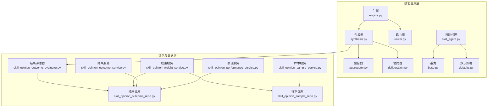
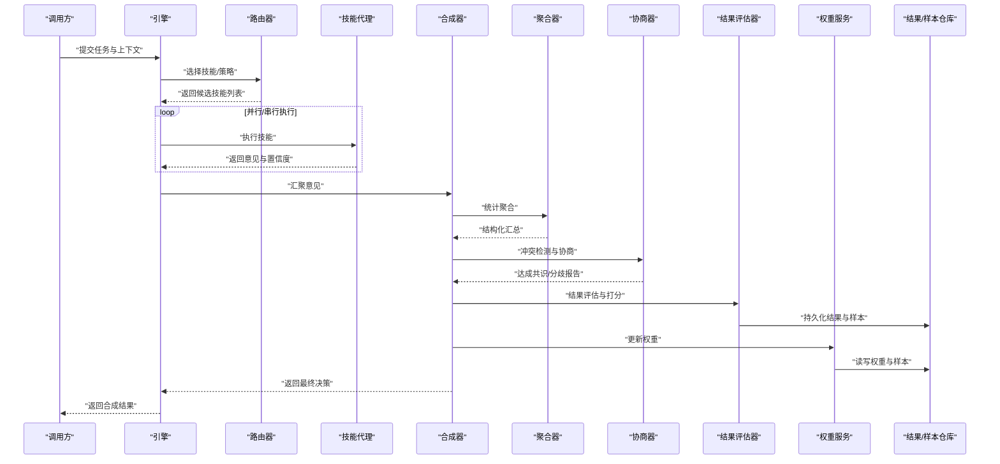
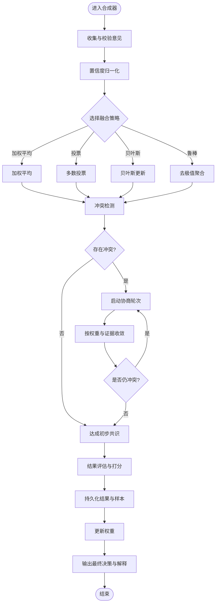
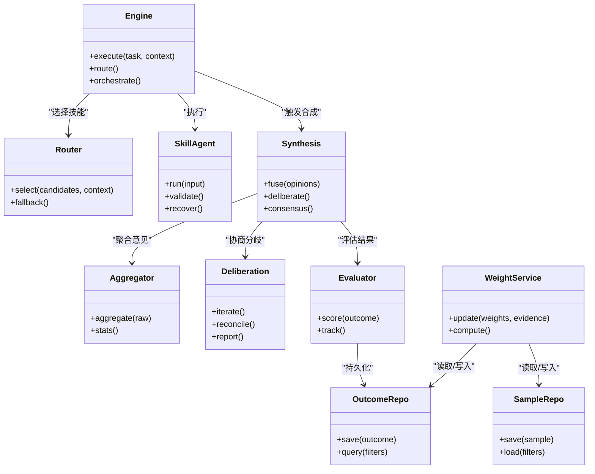

# 技能合成器

<cite>
**本文引用的文件**   
- [src/agent/skills/engine.py](file://src/agent/skills/engine.py)
- [src/agent/skills/synthesis.py](file://src/agent/skills/synthesis.py)
- [src/agent/skills/aggregator.py](file://src/agent/skills/aggregator.py)
- [src/agent/skills/deliberation.py](file://src/agent/skills/deliberation.py)
- [src/agent/skills/router.py](file://src/agent/skills/router.py)
- [src/agent/skills/skill_agent.py](file://src/agent/skills/skill_agent.py)
- [src/agent/skills/base.py](file://src/agent/skills/base.py)
- [src/agent/skills/defaults.py](file://src/agent/skills/defaults.py)
- [src/core/skill_opinion_outcome_evaluator.py](file://src/core/skill_opinion_outcome_evaluator.py)
- [src/services/skill_opinion_weight_service.py](file://src/services/skill_opinion_weight_service.py)
- [src/repositories/skill_opinion_outcome_repo.py](file://src/repositories/skill_opinion_outcome_repo.py)
- [src/repositories/skill_opinion_sample_repo.py](file://src/repositories/skill_opinion_sample_repo.py)
- [src/services/skill_opinion_outcome_service.py](file://src/services/skill_opinion_outcome_service.py)
- [src/services/skill_opinion_performance_service.py](file://src/services/skill_opinion_performance_service.py)
- [src/services/skill_opinion_sample_service.py](file://src/services/skill_opinion_sample_service.py)
- [tests/test_skill_opinion_outcomes.py](file://tests/test_skill_opinion_outcomes.py)
- [tests/test_skill_opinion_samples.py](file://tests/test_skill_opinion_samples.py)
- [tests/test_skill_opinion_weights.py](file://tests/test_skill_opinion_weights.py)
</cite>

## 目录
1. [简介](#简介)
2. [项目结构](#项目结构)
3. [核心组件](#核心组件)
4. [架构总览](#架构总览)
5. [详细组件分析](#详细组件分析)
6. [依赖关系分析](#依赖关系分析)
7. [性能考量](#性能考量)
8. [故障排查指南](#故障排查指南)
9. [结论](#结论)
10. [附录](#附录)

## 简介
本文件面向“技能合成器”子系统，系统性阐述多代理决策下的智能合成能力：结果融合策略、矛盾消解与共识达成机制；多代理协调流程（意见收集、权重计算、最终决策生成）；合成质量评估指标（准确性、一致性、稳定性）；反馈学习闭环（结果验证、模型优化、自适应调整）；以及规则定制方法（自定义融合算法、阈值配置、输出格式化）。文档同时提供完整使用案例，帮助在复杂场景中实现高质量智能合成。

## 项目结构
技能合成器位于 src/agent/skills 目录下，围绕“引擎-合成-聚合-协商-路由-技能代理”的层次组织，配合 core 层的评估服务与 services/repositories 的数据与权重管理模块，形成端到端的合成流水线。

图表来源 
- [src/agent/skills/engine.py](file://src/agent/skills/engine.py)
- [src/agent/skills/synthesis.py](file://src/agent/skills/synthesis.py)
- [src/agent/skills/aggregator.py](file://src/agent/skills/aggregator.py)
- [src/agent/skills/deliberation.py](file://src/agent/skills/deliberation.py)
- [src/agent/skills/router.py](file://src/agent/skills/router.py)
- [src/agent/skills/skill_agent.py](file://src/agent/skills/skill_agent.py)
- [src/agent/skills/base.py](file://src/agent/skills/base.py)
- [src/agent/skills/defaults.py](file://src/agent/skills/defaults.py)
- [src/core/skill_opinion_outcome_evaluator.py](file://src/core/skill_opinion_outcome_evaluator.py)
- [src/services/skill_opinion_weight_service.py](file://src/services/skill_opinion_weight_service.py)
- [src/repositories/skill_opinion_outcome_repo.py](file://src/repositories/skill_opinion_outcome_repo.py)
- [src/repositories/skill_opinion_sample_repo.py](file://src/repositories/skill_opinion_sample_repo.py)
- [src/services/skill_opinion_outcome_service.py](file://src/services/skill_opinion_outcome_service.py)
- [src/services/skill_opinion_performance_service.py](file://src/services/skill_opinion_performance_service.py)
- [src/services/skill_opinion_sample_service.py](file://src/services/skill_opinion_sample_service.py)

章节来源
- [src/agent/skills/engine.py](file://src/agent/skills/engine.py)
- [src/agent/skills/synthesis.py](file://src/agent/skills/synthesis.py)
- [src/agent/skills/aggregator.py](file://src/agent/skills/aggregator.py)
- [src/agent/skills/deliberation.py](file://src/agent/skills/deliberation.py)
- [src/agent/skills/router.py](file://src/agent/skills/router.py)
- [src/agent/skills/skill_agent.py](file://src/agent/skills/skill_agent.py)
- [src/agent/skills/base.py](file://src/agent/skills/base.py)
- [src/agent/skills/defaults.py](file://src/agent/skills/defaults.py)
- [src/core/skill_opinion_outcome_evaluator.py](file://src/core/skill_opinion_outcome_evaluator.py)
- [src/services/skill_opinion_weight_service.py](file://src/services/skill_opinion_weight_service.py)
- [src/repositories/skill_opinion_outcome_repo.py](file://src/repositories/skill_opinion_outcome_repo.py)
- [src/repositories/skill_opinion_sample_repo.py](file://src/repositories/skill_opinion_sample_repo.py)
- [src/services/skill_opinion_outcome_service.py](file://src/services/skill_opinion_outcome_service.py)
- [src/services/skill_opinion_performance_service.py](file://src/services/skill_opinion_performance_service.py)
- [src/services/skill_opinion_sample_service.py](file://src/services/skill_opinion_sample_service.py)

## 核心组件
- 引擎（Engine）：编排技能执行、路由选择、合成触发与生命周期管理。
- 合成器（Synthesis）：汇聚多技能意见，执行融合、冲突消解与共识收敛。
- 聚合器（Aggregator）：对原始意见进行统计聚合与结构化汇总。
- 协商器（Deliberation）：处理分歧、迭代协商与共识判定。
- 路由器（Router）：根据上下文与历史表现动态选择技能或策略。
- 技能代理（SkillAgent）：封装具体技能的能力、输入输出契约与元数据。
- 基类与默认策略（Base/Defaults）：定义通用接口、默认融合与权重策略。
- 评估与数据层：结果评估器、权重服务、结果/样本仓库与服务，支撑反馈学习与自适应调优。

章节来源
- [src/agent/skills/engine.py](file://src/agent/skills/engine.py)
- [src/agent/skills/synthesis.py](file://src/agent/skills/synthesis.py)
- [src/agent/skills/aggregator.py](file://src/agent/skills/aggregator.py)
- [src/agent/skills/deliberation.py](file://src/agent/skills/deliberation.py)
- [src/agent/skills/router.py](file://src/agent/skills/router.py)
- [src/agent/skills/skill_agent.py](file://src/agent/skills/skill_agent.py)
- [src/agent/skills/base.py](file://src/agent/skills/base.py)
- [src/agent/skills/defaults.py](file://src/agent/skills/defaults.py)

## 架构总览
技能合成器的整体调用链从引擎发起，经路由器选择技能，技能代理产出意见，合成器进行融合与协商，评估器记录并量化结果，权重服务基于历史表现更新权重，形成闭环。

图表来源 
- [src/agent/skills/engine.py](file://src/agent/skills/engine.py)
- [src/agent/skills/router.py](file://src/agent/skills/router.py)
- [src/agent/skills/skill_agent.py](file://src/agent/skills/skill_agent.py)
- [src/agent/skills/synthesis.py](file://src/agent/skills/synthesis.py)
- [src/agent/skills/aggregator.py](file://src/agent/skills/aggregator.py)
- [src/agent/skills/deliberation.py](file://src/agent/skills/deliberation.py)
- [src/core/skill_opinion_outcome_evaluator.py](file://src/core/skill_opinion_outcome_evaluator.py)
- [src/services/skill_opinion_weight_service.py](file://src/services/skill_opinion_weight_service.py)
- [src/repositories/skill_opinion_outcome_repo.py](file://src/repositories/skill_opinion_outcome_repo.py)
- [src/repositories/skill_opinion_sample_repo.py](file://src/repositories/skill_opinion_sample_repo.py)

## 详细组件分析

### 合成器（Synthesis）
- 职责：接收多技能意见，执行融合策略、冲突检测与协商收敛，输出最终决策与解释。
- 关键流程：
  - 意见收集与校验：统一格式、缺失值处理、置信度归一化。
  - 融合策略：加权平均、投票、贝叶斯更新、鲁棒聚合（去极值）。
  - 冲突消解：识别分歧维度，触发协商轮次，依据权重与证据强度收敛。
  - 共识判定：达到阈值即输出决策，否则返回分歧报告与重试建议。
- 输出：结构化决策、置信度、贡献分解、协商轨迹。

图表来源 
- [src/agent/skills/synthesis.py](file://src/agent/skills/synthesis.py)
- [src/agent/skills/aggregator.py](file://src/agent/skills/aggregator.py)
- [src/agent/skills/deliberation.py](file://src/agent/skills/deliberation.py)
- [src/core/skill_opinion_outcome_evaluator.py](file://src/core/skill_opinion_outcome_evaluator.py)
- [src/services/skill_opinion_weight_service.py](file://src/services/skill_opinion_weight_service.py)
- [src/repositories/skill_opinion_outcome_repo.py](file://src/repositories/skill_opinion_outcome_repo.py)
- [src/repositories/skill_opinion_sample_repo.py](file://src/repositories/skill_opinion_sample_repo.py)

章节来源
- [src/agent/skills/synthesis.py](file://src/agent/skills/synthesis.py)
- [src/agent/skills/aggregator.py](file://src/agent/skills/aggregator.py)
- [src/agent/skills/deliberation.py](file://src/agent/skills/deliberation.py)
- [src/core/skill_opinion_outcome_evaluator.py](file://src/core/skill_opinion_outcome_evaluator.py)
- [src/services/skill_opinion_weight_service.py](file://src/services/skill_opinion_weight_service.py)
- [src/repositories/skill_opinion_outcome_repo.py](file://src/repositories/skill_opinion_outcome_repo.py)
- [src/repositories/skill_opinion_sample_repo.py](file://src/repositories/skill_opinion_sample_repo.py)

### 聚合器（Aggregator）
- 职责：将原始意见转换为可比较的结构化表示，支持统计量计算与分布特征提取。
- 能力：均值/中位数/方差、分位数、离群点检测、类别频率统计。
- 输出：聚合视图、异常标记、置信区间估计。

章节来源
- [src/agent/skills/aggregator.py](file://src/agent/skills/aggregator.py)

### 协商器（Deliberation）
- 职责：在多意见不一致时驱动协商，依据证据强度与权重进行收敛。
- 机制：迭代轮次、让步策略、强制收敛阈值、分歧报告生成。
- 输出：协商轨迹、收敛状态、最终一致意见或保留分歧。

章节来源
- [src/agent/skills/deliberation.py](file://src/agent/skills/deliberation.py)

### 路由器（Router）
- 职责：基于上下文、历史表现与约束条件选择合适技能或策略组合。
- 策略：静态规则、动态评分、上下文感知、回退路径。
- 输出：候选技能序列、执行顺序、资源预算分配。

章节来源
- [src/agent/skills/router.py](file://src/agent/skills/router.py)

### 技能代理（SkillAgent）与基类/默认策略
- 技能代理：封装技能输入输出契约、参数校验、错误恢复与元数据。
- 基类：定义统一接口、生命周期钩子、日志与追踪。
- 默认策略：提供默认融合算法、权重初始化与阈值配置。

章节来源
- [src/agent/skills/skill_agent.py](file://src/agent/skills/skill_agent.py)
- [src/agent/skills/base.py](file://src/agent/skills/base.py)
- [src/agent/skills/defaults.py](file://src/agent/skills/defaults.py)

### 引擎（Engine）
- 职责：编排执行流、并发控制、超时与重试、事件上报。
- 集成：与路由器、技能代理、合成器、评估器、权重服务协作。
- 输出：任务状态、中间事件、最终合成结果。

章节来源
- [src/agent/skills/engine.py](file://src/agent/skills/engine.py)

## 依赖关系分析
技能合成器内部耦合清晰：引擎依赖路由器与合成器；合成器依赖聚合器与协商器；评估与权重服务通过仓库访问持久化数据。测试覆盖关键行为，确保契约稳定。

图表来源 
- [src/agent/skills/engine.py](file://src/agent/skills/engine.py)
- [src/agent/skills/router.py](file://src/agent/skills/router.py)
- [src/agent/skills/skill_agent.py](file://src/agent/skills/skill_agent.py)
- [src/agent/skills/synthesis.py](file://src/agent/skills/synthesis.py)
- [src/agent/skills/aggregator.py](file://src/agent/skills/aggregator.py)
- [src/agent/skills/deliberation.py](file://src/agent/skills/deliberation.py)
- [src/core/skill_opinion_outcome_evaluator.py](file://src/core/skill_opinion_outcome_evaluator.py)
- [src/services/skill_opinion_weight_service.py](file://src/services/skill_opinion_weight_service.py)
- [src/repositories/skill_opinion_outcome_repo.py](file://src/repositories/skill_opinion_outcome_repo.py)
- [src/repositories/skill_opinion_sample_repo.py](file://src/repositories/skill_opinion_sample_repo.py)

章节来源
- [src/agent/skills/engine.py](file://src/agent/skills/engine.py)
- [src/agent/skills/router.py](file://src/agent/skills/router.py)
- [src/agent/skills/skill_agent.py](file://src/agent/skills/skill_agent.py)
- [src/agent/skills/synthesis.py](file://src/agent/skills/synthesis.py)
- [src/agent/skills/aggregator.py](file://src/agent/skills/aggregator.py)
- [src/agent/skills/deliberation.py](file://src/agent/skills/deliberation.py)
- [src/core/skill_opinion_outcome_evaluator.py](file://src/core/skill_opinion_outcome_evaluator.py)
- [src/services/skill_opinion_weight_service.py](file://src/services/skill_opinion_weight_service.py)
- [src/repositories/skill_opinion_outcome_repo.py](file://src/repositories/skill_opinion_outcome_repo.py)
- [src/repositories/skill_opinion_sample_repo.py](file://src/repositories/skill_opinion_sample_repo.py)

## 性能考量
- 并发与批处理：技能执行可采用并行以提升吞吐，但需限制并发度避免资源争用。
- 内存与序列化：大规模意见聚合时需控制中间对象大小，必要时分页或流式处理。
- 缓存与复用：路由器与权重计算结果可缓存以减少重复计算。
- I/O 优化：仓库读写批量化，减少频繁磁盘操作。
- 监控与降级：关键路径增加耗时与失败率监控，设置超时与回退策略。

[本节为通用指导，不直接分析具体文件]

## 故障排查指南
- 常见问题定位：
  - 意见格式不一致：检查聚合器输入校验与标准化逻辑。
  - 冲突无法收敛：查看协商器轮次上限与让步策略，确认权重是否合理。
  - 评估分数异常：核对评估器指标定义与样本标签一致性。
  - 权重漂移：检查权重更新频率与证据质量过滤。
- 调试手段：
  - 启用详细日志与事件追踪，关注合成器与协商器中间状态。
  - 使用仓库查询功能回放历史结果与样本，定位退化原因。
  - 单元测试复现问题场景，逐步缩小范围。

章节来源
- [src/agent/skills/synthesis.py](file://src/agent/skills/synthesis.py)
- [src/agent/skills/deliberation.py](file://src/agent/skills/deliberation.py)
- [src/core/skill_opinion_outcome_evaluator.py](file://src/core/skill_opinion_outcome_evaluator.py)
- [src/services/skill_opinion_weight_service.py](file://src/services/skill_opinion_weight_service.py)
- [src/repositories/skill_opinion_outcome_repo.py](file://src/repositories/skill_opinion_outcome_repo.py)
- [src/repositories/skill_opinion_sample_repo.py](file://src/repositories/skill_opinion_sample_repo.py)

## 结论
技能合成器通过“引擎-路由器-技能代理-合成器-评估-权重”的闭环设计，实现了多代理意见的高效融合与稳健决策。其融合策略、冲突消解与共识机制保证了在复杂场景下的准确性与一致性；评估与权重服务驱动的反馈学习使系统具备自适应优化能力。通过合理的规则定制与阈值配置，可在不同业务场景中取得高质量的合成结果。

[本节为总结性内容，不直接分析具体文件]

## 附录

### 使用案例：复杂场景下的高质量智能合成
- 场景描述：多源数据（技术面、基本面、情绪面）由不同技能代理产出意见，需要融合并给出最终交易信号。
- 步骤概览：
  - 引擎接收任务与上下文，路由器选择技术面、基本面、情绪面技能。
  - 各技能代理并行执行，返回意见与置信度。
  - 合成器进行加权融合，若出现分歧则启动协商轮次。
  - 评估器对结果打分并持久化，权重服务更新技能权重。
  - 输出最终决策、置信度与贡献分解，供下游执行或审计。
- 关键点：
  - 融合策略选择：在波动期采用鲁棒聚合，在趋势期采用贝叶斯更新。
  - 冲突阈值：设定分歧容忍度，超过阈值触发更强协商或人工介入。
  - 输出格式化：按业务需求生成结构化信号与解释文本。

章节来源
- [src/agent/skills/engine.py](file://src/agent/skills/engine.py)
- [src/agent/skills/router.py](file://src/agent/skills/router.py)
- [src/agent/skills/skill_agent.py](file://src/agent/skills/skill_agent.py)
- [src/agent/skills/synthesis.py](file://src/agent/skills/synthesis.py)
- [src/core/skill_opinion_outcome_evaluator.py](file://src/core/skill_opinion_outcome_evaluator.py)
- [src/services/skill_opinion_weight_service.py](file://src/services/skill_opinion_weight_service.py)
- [src/repositories/skill_opinion_outcome_repo.py](file://src/repositories/skill_opinion_outcome_repo.py)
- [src/repositories/skill_opinion_sample_repo.py](file://src/repositories/skill_opinion_sample_repo.py)

### 合成质量评估指标
- 准确性：对比合成结果与真实标签，计算准确率、召回率、F1等。
- 一致性：衡量多次合成的稳定性，如方差、Kappa系数。
- 稳定性：评估在不同时间窗口与数据扰动下的表现波动。
- 可解释性：贡献分解与协商轨迹的可读性与可信度。

章节来源
- [src/core/skill_opinion_outcome_evaluator.py](file://src/core/skill_opinion_outcome_evaluator.py)
- [src/services/skill_opinion_performance_service.py](file://src/services/skill_opinion_performance_service.py)
- [tests/test_skill_opinion_outcomes.py](file://tests/test_skill_opinion_outcomes.py)
- [tests/test_skill_opinion_samples.py](file://tests/test_skill_opinion_samples.py)
- [tests/test_skill_opinion_weights.py](file://tests/test_skill_opinion_weights.py)

### 反馈学习机制
- 结果验证：通过仓库持久化结果与样本，支持回溯与离线评估。
- 模型优化：基于评估分数与样本标签更新权重，驱动技能选择与融合策略自适应。
- 自适应调整：根据实时表现动态调整阈值与协商轮次，提升鲁棒性。

章节来源
- [src/repositories/skill_opinion_outcome_repo.py](file://src/repositories/skill_opinion_outcome_repo.py)
- [src/repositories/skill_opinion_sample_repo.py](file://src/repositories/skill_opinion_sample_repo.py)
- [src/services/skill_opinion_outcome_service.py](file://src/services/skill_opinion_outcome_service.py)
- [src/services/skill_opinion_sample_service.py](file://src/services/skill_opinion_sample_service.py)
- [src/services/skill_opinion_weight_service.py](file://src/services/skill_opinion_weight_service.py)

### 合成规则定制方法
- 自定义融合算法：在合成器中扩展融合策略，支持领域特定的加权或规则。
- 阈值配置：调节冲突阈值、协商轮次上限、置信度下限等参数。
- 输出格式化：按业务需求定义输出结构与字段，便于下游消费与审计。

章节来源
- [src/agent/skills/synthesis.py](file://src/agent/skills/synthesis.py)
- [src/agent/skills/defaults.py](file://src/agent/skills/defaults.py)
- [src/agent/skills/base.py](file://src/agent/skills/base.py)