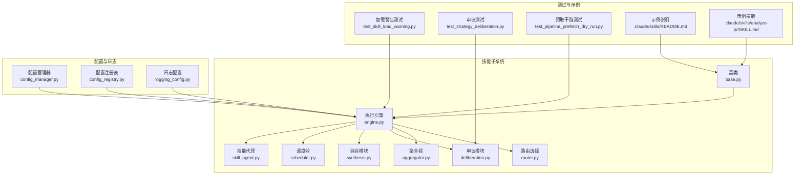
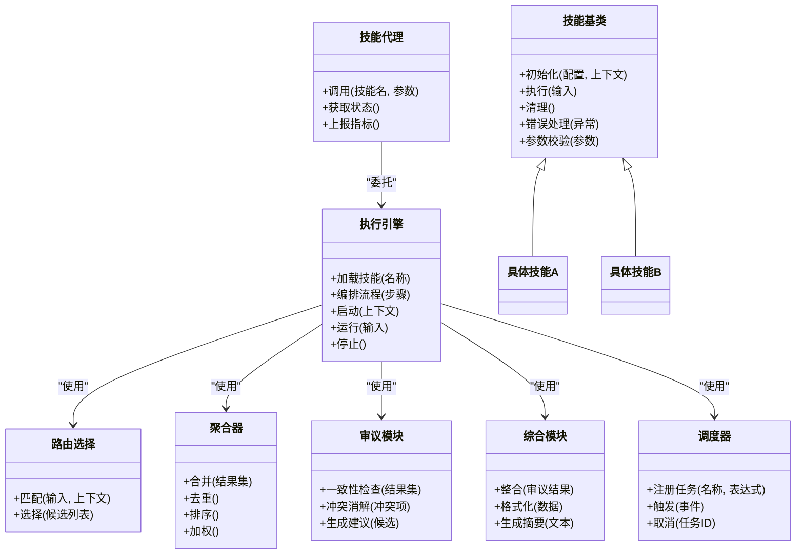
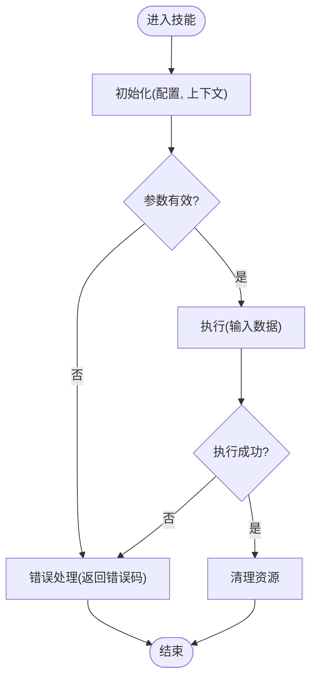
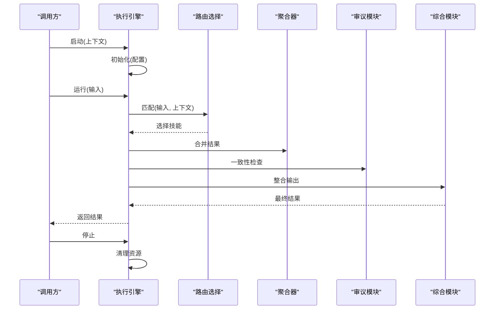
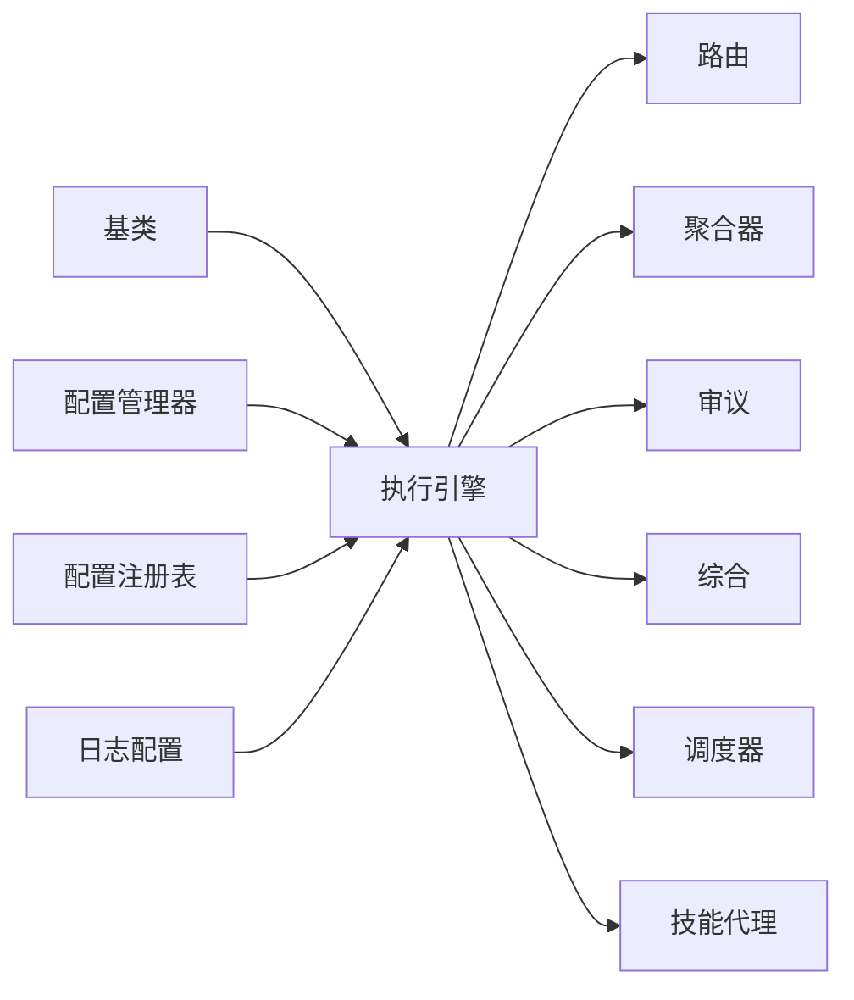

# 技能开发指南

<cite>
**本文档引用的文件**   
- [SKILL.md](file://SKILL.md)
- [src/agent/skills/base.py](file://src/agent/skills/base.py)
- [src/agent/skills/engine.py](file://src/agent/skills/engine.py)
- [src/agent/skills/router.py](file://src/agent/skills/router.py)
- [src/agent/skills/aggregator.py](file://src/agent/skills/aggregator.py)
- [src/agent/skills/deliberation.py](file://src/agent/skills/deliberation.py)
- [src/agent/skills/synthesis.py](file://src/agent/skills/synthesis.py)
- [src/agent/skills/scheduler.py](file://src/agent/skills/scheduler.py)
- [src/agent/skills/skill_agent.py](file://src/agent/skills/skill_agent.py)
- [src/core/config_manager.py](file://src/core/config_manager.py)
- [src/core/config_registry.py](file://src/core/config_registry.py)
- [src/logging_config.py](file://src/logging_config.py)
- [tests/test_skill_load_warning.py](file://tests/test_skill_load_warning.py)
- [tests/test_strategy_deliberation.py](file://tests/test_strategy_deliberation.py)
- [tests/test_pipeline_prefetch_dry_run.py](file://tests/test_pipeline_prefetch_dry_run.py)
- [scripts/test.sh](file://scripts/test.sh)
- [.claude/skills/analyze-pr/SKILL.md](file://.claude/skills/analyze-pr/SKILL.md)
- [.claude/skills/README.md](file://.claude/skills/README.md)
</cite>

## 目录
1. [简介](#简介)
2. [项目结构](#项目结构)
3. [核心组件](#核心组件)
4. [架构总览](#架构总览)
5. [详细组件分析](#详细组件分析)
6. [依赖关系分析](#依赖关系分析)
7. [性能考量](#性能考量)
8. [故障排查指南](#故障排查指南)
9. [结论](#结论)
10. [附录](#附录)

## 简介
本指南面向希望在本项目中开发“技能”的工程师，系统阐述技能接口规范、生命周期管理、配置体系、测试方法、调试技巧与发布版本管理最佳实践。通过阅读本指南，你将能够从零开始构建简单技能，并逐步掌握复杂技能链的设计与实现。

## 项目结构
本项目采用分层与模块化组织方式，技能相关代码集中在 src/agent/skills 目录下，配套的配置管理与日志记录位于 src/core 与根目录。测试用例集中于 tests 目录，示例技能定义位于 .claude/skills。

图表来源
- [src/agent/skills/base.py](file://src/agent/skills/base.py)
- [src/agent/skills/engine.py](file://src/agent/skills/engine.py)
- [src/agent/skills/router.py](file://src/agent/skills/router.py)
- [src/agent/skills/aggregator.py](file://src/agent/skills/aggregator.py)
- [src/agent/skills/deliberation.py](file://src/agent/skills/deliberation.py)
- [src/agent/skills/synthesis.py](file://src/agent/skills/synthesis.py)
- [src/agent/skills/scheduler.py](file://src/agent/skills/scheduler.py)
- [src/agent/skills/skill_agent.py](file://src/agent/skills/skill_agent.py)
- [src/core/config_manager.py](file://src/core/config_manager.py)
- [src/core/config_registry.py](file://src/core/config_registry.py)
- [src/logging_config.py](file://src/logging_config.py)
- [tests/test_skill_load_warning.py](file://tests/test_skill_load_warning.py)
- [tests/test_strategy_deliberation.py](file://tests/test_strategy_deliberation.py)
- [tests/test_pipeline_prefetch_dry_run.py](file://tests/test_pipeline_prefetch_dry_run.py)
- [.claude/skills/README.md](file://.claude/skills/README.md)
- [.claude/skills/analyze-pr/SKILL.md](file://.claude/skills/analyze-pr/SKILL.md)

章节来源
- [SKILL.md](file://SKILL.md)
- [.claude/skills/README.md](file://.claude/skills/README.md)

## 核心组件
- 技能基类：定义统一的技能接口、参数校验、生命周期钩子与错误处理约定。
- 执行引擎：负责技能的初始化、编排、执行与清理，协调路由、聚合、审议与综合等阶段。
- 路由选择：根据输入上下文与策略规则选择合适技能或子任务。
- 聚合器：合并多个技能输出，进行去重、排序与权重计算。
- 审议模块：对候选结果进行一致性检查、冲突消解与决策建议。
- 综合模块：将审议后的结果整合为最终输出，支持格式化与摘要生成。
- 调度器：按时间或事件触发技能执行，支持周期性与一次性任务。
- 技能代理：对外暴露统一调用入口，封装参数转换、上下文传递与结果序列化。

章节来源
- [src/agent/skills/base.py](file://src/agent/skills/base.py)
- [src/agent/skills/engine.py](file://src/agent/skills/engine.py)
- [src/agent/skills/router.py](file://src/agent/skills/router.py)
- [src/agent/skills/aggregator.py](file://src/agent/skills/aggregator.py)
- [src/agent/skills/deliberation.py](file://src/agent/skills/deliberation.py)
- [src/agent/skills/synthesis.py](file://src/agent/skills/synthesis.py)
- [src/agent/skills/scheduler.py](file://src/agent/skills/scheduler.py)
- [src/agent/skills/skill_agent.py](file://src/agent/skills/skill_agent.py)

## 架构总览
技能系统以“基类 + 引擎”为核心，配合路由、聚合、审议、综合与调度形成完整流水线。配置由配置管理器与注册表统一管理，日志贯穿全链路。

图表来源
- [src/agent/skills/base.py](file://src/agent/skills/base.py)
- [src/agent/skills/engine.py](file://src/agent/skills/engine.py)
- [src/agent/skills/router.py](file://src/agent/skills/router.py)
- [src/agent/skills/aggregator.py](file://src/agent/skills/aggregator.py)
- [src/agent/skills/deliberation.py](file://src/agent/skills/deliberation.py)
- [src/agent/skills/synthesis.py](file://src/agent/skills/synthesis.py)
- [src/agent/skills/scheduler.py](file://src/agent/skills/scheduler.py)
- [src/agent/skills/skill_agent.py](file://src/agent/skills/skill_agent.py)

## 详细组件分析

### 技能基类与接口规范
- 继承关系：所有自定义技能需继承技能基类，确保统一的生命周期与方法签名。
- 方法实现：必须实现初始化、执行、清理与错误处理；可选实现参数校验与扩展钩子。
- 参数定义：通过配置对象传入，支持类型校验与默认值；环境变量与运行时参数可覆盖默认配置。

图表来源
- [src/agent/skills/base.py](file://src/agent/skills/base.py)

章节来源
- [src/agent/skills/base.py](file://src/agent/skills/base.py)

### 执行引擎与生命周期管理
- 初始化：加载配置、注册技能、建立上下文。
- 执行：按编排顺序调用路由、聚合、审议、综合等阶段。
- 清理：释放资源、关闭连接、保存中间状态。
- 错误处理：捕获异常、记录日志、回滚事务、返回标准化错误。

图表来源
- [src/agent/skills/engine.py](file://src/agent/skills/engine.py)
- [src/agent/skills/router.py](file://src/agent/skills/router.py)
- [src/agent/skills/aggregator.py](file://src/agent/skills/aggregator.py)
- [src/agent/skills/deliberation.py](file://src/agent/skills/deliberation.py)
- [src/agent/skills/synthesis.py](file://src/agent/skills/synthesis.py)

章节来源
- [src/agent/skills/engine.py](file://src/agent/skills/engine.py)

### 路由选择与技能编排
- 匹配策略：基于输入特征、上下文标签与优先级规则进行匹配。
- 选择算法：支持单目标与多目标选择，可结合权重与置信度。
- 编排模式：串行、并行、条件分支与循环迭代。

章节来源
- [src/agent/skills/router.py](file://src/agent/skills/router.py)

### 聚合、审议与综合
- 聚合：合并多源结果，去重、排序与加权融合。
- 审议：一致性检查、冲突识别与建议生成。
- 综合：格式化为标准输出，支持摘要与可视化数据。

章节来源
- [src/agent/skills/aggregator.py](file://src/agent/skills/aggregator.py)
- [src/agent/skills/deliberation.py](file://src/agent/skills/deliberation.py)
- [src/agent/skills/synthesis.py](file://src/agent/skills/synthesis.py)

### 调度器与定时任务
- 任务注册：支持 cron 表达式与事件驱动。
- 触发机制：周期性执行与一次性任务。
- 监控与告警：任务状态跟踪与失败重试。

章节来源
- [src/agent/skills/scheduler.py](file://src/agent/skills/scheduler.py)

### 技能代理与外部集成
- 调用封装：统一入口，参数转换与上下文传递。
- 状态查询：获取技能运行状态与指标。
- 上报机制：性能指标与错误统计上报。

章节来源
- [src/agent/skills/skill_agent.py](file://src/agent/skills/skill_agent.py)

## 依赖关系分析
技能子系统内部耦合度低、内聚性高，通过接口抽象降低依赖。配置与日志作为横切关注点，被各组件共享。

图表来源
- [src/agent/skills/base.py](file://src/agent/skills/base.py)
- [src/agent/skills/engine.py](file://src/agent/skills/engine.py)
- [src/core/config_manager.py](file://src/core/config_manager.py)
- [src/core/config_registry.py](file://src/core/config_registry.py)
- [src/logging_config.py](file://src/logging_config.py)

章节来源
- [src/agent/skills/engine.py](file://src/agent/skills/engine.py)
- [src/core/config_manager.py](file://src/core/config_manager.py)
- [src/core/config_registry.py](file://src/core/config_registry.py)
- [src/logging_config.py](file://src/logging_config.py)

## 性能考量
- 并发控制：合理设置线程池与队列大小，避免资源竞争。
- 缓存策略：对频繁访问的数据进行缓存，减少重复计算。
- I/O 优化：异步调用与批量处理，降低网络与磁盘开销。
- 内存管理：及时释放大对象，避免内存泄漏。

[本节为通用指导，不直接分析具体文件]

## 故障排查指南
- 日志记录：启用详细日志，定位错误堆栈与上下文信息。
- 断点调试：在关键路径设置断点，观察变量状态。
- 性能分析：使用性能分析工具识别瓶颈。
- 常见错误：配置加载失败、技能未注册、参数校验错误、资源未释放。

章节来源
- [src/logging_config.py](file://src/logging_config.py)
- [tests/test_skill_load_warning.py](file://tests/test_skill_load_warning.py)

## 结论
通过遵循本指南中的接口规范、生命周期管理与配置体系，开发者可以高效构建稳定可靠的技能。结合测试与调试技巧，确保技能在生产环境中的健壮性与可维护性。

[本节为总结性内容，不直接分析具体文件]

## 附录

### 技能配置格式与选项
- YAML 配置：定义技能元数据、参数默认值与依赖关系。
- 环境变量：覆盖敏感信息与运行时参数。
- 运行时参数：动态调整行为与性能。

章节来源
- [src/core/config_manager.py](file://src/core/config_manager.py)
- [src/core/config_registry.py](file://src/core/config_registry.py)

### 测试方法与最佳实践
- 单元测试：验证单个技能逻辑正确性。
- 集成测试：端到端流程验证与外部依赖模拟。
- 性能测试：负载测试与基准测试。

章节来源
- [tests/test_strategy_deliberation.py](file://tests/test_strategy_deliberation.py)
- [tests/test_pipeline_prefetch_dry_run.py](file://tests/test_pipeline_prefetch_dry_run.py)
- [scripts/test.sh](file://scripts/test.sh)

### 调试技巧与工具使用
- 日志级别：根据场景调整日志详细程度。
- 断点调试：IDE 集成调试器快速定位问题。
- 性能分析：火焰图与热点函数识别。

章节来源
- [src/logging_config.py](file://src/logging_config.py)

### 开发示例与发布管理
- 简单技能：从基类继承，实现必要方法。
- 复杂技能链：组合多个技能，设计编排流程。
- 发布与版本：语义化版本控制与变更日志。

章节来源
- [.claude/skills/README.md](file://.claude/skills/README.md)
- [.claude/skills/analyze-pr/SKILL.md](file://.claude/skills/analyze-pr/SKILL.md)
- [SKILL.md](file://SKILL.md)