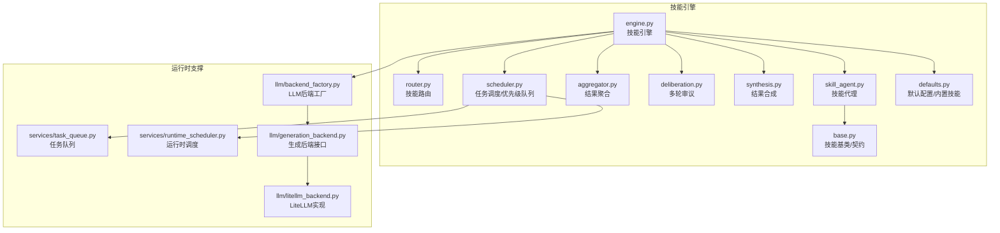
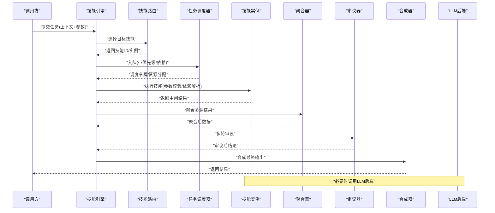
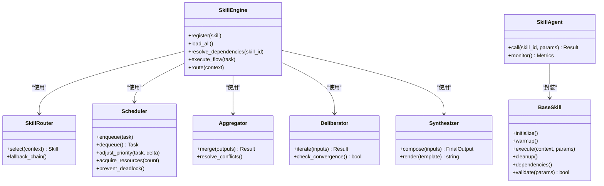
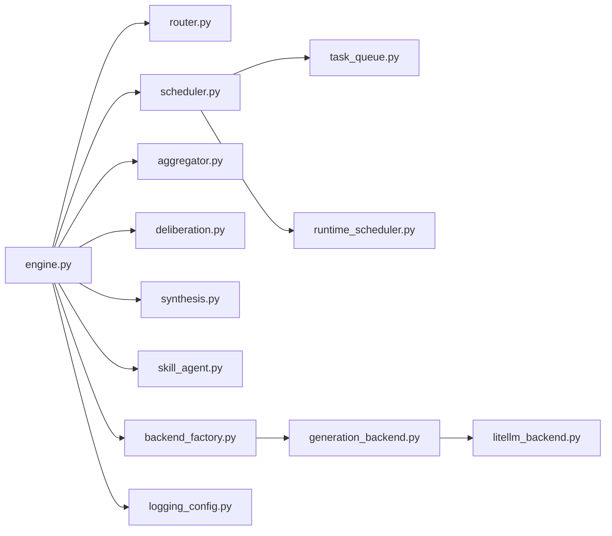

# 技能引擎

<cite>
**本文档引用的文件**   
- [src/agent/skills/engine.py](file://src/agent/skills/engine.py)
- [src/agent/skills/base.py](file://src/agent/skills/base.py)
- [src/agent/skills/router.py](file://src/agent/skills/router.py)
- [src/agent/skills/scheduler.py](file://src/agent/skills/scheduler.py)
- [src/agent/skills/aggregator.py](file://src/agent/skills/aggregator.py)
- [src/agent/skills/deliberation.py](file://src/agent/skills/deliberation.py)
- [src/agent/skills/synthesis.py](file://src/agent/skills/synthesis.py)
- [src/agent/skills/skill_agent.py](file://src/agent/skills/skill_agent.py)
- [src/agent/skills/defaults.py](file://src/agent/skills/defaults.py)
- [src/services/task_queue.py](file://src/services/task_queue.py)
- [src/services/runtime_scheduler.py](file://src/services/runtime_scheduler.py)
- [src/core/backtest_engine.py](file://src/core/backtest_engine.py)
- [src/core/pipeline.py](file://src/core/pipeline.py)
- [src/llm/backend_factory.py](file://src/llm/backend_factory.py)
- [src/llm/generation_backend.py](file://src/llm/generation_backend.py)
- [src/llm/litellm_backend.py](file://src/llm/litellm_backend.py)
- [src/logging_config.py](file://src/logging_config.py)
- [tests/test_skill_load_warning.py](file://tests/test_skill_load_warning.py)
</cite>

## 目录
1. [简介](#简介)
2. [项目结构](#项目结构)
3. [核心组件](#核心组件)
4. [架构总览](#架构总览)
5. [详细组件分析](#详细组件分析)
6. [依赖关系分析](#依赖关系分析)
7. [性能考量](#性能考量)
8. [故障排查指南](#故障排查指南)
9. [结论](#结论)
10. [附录](#附录)

## 简介
本文件面向“技能引擎”子系统，系统性阐述其核心架构与实现要点，覆盖技能生命周期管理、任务调度算法、并发控制机制、注册加载执行流程（含依赖解析、参数校验与错误处理）、优先级队列原理（动态优先级、资源竞争解决、死锁预防）、执行上下文管理（状态持久化、内存管理与性能监控），以及开发最佳实践与示例指引。文档力求以循序渐进的方式帮助不同技术背景的读者理解并高效使用技能引擎。

## 项目结构
技能引擎位于 src/agent/skills 目录下，围绕“引擎-路由-调度-聚合-审议-合成-代理”等职责进行模块化拆分；同时与任务队列、运行时调度、LLM后端工厂等外部能力协作。核心入口为 engine.py，负责编排技能的注册、加载、依赖解析、调度与执行；router.py 负责技能选择与路由；scheduler.py 提供任务调度与优先级队列；aggregator.py、deliberation.py、synthesis.py 分别承担结果聚合、多轮审议与最终合成；skill_agent.py 将技能封装为可被上层 Agent 调用的单元；base.py 定义技能基类与通用契约；defaults.py 提供默认配置与内置技能。

图表来源
- [src/agent/skills/engine.py](file://src/agent/skills/engine.py)
- [src/agent/skills/router.py](file://src/agent/skills/router.py)
- [src/agent/skills/scheduler.py](file://src/agent/skills/scheduler.py)
- [src/agent/skills/aggregator.py](file://src/agent/skills/aggregator.py)
- [src/agent/skills/deliberation.py](file://src/agent/skills/deliberation.py)
- [src/agent/skills/synthesis.py](file://src/agent/skills/synthesis.py)
- [src/agent/skills/skill_agent.py](file://src/agent/skills/skill_agent.py)
- [src/agent/skills/base.py](file://src/agent/skills/base.py)
- [src/agent/skills/defaults.py](file://src/agent/skills/defaults.py)
- [src/services/task_queue.py](file://src/services/task_queue.py)
- [src/services/runtime_scheduler.py](file://src/services/runtime_scheduler.py)
- [src/llm/backend_factory.py](file://src/llm/backend_factory.py)
- [src/llm/generation_backend.py](file://src/llm/generation_backend.py)
- [src/llm/litellm_backend.py](file://src/llm/litellm_backend.py)

章节来源
- [src/agent/skills/engine.py](file://src/agent/skills/engine.py)
- [src/agent/skills/router.py](file://src/agent/skills/router.py)
- [src/agent/skills/scheduler.py](file://src/agent/skills/scheduler.py)
- [src/agent/skills/aggregator.py](file://src/agent/skills/aggregator.py)
- [src/agent/skills/deliberation.py](file://src/agent/skills/deliberation.py)
- [src/agent/skills/synthesis.py](file://src/agent/skills/synthesis.py)
- [src/agent/skills/skill_agent.py](file://src/agent/skills/skill_agent.py)
- [src/agent/skills/base.py](file://src/agent/skills/base.py)
- [src/agent/skills/defaults.py](file://src/agent/skills/defaults.py)
- [src/services/task_queue.py](file://src/services/task_queue.py)
- [src/services/runtime_scheduler.py](file://src/services/runtime_scheduler.py)
- [src/llm/backend_factory.py](file://src/llm/backend_factory.py)
- [src/llm/generation_backend.py](file://src/llm/generation_backend.py)
- [src/llm/litellm_backend.py](file://src/llm/litellm_backend.py)

## 核心组件
- 技能基类与契约：定义技能的生命周期钩子、输入输出契约、依赖声明与错误语义，确保所有技能具备一致的可插拔性与可观测性。
- 技能引擎：集中管理技能的注册、加载、依赖解析、参数校验、调度与执行编排，协调路由、调度器、聚合、审议与合成模块。
- 技能路由：根据请求上下文、策略或规则选择最合适的技能实例，支持条件匹配与权重排序。
- 任务调度器：基于优先级队列的任务调度，支持动态优先级调整、资源竞争解决与死锁预防。
- 结果聚合与审议：对多个技能输出进行合并、去重、冲突消解，并通过多轮审议提升决策质量。
- 结果合成：将审议后的结构化信息整合为最终输出，适配下游消费方。
- 技能代理：将技能封装为 Agent 可直接调用的单元，屏蔽底层细节并提供统一调用界面。
- 默认配置与内置技能：提供系统默认行为与常用技能模板，降低集成成本。

章节来源
- [src/agent/skills/base.py](file://src/agent/skills/base.py)
- [src/agent/skills/engine.py](file://src/agent/skills/engine.py)
- [src/agent/skills/router.py](file://src/agent/skills/router.py)
- [src/agent/skills/scheduler.py](file://src/agent/skills/scheduler.py)
- [src/agent/skills/aggregator.py](file://src/agent/skills/aggregator.py)
- [src/agent/skills/deliberation.py](file://src/agent/skills/deliberation.py)
- [src/agent/skills/synthesis.py](file://src/agent/skills/synthesis.py)
- [src/agent/skills/skill_agent.py](file://src/agent/skills/skill_agent.py)
- [src/agent/skills/defaults.py](file://src/agent/skills/defaults.py)

## 架构总览
技能引擎采用分层与职责分离的设计：引擎层负责编排，路由层负责选择，调度层负责并发与优先级，业务层（聚合/审议/合成）负责数据融合与质量提升，代理层对外暴露统一接口。运行时通过任务队列与调度服务支撑高吞吐与弹性伸缩，LLM后端工厂抽象模型调用，便于替换与扩展。

图表来源
- [src/agent/skills/engine.py](file://src/agent/skills/engine.py)
- [src/agent/skills/router.py](file://src/agent/skills/router.py)
- [src/agent/skills/scheduler.py](file://src/agent/skills/scheduler.py)
- [src/agent/skills/aggregator.py](file://src/agent/skills/aggregator.py)
- [src/agent/skills/deliberation.py](file://src/agent/skills/deliberation.py)
- [src/agent/skills/synthesis.py](file://src/agent/skills/synthesis.py)
- [src/llm/backend_factory.py](file://src/llm/backend_factory.py)
- [src/llm/generation_backend.py](file://src/llm/generation_backend.py)
- [src/llm/litellm_backend.py](file://src/llm/litellm_backend.py)

## 详细组件分析

### 技能基类与契约（base.py）
- 职责：定义技能的生命周期钩子（初始化、预热、执行、清理）、输入输出模式、依赖声明、错误类型与重试策略。
- 设计要点：
  - 统一的 execute 接口与上下文对象，保证跨技能一致性。
  - 依赖声明支持静态与动态两种形式，便于延迟解析与按需加载。
  - 错误分类明确（参数错误、依赖缺失、运行时异常），便于上层统一处理。
- 复杂度与性能：基类方法多为薄封装，实际开销在子类实现；建议避免在钩子中进行阻塞IO。

章节来源
- [src/agent/skills/base.py](file://src/agent/skills/base.py)

### 技能引擎（engine.py）
- 职责：集中管理技能注册表、加载器、依赖解析器、参数校验器、执行编排器；协调路由、调度、聚合、审议与合成。
- 关键流程：
  - 注册：收集技能元数据（名称、版本、依赖、优先级）。
  - 加载：按依赖拓扑顺序加载，失败时回滚并记录诊断信息。
  - 依赖解析：构建依赖图，检测循环依赖与缺失依赖。
  - 参数校验：基于 schema 验证输入，返回结构化错误。
  - 执行编排：按依赖顺序与优先级调度，支持并行与超时控制。
- 并发与资源：与调度器协作，限制并发度，避免资源争用；支持优雅降级与熔断。

章节来源
- [src/agent/skills/engine.py](file://src/agent/skills/engine.py)

### 技能路由（router.py）
- 职责：根据上下文（如市场阶段、股票范围、用户偏好）选择最合适的技能。
- 策略：
  - 规则匹配：基于标签、条件表达式快速筛选候选。
  - 权重排序：结合历史成功率、延迟、成本进行打分。
  - 回退机制：首选失败时自动降级到次优技能。
- 可扩展性：支持插件式评分函数与自定义匹配器。

章节来源
- [src/agent/skills/router.py](file://src/agent/skills/router.py)

### 任务调度器与优先级队列（scheduler.py）
- 职责：维护优先级队列，负责任务入队、出队、优先级调整、资源分配与死锁预防。
- 核心机制：
  - 动态优先级：基于任务等待时间、剩余依赖数、预估耗时动态调整。
  - 资源竞争：通过令牌桶或信号量限制并发，避免热点资源过载。
  - 死锁预防：依赖图检测与超时释放，防止循环等待。
- 性能特征：O(log n) 的堆操作；批量入队优化减少锁竞争。

章节来源
- [src/agent/skills/scheduler.py](file://src/agent/skills/scheduler.py)
- [src/services/task_queue.py](file://src/services/task_queue.py)
- [src/services/runtime_scheduler.py](file://src/services/runtime_scheduler.py)

### 结果聚合（aggregator.py）
- 职责：合并多个技能输出，处理冲突、去重、加权融合。
- 策略：
  - 简单聚合：拼接、求平均、取最大值等。
  - 高级聚合：基于置信度加权、投票表决、时序对齐。
- 容错：部分失败不影响整体聚合，缺失字段提供默认值。

章节来源
- [src/agent/skills/aggregator.py](file://src/agent/skills/aggregator.py)

### 多轮审议（deliberation.py）
- 职责：对初步结论进行交叉验证与反思，提升稳定性。
- 流程：
  - 分歧检测：识别不一致的输出。
  - 辩论回合：引入对立视角或补充证据。
  - 收敛判断：达到阈值或最大回合数后停止。
- 适用场景：高风险决策、低置信度结果、多源冲突。

章节来源
- [src/agent/skills/deliberation.py](file://src/agent/skills/deliberation.py)

### 结果合成（synthesis.py）
- 职责：将审议后的结构化信息转换为最终输出格式，适配下游消费方。
- 能力：
  - 模板渲染：Markdown、JSON、报告模板。
  - 摘要生成：关键信息抽取与压缩。
  - 审计追踪：保留推理链与来源引用。

章节来源
- [src/agent/skills/synthesis.py](file://src/agent/skills/synthesis.py)

### 技能代理（skill_agent.py）
- 职责：将技能封装为 Agent 可调用的单元，屏蔽底层细节。
- 特性：
  - 统一调用接口：参数标准化、结果规范化。
  - 上下文传递：会话状态、权限、租户隔离。
  - 监控埋点：耗时、错误率、资源占用。

章节来源
- [src/agent/skills/skill_agent.py](file://src/agent/skills/skill_agent.py)

### 默认配置与内置技能（defaults.py）
- 职责：提供系统默认行为、常用技能模板与预置策略。
- 内容：
  - 默认调度策略、超时、重试次数。
  - 内置技能：市场分析、数据拉取、指标计算等。
  - 配置项：开关、阈值、日志级别。

章节来源
- [src/agent/skills/defaults.py](file://src/agent/skills/defaults.py)

### 类关系图（代码级）

图表来源
- [src/agent/skills/base.py](file://src/agent/skills/base.py)
- [src/agent/skills/engine.py](file://src/agent/skills/engine.py)
- [src/agent/skills/router.py](file://src/agent/skills/router.py)
- [src/agent/skills/scheduler.py](file://src/agent/skills/scheduler.py)
- [src/agent/skills/aggregator.py](file://src/agent/skills/aggregator.py)
- [src/agent/skills/deliberation.py](file://src/agent/skills/deliberation.py)
- [src/agent/skills/synthesis.py](file://src/agent/skills/synthesis.py)
- [src/agent/skills/skill_agent.py](file://src/agent/skills/skill_agent.py)

## 依赖关系分析
- 内部依赖：
  - 引擎依赖路由、调度、聚合、审议、合成与代理，形成清晰的分层。
  - 调度器依赖任务队列与运行时调度服务，保障并发与资源管理。
  - 代理依赖基类契约，确保技能可插拔。
- 外部依赖：
  - LLM后端工厂抽象模型调用，便于替换与扩展。
  - 日志配置用于统一观测与排障。
- 潜在风险：
  - 循环依赖需通过依赖图检测避免。
  - 外部服务超时与不可用需有熔断与降级策略。

图表来源
- [src/agent/skills/engine.py](file://src/agent/skills/engine.py)
- [src/agent/skills/router.py](file://src/agent/skills/router.py)
- [src/agent/skills/scheduler.py](file://src/agent/skills/scheduler.py)
- [src/agent/skills/aggregator.py](file://src/agent/skills/aggregator.py)
- [src/agent/skills/deliberation.py](file://src/agent/skills/deliberation.py)
- [src/agent/skills/synthesis.py](file://src/agent/skills/synthesis.py)
- [src/agent/skills/skill_agent.py](file://src/agent/skills/skill_agent.py)
- [src/services/task_queue.py](file://src/services/task_queue.py)
- [src/services/runtime_scheduler.py](file://src/services/runtime_scheduler.py)
- [src/llm/backend_factory.py](file://src/llm/backend_factory.py)
- [src/llm/generation_backend.py](file://src/llm/generation_backend.py)
- [src/llm/litellm_backend.py](file://src/llm/litellm_backend.py)
- [src/logging_config.py](file://src/logging_config.py)

章节来源
- [src/agent/skills/engine.py](file://src/agent/skills/engine.py)
- [src/services/task_queue.py](file://src/services/task_queue.py)
- [src/services/runtime_scheduler.py](file://src/services/runtime_scheduler.py)
- [src/llm/backend_factory.py](file://src/llm/backend_factory.py)
- [src/logging_config.py](file://src/logging_config.py)

## 性能考量
- 并发控制：通过调度器的令牌桶/信号量限制并发，避免热点资源争用；合理设置超时与重试，防止雪崩。
- 内存管理：大对象及时释放，避免长生命周期引用；批处理减少GC压力。
- I/O优化：缓存热点数据，异步拉取，连接池复用。
- 监控与可观测性：埋点关键指标（延迟、错误率、吞吐、资源占用），配合日志与链路追踪定位瓶颈。
- 基准测试：使用回测引擎与流水线工具进行压测与回归。

章节来源
- [src/core/backtest_engine.py](file://src/core/backtest_engine.py)
- [src/core/pipeline.py](file://src/core/pipeline.py)

## 故障排查指南
- 常见问题：
  - 技能加载失败：检查依赖声明与版本兼容性，查看加载警告与回滚日志。
  - 参数校验失败：核对输入Schema，定位缺失或类型不匹配字段。
  - 调度饥饿：观察优先级队列分布，调整动态优先级策略。
  - 资源竞争：监控锁竞争与超时，增加并发上限或拆分任务。
  - 死锁预防：启用依赖图检测与超时释放，避免循环等待。
- 调试技巧：
  - 开启详细日志与链路追踪，定位调用链。
  - 使用单元测试与集成测试复现问题。
  - 利用回测引擎与流水线进行离线验证。

章节来源
- [tests/test_skill_load_warning.py](file://tests/test_skill_load_warning.py)
- [src/logging_config.py](file://src/logging_config.py)

## 结论
技能引擎通过清晰的职责划分与模块化设计，实现了高内聚、低耦合的技能编排与执行体系。依托优先级队列与并发控制，系统在吞吐与稳定性之间取得平衡；聚合、审议与合成为高质量输出提供保障。遵循本文的最佳实践与故障排查指南，可有效提升技能开发与运维效率。

## 附录
- 开发最佳实践：
  - 异常处理：区分参数错误、依赖缺失、运行时异常，提供结构化错误信息。
  - 日志记录：分级记录关键路径，包含上下文与追踪ID。
  - 调试技巧：使用断点、日志与测试用例逐步定位问题。
- 高性能技能实现示例指引：
  - 参考基类契约与默认配置，实现最小可用技能。
  - 使用路由与调度器进行资源优化与优先级管理。
  - 通过聚合与审议提升结果质量，合成器适配下游格式。
  - 借助回测引擎与流水线进行性能验证与回归测试。