# 技能框架

<cite>
**本文引用的文件**   
- [src/agent/skills/engine.py](file://src/agent/skills/engine.py)
- [src/agent/skills/base.py](file://src/agent/skills/base.py)
- [src/agent/skills/aggregator.py](file://src/agent/skills/aggregator.py)
- [src/agent/skills/router.py](file://src/agent/skills/router.py)
- [src/agent/skills/scheduler.py](file://src/agent/skills/scheduler.py)
- [src/agent/skills/synthesis.py](file://src/agent/skills/synthesis.py)
- [src/agent/skills/deliberation.py](file://src/agent/skills/deliberation.py)
- [src/agent/skills/skill_agent.py](file://src/agent/skills/skill_agent.py)
- [src/agent/skills/defaults.py](file://src/agent/skills/defaults.py)
- [src/agent/orchestrator.py](file://src/agent/orchestrator.py)
- [src/agent/executor.py](file://src/agent/executor.py)
- [src/services/task_queue.py](file://src/services/task_queue.py)
- [src/core/config_manager.py](file://src/core/config_manager.py)
- [src/core/config_registry.py](file://src/core/config_registry.py)
- [src/llm/backend_factory.py](file://src/llm/backend_factory.py)
- [src/llm/generation_backend.py](file://src/llm/generation_backend.py)
- [src/llm/litellm_backend.py](file://src/llm/litellm_backend.py)
- [src/llm/provider_cache.py](file://src/llm/provider_cache.py)
- [src/repositories/skill_opinion_outcome_repo.py](file://src/repositories/skill_opinion_outcome_repo.py)
- [src/repositories/skill_opinion_sample_repo.py](file://src/repositories/skill_opinion_sample_repo.py)
- [src/services/skill_opinion_weight_service.py](file://src/services/skill_opinion_weight_service.py)
- [src/services/skill_opinion_performance_service.py](file://src/services/skill_opinion_performance_service.py)
- [src/services/skill_opinion_outcome_service.py](file://src/services/skill_opinion_outcome_service.py)
- [src/services/skill_opinion_sample_service.py](file://src/services/skill_opinion_sample_service.py)
- [tests/test_skill_load_warning.py](file://tests/test_skill_load_warning.py)
- [tests/test_strategy_deliberation.py](file://tests/test_strategy_deliberation.py)
</cite>

## 目录
1. [简介](#简介)
2. [项目结构](#项目结构)
3. [核心组件](#核心组件)
4. [架构总览](#架构总览)
5. [详细组件分析](#详细组件分析)
6. [依赖关系分析](#依赖关系分析)
7. [性能考量](#性能考量)
8. [故障排查指南](#故障排查指南)
9. [结论](#结论)
10. [附录：技能开发指南与示例](#附录技能开发指南与示例)

## 简介
本文件系统化阐述“技能框架”的架构设计、工作原理与实现细节，覆盖技能的定义、加载与执行机制；深入解析技能引擎的任务调度算法（优先级管理、资源分配、并发控制）；说明技能聚合器的数据合并策略（结果整合、冲突解决、置信度计算）；解释技能合成器的智能路由机制（技能选择、参数优化、结果反馈）。同时提供完整的技能开发指南（接口规范、配置格式、调试技巧），并给出创建复杂技能链与自定义技能逻辑的实践指引。

## 项目结构
技能框架位于 src/agent/skills 目录下，围绕“引擎-调度-路由-聚合-合成-协商-基础抽象”等模块组织，配合服务层、仓储层与LLM后端形成完整闭环。关键入口由编排器与执行器驱动，任务队列支撑异步与并发，配置管理统一注册与校验。

```mermaid
graph TB
subgraph "技能框架"
Engine["引擎 engine.py"]
Base["基类 base.py"]
Scheduler["调度器 scheduler.py"]
Router["路由器 router.py"]
Aggregator["聚合器 aggregator.py"]
Synthesis["合成器 synthesis.py"]
Deliberation["协商 deliberation.py"]
SkillAgent["技能代理 skill_agent.py"]
Defaults["默认配置 defaults.py"]
end
subgraph "运行期支撑"
Orchestrator["编排器 orchestrator.py"]
Executor["执行器 executor.py"]
TaskQueue["任务队列 task_queue.py"]
ConfigMgr["配置管理器 config_manager.py"]
ConfigReg["配置注册表 config_registry.py"]
end
subgraph "LLM后端"
BackendFactory["后端工厂 backend_factory.py"]
GenBackend["生成后端 generation_backend.py"]
LiteLLM["LiteLLM后端 litellm_backend.py"]
ProviderCache["提供者缓存 provider_cache.py"]
end
subgraph "数据与服务"
RepoOutcome["结果仓储 skill_opinion_outcome_repo.py"]
RepoSample["样本仓储 skill_opinion_sample_repo.py"]
ServiceWeight["权重服务 skill_opinion_weight_service.py"]
ServicePerf["绩效服务 skill_opinion_performance_service.py"]
ServiceOutcome["结果服务 skill_opinion_outcome_service.py"]
ServiceSample["样本服务 skill_opinion_sample_service.py"]
end
Engine --> Scheduler
Engine --> Router
Engine --> Aggregator
Engine --> Synthesis
Engine --> Deliberation
Engine --> SkillAgent
Engine --> Base
Engine --> Defaults
Orchestrator --> Engine
Executor --> Engine
TaskQueue --> Engine
Engine --> ConfigMgr
Engine --> ConfigReg
Engine --> BackendFactory
BackendFactory --> GenBackend
BackendFactory --> LiteLLM
BackendFactory --> ProviderCache
Engine --> RepoOutcome
Engine --> RepoSample
Engine --> ServiceWeight
Engine --> ServicePerf
Engine --> ServiceOutcome
Engine --> ServiceSample
```

**图表来源** 
- [src/agent/skills/engine.py](file://src/agent/skills/engine.py)
- [src/agent/skills/base.py](file://src/agent/skills/base.py)
- [src/agent/skills/scheduler.py](file://src/agent/skills/scheduler.py)
- [src/agent/skills/router.py](file://src/agent/skills/router.py)
- [src/agent/skills/aggregator.py](file://src/agent/skills/aggregator.py)
- [src/agent/skills/synthesis.py](file://src/agent/skills/synthesis.py)
- [src/agent/skills/deliberation.py](file://src/agent/skills/deliberation.py)
- [src/agent/skills/skill_agent.py](file://src/agent/skills/skill_agent.py)
- [src/agent/skills/defaults.py](file://src/agent/skills/defaults.py)
- [src/agent/orchestrator.py](file://src/agent/orchestrator.py)
- [src/agent/executor.py](file://src/agent/executor.py)
- [src/services/task_queue.py](file://src/services/task_queue.py)
- [src/core/config_manager.py](file://src/core/config_manager.py)
- [src/core/config_registry.py](file://src/core/config_registry.py)
- [src/llm/backend_factory.py](file://src/llm/backend_factory.py)
- [src/llm/generation_backend.py](file://src/llm/generation_backend.py)
- [src/llm/litellm_backend.py](file://src/llm/litellm_backend.py)
- [src/llm/provider_cache.py](file://src/llm/provider_cache.py)
- [src/repositories/skill_opinion_outcome_repo.py](file://src/repositories/skill_opinion_outcome_repo.py)
- [src/repositories/skill_opinion_sample_repo.py](file://src/repositories/skill_opinion_sample_repo.py)
- [src/services/skill_opinion_weight_service.py](file://src/services/skill_opinion_weight_service.py)
- [src/services/skill_opinion_performance_service.py](file://src/services/skill_opinion_performance_service.py)
- [src/services/skill_opinion_outcome_service.py](file://src/services/skill_opinion_outcome_service.py)
- [src/services/skill_opinion_sample_service.py](file://src/services/skill_opinion_sample_service.py)

**章节来源**
- [src/agent/skills/engine.py](file://src/agent/skills/engine.py)
- [src/agent/orchestrator.py](file://src/agent/orchestrator.py)
- [src/agent/executor.py](file://src/agent/executor.py)
- [src/services/task_queue.py](file://src/services/task_queue.py)
- [src/core/config_manager.py](file://src/core/config_manager.py)
- [src/core/config_registry.py](file://src/core/config_registry.py)

## 核心组件
- 技能基类与默认能力：定义技能的标准接口、生命周期钩子、元数据与默认行为，确保所有技能具备一致的契约。
- 技能引擎：负责技能实例化、注册、发现与编排；协调调度、路由、聚合、合成与协商流程；维护上下文与状态。
- 调度器：基于优先级队列与资源配额进行任务排程，支持并发控制与限流，保障高吞吐与低延迟。
- 路由器：根据输入特征、历史表现与实时指标进行技能选择与参数优化，输出执行计划。
- 聚合器：对多技能并行或串行结果进行合并，处理冲突、缺失与不一致，计算综合置信度。
- 合成器：将多个技能输出融合为最终决策或报告，支持加权投票、阈值判定与回溯修正。
- 协商模块：在意见分歧时触发辩论与再评估，提升鲁棒性与可解释性。
- 技能代理：封装单个技能的执行环境、工具调用与外部依赖隔离。
- 默认配置：提供预置技能、路由策略与聚合规则，便于快速启动与扩展。

**章节来源**
- [src/agent/skills/base.py](file://src/agent/skills/base.py)
- [src/agent/skills/engine.py](file://src/agent/skills/engine.py)
- [src/agent/skills/scheduler.py](file://src/agent/skills/scheduler.py)
- [src/agent/skills/router.py](file://src/agent/skills/router.py)
- [src/agent/skills/aggregator.py](file://src/agent/skills/aggregator.py)
- [src/agent/skills/synthesis.py](file://src/agent/skills/synthesis.py)
- [src/agent/skills/deliberation.py](file://src/agent/skills/deliberation.py)
- [src/agent/skills/skill_agent.py](file://src/agent/skills/skill_agent.py)
- [src/agent/skills/defaults.py](file://src/agent/skills/defaults.py)

## 架构总览
技能框架以“编排-执行-调度-路由-聚合-合成-协商”为主线，结合配置管理与LLM后端，形成可扩展、可观测、可回滚的技能执行体系。

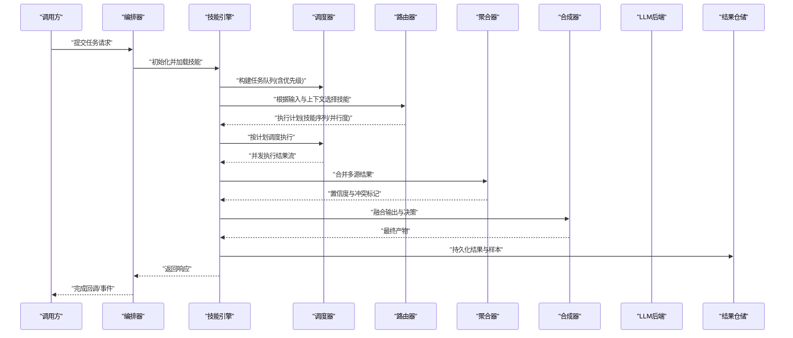

**图表来源** 
- [src/agent/orchestrator.py](file://src/agent/orchestrator.py)
- [src/agent/skills/engine.py](file://src/agent/skills/engine.py)
- [src/agent/skills/scheduler.py](file://src/agent/skills/scheduler.py)
- [src/agent/skills/router.py](file://src/agent/skills/router.py)
- [src/agent/skills/aggregator.py](file://src/agent/skills/aggregator.py)
- [src/agent/skills/synthesis.py](file://src/agent/skills/synthesis.py)
- [src/repositories/skill_opinion_outcome_repo.py](file://src/repositories/skill_opinion_outcome_repo.py)

## 详细组件分析

### 技能基类与默认能力
- 职责：定义技能标准接口（输入/输出/元数据）、生命周期钩子（初始化、预热、执行、清理）、错误模型与日志埋点。
- 设计要点：
  - 统一的输入验证与输出模式，保证下游聚合与合成的稳定性。
  - 可插拔的工具与环境注入，支持外部API、数据库与LLM调用。
  - 默认能力提供通用预处理、后处理与监控上报。

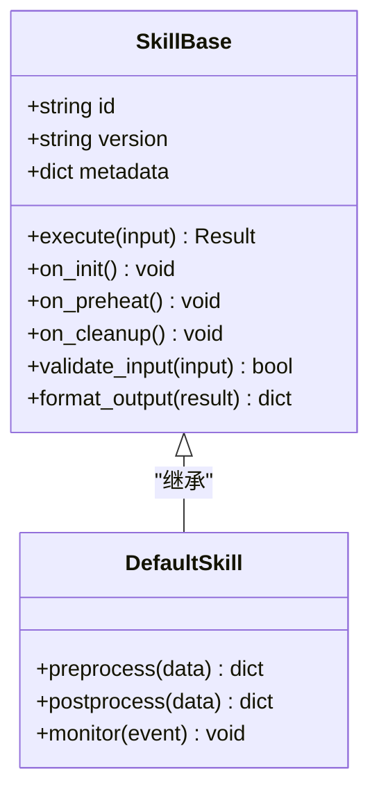

**图表来源** 
- [src/agent/skills/base.py](file://src/agent/skills/base.py)
- [src/agent/skills/defaults.py](file://src/agent/skills/defaults.py)

**章节来源**
- [src/agent/skills/base.py](file://src/agent/skills/base.py)
- [src/agent/skills/defaults.py](file://src/agent/skills/defaults.py)

### 技能引擎
- 职责：技能注册与发现、上下文管理、编排执行计划、协调各子模块、异常恢复与重试。
- 关键点：
  - 动态加载与热更新，支持运行时新增技能。
  - 上下文传播（用户会话、历史结果、配置快照）。
  - 与编排器、执行器、任务队列深度集成，保障端到端一致性。

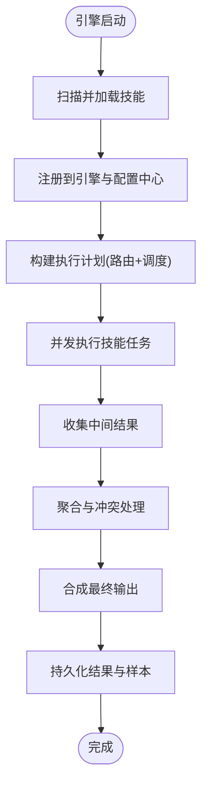

**图表来源** 
- [src/agent/skills/engine.py](file://src/agent/skills/engine.py)
- [src/agent/orchestrator.py](file://src/agent/orchestrator.py)
- [src/agent/executor.py](file://src/agent/executor.py)
- [src/services/task_queue.py](file://src/services/task_queue.py)

**章节来源**
- [src/agent/skills/engine.py](file://src/agent/skills/engine.py)
- [src/agent/orchestrator.py](file://src/agent/orchestrator.py)
- [src/agent/executor.py](file://src/agent/executor.py)
- [src/services/task_queue.py](file://src/services/task_queue.py)

### 调度器（优先级、资源与并发）
- 职责：基于优先级队列进行任务排程，管理资源配额与并发上限，支持限流、退避与熔断。
- 算法要点：
  - 优先级排序：按业务重要性、SLA、历史成功率与当前负载动态调整。
  - 资源分配：CPU/内存/IO配额与池化管理，避免热点技能抢占资源。
  - 并发控制：令牌桶或信号量限制并发度，支持背压与优雅降级。

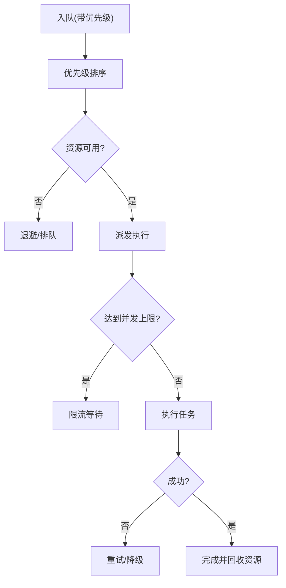

**图表来源** 
- [src/agent/skills/scheduler.py](file://src/agent/skills/scheduler.py)
- [src/services/task_queue.py](file://src/services/task_queue.py)

**章节来源**
- [src/agent/skills/scheduler.py](file://src/agent/skills/scheduler.py)
- [src/services/task_queue.py](file://src/services/task_queue.py)

### 路由器（技能选择与参数优化）
- 职责：根据输入特征、上下文与历史表现选择最合适的技能，并优化参数以提升效果。
- 机制：
  - 特征提取：从输入与上下文抽取维度（领域、复杂度、时效性等）。
  - 评分模型：基于规则与学习模型的混合评分，考虑成本、延迟与准确率。
  - 参数优化：通过网格搜索或贝叶斯优化调整超参，支持在线更新。

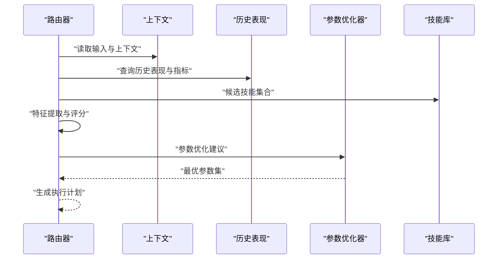

**图表来源** 
- [src/agent/skills/router.py](file://src/agent/skills/router.py)

**章节来源**
- [src/agent/skills/router.py](file://src/agent/skills/router.py)

### 聚合器（结果整合、冲突解决与置信度）
- 职责：合并多技能输出，处理冲突与缺失，计算综合置信度，输出稳定结果。
- 策略：
  - 结果整合：对齐时间戳、字段映射与单位转换。
  - 冲突解决：多数投票、加权平均、专家裁决或协商再评估。
  - 置信度计算：基于方差、覆盖率、历史准确率与不确定性估计。

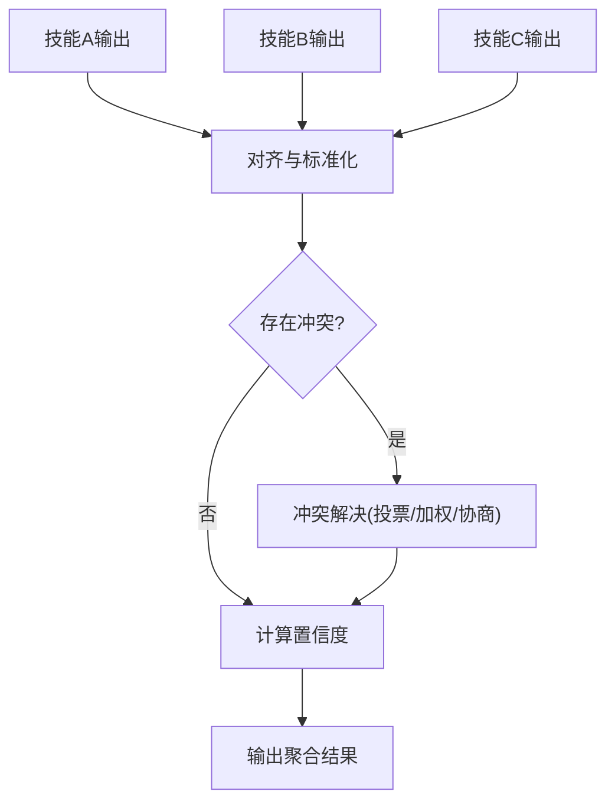

**图表来源** 
- [src/agent/skills/aggregator.py](file://src/agent/skills/aggregator.py)

**章节来源**
- [src/agent/skills/aggregator.py](file://src/agent/skills/aggregator.py)

### 合成器（智能路由与结果反馈）
- 职责：将聚合后的结果转化为最终决策或报告，支持反馈学习与持续优化。
- 机制：
  - 智能路由：根据目标场景选择合成策略（摘要、对比、归因）。
  - 参数优化：动态调整权重与阈值，适应不同市场阶段。
  - 结果反馈：记录偏差与误差，驱动后续路由与聚合改进。

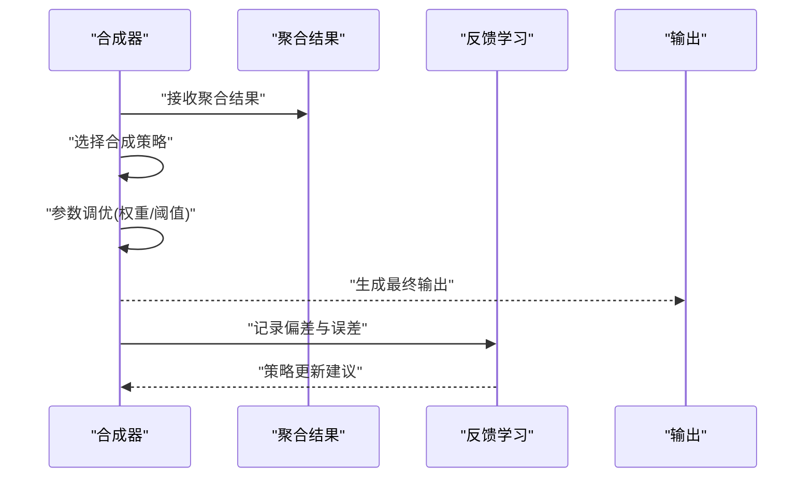

**图表来源** 
- [src/agent/skills/synthesis.py](file://src/agent/skills/synthesis.py)

**章节来源**
- [src/agent/skills/synthesis.py](file://src/agent/skills/synthesis.py)

### 协商模块（分歧处理与再评估）
- 职责：当技能间出现显著分歧时，触发辩论与再评估，提升鲁棒性与可解释性。
- 流程：
  - 分歧检测：基于置信度差异、结果距离与不确定性阈值。
  - 辩论机制：引入专家技能或外部证据进行交叉验证。
  - 再评估：重新执行关键技能或调整参数，直至收敛。

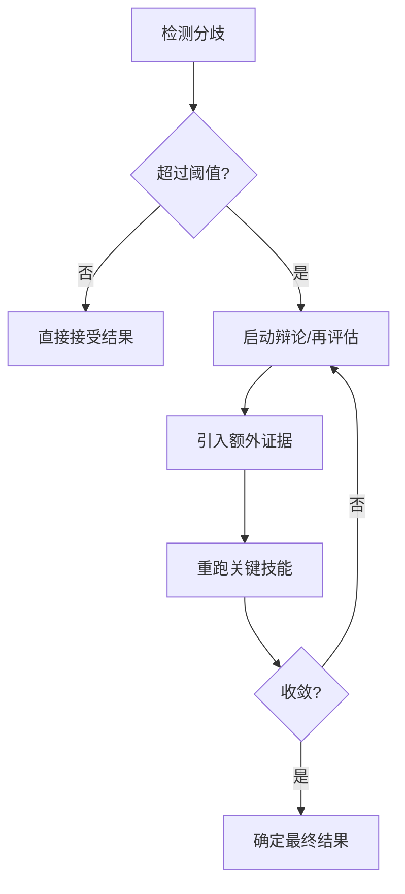

**图表来源** 
- [src/agent/skills/deliberation.py](file://src/agent/skills/deliberation.py)

**章节来源**
- [src/agent/skills/deliberation.py](file://src/agent/skills/deliberation.py)

### 技能代理（执行环境与隔离）
- 职责：封装单个技能的执行环境，管理工具调用、依赖注入与资源隔离。
- 特性：
  - 沙箱化执行，防止副作用扩散。
  - 工具注册与权限控制，按需暴露能力。
  - 生命周期管理，支持预热与清理。

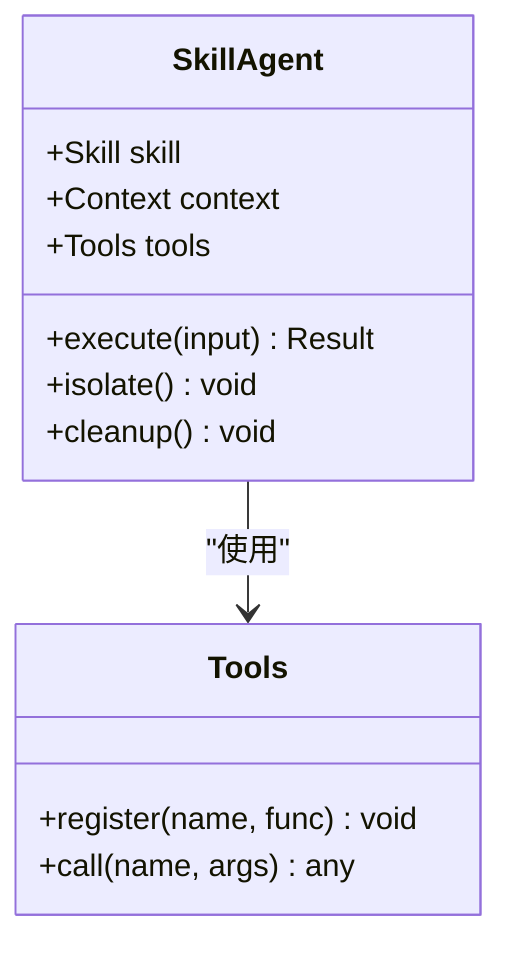

**图表来源** 
- [src/agent/skills/skill_agent.py](file://src/agent/skills/skill_agent.py)

**章节来源**
- [src/agent/skills/skill_agent.py](file://src/agent/skills/skill_agent.py)

## 依赖关系分析
技能框架依赖配置管理、LLM后端与数据服务，形成松耦合、高内聚的模块化结构。

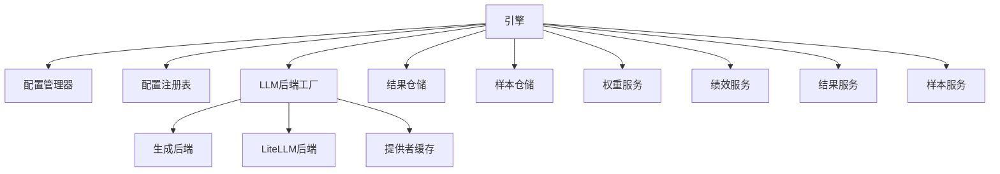

**图表来源** 
- [src/agent/skills/engine.py](file://src/agent/skills/engine.py)
- [src/core/config_manager.py](file://src/core/config_manager.py)
- [src/core/config_registry.py](file://src/core/config_registry.py)
- [src/llm/backend_factory.py](file://src/llm/backend_factory.py)
- [src/llm/generation_backend.py](file://src/llm/generation_backend.py)
- [src/llm/litellm_backend.py](file://src/llm/litellm_backend.py)
- [src/llm/provider_cache.py](file://src/llm/provider_cache.py)
- [src/repositories/skill_opinion_outcome_repo.py](file://src/repositories/skill_opinion_outcome_repo.py)
- [src/repositories/skill_opinion_sample_repo.py](file://src/repositories/skill_opinion_sample_repo.py)
- [src/services/skill_opinion_weight_service.py](file://src/services/skill_opinion_weight_service.py)
- [src/services/skill_opinion_performance_service.py](file://src/services/skill_opinion_performance_service.py)
- [src/services/skill_opinion_outcome_service.py](file://src/services/skill_opinion_outcome_service.py)
- [src/services/skill_opinion_sample_service.py](file://src/services/skill_opinion_sample_service.py)

**章节来源**
- [src/agent/skills/engine.py](file://src/agent/skills/engine.py)
- [src/core/config_manager.py](file://src/core/config_manager.py)
- [src/core/config_registry.py](file://src/core/config_registry.py)
- [src/llm/backend_factory.py](file://src/llm/backend_factory.py)
- [src/llm/generation_backend.py](file://src/llm/generation_backend.py)
- [src/llm/litellm_backend.py](file://src/llm/litellm_backend.py)
- [src/llm/provider_cache.py](file://src/llm/provider_cache.py)
- [src/repositories/skill_opinion_outcome_repo.py](file://src/repositories/skill_opinion_outcome_repo.py)
- [src/repositories/skill_opinion_sample_repo.py](file://src/repositories/skill_opinion_sample_repo.py)
- [src/services/skill_opinion_weight_service.py](file://src/services/skill_opinion_weight_service.py)
- [src/services/skill_opinion_performance_service.py](file://src/services/skill_opinion_performance_service.py)
- [src/services/skill_opinion_outcome_service.py](file://src/services/skill_opinion_outcome_service.py)
- [src/services/skill_opinion_sample_service.py](file://src/services/skill_opinion_sample_service.py)

## 性能考量
- 调度与并发：采用优先级队列与令牌桶限流，避免热点技能导致拥塞；支持背压与优雅降级。
- 资源隔离：技能代理沙箱化执行，限制CPU/内存/IO使用，防止相互干扰。
- 缓存与复用：LLM提供者缓存减少重复请求；技能预热降低冷启动开销。
- 批处理与流式：聚合与合成支持批量处理与流式传输，降低内存峰值。
- 监控与可观测：全链路日志与指标上报，便于定位瓶颈与异常。

[本节为通用指导，不直接分析具体文件]

## 故障排查指南
- 技能加载失败：检查技能路径、依赖与版本兼容性；查看加载警告与错误日志。
- 调度超时：调整优先级与并发上限；检查资源配额与限流策略。
- 路由失效：验证特征提取与评分模型；检查历史表现数据完整性。
- 聚合冲突：审查字段对齐与单位转换；启用协商模块进行再评估。
- LLM调用失败：检查后端配置与网络连通性；利用提供者缓存与重试策略。
- 结果不一致：核对置信度计算与权重设置；查看样本与结果仓储的一致性。

**章节来源**
- [tests/test_skill_load_warning.py](file://tests/test_skill_load_warning.py)
- [tests/test_strategy_deliberation.py](file://tests/test_strategy_deliberation.py)

## 结论
技能框架通过清晰的模块划分与严格的接口契约，实现了高内聚、低耦合的可扩展架构。引擎作为中枢协调调度、路由、聚合、合成与协商，配合配置管理与LLM后端，形成稳健的执行体系。调度器保障高效并发与资源利用，聚合器与合成器提升结果质量与可解释性。开发者可通过标准接口快速构建复杂技能链，并利用反馈学习持续优化系统性能。

[本节为总结性内容，不直接分析具体文件]

## 附录：技能开发指南与示例
- 技能接口规范：
  - 继承基类，实现 execute 方法与生命周期钩子。
  - 定义输入验证与输出格式化，确保类型一致。
  - 注册元数据（id、version、metadata）以便引擎发现。
- 配置格式：
  - 在配置注册表中声明技能路径、依赖与参数模板。
  - 使用默认配置快速启动，逐步替换为自定义配置。
- 调试技巧：
  - 启用详细日志与指标上报，观察执行路径与耗时。
  - 使用单元测试模拟外部依赖，验证边界条件。
  - 利用协商模块与结果仓储追踪分歧与偏差。
- 创建复杂技能链：
  - 通过路由器组合多个技能，形成串行或并行流水线。
  - 使用聚合器合并中间结果，合成器生成最终输出。
  - 借助任务队列与调度器优化并发与资源分配。
- 自定义技能逻辑：
  - 在技能代理中注入工具与上下文，实现定制化逻辑。
  - 通过权重服务与绩效服务调整技能影响与优先级。
  - 利用样本服务与结果服务进行离线分析与在线学习。

[本节为实践指导，不直接分析具体文件]