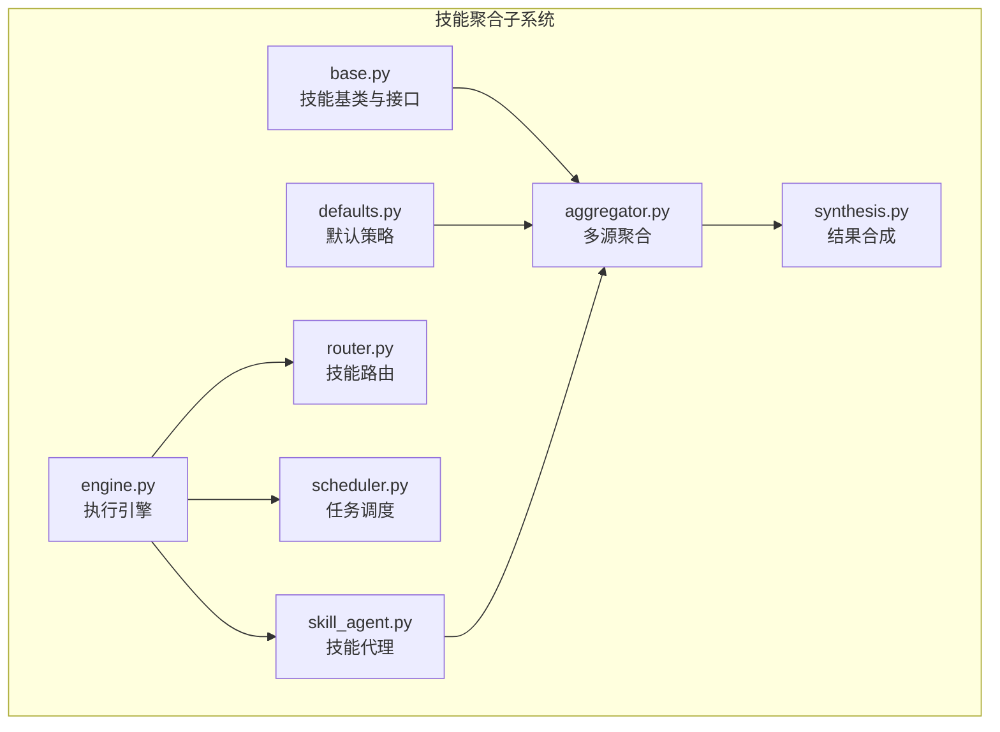
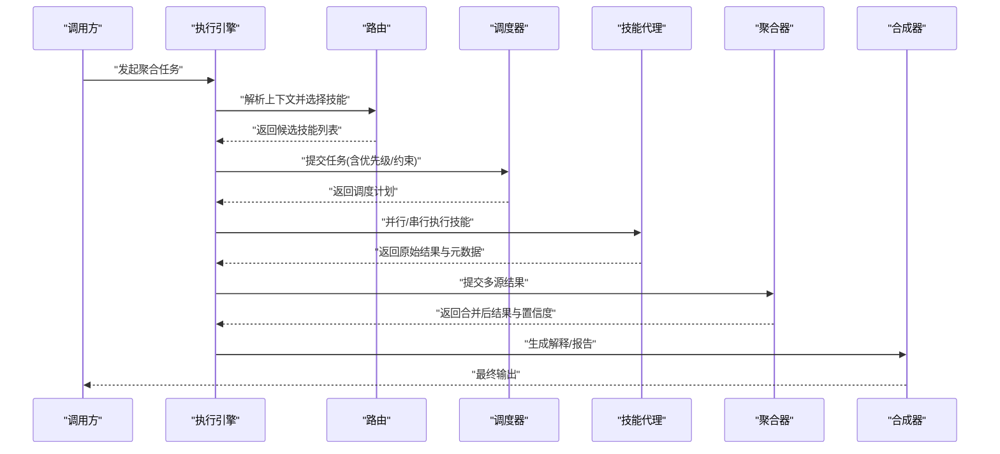
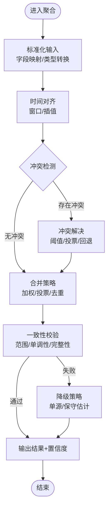
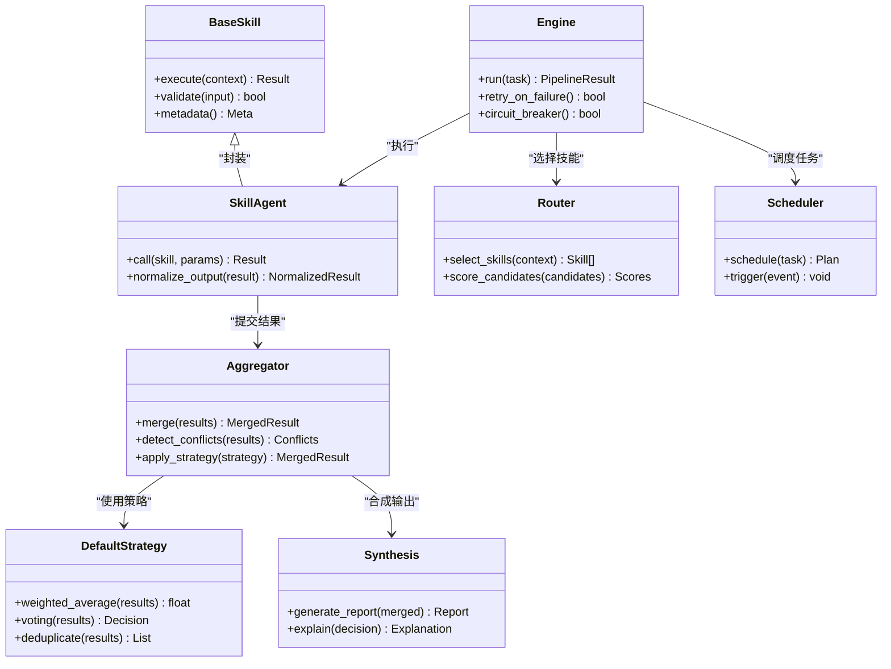

# 技能聚合器

<cite>
**本文档引用的文件**   
- [src/agent/skills/aggregator.py](file://src/agent/skills/aggregator.py)
- [src/agent/skills/base.py](file://src/agent/skills/base.py)
- [src/agent/skills/defaults.py](file://src/agent/skills/defaults.py)
- [src/agent/skills/engine.py](file://src/agent/skills/engine.py)
- [src/agent/skills/router.py](file://src/agent/skills/router.py)
- [src/agent/skills/scheduler.py](file://src/agent/skills/scheduler.py)
- [src/agent/skills/skill_agent.py](file://src/agent/skills/skill_agent.py)
- [src/agent/skills/synthesis.py](file://src/agent/skills/synthesis.py)
- [src/core/skill_opinion_outcome_evaluator.py](file://src/core/skill_opinion_outcome_evaluator.py)
- [src/services/skill_opinion_weight_service.py](file://src/services/skill_opinion_weight_service.py)
- [src/services/skill_opinion_performance_service.py](file://src/services/skill_opinion_performance_service.py)
- [src/repositories/skill_opinion_outcome_repo.py](file://src/repositories/skill_opinion_outcome_repo.py)
- [src/repositories/skill_opinion_sample_repo.py](file://src/repositories/skill_opinion_sample_repo.py)
</cite>

## 目录
1. [简介](#简介)
2. [项目结构](#项目结构)
3. [核心组件](#核心组件)
4. [架构总览](#架构总览)
5. [详细组件分析](#详细组件分析)
6. [依赖关系分析](#依赖关系分析)
7. [性能考量](#性能考量)
8. [故障排查指南](#故障排查指南)
9. [结论](#结论)
10. [附录](#附录)

## 简介
本文件面向“技能聚合器”子系统，系统性阐述多源数据聚合的算法实现与工程落地。内容覆盖：
- 结果合并策略、冲突检测与一致性保证
- 不同数据源的适配机制（格式转换、时间对齐、精度处理）
- 置信度计算模型（权重分配、质量评估、不确定性量化）
- 增量更新机制（差异检测、部分刷新、缓存策略）
- 聚合规则配置（自定义合并函数、过滤条件、排序逻辑）
- 实际使用示例（复杂场景与数据质量问题处理）

## 项目结构
技能聚合器位于 agent/skills 子系统中，围绕“技能”这一抽象单元进行编排、路由、调度、执行与合成。关键目录与职责如下：
- skills/base.py：定义技能基类与通用接口契约
- skills/aggregator.py：多源结果聚合的核心实现
- skills/defaults.py：默认聚合策略与规则
- skills/engine.py：技能执行引擎，负责生命周期管理与资源协调
- skills/router.py：技能路由，按上下文选择合适技能
- skills/scheduler.py：任务调度，支持定时与事件驱动
- skills/skill_agent.py：技能代理，封装调用与结果归一化
- skills/synthesis.py：结果合成与解释生成

图表来源
- [src/agent/skills/base.py](file://src/agent/skills/base.py)
- [src/agent/skills/aggregator.py](file://src/agent/skills/aggregator.py)
- [src/agent/skills/defaults.py](file://src/agent/skills/defaults.py)
- [src/agent/skills/engine.py](file://src/agent/skills/engine.py)
- [src/agent/skills/router.py](file://src/agent/skills/router.py)
- [src/agent/skills/scheduler.py](file://src/agent/skills/scheduler.py)
- [src/agent/skills/skill_agent.py](file://src/agent/skills/skill_agent.py)
- [src/agent/skills/synthesis.py](file://src/agent/skills/synthesis.py)

章节来源
- [src/agent/skills/base.py](file://src/agent/skills/base.py)
- [src/agent/skills/aggregator.py](file://src/agent/skills/aggregator.py)
- [src/agent/skills/defaults.py](file://src/agent/skills/defaults.py)
- [src/agent/skills/engine.py](file://src/agent/skills/engine.py)
- [src/agent/skills/router.py](file://src/agent/skills/router.py)
- [src/agent/skills/scheduler.py](file://src/agent/skills/scheduler.py)
- [src/agent/skills/skill_agent.py](file://src/agent/skills/skill_agent.py)
- [src/agent/skills/synthesis.py](file://src/agent/skills/synthesis.py)

## 核心组件
- 技能基类与接口：统一输入输出契约、元数据与错误语义
- 聚合器：接收多源结果，执行合并、冲突检测、一致性校验
- 默认策略：内置常见合并模式（加权平均、投票、去重、时间窗口对齐等）
- 执行引擎：管理并发、重试、超时、熔断与资源回收
- 路由：基于上下文与能力匹配选择技能
- 调度：支持周期任务、事件触发与优先级队列
- 技能代理：对具体技能进行封装、参数标准化与结果归一化
- 合成器：将聚合结果转化为可解释的报告或决策信号

章节来源
- [src/agent/skills/base.py](file://src/agent/skills/base.py)
- [src/agent/skills/aggregator.py](file://src/agent/skills/aggregator.py)
- [src/agent/skills/defaults.py](file://src/agent/skills/defaults.py)
- [src/agent/skills/engine.py](file://src/agent/skills/engine.py)
- [src/agent/skills/router.py](file://src/agent/skills/router.py)
- [src/agent/skills/scheduler.py](file://src/agent/skills/scheduler.py)
- [src/agent/skills/skill_agent.py](file://src/agent/skills/skill_agent.py)
- [src/agent/skills/synthesis.py](file://src/agent/skills/synthesis.py)

## 架构总览
下图展示从请求到聚合结果的端到端流程，包括路由、调度、执行、聚合与合成。

图表来源
- [src/agent/skills/engine.py](file://src/agent/skills/engine.py)
- [src/agent/skills/router.py](file://src/agent/skills/router.py)
- [src/agent/skills/scheduler.py](file://src/agent/skills/scheduler.py)
- [src/agent/skills/skill_agent.py](file://src/agent/skills/skill_agent.py)
- [src/agent/skills/aggregator.py](file://src/agent/skills/aggregator.py)
- [src/agent/skills/synthesis.py](file://src/agent/skills/synthesis.py)

## 详细组件分析

### 聚合器（多源结果合并与冲突检测）
- 合并策略
  - 加权平均：按置信度或历史表现动态分配权重
  - 投票/多数决：适用于离散决策（如方向、评级）
  - 去重与融合：基于键空间（标的、时间戳、指标名）合并重复项
  - 时间窗口对齐：按最近可用时间或插值对齐
- 冲突检测
  - 数值偏差阈值：超过阈值标记为冲突
  - 符号/方向不一致：例如涨跌方向相反
  - 缺失与异常值：空值、NaN、极值检测
- 一致性保证
  - 幂等性：相同输入产生相同输出
  - 版本化：结果附带版本号与来源追踪
  - 回滚与快照：失败时恢复上一轮一致状态

图表来源
- [src/agent/skills/aggregator.py](file://src/agent/skills/aggregator.py)
- [src/agent/skills/defaults.py](file://src/agent/skills/defaults.py)

章节来源
- [src/agent/skills/aggregator.py](file://src/agent/skills/aggregator.py)
- [src/agent/skills/defaults.py](file://src/agent/skills/defaults.py)

### 数据源适配（格式转换、时间对齐、精度处理）
- 格式转换
  - 字段映射：不同源字段名到统一Schema
  - 类型转换：字符串/数值/布尔/枚举规范化
  - 单位换算：价格、成交量、百分比等
- 时间对齐
  - 时区统一：UTC本地化与交易日历对齐
  - 频率对齐：日线/分钟线/实时tick的采样与插值
  - 缺失填充：前向填充、线性插值、剔除
- 精度处理
  - 四舍五入与截断策略
  - 浮点误差容忍区间
  - 精度衰减与保留位数控制

章节来源
- [src/agent/skills/skill_agent.py](file://src/agent/skills/skill_agent.py)
- [src/agent/skills/aggregator.py](file://src/agent/skills/aggregator.py)

### 置信度计算模型（权重分配、质量评估、不确定性量化）
- 权重分配
  - 静态权重：基于专家经验或预设策略
  - 动态权重：根据近期准确率、延迟、稳定性自适应调整
  - 来源信誉：长期表现与声誉累积
- 质量评估
  - 数据新鲜度：时间戳差值与过期阈值
  - 覆盖率：有效样本比例与缺失率
  - 波动性：方差、分位数、极端值占比
- 不确定性量化
  - 置信区间：基于历史误差分布
  - 熵/信息量：用于衡量分歧程度
  - 鲁棒性测试：扰动敏感性分析

章节来源
- [src/core/skill_opinion_outcome_evaluator.py](file://src/core/skill_opinion_outcome_evaluator.py)
- [src/services/skill_opinion_weight_service.py](file://src/services/skill_opinion_weight_service.py)
- [src/services/skill_opinion_performance_service.py](file://src/services/skill_opinion_performance_service.py)

### 增量更新机制（差异检测、部分刷新、缓存策略）
- 差异检测
  - 哈希/指纹：对输入快照做快速比对
  - 变更集：仅记录新增、修改、删除
- 部分刷新
  - 按需更新：只重算受影响的结果
  - 级联更新：下游依赖自动刷新
- 缓存策略
  - 多级缓存：内存/磁盘/远端
  - TTL与失效：基于时间与版本
  - 预取与预热：预测热点数据提前加载

章节来源
- [src/agent/skills/scheduler.py](file://src/agent/skills/scheduler.py)
- [src/agent/skills/engine.py](file://src/agent/skills/engine.py)

### 聚合规则配置（自定义合并函数、过滤条件、排序逻辑）
- 自定义合并函数
  - 插件式注册：运行时注入合并策略
  - 声明式配置：YAML/JSON描述合并规则
- 过滤条件
  - 阈值过滤：置信度、波动率、缺失率
  - 白名单/黑名单：来源、标的、时间窗
- 排序逻辑
  - 多维排序：置信度、时效性、相关性
  - 稳定排序：保证相同分数下的确定性顺序

章节来源
- [src/agent/skills/defaults.py](file://src/agent/skills/defaults.py)
- [src/agent/skills/aggregator.py](file://src/agent/skills/aggregator.py)

### 执行引擎与路由、调度、代理、合成
- 执行引擎
  - 并发控制：线程/进程池、限流、背压
  - 容错：重试、熔断、超时、降级
  - 观测：指标、日志、链路追踪
- 路由
  - 能力匹配：按技能标签与上下文选择
  - 负载均衡：避免热点过载
- 调度
  - 周期任务：cron-like 表达式
  - 事件驱动：外部事件触发
  - 优先级队列：高优任务抢占
- 技能代理
  - 参数标准化：统一输入格式
  - 结果归一化：统一输出Schema
  - 元数据采集：耗时、错误码、来源
- 合成
  - 结构化输出：报告、信号、摘要
  - 可解释性：依据、证据、不确定性

章节来源
- [src/agent/skills/engine.py](file://src/agent/skills/engine.py)
- [src/agent/skills/router.py](file://src/agent/skills/router.py)
- [src/agent/skills/scheduler.py](file://src/agent/skills/scheduler.py)
- [src/agent/skills/skill_agent.py](file://src/agent/skills/skill_agent.py)
- [src/agent/skills/synthesis.py](file://src/agent/skills/synthesis.py)

## 依赖关系分析
技能聚合子系统内部依赖清晰，外部依赖通过服务与仓库层解耦。

图表来源
- [src/agent/skills/base.py](file://src/agent/skills/base.py)
- [src/agent/skills/skill_agent.py](file://src/agent/skills/skill_agent.py)
- [src/agent/skills/aggregator.py](file://src/agent/skills/aggregator.py)
- [src/agent/skills/defaults.py](file://src/agent/skills/defaults.py)
- [src/agent/skills/engine.py](file://src/agent/skills/engine.py)
- [src/agent/skills/router.py](file://src/agent/skills/router.py)
- [src/agent/skills/scheduler.py](file://src/agent/skills/scheduler.py)
- [src/agent/skills/synthesis.py](file://src/agent/skills/synthesis.py)

章节来源
- [src/agent/skills/base.py](file://src/agent/skills/base.py)
- [src/agent/skills/skill_agent.py](file://src/agent/skills/skill_agent.py)
- [src/agent/skills/aggregator.py](file://src/agent/skills/aggregator.py)
- [src/agent/skills/defaults.py](file://src/agent/skills/defaults.py)
- [src/agent/skills/engine.py](file://src/agent/skills/engine.py)
- [src/agent/skills/router.py](file://src/agent/skills/router.py)
- [src/agent/skills/scheduler.py](file://src/agent/skills/scheduler.py)
- [src/agent/skills/synthesis.py](file://src/agent/skills/synthesis.py)

## 性能考量
- 并发与吞吐
  - 合理设置并发度，避免I/O阻塞
  - 使用连接池与批量请求
- 缓存命中
  - 热点数据优先缓存，TTL精细化
  - 预取与懒加载结合
- 内存与GC
  - 大对象及时释放，避免碎片
  - 使用生成器与流式处理
- 监控与告警
  - 关键路径埋点，延迟与错误率监控
  - 容量规划与弹性伸缩

[本节为通用指导，不直接分析具体文件]

## 故障排查指南
- 常见问题
  - 数据源不可用：检查网络、鉴权、限流
  - 时间戳不一致：核对时区与交易日历
  - 冲突频繁：调优阈值与投票策略
  - 置信度漂移：检查权重更新与质量评估
- 定位方法
  - 查看链路追踪与日志
  - 对比输入快照与输出差异
  - 回放历史任务复现问题
- 恢复策略
  - 启用降级与回滚
  - 隔离故障源，逐步恢复
  - 补充缺失数据与修复Schema

章节来源
- [src/agent/skills/engine.py](file://src/agent/skills/engine.py)
- [src/agent/skills/aggregator.py](file://src/agent/skills/aggregator.py)
- [src/core/skill_opinion_outcome_evaluator.py](file://src/core/skill_opinion_outcome_evaluator.py)

## 结论
技能聚合器通过标准化的接口、灵活的策略与稳健的工程实现，解决了多源数据聚合中的合并、冲突、一致性与不确定性等核心问题。配合增量更新与缓存策略，可在保证准确性的同时提升性能与可用性。建议在生产环境中持续监控与优化权重与策略，确保系统长期稳定运行。

[本节为总结性内容，不直接分析具体文件]

## 附录
- 配置示例要点
  - 合并策略：选择加权平均或投票，并设置权重更新周期
  - 过滤条件：设置置信度阈值与时间窗
  - 排序逻辑：按置信度与时效性组合排序
- 使用示例思路
  - 多源技术指标聚合：对齐时间、处理缺失、冲突投票
  - 新闻情感聚合：去重、主题聚类、置信度校准
  - 风险信号聚合：方向一致性检查、阈值报警、降级策略

[本节为概念性说明，不直接分析具体文件]