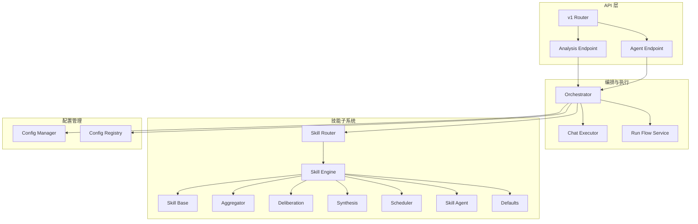
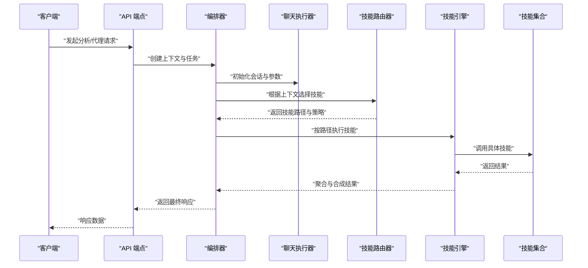
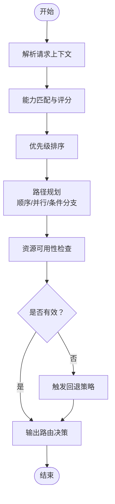
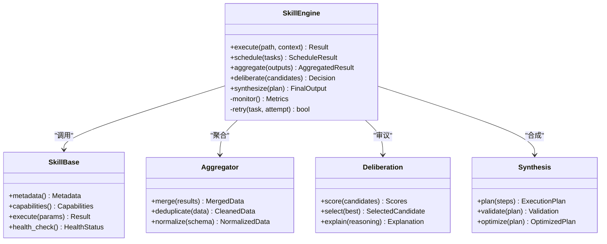
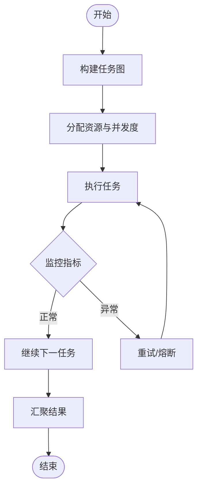
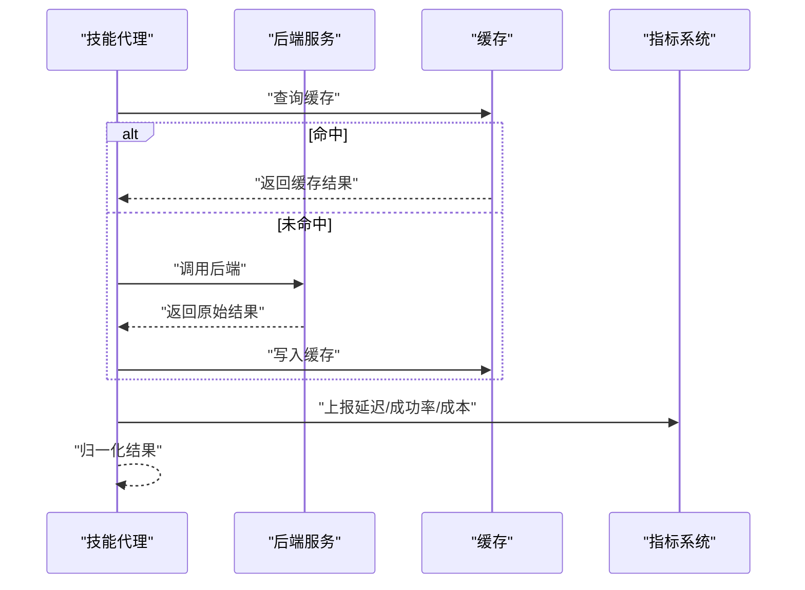
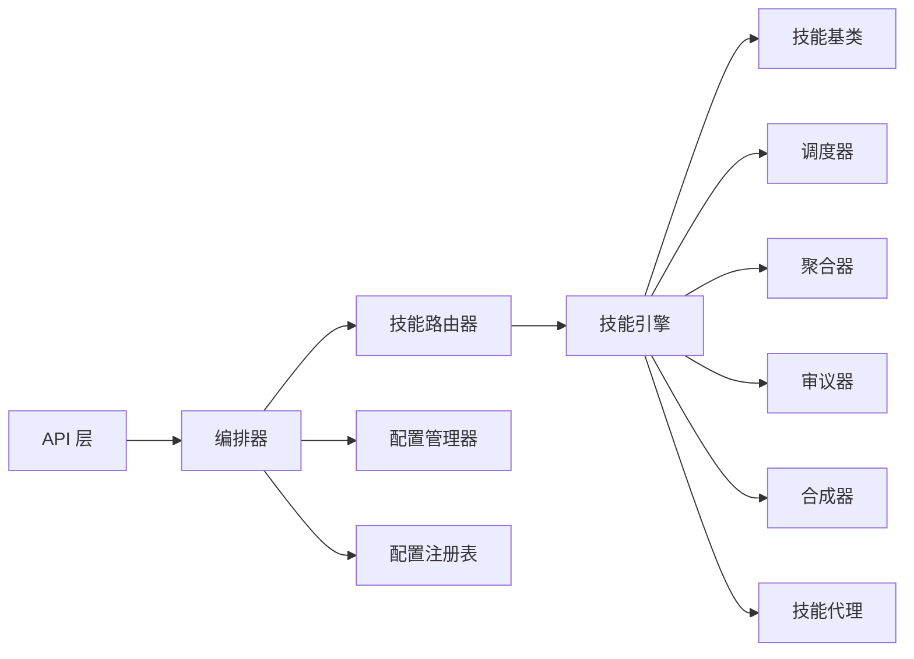

# 技能路由器

<cite>
**本文引用的文件**   
- [src/agent/skills/router.py](file://src/agent/skills/router.py)
- [src/agent/skills/engine.py](file://src/agent/skills/engine.py)
- [src/agent/skills/base.py](file://src/agent/skills/base.py)
- [src/agent/skills/aggregator.py](file://src/agent/skills/aggregator.py)
- [src/agent/skills/deliberation.py](file://src/agent/skills/deliberation.py)
- [src/agent/skills/synthesis.py](file://src/agent/skills/synthesis.py)
- [src/agent/skills/scheduler.py](file://src/agent/skills/scheduler.py)
- [src/agent/skills/skill_agent.py](file://src/agent/skills/skill_agent.py)
- [src/agent/skills/defaults.py](file://src/agent/skills/defaults.py)
- [src/agent/orchestrator.py](file://src/agent/orchestrator.py)
- [src/agent/chat_executor.py](file://src/agent/chat_executor.py)
- [src/services/run_flow.py](file://src/services/run_flow.py)
- [api/v1/endpoints/analysis.py](file://api/v1/endpoints/analysis.py)
- [api/v1/endpoints/agent.py](file://api/v1/endpoints/agent.py)
- [api/v1/router.py](file://api/v1/router.py)
- [src/core/config_manager.py](file://src/core/config_manager.py)
- [src/core/config_registry.py](file://src/core/config_registry.py)
</cite>

## 目录
1. [简介](#简介)
2. [项目结构](#项目结构)
3. [核心组件](#核心组件)
4. [架构总览](#架构总览)
5. [详细组件分析](#详细组件分析)
6. [依赖关系分析](#依赖关系分析)
7. [性能考量](#性能考量)
8. [故障排查指南](#故障排查指南)
9. [结论](#结论)
10. [附录](#附录)

## 简介
本文件围绕“技能路由器”进行系统化文档化，聚焦智能路由的核心算法与工程实现。内容涵盖：
- 技能选择策略、路径规划与负载均衡机制
- 路由决策依据：能力匹配、性能评估、资源可用性检查
- 动态路由：实时状态监控、故障转移、弹性扩展
- 路由优化：历史数据分析、预测性路由、成本优化
- 路由规则配置：条件判断、优先级设置、回退机制
- 实际应用示例：构建高效可靠的路由系统

## 项目结构
技能路由器位于 agent 子系统的 skills 模块中，并与 orchestrator、chat_executor、run_flow 等编排与执行层协同工作；API 层通过 v1 router 暴露相关接口。

**图表来源** 
- [api/v1/router.py](file://api/v1/router.py)
- [api/v1/endpoints/analysis.py](file://api/v1/endpoints/analysis.py)
- [api/v1/endpoints/agent.py](file://api/v1/endpoints/agent.py)
- [src/agent/orchestrator.py](file://src/agent/orchestrator.py)
- [src/agent/chat_executor.py](file://src/agent/chat_executor.py)
- [src/services/run_flow.py](file://src/services/run_flow.py)
- [src/agent/skills/router.py](file://src/agent/skills/router.py)
- [src/agent/skills/engine.py](file://src/agent/skills/engine.py)
- [src/agent/skills/base.py](file://src/agent/skills/base.py)
- [src/agent/skills/aggregator.py](file://src/agent/skills/aggregator.py)
- [src/agent/skills/deliberation.py](file://src/agent/skills/deliberation.py)
- [src/agent/skills/synthesis.py](file://src/agent/skills/synthesis.py)
- [src/agent/skills/scheduler.py](file://src/agent/skills/scheduler.py)
- [src/agent/skills/skill_agent.py](file://src/agent/skills/skill_agent.py)
- [src/agent/skills/defaults.py](file://src/agent/skills/defaults.py)
- [src/core/config_manager.py](file://src/core/config_manager.py)
- [src/core/config_registry.py](file://src/core/config_registry.py)

**章节来源**
- [api/v1/router.py](file://api/v1/router.py)
- [api/v1/endpoints/analysis.py](file://api/v1/endpoints/analysis.py)
- [api/v1/endpoints/agent.py](file://api/v1/endpoints/agent.py)
- [src/agent/orchestrator.py](file://src/agent/orchestrator.py)
- [src/agent/chat_executor.py](file://src/agent/chat_executor.py)
- [src/services/run_flow.py](file://src/services/run_flow.py)
- [src/agent/skills/router.py](file://src/agent/skills/router.py)
- [src/agent/skills/engine.py](file://src/agent/skills/engine.py)
- [src/agent/skills/base.py](file://src/agent/skills/base.py)
- [src/agent/skills/aggregator.py](file://src/agent/skills/aggregator.py)
- [src/agent/skills/deliberation.py](file://src/agent/skills/deliberation.py)
- [src/agent/skills/synthesis.py](file://src/agent/skills/synthesis.py)
- [src/agent/skills/scheduler.py](file://src/agent/skills/scheduler.py)
- [src/agent/skills/skill_agent.py](file://src/agent/skills/skill_agent.py)
- [src/agent/skills/defaults.py](file://src/agent/skills/defaults.py)
- [src/core/config_manager.py](file://src/core/config_manager.py)
- [src/core/config_registry.py](file://src/core/config_registry.py)

## 核心组件
- 技能路由器（Skill Router）：负责基于请求上下文与策略选择最合适的技能或技能组合，并生成执行路径。
- 技能引擎（Skill Engine）：协调技能生命周期、调度、聚合、审议与合成，驱动具体执行。
- 技能基类（Skill Base）：定义技能契约、元数据、能力声明与执行接口。
- 聚合器（Aggregator）：合并多技能输出，形成统一结果。
- 审议器（Deliberation）：对候选方案进行权衡与决策。
- 合成器（Synthesis）：将审议结果转化为最终可执行的计划或响应。
- 调度器（Scheduler）：控制并发、顺序、重试与超时。
- 技能代理（Skill Agent）：封装外部工具调用、资源访问与错误处理。
- 默认策略（Defaults）：提供默认路由策略与回退逻辑。

**章节来源**
- [src/agent/skills/router.py](file://src/agent/skills/router.py)
- [src/agent/skills/engine.py](file://src/agent/skills/engine.py)
- [src/agent/skills/base.py](file://src/agent/skills/base.py)
- [src/agent/skills/aggregator.py](file://src/agent/skills/aggregator.py)
- [src/agent/skills/deliberation.py](file://src/agent/skills/deliberation.py)
- [src/agent/skills/synthesis.py](file://src/agent/skills/synthesis.py)
- [src/agent/skills/scheduler.py](file://src/agent/skills/scheduler.py)
- [src/agent/skills/skill_agent.py](file://src/agent/skills/skill_agent.py)
- [src/agent/skills/defaults.py](file://src/agent/skills/defaults.py)

## 架构总览
技能路由器在整体系统中承担“意图解析—能力匹配—路径规划—执行编排”的关键职责。上层 API 接收用户请求后，交由编排层（Orchestrator）与聊天执行器（ChatExecutor）进行上下文准备与任务分发；随后进入技能子系统，由路由器决定使用哪些技能以及执行顺序，并由引擎协调调度、聚合与合成。

**图表来源** 
- [api/v1/endpoints/analysis.py](file://api/v1/endpoints/analysis.py)
- [api/v1/endpoints/agent.py](file://api/v1/endpoints/agent.py)
- [src/agent/orchestrator.py](file://src/agent/orchestrator.py)
- [src/agent/chat_executor.py](file://src/agent/chat_executor.py)
- [src/agent/skills/router.py](file://src/agent/skills/router.py)
- [src/agent/skills/engine.py](file://src/agent/skills/engine.py)

## 详细组件分析

### 技能路由器（Skill Router）
- 功能要点
  - 基于输入上下文（领域、市场阶段、数据类型、工具需求）进行能力匹配
  - 结合策略权重与优先级，生成候选技能集与执行路径
  - 支持条件判断与回退机制，确保鲁棒性
  - 集成性能评估与资源可用性检查，避免过载与失败
- 关键流程
  - 解析请求上下文
  - 检索可用技能与能力声明
  - 计算匹配分数与优先级排序
  - 生成路径规划（顺序/并行/条件分支）
  - 输出路由决策与策略元数据

**图表来源** 
- [src/agent/skills/router.py](file://src/agent/skills/router.py)
- [src/agent/skills/base.py](file://src/agent/skills/base.py)

**章节来源**
- [src/agent/skills/router.py](file://src/agent/skills/router.py)
- [src/agent/skills/base.py](file://src/agent/skills/base.py)

### 技能引擎（Skill Engine）
- 功能要点
  - 协调技能生命周期：加载、预热、执行、回收
  - 调度并发与顺序，管理超时与重试
  - 聚合多技能输出，进行审议与合成
  - 维护运行时状态与指标（延迟、成功率、成本）
- 关键流程
  - 接收路由决策
  - 实例化与校验技能
  - 按路径执行并收集中间结果
  - 聚合与审议，生成最终计划
  - 记录指标与日志

**图表来源** 
- [src/agent/skills/engine.py](file://src/agent/skills/engine.py)
- [src/agent/skills/base.py](file://src/agent/skills/base.py)
- [src/agent/skills/aggregator.py](file://src/agent/skills/aggregator.py)
- [src/agent/skills/deliberation.py](file://src/agent/skills/deliberation.py)
- [src/agent/skills/synthesis.py](file://src/agent/skills/synthesis.py)

**章节来源**
- [src/agent/skills/engine.py](file://src/agent/skills/engine.py)
- [src/agent/skills/aggregator.py](file://src/agent/skills/aggregator.py)
- [src/agent/skills/deliberation.py](file://src/agent/skills/deliberation.py)
- [src/agent/skills/synthesis.py](file://src/agent/skills/synthesis.py)

### 调度器（Scheduler）
- 功能要点
  - 支持串行、并行、扇出/汇聚模式
  - 管理任务队列、优先级与抢占
  - 实现超时、重试与熔断
  - 监控负载与背压，防止雪崩
- 关键流程
  - 解析执行路径为任务图
  - 分配资源与并发度
  - 执行与监控，异常恢复
  - 输出执行结果与指标

**图表来源** 
- [src/agent/skills/scheduler.py](file://src/agent/skills/scheduler.py)

**章节来源**
- [src/agent/skills/scheduler.py](file://src/agent/skills/scheduler.py)

### 技能代理（Skill Agent）
- 功能要点
  - 封装外部工具调用（数据源、模型、服务）
  - 统一错误处理与重试策略
  - 缓存热点数据，降低延迟与成本
  - 上报健康状态与使用量
- 关键流程
  - 解析调用参数
  - 选择后端与路由
  - 执行与结果归一化
  - 缓存与统计

**图表来源** 
- [src/agent/skills/skill_agent.py](file://src/agent/skills/skill_agent.py)

**章节来源**
- [src/agent/skills/skill_agent.py](file://src/agent/skills/skill_agent.py)

### 默认策略（Defaults）
- 功能要点
  - 提供默认路由策略与回退链
  - 定义通用能力映射与优先级模板
  - 简化配置，快速启动
- 关键流程
  - 加载默认策略
  - 覆盖用户配置
  - 输出稳定路径

**章节来源**
- [src/agent/skills/defaults.py](file://src/agent/skills/defaults.py)

### 编排与执行（Orchestrator & ChatExecutor）
- 编排器（Orchestrator）
  - 管理会话上下文、任务生命周期
  - 协调技能路由器与引擎
  - 处理事件流与状态同步
- 聊天执行器（ChatExecutor）
  - 解析用户输入与指令
  - 构造技能执行参数
  - 流式输出与中断处理

**章节来源**
- [src/agent/orchestrator.py](file://src/agent/orchestrator.py)
- [src/agent/chat_executor.py](file://src/agent/chat_executor.py)

### 运行流服务（Run Flow）
- 功能要点
  - 定义端到端执行流程
  - 串联多个步骤与技能
  - 提供可插拔的阶段与钩子
- 关键流程
  - 初始化流程上下文
  - 按阶段执行
  - 汇总结果与报告

**章节来源**
- [src/services/run_flow.py](file://src/services/run_flow.py)

### API 层（Endpoints & Router）
- 端点（Analysis/Agent）
  - 接收请求，校验参数
  - 调用编排器与执行器
  - 返回结构化响应
- 路由器（v1 Router）
  - 注册路由与中间件
  - 统一错误处理与鉴权

**章节来源**
- [api/v1/endpoints/analysis.py](file://api/v1/endpoints/analysis.py)
- [api/v1/endpoints/agent.py](file://api/v1/endpoints/agent.py)
- [api/v1/router.py](file://api/v1/router.py)

### 配置管理（Config Manager & Registry）
- 配置管理器（Config Manager）
  - 加载与合并配置
  - 环境变量与配置文件支持
  - 热更新与校验
- 配置注册表（Config Registry）
  - 注册路由策略与规则
  - 版本管理与兼容性

**章节来源**
- [src/core/config_manager.py](file://src/core/config_manager.py)
- [src/core/config_registry.py](file://src/core/config_registry.py)

## 依赖关系分析
技能路由器依赖技能基类定义的能力契约，并通过引擎协调调度、聚合、审议与合成。编排层与 API 层作为入口，驱动整个流程。配置管理提供策略与规则支撑。

**图表来源** 
- [api/v1/router.py](file://api/v1/router.py)
- [src/agent/orchestrator.py](file://src/agent/orchestrator.py)
- [src/agent/skills/router.py](file://src/agent/skills/router.py)
- [src/agent/skills/engine.py](file://src/agent/skills/engine.py)
- [src/agent/skills/base.py](file://src/agent/skills/base.py)
- [src/agent/skills/scheduler.py](file://src/agent/skills/scheduler.py)
- [src/agent/skills/aggregator.py](file://src/agent/skills/aggregator.py)
- [src/agent/skills/deliberation.py](file://src/agent/skills/deliberation.py)
- [src/agent/skills/synthesis.py](file://src/agent/skills/synthesis.py)
- [src/agent/skills/skill_agent.py](file://src/agent/skills/skill_agent.py)
- [src/core/config_manager.py](file://src/core/config_manager.py)
- [src/core/config_registry.py](file://src/core/config_registry.py)

**章节来源**
- [api/v1/router.py](file://api/v1/router.py)
- [src/agent/orchestrator.py](file://src/agent/orchestrator.py)
- [src/agent/skills/router.py](file://src/agent/skills/router.py)
- [src/agent/skills/engine.py](file://src/agent/skills/engine.py)
- [src/agent/skills/base.py](file://src/agent/skills/base.py)
- [src/agent/skills/scheduler.py](file://src/agent/skills/scheduler.py)
- [src/agent/skills/aggregator.py](file://src/agent/skills/aggregator.py)
- [src/agent/skills/deliberation.py](file://src/agent/skills/deliberation.py)
- [src/agent/skills/synthesis.py](file://src/agent/skills/synthesis.py)
- [src/agent/skills/skill_agent.py](file://src/agent/skills/skill_agent.py)
- [src/core/config_manager.py](file://src/core/config_manager.py)
- [src/core/config_registry.py](file://src/core/config_registry.py)

## 性能考量
- 并发与限流：通过调度器控制并发度，避免资源争用与过载
- 缓存与去重：在技能代理层缓存热点数据，减少重复调用
- 超时与熔断：设置合理超时阈值，快速失败与降级
- 指标监控：采集延迟、成功率、成本与资源利用率，指导优化
- 路径优化：基于历史数据与预测模型，选择最优路径与策略

[本节为通用指导，不直接分析具体文件]

## 故障排查指南
- 常见问题定位
  - 路由失败：检查能力匹配与优先级配置
  - 执行超时：调整调度器超时与重试策略
  - 资源不足：扩容或限制并发度
  - 数据不一致：核对聚合与归一化逻辑
- 诊断手段
  - 查看指标与日志，定位瓶颈与异常
  - 回放执行路径，验证策略有效性
  - 隔离测试单个技能，确认外部依赖健康

**章节来源**
- [src/agent/skills/scheduler.py](file://src/agent/skills/scheduler.py)
- [src/agent/skills/skill_agent.py](file://src/agent/skills/skill_agent.py)
- [src/agent/skills/engine.py](file://src/agent/skills/engine.py)

## 结论
技能路由器通过能力匹配、路径规划与负载均衡，构建了灵活高效的智能路由体系。结合动态监控、故障转移与弹性扩展，系统在复杂场景下保持稳定与高性能。通过历史数据分析与预测性优化，持续改进路由质量与成本效益。合理的配置方法与回退机制确保了系统的鲁棒性与可维护性。

[本节为总结性内容，不直接分析具体文件]

## 附录
- 配置方法建议
  - 条件判断：基于上下文字段（领域、市场阶段、数据类型）设定路由规则
  - 优先级设置：为技能与策略定义权重，影响选择顺序
  - 回退机制：配置备用技能与降级路径，提升容错能力
- 实际应用示例
  - 构建分析流水线：从数据采集到报告生成的端到端路由
  - 多模型路由：根据成本与延迟动态切换 LLM 后端
  - 工具组合：将多个工具技能组合为复合技能，提升复用性

[本节为概念性内容，不直接分析具体文件]