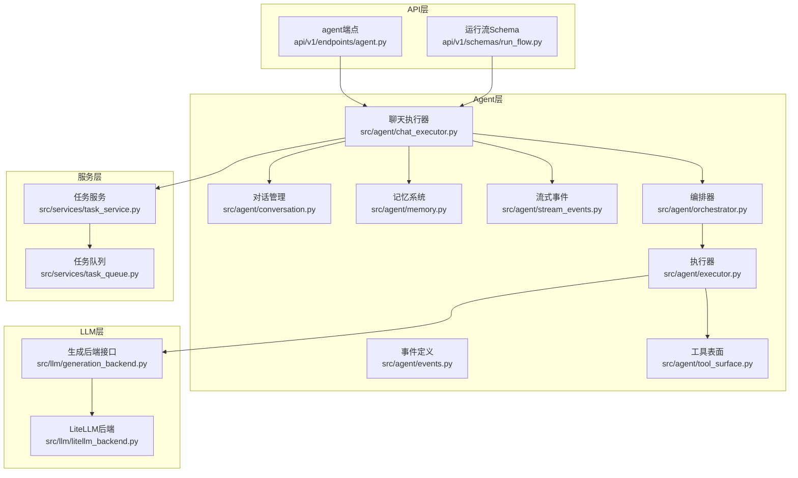
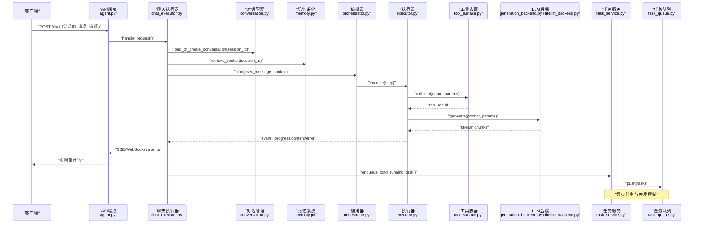
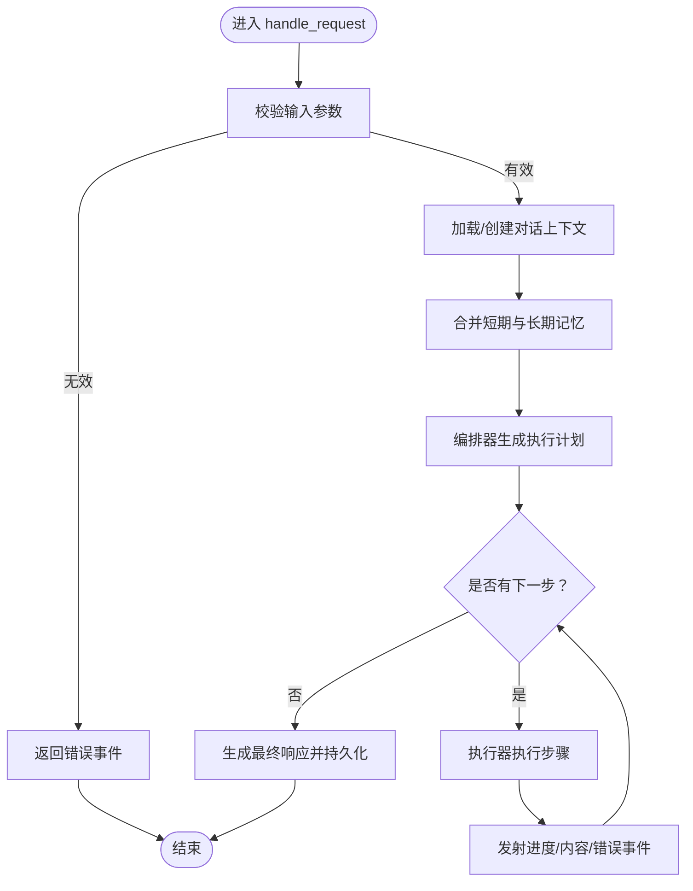
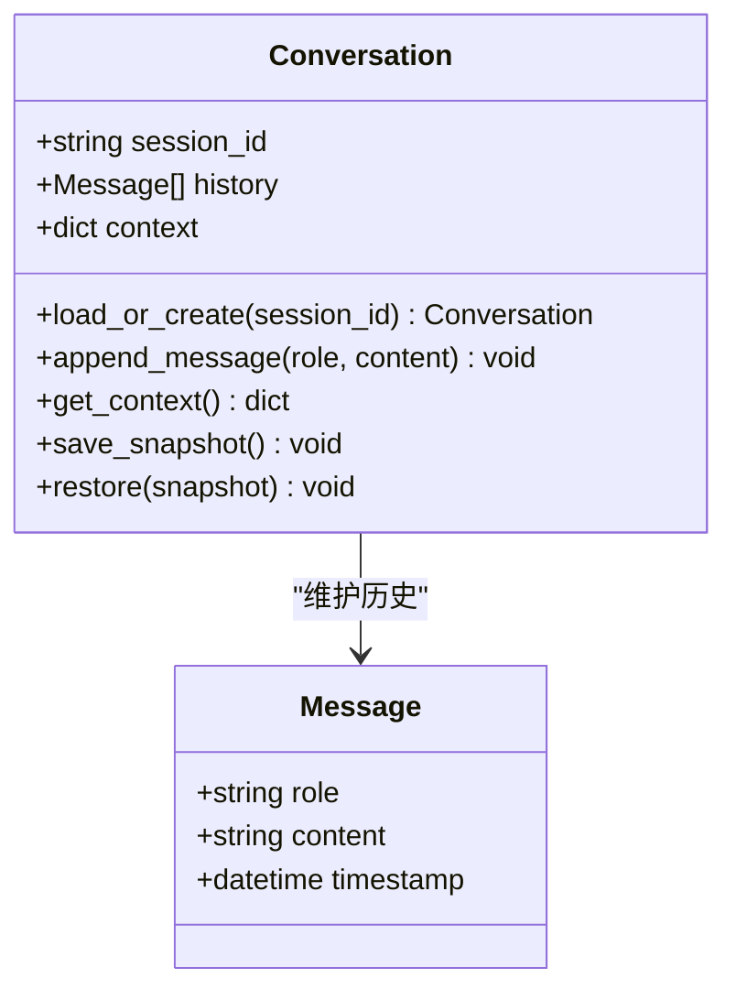
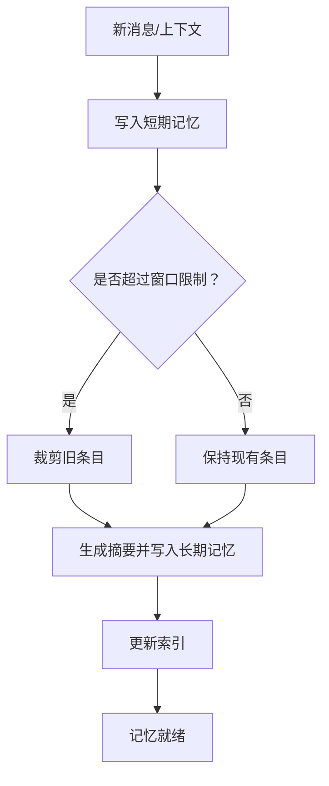
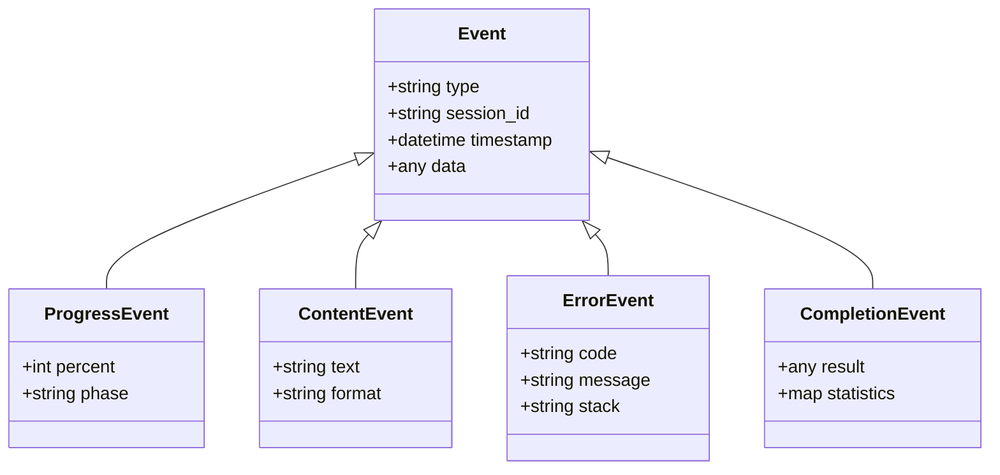
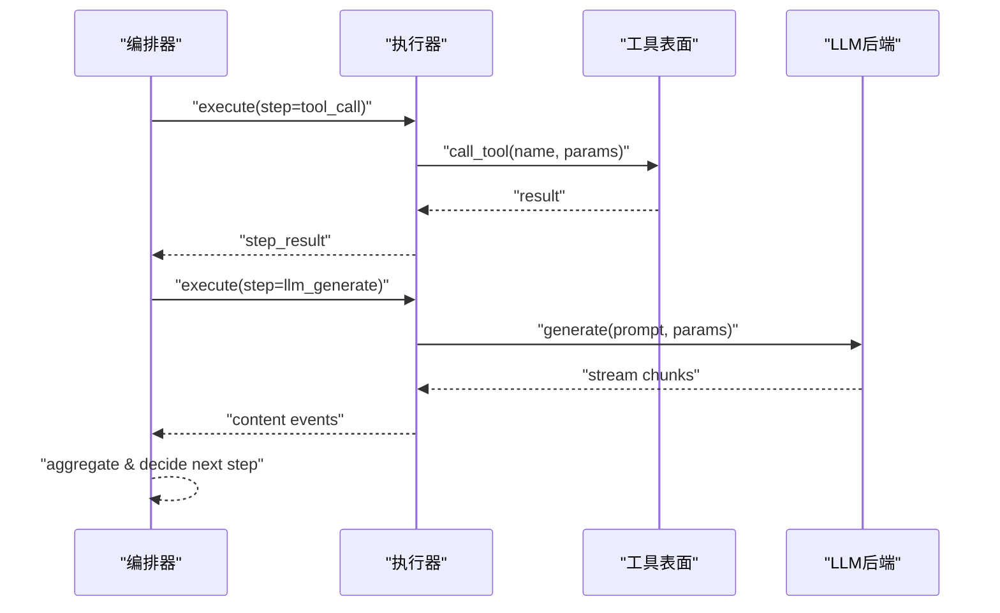
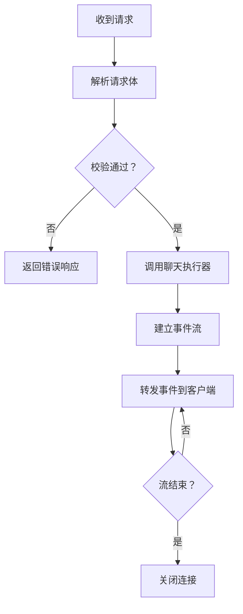
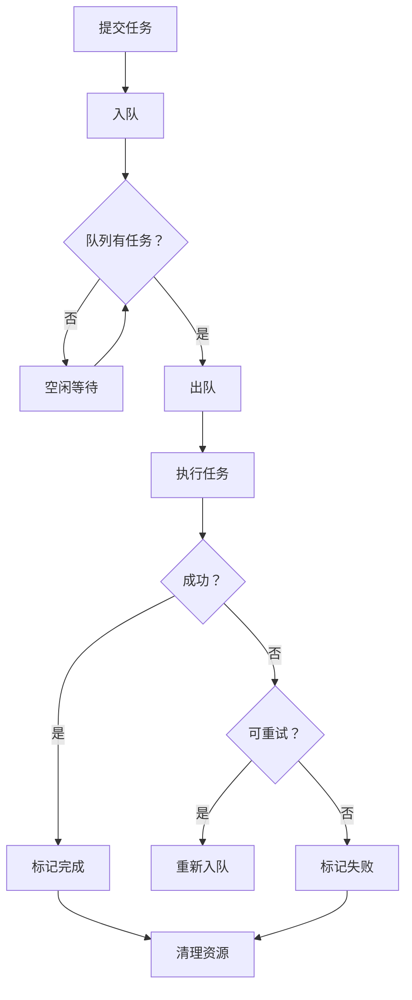
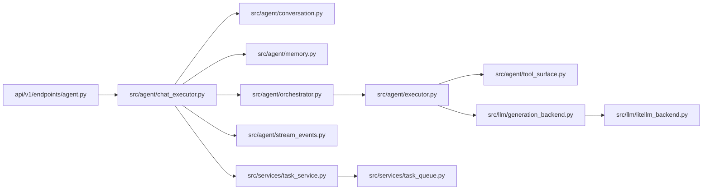

# 聊天执行

<cite>
**本文引用的文件**   
- [src/agent/chat_executor.py](file://src/agent/chat_executor.py)
- [src/agent/conversation.py](file://src/agent/conversation.py)
- [src/agent/memory.py](file://src/agent/memory.py)
- [src/agent/stream_events.py](file://src/agent/stream_events.py)
- [src/agent/events.py](file://src/agent/events.py)
- [src/agent/chat_context.py](file://src/agent/chat_context.py)
- [api/v1/endpoints/agent.py](file://api/v1/endpoints/agent.py)
- [api/v1/schemas/run_flow.py](file://api/v1/schemas/run_flow.py)
- [src/llm/generation_backend.py](file://src/llm/generation_backend.py)
- [src/llm/litellm_backend.py](file://src/llm/litellm_backend.py)
- [src/agent/orchestrator.py](file://src/agent/orchestrator.py)
- [src/agent/executor.py](file://src/agent/executor.py)
- [src/agent/tool_surface.py](file://src/agent/tool_surface.py)
- [src/services/task_service.py](file://src/services/task_service.py)
- [src/services/task_queue.py](file://src/services/task_queue.py)
- [tests/test_agent_chat_executor.py](file://tests/test_agent_chat_executor.py)
</cite>

## 目录
1. [简介](#简介)
2. [项目结构](#项目结构)
3. [核心组件](#核心组件)
4. [架构总览](#架构总览)
5. [详细组件分析](#详细组件分析)
6. [依赖关系分析](#依赖关系分析)
7. [性能考量](#性能考量)
8. [故障排查指南](#故障排查指南)
9. [结论](#结论)
10. [附录](#附录)

## 简介
本文件面向“聊天执行系统”的完整技术文档，聚焦以下目标：
- 深入解释聊天执行器的核心功能：用户请求处理、对话状态管理、响应生成流程。
- 详细说明会话管理机制：上下文维护、历史消息存储、会话恢复。
- 描述流式事件处理系统：实时消息推送、进度更新、错误通知。
- 解释记忆系统设计：短期记忆、长期记忆与知识检索机制。
- 提供聊天界面集成指南：WebSocket/SSE连接、事件监听、用户交互处理。
- 给出实际代码示例路径，展示如何实现自定义聊天功能与扩展对话能力。

## 项目结构
围绕聊天执行的关键模块分布在 src/agent、api/v1、src/llm、src/services 等目录中：
- src/agent：聊天执行器、对话、记忆、事件、编排与工具表面等核心逻辑。
- api/v1：REST API 路由与数据模型，暴露聊天执行入口与流式事件。
- src/llm：LLM 后端抽象与具体实现（如 LiteLLM），负责文本生成与参数化。
- src/services：任务服务与队列，用于异步执行与资源调度。
- tests：覆盖聊天执行器、事件流、编排与工具表面的测试用例。

**图表来源** 
- [api/v1/endpoints/agent.py](file://api/v1/endpoints/agent.py)
- [api/v1/schemas/run_flow.py](file://api/v1/schemas/run_flow.py)
- [src/agent/chat_executor.py](file://src/agent/chat_executor.py)
- [src/agent/conversation.py](file://src/agent/conversation.py)
- [src/agent/memory.py](file://src/agent/memory.py)
- [src/agent/events.py](file://src/agent/events.py)
- [src/agent/stream_events.py](file://src/agent/stream_events.py)
- [src/agent/orchestrator.py](file://src/agent/orchestrator.py)
- [src/agent/executor.py](file://src/agent/executor.py)
- [src/agent/tool_surface.py](file://src/agent/tool_surface.py)
- [src/llm/generation_backend.py](file://src/llm/generation_backend.py)
- [src/llm/litellm_backend.py](file://src/llm/litellm_backend.py)
- [src/services/task_service.py](file://src/services/task_service.py)
- [src/services/task_queue.py](file://src/services/task_queue.py)

**章节来源**
- [api/v1/endpoints/agent.py](file://api/v1/endpoints/agent.py)
- [api/v1/schemas/run_flow.py](file://api/v1/schemas/run_flow.py)
- [src/agent/chat_executor.py](file://src/agent/chat_executor.py)
- [src/agent/conversation.py](file://src/agent/conversation.py)
- [src/agent/memory.py](file://src/agent/memory.py)
- [src/agent/stream_events.py](file://src/agent/stream_events.py)
- [src/agent/events.py](file://src/agent/events.py)
- [src/agent/orchestrator.py](file://src/agent/orchestrator.py)
- [src/agent/executor.py](file://src/agent/executor.py)
- [src/agent/tool_surface.py](file://src/agent/tool_surface.py)
- [src/llm/generation_backend.py](file://src/llm/generation_backend.py)
- [src/llm/litellm_backend.py](file://src/llm/litellm_backend.py)
- [src/services/task_service.py](file://src/services/task_service.py)
- [src/services/task_queue.py](file://src/services/task_queue.py)

## 核心组件
- 聊天执行器（ChatExecutor）：接收用户请求，协调对话上下文、记忆、编排与执行，产出流式事件与最终响应。
- 对话管理（Conversation）：维护会话ID、历史消息、上下文快照与恢复策略。
- 记忆系统（Memory）：短期记忆（滑动窗口）、长期记忆（持久化摘要/索引）、知识检索（搜索与召回）。
- 流式事件（StreamEvents & Events）：定义事件类型与序列化格式，驱动SSE/WebSocket推送。
- 编排器（Orchestrator）：将用户意图拆解为步骤，调度工具调用与LLM生成。
- 执行器（Executor）：执行具体步骤（工具调用、LLM调用），返回结果与中间状态。
- 工具表面（ToolSurface）：统一工具注册、参数校验与调用封装。
- LLM后端（GenerationBackend/LiteLLMBackend）：抽象生成接口，支持多提供商与参数配置。
- 任务服务与队列（TaskService/TaskQueue）：异步任务生命周期管理与并发控制。

**章节来源**
- [src/agent/chat_executor.py](file://src/agent/chat_executor.py)
- [src/agent/conversation.py](file://src/agent/conversation.py)
- [src/agent/memory.py](file://src/agent/memory.py)
- [src/agent/stream_events.py](file://src/agent/stream_events.py)
- [src/agent/events.py](file://src/agent/events.py)
- [src/agent/orchestrator.py](file://src/agent/orchestrator.py)
- [src/agent/executor.py](file://src/agent/executor.py)
- [src/agent/tool_surface.py](file://src/agent/tool_surface.py)
- [src/llm/generation_backend.py](file://src/llm/generation_backend.py)
- [src/llm/litellm_backend.py](file://src/llm/litellm_backend.py)
- [src/services/task_service.py](file://src/services/task_service.py)
- [src/services/task_queue.py](file://src/services/task_queue.py)

## 架构总览
聊天执行系统的端到端流程如下：
- 客户端通过 REST API 发起聊天请求（包含会话ID、消息、选项）。
- API 层解析并校验请求，调用聊天执行器。
- 聊天执行器加载或创建对话上下文，读取记忆，编排步骤。
- 执行器调用工具与LLM后端，产生流式事件（进度、片段、错误）。
- 任务服务与队列保障异步执行与资源隔离。
- 客户端订阅SSE/WebSocket，实时渲染响应。

**图表来源** 
- [api/v1/endpoints/agent.py](file://api/v1/endpoints/agent.py)
- [src/agent/chat_executor.py](file://src/agent/chat_executor.py)
- [src/agent/conversation.py](file://src/agent/conversation.py)
- [src/agent/memory.py](file://src/agent/memory.py)
- [src/agent/orchestrator.py](file://src/agent/orchestrator.py)
- [src/agent/executor.py](file://src/agent/executor.py)
- [src/agent/tool_surface.py](file://src/agent/tool_surface.py)
- [src/llm/generation_backend.py](file://src/llm/generation_backend.py)
- [src/llm/litellm_backend.py](file://src/llm/litellm_backend.py)
- [src/services/task_service.py](file://src/services/task_service.py)
- [src/services/task_queue.py](file://src/services/task_queue.py)

## 详细组件分析

### 聊天执行器（ChatExecutor）
职责与流程：
- 接收并校验请求参数（会话ID、消息、选项）。
- 初始化或恢复对话上下文，合并短期与长期记忆。
- 调用编排器生成执行计划，逐步执行并产出流式事件。
- 处理异常与重试，确保事件流的完整性与一致性。
- 将最终结果写入对话历史与记忆存储。

关键方法（概念性说明）：
- handle_request：入口方法，参数校验、上下文加载、编排执行、事件发射。
- build_context：整合会话历史、系统提示、外部上下文。
- run_plan：迭代执行计划，收集中间结果与事件。
- emit_event：标准化事件格式，推送到SSE/WebSocket。
- finalize：收尾工作，持久化对话与记忆摘要。

**图表来源** 
- [src/agent/chat_executor.py](file://src/agent/chat_executor.py)
- [src/agent/conversation.py](file://src/agent/conversation.py)
- [src/agent/memory.py](file://src/agent/memory.py)
- [src/agent/orchestrator.py](file://src/agent/orchestrator.py)
- [src/agent/executor.py](file://src/agent/executor.py)
- [src/agent/stream_events.py](file://src/agent/stream_events.py)

**章节来源**
- [src/agent/chat_executor.py](file://src/agent/chat_executor.py)
- [src/agent/conversation.py](file://src/agent/conversation.py)
- [src/agent/memory.py](file://src/agent/memory.py)
- [src/agent/orchestrator.py](file://src/agent/orchestrator.py)
- [src/agent/executor.py](file://src/agent/executor.py)
- [src/agent/stream_events.py](file://src/agent/stream_events.py)

### 对话管理（Conversation）
职责与特性：
- 会话ID映射到对话实例，支持多会话并行。
- 维护消息历史（按时间顺序），支持截断与压缩。
- 上下文快照：保存系统提示、用户偏好、外部上下文。
- 会话恢复：从持久化存储重建对话状态。

关键操作（概念性说明）：
- load_or_create：根据会话ID加载或新建对话。
- append_message：追加用户/助手消息，触发上下文更新。
- get_context：返回当前上下文（含历史与系统提示）。
- save_snapshot：持久化快照以便恢复。
- restore：从快照恢复对话状态。

**图表来源** 
- [src/agent/conversation.py](file://src/agent/conversation.py)

**章节来源**
- [src/agent/conversation.py](file://src/agent/conversation.py)

### 记忆系统（Memory）
设计要点：
- 短期记忆：滑动窗口，保留最近N条消息或Token限制内的上下文。
- 长期记忆：摘要与索引，持久化关键信息，支持跨会话检索。
- 知识检索：基于关键词/语义的搜索与召回，增强回答质量。

关键能力（概念性说明）：
- store_short_term：写入短期记忆，自动清理过期条目。
- store_long_term：持久化摘要/索引，支持增量更新。
- retrieve：根据查询条件召回相关记忆片段。
- summarize：对长历史进行摘要，减少上下文负载。

**图表来源** 
- [src/agent/memory.py](file://src/agent/memory.py)

**章节来源**
- [src/agent/memory.py](file://src/agent/memory.py)

### 流式事件系统（StreamEvents & Events）
职责与规范：
- 定义事件类型：开始、进度、内容片段、错误、完成。
- 标准化事件结构：类型、时间戳、会话ID、数据载荷。
- 支持SSE/WebSocket传输，保证事件顺序与幂等性。

关键类型（概念性说明）：
- Event：基础事件结构。
- ProgressEvent：进度更新（百分比、阶段名）。
- ContentEvent：内容片段（文本、Markdown、结构化数据）。
- ErrorEvent：错误信息（错误码、消息、堆栈）。
- CompletionEvent：完成信号（最终结果、统计信息）。

**图表来源** 
- [src/agent/stream_events.py](file://src/agent/stream_events.py)
- [src/agent/events.py](file://src/agent/events.py)

**章节来源**
- [src/agent/stream_events.py](file://src/agent/stream_events.py)
- [src/agent/events.py](file://src/agent/events.py)

### 编排器（Orchestrator）与执行器（Executor）
编排器职责：
- 解析用户意图，生成可执行的步骤序列。
- 决策何时调用工具、何时调用LLM、何时聚合结果。
- 处理分支与循环，支持复杂对话流程。

执行器职责：
- 执行单个步骤（工具调用、LLM生成、数据转换）。
- 捕获异常与重试，返回中间结果与事件。
- 与工具表面交互，统一参数校验与结果格式化。

**图表来源** 
- [src/agent/orchestrator.py](file://src/agent/orchestrator.py)
- [src/agent/executor.py](file://src/agent/executor.py)
- [src/agent/tool_surface.py](file://src/agent/tool_surface.py)
- [src/llm/generation_backend.py](file://src/llm/generation_backend.py)
- [src/llm/litellm_backend.py](file://src/llm/litellm_backend.py)

**章节来源**
- [src/agent/orchestrator.py](file://src/agent/orchestrator.py)
- [src/agent/executor.py](file://src/agent/executor.py)
- [src/agent/tool_surface.py](file://src/agent/tool_surface.py)
- [src/llm/generation_backend.py](file://src/llm/generation_backend.py)
- [src/llm/litellm_backend.py](file://src/llm/litellm_backend.py)

### API端点与运行流（Agent Endpoint & Run Flow Schema）
- Agent端点：接收聊天请求，返回SSE/WebSocket事件流。
- Run Flow Schema：定义请求体结构（会话ID、消息、选项、流式标志）。

关键流程（概念性说明）：
- 解析请求体，校验必填字段。
- 调用聊天执行器，建立事件通道。
- 将事件转发给客户端，处理连接断开与超时。

**图表来源** 
- [api/v1/endpoints/agent.py](file://api/v1/endpoints/agent.py)
- [api/v1/schemas/run_flow.py](file://api/v1/schemas/run_flow.py)

**章节来源**
- [api/v1/endpoints/agent.py](file://api/v1/endpoints/agent.py)
- [api/v1/schemas/run_flow.py](file://api/v1/schemas/run_flow.py)

### 任务服务与队列（TaskService & TaskQueue）
职责：
- 管理异步任务的创建、调度、执行与回收。
- 提供并发控制与资源隔离，避免阻塞主线程。
- 支持任务优先级、重试与超时。

关键能力（概念性说明）：
- enqueue：提交任务到队列。
- process：从队列取出任务并执行。
- monitor：监控任务状态与健康。
- cleanup：清理已完成或失败的任务。

**图表来源** 
- [src/services/task_service.py](file://src/services/task_service.py)
- [src/services/task_queue.py](file://src/services/task_queue.py)

**章节来源**
- [src/services/task_service.py](file://src/services/task_service.py)
- [src/services/task_queue.py](file://src/services/task_queue.py)

## 依赖关系分析
组件间依赖关系如下：
- API端点依赖聊天执行器与运行流Schema。
- 聊天执行器依赖对话管理、记忆系统、编排器、执行器、流式事件。
- 执行器依赖工具表面与LLM后端。
- 任务服务与队列支撑异步执行。

**图表来源** 
- [api/v1/endpoints/agent.py](file://api/v1/endpoints/agent.py)
- [src/agent/chat_executor.py](file://src/agent/chat_executor.py)
- [src/agent/conversation.py](file://src/agent/conversation.py)
- [src/agent/memory.py](file://src/agent/memory.py)
- [src/agent/orchestrator.py](file://src/agent/orchestrator.py)
- [src/agent/executor.py](file://src/agent/executor.py)
- [src/agent/tool_surface.py](file://src/agent/tool_surface.py)
- [src/llm/generation_backend.py](file://src/llm/generation_backend.py)
- [src/llm/litellm_backend.py](file://src/llm/litellm_backend.py)
- [src/agent/stream_events.py](file://src/agent/stream_events.py)
- [src/services/task_service.py](file://src/services/task_service.py)
- [src/services/task_queue.py](file://src/services/task_queue.py)

**章节来源**
- [api/v1/endpoints/agent.py](file://api/v1/endpoints/agent.py)
- [src/agent/chat_executor.py](file://src/agent/chat_executor.py)
- [src/agent/conversation.py](file://src/agent/conversation.py)
- [src/agent/memory.py](file://src/agent/memory.py)
- [src/agent/orchestrator.py](file://src/agent/orchestrator.py)
- [src/agent/executor.py](file://src/agent/executor.py)
- [src/agent/tool_surface.py](file://src/agent/tool_surface.py)
- [src/llm/generation_backend.py](file://src/llm/generation_backend.py)
- [src/llm/litellm_backend.py](file://src/llm/litellm_backend.py)
- [src/agent/stream_events.py](file://src/agent/stream_events.py)
- [src/services/task_service.py](file://src/services/task_service.py)
- [src/services/task_queue.py](file://src/services/task_queue.py)

## 性能考量
- 流式输出：优先使用SSE/WebSocket推送片段，降低首字节延迟。
- 上下文裁剪：短期记忆采用滑动窗口，避免Token超限。
- 记忆摘要：定期生成摘要，减少历史长度。
- 异步执行：长耗时任务放入队列，避免阻塞请求线程。
- 缓存策略：对频繁查询的记忆片段进行缓存。
- 并发控制：限制LLM并发调用，防止过载。

[本节为通用指导，不直接分析具体文件]

## 故障排查指南
常见问题与定位方法：
- 事件丢失：检查事件发射顺序与幂等性，确认SSE/WebSocket连接稳定。
- 上下文溢出：调整短期记忆窗口大小，启用摘要压缩。
- 工具调用失败：查看工具表面日志，确认参数校验与权限。
- LLM超时：增加超时阈值，启用重试与降级策略。
- 任务堆积：监控队列长度，扩容消费者或优化任务粒度。

**章节来源**
- [src/agent/stream_events.py](file://src/agent/stream_events.py)
- [src/agent/tool_surface.py](file://src/agent/tool_surface.py)
- [src/llm/litellm_backend.py](file://src/llm/litellm_backend.py)
- [src/services/task_queue.py](file://src/services/task_queue.py)

## 结论
聊天执行系统以聊天执行器为核心，串联对话管理、记忆系统、编排执行、流式事件与LLM后端，形成高内聚、低耦合的架构。通过短期/长期记忆与知识检索提升对话质量，借助SSE/WebSocket实现实时交互，配合任务服务与队列保障可扩展性与稳定性。开发者可通过工具表面与编排器扩展对话能力，满足多样化业务需求。

[本节为总结性内容，不直接分析具体文件]

## 附录

### 聊天界面集成指南
- WebSocket/SSE连接：
  - 建立连接后订阅事件通道，处理开始、进度、内容、错误、完成事件。
  - 实现重连与心跳机制，确保连接健壮性。
- 事件监听：
  - 进度事件：更新UI进度条或状态指示。
  - 内容事件：增量渲染文本或结构化数据。
  - 错误事件：显示错误提示，允许重试。
  - 完成事件：停止加载，展示最终结果。
- 用户交互：
  - 发送消息时附带会话ID，支持多会话并行。
  - 支持中断与取消，及时释放资源。

[本节为通用指导，不直接分析具体文件]

### 实际代码示例（路径引用）
- 自定义聊天功能：
  - 参考聊天执行器入口与事件发射逻辑：[src/agent/chat_executor.py](file://src/agent/chat_executor.py)
  - 参考事件定义与序列化：[src/agent/stream_events.py](file://src/agent/stream_events.py)
  - 参考API端点与请求模型：[api/v1/endpoints/agent.py](file://api/v1/endpoints/agent.py), [api/v1/schemas/run_flow.py](file://api/v1/schemas/run_flow.py)
- 扩展对话能力：
  - 参考工具表面注册与调用：[src/agent/tool_surface.py](file://src/agent/tool_surface.py)
  - 参考编排器步骤生成与执行：[src/agent/orchestrator.py](file://src/agent/orchestrator.py), [src/agent/executor.py](file://src/agent/executor.py)
  - 参考LLM后端接入：[src/llm/generation_backend.py](file://src/llm/generation_backend.py), [src/llm/litellm_backend.py](file://src/llm/litellm_backend.py)
- 测试与验证：
  - 参考聊天执行器测试用例：[tests/test_agent_chat_executor.py](file://tests/test_agent_chat_executor.py)

**章节来源**
- [src/agent/chat_executor.py](file://src/agent/chat_executor.py)
- [src/agent/stream_events.py](file://src/agent/stream_events.py)
- [api/v1/endpoints/agent.py](file://api/v1/endpoints/agent.py)
- [api/v1/schemas/run_flow.py](file://api/v1/schemas/run_flow.py)
- [src/agent/tool_surface.py](file://src/agent/tool_surface.py)
- [src/agent/orchestrator.py](file://src/agent/orchestrator.py)
- [src/agent/executor.py](file://src/agent/executor.py)
- [src/llm/generation_backend.py](file://src/llm/generation_backend.py)
- [src/llm/litellm_backend.py](file://src/llm/litellm_backend.py)
- [tests/test_agent_chat_executor.py](file://tests/test_agent_chat_executor.py)