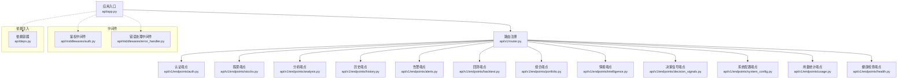
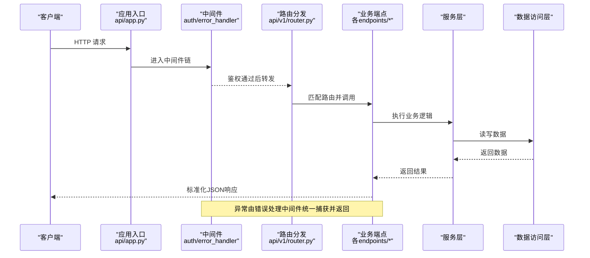
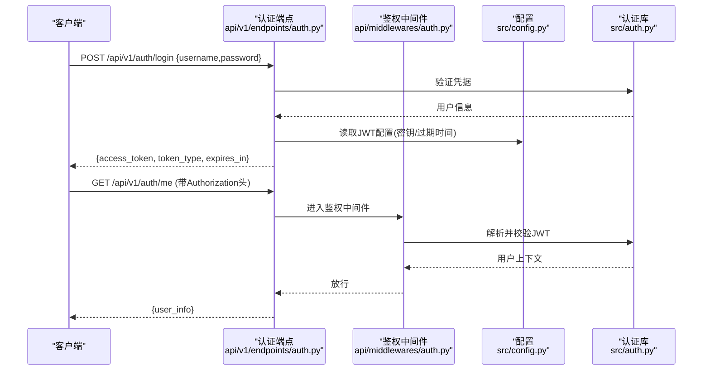
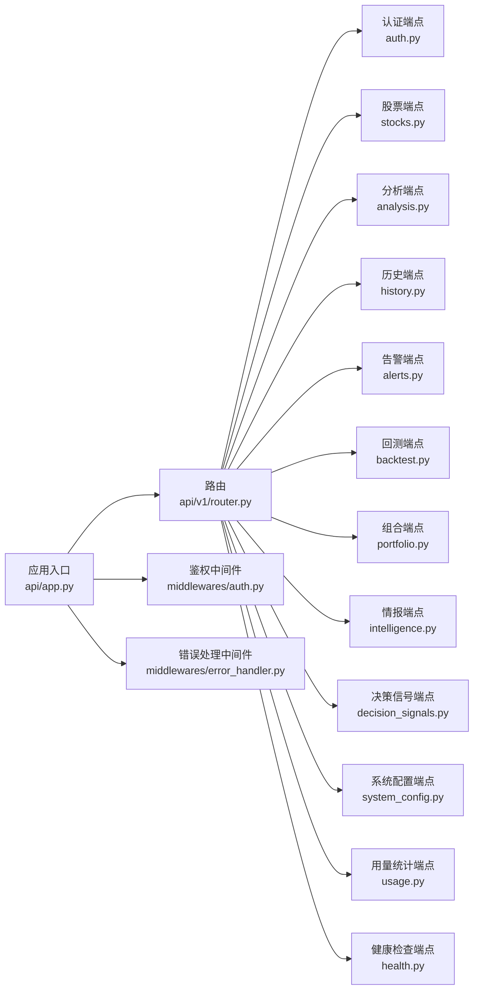

# API接口文档

<cite>
**本文档引用的文件**   
- [api/app.py](file://api/app.py)
- [api/v1/router.py](file://api/v1/router.py)
- [api/middlewares/auth.py](file://api/middlewares/auth.py)
- [api/middlewares/error_handler.py](file://api/middlewares/error_handler.py)
- [api/deps.py](file://api/deps.py)
- [api/v1/endpoints/auth.py](file://api/v1/endpoints/auth.py)
- [api/v1/endpoints/stocks.py](file://api/v1/endpoints/stocks.py)
- [api/v1/endpoints/analysis.py](file://api/v1/endpoints/analysis.py)
- [api/v1/endpoints/history.py](file://api/v1/endpoints/history.py)
- [api/v1/endpoints/alerts.py](file://api/v1/endpoints/alerts.py)
- [api/v1/endpoints/backtest.py](file://api/v1/endpoints/backtest.py)
- [api/v1/endpoints/portfolio.py](file://api/v1/endpoints/portfolio.py)
- [api/v1/endpoints/intelligence.py](file://api/v1/endpoints/intelligence.py)
- [api/v1/endpoints/decision_signals.py](file://api/v1/endpoints/decision_signals.py)
- [api/v1/endpoints/system_config.py](file://api/v1/endpoints/system_config.py)
- [api/v1/endpoints/usage.py](file://api/v1/endpoints/usage.py)
- [api/v1/endpoints/health.py](file://api/v1/endpoints/health.py)
- [api/v1/schemas/common.py](file://api/v1/schemas/common.py)
- [api/v1/errors.py](file://api/v1/errors.py)
- [src/config.py](file://src/config.py)
- [src/auth.py](file://src/auth.py)
</cite>

## 目录
1. [简介](#简介)
2. [项目结构](#项目结构)
3. [核心组件](#核心组件)
4. [架构总览](#架构总览)
5. [详细组件分析](#详细组件分析)
6. [依赖关系分析](#依赖关系分析)
7. [性能考虑](#性能考虑)
8. [故障排查指南](#故障排查指南)
9. [结论](#结论)
10. [附录](#附录)

## 简介
本文件为 Daily Stock Analysis 的 RESTful API 接口文档，覆盖认证授权、端点定义、请求与响应格式、版本管理策略、最佳实践、客户端集成、性能与监控等。API 基于 FastAPI 构建，采用 Pydantic 进行数据校验与序列化，统一错误处理与中间件机制，提供 v1 版本化的接口集合。

## 项目结构
后端 API 位于 api 目录，入口应用为 app.py，路由按版本组织在 v1 下，每个功能模块以 endpoints 子目录划分，数据模型使用 schemas 定义。鉴权与错误处理通过 middlewares 实现，依赖注入由 deps.py 提供。

图表来源
- [api/app.py](file://api/app.py)
- [api/v1/router.py](file://api/v1/router.py)
- [api/middlewares/auth.py](file://api/middlewares/auth.py)
- [api/middlewares/error_handler.py](file://api/middlewares/error_handler.py)
- [api/deps.py](file://api/deps.py)

章节来源
- [api/app.py](file://api/app.py)
- [api/v1/router.py](file://api/v1/router.py)

## 核心组件
- 应用入口与生命周期：负责挂载中间件、注册路由、初始化依赖。
- 路由与端点：v1 版本下的各业务端点，遵循统一的请求/响应模式。
- 鉴权与授权：JWT 令牌签发与验证，权限校验中间件。
- 错误处理：统一异常捕获与标准化错误响应。
- 依赖注入：服务与仓储的装配与复用。

章节来源
- [api/app.py](file://api/app.py)
- [api/v1/router.py](file://api/v1/router.py)
- [api/middlewares/auth.py](file://api/middlewares/auth.py)
- [api/middlewares/error_handler.py](file://api/middlewares/error_handler.py)
- [api/deps.py](file://api/deps.py)

## 架构总览
整体采用分层架构：HTTP 层（FastAPI）→ 中间件（鉴权/错误处理）→ 路由与端点 → 服务层 → 数据访问层。所有端点返回标准化的 JSON 结构，错误统一经中间件处理。

图表来源
- [api/app.py](file://api/app.py)
- [api/v1/router.py](file://api/v1/router.py)
- [api/middlewares/auth.py](file://api/middlewares/auth.py)
- [api/middlewares/error_handler.py](file://api/middlewares/error_handler.py)

## 详细组件分析

### 认证与授权（JWT）
- 令牌获取：通过认证端点提交凭据，服务端签发 JWT 令牌。
- 令牌使用：后续请求在请求头中携带 Authorization: Bearer <token>。
- 权限验证：中间件解析并校验令牌，必要时校验角色/权限。
- 刷新与过期：支持令牌刷新与过期策略（具体参数由服务端配置）。

图表来源
- [api/v1/endpoints/auth.py](file://api/v1/endpoints/auth.py)
- [api/middlewares/auth.py](file://api/middlewares/auth.py)
- [src/config.py](file://src/config.py)
- [src/auth.py](file://src/auth.py)

章节来源
- [api/v1/endpoints/auth.py](file://api/v1/endpoints/auth.py)
- [api/middlewares/auth.py](file://api/middlewares/auth.py)
- [src/config.py](file://src/config.py)
- [src/auth.py](file://src/auth.py)

### 股票相关端点（stocks）
- 常用操作：查询股票列表、搜索股票、获取股票详情、批量更新关注列表等。
- 分页与过滤：支持分页参数（page、size）、关键词过滤、市场筛选。
- 批量操作：支持批量添加/移除关注、批量拉取行情快照。

章节来源
- [api/v1/endpoints/stocks.py](file://api/v1/endpoints/stocks.py)

### 分析相关端点（analysis）
- 功能：触发个股或组合的分析任务，支持同步/异步两种模式。
- 参数：股票代码、时间窗口、指标选择、报告语言等。
- 响应：同步返回分析摘要；异步返回任务ID，后续轮询状态。

章节来源
- [api/v1/endpoints/analysis.py](file://api/v1/endpoints/analysis.py)

### 历史数据端点（history）
- 功能：获取历史K线、财务指标、新闻事件等。
- 参数：起止时间、频率（日/周/月）、字段选择。
- 分页：支持按页拉取大数据集。

章节来源
- [api/v1/endpoints/history.py](file://api/v1/endpoints/history.py)

### 告警端点（alerts）
- 功能：创建/查询/删除告警规则，订阅与推送状态。
- 参数：标的、阈值、周期、通知渠道。
- 响应：告警列表、规则详情、推送日志。

章节来源
- [api/v1/endpoints/alerts.py](file://api/v1/endpoints/alerts.py)

### 回测端点（backtest）
- 功能：提交回测任务、查询回测结果、导出报告。
- 参数：策略、标的、时间段、初始资金、手续费等。
- 响应：回测摘要、收益曲线、风险指标。

章节来源
- [api/v1/endpoints/backtest.py](file://api/v1/endpoints/backtest.py)

### 投资组合端点（portfolio）
- 功能：组合CRUD、持仓快照、风险评估、导入/导出。
- 参数：组合ID、日期范围、风险偏好。
- 响应：组合概览、持仓明细、风险指标。

章节来源
- [api/v1/endpoints/portfolio.py](file://api/v1/endpoints/portfolio.py)

### 情报端点（intelligence）
- 功能：聚合多源情报（新闻、研报、舆情），检索与摘要。
- 参数：关键词、时间范围、来源过滤。
- 响应：情报条目、情感评分、关联度。

章节来源
- [api/v1/endpoints/intelligence.py](file://api/v1/endpoints/intelligence.py)

### 决策信号端点（decision_signals）
- 功能：生成/查询决策信号、信号评估、回溯分析。
- 参数：策略、标的、时间窗口、信号类型。
- 响应：信号列表、评估指标、归因分析。

章节来源
- [api/v1/endpoints/decision_signals.py](file://api/v1/endpoints/decision_signals.py)

### 系统配置端点（system_config）
- 功能：读取/更新系统配置项，支持热更新。
- 参数：配置键、值、作用域。
- 响应：配置快照、变更日志。

章节来源
- [api/v1/endpoints/system_config.py](file://api/v1/endpoints/system_config.py)

### 用量统计端点（usage）
- 功能：统计API调用量、LLM调用次数、资源消耗。
- 参数：时间范围、维度（用户/模块）。
- 响应：用量报表、趋势图数据。

章节来源
- [api/v1/endpoints/usage.py](file://api/v1/endpoints/usage.py)

### 健康检查端点（health）
- 功能：服务健康探测、依赖状态检查。
- 响应：服务状态、依赖可用性。

章节来源
- [api/v1/endpoints/health.py](file://api/v1/endpoints/health.py)

### 通用数据模型（schemas）
- 统一分页模型：page、size、total、items。
- 统一响应包装：code、message、data、trace_id。
- 常见枚举：市场、频率、状态码等。

章节来源
- [api/v1/schemas/common.py](file://api/v1/schemas/common.py)

### 错误处理（errors）
- 统一错误码：业务错误码与HTTP状态码映射。
- 错误响应体：包含错误消息、追踪ID、建议修复。
- 中间件：全局捕获未处理异常，返回标准错误格式。

章节来源
- [api/v1/errors.py](file://api/v1/errors.py)
- [api/middlewares/error_handler.py](file://api/middlewares/error_handler.py)

## 依赖关系分析
- 路由对端点的依赖：router.py 集中注册各模块端点。
- 端点对服务的依赖：业务逻辑下沉至服务层，便于测试与扩展。
- 中间件与应用：鉴权与错误处理作为横切关注点贯穿请求链路。
- 配置与认证：JWT 配置集中于配置模块，认证库提供令牌能力。

图表来源
- [api/v1/router.py](file://api/v1/router.py)
- [api/app.py](file://api/app.py)
- [api/middlewares/auth.py](file://api/middlewares/auth.py)
- [api/middlewares/error_handler.py](file://api/middlewares/error_handler.py)

章节来源
- [api/v1/router.py](file://api/v1/router.py)
- [api/app.py](file://api/app.py)

## 性能考虑
- 速率限制：建议在网关或反向代理层实施限流，保护后端免受突发流量冲击。
- 缓存策略：对热点数据（如股票列表、指数映射）启用缓存，减少重复计算与外部调用。
- 连接池：数据库与外部数据源的连接池需合理配置，避免连接耗尽。
- 异步处理：长耗时任务（分析、回测）采用异步任务队列，前端轮询或SSE推送。
- 分页与增量：大数据集务必分页，支持增量拉取与字段裁剪。
- 压缩与传输：启用Gzip压缩，减少网络传输开销。

[本节为通用指导，不直接分析具体文件]

## 故障排查指南
- 常见问题定位：
  - 鉴权失败：检查Authorization头格式、令牌是否过期、签名密钥是否一致。
  - 参数校验错误：核对请求体结构与必填字段，参考schemas定义。
  - 超时与重试：外部数据源不稳定时，设置合理的超时与重试策略。
- 调试工具：
  - 使用OpenAPI/Swagger UI查看接口定义与在线测试。
  - 开启请求日志与追踪ID，便于问题溯源。
- 监控方法：
  - 关键指标：QPS、延迟分布、错误率、下游依赖健康。
  - 告警规则：错误率突增、响应时间劣化、依赖不可用。

章节来源
- [api/middlewares/error_handler.py](file://api/middlewares/error_handler.py)
- [api/v1/errors.py](file://api/v1/errors.py)

## 结论
Daily Stock Analysis 的 API 采用清晰的分层与模块化设计，统一的鉴权与错误处理机制提升了可维护性与稳定性。通过版本化管理与标准化响应，保障了向后兼容与客户端集成体验。建议在生产环境结合网关限流、缓存与监控体系，确保高可用与高性能。

[本节为总结性内容，不直接分析具体文件]

## 附录

### 版本管理与兼容性
- 版本前缀：/api/v1/ 明确标识接口版本。
- 向后兼容：新增字段默认可选，废弃字段保留过渡期；破坏性变更通过新版本发布。
- 弃用策略：通过响应头或文档标注弃用端点与字段，提供迁移指引。

章节来源
- [api/v1/router.py](file://api/v1/router.py)

### 常用调用场景与最佳实践
- 批量操作：优先使用批量接口，减少往返次数；注意幂等性与事务边界。
- 分页查询：合理设置 page、size，避免一次性拉取过大数据集。
- 错误处理：客户端应区分业务错误与网络错误，实现重试与降级。
- 安全实践：妥善保管JWT，避免泄露；定期轮换密钥。

章节来源
- [api/v1/schemas/common.py](file://api/v1/schemas/common.py)

### 客户端集成指南
- SDK使用：推荐使用官方SDK封装鉴权、重试、分页等通用逻辑。
- 常见问题：
  - 跨域问题：配置CORS白名单。
  - 编码问题：确保UTF-8编码，处理中文与特殊字符。
  - 超时设置：根据业务调整超时与重试次数。

章节来源
- [api/app.py](file://api/app.py)

### 请求与响应示例（说明）
- 成功响应：包含 code、message、data，data 为业务数据对象或分页结构。
- 错误响应：包含 code、message、trace_id，便于定位问题。
- 鉴权示例：登录成功后获取 access_token，后续请求携带 Authorization 头。

章节来源
- [api/v1/schemas/common.py](file://api/v1/schemas/common.py)
- [api/v1/errors.py](file://api/v1/errors.py)