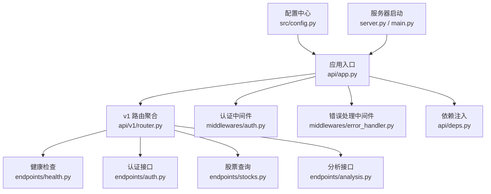
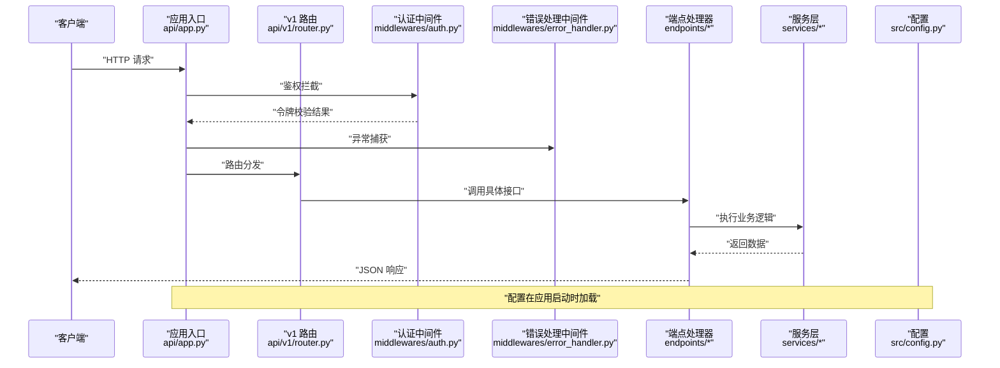
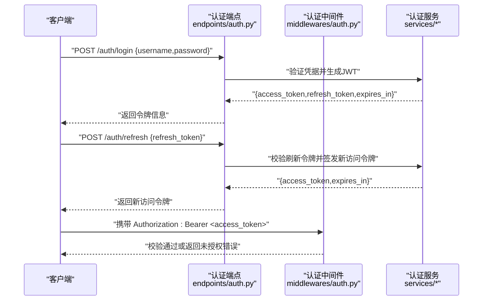
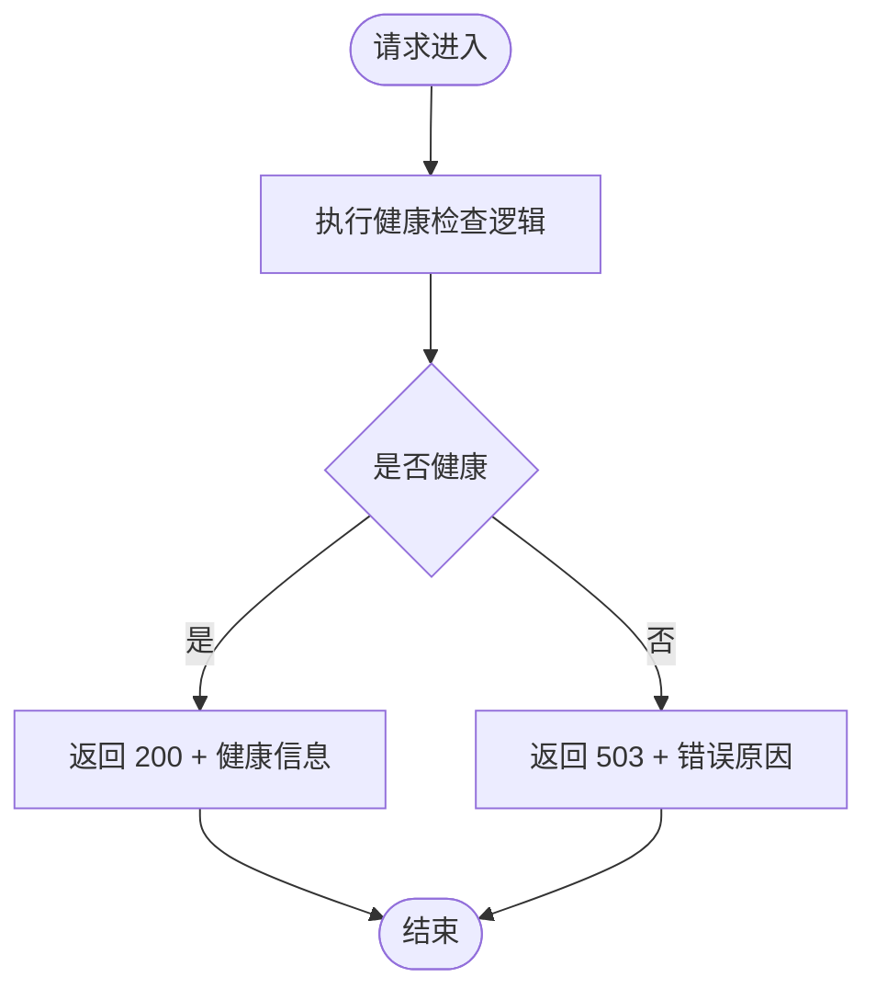
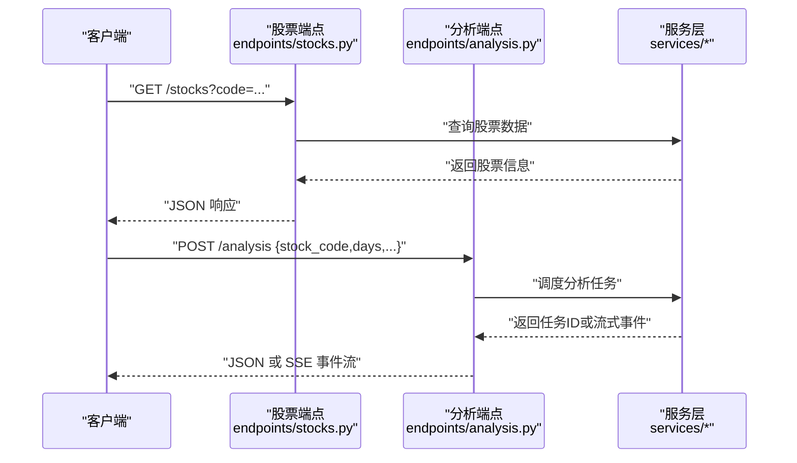
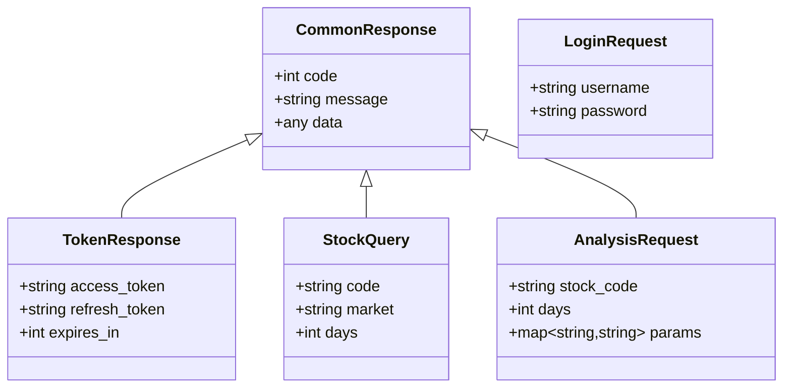
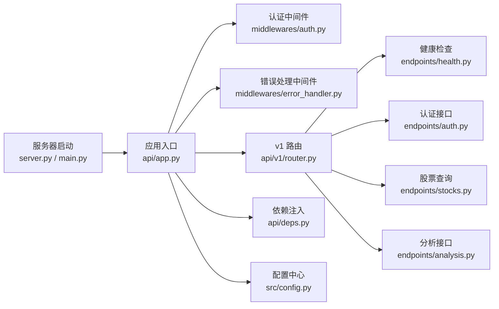

# API概览

<cite>
**本文引用的文件**   
- [api/app.py](file://api/app.py)
- [api/v1/router.py](file://api/v1/router.py)
- [api/middlewares/auth.py](file://api/middlewares/auth.py)
- [api/middlewares/error_handler.py](file://api/middlewares/error_handler.py)
- [api/deps.py](file://api/deps.py)
- [api/v1/endpoints/health.py](file://api/v1/endpoints/health.py)
- [api/v1/endpoints/auth.py](file://api/v1/endpoints/auth.py)
- [api/v1/endpoints/stocks.py](file://api/v1/endpoints/stocks.py)
- [api/v1/endpoints/analysis.py](file://api/v1/endpoints/analysis.py)
- [api/v1/schemas/common.py](file://api/v1/schemas/common.py)
- [src/config.py](file://src/config.py)
- [server.py](file://server.py)
- [main.py](file://main.py)
</cite>

## 目录
1. [简介](#简介)
2. [项目结构](#项目结构)
3. [核心组件](#核心组件)
4. [架构总览](#架构总览)
5. [详细组件分析](#详细组件分析)
6. [依赖关系分析](#依赖关系分析)
7. [性能与缓存建议](#性能与缓存建议)
8. [故障排查指南](#故障排查指南)
9. [结论](#结论)
10. [附录：API使用示例与规范](#附录api使用示例与规范)

## 简介
本文件为 Daily Stock Analysis API 的概览文档，面向开发者快速理解整体架构、RESTful 规范、版本管理策略、URL 命名约定、基础配置（基础路径、请求头、内容类型、字符编码）、认证机制（JWT 获取、刷新、使用）、错误处理标准（HTTP 状态码、错误响应格式、常见错误码）、速率限制与缓存策略、性能优化建议，以及调试工具与客户端库的使用指南。

## 项目结构
API 采用分层模块化设计：
- 应用入口与中间件：应用初始化、全局中间件（认证、错误处理）、依赖注入
- 路由与版本：v1 路由聚合，按功能域拆分端点
- 数据模型：Pydantic Schema 定义请求/响应结构
- 服务层：业务逻辑封装在 services 模块中
- 配置与环境：统一配置加载与校验

**图表来源**
- [api/app.py](file://api/app.py)
- [api/v1/router.py](file://api/v1/router.py)
- [api/middlewares/auth.py](file://api/middlewares/auth.py)
- [api/middlewares/error_handler.py](file://api/middlewares/error_handler.py)
- [api/deps.py](file://api/deps.py)
- [api/v1/endpoints/health.py](file://api/v1/endpoints/health.py)
- [api/v1/endpoints/auth.py](file://api/v1/endpoints/auth.py)
- [api/v1/endpoints/stocks.py](file://api/v1/endpoints/stocks.py)
- [api/v1/endpoints/analysis.py](file://api/v1/endpoints/analysis.py)
- [src/config.py](file://src/config.py)
- [server.py](file://server.py)
- [main.py](file://main.py)

**章节来源**
- [api/app.py](file://api/app.py)
- [api/v1/router.py](file://api/v1/router.py)
- [api/middlewares/auth.py](file://api/middlewares/auth.py)
- [api/middlewares/error_handler.py](file://api/middlewares/error_handler.py)
- [api/deps.py](file://api/deps.py)
- [src/config.py](file://src/config.py)
- [server.py](file://server.py)
- [main.py](file://main.py)

## 核心组件
- 应用装配与中间件：统一注册认证与错误处理中间件，集中处理跨域、日志、异常等横切关注点
- 路由与版本：通过 v1 路由聚合器组织各功能域端点，便于版本演进与向后兼容
- 依赖注入：提供统一的数据库、配置、外部服务依赖解析
- 数据模型：以 Pydantic Schema 定义输入输出契约，确保一致性
- 配置管理：集中读取环境变量与配置文件，保证运行期可配置性

**章节来源**
- [api/app.py](file://api/app.py)
- [api/v1/router.py](file://api/v1/router.py)
- [api/deps.py](file://api/deps.py)
- [api/v1/schemas/common.py](file://api/v1/schemas/common.py)
- [src/config.py](file://src/config.py)

## 架构总览
API 遵循 RESTful 风格，基于 HTTP 动词表达资源操作，使用 JSON 作为数据交换格式，并通过 JWT 进行身份认证与授权。

**图表来源**
- [api/app.py](file://api/app.py)
- [api/v1/router.py](file://api/v1/router.py)
- [api/middlewares/auth.py](file://api/middlewares/auth.py)
- [api/middlewares/error_handler.py](file://api/middlewares/error_handler.py)
- [src/config.py](file://src/config.py)

## 详细组件分析

### 认证与授权（JWT）
- 令牌获取：通过认证接口提交凭据，服务端验证后签发 JWT 访问令牌
- 令牌刷新：支持刷新过期令牌，避免频繁重新登录
- 令牌使用：在后续请求的头部携带 Authorization: Bearer <token>
- 安全建议：HTTPS、最小权限、短生命周期、刷新令牌隔离存储

**图表来源**
- [api/v1/endpoints/auth.py](file://api/v1/endpoints/auth.py)
- [api/middlewares/auth.py](file://api/middlewares/auth.py)

**章节来源**
- [api/v1/endpoints/auth.py](file://api/v1/endpoints/auth.py)
- [api/middlewares/auth.py](file://api/middlewares/auth.py)

### 健康检查与系统状态
- 健康检查接口用于探测服务可用性，常用于负载均衡与健康探针
- 通常返回简洁的状态信息与时间戳

**图表来源**
- [api/v1/endpoints/health.py](file://api/v1/endpoints/health.py)

**章节来源**
- [api/v1/endpoints/health.py](file://api/v1/endpoints/health.py)

### 股票查询与分析接口
- 股票查询：支持按代码、名称、市场等条件检索股票基本信息与历史数据
- 分析接口：触发每日市场分析流程，返回任务 ID 或流式事件

**图表来源**
- [api/v1/endpoints/stocks.py](file://api/v1/endpoints/stocks.py)
- [api/v1/endpoints/analysis.py](file://api/v1/endpoints/analysis.py)

**章节来源**
- [api/v1/endpoints/stocks.py](file://api/v1/endpoints/stocks.py)
- [api/v1/endpoints/analysis.py](file://api/v1/endpoints/analysis.py)

### 数据模型与契约
- 使用 Pydantic Schema 定义请求体、查询参数与响应结构
- 统一错误响应格式，包含 code、message、data 等字段

**图表来源**
- [api/v1/schemas/common.py](file://api/v1/schemas/common.py)

**章节来源**
- [api/v1/schemas/common.py](file://api/v1/schemas/common.py)

## 依赖关系分析
- 应用层依赖中间件进行横切处理（认证、错误）
- 路由层依赖端点处理器，端点处理器依赖服务层
- 配置模块被应用与服务层共同使用
- 服务器启动脚本负责应用实例化与监听端口

**图表来源**
- [server.py](file://server.py)
- [main.py](file://main.py)
- [api/app.py](file://api/app.py)
- [api/v1/router.py](file://api/v1/router.py)
- [api/middlewares/auth.py](file://api/middlewares/auth.py)
- [api/middlewares/error_handler.py](file://api/middlewares/error_handler.py)
- [api/deps.py](file://api/deps.py)
- [src/config.py](file://src/config.py)
- [api/v1/endpoints/health.py](file://api/v1/endpoints/health.py)
- [api/v1/endpoints/auth.py](file://api/v1/endpoints/auth.py)
- [api/v1/endpoints/stocks.py](file://api/v1/endpoints/stocks.py)
- [api/v1/endpoints/analysis.py](file://api/v1/endpoints/analysis.py)

**章节来源**
- [api/app.py](file://api/app.py)
- [api/v1/router.py](file://api/v1/router.py)
- [api/deps.py](file://api/deps.py)
- [src/config.py](file://src/config.py)
- [server.py](file://server.py)
- [main.py](file://main.py)

## 性能与缓存建议
- 速率限制：对认证与高频接口实施限流，防止滥用；结合 IP 与用户维度计数
- 缓存策略：对只读数据（如股票列表、指数映射）启用短期缓存；对分析结果采用异步任务+缓存
- 连接池：数据库与外部数据源使用连接池，减少握手开销
- 并发模型：I/O 密集型任务使用异步框架，CPU 密集型任务使用线程/进程池
- 压缩与分页：大响应启用 gzip/br 压缩；列表接口默认分页，避免一次性返回过多数据
- 监控与指标：暴露关键指标（QPS、延迟、错误率），配合告警与追踪

[本节为通用指导，不直接分析具体文件]

## 故障排查指南
- 统一错误响应：所有异常经错误处理中间件捕获，返回标准化错误结构
- 常见错误码：
  - 400：请求参数错误
  - 401：未认证或令牌无效
  - 403：权限不足
  - 404：资源不存在
  - 429：请求过于频繁
  - 500：服务器内部错误
- 调试建议：
  - 开启详细日志，记录请求 ID、耗时与堆栈
  - 使用健康检查接口确认服务可用
  - 通过测试用例与 Mock 数据定位问题
  - 使用浏览器开发者工具或 curl 验证请求头与响应体

**章节来源**
- [api/middlewares/error_handler.py](file://api/middlewares/error_handler.py)
- [api/v1/endpoints/health.py](file://api/v1/endpoints/health.py)

## 结论
Daily Stock Analysis API 采用清晰的层次化架构与 RESTful 规范，通过中间件实现横切关注点，使用 Pydantic 保障数据契约，借助配置中心实现灵活部署。认证采用 JWT，支持令牌获取与刷新；错误处理统一且可观测。建议在部署时启用速率限制、缓存与监控，以提升稳定性与性能。

[本节为总结性内容，不直接分析具体文件]

## 附录：API使用示例与规范

### RESTful 规范与 URL 命名约定
- 资源名词复数形式，如 /stocks、/analysis
- HTTP 动词表达操作：GET 查询、POST 创建/触发、PUT 更新、DELETE 删除
- 查询参数用于过滤与分页：?code=...&page=1&size=20
- 版本号前缀：/api/v1/...

### 基础配置
- 基础 URL：/api/v1
- 内容类型：application/json
- 字符编码：UTF-8
- 请求头：Authorization: Bearer <token>

### 认证流程示例
- 登录获取令牌：POST /api/v1/auth/login
- 刷新令牌：POST /api/v1/auth/refresh
- 携带令牌访问受保护接口：在请求头添加 Authorization

### 基本请求示例
- GET 请求：获取股票列表
  - 方法：GET
  - 路径：/api/v1/stocks?code=600519.SH
  - 响应：JSON 数据
- POST 请求：触发分析
  - 方法：POST
  - 路径：/api/v1/analysis
  - 请求体：{ "stock_code": "600519.SH", "days": 30 }
  - 响应：任务 ID 或流式事件

### 错误响应格式
- 统一结构：{ "code": 数字, "message": "字符串", "data": 任意 }
- 常见状态码：400、401、403、404、429、500

### 速率限制与缓存
- 速率限制：对认证接口与高频查询设置阈值，超限返回 429
- 缓存策略：对静态数据与只读接口启用短期缓存，降低后端压力

### 调试工具与客户端库
- 调试工具：curl、Postman、浏览器开发者工具
- 客户端库：Python requests、Node.js axios、Go http 包
- 最佳实践：重试与退避、超时设置、错误重试与幂等性

[本节为通用指导，不直接分析具体文件]