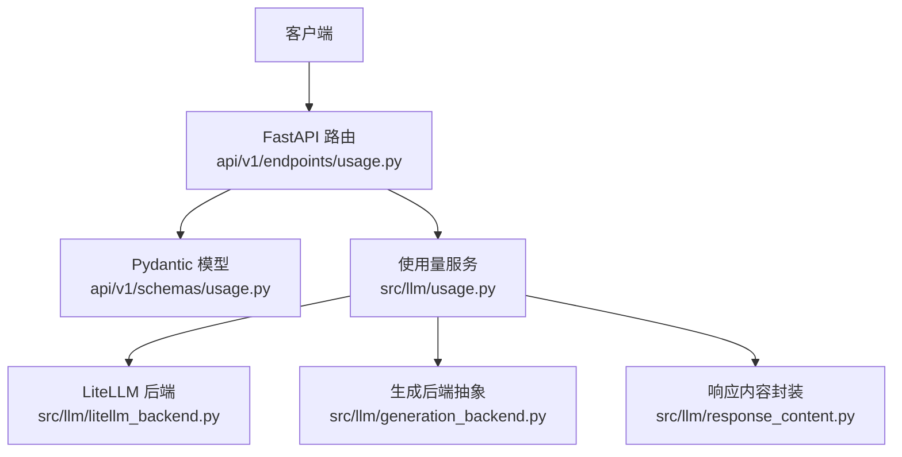
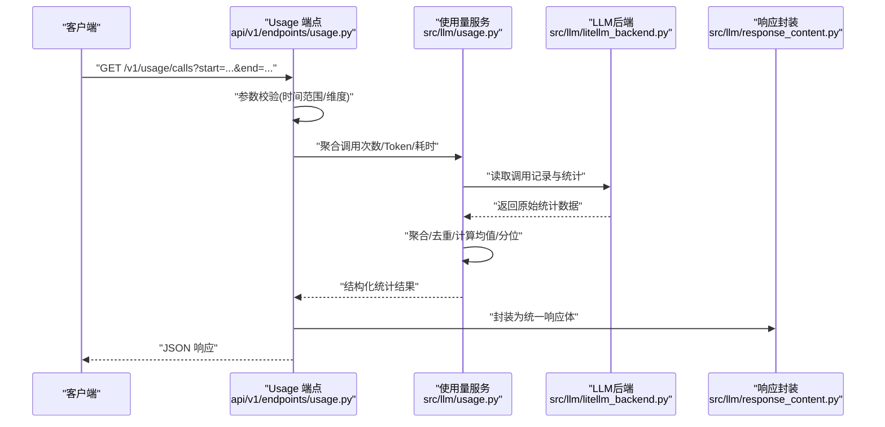
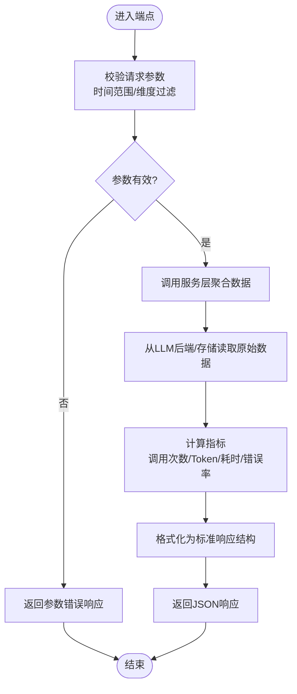
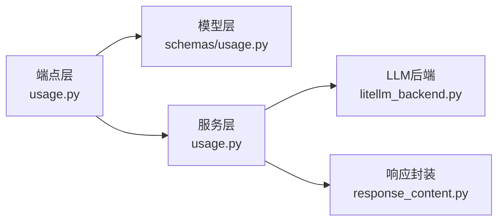

# 使用统计API

<cite>
**本文引用的文件**   
- [api/v1/endpoints/usage.py](file://api/v1/endpoints/usage.py)
- [api/v1/schemas/usage.py](file://api/v1/schemas/usage.py)
- [src/llm/usage.py](file://src/llm/usage.py)
- [src/llm/litellm_backend.py](file://src/llm/litellm_backend.py)
- [src/llm/generation_backend.py](file://src/llm/generation_backend.py)
- [src/llm/response_content.py](file://src/llm/response_content.py)
- [tests/test_usage_api.py](file://tests/test_usage_api.py)
</cite>

## 目录
1. [简介](#简介)
2. [项目结构](#项目结构)
3. [核心组件](#核心组件)
4. [架构总览](#架构总览)
5. [详细组件分析](#详细组件分析)
6. [依赖分析](#依赖分析)
7. [性能考虑](#性能考虑)
8. [故障排查指南](#故障排查指南)
9. [结论](#结论)
10. [附录](#附录)

## 简介
本文件面向“使用统计”相关API，覆盖LLM调用次数、token消耗与响应时间的查询方式，以及用户行为分析、性能监控与容量规划所需的接口说明。文档包含请求/响应示例（JSON结构）、实时统计、历史查询与趋势分析的实现要点，并提供数据聚合、缓存优化与查询性能调优建议，以及统计分析最佳实践与监控告警配置指引。

## 项目结构
与使用统计相关的后端实现主要位于以下位置：
- API端点定义：api/v1/endpoints/usage.py
- Pydantic模型与校验：api/v1/schemas/usage.py
- LLM使用量采集与聚合：src/llm/usage.py
- LLM后端集成（LiteLLM）：src/llm/litellm_backend.py, src/llm/generation_backend.py
- 响应内容封装：src/llm/response_content.py
- 接口测试用例：tests/test_usage_api.py

**图示来源** 
- [api/v1/endpoints/usage.py](file://api/v1/endpoints/usage.py)
- [api/v1/schemas/usage.py](file://api/v1/schemas/usage.py)
- [src/llm/usage.py](file://src/llm/usage.py)
- [src/llm/litellm_backend.py](file://src/llm/litellm_backend.py)
- [src/llm/generation_backend.py](file://src/llm/generation_backend.py)
- [src/llm/response_content.py](file://src/llm/response_content.py)

**章节来源**
- [api/v1/endpoints/usage.py](file://api/v1/endpoints/usage.py)
- [api/v1/schemas/usage.py](file://api/v1/schemas/usage.py)
- [src/llm/usage.py](file://src/llm/usage.py)

## 核心组件
- 使用统计API端点：提供查询调用次数、token用量、响应时间等指标的REST接口，支持按维度过滤（如模型、租户/用户、时间范围）。
- 使用量服务层：负责从LLM后端或存储中拉取原始使用量数据，进行聚合、去重、汇总与格式化。
- Pydantic模型：统一输入参数与输出结构的校验与序列化，确保接口契约稳定。
- LLM后端集成：通过LiteLLM获取实际调用统计（如请求数、token计数、耗时），并兼容不同提供商的字段差异。

**章节来源**
- [api/v1/endpoints/usage.py](file://api/v1/endpoints/usage.py)
- [api/v1/schemas/usage.py](file://api/v1/schemas/usage.py)
- [src/llm/usage.py](file://src/llm/usage.py)
- [src/llm/litellm_backend.py](file://src/llm/litellm_backend.py)

## 架构总览
下图展示了从HTTP请求到使用量数据聚合的关键流程，包括参数校验、服务层聚合、后端数据源访问与响应封装。

**图示来源** 
- [api/v1/endpoints/usage.py](file://api/v1/endpoints/usage.py)
- [src/llm/usage.py](file://src/llm/usage.py)
- [src/llm/litellm_backend.py](file://src/llm/litellm_backend.py)
- [src/llm/response_content.py](file://src/llm/response_content.py)

## 详细组件分析

### 使用统计端点（Usage Endpoints）
- 功能职责
  - 暴露REST接口用于查询LLM调用次数、token消耗、响应时间等指标。
  - 支持按时间范围、模型、租户/用户等维度过滤。
  - 提供实时统计与历史查询能力，并可返回趋势数据。
- 关键流程
  - 接收请求参数并进行Pydantic校验。
  - 调用使用量服务层执行聚合逻辑。
  - 将聚合结果封装为标准响应结构返回。
- 典型查询场景
  - 实时统计：最近N分钟/小时的调用量、平均响应时间、错误率。
  - 历史查询：指定起止时间的累计调用次数、token总量、P50/P95/P99耗时。
  - 趋势分析：按小时/天粒度聚合，返回时序数据供前端可视化。

**图示来源** 
- [api/v1/endpoints/usage.py](file://api/v1/endpoints/usage.py)
- [api/v1/schemas/usage.py](file://api/v1/schemas/usage.py)
- [src/llm/usage.py](file://src/llm/usage.py)

**章节来源**
- [api/v1/endpoints/usage.py](file://api/v1/endpoints/usage.py)
- [api/v1/schemas/usage.py](file://api/v1/schemas/usage.py)

### 使用量服务层（Usage Service）
- 功能职责
  - 聚合来自LLM后端的原始使用量数据，完成去重、分组、汇总与统计计算。
  - 提供统一的查询接口给端点层，屏蔽底层数据源差异。
- 关键算法与数据结构
  - 时间窗口聚合：按小时/天分组，计算累计值与分位数。
  - 维度聚合：按模型、租户/用户、区域等维度分组统计。
  - 错误率计算：失败请求占比，便于监控告警。
- 性能优化建议
  - 对热点查询启用内存缓存（TTL策略）。
  - 大时间范围查询采用分页或增量聚合。
  - 避免重复读取同一批原始数据，复用中间结果。

**章节来源**
- [src/llm/usage.py](file://src/llm/usage.py)

### LLM后端集成（LiteLLM Backend）
- 功能职责
  - 对接LiteLLM以获取各提供商的实际调用统计（请求数、token计数、耗时）。
  - 处理不同提供商字段差异，统一为内部数据结构。
- 数据映射
  - 将提供商返回的请求ID、模型名、输入/输出token数、耗时等映射为标准化字段。
  - 异常与超时情况下的降级策略（如返回部分可用指标）。

**章节来源**
- [src/llm/litellm_backend.py](file://src/llm/litellm_backend.py)
- [src/llm/generation_backend.py](file://src/llm/generation_backend.py)

### 响应内容封装（Response Content）
- 功能职责
  - 统一所有统计接口的响应结构，包含状态码、消息、数据体与元信息。
  - 保证前后端契约一致，便于前端解析与展示。
- 典型结构
  - 成功响应：包含统计数据对象与分页/时间戳等元信息。
  - 错误响应：包含错误码、错误信息与调试提示。

**章节来源**
- [src/llm/response_content.py](file://src/llm/response_content.py)

### 接口契约与示例（基于测试用例）
- 查询入口
  - GET /v1/usage/calls：查询调用次数、token消耗与响应时间等指标。
- 请求参数
  - start：起始时间（ISO 8601）
  - end：结束时间（ISO 8601）
  - model：可选，按模型过滤
  - tenant/user：可选，按租户或用户过滤
- 响应结构（示意）
  - data：统计结果对象，包含调用次数、token总量、平均/分位耗时、错误率等
  - meta：分页或时间范围等元信息
- 错误处理
  - 参数无效时返回4xx错误
  - 服务不可用或数据缺失时返回5xx错误

**章节来源**
- [tests/test_usage_api.py](file://tests/test_usage_api.py)

## 依赖分析
- 模块耦合
  - 端点层依赖Pydantic模型与服务层，服务层依赖LLM后端与响应封装。
  - 低内聚高内聚：每个模块职责清晰，依赖方向单向。
- 外部依赖
  - LiteLLM：用于跨提供商的LLM调用与统计收集。
  - 存储/缓存：用于历史数据持久化与热点查询加速（按需实现）。
- 潜在风险
  - 循环依赖：需确保服务层不反向依赖端点层。
  - 外部依赖变更：LiteLLM字段变化需适配映射层。

**图示来源** 
- [api/v1/endpoints/usage.py](file://api/v1/endpoints/usage.py)
- [api/v1/schemas/usage.py](file://api/v1/schemas/usage.py)
- [src/llm/usage.py](file://src/llm/usage.py)
- [src/llm/litellm_backend.py](file://src/llm/litellm_backend.py)
- [src/llm/response_content.py](file://src/llm/response_content.py)

**章节来源**
- [api/v1/endpoints/usage.py](file://api/v1/endpoints/usage.py)
- [src/llm/usage.py](file://src/llm/usage.py)
- [src/llm/litellm_backend.py](file://src/llm/litellm_backend.py)

## 性能考虑
- 数据聚合
  - 优先在数据源侧进行过滤与聚合，减少传输与计算开销。
  - 对高频维度建立索引（如时间、模型、租户）。
- 缓存优化
  - 对实时统计设置短TTL缓存（如1-5分钟）。
  - 对历史查询结果按查询条件缓存，避免重复计算。
- 查询性能调优
  - 限制最大时间跨度，强制分页或分批查询。
  - 使用异步I/O提升并发处理能力。
  - 对分位数计算采用近似算法（如t-digest）以降低CPU占用。

[本节为通用性能建议，不直接分析具体文件]

## 故障排查指南
- 常见问题
  - 参数校验失败：检查时间范围格式与必填字段。
  - 数据缺失：确认LLM后端是否上报完整统计，必要时降级显示可用指标。
  - 性能抖动：检查缓存命中率与数据库慢查询。
- 定位步骤
  - 查看端点日志，确认请求参数与调用链。
  - 检查服务层聚合逻辑与中间结果。
  - 核对LLM后端返回字段映射是否正确。
- 告警建议
  - 错误率阈值：超过设定阈值触发告警。
  - 延迟阈值：P95/P99耗时超阈告警。
  - 资源使用：token消耗突增告警，防止成本失控。

**章节来源**
- [tests/test_usage_api.py](file://tests/test_usage_api.py)

## 结论
使用统计API通过清晰的端点设计、健壮的服务层聚合与稳定的响应封装，提供了完整的LLM调用次数、token消耗与响应时间查询能力。结合缓存与索引优化，可实现高效的实时统计与历史查询。建议在生产环境部署完善的监控与告警体系，保障系统稳定性与成本可控。

[本节为总结性内容，不直接分析具体文件]

## 附录
- 最佳实践
  - 统一模型命名与租户隔离，便于多维度分析。
  - 定期清理过期历史数据，控制存储成本。
  - 对敏感统计信息进行脱敏与权限控制。
- 监控告警配置
  - 指标：调用次数、token总量、平均/分位耗时、错误率。
  - 阈值：根据业务峰值与SLA设定合理阈值。
  - 通知渠道：邮件、企业微信、钉钉等。

[本节为补充性内容，不直接分析具体文件]