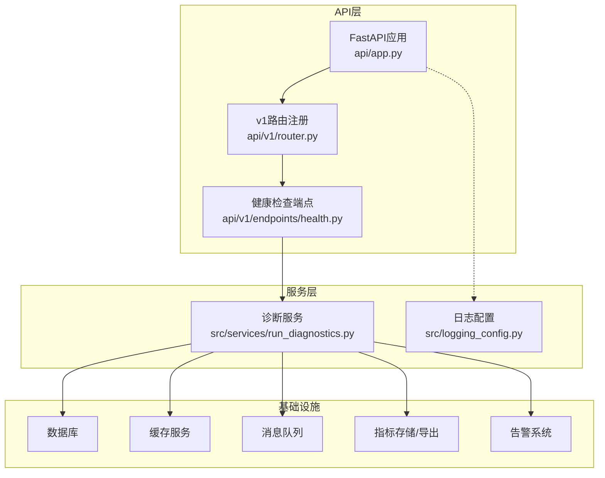
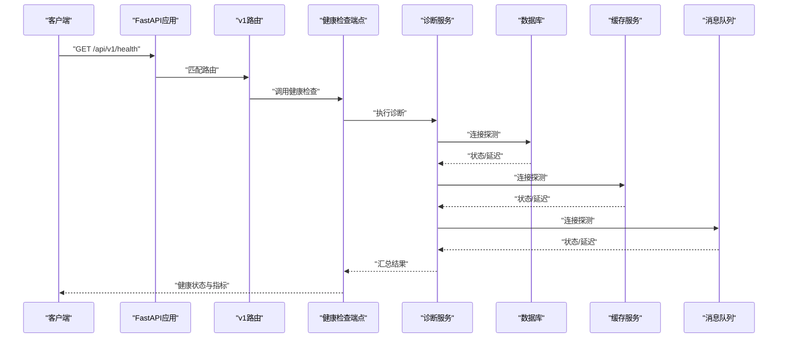
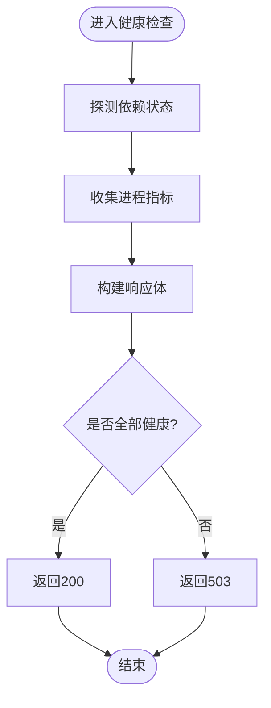
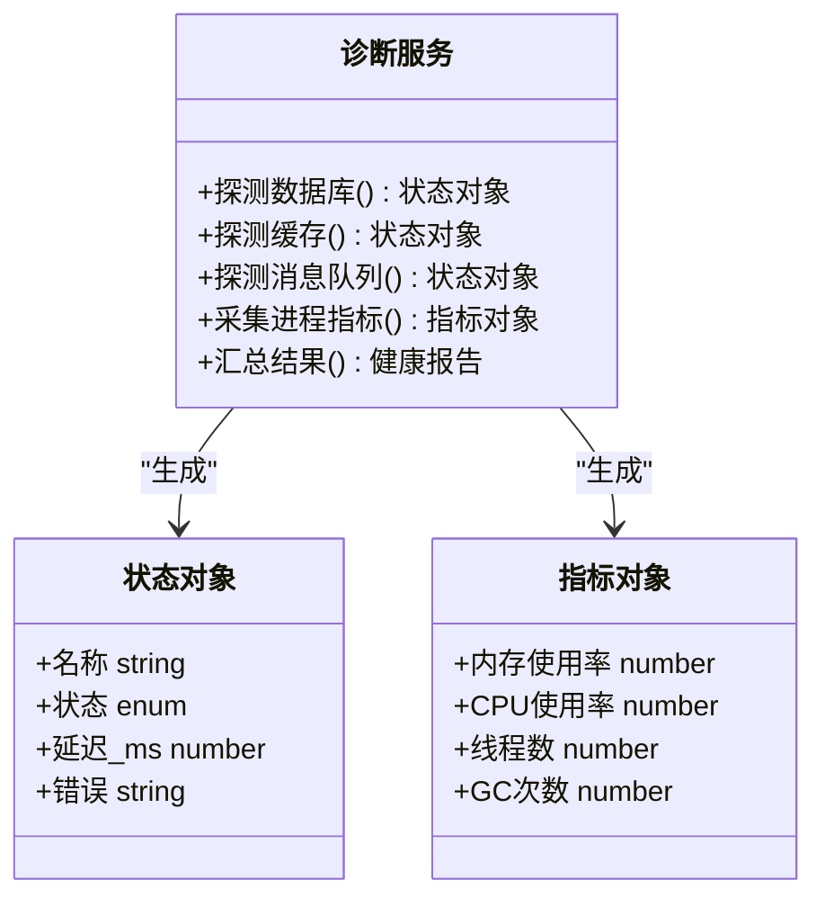
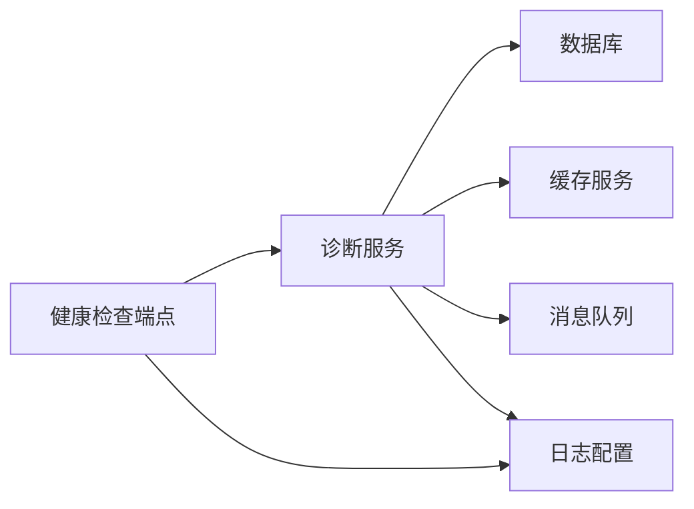

# 健康检查与监控API

<cite>
**本文档引用的文件**   
- [api/v1/endpoints/health.py](file://api/v1/endpoints/health.py)
- [api/v1/router.py](file://api/v1/router.py)
- [api/app.py](file://api/app.py)
- [src/services/run_diagnostics.py](file://src/services/run_diagnostics.py)
- [src/logging_config.py](file://src/logging_config.py)
- [docker/docker-compose.yml](file://docker/docker-compose.yml)
- [tests/test_api_health.py](file://tests/test_api_health.py)
</cite>

## 目录
1. [简介](#简介)
2. [项目结构](#项目结构)
3. [核心组件](#核心组件)
4. [架构总览](#架构总览)
5. [详细组件分析](#详细组件分析)
6. [依赖关系分析](#依赖关系分析)
7. [性能考量](#性能考量)
8. [故障排查指南](#故障排查指南)
9. [结论](#结论)
10. [附录](#附录)

## 简介
本文件面向运维与开发者，系统化说明“健康检查与系统监控”相关API的设计、实现与使用方式。内容覆盖：
- 系统状态检查（进程、依赖、资源）
- 服务依赖检测（数据库、缓存、消息队列等）
- 性能指标查询（请求耗时、错误率、队列积压等）
- 日志查询与诊断信息获取
- 实时监控、告警触发与自动恢复机制
- 监控数据持久化、可视化与分析
- 部署与配置最佳实践

## 项目结构
与健康检查和监控相关的后端能力主要位于以下位置：
- API路由与端点：api/v1/endpoints/health.py、api/v1/router.py、api/app.py
- 诊断服务：src/services/run_diagnostics.py
- 日志配置：src/logging_config.py
- 容器编排：docker/docker-compose.yml
- 健康检查测试用例：tests/test_api_health.py

**图表来源** 
- [api/app.py](file://api/app.py)
- [api/v1/router.py](file://api/v1/router.py)
- [api/v1/endpoints/health.py](file://api/v1/endpoints/health.py)
- [src/services/run_diagnostics.py](file://src/services/run_diagnostics.py)
- [src/logging_config.py](file://src/logging_config.py)

**章节来源**
- [api/v1/endpoints/health.py](file://api/v1/endpoints/health.py)
- [api/v1/router.py](file://api/v1/router.py)
- [api/app.py](file://api/app.py)
- [src/services/run_diagnostics.py](file://src/services/run_diagnostics.py)
- [src/logging_config.py](file://src/logging_config.py)

## 核心组件
- 健康检查端点：提供统一的系统健康入口，聚合各子系统状态，返回标准化结果。
- 诊断服务：封装对数据库、缓存、消息队列等外部依赖的探测逻辑，汇总指标与异常。
- 日志配置：统一日志输出格式、级别与目标，便于集中采集与检索。
- 容器编排：定义运行环境、环境变量、探针与依赖启动顺序，支撑可观测性落地。

**章节来源**
- [api/v1/endpoints/health.py](file://api/v1/endpoints/health.py)
- [src/services/run_diagnostics.py](file://src/services/run_diagnostics.py)
- [src/logging_config.py](file://src/logging_config.py)
- [docker/docker-compose.yml](file://docker/docker-compose.yml)

## 架构总览
健康检查与监控的整体流程如下：
- 客户端调用健康检查接口
- 路由将请求分发至健康检查端点
- 端点调用诊断服务执行依赖探测与指标收集
- 诊断服务汇总结果并返回结构化响应
- 日志与指标通过统一配置进行持久化与导出

**图表来源** 
- [api/app.py](file://api/app.py)
- [api/v1/router.py](file://api/v1/router.py)
- [api/v1/endpoints/health.py](file://api/v1/endpoints/health.py)
- [src/services/run_diagnostics.py](file://src/services/run_diagnostics.py)

## 详细组件分析

### 健康检查端点（/api/v1/health）
- 功能：聚合系统整体健康状态、依赖状态、关键指标摘要。
- 典型行为：
  - 校验各依赖连通性与延迟
  - 收集进程级指标（内存、CPU、线程数）
  - 返回统一的结构化JSON，包含状态码、时间戳、版本、依赖详情与指标
- 建议的状态码：
  - 200：全部健康
  - 503：部分或全部依赖不可用
  - 500：内部错误（如诊断服务异常）

**图表来源** 
- [api/v1/endpoints/health.py](file://api/v1/endpoints/health.py)

**章节来源**
- [api/v1/endpoints/health.py](file://api/v1/endpoints/health.py)

### 诊断服务（依赖探测与指标采集）
- 功能：对数据库、缓存、消息队列等进行连通性与时延探测；采集关键运行时指标。
- 关键点：
  - 超时控制与重试策略
  - 错误分类（网络、认证、权限、容量）
  - 指标标准化（延迟、错误率、队列长度、连接池使用率）
- 扩展点：新增依赖时，在诊断服务中注册新的探测函数即可。

**图表来源** 
- [src/services/run_diagnostics.py](file://src/services/run_diagnostics.py)

**章节来源**
- [src/services/run_diagnostics.py](file://src/services/run_diagnostics.py)

### 日志配置（统一采集与检索）
- 功能：统一日志格式、级别、输出目标（控制台、文件、远程采集器）。
- 关键点：
  - 结构化日志字段（trace_id、service、level、message、context）
  - 按模块与级别分离输出
  - 支持动态调整日志级别（热更新）

**章节来源**
- [src/logging_config.py](file://src/logging_config.py)

### 容器编排（探针与依赖管理）
- 功能：定义服务启动顺序、健康探针、环境变量与资源限制。
- 关键点：
  - readiness/liveness探针指向健康检查端点
  - 依赖服务（DB、Cache、MQ）就绪后再启动主服务
  - 资源配额与重启策略

**章节来源**
- [docker/docker-compose.yml](file://docker/docker-compose.yml)

### 健康检查测试用例（契约验证）
- 功能：验证健康检查接口的响应结构与状态码符合预期。
- 关键点：
  - 模拟依赖正常与异常场景
  - 断言关键字段存在性与类型
  - 覆盖超时与错误路径

**章节来源**
- [tests/test_api_health.py](file://tests/test_api_health.py)

## 依赖关系分析
健康检查与监控涉及的组件耦合关系如下：
- 健康检查端点依赖诊断服务
- 诊断服务依赖数据库、缓存、消息队列等外部组件
- 日志配置贯穿全链路，用于问题定位与审计
- 容器编排保障依赖启动顺序与探针生效

**图表来源** 
- [api/v1/endpoints/health.py](file://api/v1/endpoints/health.py)
- [src/services/run_diagnostics.py](file://src/services/run_diagnostics.py)
- [src/logging_config.py](file://src/logging_config.py)

**章节来源**
- [api/v1/endpoints/health.py](file://api/v1/endpoints/health.py)
- [src/services/run_diagnostics.py](file://src/services/run_diagnostics.py)
- [src/logging_config.py](file://src/logging_config.py)

## 性能考量
- 健康检查应轻量快速，避免阻塞主业务线程
- 依赖探测需设置合理超时与重试上限
- 指标采集采用异步与批处理，降低开销
- 对高频访问的健康接口启用缓存与限流
- 监控数据写入采用缓冲与批量落盘

[本节为通用指导，不直接分析具体文件]

## 故障排查指南
- 常见问题：
  - 依赖不可达：检查网络、认证、端口与防火墙规则
  - 高延迟：关注连接池大小、慢查询、队列积压
  - 内存/CPU飙升：定位热点请求与GC频繁原因
- 排查步骤：
  - 查看健康检查响应中的依赖状态与延迟
  - 检索结构化日志，过滤trace_id定位问题链路
  - 检查容器探针状态与重启记录
  - 核对指标趋势（错误率、延迟、队列长度）

**章节来源**
- [src/logging_config.py](file://src/logging_config.py)
- [docker/docker-compose.yml](file://docker/docker-compose.yml)

## 结论
健康检查与监控系统以统一接口暴露系统状态，结合诊断服务对关键依赖进行探测与指标采集，配合结构化日志与容器编排，形成完整的可观测性闭环。通过合理的超时、重试、缓存与限流策略，确保健康检查的高效与稳定。

[本节为总结性内容，不直接分析具体文件]

## 附录

### API规范（健康检查）
- 接口：GET /api/v1/health
- 成功响应（200）：
  - status: "healthy"
  - timestamp: ISO时间戳
  - version: 服务版本
  - dependencies: 各依赖对象数组（名称、状态、延迟、错误信息）
  - metrics: 进程指标（内存、CPU、线程、GC）
- 失败响应（503/500）：
  - status: "unhealthy"/"error"
  - timestamp: ISO时间戳
  - error: 错误描述
  - dependencies: 未通过项详情
  - metrics: 可用指标

[本节为概念性规范，不直接分析具体文件]

### 实时监控、告警与自动恢复
- 实时监控：
  - 通过健康检查端点轮询或SSE推送状态变化
  - 指标采集后写入时序数据库，供可视化展示
- 告警触发：
  - 基于阈值（延迟、错误率、队列长度）触发告警
  - 多渠道通知（邮件、IM、Webhook）
- 自动恢复：
  - 依赖服务重启、连接池扩容、降级策略
  - 健康探针失败时触发滚动重启或流量切换

[本节为概念性设计，不直接分析具体文件]

### 监控数据持久化、可视化与分析
- 持久化：
  - 指标写入时序数据库（如Prometheus/TimescaleDB）
  - 日志集中到ELK/ Loki
- 可视化：
  - Grafana仪表盘展示健康状态、延迟、错误率
  - 自定义面板聚焦关键依赖与瓶颈
- 分析：
  - 趋势分析与根因定位
  - 容量规划与弹性伸缩依据

[本节为概念性设计，不直接分析具体文件]

### 部署与配置最佳实践
- 容器编排：
  - 明确依赖启动顺序与探针
  - 设置资源限制与重启策略
- 环境变量：
  - 敏感信息通过密钥管理
  - 区分开发、测试、生产配置
- 可观测性：
  - 统一日志格式与采集
  - 指标命名规范与标签维度

**章节来源**
- [docker/docker-compose.yml](file://docker/docker-compose.yml)