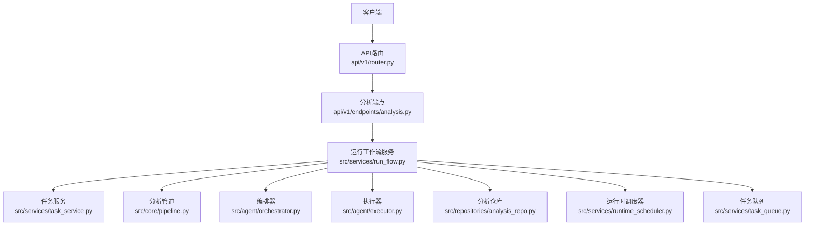
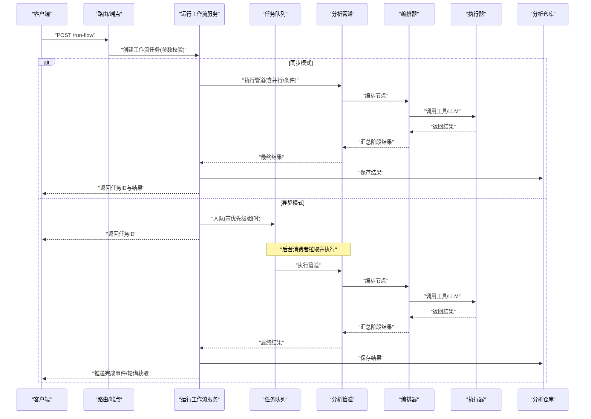
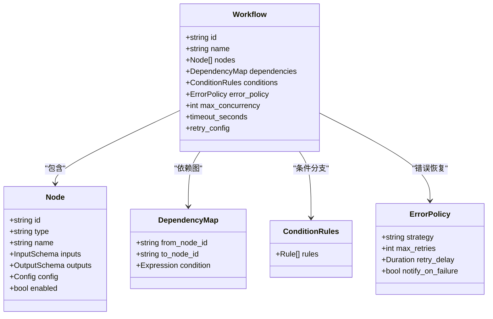
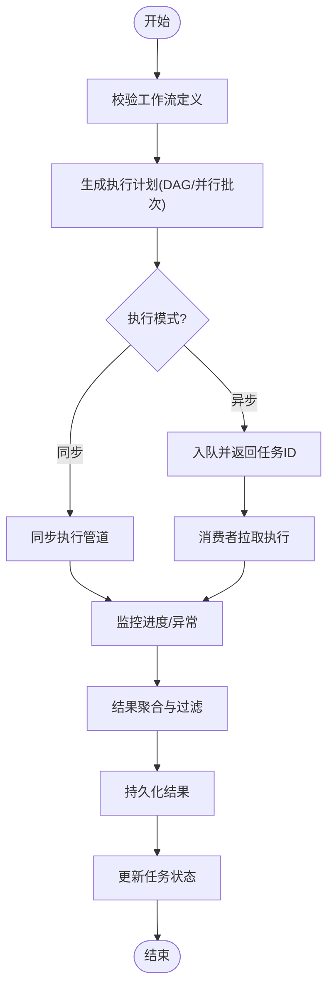
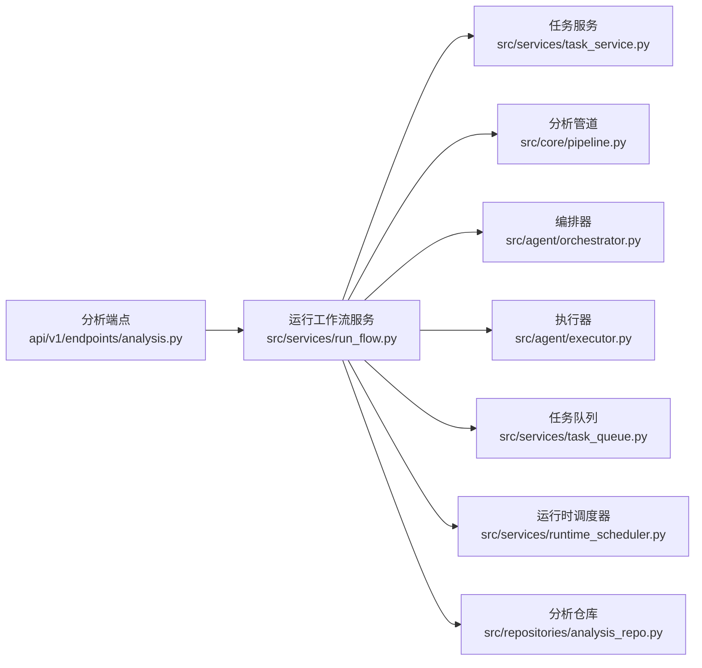

# 分析工作流API

<cite>
**本文档引用的文件**
- [api/v1/endpoints/analysis.py](file://api/v1/endpoints/analysis.py)
- [api/v1/schemas/run_flow.py](file://api/v1/schemas/run_flow.py)
- [src/services/run_flow.py](file://src/services/run_flow.py)
- [src/services/task_service.py](file://src/services/task_service.py)
- [src/core/pipeline.py](file://src/core/pipeline.py)
- [api/v1/router.py](file://api/v1/router.py)
- [src/services/runtime_scheduler.py](file://src/services/runtime_scheduler.py)
- [src/services/task_queue.py](file://src/services/task_queue.py)
- [src/agent/orchestrator.py](file://src/agent/orchestrator.py)
- [src/agent/executor.py](file://src/agent/executor.py)
- [src/repositories/analysis_repo.py](file://src/repositories/analysis_repo.py)
</cite>

## 目录
1. [简介](#简介)
2. [项目结构](#项目结构)
3. [核心组件](#核心组件)
4. [架构总览](#架构总览)
5. [详细组件分析](#详细组件分析)
6. [依赖关系分析](#依赖关系分析)
7. [性能考虑](#性能考虑)
8. [故障排查指南](#故障排查指南)
9. [结论](#结论)
10. [附录](#附录)

## 简介
本文件面向“分析工作流”相关API，覆盖多步骤分析流程编排、任务调度、结果聚合、异步状态与进度跟踪、并行处理、条件分支与错误恢复等能力。文档提供接口调用方法、工作流定义格式、监控调试与性能优化最佳实践，帮助快速集成和扩展复杂分析场景（组合分析、条件触发、结果过滤等）。

## 项目结构
围绕分析工作流的代码主要分布在以下模块：
- API层：路由与请求/响应模型定义
- 服务层：工作流执行、任务队列与调度、运行时调度器
- 核心层：管道编排、执行引擎
- 存储层：分析结果持久化
- Agent层：编排与执行（可选扩展）

**图示来源**
- [api/v1/router.py](file://api/v1/router.py)
- [api/v1/endpoints/analysis.py](file://api/v1/endpoints/analysis.py)
- [src/services/run_flow.py](file://src/services/run_flow.py)
- [src/core/pipeline.py](file://src/core/pipeline.py)
- [src/agent/orchestrator.py](file://src/agent/orchestrator.py)
- [src/agent/executor.py](file://src/agent/executor.py)
- [src/repositories/analysis_repo.py](file://src/repositories/analysis_repo.py)
- [src/services/runtime_scheduler.py](file://src/services/runtime_scheduler.py)
- [src/services/task_queue.py](file://src/services/task_queue.py)

**章节来源**
- [api/v1/router.py](file://api/v1/router.py)
- [api/v1/endpoints/analysis.py](file://api/v1/endpoints/analysis.py)
- [src/services/run_flow.py](file://src/services/run_flow.py)
- [src/core/pipeline.py](file://src/core/pipeline.py)

## 核心组件
- 工作流定义与校验：通过Pydantic模型描述工作流结构、节点配置、依赖与条件分支
- 工作流执行服务：负责解析、验证、提交任务到队列或同步执行，并管理生命周期
- 任务服务：封装任务创建、查询、取消、重试、分页与状态更新
- 分析管道：按拓扑顺序执行节点，支持并行度控制、失败策略与结果聚合
- 运行时调度器：定时/事件驱动触发工作流，支持并发与限流
- 任务队列：异步任务缓冲与消费者调度
- 编排器与执行器：Agent侧的编排与工具执行（可扩展至LLM/外部服务）
- 分析仓库：结果持久化与历史查询

**章节来源**
- [api/v1/schemas/run_flow.py](file://api/v1/schemas/run_flow.py)
- [src/services/run_flow.py](file://src/services/run_flow.py)
- [src/services/task_service.py](file://src/services/task_service.py)
- [src/core/pipeline.py](file://src/core/pipeline.py)
- [src/services/runtime_scheduler.py](file://src/services/runtime_scheduler.py)
- [src/services/task_queue.py](file://src/services/task_queue.py)
- [src/agent/orchestrator.py](file://src/agent/orchestrator.py)
- [src/agent/executor.py](file://src/agent/executor.py)
- [src/repositories/analysis_repo.py](file://src/repositories/analysis_repo.py)

## 架构总览
下图展示了从API到执行与落库的完整链路，以及异步任务的流转路径。

**图示来源**
- [api/v1/endpoints/analysis.py](file://api/v1/endpoints/analysis.py)
- [src/services/run_flow.py](file://src/services/run_flow.py)
- [src/core/pipeline.py](file://src/core/pipeline.py)
- [src/agent/orchestrator.py](file://src/agent/orchestrator.py)
- [src/agent/executor.py](file://src/agent/executor.py)
- [src/repositories/analysis_repo.py](file://src/repositories/analysis_repo.py)
- [src/services/task_queue.py](file://src/services/task_queue.py)

## 详细组件分析

### 工作流定义与校验（Schema）
- 工作流对象包含：元数据、节点列表、依赖图、条件分支、错误恢复策略、并行度限制、超时与重试
- 节点类型：数据获取、指标计算、信号生成、报告渲染、通知等
- 条件分支：基于上游输出字段进行布尔表达式判断
- 错误恢复：跳过、回退、重试、告警
- 输入/输出契约：每个节点声明输入键与输出键，便于管道自动装配

**图示来源**
- [api/v1/schemas/run_flow.py](file://api/v1/schemas/run_flow.py)

**章节来源**
- [api/v1/schemas/run_flow.py](file://api/v1/schemas/run_flow.py)

### 工作流执行服务（Run Flow Service）
职责：
- 接收工作流定义，校验并转换为内部执行计划
- 选择同步或异步执行路径
- 管理任务生命周期（创建、运行、完成、失败、取消）
- 聚合各节点结果，应用条件分支与错误恢复策略
- 将最终结果写入仓库，并返回任务ID与状态

关键流程：
- 创建任务：分配ID、记录初始状态、持久化上下文
- 执行计划：构建DAG、计算并行批次、注入环境变量与凭据
- 执行与监控：上报进度、捕获异常、记录追踪信息
- 结果聚合：合并中间产物、过滤无效结果、生成最终报告
- 清理与归档：释放资源、归档日志、更新统计

**图示来源**
- [src/services/run_flow.py](file://src/services/run_flow.py)
- [src/core/pipeline.py](file://src/core/pipeline.py)
- [src/services/task_queue.py](file://src/services/task_queue.py)

**章节来源**
- [src/services/run_flow.py](file://src/services/run_flow.py)

### 任务服务（Task Service）
功能：
- 任务CRUD：创建、查询、更新、删除
- 状态机：待处理、运行中、成功、失败、已取消
- 进度跟踪：百分比、当前节点、耗时、错误堆栈
- 重试与取消：幂等重试、优雅取消、补偿操作
- 分页与筛选：按时间、状态、标签筛选

典型接口行为：
- 创建任务：返回唯一ID与初始状态
- 查询任务：支持按ID、状态、时间范围查询
- 更新状态：原子更新，避免竞态
- 取消任务：标记为取消并通知消费者退出

**章节来源**
- [src/services/task_service.py](file://src/services/task_service.py)

### 分析管道（Pipeline）
能力：
- DAG拓扑排序与批内并行执行
- 节点间数据传递与变量注入
- 条件分支与短路逻辑
- 失败策略：fail-fast、fail-skip、fail-warn
- 资源隔离与超时控制
- 可观测性：节点级耗时、吞吐、错误率

执行要点：
- 构建依赖图，检测环路与不可达节点
- 计算最大并行度，避免资源争用
- 动态加载节点实现，支持插件化扩展
- 中间结果缓存与增量更新

**章节来源**
- [src/core/pipeline.py](file://src/core/pipeline.py)

### 运行时调度器（Runtime Scheduler）
职责：
- 定时触发工作流（cron/间隔）
- 事件驱动触发（市场开盘、数据就绪）
- 并发控制与限流
- 健康检查与自愈重启

使用方式：
- 注册工作流模板与触发规则
- 启动调度器，监听事件源
- 动态启停与热更新配置

**章节来源**
- [src/services/runtime_scheduler.py](file://src/services/runtime_scheduler.py)

### 任务队列（Task Queue）
特性：
- 高可靠消息传输（至少一次语义）
- 优先级队列与死信队列
- 消费者组与负载均衡
- 背压与削峰

**章节来源**
- [src/services/task_queue.py](file://src/services/task_queue.py)

### 编排器与执行器（Orchestrator & Executor）
- 编排器：根据DAG决定执行顺序，注入上下文，处理分支与汇聚
- 执行器：调用具体工具或LLM后端，统一返回结构与错误码
- 支持重试、熔断、降级与追踪

**章节来源**
- [src/agent/orchestrator.py](file://src/agent/orchestrator.py)
- [src/agent/executor.py](file://src/agent/executor.py)

### 分析仓库（Analysis Repository）
- 结果持久化：结构化结果、原始数据、日志摘要
- 版本化：工作流版本与参数快照
- 查询索引：按时间、标的、策略维度检索
- 归档与清理：冷热分层、保留策略

**章节来源**
- [src/repositories/analysis_repo.py](file://src/repositories/analysis_repo.py)

## 依赖关系分析

**图示来源**
- [api/v1/endpoints/analysis.py](file://api/v1/endpoints/analysis.py)
- [src/services/run_flow.py](file://src/services/run_flow.py)
- [src/services/task_service.py](file://src/services/task_service.py)
- [src/core/pipeline.py](file://src/core/pipeline.py)
- [src/agent/orchestrator.py](file://src/agent/orchestrator.py)
- [src/agent/executor.py](file://src/agent/executor.py)
- [src/services/task_queue.py](file://src/services/task_queue.py)
- [src/services/runtime_scheduler.py](file://src/services/runtime_scheduler.py)
- [src/repositories/analysis_repo.py](file://src/repositories/analysis_repo.py)

**章节来源**
- [api/v1/router.py](file://api/v1/router.py)
- [api/v1/endpoints/analysis.py](file://api/v1/endpoints/analysis.py)
- [src/services/run_flow.py](file://src/services/run_flow.py)

## 性能考虑
- 并行度调优：依据CPU/IO比例设置max_concurrency，避免过度竞争
- 节点超时与重试：合理设置超时与指数退避，降低雪崩风险
- 结果缓存：对读多写少的节点启用缓存，减少重复计算
- 批量处理：合并小任务，提高吞吐
- 背压与限流：在高峰期限制入队速率，保护下游
- 资源隔离：不同工作流使用独立线程池/进程池
- 监控指标：节点耗时、成功率、队列长度、消费者延迟

[本节为通用指导，不直接分析具体文件]

## 故障排查指南
常见问题与定位方法：
- 任务卡住：检查队列消费者是否存活、是否有死锁或阻塞I/O
- 节点失败：查看错误堆栈与重试次数，确认依赖数据可用性
- 条件分支未生效：核对表达式语法与上游输出键名
- 结果缺失：检查聚合逻辑与过滤条件，确认中间产物是否被丢弃
- 性能抖动：观察CPU/内存/网络指标，调整并行度与超时

建议操作：
- 启用详细日志与追踪ID
- 使用只读副本查询历史任务
- 对关键节点增加断言与边界检查
- 引入熔断与降级策略

**章节来源**
- [src/services/task_service.py](file://src/services/task_service.py)
- [src/core/pipeline.py](file://src/core/pipeline.py)
- [src/services/run_flow.py](file://src/services/run_flow.py)

## 结论
本工作流API提供了完整的分析流水线能力，涵盖定义、编排、调度、执行、聚合与持久化。通过清晰的接口与可扩展的组件设计，能够支撑复杂的组合分析、条件触发与结果过滤场景。配合完善的监控与性能优化手段，可在生产环境中稳定高效地运行。

[本节为总结性内容，不直接分析具体文件]

## 附录

### API调用示例（概念性说明）
- 创建工作流任务
  - 方法：POST
  - 路径：/run-flow
  - 请求体：工作流定义（节点、依赖、条件、错误策略、并行度、超时）
  - 响应：任务ID、初始状态、预计完成时间
- 查询任务状态
  - 方法：GET
  - 路径：/tasks/{task_id}
  - 响应：状态、进度、当前节点、错误信息（如有）
- 取消任务
  - 方法：POST
  - 路径：/tasks/{task_id}/cancel
  - 响应：确认取消、剩余处理时间
- 获取结果
  - 方法：GET
  - 路径：/results/{task_id}
  - 响应：聚合后的分析报告、指标与图表链接

[本节为概念性说明，不直接分析具体文件]

### 工作流定义格式（字段说明）
- 元数据：id、name、version、tags
- 节点：id、type、name、inputs、outputs、config、enabled
- 依赖：from_node_id、to_node_id、condition
- 条件：rules数组，包含表达式与动作
- 错误策略：strategy、max_retries、retry_delay、notify_on_failure
- 执行选项：max_concurrency、timeout_seconds、retry_config

[本节为概念性说明，不直接分析具体文件]

### 复杂场景示例
- 组合分析：多个数据源并行获取，指标计算后汇聚，生成综合评分
- 条件触发：当某指标超过阈值时，触发深度分析与报告生成
- 结果过滤：根据质量评分过滤低置信度信号，仅输出高质量结果
- 错误恢复：部分节点失败时跳过并继续，最终报告标注缺失项

[本节为概念性说明，不直接分析具体文件]

### 监控与调试最佳实践
- 全链路追踪：为每个任务分配唯一ID，贯穿API、队列、管道与仓库
- 指标采集：节点耗时、成功率、队列长度、消费者延迟
- 告警规则：失败率阈值、长时间无进展、队列积压
- 调试工具：回放任务、模拟输入、单步执行节点

[本节为概念性说明，不直接分析具体文件]