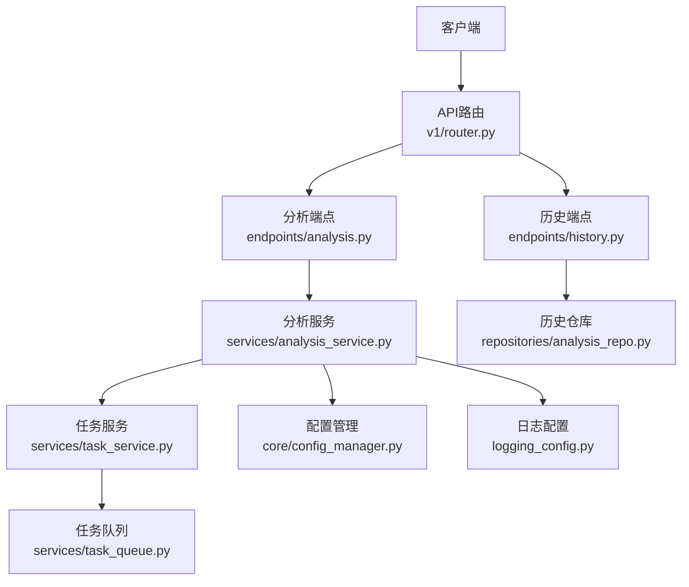
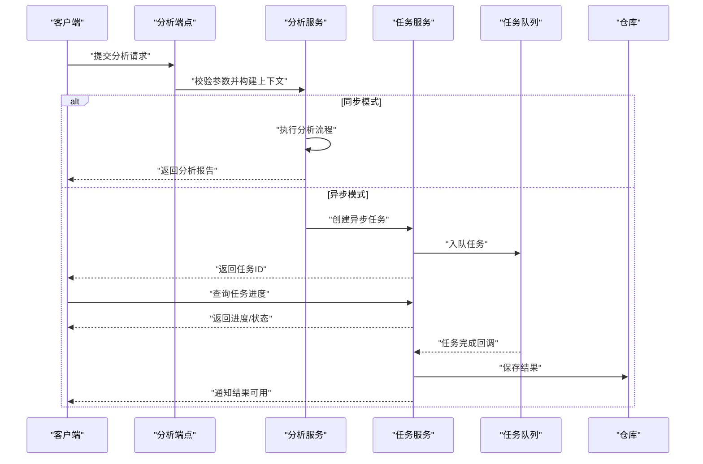
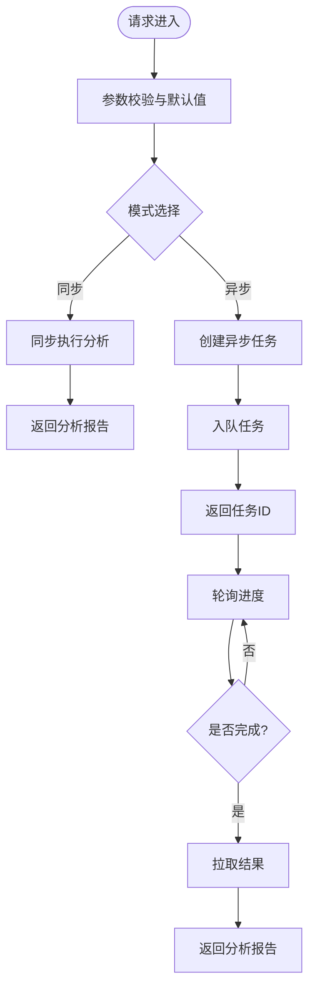
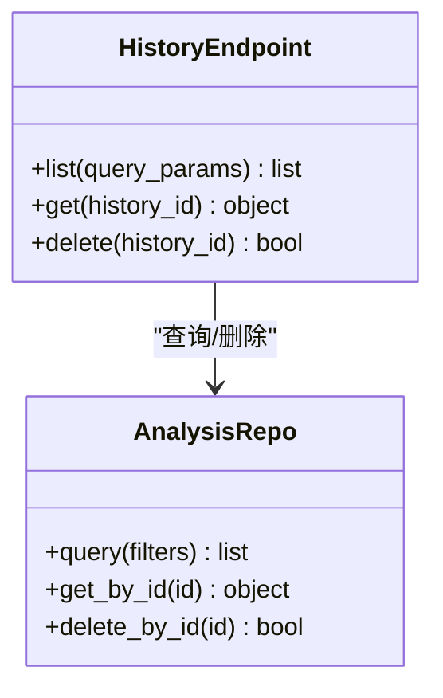
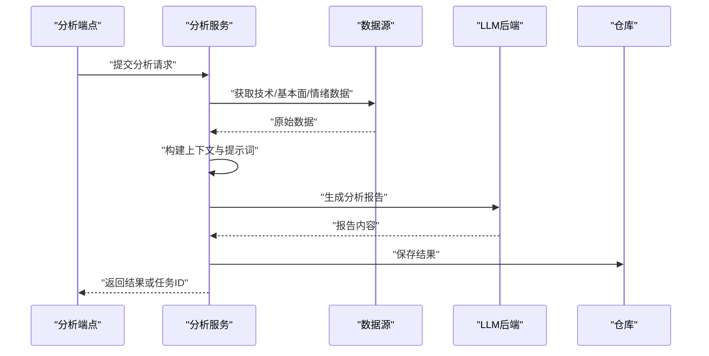
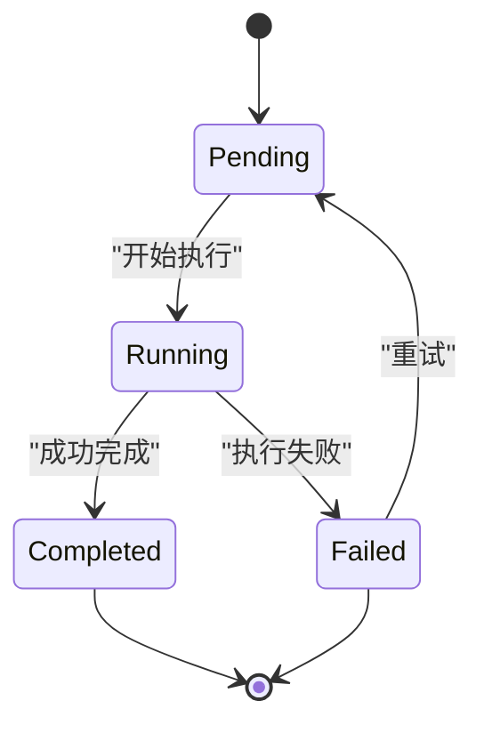
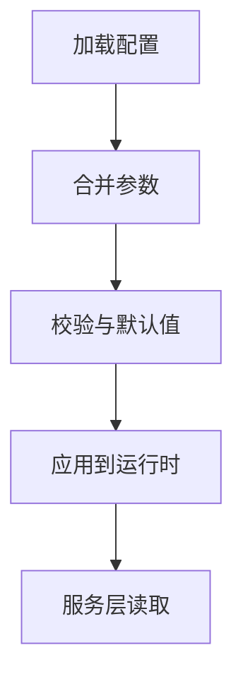
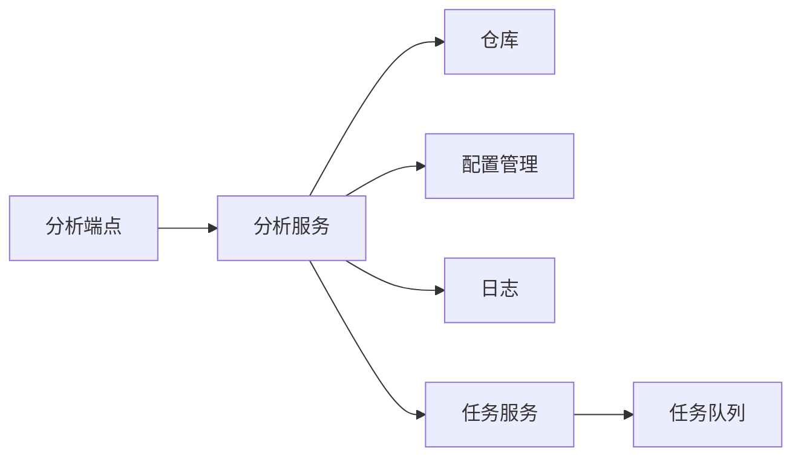

# 分析引擎API

<cite>
**本文引用的文件**   
- [api/app.py](file://api/app.py)
- [api/v1/router.py](file://api/v1/router.py)
- [api/v1/endpoints/analysis.py](file://api/v1/endpoints/analysis.py)
- [api/v1/schemas/analysis.py](file://api/v1/schemas/analysis.py)
- [api/v1/endpoints/history.py](file://api/v1/endpoints/history.py)
- [api/v1/schemas/history.py](file://api/v1/schemas/history.py)
- [src/services/analysis_service.py](file://src/services/analysis_service.py)
- [src/services/task_service.py](file://src/services/task_service.py)
- [src/services/task_queue.py](file://src/services/task_queue.py)
- [src/repositories/analysis_repo.py](file://src/repositories/analysis_repo.py)
- [src/core/config_manager.py](file://src/core/config_manager.py)
- [src/logging_config.py](file://src/logging_config.py)
</cite>

## 目录
1. [简介](#简介)
2. [项目结构](#项目结构)
3. [核心组件](#核心组件)
4. [架构总览](#架构总览)
5. [详细组件分析](#详细组件分析)
6. [依赖关系分析](#依赖关系分析)
7. [性能考虑](#性能考虑)
8. [故障排查指南](#故障排查指南)
9. [结论](#结论)
10. [附录](#附录)

## 简介
本文件面向“分析引擎”的API使用与集成，覆盖技术分析、基本面分析、情绪分析等能力，以及分析报告生成、结果查询与历史记录管理。文档提供：
- 接口定义与调用方式（请求/响应示例）
- 自定义分析参数与高级选项配置方法
- 异步任务处理、进度查询与结果回调机制
- 客户端集成示例与错误处理方案
- 性能调优与并发处理建议

## 项目结构
分析引擎API基于模块化分层设计：
- API层：路由、中间件、请求校验与响应封装
- 服务层：业务编排、任务调度、数据聚合
- 存储层：分析结果持久化与历史查询
- 配置与日志：系统配置、运行期参数、日志输出

**图表来源**
- [api/v1/router.py](file://api/v1/router.py)
- [api/v1/endpoints/analysis.py](file://api/v1/endpoints/analysis.py)
- [api/v1/endpoints/history.py](file://api/v1/endpoints/history.py)
- [src/services/analysis_service.py](file://src/services/analysis_service.py)
- [src/services/task_service.py](file://src/services/task_service.py)
- [src/services/task_queue.py](file://src/services/task_queue.py)
- [src/repositories/analysis_repo.py](file://src/repositories/analysis_repo.py)
- [src/core/config_manager.py](file://src/core/config_manager.py)
- [src/logging_config.py](file://src/logging_config.py)

**章节来源**
- [api/app.py](file://api/app.py)
- [api/v1/router.py](file://api/v1/router.py)

## 核心组件
- 分析端点：负责接收分析请求、参数校验、触发异步任务或同步执行，并返回任务ID或结果。
- 历史端点：负责查询与分析相关的历史记录、分页与过滤。
- 分析服务：编排技术面、基本面、情绪面等多源数据获取与模型推理，生成报告。
- 任务服务与队列：管理异步任务的创建、状态跟踪、进度上报与结果回调。
- 仓库层：读写分析结果与历史数据。
- 配置管理：加载系统配置与运行时参数，支持动态调整。

**章节来源**
- [api/v1/endpoints/analysis.py](file://api/v1/endpoints/analysis.py)
- [api/v1/endpoints/history.py](file://api/v1/endpoints/history.py)
- [src/services/analysis_service.py](file://src/services/analysis_service.py)
- [src/services/task_service.py](file://src/services/task_service.py)
- [src/services/task_queue.py](file://src/services/task_queue.py)
- [src/repositories/analysis_repo.py](file://src/repositories/analysis_repo.py)
- [src/core/config_manager.py](file://src/core/config_manager.py)

## 架构总览
分析引擎采用“端点-服务-任务-存储”的分层架构，支持同步与异步两种调用模式。

**图表来源**
- [api/v1/endpoints/analysis.py](file://api/v1/endpoints/analysis.py)
- [src/services/analysis_service.py](file://src/services/analysis_service.py)
- [src/services/task_service.py](file://src/services/task_service.py)
- [src/services/task_queue.py](file://src/services/task_queue.py)
- [src/repositories/analysis_repo.py](file://src/repositories/analysis_repo.py)

## 详细组件分析

### 分析端点（技术分析、基本面分析、情绪分析）
- 功能要点
  - 支持多类型分析：技术分析、基本面分析、情绪分析
  - 支持同步与异步两种模式
  - 参数校验与默认值填充
  - 返回任务ID（异步）或直接返回结果（同步）
- 关键路径
  - 请求入口：分析端点
  - 参数解析：Pydantic Schema
  - 服务调用：分析服务
  - 任务管理：任务服务与队列
  - 结果存储：仓库

**图表来源**
- [api/v1/endpoints/analysis.py](file://api/v1/endpoints/analysis.py)
- [api/v1/schemas/analysis.py](file://api/v1/schemas/analysis.py)
- [src/services/analysis_service.py](file://src/services/analysis_service.py)
- [src/services/task_service.py](file://src/services/task_service.py)
- [src/services/task_queue.py](file://src/services/task_queue.py)

**章节来源**
- [api/v1/endpoints/analysis.py](file://api/v1/endpoints/analysis.py)
- [api/v1/schemas/analysis.py](file://api/v1/schemas/analysis.py)

### 历史端点（结果查询与历史记录管理）
- 功能要点
  - 按条件筛选历史分析记录
  - 分页与排序
  - 支持导出与批量操作（如需要）
- 关键路径
  - 请求入口：历史端点
  - 查询逻辑：仓库层
  - 返回格式：统一响应结构

**图表来源**
- [api/v1/endpoints/history.py](file://api/v1/endpoints/history.py)
- [api/v1/schemas/history.py](file://api/v1/schemas/history.py)
- [src/repositories/analysis_repo.py](file://src/repositories/analysis_repo.py)

**章节来源**
- [api/v1/endpoints/history.py](file://api/v1/endpoints/history.py)
- [api/v1/schemas/history.py](file://api/v1/schemas/history.py)

### 分析服务（多源数据与报告生成）
- 功能要点
  - 整合技术面、基本面、情绪面数据
  - 构建分析上下文与提示词
  - 调用LLM或规则引擎生成报告
  - 缓存与重试策略
- 关键路径
  - 上下文构建：数据聚合与清洗
  - 模型调用：后端工厂与适配器
  - 报告渲染：模板或结构化输出

**图表来源**
- [src/services/analysis_service.py](file://src/services/analysis_service.py)
- [src/repositories/analysis_repo.py](file://src/repositories/analysis_repo.py)

**章节来源**
- [src/services/analysis_service.py](file://src/services/analysis_service.py)

### 任务服务与队列（异步任务处理）
- 功能要点
  - 任务生命周期管理：创建、执行、完成、失败
  - 进度上报与状态查询
  - 结果回调与持久化
  - 并发控制与限流
- 关键路径
  - 任务创建：端点或服务
  - 任务执行：队列消费者
  - 进度更新：事件驱动
  - 结果回调：写入仓库并通知客户端

**图表来源**
- [src/services/task_service.py](file://src/services/task_service.py)
- [src/services/task_queue.py](file://src/services/task_queue.py)

**章节来源**
- [src/services/task_service.py](file://src/services/task_service.py)
- [src/services/task_queue.py](file://src/services/task_queue.py)

### 配置管理（自定义分析参数与高级选项）
- 功能要点
  - 系统级配置与运行时参数
  - 动态热更新与灰度发布
  - 参数校验与默认值回退
- 关键路径
  - 配置加载：配置文件与环境变量
  - 参数合并：优先级与覆盖规则
  - 运行时访问：服务层读取

**图表来源**
- [src/core/config_manager.py](file://src/core/config_manager.py)

**章节来源**
- [src/core/config_manager.py](file://src/core/config_manager.py)

## 依赖关系分析
- 模块耦合
  - 端点依赖服务层进行业务编排
  - 服务层依赖仓库层进行数据持久化
  - 任务服务与队列解耦执行与状态管理
- 外部依赖
  - LLM后端工厂与适配器
  - 数据源适配器（技术面、基本面、情绪面）
  - 日志与监控

**图表来源**
- [api/v1/endpoints/analysis.py](file://api/v1/endpoints/analysis.py)
- [src/services/analysis_service.py](file://src/services/analysis_service.py)
- [src/repositories/analysis_repo.py](file://src/repositories/analysis_repo.py)
- [src/core/config_manager.py](file://src/core/config_manager.py)
- [src/logging_config.py](file://src/logging_config.py)
- [src/services/task_service.py](file://src/services/task_service.py)
- [src/services/task_queue.py](file://src/services/task_queue.py)

**章节来源**
- [api/v1/endpoints/analysis.py](file://api/v1/endpoints/analysis.py)
- [src/services/analysis_service.py](file://src/services/analysis_service.py)
- [src/repositories/analysis_repo.py](file://src/repositories/analysis_repo.py)
- [src/core/config_manager.py](file://src/core/config_manager.py)
- [src/logging_config.py](file://src/logging_config.py)
- [src/services/task_service.py](file://src/services/task_service.py)
- [src/services/task_queue.py](file://src/services/task_queue.py)

## 性能考虑
- 并发与限流
  - 合理设置任务队列大小与消费者数量
  - 对高负载接口启用令牌桶或滑动窗口限流
- 缓存与预热
  - 对热点数据（如股票列表、指数映射）进行缓存
  - 启动时预加载常用上下文与模型权重
- I/O优化
  - 数据源并行抓取与超时控制
  - 数据库读写分离与连接池
- 资源隔离
  - 不同分析类型分配独立线程池或进程池
  - 大模型调用限制并发与重试次数

[本节为通用指导，不直接分析具体文件]

## 故障排查指南
- 常见问题
  - 参数校验失败：检查请求体结构与必填字段
  - 任务执行失败：查看任务状态与错误日志
  - 数据源异常：检查网络连通性与认证配置
  - 模型调用失败：确认后端地址、密钥与配额
- 定位步骤
  - 通过任务ID查询任务详情与进度
  - 查看服务日志与错误堆栈
  - 验证配置项与依赖服务状态
- 恢复策略
  - 重试失败任务与降级到备用数据源
  - 临时关闭非核心功能以保障主流程

**章节来源**
- [src/logging_config.py](file://src/logging_config.py)

## 结论
分析引擎API提供了完整的技术、基本面与情绪分析能力，支持同步与异步两种调用模式，具备完善的任务管理与历史记录查询。通过合理的配置与性能调优，可在高并发场景下稳定运行。建议在生产环境启用监控与告警，确保问题早发现早处理。

[本节为总结性内容，不直接分析具体文件]

## 附录

### 接口清单与调用说明
- 分析接口
  - 路径：/api/v1/analysis
  - 方法：POST
  - 描述：提交技术分析、基本面分析或情绪分析请求
  - 参数：分析类型、标的代码、时间窗口、自定义参数
  - 响应：同步返回分析报告；异步返回任务ID
- 历史接口
  - 路径：/api/v1/history
  - 方法：GET/DELETE
  - 描述：查询与分析相关的历史记录，支持分页与过滤
  - 参数：时间范围、分析类型、标的代码、页码与大小
  - 响应：历史记录列表或单条记录详情

**章节来源**
- [api/v1/endpoints/analysis.py](file://api/v1/endpoints/analysis.py)
- [api/v1/endpoints/history.py](file://api/v1/endpoints/history.py)

### 请求与响应示例（JSON结构）
- 分析请求示例
  - 字段：analysis_type、symbol、window、params
  - 说明：analysis_type可选technical/fundamental/sentiment；params为自定义参数对象
- 分析响应示例（同步）
  - 字段：status、data.report、data.metadata
  - 说明：report为报告文本或结构化内容；metadata包含耗时与版本信息
- 异步任务响应
  - 字段：task_id、status、message
  - 说明：task_id用于后续进度查询与结果拉取
- 进度查询响应
  - 字段：task_id、status、progress、error
  - 说明：progress为0-100数值；error在失败时包含错误信息
- 结果拉取响应
  - 字段：task_id、status、data.report、data.metadata
  - 说明：与同步响应一致

**章节来源**
- [api/v1/schemas/analysis.py](file://api/v1/schemas/analysis.py)
- [api/v1/schemas/history.py](file://api/v1/schemas/history.py)

### 客户端集成示例（伪代码）
- 同步调用
  - 构造请求体并提交
  - 解析响应中的报告内容
- 异步调用
  - 提交请求获取task_id
  - 轮询进度直到完成
  - 拉取最终结果并展示

**章节来源**
- [api/v1/endpoints/analysis.py](file://api/v1/endpoints/analysis.py)
- [src/services/task_service.py](file://src/services/task_service.py)

### 错误处理方案
- 常见错误码
  - 400：参数校验失败
  - 404：资源不存在
  - 500：服务器内部错误
  - 429：请求过于频繁
- 处理建议
  - 客户端实现重试与退避策略
  - 记录错误上下文便于排查
  - 对可恢复错误进行自动重试

**章节来源**
- [api/v1/endpoints/analysis.py](file://api/v1/endpoints/analysis.py)
- [src/logging_config.py](file://src/logging_config.py)