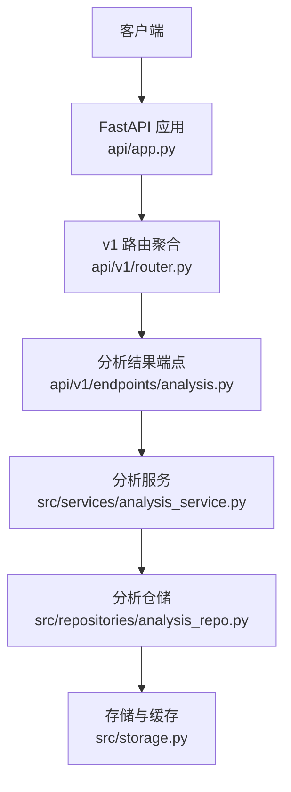
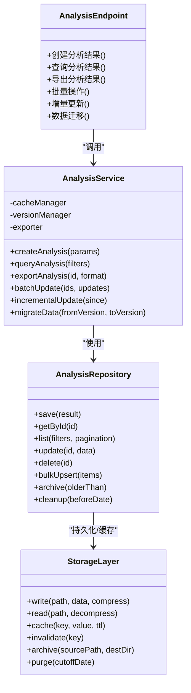
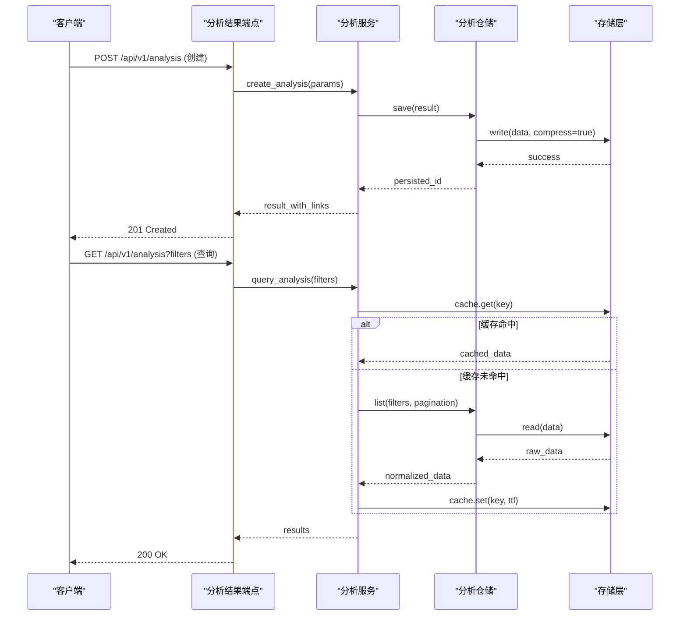
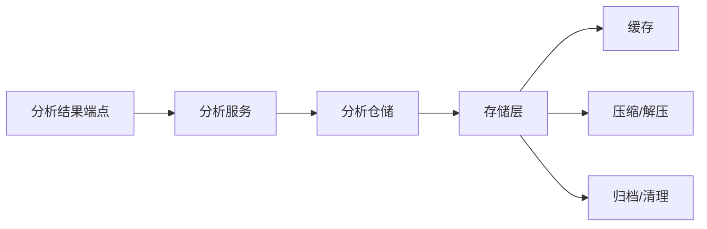

# 分析结果管理API

<cite>
**本文档引用的文件**
- [api/v1/endpoints/analysis.py](file://api/v1/endpoints/analysis.py)
- [api/v1/schemas/analysis.py](file://api/v1/schemas/analysis.py)
- [src/repositories/analysis_repo.py](file://src/repositories/analysis_repo.py)
- [src/services/analysis_service.py](file://src/services/analysis_service.py)
- [src/storage.py](file://src/storage.py)
- [api/app.py](file://api/app.py)
- [api/v1/router.py](file://api/v1/router.py)
</cite>

## 目录
1. [简介](#简介)
2. [项目结构](#项目结构)
3. [核心组件](#核心组件)
4. [架构总览](#架构总览)
5. [详细组件分析](#详细组件分析)
6. [依赖关系分析](#依赖关系分析)
7. [性能考虑](#性能考虑)
8. [故障排查指南](#故障排查指南)
9. [结论](#结论)
10. [附录](#附录)

## 简介
本文件面向“分析结果管理”相关API，覆盖分析结果的存储、查询、导出、缓存策略、版本管理、数据压缩、批量操作、增量更新、数据迁移、可视化接口与归档清理等能力。文档以代码仓库中的实际实现为依据，提供调用方法、参数说明、返回格式与最佳实践，帮助开发者快速集成与扩展。

## 项目结构
分析结果管理的API位于FastAPI应用的路由层，通过v1路由注册到主应用；业务逻辑封装在Service层，数据访问封装在Repository层，持久化与缓存由Storage层统一处理。前端或客户端通过HTTP请求调用API，后端依次经过路由、服务、仓储与存储层完成读写与导出等操作。

**图表来源**
- [api/app.py](file://api/app.py)
- [api/v1/router.py](file://api/v1/router.py)
- [api/v1/endpoints/analysis.py](file://api/v1/endpoints/analysis.py)
- [src/services/analysis_service.py](file://src/services/analysis_service.py)
- [src/repositories/analysis_repo.py](file://src/repositories/analysis_repo.py)
- [src/storage.py](file://src/storage.py)

**章节来源**
- [api/app.py](file://api/app.py)
- [api/v1/router.py](file://api/v1/router.py)
- [api/v1/endpoints/analysis.py](file://api/v1/endpoints/analysis.py)

## 核心组件
- 分析结果端点（Endpoints）：定义RESTful接口，接收请求参数并返回标准化响应。
- 分析服务（Service）：编排业务逻辑，包括结果生成、缓存命中、版本控制、导出与批量操作。
- 分析仓储（Repository）：负责数据的增删改查、分页、过滤、排序与索引优化。
- 存储层（Storage）：统一数据持久化、压缩、归档、清理与缓存策略。

**章节来源**
- [api/v1/endpoints/analysis.py](file://api/v1/endpoints/analysis.py)
- [src/services/analysis_service.py](file://src/services/analysis_service.py)
- [src/repositories/analysis_repo.py](file://src/repositories/analysis_repo.py)
- [src/storage.py](file://src/storage.py)

## 架构总览
分析结果管理采用分层架构：
- 表现层：FastAPI端点，负责参数校验、鉴权、错误处理与响应序列化。
- 服务层：组合仓储与外部依赖，实现缓存策略、版本管理、增量更新与导出。
- 仓储层：抽象数据访问，屏蔽底层存储细节，支持多种后端。
- 存储层：提供统一的读写、压缩、归档、清理与缓存能力。

**图表来源**
- [api/v1/endpoints/analysis.py](file://api/v1/endpoints/analysis.py)
- [src/services/analysis_service.py](file://src/services/analysis_service.py)
- [src/repositories/analysis_repo.py](file://src/repositories/analysis_repo.py)
- [src/storage.py](file://src/storage.py)

## 详细组件分析

### 分析结果端点（Endpoints）
- 功能范围
  - 创建分析结果：提交股票筛选、时间范围、分析类型等参数，触发分析流程并落盘。
  - 查询分析结果：支持按时间范围、股票代码、分析类型、状态、版本等过滤，支持分页与排序。
  - 导出分析结果：支持JSON、CSV、Markdown、PDF等格式，可选压缩输出。
  - 批量操作：批量更新状态、标签、元数据，批量删除或归档。
  - 增量更新：基于时间戳或版本号进行增量拉取与合并。
  - 数据迁移：跨版本的数据结构升级与兼容处理。
- 典型请求参数
  - 时间范围：start_date、end_date
  - 股票筛选：stock_codes、market、sector
  - 分析类型：analysis_type、strategy_id
  - 状态与版本：status、version
  - 分页与排序：page、page_size、sort_by、order
- 响应格式
  - 统一包装：code、message、data、trace_id
  - 列表项字段：id、stock_code、analysis_type、version、status、created_at、updated_at、summary、metrics、tags、links.export、links.visualize

**章节来源**
- [api/v1/endpoints/analysis.py](file://api/v1/endpoints/analysis.py)
- [api/v1/schemas/analysis.py](file://api/v1/schemas/analysis.py)

### 分析服务（Service）
- 职责
  - 编排创建、查询、导出、批量与增量流程
  - 管理结果缓存与失效策略
  - 维护版本管理与兼容性
  - 协调仓储与存储层完成持久化与归档
- 关键方法
  - create_analysis：参数校验、上下文构建、异步任务调度、结果落盘与缓存预热
  - query_analysis：过滤器解析、分页、排序、缓存命中优先
  - export_analysis：格式选择、数据抽取、压缩、流式下载
  - batch_update：事务性批量更新、幂等键、审计日志
  - incremental_update：since时间戳或版本号、差异合并、冲突解决
  - migrate_data：版本检测、迁移脚本执行、回滚策略

**章节来源**
- [src/services/analysis_service.py](file://src/services/analysis_service.py)

### 分析仓储（Repository）
- 职责
  - 提供统一的CRUD与高级查询能力
  - 支持复杂过滤条件与索引优化
  - 批量写入与归档清理
- 关键方法
  - save/getById/list/update/delete
  - bulk_upsert：批量插入或更新，去重与冲突处理
  - archive/cleanup：按时间或版本归档与清理
  - search：全文检索与高亮摘要

**章节来源**
- [src/repositories/analysis_repo.py](file://src/repositories/analysis_repo.py)

### 存储层（Storage）
- 职责
  - 统一读写、压缩、归档、清理与缓存
  - 支持多后端（本地文件系统、对象存储、数据库）
- 关键方法
  - write/read：支持可选压缩（gzip/zstd）
  - cache/invalidate：TTL、LRU、热点数据加速
  - archive/purge：按日期或版本归档与清理过期数据

**章节来源**
- [src/storage.py](file://src/storage.py)

### 数据模型与Schema
- 分析结果实体
  - id、stock_code、analysis_type、version、status、created_at、updated_at
  - summary、metrics、tags、notes、links.export、links.visualize
- 查询过滤器
  - time_range、stock_filters、analysis_type、status、version、keyword
- 导出选项
  - format、compress、include_fields、download_mode

**章节来源**
- [api/v1/schemas/analysis.py](file://api/v1/schemas/analysis.py)

### 接口流程图（创建与查询）

**图表来源**
- [api/v1/endpoints/analysis.py](file://api/v1/endpoints/analysis.py)
- [src/services/analysis_service.py](file://src/services/analysis_service.py)
- [src/repositories/analysis_repo.py](file://src/repositories/analysis_repo.py)
- [src/storage.py](file://src/storage.py)

### 导出与可视化接口
- 导出接口
  - 路径：GET /api/v1/analysis/{id}/export
  - 参数：format=json|csv|markdown|pdf，compress=true|false，include_fields=...
  - 行为：数据抽取、格式化、压缩、流式下载
- 可视化接口
  - 路径：GET /api/v1/analysis/{id}/visualize
  - 参数：chart_types=line|bar|heatmap|table，theme=default|dark
  - 行为：生成图表配置或渲染后的静态资源链接

**章节来源**
- [api/v1/endpoints/analysis.py](file://api/v1/endpoints/analysis.py)
- [api/v1/schemas/analysis.py](file://api/v1/schemas/analysis.py)

### 批量操作与增量更新
- 批量操作
  - 路径：POST /api/v1/analysis/batch
  - 请求体：{ operations: [{ op: update|delete|archive, ids: [...], fields: {...} }] }
  - 行为：事务性执行、幂等键、审计日志、失败回滚
- 增量更新
  - 路径：GET /api/v1/analysis/incremental?since=timestamp|version
  - 行为：拉取变更集、差异合并、冲突解决、缓存刷新

**章节来源**
- [api/v1/endpoints/analysis.py](file://api/v1/endpoints/analysis.py)
- [src/services/analysis_service.py](file://src/services/analysis_service.py)

### 数据迁移与版本管理
- 版本管理
  - 每个分析结果包含version字段，支持向后兼容的schema演进
  - 迁移时保留旧版本数据，新增字段默认值或空值
- 数据迁移
  - 路径：POST /api/v1/analysis/migrate
  - 参数：from_version、to_version、dry_run=true|false
  - 行为：校验兼容性、执行迁移脚本、回滚保障、审计记录

**章节来源**
- [api/v1/endpoints/analysis.py](file://api/v1/endpoints/analysis.py)
- [src/services/analysis_service.py](file://src/services/analysis_service.py)

### 结果缓存策略
- 缓存键设计：基于查询参数哈希与用户上下文
- TTL策略：短时效热点数据、长时效历史快照
- 失效策略：写后失效、版本变更失效、定时刷新
- 降级策略：缓存不可用时直接读库，限流保护

**章节来源**
- [src/storage.py](file://src/storage.py)
- [src/services/analysis_service.py](file://src/services/analysis_service.py)

### 数据压缩与归档清理
- 压缩
  - 写入时可选gzip或zstd压缩，降低存储空间
  - 读取时按需解压，避免全量加载
- 归档
  - 按时间或版本将冷数据归档至低成本存储
  - 归档后原位置保留索引与元数据
- 清理
  - 定期清理过期数据与临时文件
  - 支持按日期阈值与保留策略执行

**章节来源**
- [src/storage.py](file://src/storage.py)

## 依赖关系分析
- 端点依赖服务，服务依赖仓储，仓储依赖存储层
- 缓存与压缩为横切关注点，贯穿读写链路
- 版本管理与迁移在服务层编排，仓储层提供数据一致性保障

**图表来源**
- [api/v1/endpoints/analysis.py](file://api/v1/endpoints/analysis.py)
- [src/services/analysis_service.py](file://src/services/analysis_service.py)
- [src/repositories/analysis_repo.py](file://src/repositories/analysis_repo.py)
- [src/storage.py](file://src/storage.py)

**章节来源**
- [api/v1/endpoints/analysis.py](file://api/v1/endpoints/analysis.py)
- [src/services/analysis_service.py](file://src/services/analysis_service.py)
- [src/repositories/analysis_repo.py](file://src/repositories/analysis_repo.py)
- [src/storage.py](file://src/storage.py)

## 性能考虑
- 查询优化：合理使用索引、分页与投影字段，避免全表扫描
- 缓存命中：热点数据预加载与合理TTL设置
- 压缩权衡：大体积导出启用压缩，小体积直出减少CPU开销
- 并发控制：批量操作分片与限流，避免锁竞争
- 流式导出：大文件分块传输，降低内存峰值

[本节为通用指导，不直接分析具体文件]

## 故障排查指南
- 常见问题
  - 缓存未命中导致延迟：检查缓存键与TTL配置
  - 导出失败：确认格式支持与压缩开关
  - 增量更新冲突：核对since参数与版本一致性
  - 归档清理误删：验证保留策略与时间阈值
- 诊断步骤
  - 查看trace_id定位请求链路
  - 检查仓储层日志与存储层指标
  - 验证Schema兼容性与版本迁移状态

**章节来源**
- [api/v1/endpoints/analysis.py](file://api/v1/endpoints/analysis.py)
- [src/services/analysis_service.py](file://src/services/analysis_service.py)
- [src/storage.py](file://src/storage.py)

## 结论
分析结果管理API通过清晰的分层设计与完善的存储策略，提供了稳定高效的创建、查询、导出、批量、增量与迁移能力。结合缓存、压缩与归档清理，满足大规模数据分析场景的性能与成本需求。建议在生产环境启用监控与审计，持续优化查询与缓存策略。

[本节为总结性内容，不直接分析具体文件]

## 附录
- 常用查询参数示例
  - 时间范围：start_date=2024-01-01&end_date=2024-12-31
  - 股票筛选：stock_codes=600519.SH,000858.SZ&market=A股
  - 分析类型：analysis_type=技术面&strategy_id=ma_golden_cross
  - 分页排序：page=1&page_size=20&sort_by=created_at&order=desc
- 导出与可视化示例
  - 导出JSON并压缩：format=json&compress=true
  - 可视化折线图：chart_types=line&theme=dark
- 批量操作示例
  - 批量更新状态：operations=[{op:update,ids:[...],fields:{status:completed}}]
- 增量更新示例
  - 自指定时间戳拉取：since=2024-10-01T00:00:00Z
- 数据迁移示例
  - 从v1迁移到v2：from_version=1&to_version=2&dry_run=false

[本节为参考信息，不直接分析具体文件]