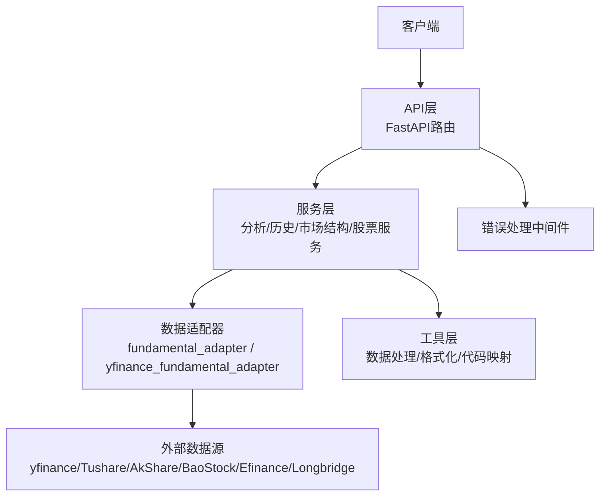
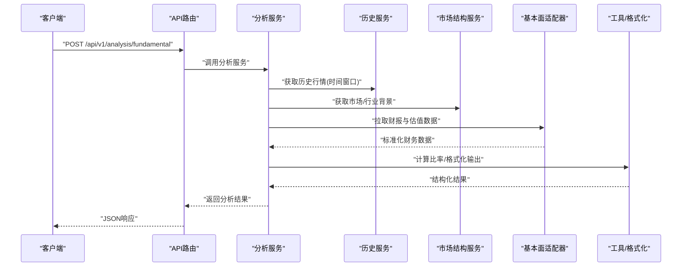
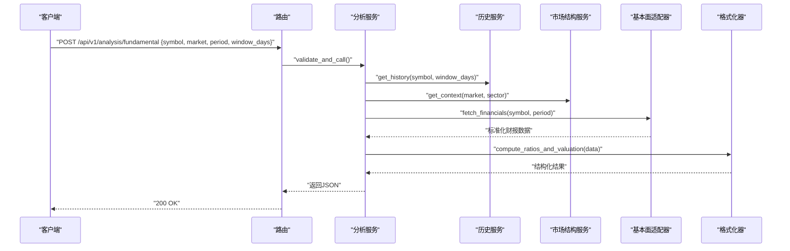
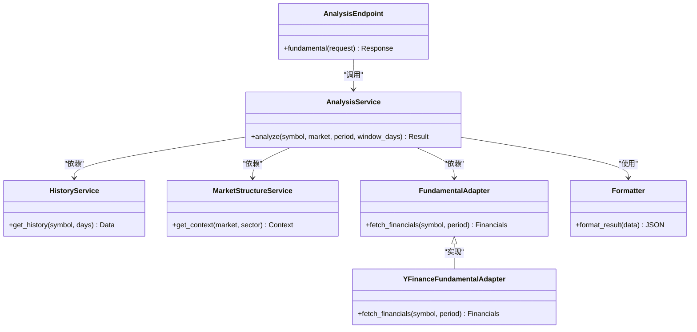

# 基本面分析API

<cite>
**本文引用的文件**   
- [api/app.py](file://api/app.py)
- [api/v1/router.py](file://api/v1/router.py)
- [api/v1/endpoints/analysis.py](file://api/v1/endpoints/analysis.py)
- [api/v1/schemas/analysis.py](file://api/v1/schemas/analysis.py)
- [data_provider/fundamental_adapter.py](file://data_provider/fundamental_adapter.py)
- [data_provider/yfinance_fundamental_adapter.py](file://data_provider/yfinance_fundamental_adapter.py)
- [src/services/analysis_service.py](file://src/services/analysis_service.py)
- [src/services/analyzer_service.py](file://src/services/analyzer_service.py)
- [src/services/history_service.py](file://src/services/history_service.py)
- [src/services/market_structure_service.py](file://src/services/market_structure_service.py)
- [src/services/stock_service.py](file://src/services/stock_service.py)
- [src/services/stock_code_utils.py](file://src/services/stock_code_utils.py)
- [src/services/name_to_code_resolver.py](file://src/services/name_to_code_resolver.py)
- [src/utils/data_processing.py](file://src/utils/data_processing.py)
- [src/formatters.py](file://src/formatters.py)
- [api/v1/errors.py](file://api/v1/errors.py)
- [api/middlewares/error_handler.py](file://api/middlewares/error_handler.py)
- [tests/test_analysis_api_contract.py](file://tests/test_analysis_api_contract.py)
- [tests/test_yfinance_fundamental_adapter.py](file://tests/test_yfinance_fundamental_adapter.py)
</cite>

## 目录
1. [简介](#简介)
2. [项目结构](#项目结构)
3. [核心组件](#核心组件)
4. [架构总览](#架构总览)
5. [详细组件分析](#详细组件分析)
6. [依赖关系分析](#依赖关系分析)
7. [性能考虑](#性能考虑)
8. [故障排查指南](#故障排查指南)
9. [结论](#结论)
10. [附录](#附录)

## 简介
本文件面向“基本面分析”相关API，覆盖财务数据分析、估值模型、盈利能力评估等能力。文档提供：
- 接口调用方法（请求参数、响应结构）
- 财务报表解析与关键比率计算说明
- 行业对比分析能力概述
- 数据源配置与多市场适配（A股、港股、美股）
- 分析结果JSON字段定义（财务指标、估值倍数、评级建议等）
- 数据质量检查与异常处理最佳实践

## 项目结构
本项目采用分层架构：
- API层：FastAPI路由与中间件，统一错误处理与鉴权
- 服务层：业务编排与分析服务
- 数据层：多数据源适配器（yfinance、Tushare、AkShare、BaoStock、Efinance、Longbridge等）
- 工具层：数据处理、格式化、代码映射与名称解析

图表来源
- [api/app.py:1-200](file://api/app.py#L1-L200)
- [api/v1/router.py:1-200](file://api/v1/router.py#L1-L200)
- [data_provider/fundamental_adapter.py:1-200](file://data_provider/fundamental_adapter.py#L1-L200)
- [data_provider/yfinance_fundamental_adapter.py:1-200](file://data_provider/yfinance_fundamental_adapter.py#L1-L200)
- [src/services/analysis_service.py:1-200](file://src/services/analysis_service.py#L1-L200)
- [src/services/analyzer_service.py:1-200](file://src/services/analyzer_service.py#L1-L200)
- [src/services/history_service.py:1-200](file://src/services/history_service.py#L1-L200)
- [src/services/market_structure_service.py:1-200](file://src/services/market_structure_service.py#L1-L200)
- [src/services/stock_service.py:1-200](file://src/services/stock_service.py#L1-L200)
- [src/utils/data_processing.py:1-200](file://src/utils/data_processing.py#L1-L200)
- [src/formatters.py:1-200](file://src/formatters.py#L1-L200)

章节来源
- [api/app.py:1-200](file://api/app.py#L1-L200)
- [api/v1/router.py:1-200](file://api/v1/router.py#L1-L200)

## 核心组件
- 基本面数据适配器：封装不同数据源的财报与估值数据获取逻辑，统一输出标准化结构
- 分析服务：组合历史行情、财务数据、市场结构信息，生成基本面分析与估值结论
- 历史与市场结构服务：提供时间窗口数据、指数与板块背景，用于行业对比与相对估值
- 股票服务与代码工具：负责股票代码规范化、名称到代码的解析、跨市场符号映射
- 格式化器：将内部数据结构转换为对外一致的JSON响应格式

章节来源
- [data_provider/fundamental_adapter.py:1-200](file://data_provider/fundamental_adapter.py#L1-L200)
- [data_provider/yfinance_fundamental_adapter.py:1-200](file://data_provider/yfinance_fundamental_adapter.py#L1-L200)
- [src/services/analysis_service.py:1-200](file://src/services/analysis_service.py#L1-L200)
- [src/services/analyzer_service.py:1-200](file://src/services/analyzer_service.py#L1-L200)
- [src/services/history_service.py:1-200](file://src/services/history_service.py#L1-L200)
- [src/services/market_structure_service.py:1-200](file://src/services/market_structure_service.py#L1-L200)
- [src/services/stock_service.py:1-200](file://src/services/stock_service.py#L1-L200)
- [src/services/stock_code_utils.py:1-200](file://src/services/stock_code_utils.py#L1-L200)
- [src/services/name_to_code_resolver.py:1-200](file://src/services/name_to_code_resolver.py#L1-L200)
- [src/formatters.py:1-200](file://src/formatters.py#L1-L200)

## 架构总览
基本面分析API的请求流程如下：
- 客户端通过REST接口提交标的与时间范围
- API路由校验并委派给分析服务
- 分析服务调用历史与市场结构服务获取上下文
- 基本面适配器从多数据源拉取财报与估值数据
- 工具层进行数据清洗、比率计算与格式化
- 返回统一的JSON结构，包含财务指标、估值倍数与评级建议

图表来源
- [api/v1/endpoints/analysis.py:1-200](file://api/v1/endpoints/analysis.py#L1-L200)
- [src/services/analysis_service.py:1-200](file://src/services/analysis_service.py#L1-L200)
- [src/services/history_service.py:1-200](file://src/services/history_service.py#L1-L200)
- [src/services/market_structure_service.py:1-200](file://src/services/market_structure_service.py#L1-L200)
- [data_provider/fundamental_adapter.py:1-200](file://data_provider/fundamental_adapter.py#L1-L200)
- [src/formatters.py:1-200](file://src/formatters.py#L1-L200)

## 详细组件分析

### 基本面分析API接口
- 接口路径：POST /api/v1/analysis/fundamental
- 功能：基于标的与时间范围，聚合财报、估值与行业背景，输出标准化分析结果
- 请求体关键字段：
  - symbol: 股票代码或名称（支持A股、港股、美股）
  - market: 市场标识（如CN/HK/US），可选；未指定时自动识别
  - period: 分析周期（如quarterly/yearly），默认年度
  - window_days: 历史窗口天数，用于趋势与相对估值
  - include_industry: 是否包含行业对比，默认true
- 响应体关键字段：
  - stock_info: 标的基本信息（名称、市场、币种、上市日期等）
  - financials: 财务报表摘要（利润表、资产负债表、现金流的关键科目）
  - ratios: 关键比率（盈利能力、偿债能力、运营效率、成长性等）
  - valuation: 估值倍数（PE/PB/PS/EV/EBITDA等）与历史分位
  - industry_comparison: 行业对比（中位数、分位数、排名）
  - rating: 评级建议（评分、等级、依据摘要）
  - data_quality: 数据质量（覆盖率、缺失项、置信度）
  - metadata: 元数据（数据来源、更新时间、版本）

章节来源
- [api/v1/endpoints/analysis.py:1-200](file://api/v1/endpoints/analysis.py#L1-L200)
- [api/v1/schemas/analysis.py:1-200](file://api/v1/schemas/analysis.py#L1-L200)
- [src/services/analysis_service.py:1-200](file://src/services/analysis_service.py#L1-L200)

#### 接口调用序列图

图表来源
- [api/v1/endpoints/analysis.py:1-200](file://api/v1/endpoints/analysis.py#L1-L200)
- [src/services/analysis_service.py:1-200](file://src/services/analysis_service.py#L1-L200)
- [src/services/history_service.py:1-200](file://src/services/history_service.py#L1-L200)
- [src/services/market_structure_service.py:1-200](file://src/services/market_structure_service.py#L1-L200)
- [data_provider/fundamental_adapter.py:1-200](file://data_provider/fundamental_adapter.py#L1-L200)
- [src/formatters.py:1-200](file://src/formatters.py#L1-L200)

### 数据源配置与多市场适配
- 数据源选择策略：
  - A股：优先使用本地化数据源（如BaoStock、Tushare、AkShare、Efinance），失败回退至通用源
  - 港股/美股：优先使用yfinance或Longbridge，按可用性动态切换
- 适配层职责：
  - 统一字段命名与单位（币种、货币、会计期间）
  - 缺失值填充与异常值检测
  - 行业分类映射与可比公司集合构建
- 配置要点：
  - 环境变量或配置文件声明各数据源密钥与限流策略
  - 重试与熔断机制，确保高可用
  - 缓存最近一次成功结果，降低重复请求

章节来源
- [data_provider/fundamental_adapter.py:1-200](file://data_provider/fundamental_adapter.py#L1-L200)
- [data_provider/yfinance_fundamental_adapter.py:1-200](file://data_provider/yfinance_fundamental_adapter.py#L1-L200)
- [src/services/stock_code_utils.py:1-200](file://src/services/stock_code_utils.py#L1-L200)
- [src/services/name_to_code_resolver.py:1-200](file://src/services/name_to_code_resolver.py#L1-L200)

### 财务报表解析与关键比率计算
- 报表解析：
  - 利润表：营业收入、营业成本、毛利率、净利润、扣非净利润
  - 资产负债表：总资产、负债合计、所有者权益、有息负债
  - 现金流量表：经营活动现金流、投资活动现金流、筹资活动现金流
- 关键比率：
  - 盈利能力：ROE、ROA、毛利率、净利率、EBITDA利润率
  - 偿债能力：资产负债率、流动比率、速动比率、利息保障倍数
  - 运营效率：存货周转率、应收账款周转率、总资产周转率
  - 成长性：营收增速、净利润增速、EPS增速
- 计算逻辑：
  - 同比/环比变化率
  - 滚动窗口（TTM）与季度/年度对齐
  - 缺失值插补与异常值剔除

章节来源
- [src/formatters.py:1-200](file://src/formatters.py#L1-L200)
- [src/utils/data_processing.py:1-200](file://src/utils/data_processing.py#L1-L200)
- [src/services/analyzer_service.py:1-200](file://src/services/analyzer_service.py#L1-L200)

### 估值模型与行业对比
- 估值倍数：
  - PE（静态/滚动）、PB、PS、EV/EBITDA、股息率
  - 历史分位（近3年/5年）与同业分位比较
- 行业对比：
  - 同板块可比公司集合
  - 行业中位数与分位数（P25/P50/P75）
  - 排名与偏离度（高于/低于行业中位数）
- 评级建议：
  - 综合评分（财务健康、盈利质量、估值吸引力、行业位置）
  - 等级划分（强买入/买入/持有/减持/卖出）
  - 依据摘要（关键驱动因素与风险提示）

章节来源
- [src/services/analysis_service.py:1-200](file://src/services/analysis_service.py#L1-L200)
- [src/services/market_structure_service.py:1-200](file://src/services/market_structure_service.py#L1-L200)
- [src/formatters.py:1-200](file://src/formatters.py#L1-L200)

### 不同市场的数据适配与格式化示例
- A股：
  - 代码格式：6位数字（沪市/深市）
  - 数据源：BaoStock/Tushare/AkShare/Efinance
  - 格式化：人民币计价，会计期间按中国准则
- 港股：
  - 代码格式：5位数字+后缀（如.HK）
  - 数据源：yfinance/Longbridge
  - 格式化：港币计价，披露口径按港交所
- 美股：
  - 代码格式：字母组合（如AAPL）
  - 数据源：yfinance/Longbridge
  - 格式化：美元计价，GAAP口径

章节来源
- [data_provider/yfinance_fundamental_adapter.py:1-200](file://data_provider/yfinance_fundamental_adapter.py#L1-L200)
- [src/services/stock_code_utils.py:1-200](file://src/services/stock_code_utils.py#L1-L200)
- [src/services/name_to_code_resolver.py:1-200](file://src/services/name_to_code_resolver.py#L1-L200)

### 数据质量检查与异常处理最佳实践
- 数据质量：
  - 覆盖率统计（字段缺失比例）
  - 一致性校验（会计恒等式、勾稽关系）
  - 异常值检测（极值、跳变、负值不合理）
  - 置信度评分（数据新鲜度、来源可靠性）
- 异常处理：
  - 网络超时与限流重试
  - 数据源不可用时的回退策略
  - 结构化错误码与消息，便于前端展示
  - 日志记录与可观测性（请求ID、耗时、状态码）

章节来源
- [api/v1/errors.py:1-200](file://api/v1/errors.py#L1-L200)
- [api/middlewares/error_handler.py:1-200](file://api/middlewares/error_handler.py#L1-L200)
- [src/utils/data_processing.py:1-200](file://src/utils/data_processing.py#L1-L200)

## 依赖关系分析

图表来源
- [api/v1/endpoints/analysis.py:1-200](file://api/v1/endpoints/analysis.py#L1-L200)
- [src/services/analysis_service.py:1-200](file://src/services/analysis_service.py#L1-L200)
- [src/services/history_service.py:1-200](file://src/services/history_service.py#L1-L200)
- [src/services/market_structure_service.py:1-200](file://src/services/market_structure_service.py#L1-L200)
- [data_provider/fundamental_adapter.py:1-200](file://data_provider/fundamental_adapter.py#L1-L200)
- [data_provider/yfinance_fundamental_adapter.py:1-200](file://data_provider/yfinance_fundamental_adapter.py#L1-L200)
- [src/formatters.py:1-200](file://src/formatters.py#L1-L200)

章节来源
- [api/v1/endpoints/analysis.py:1-200](file://api/v1/endpoints/analysis.py#L1-L200)
- [src/services/analysis_service.py:1-200](file://src/services/analysis_service.py#L1-L200)

## 性能考虑
- 并发与缓存：
  - 对历史数据与行业背景进行缓存，减少重复请求
  - 使用异步I/O提升吞吐
- 数据源限流：
  - 设置合理的重试间隔与退避策略
  - 限制单标的并行请求数，避免触发限流
- 计算优化：
  - 批量计算比率与估值，避免逐条循环
  - 增量更新而非全量重算
- 资源控制：
  - 内存占用监控与GC调优
  - 日志采样与降级输出

[本节为通用指导，不直接分析具体文件]

## 故障排查指南
- 常见问题：
  - 数据源不可用：检查密钥、网络连通性与限流状态
  - 代码解析失败：确认市场标识与代码格式
  - 财报缺失：核对披露周期与数据源覆盖范围
- 诊断步骤：
  - 查看错误码与消息定位问题阶段
  - 检查数据质量报告中的覆盖率与置信度
  - 启用调试日志，追踪请求链路
- 恢复策略：
  - 切换到备用数据源
  - 缩短时间窗口或使用更宽松过滤条件
  - 重试与熔断后降级返回部分结果

章节来源
- [api/v1/errors.py:1-200](file://api/v1/errors.py#L1-L200)
- [api/middlewares/error_handler.py:1-200](file://api/middlewares/error_handler.py#L1-L200)
- [src/utils/data_processing.py:1-200](file://src/utils/data_processing.py#L1-L200)

## 结论
基本面分析API通过统一的数据适配与服务编排，为A股、港股、美股提供一致的财报解析、比率计算与估值分析能力。借助数据质量检查与健壮的错误处理，系统能够在多源异构环境下稳定输出结构化结果，支撑投资决策与风险管理。

[本节为总结，不直接分析具体文件]

## 附录
- 测试与契约：
  - 接口契约测试验证请求/响应结构与边界条件
  - 数据适配器单元测试覆盖多市场与异常场景

章节来源
- [tests/test_analysis_api_contract.py:1-200](file://tests/test_analysis_api_contract.py#L1-L200)
- [tests/test_yfinance_fundamental_adapter.py:1-200](file://tests/test_yfinance_fundamental_adapter.py#L1-L200)