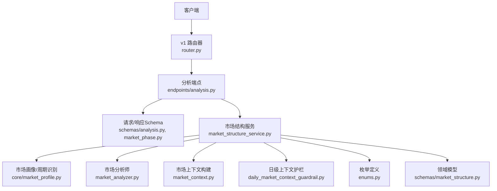
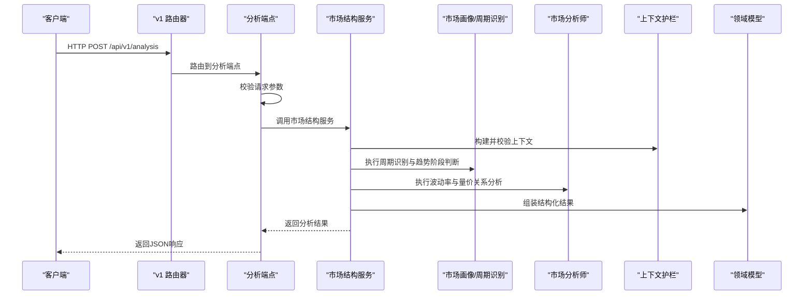
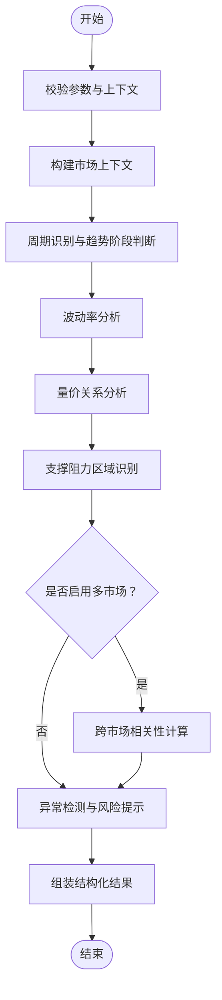
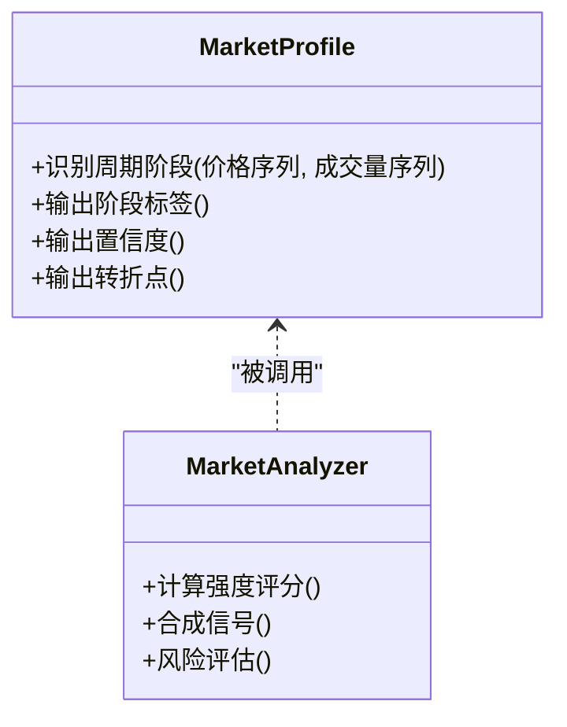
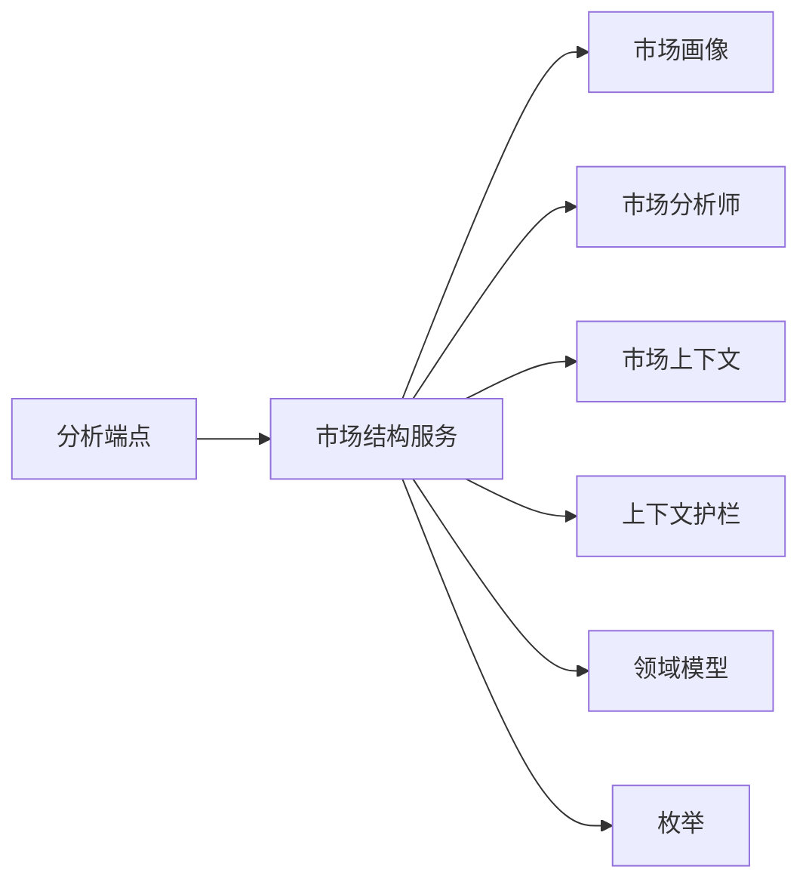

# 市场结构分析API

<cite>
**本文引用的文件**   
- [api/v1/endpoints/analysis.py](file://api/v1/endpoints/analysis.py)
- [api/v1/schemas/analysis.py](file://api/v1/schemas/analysis.py)
- [api/v1/schemas/market_phase.py](file://api/v1/schemas/market_phase.py)
- [src/services/market_structure_service.py](file://src/services/market_structure_service.py)
- [src/schemas/market_structure.py](file://src/schemas/market_structure.py)
- [src/core/market_profile.py](file://src/core/market_profile.py)
- [src/market_analyzer.py](file://src/market_analyzer.py)
- [src/market_context.py](file://src/market_context.py)
- [src/daily_market_context_guardrail.py](file://src/daily_market_context_guardrail.py)
- [src/enums.py](file://src/enums.py)
- [api/app.py](file://api/app.py)
- [api/v1/router.py](file://api/v1/router.py)
</cite>

## 目录
1. [简介](#简介)
2. [项目结构](#项目结构)
3. [核心组件](#核心组件)
4. [架构总览](#架构总览)
5. [详细组件分析](#详细组件分析)
6. [依赖关系分析](#依赖关系分析)
7. [性能考量](#性能考量)
8. [故障排查指南](#故障排查指南)
9. [结论](#结论)
10. [附录](#附录)

## 简介
本文件面向“市场结构分析”相关API，覆盖以下能力：
- 市场周期识别与趋势阶段判断
- 波动率分析与量价关系评估
- 支撑阻力区域识别
- 多市场同步分析与跨市场相关性计算
- 异常检测与预警机制
- 完整的参数配置（时间窗口、指标权重、阈值等）
- 结构化输出（市场阶段、强度评分、风险提示等）

文档以接口契约为核心，结合服务层与数据模型，提供调用方法、参数说明、返回结构与示例流程。

## 项目结构
与市场结构分析相关的代码主要分布在以下位置：
- API路由与请求校验：api/v1/endpoints/analysis.py、api/v1/schemas/analysis.py
- 领域模型与枚举：src/schemas/market_structure.py、src/enums.py
- 业务服务：src/services/market_structure_service.py
- 核心算法与上下文：src/core/market_profile.py、src/market_analyzer.py、src/market_context.py、src/daily_market_context_guardrail.py
- 应用装配：api/app.py、api/v1/router.py

图表来源
- [api/v1/router.py](file://api/v1/router.py)
- [api/v1/endpoints/analysis.py](file://api/v1/endpoints/analysis.py)
- [api/v1/schemas/analysis.py](file://api/v1/schemas/analysis.py)
- [api/v1/schemas/market_phase.py](file://api/v1/schemas/market_phase.py)
- [src/services/market_structure_service.py](file://src/services/market_structure_service.py)
- [src/core/market_profile.py](file://src/core/market_profile.py)
- [src/market_analyzer.py](file://src/market_analyzer.py)
- [src/market_context.py](file://src/market_context.py)
- [src/daily_market_context_guardrail.py](file://src/daily_market_context_guardrail.py)
- [src/enums.py](file://src/enums.py)
- [src/schemas/market_structure.py](file://src/schemas/market_structure.py)

章节来源
- [api/app.py](file://api/app.py)
- [api/v1/router.py](file://api/v1/router.py)

## 核心组件
- 分析端点（Analysis Endpoint）
  - 职责：接收并校验请求参数，调度市场结构服务，返回统一的结构化结果。
  - 关键输入：时间窗口、指标权重、阈值、标的范围、是否启用多市场同步与相关性计算等。
  - 关键输出：市场阶段、强度评分、波动率特征、支撑阻力区域、量价关系、风险提示、异常标记等。
- 市场结构服务（Market Structure Service）
  - 职责：编排周期识别、趋势阶段判断、波动率分析、支撑阻力识别、量价关系评估、相关性计算与异常检测。
  - 依赖：市场画像、分析师、上下文构建器、护栏策略、领域模型与枚举。
- 市场画像与周期识别（Market Profile）
  - 职责：基于价格序列与成交量序列，识别周期阶段、趋势方向与强度，输出结构化阶段标签与置信度。
- 市场分析师（Market Analyzer）
  - 职责：综合多指标（如动量、波动率、量价背离等）进行打分与信号合成，生成强度评分与风险提示。
- 市场上下文与护栏（Context & Guardrail）
  - 职责：聚合历史与实时上下文，限制异常输入与输出，确保结果稳健性。

章节来源
- [api/v1/endpoints/analysis.py](file://api/v1/endpoints/analysis.py)
- [api/v1/schemas/analysis.py](file://api/v1/schemas/analysis.py)
- [src/services/market_structure_service.py](file://src/services/market_structure_service.py)
- [src/core/market_profile.py](file://src/core/market_profile.py)
- [src/market_analyzer.py](file://src/market_analyzer.py)
- [src/market_context.py](file://src/market_context.py)
- [src/daily_market_context_guardrail.py](file://src/daily_market_context_guardrail.py)
- [src/enums.py](file://src/enums.py)
- [src/schemas/market_structure.py](file://src/schemas/market_structure.py)

## 架构总览
下图展示从HTTP请求到分析结果返回的完整调用链，以及关键模块间的协作关系。

图表来源
- [api/v1/router.py](file://api/v1/router.py)
- [api/v1/endpoints/analysis.py](file://api/v1/endpoints/analysis.py)
- [src/services/market_structure_service.py](file://src/services/market_structure_service.py)
- [src/core/market_profile.py](file://src/core/market_profile.py)
- [src/market_analyzer.py](file://src/market_analyzer.py)
- [src/market_context.py](file://src/market_context.py)
- [src/daily_market_context_guardrail.py](file://src/daily_market_context_guardrail.py)
- [src/schemas/market_structure.py](file://src/schemas/market_structure.py)

## 详细组件分析

### 分析端点（Analysis Endpoint）
- 功能要点
  - 支持单标的与多标的批量分析
  - 支持多市场同步分析开关与相关性计算开关
  - 支持自定义时间窗口、指标权重、阈值配置
  - 支持返回结构化结果：阶段、强度评分、波动率、支撑阻力、量价关系、风险提示、异常标记
- 典型参数
  - 时间窗口：短中长期组合（例如近N根K线）
  - 指标权重：动量、波动率、量价等权重分配
  - 阈值：趋势确认、突破、背离、波动率异常等阈值
  - 多市场：标的列表、市场分类、相关性计算方法
- 典型返回
  - 市场阶段：上升/下降/震荡/转折等
  - 强度评分：0~1连续值或分级
  - 波动率：历史波动率、隐含波动率代理、波动率区间
  - 支撑阻力：区域坐标、置信度、失效概率
  - 量价关系：量价背离、放量/缩量信号、资金流向代理
  - 风险提示：宏观/流动性/技术面风险等级与建议
  - 异常标记：数据缺失、极端波动、模型置信度低等

章节来源
- [api/v1/endpoints/analysis.py](file://api/v1/endpoints/analysis.py)
- [api/v1/schemas/analysis.py](file://api/v1/schemas/analysis.py)
- [api/v1/schemas/market_phase.py](file://api/v1/schemas/market_phase.py)

### 市场结构服务（Market Structure Service）
- 职责边界
  - 协调周期识别、趋势阶段判断、波动率与量价分析、支撑阻力识别、相关性计算与异常检测
  - 管理上下文构建与护栏策略，保证输入输出一致性
- 处理流程
  - 解析并校验请求参数
  - 构建市场上下文（历史数据、实时快照、日历信息）
  - 调用周期识别与趋势阶段判断
  - 计算波动率与量价关系
  - 识别支撑阻力区域
  - 可选：多市场同步与相关性计算
  - 异常检测与风险提示
  - 组装结构化结果并返回

图表来源
- [src/services/market_structure_service.py](file://src/services/market_structure_service.py)
- [src/market_context.py](file://src/market_context.py)
- [src/core/market_profile.py](file://src/core/market_profile.py)
- [src/market_analyzer.py](file://src/market_analyzer.py)
- [src/daily_market_context_guardrail.py](file://src/daily_market_context_guardrail.py)

章节来源
- [src/services/market_structure_service.py](file://src/services/market_structure_service.py)
- [src/market_context.py](file://src/market_context.py)
- [src/daily_market_context_guardrail.py](file://src/daily_market_context_guardrail.py)

### 市场画像与周期识别（Market Profile）
- 能力概述
  - 基于价格序列与成交量序列，识别市场周期阶段（如筑底、拉升、高位震荡、回落等）
  - 输出阶段标签、置信度、关键转折点与持续时间估计
- 复杂度与优化
  - 时间复杂度与窗口长度线性相关；可通过滑动窗口与增量更新优化
  - 空间复杂度受缓存与中间状态影响，建议按需释放

图表来源
- [src/core/market_profile.py](file://src/core/market_profile.py)
- [src/market_analyzer.py](file://src/market_analyzer.py)

章节来源
- [src/core/market_profile.py](file://src/core/market_profile.py)
- [src/market_analyzer.py](file://src/market_analyzer.py)

### 领域模型与枚举（Market Structure Schema & Enums）
- 领域模型
  - 市场阶段：枚举类型（上升、下降、震荡、转折等）
  - 强度评分：数值范围与分级规则
  - 波动率：历史波动率、波动率区间、异常阈值
  - 支撑阻力：区域描述、置信度、失效概率
  - 量价关系：背离信号、放量/缩量、资金流向代理
  - 风险提示：风险等级、原因、建议动作
  - 异常标记：数据质量、极端波动、模型置信度低
- 使用方式
  - 通过Pydantic模型进行序列化与校验，保证API输入输出的稳定性

章节来源
- [src/schemas/market_structure.py](file://src/schemas/market_structure.py)
- [src/enums.py](file://src/enums.py)
- [api/v1/schemas/market_phase.py](file://api/v1/schemas/market_phase.py)

### 多市场同步分析与相关性计算
- 功能要点
  - 支持多标的并行分析，提升吞吐
  - 支持跨市场相关性计算（如指数与板块、行业与个股）
  - 可配置相关性方法（Pearson、Spearman等）与滚动窗口
- 调用建议
  - 合理设置并发上限与超时，避免下游数据源限流
  - 对相关性矩阵进行稀疏化与阈值过滤，降低噪声

章节来源
- [src/services/market_structure_service.py](file://src/services/market_structure_service.py)
- [src/market_analyzer.py](file://src/market_analyzer.py)

### 异常检测与预警机制
- 异常类型
  - 数据缺失或延迟、极端波动、模型置信度过低、输入参数越界
- 检测策略
  - 基于统计阈值（均值、标准差、分位数）与规则引擎（如波动率突增、量价背离）
  - 结合上下文护栏（如日级上下文约束）减少误报
- 预警输出
  - 异常标记、风险等级、建议动作（减仓、观望、对冲等）

章节来源
- [src/daily_market_context_guardrail.py](file://src/daily_market_context_guardrail.py)
- [src/market_analyzer.py](file://src/market_analyzer.py)

## 依赖关系分析
- 组件耦合
  - 分析端点依赖Schema校验与服务编排
  - 服务层依赖画像、分析师、上下文与护栏，形成松耦合的模块化设计
- 外部依赖
  - 数据获取器（不同市场的数据源）
  - LLM适配器（可选，用于文本摘要与解释）
- 潜在循环依赖
  - 通过分层与接口隔离避免循环引用

图表来源
- [api/v1/endpoints/analysis.py](file://api/v1/endpoints/analysis.py)
- [src/services/market_structure_service.py](file://src/services/market_structure_service.py)
- [src/core/market_profile.py](file://src/core/market_profile.py)
- [src/market_analyzer.py](file://src/market_analyzer.py)
- [src/market_context.py](file://src/market_context.py)
- [src/daily_market_context_guardrail.py](file://src/daily_market_context_guardrail.py)
- [src/schemas/market_structure.py](file://src/schemas/market_structure.py)
- [src/enums.py](file://src/enums.py)

章节来源
- [api/v1/endpoints/analysis.py](file://api/v1/endpoints/analysis.py)
- [src/services/market_structure_service.py](file://src/services/market_structure_service.py)

## 性能考量
- 并发与批处理
  - 多标的并行分析，控制最大并发数与超时
  - 相关性计算采用滚动窗口与稀疏矩阵优化
- 缓存与增量更新
  - 对历史数据与中间结果进行缓存，减少重复计算
  - 增量更新价格与成交量序列，降低内存占用
- I/O与网络
  - 对数据源进行连接池与重试策略
  - 合理设置超时与熔断，避免雪崩

[本节为通用指导，不直接分析具体文件]

## 故障排查指南
- 常见问题
  - 参数校验失败：检查时间窗口、权重、阈值是否在允许范围
  - 数据缺失或延迟：确认数据源可用性与时区设置
  - 相关性计算耗时过长：调整窗口大小与相关性方法
  - 异常标记频繁：检查阈值与护栏策略是否过于敏感
- 定位步骤
  - 查看端点日志与错误码
  - 检查上下文构建与护栏输出
  - 验证输入数据质量与完整性
  - 逐步关闭可选功能（如相关性计算）定位瓶颈

章节来源
- [api/v1/endpoints/analysis.py](file://api/v1/endpoints/analysis.py)
- [src/daily_market_context_guardrail.py](file://src/daily_market_context_guardrail.py)

## 结论
本API围绕市场结构分析提供完整的周期识别、趋势阶段判断、波动率与量价关系、支撑阻力识别、多市场同步与相关性计算、异常检测与预警能力。通过清晰的接口契约与模块化服务设计，用户可灵活配置时间窗口、指标权重与阈值，获得稳定且可解释的分析结果。建议在大规模使用时关注并发、缓存与I/O优化，并结合护栏策略降低误报与风险。

[本节为总结，不直接分析具体文件]

## 附录
- 参数配置清单（示例）
  - 时间窗口：短窗（如5-10）、中窗（如20-60）、长窗（如120-252）
  - 指标权重：动量0.3、波动率0.3、量价0.4（可调）
  - 阈值：趋势确认0.6、突破0.7、背离0.5、波动率异常2倍标准差
  - 多市场：标的列表、相关性方法（Pearson/Spearman）、滚动窗口
- 输出结构要点
  - 市场阶段与置信度
  - 强度评分与分级
  - 波动率区间与异常标记
  - 支撑阻力区域与失效概率
  - 量价关系信号与资金流向代理
  - 风险提示与建议动作
  - 异常标记与原因说明

[本节为概念性内容，不直接分析具体文件]