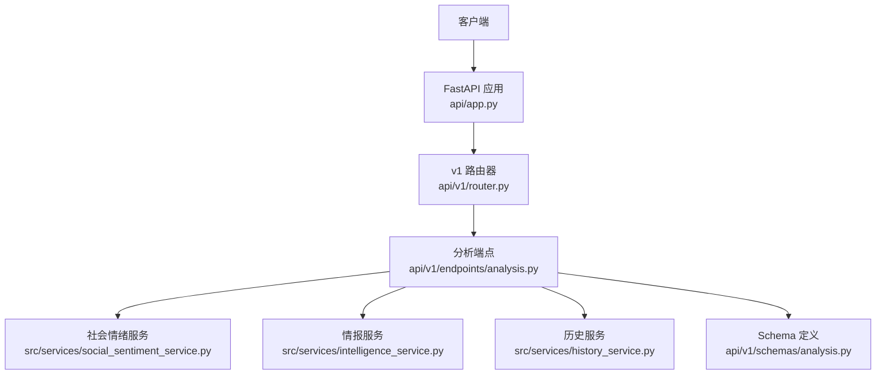
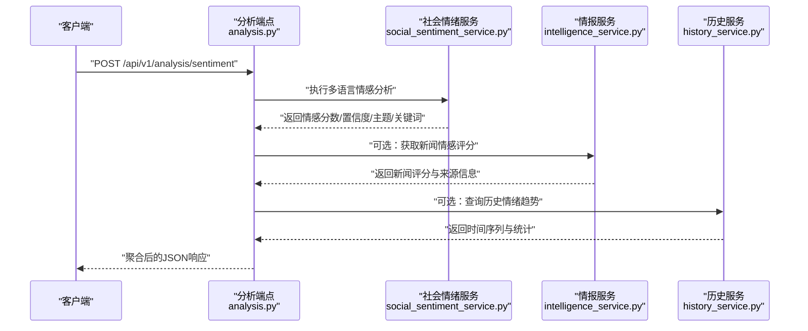
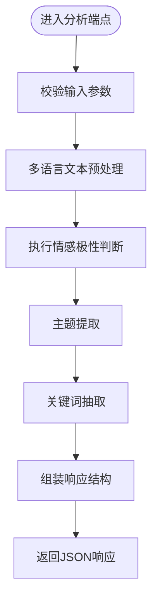
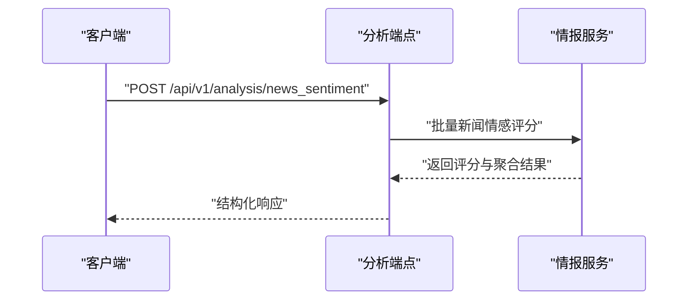
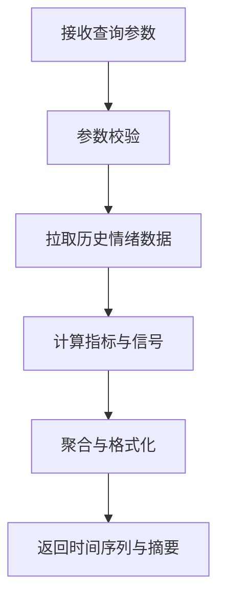
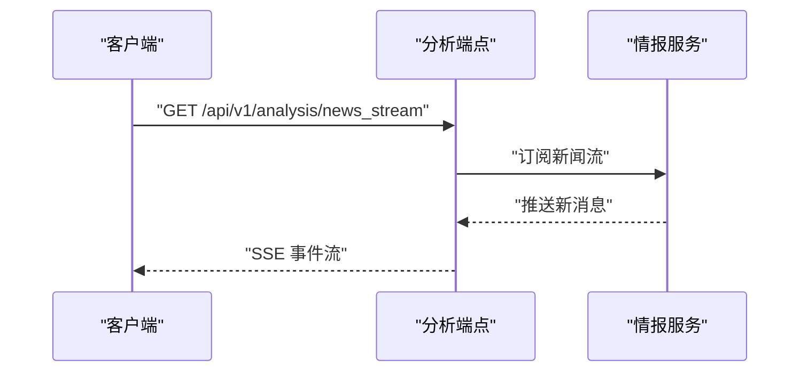
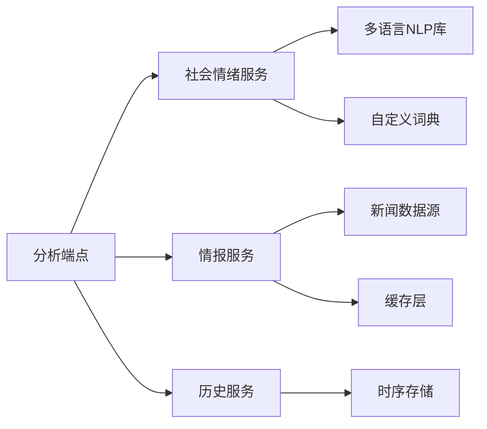

# 情绪分析API

<cite>
**本文引用的文件**   
- [api/v1/endpoints/analysis.py](file://api/v1/endpoints/analysis.py)
- [api/v1/schemas/analysis.py](file://api/v1/schemas/analysis.py)
- [src/services/social_sentiment_service.py](file://src/services/social_sentiment_service.py)
- [src/services/intelligence_service.py](file://src/services/intelligence_service.py)
- [src/services/history_service.py](file://src/services/history_service.py)
- [api/v1/router.py](file://api/v1/router.py)
- [api/app.py](file://api/app.py)
- [tests/test_social_sentiment_service.py](file://tests/test_social_sentiment_service.py)
</cite>

## 目录
1. [简介](#简介)
2. [项目结构](#项目结构)
3. [核心组件](#核心组件)
4. [架构总览](#架构总览)
5. [详细组件分析](#详细组件分析)
6. [依赖分析](#依赖分析)
7. [性能考虑](#性能考虑)
8. [故障排查指南](#故障排查指南)
9. [结论](#结论)
10. [附录](#附录)

## 简介
本文件面向开发者与数据分析师，提供“情绪分析”相关API的完整说明。覆盖以下能力：
- 社交媒体情感分析：对社交文本进行多语言情感极性判断、主题提取与关键词抽取
- 新闻情感评分：对新闻标题与正文进行情感打分、置信度评估与趋势聚合
- 市场情绪指数：基于历史与实时数据计算综合情绪指标，支持时间序列查询

文档包含请求参数、响应字段定义、错误码说明、调用示例（含实时流处理与历史查询）、以及自定义词典与模型调优建议。

## 项目结构
情绪分析相关的后端接口位于 FastAPI 应用下，路由注册在 v1 版本中，服务层封装了具体业务逻辑，Pydantic Schema 定义了输入输出结构。



**图表来源**
- [api/app.py](file://api/app.py)
- [api/v1/router.py](file://api/v1/router.py)
- [api/v1/endpoints/analysis.py](file://api/v1/endpoints/analysis.py)
- [src/services/social_sentiment_service.py](file://src/services/social_sentiment_service.py)
- [src/services/intelligence_service.py](file://src/services/intelligence_service.py)
- [src/services/history_service.py](file://src/services/history_service.py)
- [api/v1/schemas/analysis.py](file://api/v1/schemas/analysis.py)

**章节来源**
- [api/v1/router.py](file://api/v1/router.py)
- [api/app.py](file://api/app.py)

## 核心组件
- 分析端点（Analysis Endpoints）：暴露REST接口，接收文本或新闻数据，返回情感分数、置信度、主题与关键词等
- 社会情绪服务（Social Sentiment Service）：负责多语言文本预处理、情感极性判断、主题与关键词提取
- 情报服务（Intelligence Service）：整合新闻源、聚合情绪信号、生成新闻情感评分
- 历史服务（History Service）：提供历史情绪数据查询、时间序列聚合与趋势统计
- Schema 定义（Analysis Schemas）：统一输入输出结构，确保类型校验与文档自动生成

**章节来源**
- [api/v1/endpoints/analysis.py](file://api/v1/endpoints/analysis.py)
- [src/services/social_sentiment_service.py](file://src/services/social_sentiment_service.py)
- [src/services/intelligence_service.py](file://src/services/intelligence_service.py)
- [src/services/history_service.py](file://src/services/history_service.py)
- [api/v1/schemas/analysis.py](file://api/v1/schemas/analysis.py)

## 架构总览
整体流程从客户端发起请求开始，经 FastAPI 路由分发到分析端点，再由服务层调用相应模块完成数据处理与结果组装，最终返回结构化响应。



**图表来源**
- [api/v1/endpoints/analysis.py](file://api/v1/endpoints/analysis.py)
- [src/services/social_sentiment_service.py](file://src/services/social_sentiment_service.py)
- [src/services/intelligence_service.py](file://src/services/intelligence_service.py)
- [src/services/history_service.py](file://src/services/history_service.py)

## 详细组件分析

### 社交媒体情感分析接口
- 功能：对社交媒体文本进行多语言情感极性判断、主题识别与关键词抽取
- 典型请求路径：POST /api/v1/analysis/sentiment
- 主要参数：
  - texts: 文本数组（支持多语言）
  - language: 指定语言代码（如 zh, en, ja, ko），默认自动检测
  - depth: 分析深度（basic/standard/deep），影响主题与关键词粒度
  - source: 数据来源标识（如 social_media）
  - options: 扩展选项（是否启用自定义词典、阈值设置等）
- 响应字段：
  - sentiment_score: 情感分数（-1~1，负为负面，正为正面）
  - confidence: 置信度（0~1）
  - polarity: 极性标签（positive/negative/neutral）
  - topics: 主题列表
  - keywords: 关键词列表
  - language_detected: 检测到的语言
  - processing_time_ms: 处理耗时



**图表来源**
- [api/v1/endpoints/analysis.py](file://api/v1/endpoints/analysis.py)
- [src/services/social_sentiment_service.py](file://src/services/social_sentiment_service.py)
- [api/v1/schemas/analysis.py](file://api/v1/schemas/analysis.py)

**章节来源**
- [api/v1/endpoints/analysis.py](file://api/v1/endpoints/analysis.py)
- [src/services/social_sentiment_service.py](file://src/services/social_sentiment_service.py)
- [api/v1/schemas/analysis.py](file://api/v1/schemas/analysis.py)

### 新闻情感评分接口
- 功能：对新闻标题与正文进行情感打分、置信度评估与来源标注
- 典型请求路径：POST /api/v1/analysis/news_sentiment
- 主要参数：
  - articles: 文章对象数组（title/body/source/url）
  - language: 语言代码
  - depth: 分析深度
  - aggregate: 是否聚合多篇新闻情绪
- 响应字段：
  - scores: 每篇文章的情感分数与置信度
  - aggregated_sentiment: 聚合后的整体情绪
  - sources: 来源统计
  - trends: 短期情绪趋势（近N条）



**图表来源**
- [api/v1/endpoints/analysis.py](file://api/v1/endpoints/analysis.py)
- [src/services/intelligence_service.py](file://src/services/intelligence_service.py)
- [api/v1/schemas/analysis.py](file://api/v1/schemas/analysis.py)

**章节来源**
- [api/v1/endpoints/analysis.py](file://api/v1/endpoints/analysis.py)
- [src/services/intelligence_service.py](file://src/services/intelligence_service.py)
- [api/v1/schemas/analysis.py](file://api/v1/schemas/analysis.py)

### 市场情绪指数接口
- 功能：基于历史与实时数据计算综合情绪指标，支持时间序列查询与趋势分析
- 典型请求路径：GET /api/v1/analysis/market_sentiment
- 主要参数：
  - symbol: 标的代码（股票/指数）
  - start_date: 起始日期
  - end_date: 结束日期
  - interval: 时间粒度（daily/hourly）
  - indicators: 需要计算的指标（sentiment_score, confidence, volume_ratio 等）
- 响应字段：
  - time_series: 时间序列数据
  - summary: 统计摘要（均值、方差、极值）
  - signals: 关键情绪信号（突破、反转等）



**图表来源**
- [api/v1/endpoints/analysis.py](file://api/v1/endpoints/analysis.py)
- [src/services/history_service.py](file://src/services/history_service.py)
- [api/v1/schemas/analysis.py](file://api/v1/schemas/analysis.py)

**章节来源**
- [api/v1/endpoints/analysis.py](file://api/v1/endpoints/analysis.py)
- [src/services/history_service.py](file://src/services/history_service.py)
- [api/v1/schemas/analysis.py](file://api/v1/schemas/analysis.py)

### 实时新闻流处理接口
- 功能：订阅实时新闻流，持续更新情绪评分与趋势
- 典型请求路径：GET /api/v1/analysis/news_stream
- 主要参数：
  - symbols: 关注的标的列表
  - languages: 语言过滤
  - buffer_size: 缓冲区大小
- 响应：SSE 事件流，每条事件包含最新情绪评分与变化



**图表来源**
- [api/v1/endpoints/analysis.py](file://api/v1/endpoints/analysis.py)
- [src/services/intelligence_service.py](file://src/services/intelligence_service.py)

**章节来源**
- [api/v1/endpoints/analysis.py](file://api/v1/endpoints/analysis.py)
- [src/services/intelligence_service.py](file://src/services/intelligence_service.py)

## 依赖分析
情绪分析模块依赖以下内部服务与外部数据源：
- 社会情绪服务：依赖多语言NLP库、自定义词典加载器
- 情报服务：依赖新闻数据源（RSS/API）、缓存层
- 历史服务：依赖时序数据库或文件存储
- Schema 层：依赖 Pydantic 进行数据校验



**图表来源**
- [api/v1/endpoints/analysis.py](file://api/v1/endpoints/analysis.py)
- [src/services/social_sentiment_service.py](file://src/services/social_sentiment_service.py)
- [src/services/intelligence_service.py](file://src/services/intelligence_service.py)
- [src/services/history_service.py](file://src/services/history_service.py)

**章节来源**
- [api/v1/endpoints/analysis.py](file://api/v1/endpoints/analysis.py)
- [src/services/social_sentiment_service.py](file://src/services/social_sentiment_service.py)
- [src/services/intelligence_service.py](file://src/services/intelligence_service.py)
- [src/services/history_service.py](file://src/services/history_service.py)

## 性能考虑
- 批量处理：支持批量文本与新闻处理，减少网络往返
- 异步IO：服务层使用异步调用提升并发处理能力
- 缓存策略：对热门标的与新闻源结果进行缓存
- 流式处理：实时新闻流采用SSE推送，避免轮询开销
- 资源限制：可配置最大请求体大小与超时时间

[本节为通用指导，不直接分析具体文件]

## 故障排查指南
常见问题与解决方案：
- 多语言识别失败：检查language参数是否正确，或启用自动检测
- 情感分数异常：确认输入文本质量，检查自定义词典是否冲突
- 新闻数据缺失：验证数据源连接状态与API密钥
- 历史查询超时：调整时间范围与索引优化

调试建议：
- 启用详细日志记录
- 使用测试用例验证接口行为
- 监控服务健康状态与错误率

**章节来源**
- [tests/test_social_sentiment_service.py](file://tests/test_social_sentiment_service.py)

## 结论
情绪分析API提供了完整的社交媒体情感分析、新闻情感评分与市场情绪指数功能。通过模块化设计，系统具备良好的可扩展性与维护性。建议在生产环境中合理配置缓存、限流与监控策略，以确保稳定高效的运行。

[本节为总结性内容，不直接分析具体文件]

## 附录

### API 参考表

| 接口 | 方法 | 路径 | 描述 |
|------|------|------|------|
| 社交媒体情感分析 | POST | /api/v1/analysis/sentiment | 对社交媒体文本进行情感分析 |
| 新闻情感评分 | POST | /api/v1/analysis/news_sentiment | 对新闻内容进行情感评分 |
| 市场情绪指数 | GET | /api/v1/analysis/market_sentiment | 查询市场情绪指标与趋势 |
| 实时新闻流 | GET | /api/v1/analysis/news_stream | 订阅实时新闻情绪流 |

### 请求参数详解

#### 社交媒体情感分析
- texts: string[] - 待分析的文本数组
- language: string - 语言代码（zh/en/ja/ko等）
- depth: enum - 分析深度（basic/standard/deep）
- source: string - 数据来源标识
- options: object - 扩展配置项

#### 新闻情感评分
- articles: array - 文章对象数组
- language: string - 语言代码
- depth: enum - 分析深度
- aggregate: boolean - 是否聚合情绪

#### 市场情绪指数
- symbol: string - 标的代码
- start_date: date - 起始日期
- end_date: date - 结束日期
- interval: enum - 时间粒度
- indicators: string[] - 需要计算的指标

### 响应数据结构

#### 社交媒体情感分析响应
- sentiment_score: number - 情感分数（-1~1）
- confidence: number - 置信度（0~1）
- polarity: string - 极性标签
- topics: string[] - 主题列表
- keywords: string[] - 关键词列表
- language_detected: string - 检测到的语言
- processing_time_ms: number - 处理耗时

#### 新闻情感评分响应
- scores: array - 每篇文章的评分详情
- aggregated_sentiment: object - 聚合情绪结果
- sources: object - 来源统计
- trends: array - 情绪趋势数据

#### 市场情绪指数响应
- time_series: array - 时间序列数据
- summary: object - 统计摘要
- signals: array - 关键情绪信号

### 调用示例

#### Python 调用示例
```python
import requests

# 社交媒体情感分析
response = requests.post(
    "/api/v1/analysis/sentiment",
    json={
        "texts": ["今天股市表现不错", "市场情绪偏悲观"],
        "language": "zh",
        "depth": "standard"
    }
)
print(response.json())

# 新闻情感评分
response = requests.post(
    "/api/v1/analysis/news_sentiment",
    json={
        "articles": [
            {"title": "央行降息", "body": "央行宣布降息0.5个百分点...", "source": "财经新闻"}
        ],
        "aggregate": True
    }
)
print(response.json())

# 市场情绪指数
response = requests.get(
    "/api/v1/analysis/market_sentiment",
    params={
        "symbol": "000001.SZ",
        "start_date": "2024-01-01",
        "end_date": "2024-01-31",
        "interval": "daily"
    }
)
print(response.json())
```

#### JavaScript 调用示例
```javascript
// 社交媒体情感分析
fetch('/api/v1/analysis/sentiment', {
    method: 'POST',
    headers: {'Content-Type': 'application/json'},
    body: JSON.stringify({
        texts: ['今天股市表现不错', '市场情绪偏悲观'],
        language: 'zh',
        depth: 'standard'
    })
}).then(res => res.json()).then(console.log);

// 实时新闻流
const eventSource = new EventSource('/api/v1/analysis/news_stream?symbols=000001.SZ&languages=zh');
eventSource.onmessage = (event) => {
    console.log('收到情绪更新:', JSON.parse(event.data));
};
```

### 自定义情感词典与模型调优

#### 自定义词典配置
- 词典格式：JSON文件，包含词汇与权重映射
- 加载方式：服务启动时自动加载，支持热更新
- 优先级：自定义词典 > 内置词典

#### 模型调优建议
- 数据增强：增加样本多样性与平衡性
- 阈值调整：根据业务需求调整情感分类阈值
- 特征工程：添加领域特定特征提升准确率
- 集成学习：结合多个模型提高鲁棒性

#### 监控与评估
- 准确率监控：定期评估模型性能
- 偏差检测：监控不同语言与领域的表现差异
- 反馈循环：收集用户反馈持续优化模型

[本节为补充说明，不直接分析具体文件]