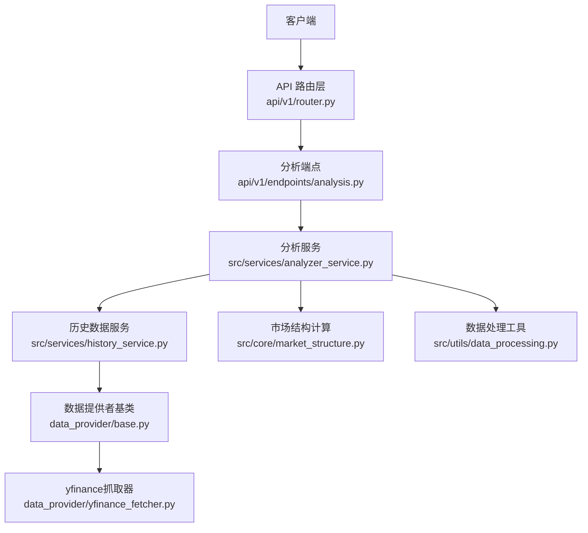
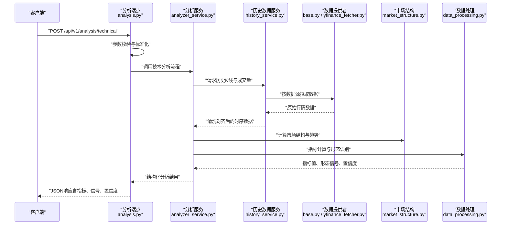
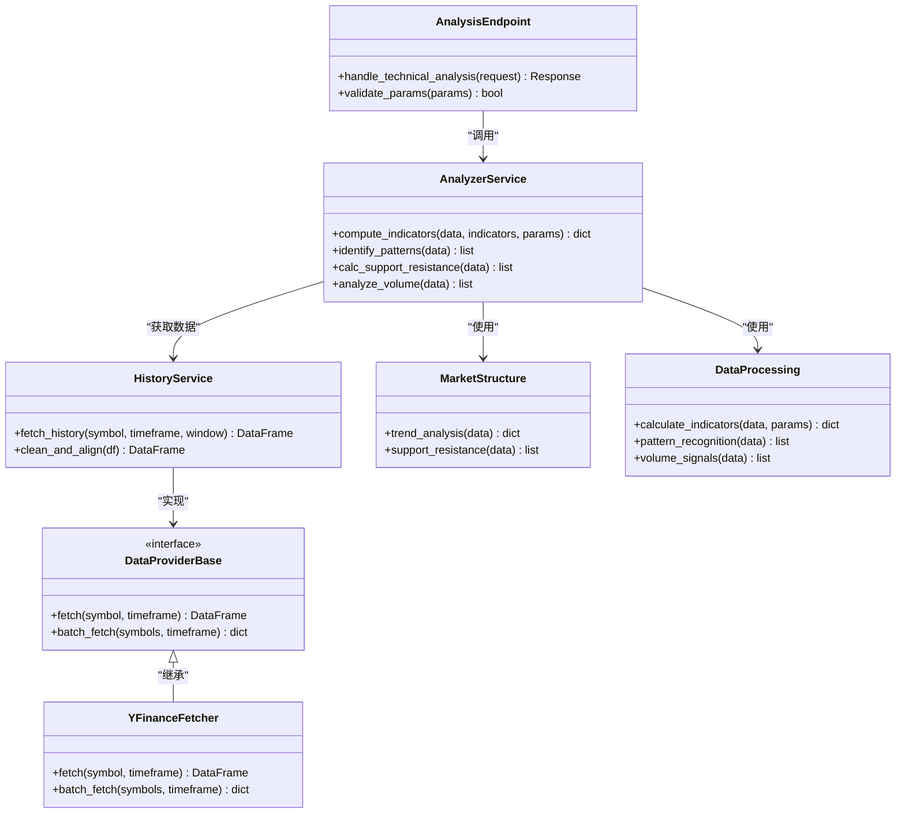

# 技术分析API

<cite>
**本文档引用的文件**   
- [api/app.py](file://api/app.py)
- [api/v1/router.py](file://api/v1/router.py)
- [api/v1/endpoints/analysis.py](file://api/v1/endpoints/analysis.py)
- [api/v1/schemas/analysis.py](file://api/v1/schemas/analysis.py)
- [src/services/analyzer_service.py](file://src/services/analyzer_service.py)
- [src/services/history_service.py](file://src/services/history_service.py)
- [data_provider/base.py](file://data_provider/base.py)
- [data_provider/yfinance_fetcher.py](file://data_provider/yfinance_fetcher.py)
- [src/core/market_structure.py](file://src/core/market_structure.py)
- [src/utils/data_processing.py](file://src/utils/data_processing.py)
- [api/v1/errors.py](file://api/v1/errors.py)
- [api/middlewares/error_handler.py](file://api/middlewares/error_handler.py)
</cite>

## 目录
1. [简介](#简介)
2. [项目结构](#项目结构)
3. [核心组件](#核心组件)
4. [架构总览](#架构总览)
5. [详细组件分析](#详细组件分析)
6. [依赖关系分析](#依赖关系分析)
7. [性能考虑](#性能考虑)
8. [故障排查指南](#故障排查指南)
9. [结论](#结论)
10. [附录](#附录)

## 简介
本技术文档面向使用“技术分析API”的开发者与量化研究者，系统说明技术指标计算、图表生成、趋势分析等功能的调用方法。重点覆盖K线形态识别、支撑阻力位计算、成交量分析的接口规范；提供完整的请求参数配置（时间周期、指标类型、计算参数）、响应数据格式（技术指标数值、信号强度、置信度等）；并给出批量分析与实时计算的示例路径、性能优化建议与错误处理方案。

## 项目结构
后端采用FastAPI分层架构：路由层（v1/router.py）聚合各功能端点，业务逻辑由服务层（services/*）实现，数据获取通过数据提供者抽象（data_provider/*），核心算法与数据结构位于core与utils模块。前端通过REST API调用完成分析任务。

**图示来源** 
- [api/v1/router.py](file://api/v1/router.py)
- [api/v1/endpoints/analysis.py](file://api/v1/endpoints/analysis.py)
- [src/services/analyzer_service.py](file://src/services/analyzer_service.py)
- [src/services/history_service.py](file://src/services/history_service.py)
- [data_provider/base.py](file://data_provider/base.py)
- [data_provider/yfinance_fetcher.py](file://data_provider/yfinance_fetcher.py)
- [src/core/market_structure.py](file://src/core/market_structure.py)
- [src/utils/data_processing.py](file://src/utils/data_processing.py)

**章节来源**
- [api/app.py](file://api/app.py)
- [api/v1/router.py](file://api/v1/router.py)

## 核心组件
- 分析端点（analysis.py）：暴露技术分析相关REST接口，统一接收请求参数，校验后交由分析服务执行。
- 分析服务（analyzer_service.py）：编排指标计算、形态识别、支撑阻力位与成交量分析流程，返回结构化结果。
- 历史数据服务（history_service.py）：封装多数据源的K线与成交数据获取、清洗与对齐。
- 数据提供者（base.py, yfinance_fetcher.py）：定义数据源抽象与具体实现，支持批量拉取与缓存策略。
- 市场结构与数据处理（market_structure.py, data_processing.py）：支撑趋势判断、形态识别与指标计算的核心算法。

**章节来源**
- [api/v1/endpoints/analysis.py](file://api/v1/endpoints/analysis.py)
- [src/services/analyzer_service.py](file://src/services/analyzer_service.py)
- [src/services/history_service.py](file://src/services/history_service.py)
- [data_provider/base.py](file://data_provider/base.py)
- [data_provider/yfinance_fetcher.py](file://data_provider/yfinance_fetcher.py)
- [src/core/market_structure.py](file://src/core/market_structure.py)
- [src/utils/data_processing.py](file://src/utils/data_processing.py)

## 架构总览
技术分析API的请求-响应流程如下：客户端发起HTTP请求至分析端点，端点校验参数并调用分析服务；分析服务协调历史数据服务获取K线与成交量数据，结合市场结构与数据处理模块进行指标计算、形态识别与趋势分析；最终将结果序列化为标准响应结构返回。

**图示来源** 
- [api/v1/endpoints/analysis.py](file://api/v1/endpoints/analysis.py)
- [src/services/analyzer_service.py](file://src/services/analyzer_service.py)
- [src/services/history_service.py](file://src/services/history_service.py)
- [data_provider/base.py](file://data_provider/base.py)
- [data_provider/yfinance_fetcher.py](file://data_provider/yfinance_fetcher.py)
- [src/core/market_structure.py](file://src/core/market_structure.py)
- [src/utils/data_processing.py](file://src/utils/data_processing.py)

## 详细组件分析

### 技术分析端点（analysis.py）
- 职责：定义REST接口，接收股票标识、时间窗口、指标类型与计算参数，返回统一的结构化响应。
- 关键能力：
  - 技术指标计算：支持MA、RSI、MACD、布林带等常见指标，参数包括周期、平滑系数等。
  - K线形态识别：识别常见形态（如十字星、吞没、早晨之星等），输出形态类型、位置与置信度。
  - 支撑阻力位计算：基于历史高低点、成交量密集区与波动区间，输出支撑/阻力价格与强度。
  - 成交量分析：量价背离、放量突破、缩量回调等信号，附带信号强度与置信度。
- 请求参数（摘要）：
  - symbol: 股票代码或指数代码
  - timeframe: 时间周期（如1d, 1h, 5m）
  - indicators: 指标列表（如ma, rsi, macd, boll）
  - params: 指标参数（如ma_period, rsi_period, macd_fast, macd_slow, boll_std）
  - window: 分析窗口（起始与结束时间或长度）
  - mode: 模式（single/batch/realtime）
- 响应字段（摘要）：
  - technicals: 指标数值数组（时间戳、指标名、值）
  - patterns: 形态识别结果（形态类型、位置、置信度）
  - support_resistance: 支撑阻力位（价格、强度、依据）
  - volume_signals: 成交量信号（类型、强度、置信度）
  - meta: 元信息（数据来源、计算耗时、版本）

**章节来源**
- [api/v1/endpoints/analysis.py](file://api/v1/endpoints/analysis.py)
- [api/v1/schemas/analysis.py](file://api/v1/schemas/analysis.py)

### 分析服务（analyzer_service.py）
- 职责：编排分析流程，协调历史数据服务与市场结构/数据处理模块，确保指标计算与信号生成的准确性与一致性。
- 关键流程：
  - 参数校验与默认值填充
  - 数据拉取与清洗（缺失值处理、异常值过滤）
  - 指标计算与形态识别（并行化与缓存）
  - 支撑阻力位与成交量信号生成
  - 结果聚合与置信度评估
- 性能要点：
  - 对重复查询启用缓存
  - 大窗口数据分块计算
  - 异步并发拉取多数据源

**章节来源**
- [src/services/analyzer_service.py](file://src/services/analyzer_service.py)

### 历史数据服务（history_service.py）
- 职责：统一封装多数据源的K线与成交量数据获取，提供清洗、对齐与标准化接口。
- 关键能力：
  - 多源适配（yfinance、tushare、akshare等）
  - 时间戳对齐与缺失值插补
  - 批量拉取与分页控制
  - 错误重试与降级策略

**章节来源**
- [src/services/history_service.py](file://src/services/history_service.py)

### 数据提供者（base.py, yfinance_fetcher.py）
- base.py：定义数据源抽象接口（fetch、batch_fetch、normalize），约束返回数据结构。
- yfinance_fetcher.py：基于yfinance的具体实现，支持历史K线、成交量与基本面数据拉取。
- 设计要点：
  - 统一的错误码与异常类型
  - 可插拔的数据源切换
  - 连接池与限流控制

**章节来源**
- [data_provider/base.py](file://data_provider/base.py)
- [data_provider/yfinance_fetcher.py](file://data_provider/yfinance_fetcher.py)

### 市场结构与数据处理（market_structure.py, data_processing.py）
- market_structure.py：趋势判断、波段识别、支撑阻力位计算的核心算法。
- data_processing.py：指标计算、形态识别、信号强度与置信度评估的工具函数集合。
- 复杂度与优化：
  - 滑动窗口算法O(n)
  - 向量化计算减少循环开销
  - 内存友好型分块处理

**章节来源**
- [src/core/market_structure.py](file://src/core/market_structure.py)
- [src/utils/data_processing.py](file://src/utils/data_processing.py)

## 依赖关系分析
技术分析API的模块耦合遵循清晰的分层与职责分离：
- 路由层仅负责参数校验与响应序列化
- 服务层编排业务流程，不直接访问数据源
- 数据提供者抽象屏蔽底层差异
- 核心算法独立于IO，便于测试与复用

**图示来源** 
- [api/v1/endpoints/analysis.py](file://api/v1/endpoints/analysis.py)
- [src/services/analyzer_service.py](file://src/services/analyzer_service.py)
- [src/services/history_service.py](file://src/services/history_service.py)
- [data_provider/base.py](file://data_provider/base.py)
- [data_provider/yfinance_fetcher.py](file://data_provider/yfinance_fetcher.py)
- [src/core/market_structure.py](file://src/core/market_structure.py)
- [src/utils/data_processing.py](file://src/utils/data_processing.py)

**章节来源**
- [api/v1/router.py](file://api/v1/router.py)
- [api/v1/endpoints/analysis.py](file://api/v1/endpoints/analysis.py)

## 性能考虑
- 缓存策略：对常用指标与形态识别结果启用短期缓存，减少重复计算。
- 并发拉取：历史数据服务支持多数据源并发拉取，提升整体吞吐。
- 分块计算：大窗口数据按固定大小分块处理，避免内存峰值过高。
- 向量化计算：优先使用NumPy/Pandas向量化操作，降低Python循环开销。
- 连接池与限流：数据提供者内部维护连接池，并对第三方API实施限流与重试。

[本节为通用性能指导，无需特定文件引用]

## 故障排查指南
- 常见错误：
  - 参数校验失败：检查symbol、timeframe、indicators与params是否符合规范。
  - 数据拉取超时：确认网络连通性与数据源可用性，必要时切换备用数据源。
  - 指标计算异常：检查输入数据完整性（缺失值、异常值）与参数合理性。
  - 形态识别无结果：确认窗口长度足够覆盖形态所需的历史数据。
- 错误处理机制：
  - 统一错误码与消息结构，便于客户端快速定位问题。
  - 中间件捕获未处理异常，返回标准化错误响应。
  - 日志记录关键步骤与异常堆栈，辅助调试。

**章节来源**
- [api/v1/errors.py](file://api/v1/errors.py)
- [api/middlewares/error_handler.py](file://api/middlewares/error_handler.py)

## 结论
技术分析API提供了完整的技术分析能力，涵盖指标计算、形态识别、支撑阻力位与成交量分析。通过清晰的分层架构与可扩展的数据提供者设计，系统具备良好的性能与稳定性。开发者可基于本文档的接口规范与最佳实践，快速集成并构建高质量的量化分析应用。

[本节为总结性内容，无需特定文件引用]

## 附录
- 批量分析示例：参考分析端点的batch模式调用方式，传入多个symbol与统一参数，返回聚合结果。
- 实时计算示例：参考realtime模式，订阅最新K线数据流，增量更新指标与信号。
- 参数配置清单：详见分析端点与Schema定义，包含所有指标类型与可调参数。
- 响应数据字典：包含技术指标数值、信号强度、置信度与元信息的完整结构。

[本节为补充说明，无需特定文件引用]