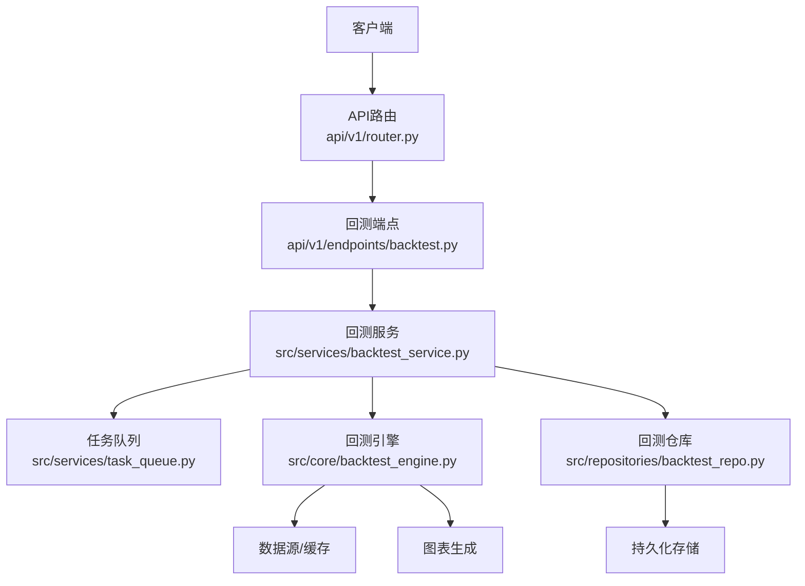
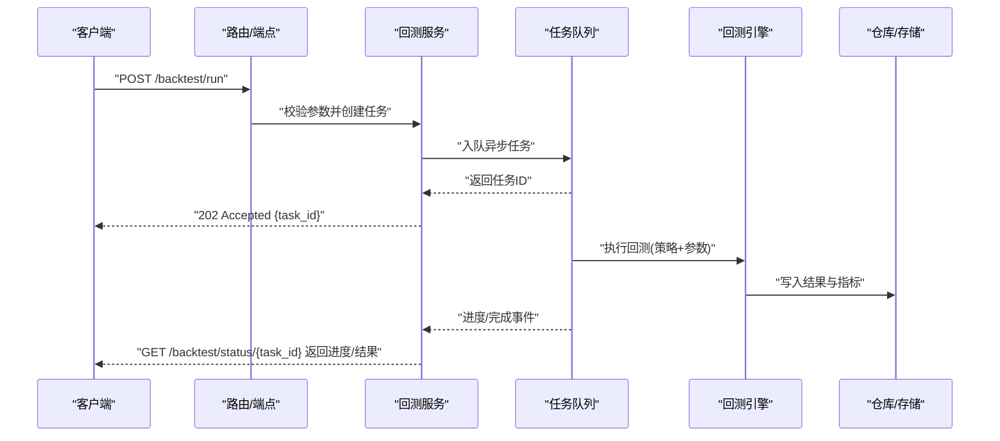
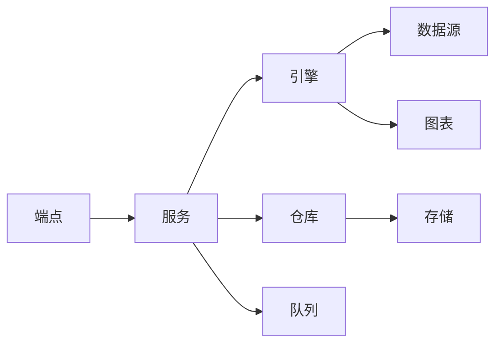

# 回测引擎API

<cite>
**本文引用的文件**   
- [api/v1/endpoints/backtest.py](file://api/v1/endpoints/backtest.py)
- [api/v1/schemas/backtest.py](file://api/v1/schemas/backtest.py)
- [src/core/backtest_engine.py](file://src/core/backtest_engine.py)
- [src/services/backtest_service.py](file://src/services/backtest_service.py)
- [src/repositories/backtest_repo.py](file://src/repositories/backtest_repo.py)
- [api/v1/router.py](file://api/v1/router.py)
- [api/app.py](file://api/app.py)
- [src/services/task_queue.py](file://src/services/task_queue.py)
- [src/services/task_service.py](file://src/services/task_service.py)
- [strategies/ma_golden_cross.yaml](file://strategies/ma_golden_cross.yaml)
- [strategies/bottom_volume.yaml](file://strategies/bottom_volume.yaml)
</cite>

## 目录
1. [简介](#简介)
2. [项目结构](#项目结构)
3. [核心组件](#核心组件)
4. [架构总览](#架构总览)
5. [详细组件分析](#详细组件分析)
6. [依赖关系分析](#依赖关系分析)
7. [性能考虑](#性能考虑)
8. [故障排查指南](#故障排查指南)
9. [结论](#结论)
10. [附录](#附录)

## 简介
本文件面向策略回测相关的API接口，覆盖策略配置、参数设置与回测执行；回测结果查询、性能指标分析与可视化图表获取；多策略对比、参数优化与蒙特卡洛模拟的调用方式；异步任务处理、进度跟踪与结果下载机制；以及回测引擎配置优化与性能调优建议。文档同时提供完整的请求响应示例与数据结构说明，帮助开发者快速集成与高效使用。

## 项目结构
回测相关能力由API层、服务层、引擎层与存储层共同构成：
- API层：定义HTTP路由与请求/响应模型（Pydantic），暴露REST接口。
- 服务层：编排业务逻辑，协调引擎、任务队列与仓库。
- 引擎层：实现回测计算、指标统计、图表生成与蒙特卡洛模拟。
- 存储层：持久化回测任务、结果与中间产物。

**图示来源** 
- [api/v1/router.py](file://api/v1/router.py)
- [api/v1/endpoints/backtest.py](file://api/v1/endpoints/backtest.py)
- [src/services/backtest_service.py](file://src/services/backtest_service.py)
- [src/core/backtest_engine.py](file://src/core/backtest_engine.py)
- [src/repositories/backtest_repo.py](file://src/repositories/backtest_repo.py)
- [src/services/task_queue.py](file://src/services/task_queue.py)

**章节来源**
- [api/v1/router.py](file://api/v1/router.py)
- [api/app.py](file://api/app.py)

## 核心组件
- 回测端点：接收策略配置与回测参数，创建或查询回测任务，返回任务ID与状态。
- 回测服务：校验输入、调度引擎、管理异步任务、聚合结果与指标。
- 回测引擎：执行历史数据回放、信号生成、交易模拟、绩效统计与图表输出。
- 回测仓库：存取任务元数据、结果快照、指标摘要与图表文件路径。
- 任务队列：支持异步执行、进度上报、重试与取消。

**章节来源**
- [api/v1/endpoints/backtest.py](file://api/v1/endpoints/backtest.py)
- [src/services/backtest_service.py](file://src/services/backtest_service.py)
- [src/core/backtest_engine.py](file://src/core/backtest_engine.py)
- [src/repositories/backtest_repo.py](file://src/repositories/backtest_repo.py)
- [src/services/task_queue.py](file://src/services/task_queue.py)

## 架构总览
下图展示一次“提交回测任务”的端到端流程，包括异步任务创建、执行与结果落库。

**图示来源** 
- [api/v1/endpoints/backtest.py](file://api/v1/endpoints/backtest.py)
- [src/services/backtest_service.py](file://src/services/backtest_service.py)
- [src/core/backtest_engine.py](file://src/core/backtest_engine.py)
- [src/repositories/backtest_repo.py](file://src/repositories/backtest_repo.py)
- [src/services/task_queue.py](file://src/services/task_queue.py)

## 详细组件分析

### 回测端点（API）
- 功能要点
  - 提交回测：支持同步与异步两种模式；异步返回任务ID供后续查询。
  - 查询状态：按任务ID轮询进度与最终结果。
  - 结果下载：返回图表与报告文件的访问路径或直链。
  - 多策略对比：批量提交多个策略任务，返回汇总对比视图。
  - 参数优化：提交参数网格或随机搜索任务，返回最优参数组合与结果。
  - 蒙特卡洛模拟：基于参数扰动与随机抽样，输出分布与置信区间。
- 典型请求/响应
  - 提交回测（异步）
    - 请求体字段：策略标识、时间窗口、标的列表、初始资金、手续费/滑点、风控规则、是否并行等。
    - 响应体：任务ID、状态、预计耗时、查询URL。
  - 查询状态
    - 响应体：进度百分比、阶段描述、错误信息（如有）、结果摘要（如已就绪）。
  - 下载结果
    - 响应体：图表URL、指标JSON、交易日志CSV、净值曲线PNG等。
- 注意事项
  - 大任务建议使用异步模式，避免超时。
  - 并发度受系统资源限制，需合理设置。
  - 失败任务可重试，注意幂等性。

**章节来源**
- [api/v1/endpoints/backtest.py](file://api/v1/endpoints/backtest.py)
- [api/v1/schemas/backtest.py](file://api/v1/schemas/backtest.py)

### 回测服务（编排）
- 职责
  - 参数校验与默认值填充。
  - 任务生命周期管理（创建、调度、监控、清理）。
  - 结果聚合与指标计算。
  - 与引擎交互（单策略/多策略/蒙特卡洛）。
- 关键流程
  - 提交任务：校验输入→创建任务记录→入队→返回任务ID。
  - 执行任务：从队列取出→调用引擎→更新进度→落库结果。
  - 查询任务：读取任务状态/结果→组装响应。
  - 对比/优化：批量调度→汇总指标→排序与筛选。

**章节来源**
- [src/services/backtest_service.py](file://src/services/backtest_service.py)
- [src/services/task_queue.py](file://src/services/task_queue.py)

### 回测引擎（计算）
- 能力
  - 数据加载与对齐（日线/分钟线、复权、除权处理）。
  - 策略信号生成（技术指标、基本面因子、事件驱动）。
  - 交易模拟（撮合、滑点、手续费、涨跌停、停牌）。
  - 绩效统计（收益、回撤、夏普、Sortino、Calmar、胜率、盈亏比等）。
  - 图表生成（净值曲线、回撤曲线、持仓分布、月度收益热力图）。
  - 蒙特卡洛模拟（参数扰动、随机路径、置信区间）。
- 复杂度与优化
  - 向量化计算优先，减少Python循环。
  - 分块/分页读取大数据集，控制内存峰值。
  - 并行回测（多进程/多线程）结合I/O与CPU瓶颈进行权衡。

**章节来源**
- [src/core/backtest_engine.py](file://src/core/backtest_engine.py)

### 回测仓库（持久化）
- 内容
  - 任务元数据（策略、参数、时间范围、状态、创建/更新时间）。
  - 结果快照（指标摘要、关键图表路径、日志路径）。
  - 对比与优化任务的结果集合。
- 设计
  - 读写分离与索引优化（按任务ID、策略ID、时间范围）。
  - 版本化与归档策略，便于回溯与审计。

**章节来源**
- [src/repositories/backtest_repo.py](file://src/repositories/backtest_repo.py)

### 任务队列（异步）
- 特性
  - 支持优先级、重试、退避、死信队列。
  - 进度上报（百分比、阶段、错误堆栈）。
  - 取消与暂停（视实现而定）。
- 使用建议
  - 根据负载动态扩缩容消费者数量。
  - 监控队列堆积与消费延迟。

**章节来源**
- [src/services/task_queue.py](file://src/services/task_queue.py)
- [src/services/task_service.py](file://src/services/task_service.py)

### 策略配置示例
- YAML策略文件
  - 包含策略名称、参数模板、信号规则、风控约束、适用市场等。
  - 可通过API直接引用策略标识，无需重复传入完整参数。
- 内置策略
  - 均线金叉、缩量回调、底部放量等常见技术策略。

**章节来源**
- [strategies/ma_golden_cross.yaml](file://strategies/ma_golden_cross.yaml)
- [strategies/bottom_volume.yaml](file://strategies/bottom_volume.yaml)

## 依赖关系分析
- 模块耦合
  - 端点依赖服务层，服务层依赖引擎与仓库，仓库依赖存储后端。
  - 任务队列作为解耦层，降低端点与服务之间的紧耦合。
- 外部依赖
  - 数据源（行情/基本面）、对象存储（图表/报告）、消息队列（异步任务）。
- 潜在风险
  - 引擎与仓库之间的大对象传输需序列化优化。
  - 高并发下队列与存储的锁竞争。

**图示来源** 
- [api/v1/endpoints/backtest.py](file://api/v1/endpoints/backtest.py)
- [src/services/backtest_service.py](file://src/services/backtest_service.py)
- [src/core/backtest_engine.py](file://src/core/backtest_engine.py)
- [src/repositories/backtest_repo.py](file://src/repositories/backtest_repo.py)
- [src/services/task_queue.py](file://src/services/task_queue.py)

**章节来源**
- [api/v1/router.py](file://api/v1/router.py)
- [api/app.py](file://api/app.py)

## 性能考虑
- 引擎层面
  - 使用向量化计算与内存映射，减少GC压力。
  - 对长周期数据采用分块处理与增量更新。
  - 合理设置并行度，避免CPU/IO争用。
- 服务与队列
  - 消费者数量与任务粒度匹配，避免小任务过多导致调度开销。
  - 启用批处理与合并输出，降低I/O次数。
- 存储与网络
  - 图表与报告采用压缩与CDN分发。
  - 结果查询接口增加缓存与ETag，减少重复计算。
- 监控与告警
  - 追踪任务耗时、失败率、队列长度、内存/CPU占用。
  - 设置阈值告警，自动扩容或降级。

[本节为通用指导，不直接分析具体文件]

## 故障排查指南
- 常见问题
  - 任务长时间无进度：检查队列消费者是否运行、是否有阻塞或异常。
  - 结果缺失或不完整：确认引擎是否成功落库，检查存储权限与路径。
  - 指标异常：核对数据源质量、复权处理、涨跌停与停牌规则。
  - 并发冲突：观察锁竞争与死锁，调整事务隔离级别。
- 定位方法
  - 查看任务日志与错误堆栈。
  - 检查队列堆积与消费者健康状态。
  - 验证策略配置与参数边界。
- 恢复策略
  - 重试失败任务，必要时重置状态。
  - 清理僵尸任务与过期结果，释放资源。

**章节来源**
- [src/services/task_queue.py](file://src/services/task_queue.py)
- [src/repositories/backtest_repo.py](file://src/repositories/backtest_repo.py)

## 结论
本回测引擎API通过清晰的层次划分与异步任务机制，提供了稳定高效的策略回测能力。借助完善的指标与图表输出，用户可便捷地进行多策略对比、参数优化与蒙特卡洛模拟。建议在部署时关注队列与存储的性能瓶颈，并结合监控告警保障稳定性。

[本节为总结性内容，不直接分析具体文件]

## 附录

### API接口清单与示例
- 提交回测任务（异步）
  - 方法：POST
  - 路径：/backtest/run
  - 请求体关键字段：strategy_id、start_date、end_date、symbols、initial_capital、commission、slippage、risk_rules、parallelism
  - 响应体关键字段：task_id、status、estimated_seconds、status_url
- 查询任务状态
  - 方法：GET
  - 路径：/backtest/status/{task_id}
  - 响应体关键字段：progress、phase、error、result_summary
- 下载结果
  - 方法：GET
  - 路径：/backtest/result/{task_id}
  - 响应体关键字段：metrics_json、charts_urls、trade_log_csv、net_value_png
- 多策略对比
  - 方法：POST
  - 路径：/backtest/compare
  - 请求体关键字段：tasks（多个task_id或策略参数组）
  - 响应体关键字段：comparison_metrics、ranking、charts_urls
- 参数优化
  - 方法：POST
  - 路径：/backtest/optimize
  - 请求体关键字段：strategy_id、param_grid或random_search、objective、n_iter、constraints
  - 响应体关键字段：best_params、best_score、history、charts_urls
- 蒙特卡洛模拟
  - 方法：POST
  - 路径：/backtest/monte_carlo
  - 请求体关键字段：strategy_id、base_params、perturbation、n_paths、confidence_level
  - 响应体关键字段：distribution_stats、confidence_intervals、scenario_charts

[本节为概念性接口说明，未直接分析具体文件]

### 回测结果数据结构（摘要）
- 指标摘要
  - 年化收益、最大回撤、夏普比率、Sortino比率、Calmar比率、胜率、盈亏比、交易次数、换手率等。
- 时序数据
  - 日期、净值、回撤、仓位、买卖信号、成交明细。
- 图表与报告
  - 净值曲线、回撤曲线、月度收益热力图、持仓分布、交易热力图等。

[本节为概念性数据结构说明，未直接分析具体文件]

### 策略开发最佳实践
- 明确信号触发条件与过滤规则，避免过度拟合。
- 合理设置止损止盈与仓位管理，控制尾部风险。
- 使用滚动窗口与样本外测试，评估稳健性。
- 对极端行情做鲁棒性检验（涨跌停、停牌、流动性不足）。
- 将策略参数抽象为YAML模板，便于版本管理与复用。

[本节为概念性最佳实践，未直接分析具体文件]

### 常见问题解决方案
- 数据质量问题：清洗异常值、补齐缺失、统一复权口径。
- 信号漂移：引入正则化与参数稳定性检查。
- 回测过拟合：简化策略、交叉验证、样本外评估。
- 执行偏差：加入滑点、手续费、冲击成本与撮合延迟。

[本节为概念性问题解决，未直接分析具体文件]