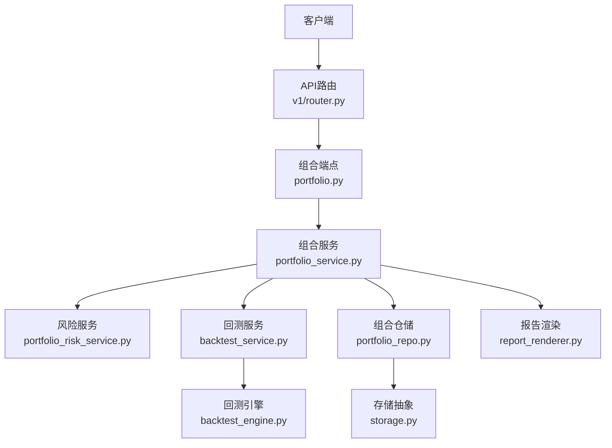
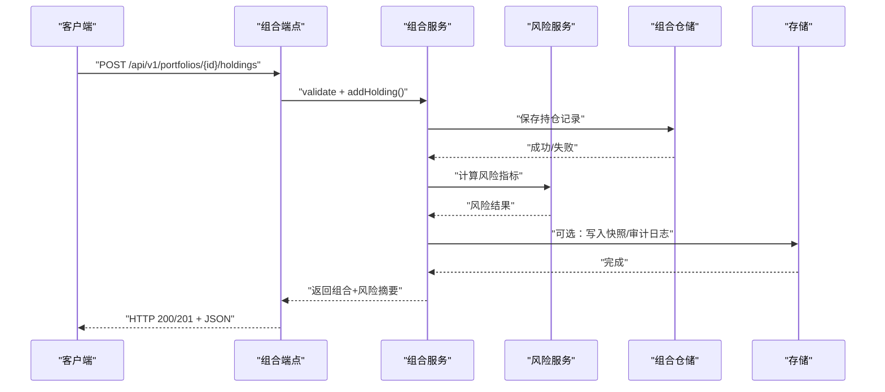
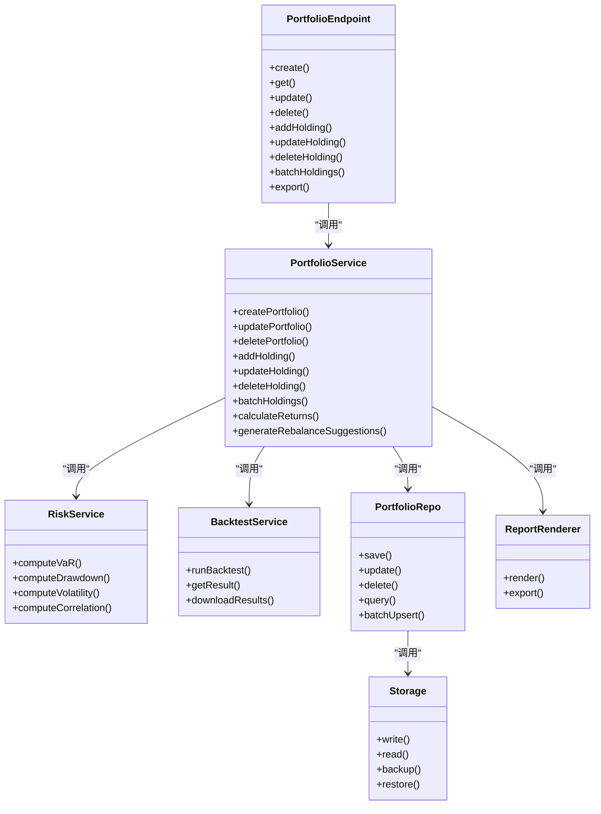

# 投资组合API

<cite>
**本文引用的文件**   
- [api/v1/endpoints/portfolio.py](file://api/v1/endpoints/portfolio.py)
- [api/v1/schemas/portfolio.py](file://api/v1/schemas/portfolio.py)
- [src/services/portfolio_service.py](file://src/services/portfolio_service.py)
- [src/services/portfolio_risk_service.py](file://src/services/portfolio_risk_service.py)
- [src/repositories/portfolio_repo.py](file://src/repositories/portfolio_repo.py)
- [api/app.py](file://api/app.py)
- [api/v1/router.py](file://api/v1/router.py)
- [src/services/backtest_service.py](file://src/services/backtest_service.py)
- [src/core/backtest_engine.py](file://src/core/backtest_engine.py)
- [src/services/report_renderer.py](file://src/services/report_renderer.py)
- [src/storage.py](file://src/storage.py)
</cite>

## 目录
1. [简介](#简介)
2. [项目结构](#项目结构)
3. [核心组件](#核心组件)
4. [架构总览](#架构总览)
5. [详细组件分析](#详细组件分析)
6. [依赖关系分析](#依赖关系分析)
7. [性能考虑](#性能考虑)
8. [故障排查指南](#故障排查指南)
9. [结论](#结论)
10. [附录](#附录)

## 简介
本文件面向使用“投资组合管理”相关API的开发者与集成方，系统性地说明持仓增删改、风险评估、收益计算、绩效分析、资产配置、再平衡策略、模拟交易（回测）、数据同步/备份恢复/迁移、监控与报表生成等能力。文档以接口契约为核心，提供请求参数、响应数据结构、批量操作、事务处理与并发控制示例，以及常见问题的定位方法。

## 项目结构
本项目采用分层架构：
- API层：FastAPI路由与Pydantic模型定义，负责入参校验、错误处理与对外暴露。
- 服务层：业务编排与领域逻辑，如组合CRUD、风险与收益计算、回测执行、报告渲染。
- 仓储层：数据持久化访问，封装数据库或存储实现细节。
- 基础设施：存储抽象、任务队列、配置管理等。

图表来源
- [api/v1/router.py](file://api/v1/router.py)
- [api/v1/endpoints/portfolio.py](file://api/v1/endpoints/portfolio.py)
- [src/services/portfolio_service.py](file://src/services/portfolio_service.py)
- [src/services/portfolio_risk_service.py](file://src/services/portfolio_risk_service.py)
- [src/services/backtest_service.py](file://src/services/backtest_service.py)
- [src/core/backtest_engine.py](file://src/core/backtest_engine.py)
- [src/repositories/portfolio_repo.py](file://src/repositories/portfolio_repo.py)
- [src/storage.py](file://src/storage.py)
- [src/services/report_renderer.py](file://src/services/report_renderer.py)

章节来源
- [api/app.py](file://api/app.py)
- [api/v1/router.py](file://api/v1/router.py)

## 核心组件
- 组合端点（Portfolio Endpoints）：提供组合与持仓的CRUD、批量操作、查询与导出。
- 组合服务（Portfolio Service）：组合生命周期管理、资产权重计算、再平衡建议、与风险/回测/报告服务的协作。
- 风险服务（Risk Service）：VaR、回撤、波动率、相关性、集中度等指标计算。
- 回测服务（Backtest Service）：策略回测、模拟交易、绩效统计与曲线输出。
- 仓储（Portfolio Repo）：组合与持仓数据的读写、分页、过滤、事务边界。
- 存储（Storage）：统一的数据存取抽象，支持本地/远程存储、备份与恢复。
- 报告渲染（Report Renderer）：将组合快照、风险与绩效结果渲染为Markdown/HTML/PDF等格式。

章节来源
- [api/v1/endpoints/portfolio.py](file://api/v1/endpoints/portfolio.py)
- [api/v1/schemas/portfolio.py](file://api/v1/schemas/portfolio.py)
- [src/services/portfolio_service.py](file://src/services/portfolio_service.py)
- [src/services/portfolio_risk_service.py](file://src/services/portfolio_risk_service.py)
- [src/services/backtest_service.py](file://src/services/backtest_service.py)
- [src/repositories/portfolio_repo.py](file://src/repositories/portfolio_repo.py)
- [src/storage.py](file://src/storage.py)
- [src/services/report_renderer.py](file://src/services/report_renderer.py)

## 架构总览
下图展示一次典型的“添加持仓并计算风险”的请求链路：

图表来源
- [api/v1/endpoints/portfolio.py](file://api/v1/endpoints/portfolio.py)
- [src/services/portfolio_service.py](file://src/services/portfolio_service.py)
- [src/services/portfolio_risk_service.py](file://src/services/portfolio_risk_service.py)
- [src/repositories/portfolio_repo.py](file://src/repositories/portfolio_repo.py)
- [src/storage.py](file://src/storage.py)

## 详细组件分析

### 组合与持仓管理（CRUD）
- 功能范围
  - 创建/更新/删除投资组合
  - 添加/修改/删除持仓（代码、数量、成本、日期、备注等）
  - 批量导入/更新持仓
  - 查询组合列表、详情、持仓明细、历史快照
  - 导出组合数据（CSV/JSON）
- 典型接口
  - POST /api/v1/portfolios：创建组合
  - GET /api/v1/portfolios/{id}：获取组合详情
  - PUT /api/v1/portfolios/{id}：更新组合元信息
  - DELETE /api/v1/portfolios/{id}：删除组合
  - POST /api/v1/portfolios/{id}/holdings：新增持仓
  - PUT /api/v1/portfolios/{id}/holdings/{symbol}：修改持仓
  - DELETE /api/v1/portfolios/{id}/holdings/{symbol}：删除持仓
  - POST /api/v1/portfolios/{id}/holdings/batch：批量操作
  - GET /api/v1/portfolios/{id}/holdings：查询持仓列表
  - GET /api/v1/portfolios/{id}/export：导出数据
- 请求参数要点
  - 组合：名称、描述、币种、基准指数、标签、自定义字段
  - 持仓：标的代码、方向（多/空）、数量、单价、手续费、税费、成交时间、备注
  - 批量：操作类型（add/update/delete）、幂等键、冲突策略（skip/overwrite）
- 响应数据结构要点
  - 组合对象：标识、元信息、更新时间、状态
  - 持仓对象：标的、数量、成本、市值、权重、盈亏、更新时间
  - 批量结果：成功/失败明细、错误码与消息
- 事务与并发
  - 同一组合的写操作通过仓储层加锁或乐观锁保证一致性
  - 批量操作支持部分成功与回滚策略
  - 并发场景下建议使用幂等键避免重复提交

章节来源
- [api/v1/endpoints/portfolio.py](file://api/v1/endpoints/portfolio.py)
- [api/v1/schemas/portfolio.py](file://api/v1/schemas/portfolio.py)
- [src/services/portfolio_service.py](file://src/services/portfolio_service.py)
- [src/repositories/portfolio_repo.py](file://src/repositories/portfolio_repo.py)

### 风险评估与收益计算
- 功能范围
  - 风险指标：VaR（历史/参数法）、最大回撤、波动率、Beta、夏普比率、索提诺比率、跟踪误差、集中度（HHI）、流动性风险
  - 收益计算：日/周/月/年收益率、累计收益、年化收益、超额收益（相对基准）
  - 归因分析：行业/风格/因子贡献（若启用）
- 典型接口
  - POST /api/v1/portfolios/{id}/risk：计算风险指标
  - GET /api/v1/portfolios/{id}/risk：获取最近一次风险快照
  - POST /api/v1/portfolios/{id}/returns：计算收益序列与汇总
  - GET /api/v1/portfolios/{id}/returns：获取收益汇总
- 输入参数要点
  - 风险：置信水平、持有期、回溯窗口、频率、是否含现金
  - 收益：起止时间、复权方式、基准代码、分红处理方式
- 输出要点
  - 风险：指标字典、分布假设、关键阈值、风险提示
  - 收益：各期收益、年化指标、基准对比、偏差统计

章节来源
- [src/services/portfolio_risk_service.py](file://src/services/portfolio_risk_service.py)
- [src/services/portfolio_service.py](file://src/services/portfolio_service.py)
- [api/v1/endpoints/portfolio.py](file://api/v1/endpoints/portfolio.py)

### 资产配置与再平衡策略
- 功能范围
  - 目标权重设置与版本化管理
  - 偏离度检测与再平衡建议
  - 策略模板：均值方差、风险平价、最小方差、Black-Litterman（若启用）
- 典型接口
  - POST /api/v1/portfolios/{id}/allocation/targets：设置目标权重
  - GET /api/v1/portfolios/{id}/allocation/targets：查询目标权重
  - POST /api/v1/portfolios/{id}/rebalance：触发再平衡评估与建议
  - GET /api/v1/portfolios/{id}/rebalance/suggestions：获取再平衡建议
- 输入参数要点
  - 目标权重：标的权重、约束（上下限、行业上限、流动性阈值）
  - 再平衡：阈值、调仓成本、滑点、交易费用、执行限制
- 输出要点
  - 偏离度矩阵、调仓清单、预计影响（收益/风险/成本）

章节来源
- [src/services/portfolio_service.py](file://src/services/portfolio_service.py)
- [api/v1/endpoints/portfolio.py](file://api/v1/endpoints/portfolio.py)

### 模拟交易与回测（Backtesting）
- 功能范围
  - 策略回测：历史数据回放、信号生成、撮合引擎、费用与滑点
  - 绩效统计：收益曲线、回撤、换手率、胜率、盈亏比
  - 参数扫描与敏感性分析
- 典型接口
  - POST /api/v1/backtests：启动回测任务
  - GET /api/v1/backtests/{id}：查询回测结果
  - GET /api/v1/backtests/{id}/results：下载结果（CSV/JSON）
- 输入参数要点
  - 回测：策略ID/规则、起始/结束时间、初始资金、费率、滑点、基准、风控参数
- 输出要点
  - 日度净值、交易明细、风险收益指标、图表数据

章节来源
- [src/services/backtest_service.py](file://src/services/backtest_service.py)
- [src/core/backtest_engine.py](file://src/core/backtest_engine.py)
- [api/v1/endpoints/portfolio.py](file://api/v1/endpoints/portfolio.py)

### 数据同步、备份恢复与迁移
- 功能范围
  - 数据同步：增量/全量同步、冲突解决、断点续传
  - 备份恢复：快照导出、导入恢复、版本回滚
  - 数据迁移：跨库/跨格式迁移、校验与比对
- 典型接口
  - POST /api/v1/data/sync：发起同步任务
  - GET /api/v1/data/sync/{id}：查询同步状态
  - POST /api/v1/data/backup：创建备份
  - POST /api/v1/data/restore：从备份恢复
  - POST /api/v1/data/migrate：执行迁移任务
- 输入参数要点
  - 同步：源/目标、过滤条件、模式（增量/全量）、重试策略
  - 备份/恢复：备份ID、覆盖策略、校验开关
  - 迁移：源/目标适配器、映射规则、验证选项
- 输出要点
  - 任务ID、进度、错误日志、校验报告

章节来源
- [src/storage.py](file://src/storage.py)
- [api/v1/endpoints/portfolio.py](file://api/v1/endpoints/portfolio.py)

### 监控与报表生成
- 功能范围
  - 实时监控：组合快照、风险预警、持仓异常
  - 报表生成：日报/周报/月报、PDF/Markdown/HTML
- 典型接口
  - GET /api/v1/portfolios/{id}/snapshot：获取最新快照
  - GET /api/v1/portfolios/{id}/alerts：获取告警列表
  - POST /api/v1/reports/generate：生成报表（指定模板与维度）
  - GET /api/v1/reports/{id}：查询报表状态与下载链接
- 输入参数要点
  - 快照：时间粒度、包含字段
  - 报表：模板、时间范围、语言、输出格式
- 输出要点
  - 快照数据、告警明细、报表元信息与下载URL

章节来源
- [src/services/report_renderer.py](file://src/services/report_renderer.py)
- [api/v1/endpoints/portfolio.py](file://api/v1/endpoints/portfolio.py)

### 批量操作、事务处理与并发控制示例
- 批量操作
  - 使用批量接口一次性提交多条变更，支持部分成功与失败明细
  - 建议携带幂等键，确保网络重试不产生副作用
- 事务处理
  - 仓储层对同一组合的写操作进行事务包装，失败自动回滚
  - 跨服务调用（如风险/回测）建议异步化，避免阻塞主流程
- 并发控制
  - 使用乐观锁版本号或分布式锁防止并发覆盖
  - 高并发场景下对热点组合进行分片或缓存读路径

章节来源
- [src/repositories/portfolio_repo.py](file://src/repositories/portfolio_repo.py)
- [src/services/portfolio_service.py](file://src/services/portfolio_service.py)

## 依赖关系分析
- 组件耦合
  - 端点仅做入参校验与调度，核心逻辑下沉至服务层
  - 服务层依赖仓储与外部服务（风险、回测、报告）
  - 仓储屏蔽存储实现差异，便于扩展与替换
- 外部依赖
  - 数据存储（本地/云存储）
  - 行情与基本面数据源（由其他模块提供）
  - 任务队列（用于长耗时任务）

图表来源
- [api/v1/endpoints/portfolio.py](file://api/v1/endpoints/portfolio.py)
- [src/services/portfolio_service.py](file://src/services/portfolio_service.py)
- [src/services/portfolio_risk_service.py](file://src/services/portfolio_risk_service.py)
- [src/services/backtest_service.py](file://src/services/backtest_service.py)
- [src/repositories/portfolio_repo.py](file://src/repositories/portfolio_repo.py)
- [src/storage.py](file://src/storage.py)
- [src/services/report_renderer.py](file://src/services/report_renderer.py)

章节来源
- [api/v1/router.py](file://api/v1/router.py)
- [api/app.py](file://api/app.py)

## 性能考虑
- 读多写少场景：对查询路径引入缓存（组合快照、风险指标），缩短响应时间
- 批量操作：服务端分批处理，避免单次过大负载；客户端分批次提交
- 长耗时任务：回测、报表生成、数据同步采用异步任务队列，前端轮询或事件推送
- 并发安全：热点组合使用细粒度锁或分片；读写分离提升吞吐
- I/O优化：批量入库、索引优化、分页查询限制返回字段

[本节为通用指导，无需引用具体文件]

## 故障排查指南
- 常见问题
  - 参数校验失败：检查必填字段、数据类型、枚举值、范围约束
  - 并发冲突：检查版本号或锁状态，必要时重试或合并策略
  - 数据不一致：核对快照与明细，检查同步任务状态与错误日志
  - 回测失败：确认数据源可用性、时间范围、策略参数合理性
- 定位步骤
  - 查看端点日志与错误码
  - 检查仓储层事务日志与锁状态
  - 核对存储备份/恢复任务状态
  - 使用快照与导出功能对比数据差异

章节来源
- [api/v1/endpoints/portfolio.py](file://api/v1/endpoints/portfolio.py)
- [src/repositories/portfolio_repo.py](file://src/repositories/portfolio_repo.py)
- [src/storage.py](file://src/storage.py)

## 结论
本API围绕投资组合的全生命周期管理，提供从持仓维护到风险收益分析、资产配置与回测、数据治理与报表输出的完整能力。通过清晰的分层设计与可扩展的存储抽象，既满足日常运维需求，也支撑复杂策略与大规模数据处理。建议在生产环境结合任务队列与缓存机制，保障高可用与高性能。

[本节为总结性内容，无需引用具体文件]

## 附录
- 术语表
  - 组合：一组资产的集合及其元信息
  - 持仓：组合中某标的的数量、成本与状态
  - 风险指标：衡量不确定性与潜在损失的量化指标
  - 回测：基于历史数据的策略仿真与绩效评估
  - 快照：某一时刻的组合状态与指标摘要
- 最佳实践
  - 使用幂等键与版本控制避免重复提交与覆盖
  - 批量操作拆分小批次，降低失败面
  - 定期备份与恢复演练，确保数据安全
  - 对热点接口实施限流与熔断保护

[本节为补充信息，无需引用具体文件]