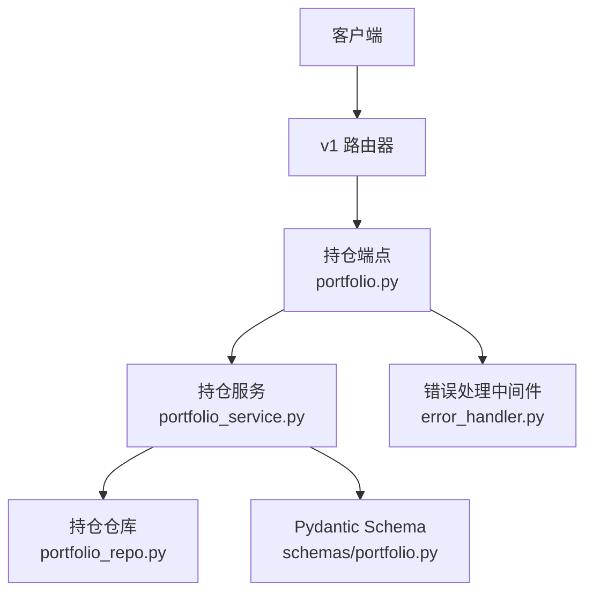
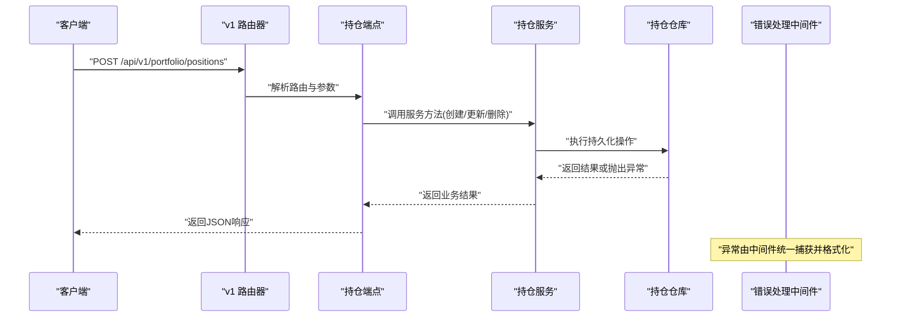
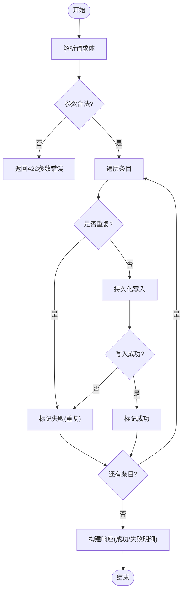
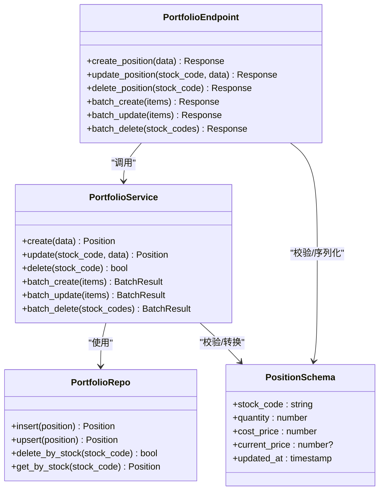
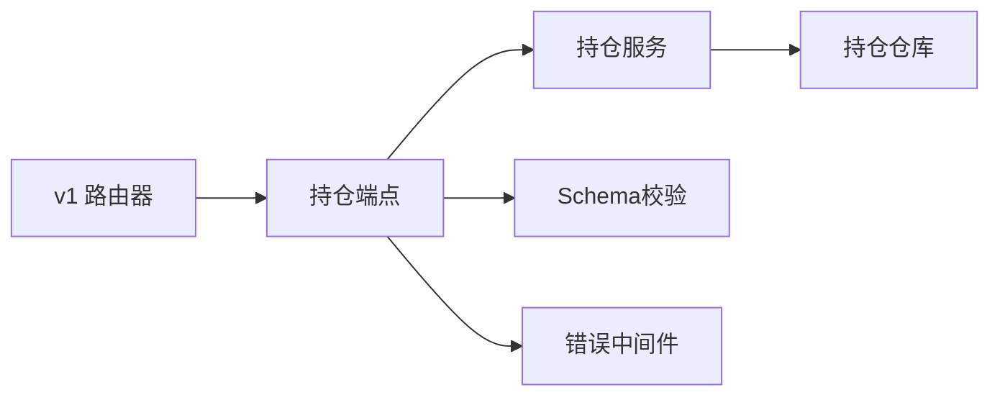

# 持仓管理接口

<cite>
**本文档引用的文件**   
- [api/v1/endpoints/portfolio.py](file://api/v1/endpoints/portfolio.py)
- [api/v1/schemas/portfolio.py](file://api/v1/schemas/portfolio.py)
- [src/services/portfolio_service.py](file://src/services/portfolio_service.py)
- [src/repositories/portfolio_repo.py](file://src/repositories/portfolio_repo.py)
- [api/app.py](file://api/app.py)
- [api/v1/router.py](file://api/v1/router.py)
- [api/middlewares/error_handler.py](file://api/middlewares/error_handler.py)
</cite>

## 目录
1. [简介](#简介)
2. [项目结构](#项目结构)
3. [核心组件](#核心组件)
4. [架构总览](#架构总览)
5. [详细组件分析](#详细组件分析)
6. [依赖关系分析](#依赖关系分析)
7. [性能考虑](#性能考虑)
8. [故障排查指南](#故障排查指南)
9. [结论](#结论)
10. [附录](#附录)

## 简介
本文件为投资组合“持仓管理”的API文档，覆盖添加、删除、修改持仓的RESTful接口，以及批量操作（批量添加、批量更新、批量删除）。文档包含：
- HTTP方法与URL路径
- 请求参数与响应格式
- 持仓数据结构定义（股票代码、数量、成本价、当前价格等）
- 完整请求/响应示例（成功与错误场景）
- 数据验证规则与业务约束
- 事务处理与并发控制实现要点

## 项目结构
与持仓管理相关的后端代码主要分布在以下模块：
- API路由与端点：api/v1/endpoints/portfolio.py
- 请求/响应Schema：api/v1/schemas/portfolio.py
- 业务服务层：src/services/portfolio_service.py
- 数据访问层：src/repositories/portfolio_repo.py
- 应用装配与路由注册：api/app.py, api/v1/router.py
- 全局错误处理中间件：api/middlewares/error_handler.py

图表来源
- [api/v1/router.py](file://api/v1/router.py)
- [api/v1/endpoints/portfolio.py](file://api/v1/endpoints/portfolio.py)
- [src/services/portfolio_service.py](file://src/services/portfolio_service.py)
- [src/repositories/portfolio_repo.py](file://src/repositories/portfolio_repo.py)
- [api/middlewares/error_handler.py](file://api/middlewares/error_handler.py)

章节来源
- [api/v1/endpoints/portfolio.py](file://api/v1/endpoints/portfolio.py)
- [api/v1/schemas/portfolio.py](file://api/v1/schemas/portfolio.py)
- [src/services/portfolio_service.py](file://src/services/portfolio_service.py)
- [src/repositories/portfolio_repo.py](file://src/repositories/portfolio_repo.py)
- [api/app.py](file://api/app.py)
- [api/v1/router.py](file://api/v1/router.py)
- [api/middlewares/error_handler.py](file://api/middlewares/error_handler.py)

## 核心组件
- 持仓端点（HTTP路由）：提供单条与批量CRUD接口，统一入参校验与出参序列化。
- 持仓服务（业务逻辑）：封装持仓变更的业务规则、校验、聚合与事务边界。
- 持仓仓库（数据访问）：负责持久化操作（增删改查），并暴露必要的查询能力。
- Pydantic Schema：定义请求体与响应体的字段、类型、默认值与校验规则。
- 错误处理中间件：统一异常捕获、错误码映射与响应格式化。

章节来源
- [api/v1/endpoints/portfolio.py](file://api/v1/endpoints/portfolio.py)
- [src/services/portfolio_service.py](file://src/services/portfolio_service.py)
- [src/repositories/portfolio_repo.py](file://src/repositories/portfolio_repo.py)
- [api/v1/schemas/portfolio.py](file://api/v1/schemas/portfolio.py)
- [api/middlewares/error_handler.py](file://api/middlewares/error_handler.py)

## 架构总览
下图展示了从HTTP请求到数据落库的关键调用链，以及错误处理与响应序列化的位置。

图表来源
- [api/v1/router.py](file://api/v1/router.py)
- [api/v1/endpoints/portfolio.py](file://api/v1/endpoints/portfolio.py)
- [src/services/portfolio_service.py](file://src/services/portfolio_service.py)
- [src/repositories/portfolio_repo.py](file://src/repositories/portfolio_repo.py)
- [api/middlewares/error_handler.py](file://api/middlewares/error_handler.py)

## 详细组件分析

### 数据结构定义（持仓）
- 字段说明
  - 股票代码：字符串，唯一标识一只股票
  - 数量：数值，持仓股数，必须大于0
  - 成本价：数值，买入均价，必须大于0
  - 当前价格：数值，用于计算盈亏，可为空（未获取到行情时）
  - 更新时间：时间戳，记录最近一次更新的时间
- 校验规则
  - 必填字段：股票代码、数量、成本价
  - 取值范围：数量>0，成本价>0；当前价格>=0或为空
  - 去重策略：同一账户+股票代码仅允许一条持仓记录
- 复杂度
  - 单条校验O(1)，批量校验O(n)
  - 存储写入按主键冲突处理，平均O(1)

章节来源
- [api/v1/schemas/portfolio.py](file://api/v1/schemas/portfolio.py)

### 单条接口：添加持仓
- 方法：POST
- 路径：/api/v1/portfolio/positions
- 请求体字段：股票代码、数量、成本价、可选当前价格
- 成功响应：返回新增持仓对象（含ID、时间戳等）
- 错误场景
  - 参数校验失败：返回422，包含字段级错误信息
  - 重复提交：返回409，提示已存在
  - 服务异常：返回500，附带错误详情

章节来源
- [api/v1/endpoints/portfolio.py](file://api/v1/endpoints/portfolio.py)
- [api/v1/schemas/portfolio.py](file://api/v1/schemas/portfolio.py)
- [src/services/portfolio_service.py](file://src/services/portfolio_service.py)

### 单条接口：修改持仓
- 方法：PUT/PATCH
- 路径：/api/v1/portfolio/positions/{stock_code}
- 请求体字段：可更新的字段（如数量、成本价、当前价格）
- 成功响应：返回更新后的持仓对象
- 错误场景
  - 资源不存在：返回404
  - 参数校验失败：返回422
  - 业务冲突（如数量<=0）：返回422或400

章节来源
- [api/v1/endpoints/portfolio.py](file://api/v1/endpoints/portfolio.py)
- [api/v1/schemas/portfolio.py](file://api/v1/schemas/portfolio.py)
- [src/services/portfolio_service.py](file://src/services/portfolio_service.py)

### 单条接口：删除持仓
- 方法：DELETE
- 路径：/api/v1/portfolio/positions/{stock_code}
- 成功响应：返回确认删除的结果
- 错误场景
  - 资源不存在：返回404
  - 服务异常：返回500

章节来源
- [api/v1/endpoints/portfolio.py](file://api/v1/endpoints/portfolio.py)
- [src/services/portfolio_service.py](file://src/services/portfolio_service.py)

### 批量接口：批量添加
- 方法：POST
- 路径：/api/v1/portfolio/positions/batch
- 请求体：数组，元素为单条持仓对象
- 成功响应：返回成功条目列表与失败条目列表（含错误原因）
- 错误场景
  - 整体参数非法：返回422
  - 部分条目失败：返回部分成功状态，列出失败项

章节来源
- [api/v1/endpoints/portfolio.py](file://api/v1/endpoints/portfolio.py)
- [api/v1/schemas/portfolio.py](file://api/v1/schemas/portfolio.py)
- [src/services/portfolio_service.py](file://src/services/portfolio_service.py)

### 批量接口：批量更新
- 方法：POST
- 路径：/api/v1/portfolio/positions/batch/update
- 请求体：数组，元素为待更新字段（至少包含股票代码与更新字段）
- 成功响应：返回成功与失败的明细
- 错误场景
  - 参数非法：返回422
  - 部分失败：返回部分成功状态

章节来源
- [api/v1/endpoints/portfolio.py](file://api/v1/endpoints/portfolio.py)
- [api/v1/schemas/portfolio.py](file://api/v1/schemas/portfolio.py)
- [src/services/portfolio_service.py](file://src/services/portfolio_service.py)

### 批量接口：批量删除
- 方法：POST
- 路径：/api/v1/portfolio/positions/batch/delete
- 请求体：数组，元素为股票代码列表
- 成功响应：返回成功与失败的明细
- 错误场景
  - 参数非法：返回422
  - 部分失败：返回部分成功状态

章节来源
- [api/v1/endpoints/portfolio.py](file://api/v1/endpoints/portfolio.py)
- [api/v1/schemas/portfolio.py](file://api/v1/schemas/portfolio.py)
- [src/services/portfolio_service.py](file://src/services/portfolio_service.py)

### 业务流程图（以批量添加为例）

图表来源
- [api/v1/endpoints/portfolio.py](file://api/v1/endpoints/portfolio.py)
- [src/services/portfolio_service.py](file://src/services/portfolio_service.py)
- [src/repositories/portfolio_repo.py](file://src/repositories/portfolio_repo.py)

章节来源
- [api/v1/endpoints/portfolio.py](file://api/v1/endpoints/portfolio.py)
- [src/services/portfolio_service.py](file://src/services/portfolio_service.py)

### 类与依赖关系（代码级）

图表来源
- [api/v1/endpoints/portfolio.py](file://api/v1/endpoints/portfolio.py)
- [src/services/portfolio_service.py](file://src/services/portfolio_service.py)
- [src/repositories/portfolio_repo.py](file://src/repositories/portfolio_repo.py)
- [api/v1/schemas/portfolio.py](file://api/v1/schemas/portfolio.py)

章节来源
- [api/v1/endpoints/portfolio.py](file://api/v1/endpoints/portfolio.py)
- [src/services/portfolio_service.py](file://src/services/portfolio_service.py)
- [src/repositories/portfolio_repo.py](file://src/repositories/portfolio_repo.py)
- [api/v1/schemas/portfolio.py](file://api/v1/schemas/portfolio.py)

## 依赖关系分析
- 路由层依赖端点定义，端点依赖服务层，服务层依赖仓库层。
- Schema用于请求体校验与响应体序列化，贯穿端点与服务层。
- 错误处理中间件在应用启动时挂载，统一捕获异常并返回标准错误格式。

图表来源
- [api/v1/router.py](file://api/v1/router.py)
- [api/v1/endpoints/portfolio.py](file://api/v1/endpoints/portfolio.py)
- [src/services/portfolio_service.py](file://src/services/portfolio_service.py)
- [src/repositories/portfolio_repo.py](file://src/repositories/portfolio_repo.py)
- [api/v1/schemas/portfolio.py](file://api/v1/schemas/portfolio.py)
- [api/middlewares/error_handler.py](file://api/middlewares/error_handler.py)

章节来源
- [api/app.py](file://api/app.py)
- [api/v1/router.py](file://api/v1/router.py)
- [api/middlewares/error_handler.py](file://api/middlewares/error_handler.py)

## 性能考虑
- 批量接口建议限制单次条目数量，避免过大请求体导致内存压力。
- 对重复检测与写入采用幂等设计，减少重试带来的副作用。
- 数据库层使用主键冲突处理（upsert）降低锁竞争。
- 高并发下通过服务层串行化关键写路径或使用分布式锁（如需跨进程一致性）。

[本节为通用指导，不直接分析具体文件]

## 故障排查指南
- 常见错误码
  - 400/422：参数校验失败，检查字段类型、取值范围与必填项
  - 404：资源不存在，检查股票代码是否正确
  - 409：重复提交，检查是否已存在相同持仓
  - 500：服务端异常，查看日志定位服务或仓库层错误
- 排查步骤
  - 确认请求体结构与Schema一致
  - 检查网络与鉴权是否正常
  - 查看错误中间件的错误堆栈与日志
  - 复现最小用例，逐步缩小问题范围

章节来源
- [api/middlewares/error_handler.py](file://api/middlewares/error_handler.py)

## 结论
本API围绕持仓管理的CRUD与批量操作提供了清晰的接口契约与校验规则。通过分层架构（端点-服务-仓库）与统一的错误处理机制，保证了可扩展性与稳定性。建议在集成时严格遵循Schema定义，并在批量操作中做好部分失败的处理与重试策略。

[本节为总结性内容，不直接分析具体文件]

## 附录

### 请求与响应示例（概念性）
- 添加持仓（成功）
  - 请求：POST /api/v1/portfolio/positions
  - 请求体：包含股票代码、数量、成本价
  - 响应：返回新增持仓对象（含时间戳）
- 修改持仓（失败）
  - 请求：PUT /api/v1/portfolio/positions/{stock_code}
  - 请求体：数量<=0
  - 响应：422，字段级错误信息
- 批量添加（部分失败）
  - 请求：POST /api/v1/portfolio/positions/batch
  - 请求体：多条持仓，其中一条重复
  - 响应：成功列表与失败列表（含错误原因）

[本节为概念性示例，不直接分析具体文件]