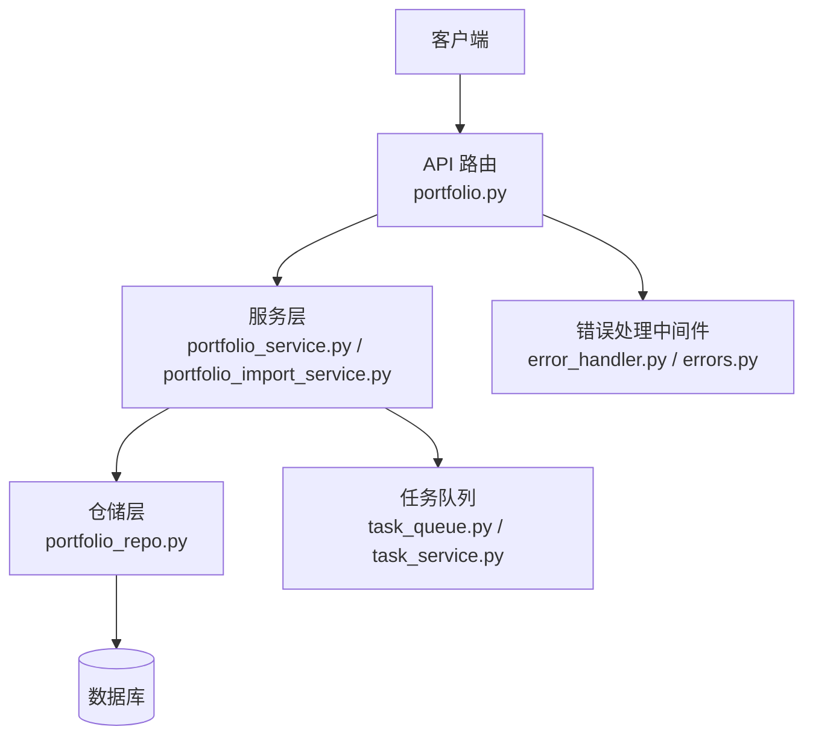
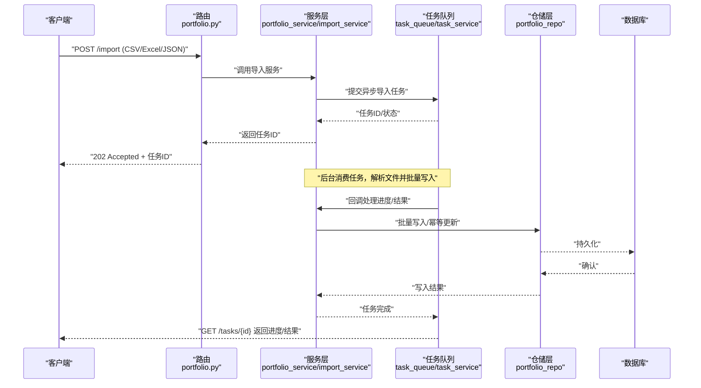
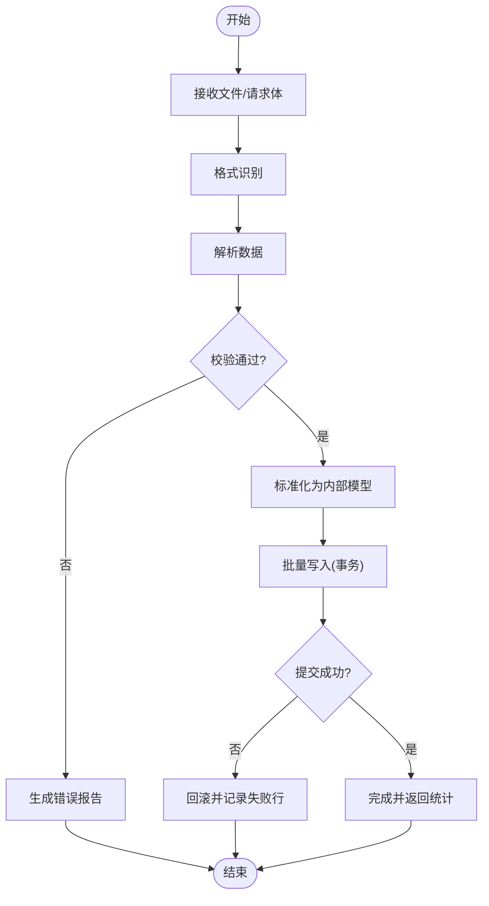
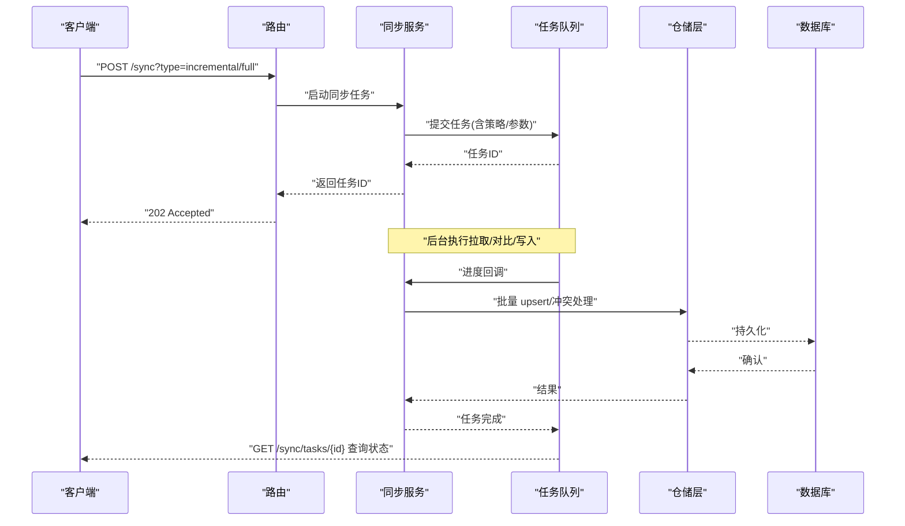
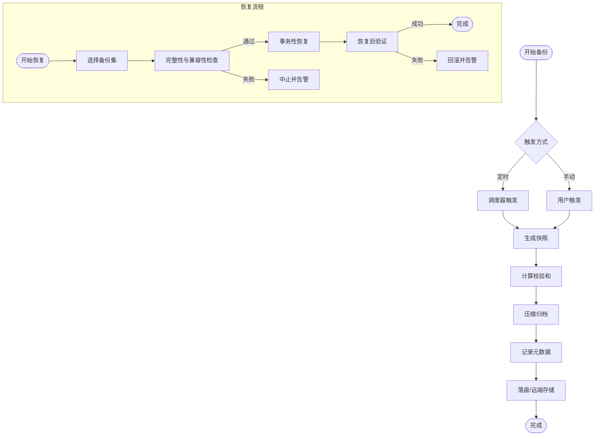
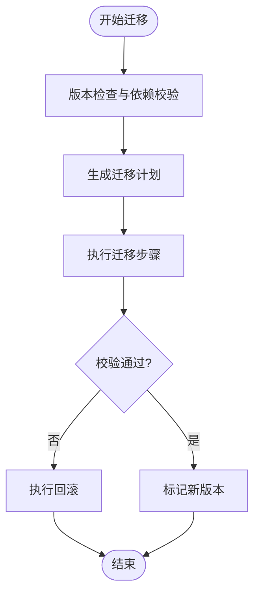
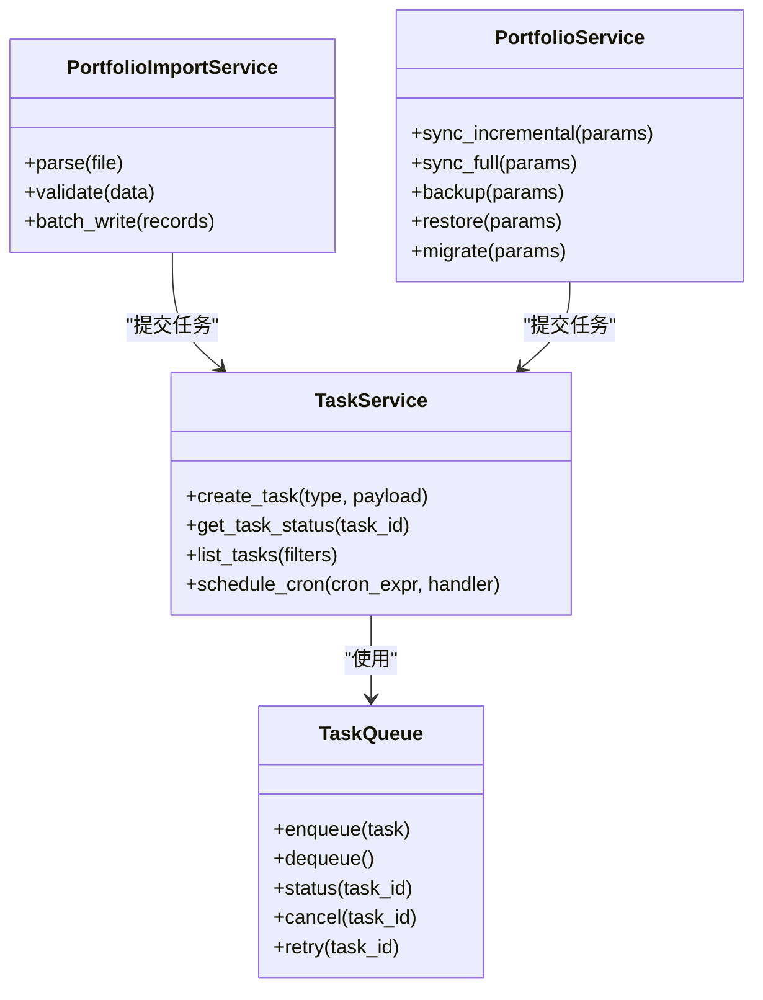
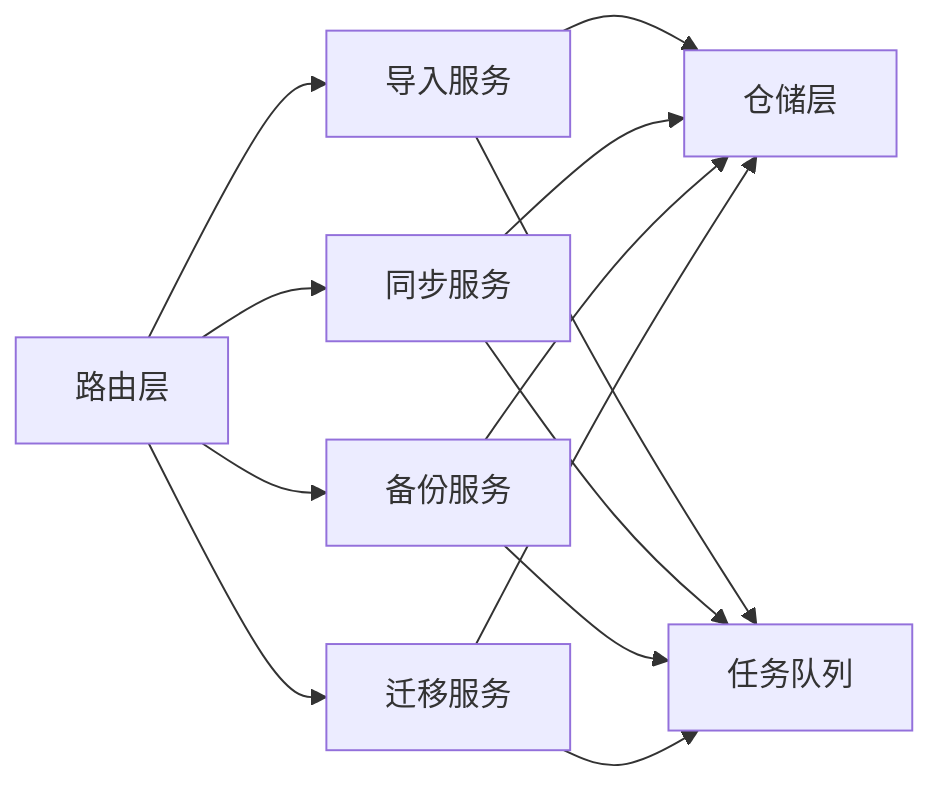

# 数据同步与备份接口

<cite>
**本文引用的文件**   
- [api/v1/endpoints/portfolio.py](file://api/v1/endpoints/portfolio.py)
- [api/v1/schemas/portfolio.py](file://api/v1/schemas/portfolio.py)
- [src/services/portfolio_service.py](file://src/services/portfolio_service.py)
- [src/services/portfolio_import_service.py](file://src/services/portfolio_import_service.py)
- [src/repositories/portfolio_repo.py](file://src/repositories/portfolio_repo.py)
- [src/services/task_queue.py](file://src/services/task_queue.py)
- [src/services/task_service.py](file://src/services/task_service.py)
- [api/middlewares/error_handler.py](file://api/middlewares/error_handler.py)
- [api/v1/errors.py](file://api/v1/errors.py)
</cite>

## 目录
1. [简介](#简介)
2. [项目结构](#项目结构)
3. [核心组件](#核心组件)
4. [架构总览](#架构总览)
5. [详细组件分析](#详细组件分析)
6. [依赖关系分析](#依赖关系分析)
7. [性能考虑](#性能考虑)
8. [故障排查指南](#故障排查指南)
9. [结论](#结论)
10. [附录](#附录)

## 简介
本文件面向投资组合数据的“同步与备份”能力，围绕以下目标进行说明：
- 数据导入导出接口：支持 CSV、Excel、JSON 等多种格式的数据交换。
- 数据同步接口：提供增量同步、全量同步、冲突解决等机制的实现方法。
- 数据备份恢复接口：支持定时备份、手动备份与灾难恢复。
- 数据迁移接口：用于不同版本间数据结构升级与兼容性处理。
- 数据校验与完整性检查：保障导入/同步/恢复过程的数据质量。
- 批量处理与异步任务：通过任务队列实现高吞吐与可观测性。
- 状态监控与错误处理：提供同步状态查询、失败重试与告警建议。

## 项目结构
与投资组合数据同步和备份相关的代码主要分布在以下模块：
- API 层：路由定义、请求/响应模型、错误处理中间件
- 服务层：业务编排（导入、同步、备份、迁移）、任务调度
- 仓储层：持久化访问（读写、事务、幂等）
- 工具与通用：任务队列、错误码与异常封装

**图表来源**
- [api/v1/endpoints/portfolio.py](file://api/v1/endpoints/portfolio.py)
- [src/services/portfolio_service.py](file://src/services/portfolio_service.py)
- [src/services/portfolio_import_service.py](file://src/services/portfolio_import_service.py)
- [src/repositories/portfolio_repo.py](file://src/repositories/portfolio_repo.py)
- [src/services/task_queue.py](file://src/services/task_queue.py)
- [src/services/task_service.py](file://src/services/task_service.py)
- [api/middlewares/error_handler.py](file://api/middlewares/error_handler.py)
- [api/v1/errors.py](file://api/v1/errors.py)

**章节来源**
- [api/v1/endpoints/portfolio.py](file://api/v1/endpoints/portfolio.py)
- [api/v1/schemas/portfolio.py](file://api/v1/schemas/portfolio.py)
- [src/services/portfolio_service.py](file://src/services/portfolio_service.py)
- [src/services/portfolio_import_service.py](file://src/services/portfolio_import_service.py)
- [src/repositories/portfolio_repo.py](file://src/repositories/portfolio_repo.py)
- [src/services/task_queue.py](file://src/services/task_queue.py)
- [src/services/task_service.py](file://src/services/task_service.py)
- [api/middlewares/error_handler.py](file://api/middlewares/error_handler.py)
- [api/v1/errors.py](file://api/v1/errors.py)

## 核心组件
- 路由与模型
  - 路由：统一暴露导入、导出、同步、备份、迁移、状态查询等接口
  - 模型：使用 Pydantic 模型约束请求/响应结构，确保类型安全与自动校验
- 服务层
  - 导入服务：解析多格式文件（CSV/Excel/JSON），标准化为内部模型，批量写入
  - 同步服务：支持增量/全量策略、冲突检测与解决、幂等控制
  - 备份服务：快照生成、压缩归档、定时任务触发、恢复流程
  - 迁移服务：版本比对、字段映射、数据转换、回滚策略
- 仓储层
  - 提供原子写入、批量插入、条件更新、去重与幂等键
- 任务队列
  - 异步执行耗时操作（导入/同步/备份/恢复/迁移），支持进度与结果回调
- 错误处理
  - 统一错误码、异常分类、重试与降级策略

**章节来源**
- [api/v1/schemas/portfolio.py](file://api/v1/schemas/portfolio.py)
- [src/services/portfolio_import_service.py](file://src/services/portfolio_import_service.py)
- [src/services/portfolio_service.py](file://src/services/portfolio_service.py)
- [src/repositories/portfolio_repo.py](file://src/repositories/portfolio_repo.py)
- [src/services/task_queue.py](file://src/services/task_queue.py)
- [src/services/task_service.py](file://src/services/task_service.py)
- [api/middlewares/error_handler.py](file://api/middlewares/error_handler.py)
- [api/v1/errors.py](file://api/v1/errors.py)

## 架构总览
整体采用分层架构：API 路由负责鉴权与参数校验，服务层编排业务逻辑，仓储层负责数据持久化，任务队列承载异步任务。错误处理贯穿各层，保证一致性与可观测性。

**图表来源**
- [api/v1/endpoints/portfolio.py](file://api/v1/endpoints/portfolio.py)
- [src/services/portfolio_import_service.py](file://src/services/portfolio_import_service.py)
- [src/services/task_queue.py](file://src/services/task_queue.py)
- [src/services/task_service.py](file://src/services/task_service.py)
- [src/repositories/portfolio_repo.py](file://src/repositories/portfolio_repo.py)

## 详细组件分析

### 数据导入导出接口
- 支持的格式
  - CSV：按列名映射到内部模型，支持编码检测与分隔符配置
  - Excel：读取工作表，支持多 sheet 合并或选择
  - JSON：数组对象或嵌套结构，支持模式校验与默认值填充
- 导入流程要点
  - 文件上传与临时存储
  - 格式识别与解析
  - 数据清洗与校验（必填字段、类型、范围、唯一性）
  - 批量写入与事务控制
  - 失败行记录与报告下载
- 导出流程要点
  - 查询过滤与分页
  - 序列化与流式输出
  - 可选压缩与分片

**图表来源**
- [src/services/portfolio_import_service.py](file://src/services/portfolio_import_service.py)
- [src/repositories/portfolio_repo.py](file://src/repositories/portfolio_repo.py)

**章节来源**
- [api/v1/endpoints/portfolio.py](file://api/v1/endpoints/portfolio.py)
- [api/v1/schemas/portfolio.py](file://api/v1/schemas/portfolio.py)
- [src/services/portfolio_import_service.py](file://src/services/portfolio_import_service.py)
- [src/repositories/portfolio_repo.py](file://src/repositories/portfolio_repo.py)

### 数据同步接口（增量/全量/冲突解决）
- 增量同步
  - 基于时间戳或版本号拉取变更集
  - 按主键/唯一键进行 upsert，避免重复
  - 断点续传与幂等键
- 全量同步
  - 拉取全量快照，对比本地差异后批量更新
  - 支持分批与并发控制
- 冲突解决
  - 策略：服务端优先、客户端优先、合并策略（字段级）
  - 冲突记录与人工复核入口
- 一致性保障
  - 事务边界、幂等写入、校验和校验

**图表来源**
- [api/v1/endpoints/portfolio.py](file://api/v1/endpoints/portfolio.py)
- [src/services/portfolio_service.py](file://src/services/portfolio_service.py)
- [src/services/task_queue.py](file://src/services/task_queue.py)
- [src/repositories/portfolio_repo.py](file://src/repositories/portfolio_repo.py)

**章节来源**
- [api/v1/endpoints/portfolio.py](file://api/v1/endpoints/portfolio.py)
- [src/services/portfolio_service.py](file://src/services/portfolio_service.py)
- [src/repositories/portfolio_repo.py](file://src/repositories/portfolio_repo.py)
- [src/services/task_queue.py](file://src/services/task_queue.py)

### 数据备份与恢复接口
- 备份类型
  - 全量备份：完整快照
  - 增量备份：自上次备份以来的变更
  - 热备/冷备：在线/离线策略
- 备份流程
  - 触发（定时/手动）
  - 快照生成与校验和计算
  - 压缩与归档
  - 元数据记录（版本、大小、哈希、时间戳）
- 恢复流程
  - 选择备份集
  - 预检（完整性校验、兼容性检查）
  - 恢复执行（事务性写入）
  - 验证与回滚（失败自动回滚）

**图表来源**
- [src/services/portfolio_service.py](file://src/services/portfolio_service.py)
- [src/services/task_service.py](file://src/services/task_service.py)

**章节来源**
- [api/v1/endpoints/portfolio.py](file://api/v1/endpoints/portfolio.py)
- [src/services/portfolio_service.py](file://src/services/portfolio_service.py)
- [src/services/task_service.py](file://src/services/task_service.py)

### 数据迁移接口（版本升级与兼容）
- 版本管理
  - 记录当前数据版本与期望版本
  - 迁移脚本/规则注册
- 迁移流程
  - 预检查（依赖、锁、空间）
  - 执行迁移（字段映射、类型转换、默认值填充）
  - 验证（抽样/全量校验）
  - 回滚（失败自动回滚或提供回滚脚本）
- 兼容性
  - 向后兼容的字段新增/废弃策略
  - 灰度发布与双写过渡

**图表来源**
- [src/services/portfolio_service.py](file://src/services/portfolio_service.py)

**章节来源**
- [api/v1/endpoints/portfolio.py](file://api/v1/endpoints/portfolio.py)
- [src/services/portfolio_service.py](file://src/services/portfolio_service.py)

### 数据校验与完整性检查
- 输入校验
  - 必填字段、数据类型、取值范围、唯一性
  - 跨字段约束与正则匹配
- 传输与存储校验
  - 文件哈希（MD5/SHA256）
  - 批次校验和（行级/块级）
- 一致性检查
  - 主外键完整性
  - 时序一致性（时间戳单调递增）
- 修复与告警
  - 失败重试、死信队列、人工介入

**章节来源**
- [api/v1/schemas/portfolio.py](file://api/v1/schemas/portfolio.py)
- [src/services/portfolio_import_service.py](file://src/services/portfolio_import_service.py)
- [src/repositories/portfolio_repo.py](file://src/repositories/portfolio_repo.py)

### 批量处理与异步任务
- 批量处理
  - 分片与并发控制
  - 内存限制与流式处理
- 异步任务
  - 任务创建、状态查询、取消、重试
  - 进度上报与结果回调
- 任务队列
  - 优先级、限流、超时、死信
  - 可观测性（指标、日志、追踪）

**图表来源**
- [src/services/task_queue.py](file://src/services/task_queue.py)
- [src/services/task_service.py](file://src/services/task_service.py)
- [src/services/portfolio_import_service.py](file://src/services/portfolio_import_service.py)
- [src/services/portfolio_service.py](file://src/services/portfolio_service.py)

**章节来源**
- [src/services/task_queue.py](file://src/services/task_queue.py)
- [src/services/task_service.py](file://src/services/task_service.py)
- [src/services/portfolio_import_service.py](file://src/services/portfolio_import_service.py)
- [src/services/portfolio_service.py](file://src/services/portfolio_service.py)

## 依赖关系分析
- 低耦合高内聚
  - 路由仅做参数校验与转发
  - 服务层编排导入/同步/备份/迁移
  - 仓储层专注数据访问
  - 任务队列解耦耗时操作
- 外部依赖
  - 文件解析库（CSV/Excel/JSON）
  - 消息队列/任务系统
  - 数据库驱动与连接池
- 潜在风险
  - 循环依赖（应避免）
  - 第三方服务不可用时的降级策略

**图表来源**
- [api/v1/endpoints/portfolio.py](file://api/v1/endpoints/portfolio.py)
- [src/services/portfolio_import_service.py](file://src/services/portfolio_import_service.py)
- [src/services/portfolio_service.py](file://src/services/portfolio_service.py)
- [src/repositories/portfolio_repo.py](file://src/repositories/portfolio_repo.py)
- [src/services/task_queue.py](file://src/services/task_queue.py)

**章节来源**
- [api/v1/endpoints/portfolio.py](file://api/v1/endpoints/portfolio.py)
- [src/services/portfolio_import_service.py](file://src/services/portfolio_import_service.py)
- [src/services/portfolio_service.py](file://src/services/portfolio_service.py)
- [src/repositories/portfolio_repo.py](file://src/repositories/portfolio_repo.py)
- [src/services/task_queue.py](file://src/services/task_queue.py)

## 性能考虑
- 导入导出
  - 流式解析与写入，避免大对象驻留内存
  - 批量提交与事务批大小调优
  - 并行分片与限速
- 同步
  - 增量拉取最小化网络开销
  - 并发写入与锁粒度优化
  - 索引与查询优化
- 备份恢复
  - 增量备份减少 IO
  - 压缩与分片上传
  - 恢复时顺序写入与校验并行
- 任务队列
  - 合理设置消费者数量与超时
  - 监控队列积压与慢任务

## 故障排查指南
- 常见错误
  - 文件格式不合法、编码异常
  - 字段缺失或类型不匹配
  - 唯一键冲突、外键约束失败
  - 任务超时、队列阻塞
- 定位方法
  - 查看任务状态与错误详情
  - 检查导入错误报告与失败行
  - 核对校验和与哈希
  - 审查数据库日志与慢查询
- 处理建议
  - 修正数据后重试
  - 调整批大小与并发
  - 清理死信任务
  - 启用降级与熔断

**章节来源**
- [api/middlewares/error_handler.py](file://api/middlewares/error_handler.py)
- [api/v1/errors.py](file://api/v1/errors.py)
- [src/services/task_queue.py](file://src/services/task_queue.py)
- [src/services/task_service.py](file://src/services/task_service.py)

## 结论
本方案以分层架构与任务队列为核心，提供了完整的投资组合数据同步与备份能力。通过严格的校验、幂等写入与事务控制，确保数据质量与一致性；借助异步任务与可观测性，提升吞吐与可维护性。建议在生产环境结合监控告警与演练，持续优化性能与可靠性。

## 附录
- 接口清单（示例）
  - 导入：POST /portfolio/import（CSV/Excel/JSON）
  - 导出：GET /portfolio/export?format=csv|excel|json
  - 同步：POST /portfolio/sync?type=incremental|full
  - 备份：POST /portfolio/backup; GET /portfolio/backups; POST /portfolio/restore
  - 迁移：POST /portfolio/migrate; GET /portfolio/migration/status
  - 任务：POST /tasks; GET /tasks/{id}; GET /tasks
- 最佳实践
  - 小批量高频导入优于一次性大批量
  - 增量同步优先，全量作为兜底
  - 备份保留多代次，定期演练恢复
  - 迁移前备份，变更后验证