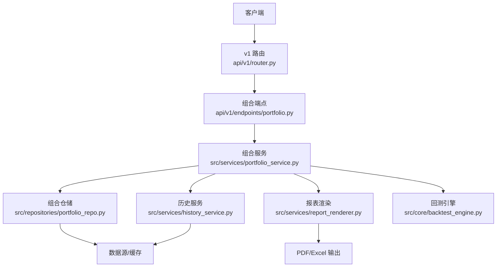
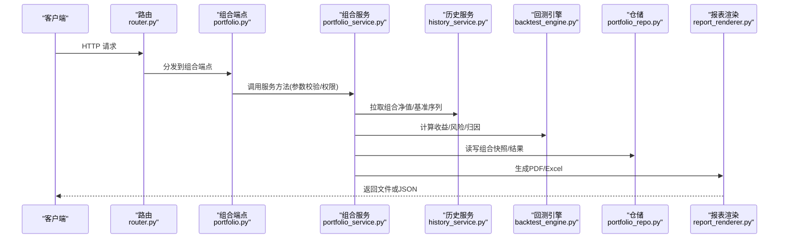
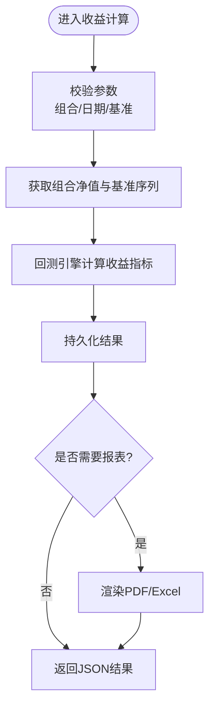
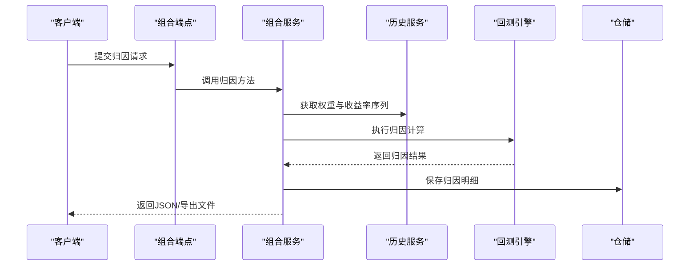
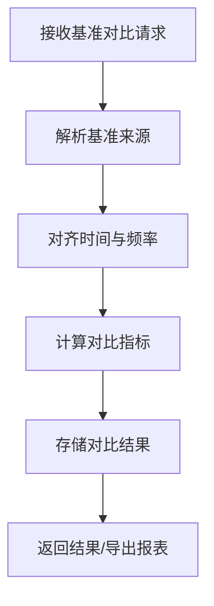
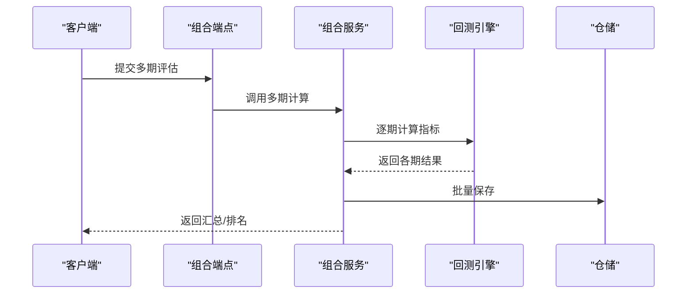
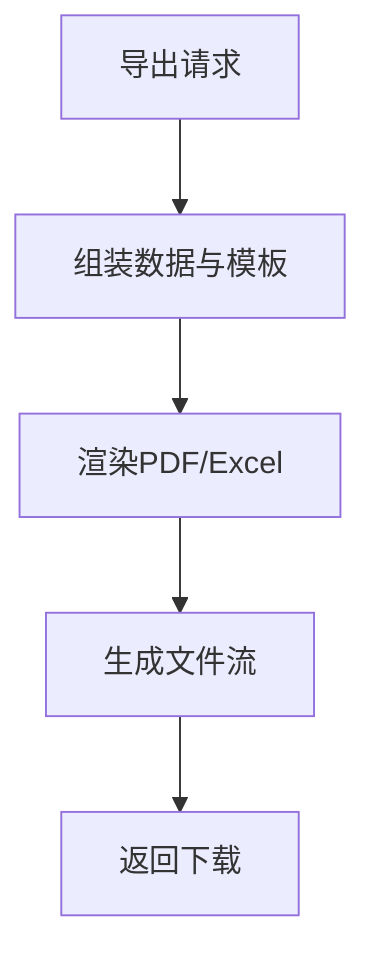
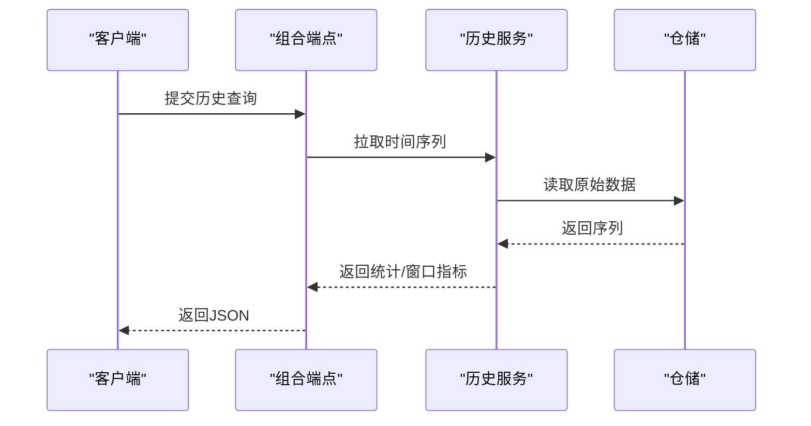
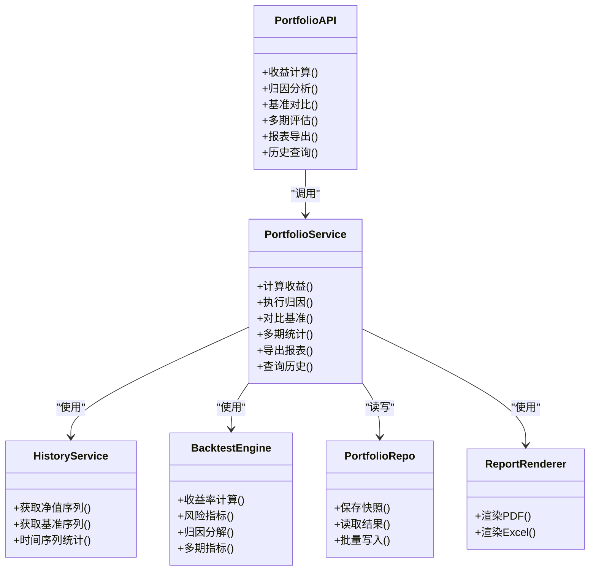

# 绩效分析接口

<cite>
**本文引用的文件**   
- [api/v1/endpoints/portfolio.py](file://api/v1/endpoints/portfolio.py)
- [api/v1/schemas/portfolio.py](file://api/v1/schemas/portfolio.py)
- [src/services/portfolio_service.py](file://src/services/portfolio_service.py)
- [src/repositories/portfolio_repo.py](file://src/repositories/portfolio_repo.py)
- [src/services/history_service.py](file://src/services/history_service.py)
- [src/services/report_renderer.py](file://src/services/report_renderer.py)
- [src/core/backtest_engine.py](file://src/core/backtest_engine.py)
- [api/v1/router.py](file://api/v1/router.py)
- [api/app.py](file://api/app.py)
</cite>

## 目录
1. [简介](#简介)
2. [项目结构](#项目结构)
3. [核心组件](#核心组件)
4. [架构总览](#架构总览)
5. [详细组件分析](#详细组件分析)
6. [依赖关系分析](#依赖关系分析)
7. [性能考量](#性能考量)
8. [故障排查指南](#故障排查指南)
9. [结论](#结论)
10. [附录](#附录)

## 简介
本文件面向“投资组合绩效分析”相关API，覆盖收益计算、绩效归因、基准对比、多期评估与排名、报表导出以及历史查询与时间序列分析等能力。文档以代码仓库为依据，提供接口职责、数据模型、调用流程与注意事项，帮助开发者快速集成与扩展。

## 项目结构
与绩效分析相关的后端实现主要分布在以下位置：
- API路由与端点定义：api/v1/endpoints/portfolio.py、api/v1/router.py
- 请求/响应Schema：api/v1/schemas/portfolio.py
- 业务服务层：src/services/portfolio_service.py、src/services/history_service.py、src/services/report_renderer.py
- 数据访问层：src/repositories/portfolio_repo.py
- 回测引擎（用于指标计算）：src/core/backtest_engine.py
- 应用入口与挂载：api/app.py

图表来源
- [api/v1/router.py](file://api/v1/router.py)
- [api/v1/endpoints/portfolio.py](file://api/v1/endpoints/portfolio.py)
- [src/services/portfolio_service.py](file://src/services/portfolio_service.py)
- [src/repositories/portfolio_repo.py](file://src/repositories/portfolio_repo.py)
- [src/services/history_service.py](file://src/services/history_service.py)
- [src/services/report_renderer.py](file://src/services/report_renderer.py)
- [src/core/backtest_engine.py](file://src/core/backtest_engine.py)

章节来源
- [api/v1/router.py](file://api/v1/router.py)
- [api/app.py](file://api/app.py)

## 核心组件
- 组合端点（Portfolio API）：暴露收益计算、归因分析、基准对比、多期统计、报表导出、历史查询等HTTP接口。
- 组合服务（Portfolio Service）：聚合业务逻辑，协调回测引擎、历史数据、报表渲染与仓储。
- 历史服务（History Service）：统一获取历史行情、净值序列、基准序列等时间序列数据。
- 报表渲染（Report Renderer）：将结构化结果渲染为PDF/Excel等格式。
- 回测引擎（Backtest Engine）：提供收益率、风险指标、归因分解等计算能力。
- 组合仓储（Portfolio Repo）：持久化组合快照、持仓、交易流水与绩效结果。

章节来源
- [api/v1/endpoints/portfolio.py](file://api/v1/endpoints/portfolio.py)
- [src/services/portfolio_service.py](file://src/services/portfolio_service.py)
- [src/services/history_service.py](file://src/services/history_service.py)
- [src/services/report_renderer.py](file://src/services/report_renderer.py)
- [src/core/backtest_engine.py](file://src/core/backtest_engine.py)
- [src/repositories/portfolio_repo.py](file://src/repositories/portfolio_repo.py)

## 架构总览
下图展示了从HTTP请求到指标计算与报表导出的端到端流程。

图表来源
- [api/v1/router.py](file://api/v1/router.py)
- [api/v1/endpoints/portfolio.py](file://api/v1/endpoints/portfolio.py)
- [src/services/portfolio_service.py](file://src/services/portfolio_service.py)
- [src/services/history_service.py](file://src/services/history_service.py)
- [src/core/backtest_engine.py](file://src/core/backtest_engine.py)
- [src/repositories/portfolio_repo.py](file://src/repositories/portfolio_repo.py)
- [src/services/report_renderer.py](file://src/services/report_renderer.py)

## 详细组件分析

### 收益计算接口
- 功能范围
  - 绝对收益：区间累计收益、期间收益
  - 相对收益：相对于自定义基准的超额收益
  - 年化收益率：按交易日复利折算
  - 累计收益率：自起始日至今的累计增长
- 输入要点
  - 组合ID或持仓快照
  - 起止日期、频率（日/周/月）
  - 基准代码或自定义基准序列
- 输出要点
  - 各维度收益指标、净值曲线、基准曲线、超额曲线
- 关键流程
  - 端点接收请求并校验参数
  - 服务层拉取组合与基准序列
  - 回测引擎计算各项收益指标
  - 仓储保存计算结果以便后续查询
  - 可选渲染报表供下载

图表来源
- [api/v1/endpoints/portfolio.py](file://api/v1/endpoints/portfolio.py)
- [src/services/portfolio_service.py](file://src/services/portfolio_service.py)
- [src/core/backtest_engine.py](file://src/core/backtest_engine.py)
- [src/repositories/portfolio_repo.py](file://src/repositories/portfolio_repo.py)

章节来源
- [api/v1/endpoints/portfolio.py](file://api/v1/endpoints/portfolio.py)
- [src/services/portfolio_service.py](file://src/services/portfolio_service.py)
- [src/core/backtest_engine.py](file://src/core/backtest_engine.py)

### 绩效归因分析接口
- 功能范围
  - 资产配置效应：权重偏离基准带来的贡献
  - 选股效应：个券选择带来的贡献
  - 交互效应：权重与选股的交叉影响
- 输入要点
  - 组合权重序列与基准权重序列
  - 个股/资产收益率序列
  - 归因粒度（行业/风格/个券）
- 输出要点
  - 配置效应、选股效应、交互效应的数值与占比
  - 分维度归因明细与汇总
- 关键流程
  - 端点接收归因请求
  - 服务层准备权重与收益矩阵
  - 回测引擎执行Brinson或多因子归因
  - 仓储记录归因结果
  - 支持导出报表

图表来源
- [api/v1/endpoints/portfolio.py](file://api/v1/endpoints/portfolio.py)
- [src/services/portfolio_service.py](file://src/services/portfolio_service.py)
- [src/services/history_service.py](file://src/services/history_service.py)
- [src/core/backtest_engine.py](file://src/core/backtest_engine.py)
- [src/repositories/portfolio_repo.py](file://src/repositories/portfolio_repo.py)

章节来源
- [api/v1/endpoints/portfolio.py](file://api/v1/endpoints/portfolio.py)
- [src/services/portfolio_service.py](file://src/services/portfolio_service.py)
- [src/core/backtest_engine.py](file://src/core/backtest_engine.py)

### 基准对比分析接口
- 功能范围
  - 支持自定义基准指数或外部基准序列
  - 对比组合与基准的净值、收益、波动、最大回撤等
  - 可视化对比曲线与差异统计
- 输入要点
  - 组合ID或持仓快照
  - 基准代码或自定义基准序列
  - 时间窗口与频率
- 输出要点
  - 对比指标集合、差异统计、曲线数据
- 关键流程
  - 端点解析基准来源（内置/自定义）
  - 服务层对齐时间轴与频率
  - 回测引擎计算对比指标
  - 仓储保存对比结果

图表来源
- [api/v1/endpoints/portfolio.py](file://api/v1/endpoints/portfolio.py)
- [src/services/portfolio_service.py](file://src/services/portfolio_service.py)
- [src/services/history_service.py](file://src/services/history_service.py)
- [src/core/backtest_engine.py](file://src/core/backtest_engine.py)

章节来源
- [api/v1/endpoints/portfolio.py](file://api/v1/endpoints/portfolio.py)
- [src/services/portfolio_service.py](file://src/services/portfolio_service.py)
- [src/services/history_service.py](file://src/services/history_service.py)

### 多期绩效评估接口
- 功能范围
  - 月度、季度、年度绩效统计
  - 排名与分位数（同策略/同类型组合）
  - 滚动窗口指标（如滚动夏普、滚动回撤）
- 输入要点
  - 组合ID、评估周期（月/季/年）
  - 排名维度与分组条件
- 输出要点
  - 各期收益、风险、归因摘要
  - 排名结果与分位信息
- 关键流程
  - 端点接收多期评估请求
  - 服务层按周期拆分时间窗
  - 回测引擎逐期计算指标
  - 仓储批量写入与索引
  - 返回汇总与明细

图表来源
- [api/v1/endpoints/portfolio.py](file://api/v1/endpoints/portfolio.py)
- [src/services/portfolio_service.py](file://src/services/portfolio_service.py)
- [src/core/backtest_engine.py](file://src/core/backtest_engine.py)
- [src/repositories/portfolio_repo.py](file://src/repositories/portfolio_repo.py)

章节来源
- [api/v1/endpoints/portfolio.py](file://api/v1/endpoints/portfolio.py)
- [src/services/portfolio_service.py](file://src/services/portfolio_service.py)
- [src/core/backtest_engine.py](file://src/core/backtest_engine.py)

### 绩效报表生成接口
- 功能范围
  - 支持PDF、Excel等格式导出
  - 包含收益曲线、归因明细、多期统计、基准对比等模块
- 输入要点
  - 报告模板、输出格式、数据范围
- 输出要点
  - 二进制文件流或可下载链接
- 关键流程
  - 端点接收导出请求
  - 服务层组装数据与模板变量
  - 报表渲染器生成目标格式
  - 返回文件流

图表来源
- [api/v1/endpoints/portfolio.py](file://api/v1/endpoints/portfolio.py)
- [src/services/report_renderer.py](file://src/services/report_renderer.py)

章节来源
- [api/v1/endpoints/portfolio.py](file://api/v1/endpoints/portfolio.py)
- [src/services/report_renderer.py](file://src/services/report_renderer.py)

### 历史查询与时间序列分析接口
- 功能范围
  - 查询组合净值、基准净值、收益率序列
  - 时间序列统计（均值、方差、偏度、峰度）
  - 滑动窗口指标（滚动收益、滚动波动）
- 输入要点
  - 对象ID（组合/基准）、起止时间、频率
- 输出要点
  - 时间序列数据、统计量、窗口指标
- 关键流程
  - 端点解析查询条件
  - 历史服务拉取序列数据
  - 计算统计与窗口指标
  - 返回结构化结果

图表来源
- [api/v1/endpoints/portfolio.py](file://api/v1/endpoints/portfolio.py)
- [src/services/history_service.py](file://src/services/history_service.py)
- [src/repositories/portfolio_repo.py](file://src/repositories/portfolio_repo.py)

章节来源
- [api/v1/endpoints/portfolio.py](file://api/v1/endpoints/portfolio.py)
- [src/services/history_service.py](file://src/services/history_service.py)

### 性能指标数据结构与方法说明
- 收益类指标
  - 绝对收益：区间累计收益、期间收益
  - 相对收益：超额收益（组合-基准）
  - 年化收益率：按交易日复利折算
  - 累计收益率：自起始日至今累计增长
- 风险类指标
  - 波动率：日频/周频/月频标准差
  - 最大回撤：峰值到谷底的最大跌幅
  - 下行风险：负收益的标准差
- 风险调整后指标
  - 夏普比率：超额收益/波动率
  - 索提诺比率：超额收益/下行风险
  - Calmar比率：年化收益/最大回撤
- 归因类指标
  - 配置效应：权重偏离基准的贡献
  - 选股效应：个券选择的贡献
  - 交互效应：权重与选股的交叉影响
- 多期统计
  - 月度/季度/年度收益、波动、回撤、夏普等
  - 排名与分位数（同组比较）
- 计算方法要点
  - 频率对齐：统一至交易日序列，处理缺失与停牌
  - 复利计算：几何连乘而非算术累加
  - 基准对齐：时间戳与币种一致化处理
  - 异常值处理：极端涨跌截断或剔除

章节来源
- [src/core/backtest_engine.py](file://src/core/backtest_engine.py)
- [src/services/portfolio_service.py](file://src/services/portfolio_service.py)
- [api/v1/schemas/portfolio.py](file://api/v1/schemas/portfolio.py)

## 依赖关系分析
- 组件耦合
  - 组合端点依赖组合服务进行业务编排
  - 组合服务依赖历史服务、回测引擎、仓储与报表渲染
  - 历史服务依赖仓储与数据源
  - 报表渲染依赖模板与输出格式库
- 外部依赖
  - 数据源（行情、基准、财务数据）
  - 报表库（PDF/Excel生成）
  - 缓存与数据库（持久化与加速）

图表来源
- [api/v1/endpoints/portfolio.py](file://api/v1/endpoints/portfolio.py)
- [src/services/portfolio_service.py](file://src/services/portfolio_service.py)
- [src/services/history_service.py](file://src/services/history_service.py)
- [src/core/backtest_engine.py](file://src/core/backtest_engine.py)
- [src/repositories/portfolio_repo.py](file://src/repositories/portfolio_repo.py)
- [src/services/report_renderer.py](file://src/services/report_renderer.py)

章节来源
- [api/v1/endpoints/portfolio.py](file://api/v1/endpoints/portfolio.py)
- [src/services/portfolio_service.py](file://src/services/portfolio_service.py)
- [src/services/history_service.py](file://src/services/history_service.py)
- [src/core/backtest_engine.py](file://src/core/backtest_engine.py)
- [src/repositories/portfolio_repo.py](file://src/repositories/portfolio_repo.py)
- [src/services/report_renderer.py](file://src/services/report_renderer.py)

## 性能考量
- 数据拉取优化
  - 批量拉取与分页，避免大窗口一次性加载
  - 缓存热点序列（组合净值、常用基准）
- 计算优化
  - 向量化计算优先，减少循环开销
  - 预计算常用指标（年化、波动），按需复用
- 并发与异步
  - 多期评估采用并行任务，限制并发度避免过载
  - 长耗时任务异步处理，前端轮询或回调
- I/O与存储
  - 结果落盘采用批写与压缩
  - 报表生成流式输出，降低内存峰值

[本节为通用指导，不直接分析具体文件]

## 故障排查指南
- 常见错误
  - 数据缺失：停牌、节假日导致的时间轴不一致
  - 基准不可用：代码错误或未订阅
  - 计算异常：极端值、除零、负权重
- 排查步骤
  - 检查输入参数与时间窗口
  - 验证数据源连通性与权限
  - 查看中间结果（净值序列、权重矩阵）
  - 定位回测引擎日志与异常堆栈
- 恢复建议
  - 补齐缺失数据或使用插值策略
  - 切换备用基准或自定义序列
  - 对异常值进行截断或剔除

章节来源
- [src/services/portfolio_service.py](file://src/services/portfolio_service.py)
- [src/core/backtest_engine.py](file://src/core/backtest_engine.py)
- [src/services/history_service.py](file://src/services/history_service.py)

## 结论
本绩效分析接口围绕收益计算、归因分解、基准对比、多期评估、报表导出与历史查询形成完整闭环。通过清晰的分层架构与模块化设计，既保证计算准确性，又兼顾可扩展性与性能。建议在接入时严格遵循参数校验、数据对齐与异常处理规范，以获得稳定可靠的分析结果。

[本节为总结性内容，不直接分析具体文件]

## 附录
- 术语表
  - 绝对收益：不考虑基准的组合自身收益
  - 相对收益：组合收益减去基准收益
  - 年化收益率：将区间收益折算为年度复利
  - 累计收益率：自起始日至当前的累计增长
  - 配置效应：权重偏离基准的贡献
  - 选股效应：个券选择的贡献
  - 交互效应：权重与选股的交叉影响
- 最佳实践
  - 统一时间频率与币种
  - 使用交易日日历对齐序列
  - 对极端值进行稳健处理
  - 保留中间结果便于审计与回溯

[本节为概念性内容，不直接分析具体文件]