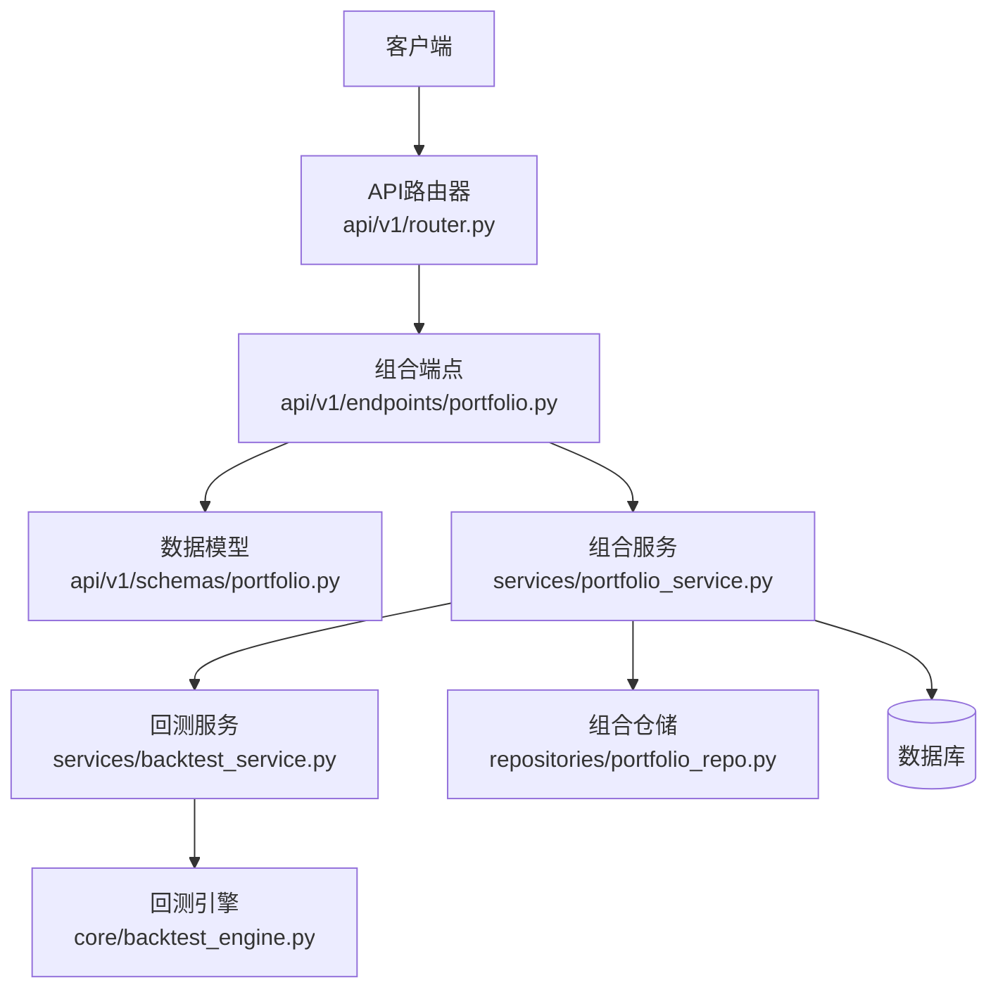
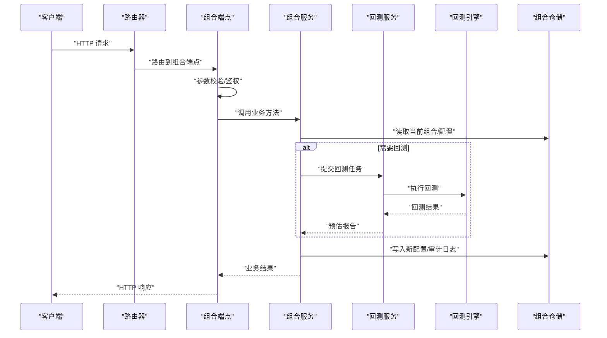
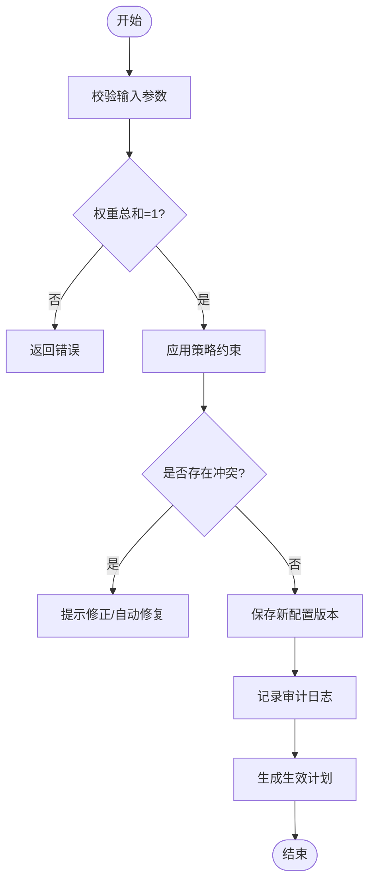
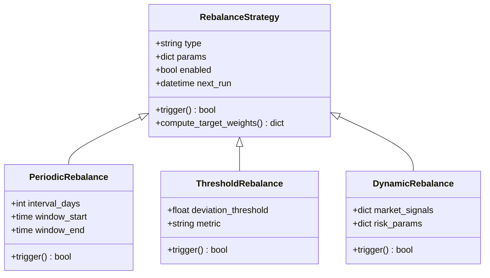
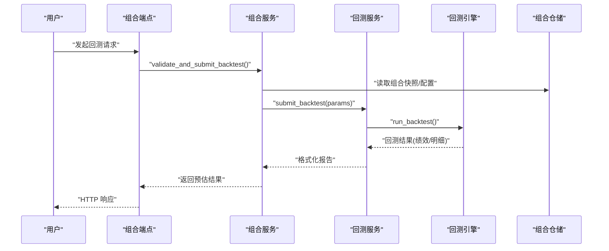
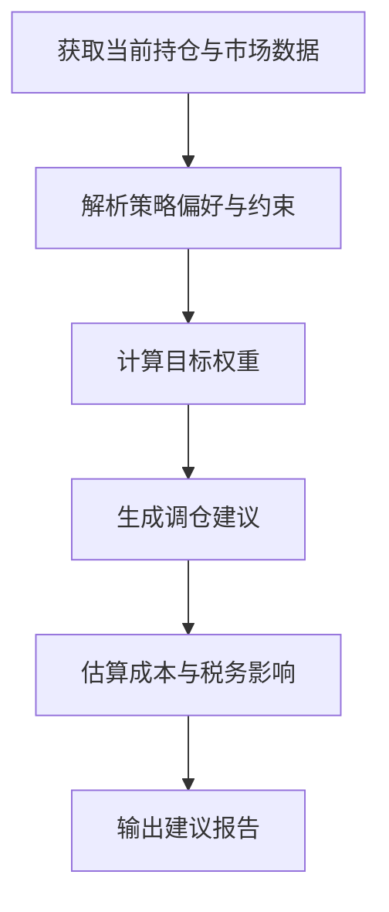
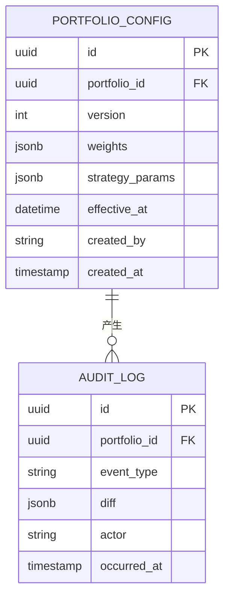
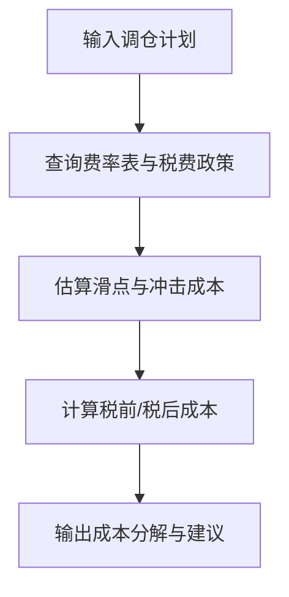
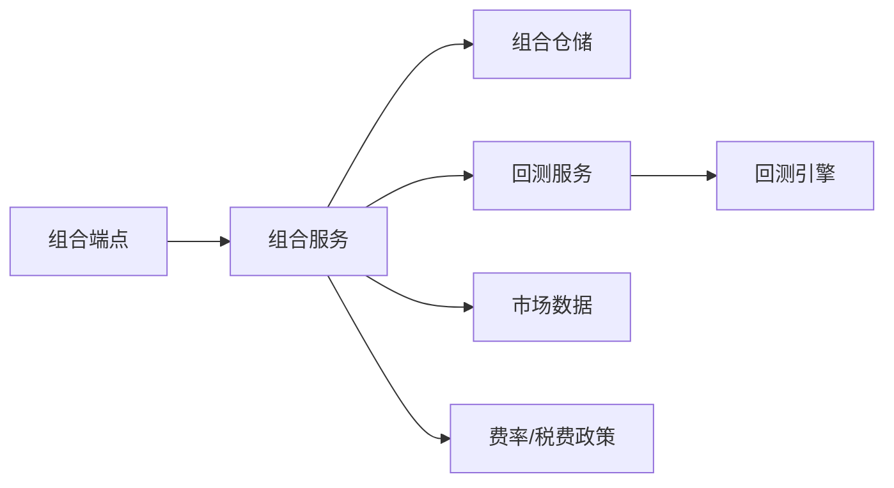
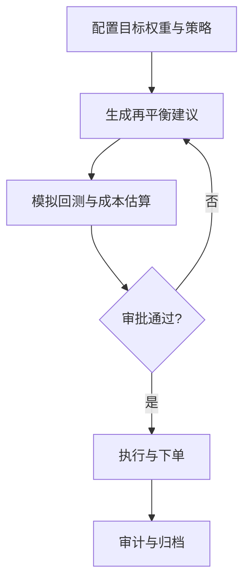

# 资产配置与再平衡接口

<cite>
**本文引用的文件**   
- [api/v1/endpoints/portfolio.py](file://api/v1/endpoints/portfolio.py)
- [api/v1/schemas/portfolio.py](file://api/v1/schemas/portfolio.py)
- [services/portfolio_service.py](file://services/portfolio_service.py)
- [services/backtest_service.py](file://services/backtest_service.py)
- [core/backtest_engine.py](file://core/backtest_engine.py)
- [repositories/portfolio_repo.py](file://repositories/portfolio_repo.py)
- [api/app.py](file://api/app.py)
- [api/v1/router.py](file://api/v1/router.py)
</cite>

## 目录
1. [简介](#简介)
2. [项目结构](#项目结构)
3. [核心组件](#核心组件)
4. [架构总览](#架构总览)
5. [详细组件分析](#详细组件分析)
6. [依赖关系分析](#依赖关系分析)
7. [性能考量](#性能考量)
8. [故障排查指南](#故障排查指南)
9. [结论](#结论)
10. [附录](#附录)

## 简介
本文件面向“投资组合资产配置与再平衡”的API使用与实现说明，覆盖以下能力：
- 资产配置策略接口：目标权重设置、配置比例调整、资产类别管理
- 再平衡策略接口：定期再平衡、阈值再平衡、动态再平衡的配置与执行
- 模拟交易接口：在实盘执行前进行模拟验证与效果预估
- 再平衡建议生成：基于市场条件与个人偏好自动生成方案
- 配置历史追踪与变更审计：记录配置变更轨迹与审计信息
- 成本估算与税务影响：评估再平衡的交易成本与潜在税务影响
- 策略配置格式与执行流程：统一的配置结构与端到端执行路径

## 项目结构
围绕资产配置与再平衡的核心代码分布在以下模块：
- API层：路由与请求/响应模型定义
- 服务层：业务编排、策略计算、回测引擎调用
- 数据层：组合与配置的持久化存储
- 引擎层：回测与执行仿真

图表来源 
- [api/v1/router.py](file://api/v1/router.py)
- [api/v1/endpoints/portfolio.py](file://api/v1/endpoints/portfolio.py)
- [api/v1/schemas/portfolio.py](file://api/v1/schemas/portfolio.py)
- [services/portfolio_service.py](file://services/portfolio_service.py)
- [services/backtest_service.py](file://services/backtest_service.py)
- [core/backtest_engine.py](file://core/backtest_engine.py)
- [repositories/portfolio_repo.py](file://repositories/portfolio_repo.py)

章节来源
- [api/app.py](file://api/app.py)
- [api/v1/router.py](file://api/v1/router.py)

## 核心组件
- 组合端点（Portfolio Endpoints）：暴露REST接口，负责参数校验、权限控制、调用服务层。
- 组合服务（Portfolio Service）：编排资产配置、再平衡策略、建议生成、成本估算等业务流程。
- 回测服务（Backtest Service）：封装回测引擎，支持模拟交易与效果预估。
- 回测引擎（Backtest Engine）：执行历史数据回放、信号生成、成交模拟、绩效统计。
- 组合仓储（Portfolio Repository）：读写组合、权重、配置历史与审计日志。

章节来源
- [api/v1/endpoints/portfolio.py](file://api/v1/endpoints/portfolio.py)
- [api/v1/schemas/portfolio.py](file://api/v1/schemas/portfolio.py)
- [services/portfolio_service.py](file://services/portfolio_service.py)
- [services/backtest_service.py](file://services/backtest_service.py)
- [core/backtest_engine.py](file://core/backtest_engine.py)
- [repositories/portfolio_repo.py](file://repositories/portfolio_repo.py)

## 架构总览
整体采用分层架构：API层接收请求并返回结构化响应；服务层实现业务逻辑；仓储层负责数据存取；回测引擎提供模拟与预估能力。

图表来源 
- [api/v1/router.py](file://api/v1/router.py)
- [api/v1/endpoints/portfolio.py](file://api/v1/endpoints/portfolio.py)
- [services/portfolio_service.py](file://services/portfolio_service.py)
- [services/backtest_service.py](file://services/backtest_service.py)
- [core/backtest_engine.py](file://core/backtest_engine.py)
- [repositories/portfolio_repo.py](file://repositories/portfolio_repo.py)

## 详细组件分析

### 资产配置策略接口
- 功能范围
  - 目标权重设置：为资产类别或具体标的设定目标权重
  - 配置比例调整：对现有权重进行增量或比例调整
  - 资产类别管理：新增/编辑/删除资产类别及其属性
- 典型流程
  - 输入：组合ID、目标权重映射、调整规则、生效时间
  - 处理：校验权重总和、冲突检测、策略约束检查
  - 输出：新版本配置、变更摘要、生效计划

图表来源 
- [api/v1/endpoints/portfolio.py](file://api/v1/endpoints/portfolio.py)
- [api/v1/schemas/portfolio.py](file://api/v1/schemas/portfolio.py)
- [services/portfolio_service.py](file://services/portfolio_service.py)
- [repositories/portfolio_repo.py](file://repositories/portfolio_repo.py)

章节来源
- [api/v1/endpoints/portfolio.py](file://api/v1/endpoints/portfolio.py)
- [api/v1/schemas/portfolio.py](file://api/v1/schemas/portfolio.py)
- [services/portfolio_service.py](file://services/portfolio_service.py)
- [repositories/portfolio_repo.py](file://repositories/portfolio_repo.py)

### 再平衡策略接口
- 支持的策略类型
  - 定期再平衡：按日/周/月/季/年周期触发
  - 阈值再平衡：当偏离度超过阈值时触发
  - 动态再平衡：结合市场状态或风险指标动态调整
- 配置项要点
  - 触发条件（时间/偏离度/市场信号）
  - 调仓幅度限制（单次最大换手率）
  - 优先级与互斥规则
  - 执行窗口与滑点假设

图表来源 
- [services/portfolio_service.py](file://services/portfolio_service.py)
- [api/v1/schemas/portfolio.py](file://api/v1/schemas/portfolio.py)

章节来源
- [services/portfolio_service.py](file://services/portfolio_service.py)
- [api/v1/schemas/portfolio.py](file://api/v1/schemas/portfolio.py)

### 模拟交易接口
- 能力说明
  - 基于历史数据回放，模拟买入/卖出、滑点、手续费、税费
  - 输出预估收益、回撤、换手率、交易明细
- 执行流程
  - 选择回测区间与基准
  - 加载组合快照与策略配置
  - 逐日计算信号与成交
  - 汇总绩效与交易明细

图表来源 
- [api/v1/endpoints/portfolio.py](file://api/v1/endpoints/portfolio.py)
- [services/backtest_service.py](file://services/backtest_service.py)
- [core/backtest_engine.py](file://core/backtest_engine.py)
- [repositories/portfolio_repo.py](file://repositories/portfolio_repo.py)

章节来源
- [api/v1/endpoints/portfolio.py](file://api/v1/endpoints/portfolio.py)
- [services/backtest_service.py](file://services/backtest_service.py)
- [core/backtest_engine.py](file://core/backtest_engine.py)
- [repositories/portfolio_repo.py](file://repositories/portfolio_repo.py)

### 再平衡建议生成接口
- 输入要素
  - 当前持仓与市值分布
  - 目标权重或策略偏好
  - 市场条件（波动率、趋势、流动性）
  - 约束（行业上限、个股权重上限、禁投池）
- 输出内容
  - 建议调仓清单（标的、方向、数量/比例）
  - 预期偏差收敛、成本与税务影响摘要
  - 风险提示与替代方案

图表来源 
- [services/portfolio_service.py](file://services/portfolio_service.py)
- [api/v1/schemas/portfolio.py](file://api/v1/schemas/portfolio.py)

章节来源
- [services/portfolio_service.py](file://services/portfolio_service.py)
- [api/v1/schemas/portfolio.py](file://api/v1/schemas/portfolio.py)

### 配置历史追踪与变更审计
- 功能要点
  - 每次配置变更生成版本号与差异摘要
  - 记录操作人、时间戳、来源（手动/自动化）
  - 支持回溯对比与恢复指定版本
- 数据结构
  - 配置快照：包含权重、策略参数、生效时间
  - 审计日志：事件类型、变更字段、前后值

图表来源 
- [repositories/portfolio_repo.py](file://repositories/portfolio_repo.py)
- [api/v1/schemas/portfolio.py](file://api/v1/schemas/portfolio.py)

章节来源
- [repositories/portfolio_repo.py](file://repositories/portfolio_repo.py)
- [api/v1/schemas/portfolio.py](file://api/v1/schemas/portfolio.py)

### 成本估算与税务影响分析
- 成本构成
  - 交易费用（佣金、平台费）
  - 滑点与冲击成本（按流动性假设）
  - 印花税/过户费等法定税费
- 分析维度
  - 单笔/累计成本
  - 税后净收益变化
  - 不同策略下的成本敏感性

图表来源 
- [services/portfolio_service.py](file://services/portfolio_service.py)
- [api/v1/schemas/portfolio.py](file://api/v1/schemas/portfolio.py)

章节来源
- [services/portfolio_service.py](file://services/portfolio_service.py)
- [api/v1/schemas/portfolio.py](file://api/v1/schemas/portfolio.py)

## 依赖关系分析
- 组件耦合
  - 端点依赖服务层，服务层依赖仓储与回测服务
  - 回测服务依赖回测引擎与数据源
- 外部依赖
  - 数据存储（组合与审计）
  - 市场数据（用于建议与回测）
  - 费率与税费政策（用于成本估算）

图表来源 
- [api/v1/endpoints/portfolio.py](file://api/v1/endpoints/portfolio.py)
- [services/portfolio_service.py](file://services/portfolio_service.py)
- [services/backtest_service.py](file://services/backtest_service.py)
- [core/backtest_engine.py](file://core/backtest_engine.py)
- [repositories/portfolio_repo.py](file://repositories/portfolio_repo.py)

章节来源
- [api/v1/endpoints/portfolio.py](file://api/v1/endpoints/portfolio.py)
- [services/portfolio_service.py](file://services/portfolio_service.py)
- [services/backtest_service.py](file://services/backtest_service.py)
- [core/backtest_engine.py](file://core/backtest_engine.py)
- [repositories/portfolio_repo.py](file://repositories/portfolio_repo.py)

## 性能考量
- 批量操作：权重更新与审计写入应合并事务，减少锁竞争
- 异步回测：长耗时回测任务建议异步执行，避免阻塞请求
- 缓存热点：常用市场数据与费率表可缓存，降低I/O
- 增量计算：仅计算变动标的的成本与影响，提升效率
- 分页与限流：列表查询与高频接口需分页与限流保护

## 故障排查指南
- 常见错误
  - 权重总和不等于1：检查输入映射与归一化逻辑
  - 策略约束冲突：确认行业/个股上限与禁投池
  - 回测失败：核对日期区间、数据可用性、滑点假设
  - 审计缺失：确认仓储写入与事务提交
- 定位步骤
  - 查看端点入参与响应日志
  - 检查服务层异常堆栈
  - 核查仓储写入是否成功
  - 复现回测并缩小区间定位

章节来源
- [api/v1/endpoints/portfolio.py](file://api/v1/endpoints/portfolio.py)
- [services/portfolio_service.py](file://services/portfolio_service.py)
- [repositories/portfolio_repo.py](file://repositories/portfolio_repo.py)

## 结论
本接口体系围绕“资产配置—再平衡—模拟—建议—审计—成本”形成闭环，既满足策略灵活配置，又提供可靠的模拟与审计能力。建议在上线前充分进行回测验证与成本测算，并结合风控约束逐步灰度发布。

## 附录

### 策略配置格式（示例结构）
- 顶层字段
  - 组合标识、策略类型、启用状态、生效时间
- 权重配置
  - 资产类别或标的映射到目标权重
- 再平衡参数
  - 触发条件（周期/阈值/动态信号）
  - 调仓限制（单次最大换手率、最小交易单位）
  - 执行窗口与滑点假设
- 约束与偏好
  - 行业/个股上限、禁投池、风险预算
- 审计元数据
  - 创建者、来源、备注

章节来源
- [api/v1/schemas/portfolio.py](file://api/v1/schemas/portfolio.py)
- [services/portfolio_service.py](file://services/portfolio_service.py)

### 执行流程总览
- 配置阶段：定义目标权重与再平衡策略
- 建议阶段：基于市场条件生成调仓建议
- 模拟阶段：回测引擎评估效果与成本
- 审批阶段：人工或系统审批通过
- 执行阶段：生成订单并执行（可选）
- 审计阶段：记录变更与执行结果

图表来源 
- [services/portfolio_service.py](file://services/portfolio_service.py)
- [services/backtest_service.py](file://services/backtest_service.py)
- [core/backtest_engine.py](file://core/backtest_engine.py)
- [repositories/portfolio_repo.py](file://repositories/portfolio_repo.py)