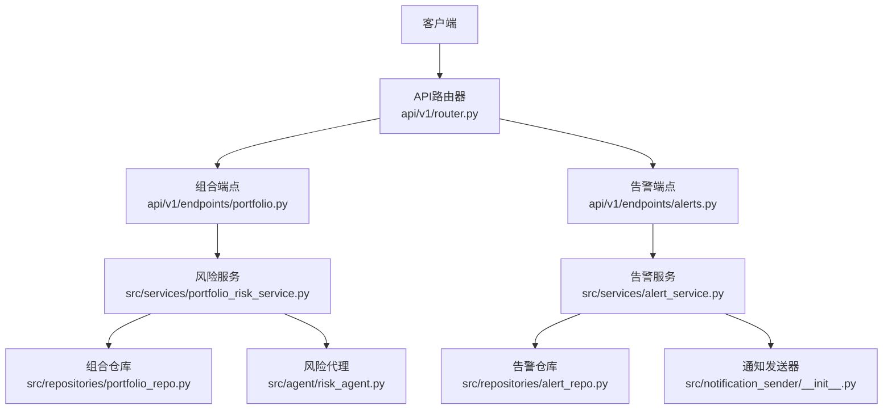
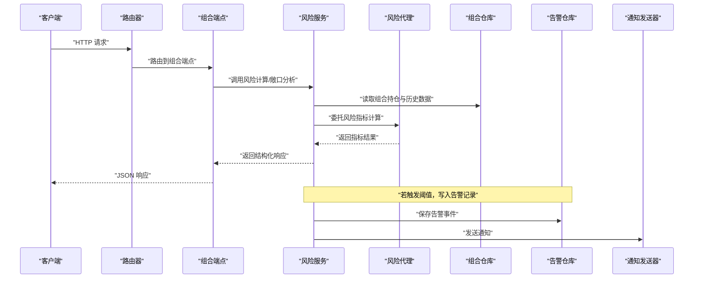
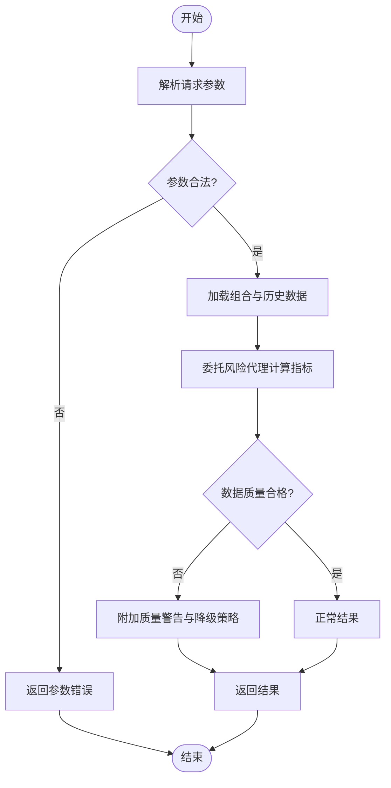
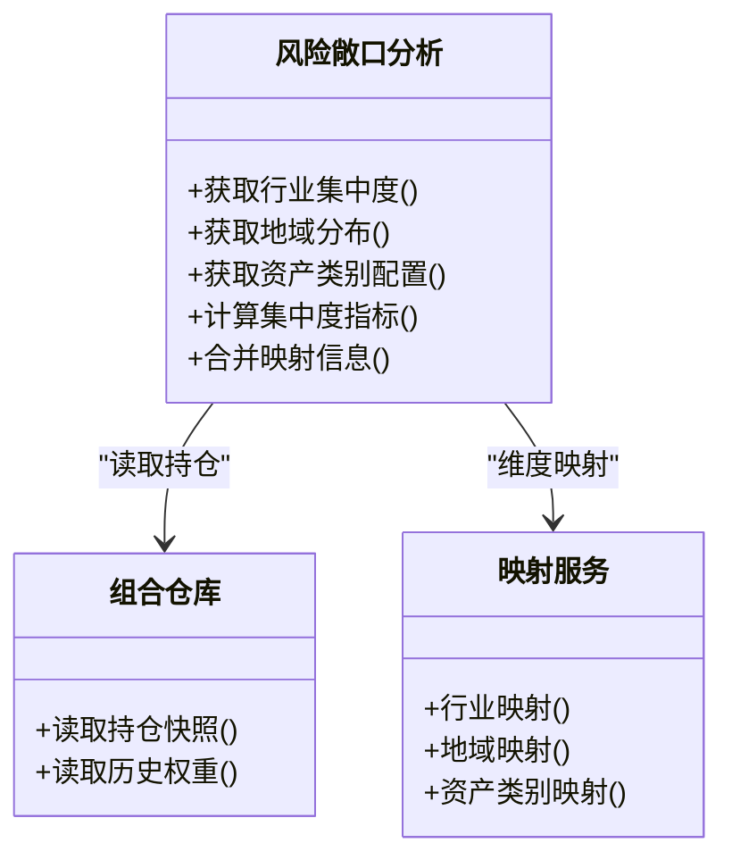
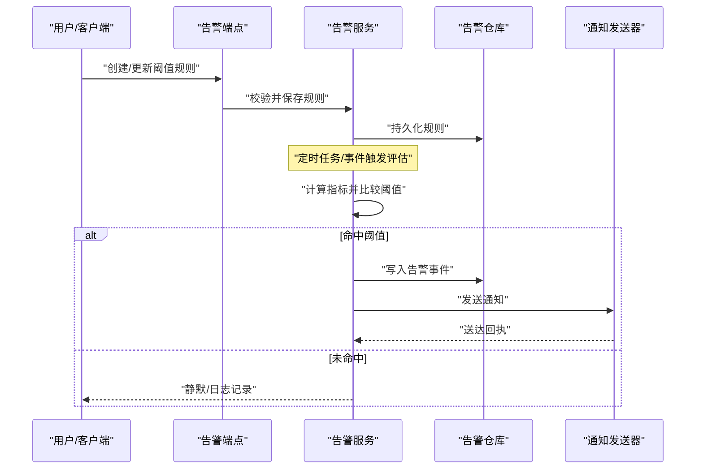
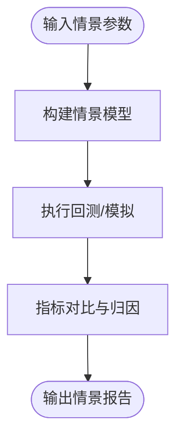
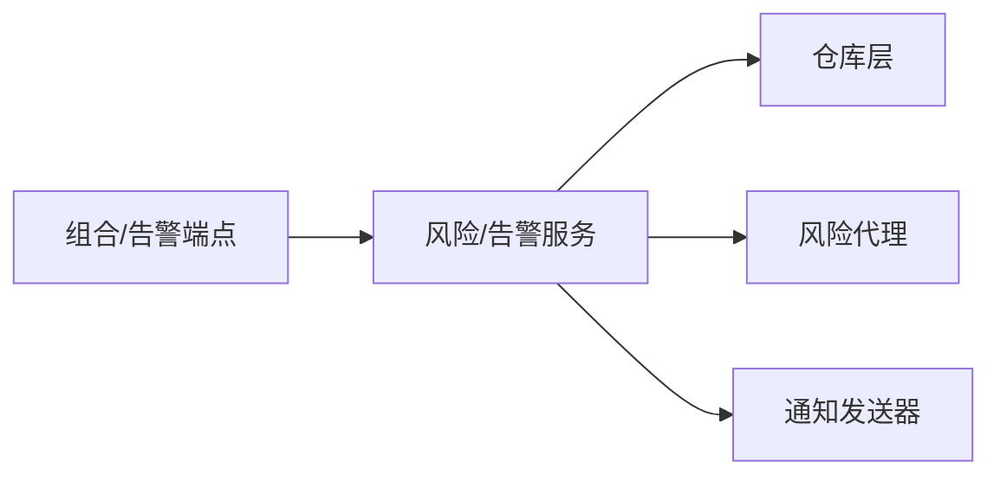

# 风险评估接口

<cite>
**本文引用的文件**   
- [api/v1/endpoints/portfolio.py](file://api/v1/endpoints/portfolio.py)
- [api/v1/schemas/portfolio.py](file://api/v1/schemas/portfolio.py)
- [src/services/portfolio_risk_service.py](file://src/services/portfolio_risk_service.py)
- [src/agent/risk_agent.py](file://src/agent/risk_agent.py)
- [api/v1/endpoints/alerts.py](file://api/v1/endpoints/alerts.py)
- [api/v1/schemas/alerts.py](file://api/v1/schemas/alerts.py)
- [src/services/alert_service.py](file://src/services/alert_service.py)
- [src/services/alert_worker.py](file://src/services/alert_worker.py)
- [src/notification_sender/__init__.py](file://src/notification_sender/__init__.py)
- [src/repositories/alert_repo.py](file://src/repositories/alert_repo.py)
- [src/repositories/portfolio_repo.py](file://src/repositories/portfolio_repo.py)
- [api/app.py](file://api/app.py)
- [api/v1/router.py](file://api/v1/router.py)
</cite>

## 目录
1. [简介](#简介)
2. [项目结构](#项目结构)
3. [核心组件](#核心组件)
4. [架构总览](#架构总览)
5. [详细组件分析](#详细组件分析)
6. [依赖分析](#依赖分析)
7. [性能考虑](#性能考虑)
8. [故障排查指南](#故障排查指南)
9. [结论](#结论)
10. [附录](#附录)

## 简介
本文件面向投资组合风险评估相关API，覆盖风险指标计算、风险敞口分析、风险预警与告警、压力测试与情景分析、风险报告生成与数据可视化等能力。文档以“从调用到实现”的方式说明接口职责、输入输出、数据结构与错误处理，帮助开发者快速集成与使用。

## 项目结构
与风险评估相关的后端代码主要分布在以下位置：
- API路由与请求校验：api/v1/endpoints/* 与 api/v1/schemas/*
- 业务服务层：src/services/*（如 portfolio_risk_service.py、alert_service.py）
- 代理与工具：src/agent/risk_agent.py
- 存储与仓库：src/repositories/*（如 alert_repo.py、portfolio_repo.py）
- 通知通道：src/notification_sender/*
- 应用装配：api/app.py、api/v1/router.py

图表来源 
- [api/v1/router.py](file://api/v1/router.py)
- [api/v1/endpoints/portfolio.py](file://api/v1/endpoints/portfolio.py)
- [api/v1/endpoints/alerts.py](file://api/v1/endpoints/alerts.py)
- [src/services/portfolio_risk_service.py](file://src/services/portfolio_risk_service.py)
- [src/services/alert_service.py](file://src/services/alert_service.py)
- [src/repositories/portfolio_repo.py](file://src/repositories/portfolio_repo.py)
- [src/repositories/alert_repo.py](file://src/repositories/alert_repo.py)
- [src/notification_sender/__init__.py](file://src/notification_sender/__init__.py)
- [src/agent/risk_agent.py](file://src/agent/risk_agent.py)

章节来源
- [api/app.py](file://api/app.py)
- [api/v1/router.py](file://api/v1/router.py)

## 核心组件
- 风险指标计算服务：提供VaR、最大回撤、波动率、夏普比率等指标的计算与聚合。
- 风险敞口分析：按行业、地域、资产类别等维度进行集中度与配置分析。
- 风险预警与告警：阈值管理、触发条件评估、多通道通知。
- 压力测试与情景分析：支持自定义情景参数与批量回测。
- 风险报告与可视化：结构化结果输出与图表数据准备。

章节来源
- [src/services/portfolio_risk_service.py](file://src/services/portfolio_risk_service.py)
- [src/agent/risk_agent.py](file://src/agent/risk_agent.py)
- [src/services/alert_service.py](file://src/services/alert_service.py)
- [src/repositories/portfolio_repo.py](file://src/repositories/portfolio_repo.py)
- [src/repositories/alert_repo.py](file://src/repositories/alert_repo.py)

## 架构总览
整体采用分层架构：API层负责路由与入参校验；服务层封装业务逻辑；仓库层负责持久化；通知层负责多渠道推送；代理层提供可插拔的风险计算能力。

图表来源 
- [api/v1/router.py](file://api/v1/router.py)
- [api/v1/endpoints/portfolio.py](file://api/v1/endpoints/portfolio.py)
- [src/services/portfolio_risk_service.py](file://src/services/portfolio_risk_service.py)
- [src/agent/risk_agent.py](file://src/agent/risk_agent.py)
- [src/repositories/portfolio_repo.py](file://src/repositories/portfolio_repo.py)
- [src/repositories/alert_repo.py](file://src/repositories/alert_repo.py)
- [src/notification_sender/__init__.py](file://src/notification_sender/__init__.py)

## 详细组件分析

### 风险指标计算接口（VaR、最大回撤、波动率、夏普比率）
- 功能概述
  - 计算并返回组合层面的关键风险指标，包括风险价值（VaR）、最大回撤、波动率、夏普比率等。
  - 支持不同时间窗口、置信水平与基准选择。
- 典型调用流程
  - 客户端通过组合端点提交查询参数（组合ID、时间范围、置信度等）。
  - 服务层加载历史行情与持仓快照，委托风险代理执行指标计算。
  - 返回标准化JSON结构，包含指标值、计算元数据与质量标记。
- 输入参数（示例字段）
  - 组合标识、起止日期、频率（日/周/月）、置信水平（如95%、99%）、基准指数、是否滚动窗口等。
- 输出结构（关键字段）
  - 指标集合：VaR（分位数损失）、最大回撤（幅度与发生区间）、波动率（年化）、夏普比率（无风险利率可选）。
  - 元数据：计算时间、数据源、缺失数据处理策略、样本数量。
- 错误处理
  - 数据不足或异常时返回降级结果与警告标记；非法参数返回明确错误码。

图表来源 
- [api/v1/endpoints/portfolio.py](file://api/v1/endpoints/portfolio.py)
- [src/services/portfolio_risk_service.py](file://src/services/portfolio_risk_service.py)
- [src/agent/risk_agent.py](file://src/agent/risk_agent.py)

章节来源
- [api/v1/endpoints/portfolio.py](file://api/v1/endpoints/portfolio.py)
- [src/services/portfolio_risk_service.py](file://src/services/portfolio_risk_service.py)
- [src/agent/risk_agent.py](file://src/agent/risk_agent.py)

### 风险敞口分析接口（行业集中度、地域分布、资产类别配置）
- 功能概述
  - 基于当前持仓与映射关系，输出多维度风险敞口：行业、地域、资产类别、市值区间、流动性等。
- 典型调用流程
  - 客户端提交组合ID与分析维度。
  - 服务层聚合持仓明细与外部映射（行业/地域/资产类别），计算集中度与权重分布。
  - 返回结构化分布与集中度指标（如HHI、Top-N占比）。
- 输入参数（示例字段）
  - 组合ID、维度列表（行业/地域/资产类别）、聚合粒度、是否包含现金与衍生品。
- 输出结构（关键字段）
  - 各维度权重分布、集中度指标、异常集中提示、数据来源与更新时间。
- 错误处理
  - 映射缺失时给出占位与缺失比例；维度不支持时返回明确错误。

图表来源 
- [src/services/portfolio_risk_service.py](file://src/services/portfolio_risk_service.py)
- [src/repositories/portfolio_repo.py](file://src/repositories/portfolio_repo.py)

章节来源
- [api/v1/endpoints/portfolio.py](file://api/v1/endpoints/portfolio.py)
- [src/services/portfolio_risk_service.py](file://src/services/portfolio_risk_service.py)
- [src/repositories/portfolio_repo.py](file://src/repositories/portfolio_repo.py)

### 风险预警与告警接口（阈值设置、触发条件、通知方式）
- 功能概述
  - 提供阈值配置、实时/定时评估、告警事件记录与多渠道通知（邮件、即时通讯、Webhook等）。
- 典型调用流程
  - 客户端创建/更新阈值规则（指标类型、阈值、生效时间、通知渠道）。
  - 服务层周期性或事件驱动评估，命中阈值则写入告警记录并触发通知。
- 输入参数（示例字段）
  - 规则ID、指标名称、阈值上限/下限、比较符、生效周期、通知渠道、接收人。
- 输出结构（关键字段）
  - 规则状态、最近评估结果、触发次数、最近告警时间与内容、通知送达状态。
- 错误处理
  - 规则冲突检测、渠道不可用降级、重复告警抑制策略。

图表来源 
- [api/v1/endpoints/alerts.py](file://api/v1/endpoints/alerts.py)
- [src/services/alert_service.py](file://src/services/alert_service.py)
- [src/repositories/alert_repo.py](file://src/repositories/alert_repo.py)
- [src/notification_sender/__init__.py](file://src/notification_sender/__init__.py)

章节来源
- [api/v1/endpoints/alerts.py](file://api/v1/endpoints/alerts.py)
- [api/v1/schemas/alerts.py](file://api/v1/schemas/alerts.py)
- [src/services/alert_service.py](file://src/services/alert_service.py)
- [src/services/alert_worker.py](file://src/services/alert_worker.py)
- [src/repositories/alert_repo.py](file://src/repositories/alert_repo.py)
- [src/notification_sender/__init__.py](file://src/notification_sender/__init__.py)

### 压力测试与情景分析接口
- 功能概述
  - 支持定义情景参数（市场冲击、相关性变化、流动性折价等），对组合进行批量回测与敏感性分析。
- 典型调用流程
  - 客户端提交情景定义与回测参数。
  - 服务层执行情景模拟，输出指标对比与归因摘要。
- 输入参数（示例字段）
  - 情景ID/名称、冲击因子、时间窗口、回测频率、基准、是否滚动。
- 输出结构（关键字段）
  - 情景结果集（指标前后对比）、归因分解、风险提示与建议。
- 错误处理
  - 情景参数非法、数据不足时的降级与提示。

图表来源 
- [src/services/portfolio_risk_service.py](file://src/services/portfolio_risk_service.py)
- [src/agent/risk_agent.py](file://src/agent/risk_agent.py)

章节来源
- [api/v1/endpoints/portfolio.py](file://api/v1/endpoints/portfolio.py)
- [src/services/portfolio_risk_service.py](file://src/services/portfolio_risk_service.py)
- [src/agent/risk_agent.py](file://src/agent/risk_agent.py)

### 风险报告生成与数据可视化接口
- 功能概述
  - 将风险指标与敞口分析结果渲染为结构化报告（Markdown/HTML/PDF）与可视化图表数据（JSON）。
- 典型调用流程
  - 客户端指定报告模板与输出格式。
  - 服务层组装数据并渲染，返回下载链接或直接返回内容。
- 输入参数（示例字段）
  - 组合ID、报告类型、时间范围、语言、模板ID、输出格式。
- 输出结构（关键字段）
  - 报告内容、图表数据、元数据（生成时间、版本、数据来源）。
- 错误处理
  - 模板缺失、渲染失败时的回退策略与错误码。

章节来源
- [src/services/portfolio_risk_service.py](file://src/services/portfolio_risk_service.py)

### 数据结构与字段说明（风险评估结果）
- 通用字段
  - 指标名、数值、单位、置信水平、时间戳、数据质量标记、备注。
- 风险指标
  - VaR：分位数损失、持有期、置信水平。
  - 最大回撤：回撤幅度、起始与结束时间、恢复天数。
  - 波动率：年化/滚动、基准对比。
  - 夏普比率：无风险利率、超额收益计算方式。
- 敞口维度
  - 行业/地域/资产类别：权重、Top-N占比、集中度指标（如HHI）、缺失比例。
- 告警事件
  - 规则ID、触发时间、指标值、阈值、通知渠道、送达状态。

章节来源
- [api/v1/schemas/portfolio.py](file://api/v1/schemas/portfolio.py)
- [api/v1/schemas/alerts.py](file://api/v1/schemas/alerts.py)

## 依赖分析
- 组件耦合
  - 端点与服务层解耦，服务层通过仓库访问数据，通知层独立扩展。
  - 风险代理作为可插拔模块，便于替换计算引擎。
- 外部依赖
  - 数据源（行情、映射）、通知通道（邮件、IM、Webhook）、渲染引擎（模板）。
- 潜在循环依赖
  - 服务层不直接依赖端点，避免循环；仓库与通知层保持单向依赖。

图表来源 
- [api/v1/endpoints/portfolio.py](file://api/v1/endpoints/portfolio.py)
- [api/v1/endpoints/alerts.py](file://api/v1/endpoints/alerts.py)
- [src/services/portfolio_risk_service.py](file://src/services/portfolio_risk_service.py)
- [src/services/alert_service.py](file://src/services/alert_service.py)
- [src/repositories/portfolio_repo.py](file://src/repositories/portfolio_repo.py)
- [src/repositories/alert_repo.py](file://src/repositories/alert_repo.py)
- [src/notification_sender/__init__.py](file://src/notification_sender/__init__.py)
- [src/agent/risk_agent.py](file://src/agent/risk_agent.py)

章节来源
- [api/v1/router.py](file://api/v1/router.py)
- [api/app.py](file://api/app.py)

## 性能考虑
- 缓存策略
  - 对历史数据与映射表做短期缓存，减少重复IO。
- 异步与批处理
  - 告警评估与通知发送采用异步队列，降低主链路延迟。
- 增量计算
  - 滚动窗口指标采用增量更新，避免全量重算。
- 资源限制
  - 对大数据集计算增加超时与限流保护。

[本节为通用指导，无需特定文件引用]

## 故障排查指南
- 常见问题
  - 数据缺失：检查数据源连通性与时间窗口完整性。
  - 阈值未触发：确认规则生效时间与评估周期。
  - 通知失败：核对渠道配置与凭据有效性。
- 定位步骤
  - 查看端点日志与错误码。
  - 检查仓库读写与通知回执。
  - 验证代理计算中间结果与质量标记。

章节来源
- [src/services/alert_service.py](file://src/services/alert_service.py)
- [src/services/alert_worker.py](file://src/services/alert_worker.py)
- [src/repositories/alert_repo.py](file://src/repositories/alert_repo.py)
- [src/notification_sender/__init__.py](file://src/notification_sender/__init__.py)

## 结论
本风险评估API体系以清晰的分层与可扩展的代理机制，提供完整的风险指标计算、敞口分析、预警告警、压力测试与报告可视化能力。建议在生产环境启用缓存与异步处理，并结合监控与告警提升稳定性与可观测性。

[本节为总结性内容，无需特定文件引用]

## 附录
- 术语
  - VaR：在给定置信水平下的最大可能损失。
  - 最大回撤：历史峰值到谷底的最大跌幅。
  - 波动率：收益率的标准差，衡量价格变动幅度。
  - 夏普比率：超额收益与波动率的比值，衡量风险调整后收益。
- 最佳实践
  - 合理设置时间窗口与置信水平，避免过拟合。
  - 对高集中度维度设置更严格的阈值。
  - 定期校准情景参数与无风险利率假设。

[本节为概念性内容，无需特定文件引用]