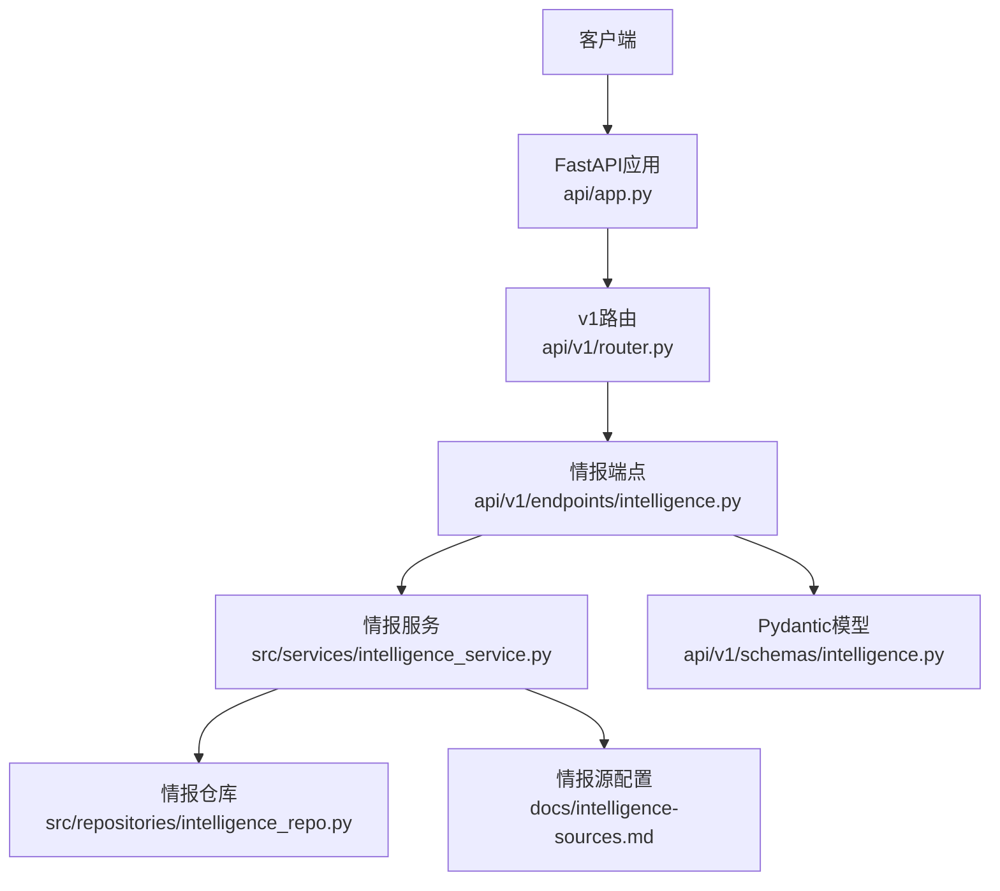
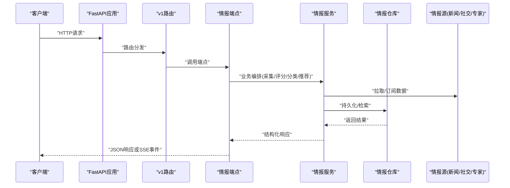
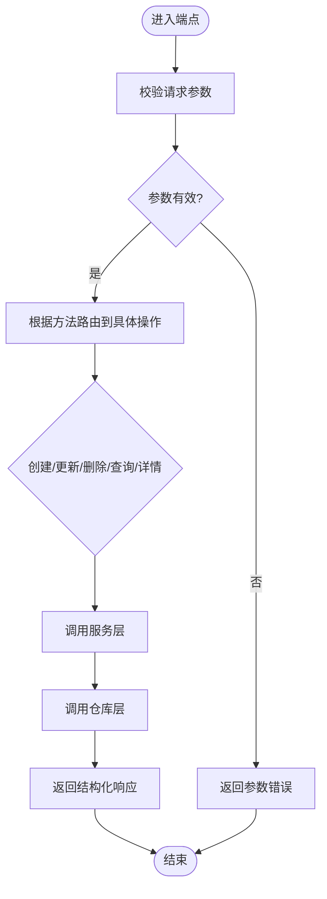
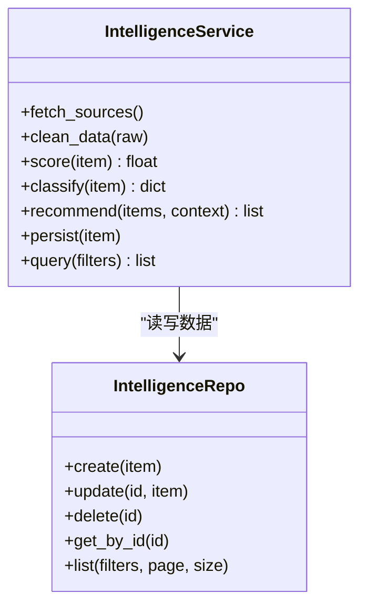
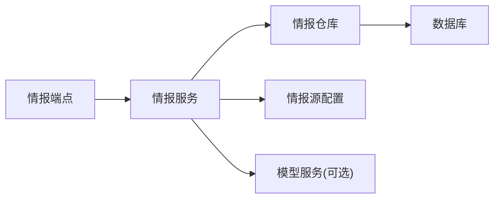

# 智能情报API

<cite>
**本文引用的文件**   
- [intelligence.py](file://api/v1/endpoints/intelligence.py)
- [intelligence.py](file://api/v1/schemas/intelligence.py)
- [intelligence_service.py](file://src/services/intelligence_service.py)
- [intelligence_repo.py](file://src/repositories/intelligence_repo.py)
- [router.py](file://api/v1/router.py)
- [app.py](file://api/app.py)
- [intelligence-sources.md](file://docs/intelligence-sources.md)
- [test_intelligence_api.py](file://tests/test_intelligence_api.py)
- [test_intelligence_service.py](file://tests/test_intelligence_service.py)
</cite>

## 目录
1. [简介](#简介)
2. [项目结构](#项目结构)
3. [核心组件](#核心组件)
4. [架构总览](#架构总览)
5. [详细组件分析](#详细组件分析)
6. [依赖分析](#依赖分析)
7. [性能考虑](#性能考虑)
8. [故障排查指南](#故障排查指南)
9. [结论](#结论)
10. [附录](#附录)

## 简介
本文件面向“智能情报”相关API的开发者与集成方，系统性地说明市场情报收集、分析与分发的接口使用方法。内容覆盖新闻聚合、社交媒体监控、专家观点整合的调用方式；情报评分、分类与推荐算法的配置方法；完整的请求/响应示例（含数据结构与格式）；实时推送、历史查询与订阅管理实现；以及情报源管理、质量控制与更新策略配置。同时提供最佳实践与集成指南，帮助快速落地并稳定运行。

## 项目结构
本项目采用分层架构：API层暴露REST接口，服务层封装业务逻辑，仓储层负责数据持久化，前端通过HTTP/SSE与后端交互。与智能情报相关的核心文件包括：
- API端点定义：api/v1/endpoints/intelligence.py
- 数据模型与校验：api/v1/schemas/intelligence.py
- 业务服务：src/services/intelligence_service.py
- 数据访问：src/repositories/intelligence_repo.py
- 路由注册：api/v1/router.py
- 应用入口：api/app.py
- 文档与示例：docs/intelligence-sources.md
- 测试用例：tests/test_intelligence_api.py、tests/test_intelligence_service.py

**图表来源** 
- [app.py](file://api/app.py)
- [router.py](file://api/v1/router.py)
- [intelligence.py](file://api/v1/endpoints/intelligence.py)
- [intelligence_service.py](file://src/services/intelligence_service.py)
- [intelligence_repo.py](file://src/repositories/intelligence_repo.py)
- [intelligence.py](file://api/v1/schemas/intelligence.py)
- [intelligence-sources.md](file://docs/intelligence-sources.md)

**章节来源**
- [app.py](file://api/app.py)
- [router.py](file://api/v1/router.py)
- [intelligence.py](file://api/v1/endpoints/intelligence.py)
- [intelligence_service.py](file://src/services/intelligence_service.py)
- [intelligence_repo.py](file://src/repositories/intelligence_repo.py)
- [intelligence.py](file://api/v1/schemas/intelligence.py)
- [intelligence-sources.md](file://docs/intelligence-sources.md)

## 核心组件
- 情报端点（API层）：提供REST接口用于创建、查询、更新、删除情报条目，支持按主题、来源、时间范围筛选，并提供SSE实时推送能力。
- 情报服务（业务层）：编排情报采集、清洗、评分、分类与推荐流程，协调外部情报源与内部存储。
- 情报仓库（数据层）：封装情报数据的增删改查与分页、过滤、排序等能力。
- 数据模型（Schema）：使用Pydantic定义请求/响应结构，确保输入输出一致性与可验证性。
- 情报源配置：集中管理新闻、社交、专家观点等来源的连接参数、抓取频率、质量阈值与更新策略。

**章节来源**
- [intelligence.py](file://api/v1/endpoints/intelligence.py)
- [intelligence_service.py](file://src/services/intelligence_service.py)
- [intelligence_repo.py](file://src/repositories/intelligence_repo.py)
- [intelligence.py](file://api/v1/schemas/intelligence.py)
- [intelligence-sources.md](file://docs/intelligence-sources.md)

## 架构总览
下图展示了从客户端到数据源的完整调用链，包括REST与SSE两种交互模式，以及评分、分类与推荐的内部处理流程。

**图表来源** 
- [app.py](file://api/app.py)
- [router.py](file://api/v1/router.py)
- [intelligence.py](file://api/v1/endpoints/intelligence.py)
- [intelligence_service.py](file://src/services/intelligence_service.py)
- [intelligence_repo.py](file://src/repositories/intelligence_repo.py)

## 详细组件分析

### 情报端点（REST与SSE）
- 功能要点
  - 创建/更新/删除情报条目
  - 列表查询与分页、过滤（主题、来源、时间范围、标签）
  - 单条详情获取
  - SSE实时推送（新增/更新事件流）
- 典型接口
  - POST /api/v1/intelligence：创建情报
  - GET /api/v1/intelligence：查询列表（支持分页与过滤）
  - GET /api/v1/intelligence/{id}：获取详情
  - PUT /api/v1/intelligence/{id}：更新情报
  - DELETE /api/v1/intelligence/{id}：删除情报
  - GET /api/v1/intelligence/stream：SSE实时推送
- 请求/响应结构
  - 请求体字段：主题、来源、标题、摘要、正文、标签、时间戳、置信度、评分、分类、推荐权重等
  - 响应体字段：状态码、消息、数据对象（分页信息、条目列表或单条详情）、错误信息
- 错误处理
  - 参数校验失败、权限不足、资源不存在、上游源异常等统一错误响应

**图表来源** 
- [intelligence.py](file://api/v1/endpoints/intelligence.py)
- [intelligence_service.py](file://src/services/intelligence_service.py)
- [intelligence_repo.py](file://src/repositories/intelligence_repo.py)

**章节来源**
- [intelligence.py](file://api/v1/endpoints/intelligence.py)
- [intelligence.py](file://api/v1/schemas/intelligence.py)

### 情报服务（采集、评分、分类、推荐）
- 功能要点
  - 聚合多源数据（新闻、社交、专家观点）
  - 数据清洗与去重
  - 评分计算（基于时效性、相关性、可信度、传播热度等）
  - 分类打标（行业、主题、情绪、风险等级）
  - 推荐策略（个性化权重、用户偏好、上下文）
- 关键流程
  - 数据采集：定时/触发式拉取，增量同步
  - 数据处理：文本标准化、实体识别、关键词提取
  - 评分与分类：规则+模型混合，可配置阈值与权重
  - 推荐生成：结合用户画像与上下文，输出推荐列表与理由
- 配置项
  - 评分权重、分类规则、推荐策略、质量阈值、重试与超时、缓存策略

**图表来源** 
- [intelligence_service.py](file://src/services/intelligence_service.py)
- [intelligence_repo.py](file://src/repositories/intelligence_repo.py)

**章节来源**
- [intelligence_service.py](file://src/services/intelligence_service.py)
- [intelligence_repo.py](file://src/repositories/intelligence_repo.py)

### 数据模型（Schema）
- 设计原则
  - 使用Pydantic进行强类型校验
  - 统一的请求/响应结构，便于前后端协作
  - 可扩展字段（如扩展元数据、审计字段）
- 关键字段
  - 标识：id、版本
  - 内容：标题、摘要、正文、链接、附件
  - 元数据：来源、作者、时间戳、语言、地区
  - 分析：评分、分类、标签、置信度、推荐权重
  - 控制：可见性、权限、状态

**章节来源**
- [intelligence.py](file://api/v1/schemas/intelligence.py)

### 情报源管理与更新策略
- 支持来源
  - 新闻聚合：RSS、API、爬虫
  - 社交媒体：平台API、流式接口
  - 专家观点：研报、访谈、会议记录
- 配置项
  - 连接参数、认证、限流、重试、超时
  - 抓取频率、增量策略、去重键
  - 质量阈值、黑名单/白名单、敏感词过滤
  - 更新策略：定时任务、事件驱动、手动触发
- 质量控制
  - 数据完整性校验、重复检测、噪声过滤
  - 来源信誉评估、动态权重调整

**章节来源**
- [intelligence-sources.md](file://docs/intelligence-sources.md)

### 实时推送（SSE）
- 机制
  - 服务端维护事件流，客户端建立SSE连接
  - 事件类型：新增、更新、删除、评分变化、分类变更
  - 断线重连与心跳保活
- 使用建议
  - 客户端订阅主题/标签过滤
  - 合理设置接收频率与批处理
  - 本地缓存与幂等处理

**章节来源**
- [intelligence.py](file://api/v1/endpoints/intelligence.py)

### 历史查询与订阅管理
- 历史查询
  - 支持多维度过滤与排序
  - 分页与游标翻页
  - 导出与批量下载
- 订阅管理
  - 创建/更新/删除订阅
  - 订阅条件：主题、来源、时间窗口、关键词
  - 通知渠道：Webhook、邮件、IM

**章节来源**
- [intelligence.py](file://api/v1/endpoints/intelligence.py)
- [intelligence_service.py](file://src/services/intelligence_service.py)

## 依赖分析
- 模块耦合
  - 端点依赖服务，服务依赖仓库，仓库依赖数据库
  - 服务依赖情报源配置与外部API
- 外部依赖
  - 数据源提供方（新闻、社交、专家）
  - LLM/模型服务（可选，用于分类与推荐）
  - 消息队列/缓存（可选，用于高并发与去重）
- 潜在风险
  - 外部源不稳定导致延迟或失败
  - 大流量下SSE与查询的性能瓶颈
  - 模型服务不可用时的降级策略

**图表来源** 
- [intelligence.py](file://api/v1/endpoints/intelligence.py)
- [intelligence_service.py](file://src/services/intelligence_service.py)
- [intelligence_repo.py](file://src/repositories/intelligence_repo.py)
- [intelligence-sources.md](file://docs/intelligence-sources.md)

**章节来源**
- [intelligence.py](file://api/v1/endpoints/intelligence.py)
- [intelligence_service.py](file://src/services/intelligence_service.py)
- [intelligence_repo.py](file://src/repositories/intelligence_repo.py)
- [intelligence-sources.md](file://docs/intelligence-sources.md)

## 性能考虑
- 查询优化
  - 合理使用索引（时间戳、主题、来源、标签）
  - 分页与游标避免全表扫描
  - 缓存热点数据（最近热门、常用过滤）
- 写入优化
  - 批量插入与事务合并
  - 异步采集与背压控制
- SSE优化
  - 事件压缩与批处理
  - 客户端重连与去抖
- 模型服务
  - 缓存分类与评分结果
  - 降级为规则引擎当模型不可用

[本节为通用指导，不直接分析具体文件]

## 故障排查指南
- 常见问题
  - 参数校验失败：检查请求体结构与必填字段
  - 权限不足：确认鉴权令牌与角色权限
  - 资源不存在：核对ID与状态
  - 上游源异常：检查连接参数、限流与重试
- 调试建议
  - 启用详细日志与追踪ID
  - 使用测试用例定位问题（参考测试文件）
  - 监控指标：延迟、错误率、吞吐量

**章节来源**
- [test_intelligence_api.py](file://tests/test_intelligence_api.py)
- [test_intelligence_service.py](file://tests/test_intelligence_service.py)

## 结论
本API体系围绕“智能情报”的核心需求，提供了从采集、处理到分发的完整能力。通过清晰的层次划分、严格的模型校验与灵活的配置管理，能够满足新闻聚合、社交媒体监控与专家观点整合的多场景应用。建议在生产环境中结合缓存、队列与监控，提升稳定性与性能，并根据业务特性持续优化评分、分类与推荐策略。

[本节为总结性内容，不直接分析具体文件]

## 附录
- 集成步骤
  - 配置情报源与认证
  - 初始化服务与仓库
  - 启动API与SSE服务
  - 前端接入与事件处理
- 最佳实践
  - 使用幂等接口与重试机制
  - 合理设置超时与熔断
  - 定期评估与更新评分/分类规则
  - 监控与告警覆盖关键路径

[本节为补充信息，不直接分析具体文件]