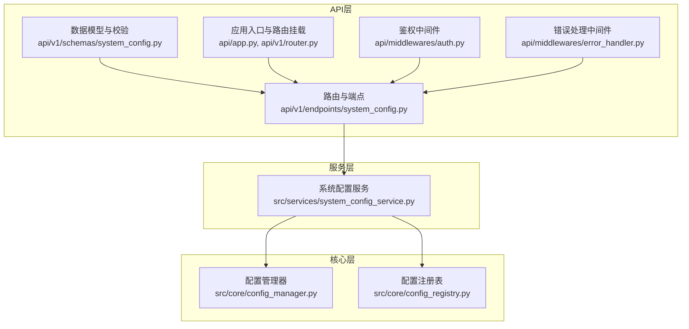
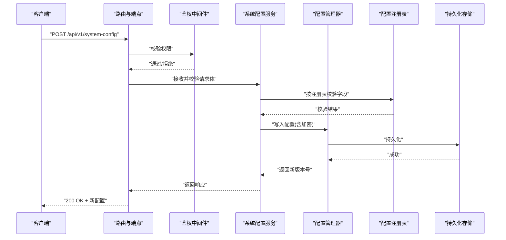
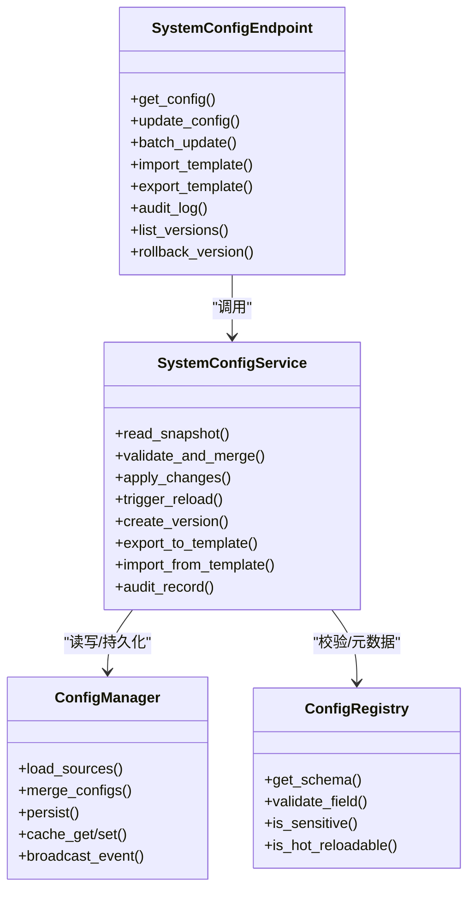

# 系统配置API

<cite>
**本文引用的文件**   
- [system_config.py](file://api/v1/endpoints/system_config.py)
- [system_config.py](file://api/v1/schemas/system_config.py)
- [system_config_service.py](file://src/services/system_config_service.py)
- [config_manager.py](file://src/core/config_manager.py)
- [config_registry.py](file://src/core/config_registry.py)
- [app.py](file://api/app.py)
- [router.py](file://api/v1/router.py)
- [auth.py](file://api/middlewares/auth.py)
- [error_handler.py](file://api/middlewares/error_handler.py)
- [test_system_config_api.py](file://tests/test_system_config_api.py)
- [test_system_config_service.py](file://tests/test_system_config_service.py)
</cite>

## 目录
1. [简介](#简介)
2. [项目结构](#项目结构)
3. [核心组件](#核心组件)
4. [架构总览](#架构总览)
5. [详细组件分析](#详细组件分析)
6. [依赖关系分析](#依赖关系分析)
7. [性能考虑](#性能考虑)
8. [故障排除指南](#故障排除指南)
9. [结论](#结论)
10. [附录：接口定义与示例](#附录接口定义与示例)

## 简介
本文件面向系统配置相关的API，覆盖系统参数配置、环境变量管理、配置文件操作等能力。重点说明数据库连接、缓存配置、日志级别等系统设置的调用方式；阐述配置验证、热重载与版本管理机制；提供完整的请求响应示例（含字段结构与校验规则）；并给出批量配置、配置模板、配置审计、安全加密存储与权限控制的最佳实践与排障建议。

## 项目结构
系统配置相关代码主要分布在以下位置：
- API层：路由与端点定义、Pydantic模型校验
- 服务层：配置读写、校验、热重载、版本管理等业务逻辑
- 核心层：配置管理器与注册表，负责加载、合并、持久化与事件分发
- 中间件：鉴权与错误处理
- 测试：端到端与单元测试，覆盖关键路径与边界条件

图表来源
- [system_config.py](file://api/v1/endpoints/system_config.py)
- [system_config.py](file://api/v1/schemas/system_config.py)
- [system_config_service.py](file://src/services/system_config_service.py)
- [config_manager.py](file://src/core/config_manager.py)
- [config_registry.py](file://src/core/config_registry.py)
- [app.py](file://api/app.py)
- [router.py](file://api/v1/router.py)
- [auth.py](file://api/middlewares/auth.py)
- [error_handler.py](file://api/middlewares/error_handler.py)

章节来源
- [system_config.py](file://api/v1/endpoints/system_config.py)
- [system_config.py](file://api/v1/schemas/system_config.py)
- [system_config_service.py](file://src/services/system_config_service.py)
- [config_manager.py](file://src/core/config_manager.py)
- [config_registry.py](file://src/core/config_registry.py)
- [app.py](file://api/app.py)
- [router.py](file://api/v1/router.py)
- [auth.py](file://api/middlewares/auth.py)
- [error_handler.py](file://api/middlewares/error_handler.py)

## 核心组件
- 配置端点（API）：暴露REST接口，用于查询、更新、批量设置、模板导入导出、审计与版本管理。所有输入均通过Pydantic模型进行强类型校验。
- 配置服务（Service）：封装配置的业务逻辑，包括读取/写入、校验、热重载触发、版本快照、审计记录、模板解析与合并。
- 配置管理器（Core）：负责配置的加载、合并、持久化、内存缓存与事件通知。支持多源（环境变量、配置文件、运行时更新）。
- 配置注册表（Core）：维护配置项元数据（类型、默认值、范围、是否敏感、是否可热重载等），为校验与文档生成提供依据。
- 鉴权与错误处理（Middleware）：统一鉴权拦截与错误格式化，确保只有具备相应权限的客户端才能修改配置，并将异常标准化返回。

章节来源
- [system_config.py](file://api/v1/endpoints/system_config.py)
- [system_config.py](file://api/v1/schemas/system_config.py)
- [system_config_service.py](file://src/services/system_config_service.py)
- [config_manager.py](file://src/core/config_manager.py)
- [config_registry.py](file://src/core/config_registry.py)
- [auth.py](file://api/middlewares/auth.py)
- [error_handler.py](file://api/middlewares/error_handler.py)

## 架构总览
下图展示了从HTTP请求到配置落盘与热重载的关键流程。

图表来源
- [system_config.py](file://api/v1/endpoints/system_config.py)
- [system_config_service.py](file://src/services/system_config_service.py)
- [config_manager.py](file://src/core/config_manager.py)
- [config_registry.py](file://src/core/config_registry.py)
- [auth.py](file://api/middlewares/auth.py)

## 详细组件分析

### 配置端点（API）
- 职责：定义系统配置的CRUD、批量设置、模板导入导出、审计查询、版本列表与回滚等接口；对请求体进行结构化校验；统一错误码与消息。
- 典型能力：
  - 获取当前配置快照
  - 更新单个或批量配置项
  - 导入配置模板（YAML/JSON）
  - 导出当前配置为模板
  - 查询配置审计日志
  - 列出配置版本并执行回滚
- 校验与约束：
  - 使用Pydantic模型严格校验字段类型、必填项、取值范围与格式
  - 敏感字段（如密码、密钥）在响应中脱敏
  - 非法请求直接返回4xx错误，避免进入服务层

章节来源
- [system_config.py](file://api/v1/endpoints/system_config.py)
- [system_config.py](file://api/v1/schemas/system_config.py)

### 配置服务（Service）
- 职责：编排配置变更的生命周期，包括：
  - 读取配置快照
  - 根据注册表逐项校验
  - 合并新旧配置（支持增量与全量）
  - 触发热重载（若配置标记为可热重载）
  - 生成版本快照并记录审计
  - 模板解析与校验
- 关键行为：
  - 热重载：仅对允许热重载的配置项生效，其他项需重启服务
  - 版本管理：每次有效变更生成版本号，支持回滚至指定版本
  - 审计：记录操作人、时间、变更前后差异（脱敏后）

章节来源
- [system_config_service.py](file://src/services/system_config_service.py)

### 配置管理器（Core）
- 职责：
  - 加载多源配置（环境变量、配置文件、运行时更新）
  - 合并策略（优先级：运行时 > 配置文件 > 环境变量 > 默认值）
  - 持久化与缓存（内存+磁盘）
  - 事件广播（供监听器实现热重载）
- 性能要点：
  - 读多写少场景下采用内存缓存
  - 写路径加锁保证一致性
  - 大对象按需序列化

章节来源
- [config_manager.py](file://src/core/config_manager.py)

### 配置注册表（Core）
- 职责：
  - 维护每个配置项的元数据：类型、默认值、取值范围、是否敏感、是否可热重载、分组、描述等
  - 为校验、文档生成、前端展示提供依据
- 扩展性：
  - 新增配置项只需在注册表中声明，无需改动核心逻辑

章节来源
- [config_registry.py](file://src/core/config_registry.py)

### 鉴权与错误处理（Middleware）
- 鉴权：基于角色或权限标识限制对配置接口的访问，未授权请求直接拒绝
- 错误处理：将异常转换为标准JSON错误响应，包含错误码、消息与可选详情

章节来源
- [auth.py](file://api/middlewares/auth.py)
- [error_handler.py](file://api/middlewares/error_handler.py)

## 依赖关系分析

图表来源
- [system_config.py](file://api/v1/endpoints/system_config.py)
- [system_config_service.py](file://src/services/system_config_service.py)
- [config_manager.py](file://src/core/config_manager.py)
- [config_registry.py](file://src/core/config_registry.py)

章节来源
- [system_config.py](file://api/v1/endpoints/system_config.py)
- [system_config_service.py](file://src/services/system_config_service.py)
- [config_manager.py](file://src/core/config_manager.py)
- [config_registry.py](file://src/core/config_registry.py)

## 性能考虑
- 读路径优化：配置快照优先从内存缓存读取，减少IO与序列化开销
- 写路径一致性：并发写时加锁，避免脏写；批量更新采用事务式合并
- 热重载粒度：仅对可热重载的配置项触发轻量级刷新，避免全局重启
- 审计与版本：异步落盘与压缩归档，降低主链路延迟
- 大配置项：按需加载与分页导出，避免一次性传输过大负载

[本节为通用指导，不直接分析具体文件]

## 故障排除指南
- 常见错误与定位：
  - 校验失败：检查字段类型、必填项、取值范围与格式；查看错误响应中的字段级错误信息
  - 权限不足：确认用户角色与接口权限映射；检查鉴权中间件配置
  - 热重载无效：确认该配置项是否标记为可热重载；检查事件监听器是否正常启动
  - 版本回滚失败：检查目标版本是否存在且未被删除；确认持久化存储可用
- 诊断步骤：
  - 启用调试日志，观察配置加载与合并过程
  - 导出当前配置模板，对比差异定位问题
  - 查看审计日志，追踪最近一次变更的来源与内容
- 恢复策略：
  - 使用最近稳定版本回滚
  - 通过模板导入恢复已知正确配置
  - 临时降级为环境变量或配置文件覆盖

章节来源
- [test_system_config_api.py](file://tests/test_system_config_api.py)
- [test_system_config_service.py](file://tests/test_system_config_service.py)

## 结论
系统配置API以“端点-服务-核心”的分层架构实现高内聚、低耦合的设计。通过注册表驱动的校验与元数据管理，结合配置管理器的多源合并与持久化能力，实现了安全、可靠、可扩展的配置管理能力。配合鉴权、错误处理、审计与版本管理，满足生产环境对配置治理的要求。建议在团队内推广模板化与审计化实践，确保配置变更可追溯、可回滚、可观测。

[本节为总结性内容，不直接分析具体文件]

## 附录：接口定义与示例

### 接口总览
- 获取配置快照：GET /api/v1/system-config
- 更新配置：PUT /api/v1/system-config
- 批量更新：POST /api/v1/system-config/batch
- 导入模板：POST /api/v1/system-config/import-template
- 导出模板：GET /api/v1/system-config/export-template
- 审计日志：GET /api/v1/system-config/audit
- 版本列表：GET /api/v1/system-config/versions
- 回滚版本：POST /api/v1/system-config/rollback

章节来源
- [system_config.py](file://api/v1/endpoints/system_config.py)

### 请求与响应示例（概念性）
- 获取配置快照
  - 请求：无请求体
  - 响应：包含各分组配置项及其值，敏感字段脱敏
- 更新配置
  - 请求体：键值对或结构化对象，字段受注册表约束
  - 响应：返回新版本号与变更摘要
- 批量更新
  - 请求体：数组形式的多个更新项，支持部分更新与冲突检测
  - 响应：返回成功项与失败项明细
- 导入模板
  - 请求体：YAML/JSON模板文件内容
  - 响应：返回导入结果与差异报告
- 导出模板
  - 请求：可选择包含/不包含默认值与注释
  - 响应：模板文件内容
- 审计日志
  - 请求：支持按时间、操作人、模块过滤
  - 响应：审计条目列表（脱敏）
- 版本列表
  - 响应：版本号、创建时间、描述、状态
- 回滚版本
  - 请求：目标版本号
  - 响应：回滚结果与新版本号

[本节为概念性示例，不直接引用具体代码片段]

### 配置项结构与校验规则（示例类别）
- 数据库连接
  - 字段：主机、端口、用户名、密码、数据库名、池大小、超时
  - 校验：非空、端口范围、密码长度、超时为正数
  - 敏感：密码字段在响应中脱敏
- 缓存配置
  - 字段：后端类型（内存/Redis）、地址、端口、密码、过期时间、最大容量
  - 校验：类型枚举、地址格式、过期时间为正数
  - 热重载：过期时间与容量可热重载
- 日志级别
  - 字段：根日志级别、模块级别映射
  - 校验：级别枚举、模块存在性
  - 热重载：支持热重载

章节来源
- [system_config.py](file://api/v1/schemas/system_config.py)
- [config_registry.py](file://src/core/config_registry.py)

### 配置验证、热重载与版本管理
- 验证机制：基于注册表的强类型校验，支持自定义校验器
- 热重载：仅对标记为可热重载的配置生效，通过事件总线通知监听器
- 版本管理：每次有效变更生成不可变版本，支持回滚与比较

章节来源
- [system_config_service.py](file://src/services/system_config_service.py)
- [config_manager.py](file://src/core/config_manager.py)
- [config_registry.py](file://src/core/config_registry.py)

### 批量配置、配置模板与配置审计
- 批量配置：支持原子性批量更新，失败回滚或逐条报告
- 配置模板：支持导入/导出，便于环境间迁移与基线管理
- 配置审计：记录操作者、时间、变更前后差异（脱敏），支持检索与导出

章节来源
- [system_config_service.py](file://src/services/system_config_service.py)
- [system_config.py](file://api/v1/endpoints/system_config.py)

### 配置安全、加密存储与权限控制
- 权限控制：基于角色的接口访问控制，未授权请求被拒绝
- 加密存储：敏感字段在持久化前进行加密，读取时解密；响应中脱敏
- 最小权限：默认关闭危险操作，需显式授予管理员权限

章节来源
- [auth.py](file://api/middlewares/auth.py)
- [system_config_service.py](file://src/services/system_config_service.py)
- [config_manager.py](file://src/core/config_manager.py)

### 最佳实践
- 使用模板管理基线与差异，避免手工编辑
- 变更前先导出模板并备份版本
- 敏感配置通过环境变量注入，不在模板中明文存放
- 分阶段灰度发布配置变更，观察指标后再全量
- 定期审计配置变更，清理无用或废弃配置

[本节为通用指导，不直接分析具体文件]

### 故障排除清单
- 校验失败：核对字段类型与取值范围，参考错误响应中的字段级错误
- 权限不足：检查用户角色与接口权限映射
- 热重载无效：确认配置项是否可热重载，检查事件监听器状态
- 版本回滚失败：确认目标版本存在且未被删除，检查存储可用性
- 性能问题：检查缓存命中率、日志级别与审计频率

章节来源
- [test_system_config_api.py](file://tests/test_system_config_api.py)
- [test_system_config_service.py](file://tests/test_system_config_service.py)