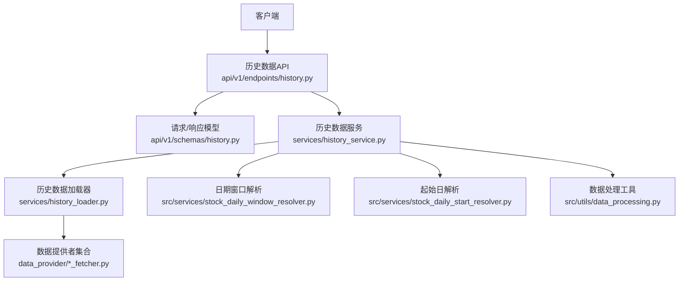
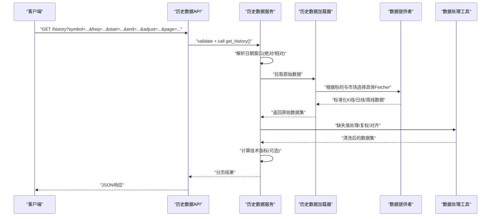
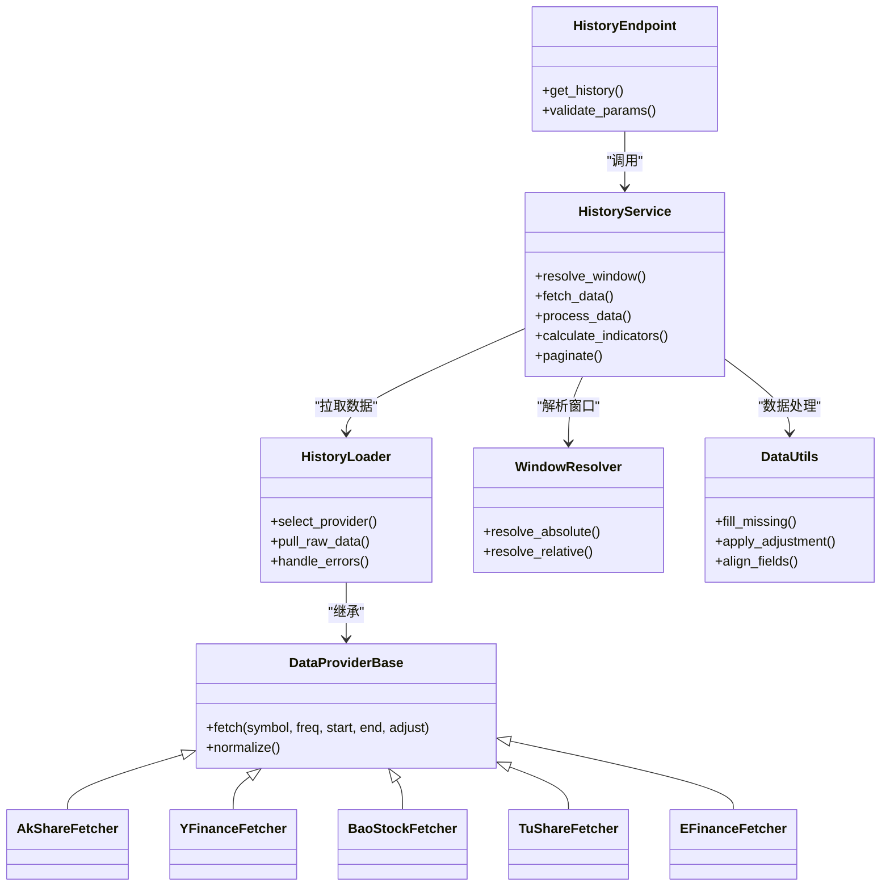

# 历史数据API

<cite>
**本文引用的文件**   
- [api/v1/endpoints/history.py](file://api/v1/endpoints/history.py)
- [api/v1/schemas/history.py](file://api/v1/schemas/history.py)
- [services/history_service.py](file://services/history_service.py)
- [services/history_loader.py](file://services/history_loader.py)
- [data_provider/base.py](file://data_provider/base.py)
- [data_provider/akshare_fetcher.py](file://data_provider/akshare_fetcher.py)
- [data_provider/yfinance_fetcher.py](file://data_provider/yfinance_fetcher.py)
- [data_provider/baostock_fetcher.py](file://data_provider/baostock_fetcher.py)
- [data_provider/tushare_fetcher.py](file://data_provider/tushare_fetcher.py)
- [data_provider/efinance_fetcher.py](file://data_provider/efinance_fetcher.py)
- [src/services/stock_daily_window_resolver.py](file://src/services/stock_daily_window_resolver.py)
- [src/services/stock_daily_start_resolver.py](file://src/services/stock_daily_start_resolver.py)
- [src/utils/data_processing.py](file://src/utils/data_processing.py)
- [tests/test_history_loader.py](file://tests/test_history_loader.py)
- [tests/test_data_tools_daily_history_cache.py](file://tests/test_data_tools_daily_history_cache.py)
</cite>

## 目录
1. [简介](#简介)
2. [项目结构](#项目结构)
3. [核心组件](#核心组件)
4. [架构总览](#架构总览)
5. [详细组件分析](#详细组件分析)
6. [依赖关系分析](#依赖关系分析)
7. [性能考虑](#性能考虑)
8. [故障排查指南](#故障排查指南)
9. [结论](#结论)
10. [附录](#附录)

## 简介
本文件面向历史数据查询接口，覆盖K线、日线、周线等多时间周期的历史行情获取方法，详细说明时间范围筛选、数据频率设置与复权方式配置；同时给出技术指标（如均线、MACD、RSI）的历史数据计算接口说明。文档还包含大数据量分页处理与性能优化方案、数据完整性校验与缺失数据处理策略，并提供完整的数据结构定义与使用示例路径，便于前后端集成与二次开发。

## 项目结构
历史数据相关代码主要分布在以下模块：
- API层：路由与请求参数校验
- 服务层：业务编排、窗口解析、指标计算
- 数据提供者：多源拉取与标准化
- 工具层：数据处理与缓存
- 测试：覆盖率与契约验证

图表来源
- [api/v1/endpoints/history.py](file://api/v1/endpoints/history.py)
- [api/v1/schemas/history.py](file://api/v1/schemas/history.py)
- [services/history_service.py](file://services/history_service.py)
- [services/history_loader.py](file://services/history_loader.py)
- [data_provider/base.py](file://data_provider/base.py)
- [src/services/stock_daily_window_resolver.py](file://src/services/stock_daily_window_resolver.py)
- [src/services/stock_daily_start_resolver.py](file://src/services/stock_daily_start_resolver.py)
- [src/utils/data_processing.py](file://src/utils/data_processing.py)

章节来源
- [api/v1/endpoints/history.py](file://api/v1/endpoints/history.py)
- [api/v1/schemas/history.py](file://api/v1/schemas/history.py)
- [services/history_service.py](file://services/history_service.py)
- [services/history_loader.py](file://services/history_loader.py)

## 核心组件
- 历史数据API端点：负责接收请求、参数校验、调用服务层并返回统一响应格式。
- 历史数据服务：编排窗口解析、数据拉取、指标计算、结果组装与分页。
- 历史数据加载器：封装多数据源的拉取逻辑与异常处理。
- 数据提供者：对接不同市场与数据源（A股、港股、美股等），输出标准化数据结构。
- 日期窗口解析器：将相对周期（如“近N日”）或绝对起止日期转换为精确交易日区间。
- 数据处理工具：缺失值填充、复权处理、字段对齐、去重与排序。

章节来源
- [api/v1/endpoints/history.py](file://api/v1/endpoints/history.py)
- [api/v1/schemas/history.py](file://api/v1/schemas/history.py)
- [services/history_service.py](file://services/history_service.py)
- [services/history_loader.py](file://services/history_loader.py)
- [data_provider/base.py](file://data_provider/base.py)
- [src/services/stock_daily_window_resolver.py](file://src/services/stock_daily_window_resolver.py)
- [src/services/stock_daily_start_resolver.py](file://src/services/stock_daily_start_resolver.py)
- [src/utils/data_processing.py](file://src/utils/data_processing.py)

## 架构总览
历史数据查询的整体流程如下：
- 客户端发起请求，携带标的、周期、时间范围、复权方式、分页参数等。
- API层校验参数后交由服务层处理。
- 服务层解析日期窗口，选择合适的数据提供者拉取原始数据。
- 数据提供者返回标准化数据，服务层进行缺失值处理、复权、指标计算。
- 最终按分页返回给客户端。

图表来源
- [api/v1/endpoints/history.py](file://api/v1/endpoints/history.py)
- [services/history_service.py](file://services/history_service.py)
- [services/history_loader.py](file://services/history_loader.py)
- [data_provider/base.py](file://data_provider/base.py)
- [src/utils/data_processing.py](file://src/utils/data_processing.py)

## 详细组件分析

### 历史数据API端点
- 功能职责
  - 接收并校验请求参数（标的、周期、起止时间、复权方式、分页）。
  - 调用服务层获取历史数据与指标。
  - 统一错误码与响应格式。
- 关键参数
  - symbol：标的代码
  - freq：周期（日、周、月、分钟级等）
  - start/end：起止日期（支持绝对日期或相对周期）
  - adjust：复权方式（前复权、后复权、不复权）
  - page/page_size：分页参数
  - indicators：需要计算的指标列表（如MA、MACD、RSI）
- 响应结构
  - code：状态码
  - message：消息
  - data：数据体（含records、meta、indicators等）
  - pagination：分页信息（total、page、page_size、has_next）

章节来源
- [api/v1/endpoints/history.py](file://api/v1/endpoints/history.py)
- [api/v1/schemas/history.py](file://api/v1/schemas/history.py)

### 历史数据服务
- 功能职责
  - 解析日期窗口（绝对起止或相对N日/N周/N月）。
  - 调度加载器拉取数据。
  - 执行缺失值处理、复权、字段对齐。
  - 按需计算技术指标并合并到结果集。
  - 分页裁剪与返回。
- 指标计算
  - 均线（MA）、MACD、RSI等常用指标可按需启用。
  - 指标参数可配置（如MA周期、MACD快慢周期与信号线、RSI周期）。
- 数据完整性
  - 缺失值检测与填充策略（向前填充、插值、剔除）。
  - 复权一致性校验（同一标的在同一窗口内复权因子连续）。

章节来源
- [services/history_service.py](file://services/history_service.py)
- [src/services/stock_daily_window_resolver.py](file://src/services/stock_daily_window_resolver.py)
- [src/services/stock_daily_start_resolver.py](file://src/services/stock_daily_start_resolver.py)
- [src/utils/data_processing.py](file://src/utils/data_processing.py)

### 历史数据加载器
- 功能职责
  - 根据标的与市场选择合适的数据提供者。
  - 统一拉取接口与异常处理。
  - 返回标准化的数据结构（时间戳、开高低收、成交量、成交额等）。
- 数据提供者选择策略
  - A股优先：baostock、akshare、tushare、efinance等。
  - 港股/美股：yfinance等。
  - 失败回退：主源不可用时自动切换备用源。

章节来源
- [services/history_loader.py](file://services/history_loader.py)
- [data_provider/base.py](file://data_provider/base.py)
- [data_provider/akshare_fetcher.py](file://data_provider/akshare_fetcher.py)
- [data_provider/yfinance_fetcher.py](file://data_provider/yfinance_fetcher.py)
- [data_provider/baostock_fetcher.py](file://data_provider/baostock_fetcher.py)
- [data_provider/tushare_fetcher.py](file://data_provider/tushare_fetcher.py)
- [data_provider/efinance_fetcher.py](file://data_provider/efinance_fetcher.py)

### 数据提供者基类与实现
- 基类约定
  - 统一的拉取接口签名与返回结构。
  - 标准化字段命名与类型。
  - 错误码与重试策略。
- 典型实现
  - akshare_fetcher：国内A股数据，支持日/周/月频。
  - yfinance_fetcher：港股/美股数据，支持多周期。
  - baostock_fetcher：A股历史数据，稳定性高。
  - tushare_fetcher：A股基本面与行情数据。
  - efinance_fetcher：A股实时与历史数据补充。

章节来源
- [data_provider/base.py](file://data_provider/base.py)
- [data_provider/akshare_fetcher.py](file://data_provider/akshare_fetcher.py)
- [data_provider/yfinance_fetcher.py](file://data_provider/yfinance_fetcher.py)
- [data_provider/baostock_fetcher.py](file://data_provider/baostock_fetcher.py)
- [data_provider/tushare_fetcher.py](file://data_provider/tushare_fetcher.py)
- [data_provider/efinance_fetcher.py](file://data_provider/efinance_fetcher.py)

### 日期窗口解析器
- 功能职责
  - 将相对周期（如“近N日”）转换为绝对起止日期。
  - 考虑交易日历，确保起止日为有效交易日。
  - 边界条件处理（节假日、停牌日）。
- 输入输出
  - 输入：symbol、freq、relative_days或absolute_start/end。
  - 输出：标准化start_date、end_date、trading_days_count。

章节来源
- [src/services/stock_daily_window_resolver.py](file://src/services/stock_daily_window_resolver.py)
- [src/services/stock_daily_start_resolver.py](file://src/services/stock_daily_start_resolver.py)

### 数据处理工具
- 功能职责
  - 缺失值检测与填充（向前填充、线性插值、剔除）。
  - 复权处理（前复权、后复权、不复权）与一致性校验。
  - 字段对齐、去重、排序（按时间升序）。
  - 指标计算前的数据准备。

章节来源
- [src/utils/data_processing.py](file://src/utils/data_processing.py)

### 技术指标计算接口
- 支持的指标
  - 均线（MA）：支持多种周期（如5、10、20、60、120、250）。
  - MACD：快慢周期与信号线可配置。
  - RSI：周期可配置（如6、12、24）。
- 计算时机
  - 在数据清洗与复权后进行计算，保证数值准确性。
- 返回结构
  - 指标序列与原始K线数据合并，保持时间对齐。

章节来源
- [services/history_service.py](file://services/history_service.py)
- [src/utils/data_processing.py](file://src/utils/data_processing.py)

### 数据完整性校验与缺失数据处理策略
- 完整性校验
  - 检查时间序列连续性（交易日缺失）。
  - 检查关键字段（开高低收、成交量）非空。
  - 复权因子连续性校验。
- 缺失数据处理
  - 向前填充：适用于短期缺失且趋势稳定的场景。
  - 线性插值：适用于价格平滑需求。
  - 剔除：对严重缺失的片段直接丢弃。
- 复权策略
  - 前复权：适合技术分析，保持当前价格不变。
  - 后复权：适合收益统计，保持历史价格不变。
  - 不复权：原始价格，适合基本面分析。

章节来源
- [src/utils/data_processing.py](file://src/utils/data_processing.py)
- [services/history_service.py](file://services/history_service.py)

### 分页处理与大数据量优化
- 分页参数
  - page：页码（从1开始）
  - page_size：每页记录数（建议100~500）
- 优化策略
  - 服务端裁剪：在服务层按起止时间与分页裁剪数据，避免全量传输。
  - 索引优化：数据库或缓存按(symbol, freq, date)建立索引。
  - 增量更新：仅拉取新增交易日数据。
  - 并发拉取：多标的并行拉取，限制并发度避免限流。
  - 缓存命中：热点标的与周期使用本地缓存或Redis缓存。

章节来源
- [api/v1/schemas/history.py](file://api/v1/schemas/history.py)
- [services/history_service.py](file://services/history_service.py)
- [tests/test_data_tools_daily_history_cache.py](file://tests/test_data_tools_daily_history_cache.py)

### 使用示例（路径引用）
- 前端调用示例：[api/history.ts](file://apps/dsa-web/src/api/history.ts)
- 后端路由示例：[api/v1/endpoints/history.py](file://api/v1/endpoints/history.py)
- 服务层调用示例：[services/history_service.py](file://services/history_service.py)
- 数据提供者示例：[data_provider/akshare_fetcher.py](file://data_provider/akshare_fetcher.py)
- 测试用例示例：[tests/test_history_loader.py](file://tests/test_history_loader.py)

## 依赖关系分析
历史数据查询的依赖关系如下：
- API依赖Schema与服务层。
- 服务层依赖加载器、日期解析器与数据处理工具。
- 加载器依赖多个数据提供者。
- 数据提供者之间相互独立，通过基类统一接口。

图表来源
- [api/v1/endpoints/history.py](file://api/v1/endpoints/history.py)
- [services/history_service.py](file://services/history_service.py)
- [services/history_loader.py](file://services/history_loader.py)
- [data_provider/base.py](file://data_provider/base.py)
- [src/services/stock_daily_window_resolver.py](file://src/services/stock_daily_window_resolver.py)
- [src/utils/data_processing.py](file://src/utils/data_processing.py)

章节来源
- [api/v1/endpoints/history.py](file://api/v1/endpoints/history.py)
- [services/history_service.py](file://services/history_service.py)
- [services/history_loader.py](file://services/history_loader.py)
- [data_provider/base.py](file://data_provider/base.py)

## 性能考虑
- 减少全量拉取：优先使用起止时间过滤，避免拉取全量历史。
- 合理分页：page_size建议100~500，避免单次响应过大。
- 缓存策略：对热点标的与周期启用缓存，降低重复请求。
- 并发控制：限制并发拉取数量，避免触发数据源限流。
- 指标计算优化：仅在需要时计算指标，避免无谓计算。
- 数据库索引：为(symbol, freq, date)建立复合索引，提升查询效率。

## 故障排查指南
- 常见问题
  - 数据源超时或限流：检查网络与数据源配额，增加重试与回退。
  - 缺失数据过多：检查交易日历与标的状态（停牌、退市）。
  - 复权不一致：检查复权因子序列是否连续。
  - 分页异常：检查page与page_size参数合法性。
- 调试建议
  - 开启详细日志，记录拉取过程与异常堆栈。
  - 使用测试用例验证数据源连通性与数据质量。
  - 逐步缩小时间窗口定位问题。

章节来源
- [tests/test_history_loader.py](file://tests/test_history_loader.py)
- [tests/test_data_tools_daily_history_cache.py](file://tests/test_data_tools_daily_history_cache.py)

## 结论
历史数据API通过分层架构实现了灵活、稳定、高性能的历史行情查询能力。支持多周期、多数据源、指标计算与分页处理，具备完善的缺失值处理与复权策略。建议在大规模使用时结合缓存与索引优化，确保系统在高并发下的稳定性与响应速度。

## 附录
- 数据结构定义参考：[api/v1/schemas/history.py](file://api/v1/schemas/history.py)
- 使用示例参考：
  - 前端调用：[apps/dsa-web/src/api/history.ts](file://apps/dsa-web/src/api/history.ts)
  - 后端路由：[api/v1/endpoints/history.py](file://api/v1/endpoints/history.py)
  - 服务层：[services/history_service.py](file://services/history_service.py)
  - 数据提供者：[data_provider/akshare_fetcher.py](file://data_provider/akshare_fetcher.py)
  - 测试用例：[tests/test_history_loader.py](file://tests/test_history_loader.py)