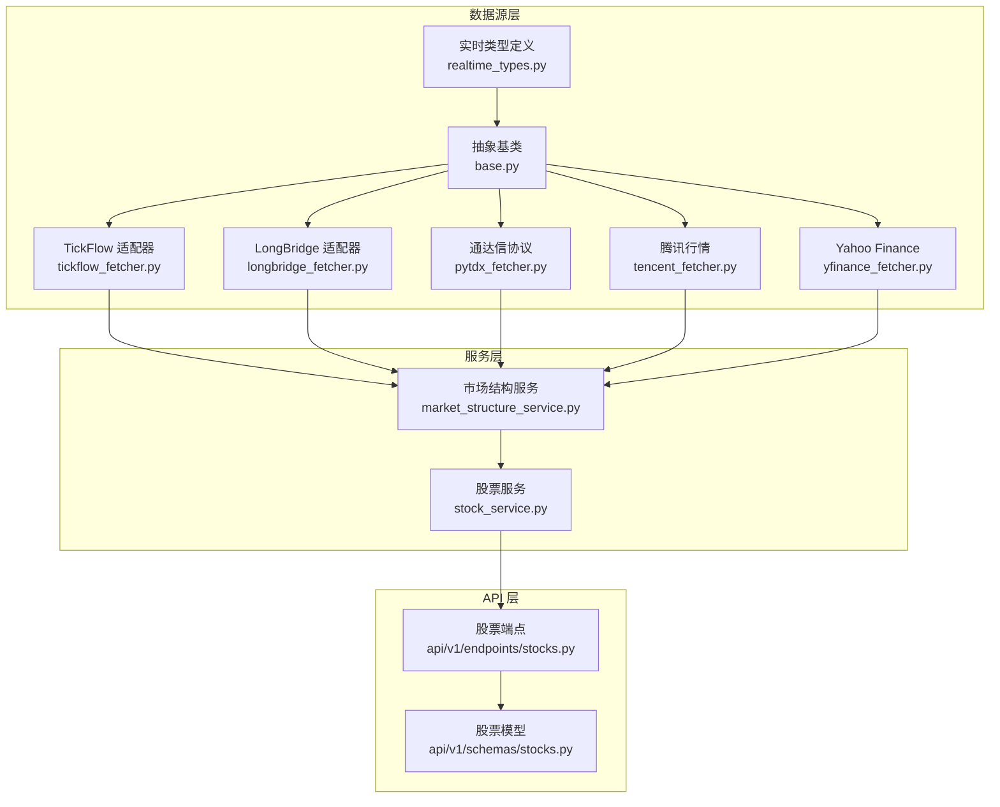
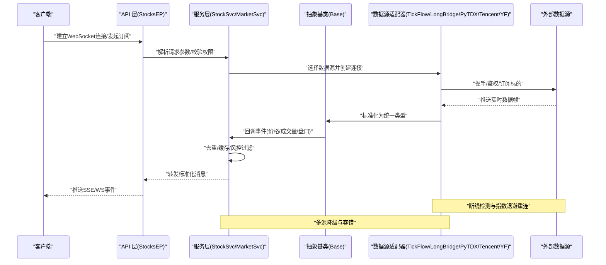
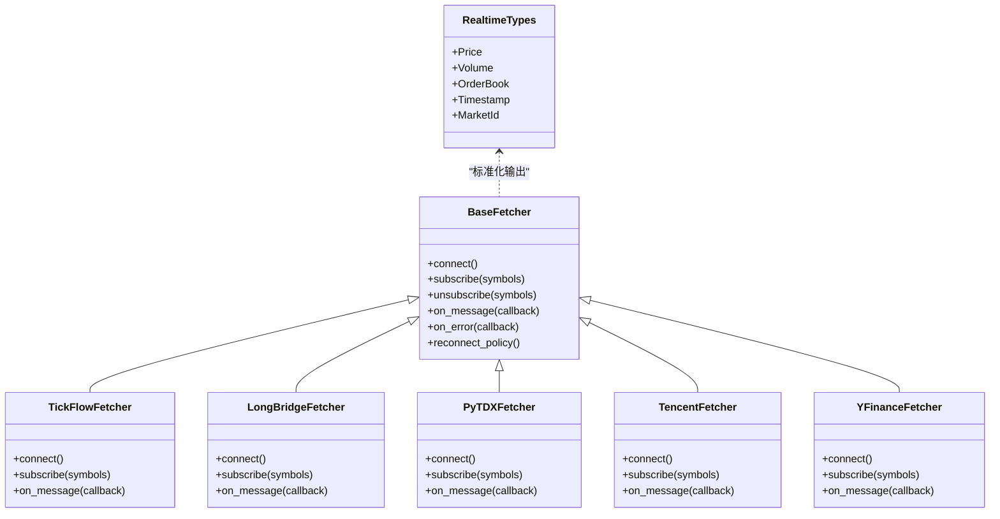
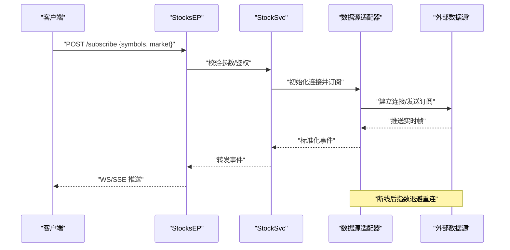
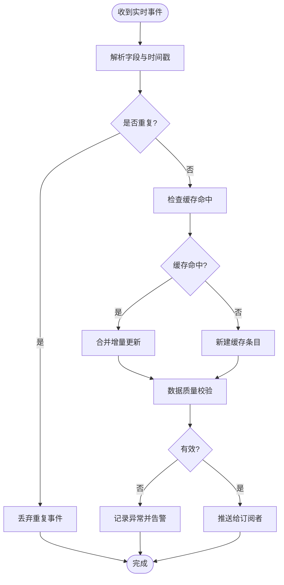
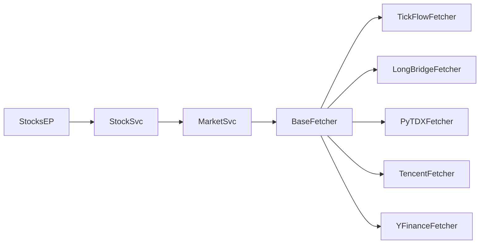

# 实时行情数据API

<cite>
**本文档引用的文件**   
- [data_provider/realtime_types.py](file://data_provider/realtime_types.py)
- [data_provider/base.py](file://data_provider/base.py)
- [data_provider/tickflow_fetcher.py](file://data_provider/tickflow_fetcher.py)
- [data_provider/longbridge_fetcher.py](file://data_provider/longbridge_fetcher.py)
- [data_provider/pytdx_fetcher.py](file://data_provider/pytdx_fetcher.py)
- [data_provider/tencent_fetcher.py](file://data_provider/tencent_fetcher.py)
- [data_provider/yfinance_fetcher.py](file://data_provider/yfinance_fetcher.py)
- [api/v1/endpoints/stocks.py](file://api/v1/endpoints/stocks.py)
- [api/v1/schemas/stocks.py](file://api/v1/schemas/stocks.py)
- [src/services/market_structure_service.py](file://src/services/market_structure_service.py)
- [src/services/stock_service.py](file://src/services/stock_service.py)
- [tests/test_realtime_quote_fallback_logging.py](file://tests/test_realtime_quote_fallback_logging.py)
- [tests/test_longbridge_fetcher.py](file://tests/test_longbridge_fetcher.py)
- [tests/test_tencent_fetcher.py](file://tests/test_tencent_fetcher.py)
- [tests/test_tickflow_manager_routing.py](file://tests/test_tickflow_manager_routing.py)
</cite>

## 目录
1. [简介](#简介)
2. [项目结构](#项目结构)
3. [核心组件](#核心组件)
4. [架构总览](#架构总览)
5. [详细组件分析](#详细组件分析)
6. [依赖关系分析](#依赖关系分析)
7. [性能考量](#性能考量)
8. [故障排查指南](#故障排查指南)
9. [结论](#结论)
10. [附录](#附录)

## 简介
本文件面向需要接入或扩展“实时行情数据接口”的开发者与运维人员，系统性地说明如何获取实时价格、成交量、买卖盘口等市场数据。内容覆盖：
- WebSocket 连接建立、消息格式与事件类型
- 实时数据订阅、取消订阅与重连机制
- 多市场支持（A股、港股、美股）的数据格式差异与处理策略
- 实时数据缓存、去重与异常处理的实现要点
- 性能监控与调试工具使用指南

本仓库采用分层设计：数据源抽象层（Fetcher）、统一类型定义、服务编排层（Service）、API 暴露层（FastAPI），以及测试与文档支撑。

## 项目结构
围绕实时行情的关键代码分布在以下模块：
- data_provider：各数据源的 Fetcher 实现与统一类型定义
- api/v1：REST/SSE/WS 端点与请求响应模型
- src/services：业务编排与服务能力封装
- tests：针对实时行情与数据源的专项测试

图表来源
- [data_provider/realtime_types.py](file://data_provider/realtime_types.py)
- [data_provider/base.py](file://data_provider/base.py)
- [data_provider/tickflow_fetcher.py](file://data_provider/tickflow_fetcher.py)
- [data_provider/longbridge_fetcher.py](file://data_provider/longbridge_fetcher.py)
- [data_provider/pytdx_fetcher.py](file://data_provider/pytdx_fetcher.py)
- [data_provider/tencent_fetcher.py](file://data_provider/tencent_fetcher.py)
- [data_provider/yfinance_fetcher.py](file://data_provider/yfinance_fetcher.py)
- [src/services/market_structure_service.py](file://src/services/market_structure_service.py)
- [src/services/stock_service.py](file://src/services/stock_service.py)
- [api/v1/endpoints/stocks.py](file://api/v1/endpoints/stocks.py)
- [api/v1/schemas/stocks.py](file://api/v1/schemas/stocks.py)

章节来源
- [data_provider/realtime_types.py](file://data_provider/realtime_types.py)
- [data_provider/base.py](file://data_provider/base.py)
- [data_provider/tickflow_fetcher.py](file://data_provider/tickflow_fetcher.py)
- [data_provider/longbridge_fetcher.py](file://data_provider/longbridge_fetcher.py)
- [data_provider/pytdx_fetcher.py](file://data_provider/pytdx_fetcher.py)
- [data_provider/tencent_fetcher.py](file://data_provider/tencent_fetcher.py)
- [data_provider/yfinance_fetcher.py](file://data_provider/yfinance_fetcher.py)
- [src/services/market_structure_service.py](file://src/services/market_structure_service.py)
- [src/services/stock_service.py](file://src/services/stock_service.py)
- [api/v1/endpoints/stocks.py](file://api/v1/endpoints/stocks.py)
- [api/v1/schemas/stocks.py](file://api/v1/schemas/stocks.py)

## 核心组件
- 实时类型定义：集中定义实时报价、盘口、成交等数据结构，确保跨数据源一致性
- 抽象基类：定义统一的订阅/取消订阅、重连、错误处理、消息分发接口
- 数据源适配器：分别对接不同渠道（TickFlow、LongBridge、通达信、腾讯、Yahoo Finance），将原始数据标准化为统一类型
- 服务编排：聚合多个数据源，提供路由、降级、缓存、去重与一致性保障
- API 暴露：通过 FastAPI 暴露 REST/SSE/WS 接口，供前端或下游系统消费

章节来源
- [data_provider/realtime_types.py](file://data_provider/realtime_types.py)
- [data_provider/base.py](file://data_provider/base.py)
- [data_provider/tickflow_fetcher.py](file://data_provider/tickflow_fetcher.py)
- [data_provider/longbridge_fetcher.py](file://data_provider/longbridge_fetcher.py)
- [data_provider/pytdx_fetcher.py](file://data_provider/pytdx_fetcher.py)
- [data_provider/tencent_fetcher.py](file://data_provider/tencent_fetcher.py)
- [data_provider/yfinance_fetcher.py](file://data_provider/yfinance_fetcher.py)
- [src/services/market_structure_service.py](file://src/services/market_structure_service.py)
- [src/services/stock_service.py](file://src/services/stock_service.py)
- [api/v1/endpoints/stocks.py](file://api/v1/endpoints/stocks.py)
- [api/v1/schemas/stocks.py](file://api/v1/schemas/stocks.py)

## 架构总览
下图展示从客户端到数据源的端到端流程，包括连接建立、订阅、消息推送、去重与缓存、以及异常与重连处理。

图表来源
- [api/v1/endpoints/stocks.py](file://api/v1/endpoints/stocks.py)
- [src/services/stock_service.py](file://src/services/stock_service.py)
- [src/services/market_structure_service.py](file://src/services/market_structure_service.py)
- [data_provider/base.py](file://data_provider/base.py)
- [data_provider/tickflow_fetcher.py](file://data_provider/tickflow_fetcher.py)
- [data_provider/longbridge_fetcher.py](file://data_provider/longbridge_fetcher.py)
- [data_provider/pytdx_fetcher.py](file://data_provider/pytdx_fetcher.py)
- [data_provider/tencent_fetcher.py](file://data_provider/tencent_fetcher.py)
- [data_provider/yfinance_fetcher.py](file://data_provider/yfinance_fetcher.py)

## 详细组件分析

### 实时类型定义与统一模型
- 目标：对价格、成交量、买卖盘口、时间戳、市场标识等进行统一建模，屏蔽底层数据源差异
- 关键点：字段命名一致、数值精度规范、时区与时间戳格式统一、缺失值处理策略

章节来源
- [data_provider/realtime_types.py](file://data_provider/realtime_types.py)

### 抽象基类与通用行为
- 目标：定义所有数据源适配器的公共接口与默认实现
- 关键点：
  - 连接生命周期管理（建立、心跳、断开）
  - 订阅/取消订阅的统一方法
  - 事件回调与错误上报
  - 重试与退避策略模板
  - 日志与指标埋点入口

章节来源
- [data_provider/base.py](file://data_provider/base.py)

### 数据源适配器：TickFlow
- 目标：通过 TickFlow 通道拉取实时行情，适用于多市场统一接入
- 关键点：
  - 连接池与会话复用
  - 消息分片与乱序处理
  - 按市场路由与编码转换
  - 失败回退至其他数据源

章节来源
- [data_provider/tickflow_fetcher.py](file://data_provider/tickflow_fetcher.py)
- [tests/test_tickflow_manager_routing.py](file://tests/test_tickflow_manager_routing.py)

### 数据源适配器：LongBridge
- 目标：基于 LongBridge SDK 获取实时行情，适合港股与部分美股
- 关键点：
  - 授权与订阅主题配置
  - 盘口深度与逐笔成交处理
  - 网络异常与限流处理
  - 本地缓存与增量更新

章节来源
- [data_provider/longbridge_fetcher.py](file://data_provider/longbridge_fetcher.py)
- [tests/test_longbridge_fetcher.py](file://tests/test_longbridge_fetcher.py)

### 数据源适配器：通达信（PyTDX）
- 目标：通过通达信协议获取 A 股实时行情
- 关键点：
  - 服务器列表与轮询
  - 协议封包与解码
  - 盘口五档/十档解析
  - 超时与断线重连

章节来源
- [data_provider/pytdx_fetcher.py](file://data_provider/pytdx_fetcher.py)

### 数据源适配器：腾讯行情
- 目标：通过腾讯行情接口获取 A 股/港股实时数据
- 关键点：
  - 批量请求与分页
  - 字段映射与单位换算
  - 反爬限制与频率控制
  - 数据质量校验

章节来源
- [data_provider/tencent_fetcher.py](file://data_provider/tencent_fetcher.py)
- [tests/test_tencent_fetcher.py](file://tests/test_tencent_fetcher.py)

### 数据源适配器：Yahoo Finance
- 目标：通过 Yahoo Finance 获取美股与部分国际指数实时数据
- 关键点：
  - 符号映射与地区后缀
  - 延迟与快照模式
  - 错误码与重试策略
  - 数据清洗与去噪

章节来源
- [data_provider/yfinance_fetcher.py](file://data_provider/yfinance_fetcher.py)

### 服务编排：市场结构与股票服务
- 目标：聚合多数据源，提供路由、降级、缓存、去重与一致性保障
- 关键点：
  - 市场识别与路由表（A股/港股/美股）
  - 优先级与权重配置
  - 缓存键设计与过期策略
  - 去重规则（时间戳+序列号）
  - 异常分类与告警

章节来源
- [src/services/market_structure_service.py](file://src/services/market_structure_service.py)
- [src/services/stock_service.py](file://src/services/stock_service.py)

### API 暴露：股票端点与模型
- 目标：对外暴露实时行情查询与订阅接口
- 关键点：
  - REST 查询最新快照
  - SSE/WS 推送实时事件
  - 请求参数校验与限流
  - 响应模型规范化

章节来源
- [api/v1/endpoints/stocks.py](file://api/v1/endpoints/stocks.py)
- [api/v1/schemas/stocks.py](file://api/v1/schemas/stocks.py)

#### 对象关系图（类与继承）

图表来源
- [data_provider/realtime_types.py](file://data_provider/realtime_types.py)
- [data_provider/base.py](file://data_provider/base.py)
- [data_provider/tickflow_fetcher.py](file://data_provider/tickflow_fetcher.py)
- [data_provider/longbridge_fetcher.py](file://data_provider/longbridge_fetcher.py)
- [data_provider/pytdx_fetcher.py](file://data_provider/pytdx_fetcher.py)
- [data_provider/tencent_fetcher.py](file://data_provider/tencent_fetcher.py)
- [data_provider/yfinance_fetcher.py](file://data_provider/yfinance_fetcher.py)

#### 订阅与推送时序（以 WS/SSE 为例）

图表来源
- [api/v1/endpoints/stocks.py](file://api/v1/endpoints/stocks.py)
- [src/services/stock_service.py](file://src/services/stock_service.py)
- [data_provider/base.py](file://data_provider/base.py)

#### 复杂逻辑流程图（去重与缓存）

图表来源
- [src/services/market_structure_service.py](file://src/services/market_structure_service.py)
- [src/services/stock_service.py](file://src/services/stock_service.py)

## 依赖关系分析
- 低耦合：数据源适配器通过抽象基类解耦，便于替换与扩展
- 高内聚：每个适配器聚焦单一数据源的实现细节
- 服务编排：市场结构与股票服务负责路由、降级与一致性
- API 层：仅关注请求解析、鉴权与响应序列化

图表来源
- [api/v1/endpoints/stocks.py](file://api/v1/endpoints/stocks.py)
- [src/services/stock_service.py](file://src/services/stock_service.py)
- [src/services/market_structure_service.py](file://src/services/market_structure_service.py)
- [data_provider/base.py](file://data_provider/base.py)
- [data_provider/tickflow_fetcher.py](file://data_provider/tickflow_fetcher.py)
- [data_provider/longbridge_fetcher.py](file://data_provider/longbridge_fetcher.py)
- [data_provider/pytdx_fetcher.py](file://data_provider/pytdx_fetcher.py)
- [data_provider/tencent_fetcher.py](file://data_provider/tencent_fetcher.py)
- [data_provider/yfinance_fetcher.py](file://data_provider/yfinance_fetcher.py)

章节来源
- [api/v1/endpoints/stocks.py](file://api/v1/endpoints/stocks.py)
- [src/services/stock_service.py](file://src/services/stock_service.py)
- [src/services/market_structure_service.py](file://src/services/market_structure_service.py)
- [data_provider/base.py](file://data_provider/base.py)

## 性能考量
- 连接复用与池化：减少握手开销，提升吞吐
- 批量订阅与合并推送：降低网络与序列化成本
- 内存缓存与过期策略：避免重复计算与频繁 IO
- 去重与乱序处理：保证事件顺序性与一致性
- 背压与限流：防止下游过载
- 异步 I/O：提高并发处理能力
- 指标与追踪：关键路径埋点，便于定位瓶颈

[本节为通用指导，不直接分析具体文件]

## 故障排查指南
- 常见问题
  - 连接失败：检查网络、鉴权、端口与防火墙
  - 订阅无数据：确认标的代码与市场前缀、交易所状态
  - 数据延迟：检查数据源限速、队列堆积与消费者速度
  - 数据不一致：核对去重键、时间戳与时区
  - 频繁重连：检查退避策略与上游稳定性
- 诊断步骤
  - 启用详细日志与链路追踪
  - 查看适配器健康检查与指标
  - 回放历史事件，复现场景
  - 切换备用数据源验证
- 参考测试用例
  - 实时行情降级与日志记录
  - 特定数据源连通性测试

章节来源
- [tests/test_realtime_quote_fallback_logging.py](file://tests/test_realtime_quote_fallback_logging.py)
- [tests/test_longbridge_fetcher.py](file://tests/test_longbridge_fetcher.py)
- [tests/test_tencent_fetcher.py](file://tests/test_tencent_fetcher.py)
- [tests/test_tickflow_manager_routing.py](file://tests/test_tickflow_manager_routing.py)

## 结论
本方案通过统一类型定义与抽象基类，将多数据源的实时行情接入标准化；服务编排层提供路由、降级、缓存与去重能力；API 层暴露简洁易用的接口。整体架构具备高可扩展性与强容错性，可稳定支撑 A 股、港股、美股等多市场的实时数据需求。

[本节为总结性内容，不直接分析具体文件]

## 附录
- 术语表
  - 实时行情：价格、成交量、买卖盘口等高频数据
  - 订阅：客户端请求接收某标的的实时数据流
  - 去重：基于时间戳与序列号消除重复事件
  - 降级：主数据源不可用时自动切换到备用源
- 最佳实践
  - 合理设置缓存过期与去重窗口
  - 使用指数退避与最大重试次数
  - 对关键路径进行指标采集与告警
  - 定期演练故障切换与恢复流程

[本节为补充信息，不直接分析具体文件]