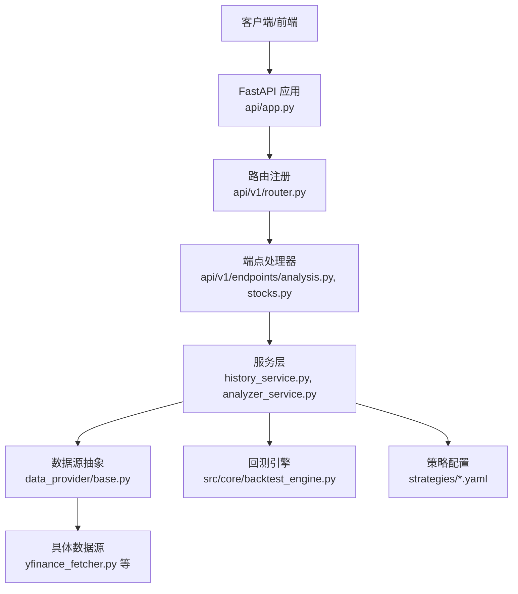
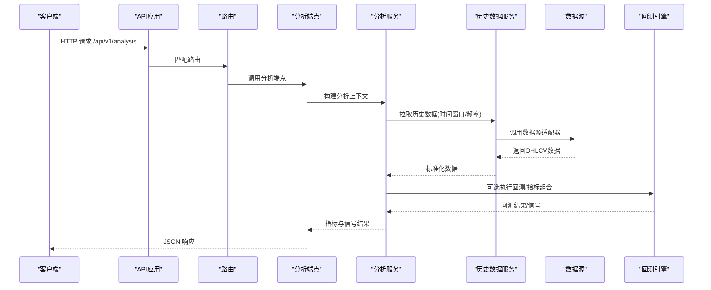
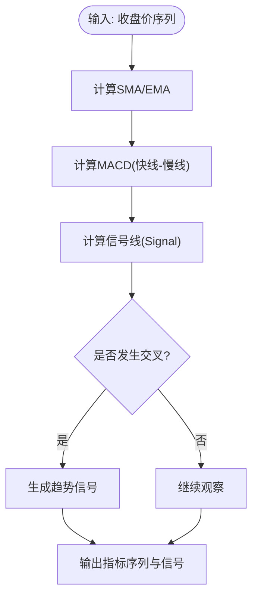
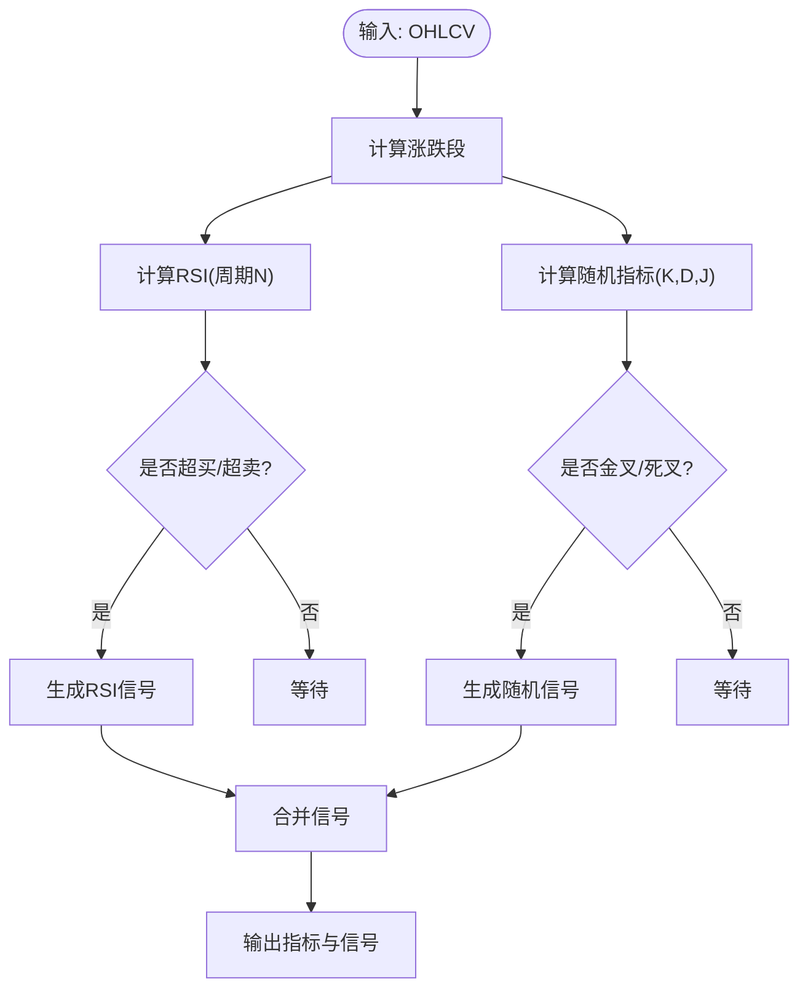
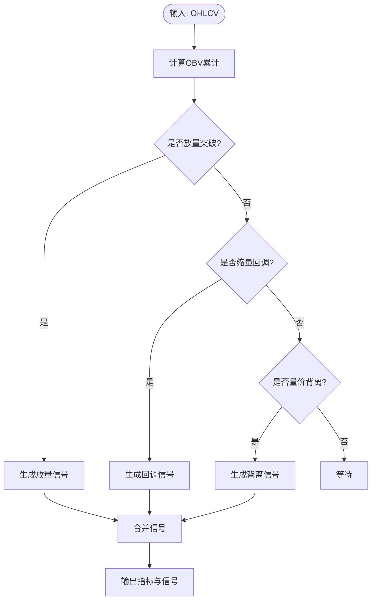
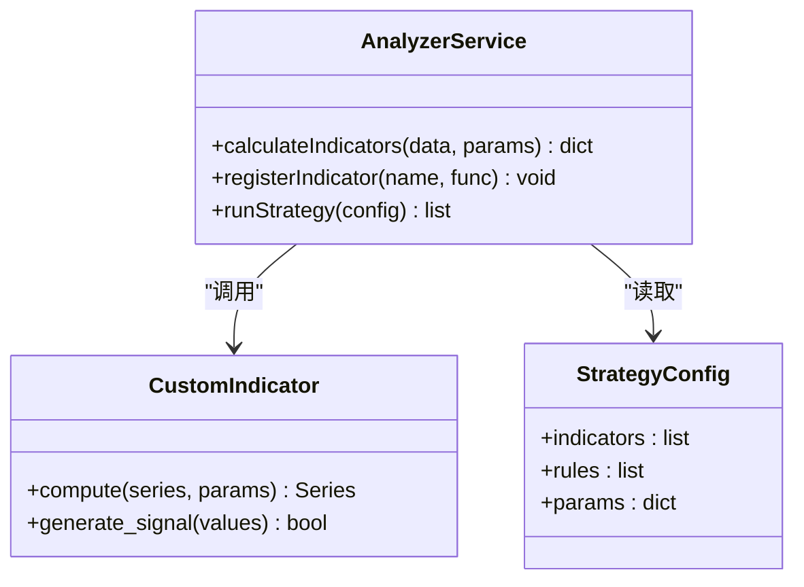
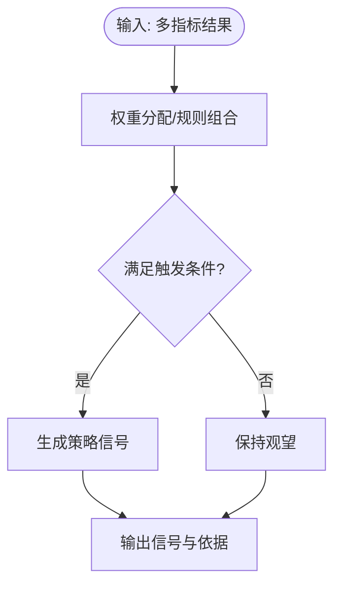
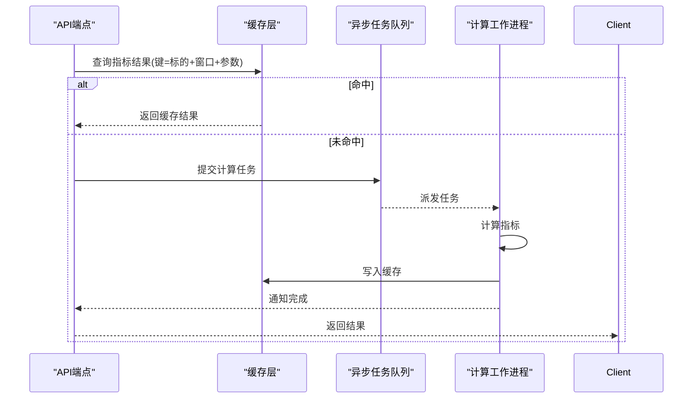
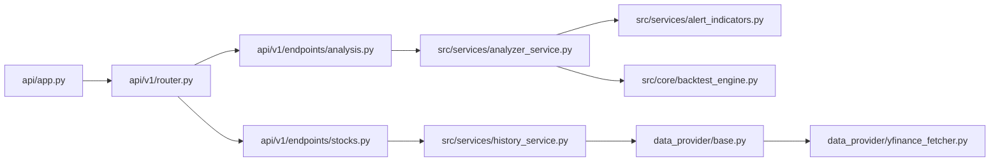

# 技术指标API

<cite>
**本文档引用的文件**   
- [main.py](file://main.py)
- [server.py](file://server.py)
- [api/app.py](file://api/app.py)
- [api/v1/router.py](file://api/v1/router.py)
- [api/v1/endpoints/analysis.py](file://api/v1/endpoints/analysis.py)
- [api/v1/endpoints/stocks.py](file://api/v1/endpoints/stocks.py)
- [api/v1/schemas/analysis.py](file://api/v1/schemas/analysis.py)
- [api/v1/schemas/stocks.py](file://api/v1/schemas/stocks.py)
- [src/services/history_service.py](file://src/services/history_service.py)
- [src/services/alert_indicators.py](file://src/services/alert_indicators.py)
- [src/services/analyzer_service.py](file://src/services/analyzer_service.py)
- [src/core/backtest_engine.py](file://src/core/backtest_engine.py)
- [data_provider/base.py](file://data_provider/base.py)
- [data_provider/yfinance_fetcher.py](file://data_provider/yfinance_fetcher.py)
- [strategies/ma_golden_cross.yaml](file://strategies/ma_golden_cross.yaml)
- [strategies/bottom_volume.yaml](file://strategies/bottom_volume.yaml)
- [tests/test_stock_analyzer_rsi.py](file://tests/test_stock_analyzer_rsi.py)
</cite>

## 目录
1. [简介](#简介)
2. [项目结构](#项目结构)
3. [核心组件](#核心组件)
4. [架构总览](#架构总览)
5. [详细组件分析](#详细组件分析)
6. [依赖关系分析](#依赖关系分析)
7. [性能考虑](#性能考虑)
8. [故障排查指南](#故障排查指南)
9. [结论](#结论)
10. [附录](#附录)

## 简介
本文件面向“技术指标API”的使用与扩展，覆盖趋势指标、震荡指标、成交量指标等常见技术分析类别；说明接口参数、返回数据格式、图表集成方式；提供自定义指标开发接口与扩展机制；阐述多指标组合策略信号生成方法；并给出异步处理与结果缓存策略建议。文档同时包含常见分析方法的使用示例与参数调优建议，帮助读者快速上手与深入应用。

## 项目结构
本项目采用分层架构：API层暴露REST接口，服务层封装业务逻辑（历史数据加载、指标计算、回测引擎），数据源层对接多种行情获取器，前端通过HTTP调用API进行可视化展示。关键路径包括：
- API路由与端点定义：api/v1/router.py、api/v1/endpoints/*
- 请求/响应模型：api/v1/schemas/*
- 历史数据与服务：src/services/history_service.py、src/services/analyzer_service.py
- 数据源抽象与实现：data_provider/base.py、data_provider/*_fetcher.py
- 回测与策略：src/core/backtest_engine.py、strategies/*.yaml

**图示来源** 
- [api/app.py](file://api/app.py)
- [api/v1/router.py](file://api/v1/router.py)
- [api/v1/endpoints/analysis.py](file://api/v1/endpoints/analysis.py)
- [api/v1/endpoints/stocks.py](file://api/v1/endpoints/stocks.py)
- [src/services/history_service.py](file://src/services/history_service.py)
- [src/services/analyzer_service.py](file://src/services/analyzer_service.py)
- [data_provider/base.py](file://data_provider/base.py)
- [data_provider/yfinance_fetcher.py](file://data_provider/yfinance_fetcher.py)
- [src/core/backtest_engine.py](file://src/core/backtest_engine.py)
- [strategies/ma_golden_cross.yaml](file://strategies/ma_golden_cross.yaml)

**章节来源**
- [api/v1/router.py](file://api/v1/router.py)
- [api/app.py](file://api/app.py)

## 核心组件
- 历史数据服务：负责按时间窗口拉取日K线或分钟级数据，统一清洗与对齐，供指标计算使用。
- 分析服务：聚合多种技术分析与市场上下文，输出结构化结果，便于前端渲染。
- 指标告警服务：基于阈值与形态触发预警，支持多指标组合规则。
- 回测引擎：执行策略回放，统计收益、回撤、胜率等指标，辅助参数调优。
- 数据源抽象：统一不同数据提供商的接口，屏蔽差异。

**章节来源**
- [src/services/history_service.py](file://src/services/history_service.py)
- [src/services/analyzer_service.py](file://src/services/analyzer_service.py)
- [src/services/alert_indicators.py](file://src/services/alert_indicators.py)
- [src/core/backtest_engine.py](file://src/core/backtest_engine.py)
- [data_provider/base.py](file://data_provider/base.py)

## 架构总览
系统以FastAPI为核心，路由将请求分发到各端点，端点调用服务层完成数据拉取与指标计算，最终返回标准化JSON。指标计算可结合回测引擎进行策略验证，并通过策略配置文件驱动。

**图示来源** 
- [api/v1/endpoints/analysis.py](file://api/v1/endpoints/analysis.py)
- [src/services/analyzer_service.py](file://src/services/analyzer_service.py)
- [src/services/history_service.py](file://src/services/history_service.py)
- [data_provider/base.py](file://data_provider/base.py)
- [src/core/backtest_engine.py](file://src/core/backtest_engine.py)

## 详细组件分析

### 趋势指标（移动平均线、MACD等）
- 计算方法：对收盘价序列进行平滑处理，如简单移动平均（SMA）、指数移动平均（EMA），以及MACD的快慢线差值与信号线。
- 参数配置：周期长度（如MA5/MA10/MA20）、平滑系数（EMA alpha）、MACD快慢周期与信号周期。
- 可视化：折线图叠加在价格图上，标注金叉/死叉位置。
- 策略信号：均线交叉、价格相对均线位置、MACD柱状图方向变化。

**图示来源** 
- [src/services/analyzer_service.py](file://src/services/analyzer_service.py)
- [src/core/backtest_engine.py](file://src/core/backtest_engine.py)

**章节来源**
- [src/services/analyzer_service.py](file://src/services/analyzer_service.py)
- [src/core/backtest_engine.py](file://src/core/backtest_engine.py)

### 震荡指标（RSI、随机指标等）
- 计算方法：RSI基于上涨/下跌幅度加权平均；随机指标基于区间内最高/最低价与当前价比较。
- 参数配置：RSI周期（如14）、随机指标K/D周期（如14,3,3）。
- 可视化：0-100区间折线，超买/超卖区域着色。
- 策略信号：RSI突破阈值、随机指标金叉/死叉。

**图示来源** 
- [tests/test_stock_analyzer_rsi.py](file://tests/test_stock_analyzer_rsi.py)
- [src/services/analyzer_service.py](file://src/services/analyzer_service.py)

**章节来源**
- [tests/test_stock_analyzer_rsi.py](file://tests/test_stock_analyzer_rsi.py)
- [src/services/analyzer_service.py](file://src/services/analyzer_service.py)

### 成交量指标（OBV、量价背离等）
- 计算方法：OBV累计成交量随价格方向增减；量价背离检测价格与成交量的不一致性。
- 参数配置：OBV滚动窗口、背离检测阈值。
- 可视化：成交量柱状图叠加OBV曲线。
- 策略信号：放量突破、缩量回调、量价背离反转。

**图示来源** 
- [src/services/analyzer_service.py](file://src/services/analyzer_service.py)

**章节来源**
- [src/services/analyzer_service.py](file://src/services/analyzer_service.py)

### 自定义技术指标开发接口与扩展机制
- 接口设计：通过服务层暴露统一的指标计算入口，允许注册自定义指标函数，传入OHLCV与参数后返回指标序列与信号。
- 扩展机制：新增指标类或函数，注册到分析服务；策略配置文件（YAML）描述指标组合与触发条件。
- 最佳实践：指标计算需具备幂等性与稳定性，避免对外部状态依赖；返回值应包含时间戳、数值与信号标记。

**图示来源** 
- [src/services/analyzer_service.py](file://src/services/analyzer_service.py)
- [strategies/ma_golden_cross.yaml](file://strategies/ma_golden_cross.yaml)
- [strategies/bottom_volume.yaml](file://strategies/bottom_volume.yaml)

**章节来源**
- [src/services/analyzer_service.py](file://src/services/analyzer_service.py)
- [strategies/ma_golden_cross.yaml](file://strategies/ma_golden_cross.yaml)
- [strategies/bottom_volume.yaml](file://strategies/bottom_volume.yaml)

### 多指标组合分析的策略信号生成
- 组合方式：将趋势、震荡、成交量指标的结果进行加权或逻辑组合，形成综合信号。
- 触发条件：基于阈值、交叉、背离等规则，支持AND/OR组合。
- 输出：信号类型（买入/卖出/观望）、置信度、依据指标列表。

**图示来源** 
- [src/core/backtest_engine.py](file://src/core/backtest_engine.py)
- [strategies/ma_golden_cross.yaml](file://strategies/ma_golden_cross.yaml)

**章节来源**
- [src/core/backtest_engine.py](file://src/core/backtest_engine.py)
- [strategies/ma_golden_cross.yaml](file://strategies/ma_golden_cross.yaml)

### 指标计算的异步处理与结果缓存策略
- 异步处理：对于长耗时指标计算或批量拉取历史数据，建议使用异步任务队列（如Celery/RQ）或协程池，避免阻塞API线程。
- 缓存策略：对常用指标结果按“标的+时间窗口+参数”键进行缓存（内存或Redis），设置合理TTL；增量更新时仅刷新受影响片段。
- 一致性：缓存失效时需保证数据版本一致，避免脏读。

[此图为概念流程，不直接映射具体源码文件]

## 依赖关系分析
- API层依赖路由与端点，端点依赖服务层；服务层依赖数据源抽象与具体实现；回测引擎与策略配置为可选增强。
- 数据源抽象确保多提供商兼容，降低耦合。

**图示来源** 
- [api/app.py](file://api/app.py)
- [api/v1/router.py](file://api/v1/router.py)
- [api/v1/endpoints/analysis.py](file://api/v1/endpoints/analysis.py)
- [api/v1/endpoints/stocks.py](file://api/v1/endpoints/stocks.py)
- [src/services/analyzer_service.py](file://src/services/analyzer_service.py)
- [src/services/history_service.py](file://src/services/history_service.py)
- [src/services/alert_indicators.py](file://src/services/alert_indicators.py)
- [src/core/backtest_engine.py](file://src/core/backtest_engine.py)
- [data_provider/base.py](file://data_provider/base.py)
- [data_provider/yfinance_fetcher.py](file://data_provider/yfinance_fetcher.py)

**章节来源**
- [api/v1/router.py](file://api/v1/router.py)
- [api/v1/endpoints/analysis.py](file://api/v1/endpoints/analysis.py)
- [api/v1/endpoints/stocks.py](file://api/v1/endpoints/stocks.py)
- [src/services/analyzer_service.py](file://src/services/analyzer_service.py)
- [src/services/history_service.py](file://src/services/history_service.py)
- [data_provider/base.py](file://data_provider/base.py)
- [data_provider/yfinance_fetcher.py](file://data_provider/yfinance_fetcher.py)

## 性能考虑
- 数据拉取优化：批量请求、分页拉取、连接池复用；优先选择稳定低延迟的数据源。
- 指标计算优化：向量化计算（如NumPy/Pandas）、滑动窗口预计算、增量更新。
- 缓存命中率：合理划分缓存键粒度，避免过大对象；热点指标优先缓存。
- 并发控制：限制并发任务数，防止资源争用；监控队列积压与超时。

[本节为通用指导，不直接分析具体文件]

## 故障排查指南
- 数据源异常：检查网络连通性、认证密钥、限流策略；记录错误日志与重试次数。
- 指标计算错误：校验输入数据完整性（缺失值、异常值）；确认参数范围与类型。
- 缓存问题：清理过期键、检查TTL设置；验证缓存写入与读取一致性。
- 回测失败：核对策略配置语法与字段；检查历史数据时间对齐与复权处理。

**章节来源**
- [src/services/history_service.py](file://src/services/history_service.py)
- [src/services/analyzer_service.py](file://src/services/analyzer_service.py)
- [src/core/backtest_engine.py](file://src/core/backtest_engine.py)

## 结论
本API体系提供了完善的技术指标计算与可视化能力，支持趋势、震荡、成交量等多类指标，并通过策略配置与回测引擎实现组合分析与参数调优。建议在生产环境中引入异步任务与缓存机制以提升性能与稳定性。开发者可通过扩展接口轻松添加自定义指标与策略，满足多样化分析需求。

[本节为总结，不直接分析具体文件]

## 附录
- 常见使用方法示例：
  - 趋势指标：设置MA周期与EMA平滑系数，观察金叉/死叉信号。
  - 震荡指标：RSI周期设为14，关注超买超卖区域。
  - 成交量指标：OBV配合价格突破，识别放量信号。
- 参数调优建议：
  - 根据标的波动特性调整周期长度；短周期更敏感但噪声大，长周期更稳健但滞后。
  - 结合回测评估夏普比率、最大回撤与胜率，平衡风险与收益。
- 图表集成方式：
  - 前端接收JSON数组，包含时间戳、指标值与信号标记；使用折线图、柱状图与标注绘制。
  - 支持多图层叠加（价格、均线、OBV、RSI等），并提供交互筛选。

[本节为补充信息，不直接分析具体文件]