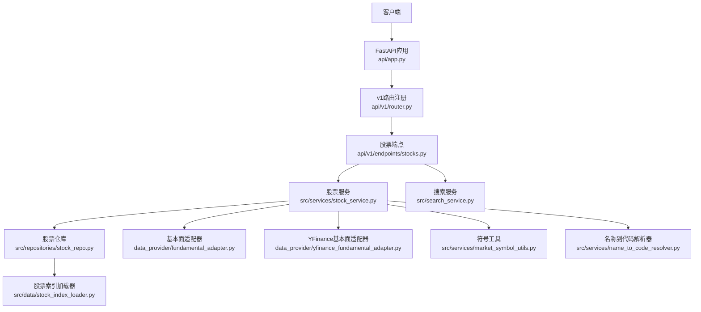
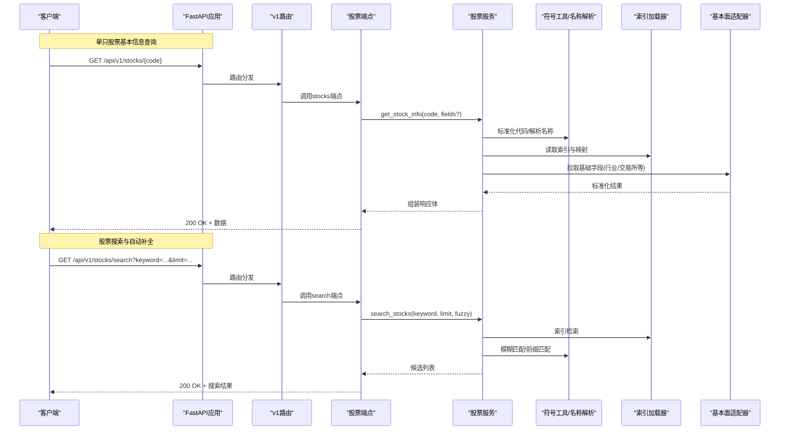
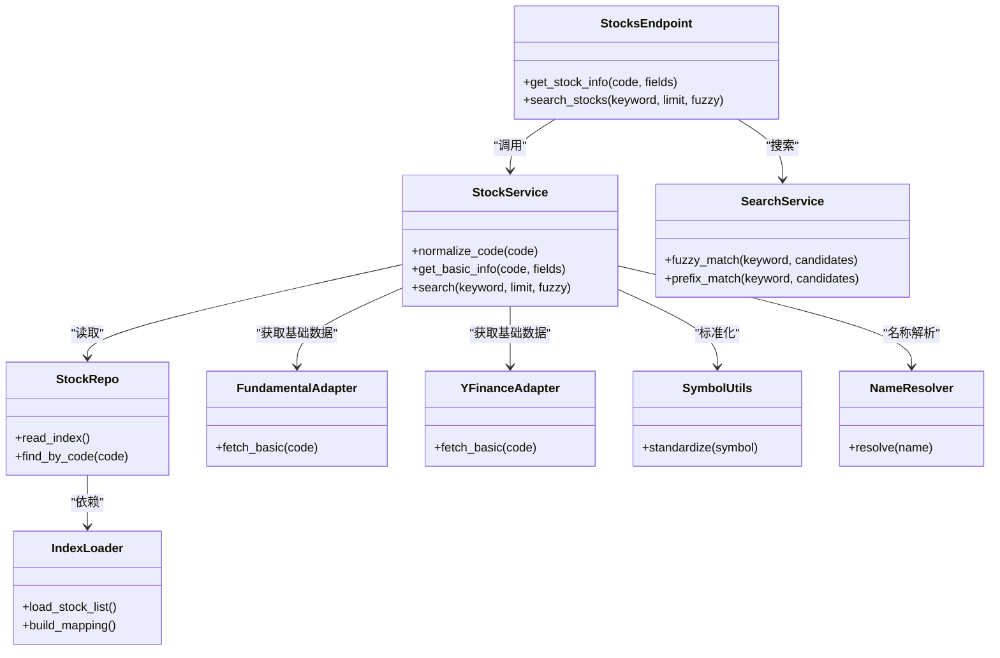

# 股票基本信息API

<cite>
**本文档引用的文件**   
- [api/v1/endpoints/stocks.py](file://api/v1/endpoints/stocks.py)
- [api/v1/schemas/stocks.py](file://api/v1/schemas/stocks.py)
- [api/v1/router.py](file://api/v1/router.py)
- [src/services/stock_service.py](file://src/services/stock_service.py)
- [src/data/stock_index_loader.py](file://src/data/stock_index_loader.py)
- [src/repositories/stock_repo.py](file://src/repositories/stock_repo.py)
- [data_provider/fundamental_adapter.py](file://data_provider/fundamental_adapter.py)
- [data_provider/yfinance_fundamental_adapter.py](file://data_provider/yfinance_fundamental_adapter.py)
- [src/search_service.py](file://src/search_service.py)
- [src/services/market_symbol_utils.py](file://src/services/market_symbol_utils.py)
- [src/services/name_to_code_resolver.py](file://src/services/name_to_code_resolver.py)
- [api/app.py](file://api/app.py)
</cite>

## 目录
1. [简介](#简介)
2. [项目结构](#项目结构)
3. [核心组件](#核心组件)
4. [架构总览](#架构总览)
5. [详细组件分析](#详细组件分析)
6. [依赖关系分析](#依赖关系分析)
7. [性能考虑](#性能考虑)
8. [故障排查指南](#故障排查指南)
9. [结论](#结论)
10. [附录](#附录)

## 简介
本文件面向开发者与集成方，系统化说明“股票基本信息查询”相关API的设计与使用方式。重点覆盖：
- 获取单只股票的基本信息接口 GET /api/v1/stocks/{code}
- 股票搜索接口 GET /api/v1/stocks/search（支持模糊搜索与自动补全）
- 批量获取股票信息的接口能力与最佳实践
- 请求参数、响应结构与错误处理规范
- 完整请求示例与数据结构定义

## 项目结构
与股票基本信息相关的后端实现主要位于以下模块：
- API路由与端点：api/v1/router.py、api/v1/endpoints/stocks.py
- 数据模型与校验：api/v1/schemas/stocks.py
- 业务服务层：src/services/stock_service.py、src/search_service.py
- 数据访问与索引：src/repositories/stock_repo.py、src/data/stock_index_loader.py
- 基础数据适配：data_provider/fundamental_adapter.py、data_provider/yfinance_fundamental_adapter.py
- 符号解析与工具：src/services/market_symbol_utils.py、src/services/name_to_code_resolver.py
- 应用入口：api/app.py

图表来源
- [api/app.py](file://api/app.py)
- [api/v1/router.py](file://api/v1/router.py)
- [api/v1/endpoints/stocks.py](file://api/v1/endpoints/stocks.py)
- [src/services/stock_service.py](file://src/services/stock_service.py)
- [src/repositories/stock_repo.py](file://src/repositories/stock_repo.py)
- [src/data/stock_index_loader.py](file://src/data/stock_index_loader.py)
- [data_provider/fundamental_adapter.py](file://data_provider/fundamental_adapter.py)
- [data_provider/yfinance_fundamental_adapter.py](file://data_provider/yfinance_fundamental_adapter.py)
- [src/services/market_symbol_utils.py](file://src/services/market_symbol_utils.py)
- [src/services/name_to_code_resolver.py](file://src/services/name_to_code_resolver.py)
- [src/search_service.py](file://src/search_service.py)

章节来源
- [api/v1/router.py](file://api/v1/router.py)
- [api/v1/endpoints/stocks.py](file://api/v1/endpoints/stocks.py)
- [api/v1/schemas/stocks.py](file://api/v1/schemas/stocks.py)
- [src/services/stock_service.py](file://src/services/stock_service.py)
- [src/repositories/stock_repo.py](file://src/repositories/stock_repo.py)
- [src/data/stock_index_loader.py](file://src/data/stock_index_loader.py)
- [data_provider/fundamental_adapter.py](file://data_provider/fundamental_adapter.py)
- [data_provider/yfinance_fundamental_adapter.py](file://data_provider/yfinance_fundamental_adapter.py)
- [src/search_service.py](file://src/search_service.py)
- [src/services/market_symbol_utils.py](file://src/services/market_symbol_utils.py)
- [src/services/name_to_code_resolver.py](file://src/services/name_to_code_resolver.py)
- [api/app.py](file://api/app.py)

## 核心组件
- 股票端点 stocks.py：定义GET /api/v1/stocks/{code}与GET /api/v1/stocks/search等路由，负责参数校验、调用服务层并返回统一响应格式。
- 股票服务 stock_service.py：封装股票基本信息的查询逻辑，包括代码标准化、基础字段聚合、行业分类与交易所识别、缓存策略等。
- 搜索服务 search_service.py：提供模糊搜索与自动补全能力，支持按名称、代码前缀、行业关键词匹配。
- 股票仓库 stock_repo.py：对底层索引或数据库进行读取，保证高并发下的稳定访问。
- 索引加载器 stock_index_loader.py：维护股票列表与映射表，提升查询与搜索性能。
- 基本面适配器 fundamental_adapter.py 与 yfinance_fundamental_adapter.py：对接不同数据源，统一输出标准化的股票基本信息。
- 符号工具 market_symbol_utils.py 与名称解析 name_to_code_resolver.py：完成跨市场符号规范化与名称到代码的解析。

章节来源
- [api/v1/endpoints/stocks.py](file://api/v1/endpoints/stocks.py)
- [src/services/stock_service.py](file://src/services/stock_service.py)
- [src/search_service.py](file://src/search_service.py)
- [src/repositories/stock_repo.py](file://src/repositories/stock_repo.py)
- [src/data/stock_index_loader.py](file://src/data/stock_index_loader.py)
- [data_provider/fundamental_adapter.py](file://data_provider/fundamental_adapter.py)
- [data_provider/yfinance_fundamental_adapter.py](file://data_provider/yfinance_fundamental_adapter.py)
- [src/services/market_symbol_utils.py](file://src/services/market_symbol_utils.py)
- [src/services/name_to_code_resolver.py](file://src/services/name_to_code_resolver.py)

## 架构总览
下图展示了从HTTP请求到数据返回的端到端流程，涵盖单只股票信息查询与搜索两种典型路径。

图表来源
- [api/v1/endpoints/stocks.py](file://api/v1/endpoints/stocks.py)
- [src/services/stock_service.py](file://src/services/stock_service.py)
- [src/search_service.py](file://src/search_service.py)
- [src/data/stock_index_loader.py](file://src/data/stock_index_loader.py)
- [src/services/market_symbol_utils.py](file://src/services/market_symbol_utils.py)
- [src/services/name_to_code_resolver.py](file://src/services/name_to_code_resolver.py)
- [data_provider/fundamental_adapter.py](file://data_provider/fundamental_adapter.py)
- [data_provider/yfinance_fundamental_adapter.py](file://data_provider/yfinance_fundamental_adapter.py)

## 详细组件分析

### 单只股票基本信息接口 GET /api/v1/stocks/{code}
- 功能说明
  - 根据股票代码获取股票基本信息，包括代码、名称、交易所、行业分类、上市状态等基础字段。
  - 支持可选字段过滤，减少不必要的数据传输。
- 请求参数
  - 路径参数 code：字符串，必填。支持多种市场编码格式，内部会进行标准化处理。
  - 查询参数 fields：可选，逗号分隔的字段名列表，用于控制返回字段集合。
- 响应结构
  - 成功时返回包含股票基础信息的对象，常见字段包括：
    - code：标准化后的股票代码
    - name：股票名称
    - exchange：交易所标识
    - industry：行业分类
    - status：上市状态
    - 其他扩展字段由数据源决定
  - 失败时返回标准错误结构，包含错误码与消息。
- 错误处理
  - 404：未找到对应股票或代码无效
  - 422：参数校验失败（如code为空或非法）
  - 5xx：服务端异常（数据源不可用、超时等）
- 请求示例
  - GET /api/v1/stocks/600519.SH?fields=code,name,exchange,industry,status
- 响应示例
  - 200 OK：{ "code": "600519.SH", "name": "贵州茅台", "exchange": "SH", "industry": "白酒", "status": "active" }
  - 404 Not Found：{ "error": { "code": "STOCK_NOT_FOUND", "message": "未找到该股票" } }
  - 422 Unprocessable Entity：{ "error": { "code": "INVALID_CODE", "message": "股票代码格式不正确" } }

章节来源
- [api/v1/endpoints/stocks.py](file://api/v1/endpoints/stocks.py)
- [api/v1/schemas/stocks.py](file://api/v1/schemas/stocks.py)
- [src/services/stock_service.py](file://src/services/stock_service.py)

### 股票搜索接口 GET /api/v1/stocks/search
- 功能说明
  - 支持模糊搜索与自动补全，可按股票名称、代码前缀、行业关键词进行匹配。
  - 适合前端输入框联想与快速定位股票。
- 请求参数
  - keyword：字符串，必填。搜索关键字，支持中文名称与英文代码片段。
  - limit：整数，可选。返回结果数量上限，默认值由服务端设定。
  - fuzzy：布尔，可选。是否启用模糊匹配，默认开启。
- 响应结构
  - 成功时返回候选股票列表，每项包含：
    - code：标准化后的股票代码
    - name：股票名称
    - exchange：交易所标识
    - industry：行业分类（可选）
    - score：匹配得分（可选）
  - 失败时返回标准错误结构。
- 错误处理
  - 422：参数校验失败（如keyword为空）
  - 5xx：服务端异常
- 请求示例
  - GET /api/v1/stocks/search?keyword=茅台&limit=5&fuzzy=true
- 响应示例
  - 200 OK：[ { "code": "600519.SH", "name": "贵州茅台", "exchange": "SH", "industry": "白酒", "score": 0.98 }, ... ]

章节来源
- [api/v1/endpoints/stocks.py](file://api/v1/endpoints/stocks.py)
- [src/search_service.py](file://src/search_service.py)
- [src/data/stock_index_loader.py](file://src/data/stock_index_loader.py)

### 批量获取股票信息
- 能力说明
  - 通过多次调用单只股票接口或使用批量查询能力（若服务端提供）一次性获取多只股票的基础信息。
  - 建议结合缓存与分页策略，避免单次请求过大导致超时。
- 推荐做法
  - 客户端侧并发控制：限制并发数，避免瞬时压力过大。
  - 服务端侧缓存：热点股票信息应加入内存缓存，降低重复查询开销。
  - 字段裁剪：仅请求必要字段，减少网络与序列化成本。
- 性能优化建议
  - 使用连接池与HTTP Keep-Alive
  - 合理设置超时与重试策略
  - 对搜索结果与热门股票建立本地缓存

章节来源
- [src/services/stock_service.py](file://src/services/stock_service.py)
- [src/repositories/stock_repo.py](file://src/repositories/stock_repo.py)
- [src/data/stock_index_loader.py](file://src/data/stock_index_loader.py)

### 数据模型与校验
- 响应模型
  - 股票基本信息对象：包含code、name、exchange、industry、status等字段，具体以schemas定义为准。
  - 搜索返回对象：包含code、name、exchange、industry、score等字段。
- 校验规则
  - code必须为非空字符串，且符合市场编码规范
  - keyword必须为非空字符串
  - limit为正整数，且在允许范围内
  - fuzzy为布尔类型

章节来源
- [api/v1/schemas/stocks.py](file://api/v1/schemas/stocks.py)

## 依赖关系分析
- 端点依赖服务层：stocks端点依赖stock_service与search_service，完成业务编排。
- 服务层依赖数据访问：stock_service依赖stock_repo与fundamental_adapter，确保数据一致性。
- 索引与工具：stock_index_loader提供高效索引；market_symbol_utils与name_to_code_resolver保障跨市场兼容。
- 外部数据源：yfinance_fundamental_adapter等适配器对接第三方数据源，屏蔽差异。

图表来源
- [api/v1/endpoints/stocks.py](file://api/v1/endpoints/stocks.py)
- [src/services/stock_service.py](file://src/services/stock_service.py)
- [src/search_service.py](file://src/search_service.py)
- [src/repositories/stock_repo.py](file://src/repositories/stock_repo.py)
- [src/data/stock_index_loader.py](file://src/data/stock_index_loader.py)
- [data_provider/fundamental_adapter.py](file://data_provider/fundamental_adapter.py)
- [data_provider/yfinance_fundamental_adapter.py](file://data_provider/yfinance_fundamental_adapter.py)
- [src/services/market_symbol_utils.py](file://src/services/market_symbol_utils.py)
- [src/services/name_to_code_resolver.py](file://src/services/name_to_code_resolver.py)

## 性能考虑
- 缓存策略
  - 对高频访问的股票基本信息建立内存缓存，设置合理的过期时间。
  - 搜索结果可短期缓存，避免重复计算。
- 并发与限流
  - 服务端对搜索与批量查询实施限流，防止滥用。
  - 客户端侧控制并发度，避免雪崩效应。
- I/O优化
  - 使用连接池与异步I/O，提高吞吐。
  - 对数据源适配器增加超时与重试机制。
- 数据裁剪
  - 通过fields参数精确控制返回字段，减少带宽占用。
- 索引优化
  - 预构建股票索引与映射表，加速查找与模糊匹配。

## 故障排查指南
- 常见问题
  - 代码无效或不存在：检查code是否符合市场编码规范，确认股票是否存在。
  - 搜索无结果：调整keyword与fuzzy参数，扩大匹配范围。
  - 超时或5xx错误：检查数据源可用性、网络状况与服务端负载。
- 日志与诊断
  - 查看服务端日志中的错误堆栈与请求ID，定位问题链路。
  - 使用健康检查接口验证服务状态。
- 回退策略
  - 当主数据源不可用时，切换到备用适配器（如YFinance）。
  - 对关键接口增加降级与熔断保护。

章节来源
- [api/v1/endpoints/stocks.py](file://api/v1/endpoints/stocks.py)
- [src/services/stock_service.py](file://src/services/stock_service.py)
- [data_provider/fundamental_adapter.py](file://data_provider/fundamental_adapter.py)
- [data_provider/yfinance_fundamental_adapter.py](file://data_provider/yfinance_fundamental_adapter.py)

## 结论
本API体系围绕股票基本信息查询与搜索展开，通过清晰的分层设计与健壮的错误处理，为上层应用提供稳定、高效的接口能力。建议在集成时遵循字段裁剪、缓存与并发控制的最佳实践，以获得更优的性能与用户体验。

## 附录
- 术语说明
  - 标准化代码：将不同市场的原始代码转换为统一格式，便于跨市场处理。
  - 模糊匹配：基于相似度算法对关键字进行近似匹配，提升搜索体验。
- 参考文件
  - 路由与端点：api/v1/router.py、api/v1/endpoints/stocks.py
  - 数据模型：api/v1/schemas/stocks.py
  - 服务与仓库：src/services/stock_service.py、src/repositories/stock_repo.py
  - 索引与工具：src/data/stock_index_loader.py、src/services/market_symbol_utils.py、src/services/name_to_code_resolver.py
  - 数据适配：data_provider/fundamental_adapter.py、data_provider/yfinance_fundamental_adapter.py
  - 搜索服务：src/search_service.py
  - 应用入口：api/app.py