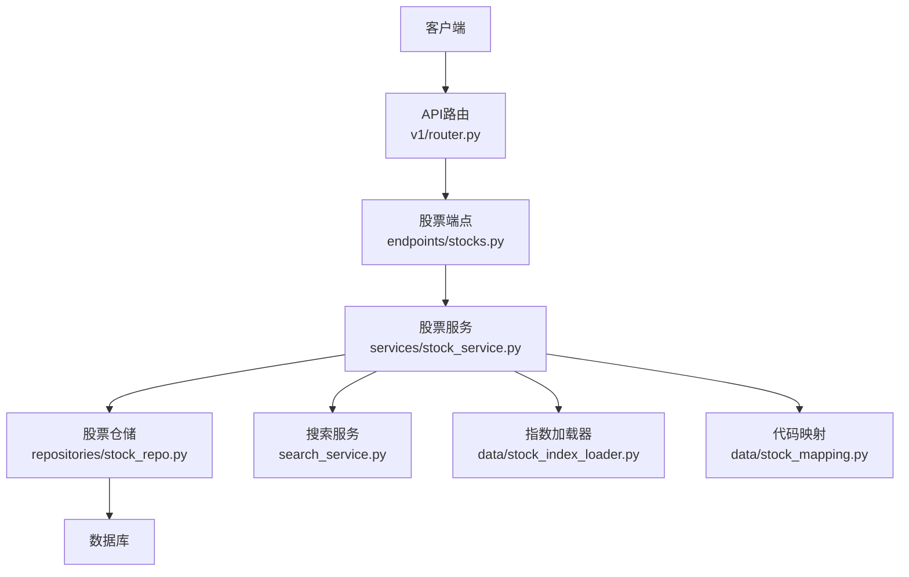
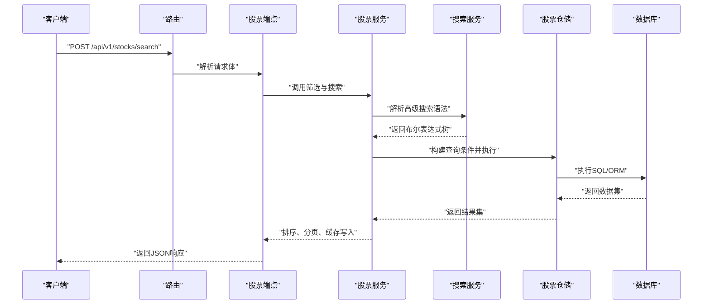
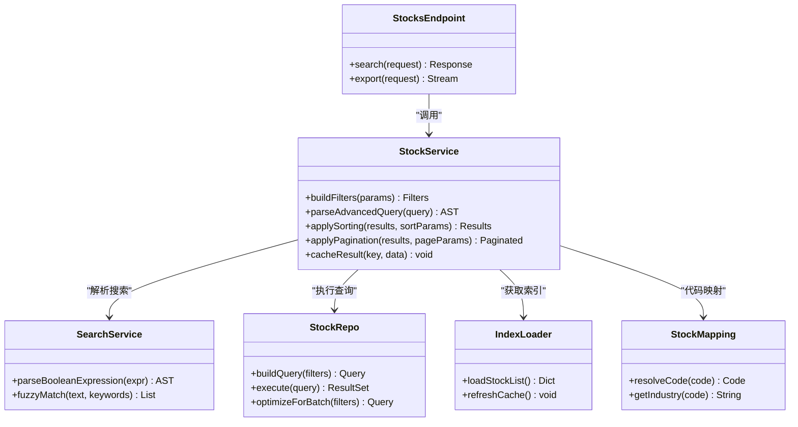

# 股票搜索与筛选API

<cite>
**本文档引用的文件**   
- [api/v1/endpoints/stocks.py](file://api/v1/endpoints/stocks.py)
- [api/v1/schemas/stocks.py](file://api/v1/schemas/stocks.py)
- [src/services/stock_service.py](file://src/services/stock_service.py)
- [src/repositories/stock_repo.py](file://src/repositories/stock_repo.py)
- [src/search_service.py](file://src/search_service.py)
- [src/data/stock_index_loader.py](file://src/data/stock_index_loader.py)
- [src/data/stock_mapping.py](file://src/data/stock_mapping.py)
- [api/app.py](file://api/app.py)
- [api/v1/router.py](file://api/v1/router.py)
</cite>

## 目录
1. [简介](#简介)
2. [项目结构](#项目结构)
3. [核心组件](#核心组件)
4. [架构总览](#架构总览)
5. [详细组件分析](#详细组件分析)
6. [依赖关系分析](#依赖关系分析)
7. [性能考虑](#性能考虑)
8. [故障排查指南](#故障排查指南)
9. [结论](#结论)
10. [附录](#附录)

## 简介
本文件面向“股票搜索与筛选API”的完整文档，覆盖多维度筛选条件（市值范围、行业分类、涨跌幅、成交量等技术指标）、高级搜索语法（布尔运算与逻辑组合）、自定义筛选条件的动态构建与SQL生成机制、批量筛选的性能优化与缓存策略、搜索结果排序与分页、导出功能实现，以及复杂查询场景的代码示例与最佳实践。内容基于仓库中股票相关接口与服务实现进行系统化梳理，帮助开发者快速理解并高效使用。

## 项目结构
围绕股票搜索与筛选能力，后端采用分层架构：
- API层：定义路由与请求/响应模型
- 服务层：封装业务逻辑、参数校验、过滤条件构建
- 数据访问层：负责数据库查询、索引加载与映射
- 工具与配置：提供搜索、映射、索引等通用能力

图表来源
- [api/v1/router.py:1-200](file://api/v1/router.py#L1-L200)
- [api/v1/endpoints/stocks.py:1-300](file://api/v1/endpoints/stocks.py#L1-L300)
- [src/services/stock_service.py:1-400](file://src/services/stock_service.py#L1-L400)
- [src/repositories/stock_repo.py:1-300](file://src/repositories/stock_repo.py#L1-L300)
- [src/search_service.py:1-200](file://src/search_service.py#L1-L200)
- [src/data/stock_index_loader.py:1-200](file://src/data/stock_index_loader.py#L1-L200)
- [src/data/stock_mapping.py:1-200](file://src/data/stock_mapping.py#L1-L200)

章节来源
- [api/app.py:1-200](file://api/app.py#L1-L200)
- [api/v1/router.py:1-200](file://api/v1/router.py#L1-L200)

## 核心组件
- 股票端点（Stocks Endpoint）：暴露REST接口，接收搜索与筛选参数，返回分页结果与元信息
- 股票服务（Stock Service）：统一处理筛选条件解析、高级搜索语法、排序与分页、缓存命中与回源
- 股票仓储（Stock Repo）：将筛选条件转换为SQL或ORM查询，执行批量查询与聚合
- 搜索服务（Search Service）：支持全文检索、模糊匹配、布尔表达式解析
- 索引与映射（Index Loader & Mapping）：维护股票代码、名称、行业、板块等基础索引，加速筛选与展示

章节来源
- [api/v1/endpoints/stocks.py:1-300](file://api/v1/endpoints/stocks.py#L1-L300)
- [api/v1/schemas/stocks.py:1-200](file://api/v1/schemas/stocks.py#L1-L200)
- [src/services/stock_service.py:1-400](file://src/services/stock_service.py#L1-L400)
- [src/repositories/stock_repo.py:1-300](file://src/repositories/stock_repo.py#L1-L300)
- [src/search_service.py:1-200](file://src/search_service.py#L1-L200)
- [src/data/stock_index_loader.py:1-200](file://src/data/stock_index_loader.py#L1-L200)
- [src/data/stock_mapping.py:1-200](file://src/data/stock_mapping.py#L1-L200)

## 架构总览
整体调用链从HTTP请求进入，经路由分发到股票端点，再由服务层组装筛选条件、调用仓储层执行查询，最后返回结构化结果。搜索服务与索引/映射模块为筛选与展示提供支撑。

图表来源
- [api/v1/router.py:1-200](file://api/v1/router.py#L1-L200)
- [api/v1/endpoints/stocks.py:1-300](file://api/v1/endpoints/stocks.py#L1-L300)
- [src/services/stock_service.py:1-400](file://src/services/stock_service.py#L1-L400)
- [src/search_service.py:1-200](file://src/search_service.py#L1-L200)
- [src/repositories/stock_repo.py:1-300](file://src/repositories/stock_repo.py#L1-L300)

## 详细组件分析

### 股票端点（Stocks Endpoint）
- 职责：接收搜索与筛选请求，校验参数，调用服务层，返回标准化响应
- 关键能力：
  - 支持多维度筛选：市值范围、行业分类、涨跌幅区间、成交量阈值、技术指标窗口
  - 支持高级搜索语法：布尔运算符（AND/OR/NOT）、括号分组、字段限定
  - 支持排序与分页：按指定字段升/降序，页码与每页数量
  - 支持导出：CSV/Excel格式导出（异步任务或流式输出）
- 错误处理：参数校验失败、非法筛选条件、分页越界、导出失败等

章节来源
- [api/v1/endpoints/stocks.py:1-300](file://api/v1/endpoints/stocks.py#L1-L300)
- [api/v1/schemas/stocks.py:1-200](file://api/v1/schemas/stocks.py#L1-L200)

### 股票服务（Stock Service）
- 职责：统一编排筛选条件、高级搜索解析、排序分页、缓存策略、导出流程
- 关键能力：
  - 筛选条件构建：将用户输入转换为内部条件对象，支持数值区间、枚举集合、布尔表达式
  - 高级搜索语法：解析字符串表达式为AST，再映射为数据库可执行的过滤条件
  - 排序与分页：根据请求参数生成ORDER BY与LIMIT/OFFSET
  - 缓存策略：按查询指纹缓存结果，设置TTL与失效策略
  - 导出：将结果集转为CSV/Excel，支持大结果集的分块读取与流式输出
- 性能优化：
  - 批量查询：合并多次筛选为单次SQL，减少往返
  - 预取索引：在内存中维护行业、板块、代码映射，避免重复IO
  - 条件裁剪：优先使用有索引的字段（如代码、日期、行业）缩小扫描范围

章节来源
- [src/services/stock_service.py:1-400](file://src/services/stock_service.py#L1-L400)

### 股票仓储（Stock Repo）
- 职责：将服务层条件对象转换为SQL或ORM查询，执行查询并返回结果
- 关键能力：
  - SQL生成：动态拼接WHERE、JOIN、GROUP BY、ORDER BY、LIMIT/OFFSET
  - 条件映射：将数值区间、集合包含、文本模糊匹配映射为SQL片段
  - 批量优化：使用IN列表、UNION ALL、CTE提升查询效率
  - 索引利用：确保常用筛选字段建立合适索引（代码、行业、日期、涨跌幅、成交量）
- 错误处理：SQL语法错误、连接超时、结果集过大时的保护性截断

章节来源
- [src/repositories/stock_repo.py:1-300](file://src/repositories/stock_repo.py#L1-L300)

### 搜索服务（Search Service）
- 职责：提供全文检索与高级搜索语法解析
- 关键能力：
  - 布尔表达式：支持AND、OR、NOT、括号分组、字段限定（如 industry=科技）
  - 模糊匹配：对股票名称、代码、行业关键词进行近似匹配
  - 结果去重与排序：按相关性评分排序，支持时间权重
- 性能优化：
  - 词法分析缓存：对常见表达式进行缓存
  - 倒排索引：对高频字段建立倒排索引，加速匹配

章节来源
- [src/search_service.py:1-200](file://src/search_service.py#L1-L200)

### 索引与映射（Index Loader & Mapping）
- 职责：维护股票基础信息与映射关系，支撑筛选与展示
- 关键能力：
  - 指数加载：从本地文件或远程源加载股票列表、行业、板块信息
  - 代码映射：统一不同市场代码格式（A股、港股、美股），提供别名解析
  - 缓存更新：定时刷新索引，保证数据新鲜度
- 性能优化：
  - 内存缓存：热点数据常驻内存，降低IO压力
  - 增量更新：仅更新变更部分，避免全量重建

章节来源
- [src/data/stock_index_loader.py:1-200](file://src/data/stock_index_loader.py#L1-L200)
- [src/data/stock_mapping.py:1-200](file://src/data/stock_mapping.py#L1-L200)

## 依赖关系分析
组件间依赖清晰，服务层协调各模块，仓储层专注数据访问，搜索服务与索引模块提供辅助能力。

图表来源
- [api/v1/endpoints/stocks.py:1-300](file://api/v1/endpoints/stocks.py#L1-L300)
- [src/services/stock_service.py:1-400](file://src/services/stock_service.py#L1-L400)
- [src/search_service.py:1-200](file://src/search_service.py#L1-L200)
- [src/repositories/stock_repo.py:1-300](file://src/repositories/stock_repo.py#L1-L300)
- [src/data/stock_index_loader.py:1-200](file://src/data/stock_index_loader.py#L1-L200)
- [src/data/stock_mapping.py:1-200](file://src/data/stock_mapping.py#L1-L200)

章节来源
- [api/v1/router.py:1-200](file://api/v1/router.py#L1-L200)
- [api/app.py:1-200](file://api/app.py#L1-L200)

## 性能考虑
- 批量筛选优化：
  - 合并多个筛选条件为单次SQL，避免N+1查询
  - 使用IN列表替代多个OR条件，提升数据库执行计划效率
  - 对高频筛选字段建立复合索引（如行业+日期+涨跌幅）
- 缓存策略：
  - 查询指纹缓存：对相同筛选条件与排序分页参数缓存结果
  - TTL与失效：设置合理过期时间，结合数据变更事件主动失效
  - 分级缓存：热点数据使用内存缓存，冷数据使用分布式缓存
- 导出优化：
  - 流式输出：避免一次性加载全部结果到内存
  - 分块处理：大结果集分块写入，降低内存峰值
  - 异步任务：长时间导出任务放入队列，避免阻塞主线程

[本节为通用性能建议，不直接分析具体文件]

## 故障排查指南
- 常见问题：
  - 参数校验失败：检查请求体字段类型与取值范围
  - 筛选条件无效：确认字段名与值是否符合预期，避免非法字符
  - 分页越界：检查页码与每页数量是否合理
  - 导出失败：检查文件格式与权限，确认结果集大小
- 调试技巧：
  - 启用详细日志：记录SQL语句与执行时间
  - 模拟查询：使用测试数据验证筛选条件与排序逻辑
  - 监控指标：关注QPS、延迟、缓存命中率、错误率

章节来源
- [api/v1/endpoints/stocks.py:1-300](file://api/v1/endpoints/stocks.py#L1-L300)
- [src/services/stock_service.py:1-400](file://src/services/stock_service.py#L1-L400)

## 结论
股票搜索与筛选API通过分层架构与模块化设计，实现了灵活的多维度筛选、高级搜索语法、高性能批量查询与缓存策略，并提供排序、分页与导出功能。开发者可基于现有组件快速扩展新的筛选条件与搜索能力，同时保持系统的高可用性与可扩展性。

[本节为总结性内容，不直接分析具体文件]

## 附录
- 高级搜索语法示例：
  - 基本布尔运算：industry=科技 AND volume>1000000
  - 逻辑组合：(market_cap>100亿 OR market_cap<10亿) AND change_pct>5%
  - 字段限定：name~“华为” OR code IN (“600519”, “000858”)
- 自定义筛选条件构建步骤：
  - 定义筛选字段与类型
  - 实现条件解析与SQL映射
  - 添加索引与缓存支持
  - 编写单元测试验证正确性
- 最佳实践：
  - 优先使用有索引的字段进行筛选
  - 避免在WHERE中使用函数包裹字段
  - 合理使用分页，避免一次性返回大量数据
  - 对热点查询进行缓存，设置合理TTL

[本节为补充说明，不直接分析具体文件]