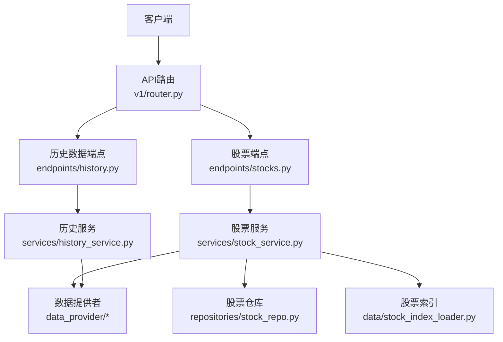
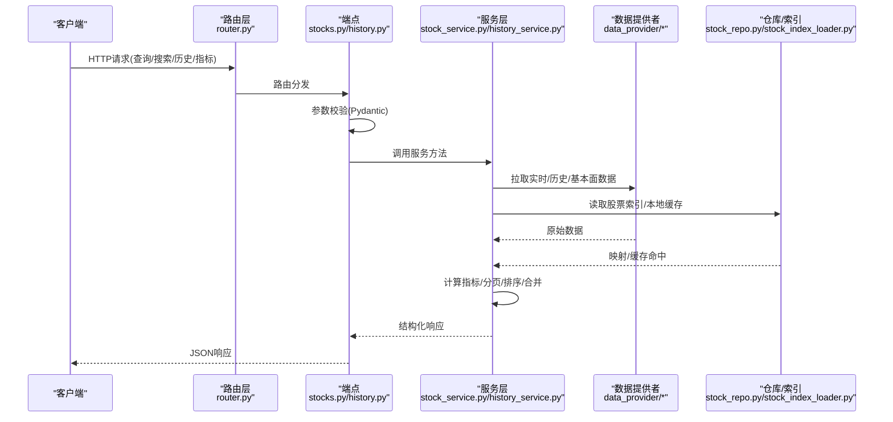
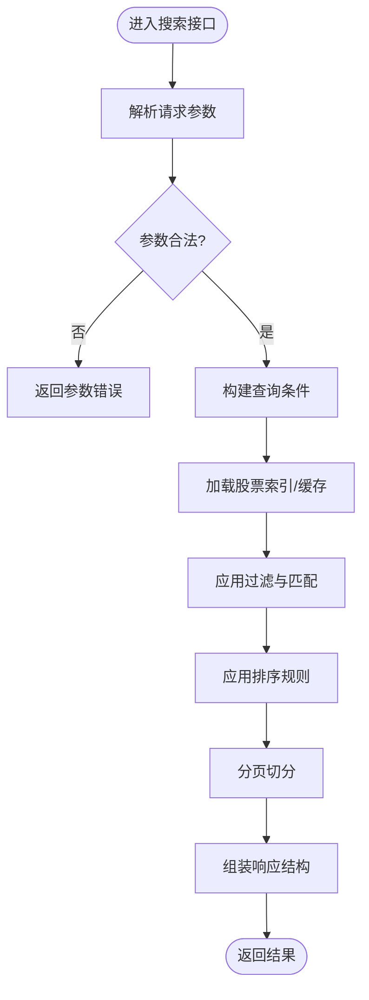
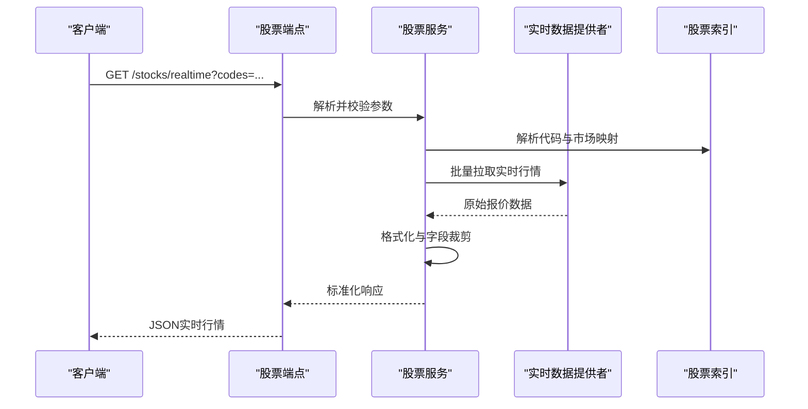
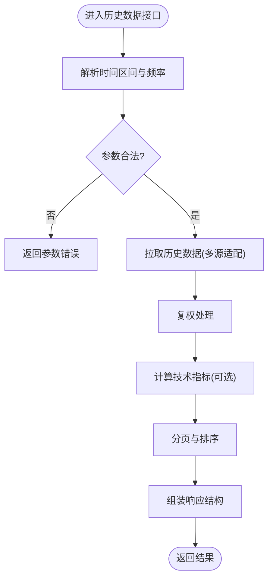
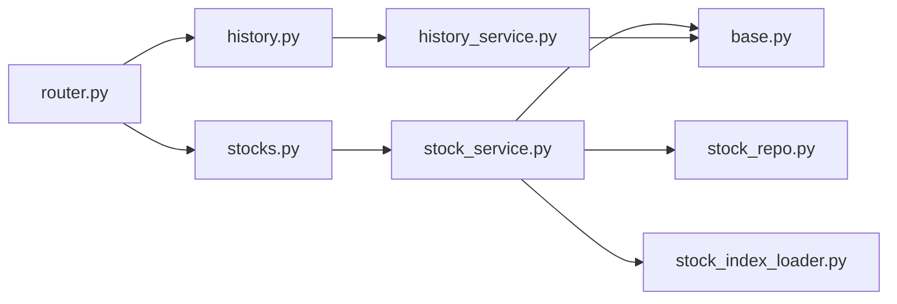

# 股票数据API

<cite>
**本文档引用的文件**   
- [api/v1/router.py](file://api/v1/router.py)
- [api/v1/endpoints/stocks.py](file://api/v1/endpoints/stocks.py)
- [api/v1/schemas/stocks.py](file://api/v1/schemas/stocks.py)
- [api/v1/endpoints/history.py](file://api/v1/endpoints/history.py)
- [api/v1/schemas/history.py](file://api/v1/schemas/history.py)
- [api/app.py](file://api/app.py)
- [src/services/stock_service.py](file://src/services/stock_service.py)
- [src/services/history_service.py](file://src/services/history_service.py)
- [data_provider/base.py](file://data_provider/base.py)
- [data_provider/realtime_types.py](file://data_provider/realtime_types.py)
- [src/data/stock_index_loader.py](file://src/data/stock_index_loader.py)
- [src/repositories/stock_repo.py](file://src/repositories/stock_repo.py)
</cite>

## 目录
1. [简介](#简介)
2. [项目结构](#项目结构)
3. [核心组件](#核心组件)
4. [架构总览](#架构总览)
5. [详细组件分析](#详细组件分析)
6. [依赖关系分析](#依赖关系分析)
7. [性能与缓存策略](#性能与缓存策略)
8. [故障排查指南](#故障排查指南)
9. [结论](#结论)
10. [附录：接口清单与示例](#附录接口清单与示例)

## 简介
本文件面向使用“股票数据API”的开发者，系统化说明股票查询、搜索与筛选接口的使用方法，覆盖实时行情、历史数据、技术指标等数据的获取方式；同时给出股票基本信息、财务数据、新闻信息等相关接口的调用方法。文档包含完整的请求参数说明、响应数据结构、批量查询、分页处理与排序功能的实现示例，并提供数据缓存策略与性能优化建议，以及常用查询场景的最佳实践。

## 项目结构
本项目采用分层架构：API层（FastAPI路由与Pydantic模型）、服务层（业务逻辑与编排）、数据提供者层（多源数据拉取与适配）、存储与索引层（本地仓库与股票索引）。股票相关能力集中在以下模块：
- API路由与端点：定义HTTP接口、参数校验与返回结构
- 服务层：封装业务逻辑、组合多个数据源、处理分页与排序
- 数据提供者：对接多种市场与数据源（A股、港股、美股、指数等）
- 存储与索引：本地缓存与快速检索（股票代码映射、列表加载）

**图表来源** 
- [api/v1/router.py](file://api/v1/router.py)
- [api/v1/endpoints/stocks.py](file://api/v1/endpoints/stocks.py)
- [api/v1/endpoints/history.py](file://api/v1/endpoints/history.py)
- [src/services/stock_service.py](file://src/services/stock_service.py)
- [src/services/history_service.py](file://src/services/history_service.py)
- [data_provider/base.py](file://data_provider/base.py)
- [src/data/stock_index_loader.py](file://src/data/stock_index_loader.py)
- [src/repositories/stock_repo.py](file://src/repositories/stock_repo.py)

**章节来源**
- [api/app.py](file://api/app.py)
- [api/v1/router.py](file://api/v1/router.py)

## 核心组件
- 股票查询与搜索：支持按代码、名称模糊匹配、板块/行业筛选、市场过滤、分页与排序
- 实时行情：获取最新报价、涨跌幅、成交量、成交额、买卖盘口等
- 历史数据：日K/周K/月K、复权、区间起止时间、复权方式、字段选择
- 技术指标：MA、MACD、RSI、布林带等计算与返回
- 基本面与新闻：公司基本信息、财务指标、公告与新闻聚合

上述能力由API端点暴露，服务层协调数据提供者与仓库，保证一致的数据结构与错误处理。

**章节来源**
- [api/v1/endpoints/stocks.py](file://api/v1/endpoints/stocks.py)
- [api/v1/schemas/stocks.py](file://api/v1/schemas/stocks.py)
- [api/v1/endpoints/history.py](file://api/v1/endpoints/history.py)
- [api/v1/schemas/history.py](file://api/v1/schemas/history.py)
- [src/services/stock_service.py](file://src/services/stock_service.py)
- [src/services/history_service.py](file://src/services/history_service.py)

## 架构总览
下图展示从HTTP请求到数据返回的整体流程，包括路由解析、参数校验、服务编排、数据源拉取与结果组装。

**图表来源** 
- [api/v1/router.py](file://api/v1/router.py)
- [api/v1/endpoints/stocks.py](file://api/v1/endpoints/stocks.py)
- [api/v1/endpoints/history.py](file://api/v1/endpoints/history.py)
- [src/services/stock_service.py](file://src/services/stock_service.py)
- [src/services/history_service.py](file://src/services/history_service.py)
- [data_provider/base.py](file://data_provider/base.py)
- [src/data/stock_index_loader.py](file://src/data/stock_index_loader.py)
- [src/repositories/stock_repo.py](file://src/repositories/stock_repo.py)

## 详细组件分析

### 股票查询与搜索接口
- 功能要点
  - 支持按股票代码精确匹配、名称模糊搜索、板块/行业筛选、市场过滤
  - 支持分页（页码、每页大小）与排序（涨幅、成交量、市值等）
  - 批量查询：一次请求传入多个股票代码或条件，返回聚合结果
- 典型请求参数
  - 搜索关键字：字符串，支持部分匹配
  - 市场：如A股、港股、美股、指数等
  - 板块/行业：字符串或枚举
  - 分页：page、size
  - 排序：field、order（asc/desc）
  - 过滤：涨跌停状态、上市状态、ST标记等
- 响应结构
  - 列表项：代码、名称、市场、板块、最新价、涨跌幅、成交量、成交额、总市值、流通市值、上市日期等
  - 分页元数据：总数、当前页、每页大小、总页数
  - 排序与过滤结果集

**图表来源** 
- [api/v1/endpoints/stocks.py](file://api/v1/endpoints/stocks.py)
- [api/v1/schemas/stocks.py](file://api/v1/schemas/stocks.py)
- [src/services/stock_service.py](file://src/services/stock_service.py)
- [src/data/stock_index_loader.py](file://src/data/stock_index_loader.py)
- [src/repositories/stock_repo.py](file://src/repositories/stock_repo.py)

**章节来源**
- [api/v1/endpoints/stocks.py](file://api/v1/endpoints/stocks.py)
- [api/v1/schemas/stocks.py](file://api/v1/schemas/stocks.py)
- [src/services/stock_service.py](file://src/services/stock_service.py)

### 实时行情接口
- 功能要点
  - 单只或多只股票的实时报价、涨跌幅、成交量、成交额、买卖盘口
  - 支持市场区分与代码前缀转换（如沪市、深市、港美股）
  - 可选字段裁剪与增量更新
- 典型请求参数
  - 股票代码列表：支持批量
  - 市场标识：自动识别或显式指定
  - 字段选择：price、change_pct、volume、amount、bid/ask等
  - 刷新策略：是否强制刷新或允许缓存命中
- 响应结构
  - 每只股票：代码、名称、最新价、涨跌额、涨跌幅、成交量、成交额、买卖盘口、更新时间
  - 批次元数据：请求ID、耗时、数据来源

**图表来源** 
- [api/v1/endpoints/stocks.py](file://api/v1/endpoints/stocks.py)
- [src/services/stock_service.py](file://src/services/stock_service.py)
- [data_provider/realtime_types.py](file://data_provider/realtime_types.py)
- [src/data/stock_index_loader.py](file://src/data/stock_index_loader.py)

**章节来源**
- [api/v1/endpoints/stocks.py](file://api/v1/endpoints/stocks.py)
- [data_provider/realtime_types.py](file://data_provider/realtime_types.py)
- [src/services/stock_service.py](file://src/services/stock_service.py)

### 历史数据接口
- 功能要点
  - 支持日K/周K/月K、复权（前复权/后复权）、区间起止时间、字段选择
  - 支持技术指标叠加（MA、MACD、RSI、布林带等）
  - 分页与排序：按时间倒序/正序、限制条数
- 典型请求参数
  - 股票代码、市场
  - 起始时间、结束时间
  - 频率：日/周/月
  - 复权方式：不复权/前复权/后复权
  - 指标：ma、macd、rsi、boll等
  - 分页：page、size
  - 排序：date（asc/desc）
- 响应结构
  - K线数据：日期、开盘、收盘、最高、最低、成交量、成交额
  - 技术指标：各指标序列与参数
  - 分页元数据：总数、当前页、每页大小、总页数

**图表来源** 
- [api/v1/endpoints/history.py](file://api/v1/endpoints/history.py)
- [api/v1/schemas/history.py](file://api/v1/schemas/history.py)
- [src/services/history_service.py](file://src/services/history_service.py)
- [data_provider/base.py](file://data_provider/base.py)

**章节来源**
- [api/v1/endpoints/history.py](file://api/v1/endpoints/history.py)
- [api/v1/schemas/history.py](file://api/v1/schemas/history.py)
- [src/services/history_service.py](file://src/services/history_service.py)

### 基本面与新闻接口
- 功能要点
  - 公司基本信息：名称、代码、上市交易所、行业、板块、上市日期、总股本、流通股本等
  - 财务数据：营收、净利润、毛利率、ROE、资产负债率等关键指标
  - 新闻与公告：聚合多源新闻、摘要、发布时间、链接
- 典型请求参数
  - 股票代码、市场
  - 财务周期：年度/季度
  - 新闻关键词与时间范围
- 响应结构
  - 基本信息：字段集合与单位
  - 财务指标：指标名、数值、同比/环比
  - 新闻列表：标题、摘要、来源、时间、链接

**章节来源**
- [api/v1/endpoints/stocks.py](file://api/v1/endpoints/stocks.py)
- [src/services/stock_service.py](file://src/services/stock_service.py)

## 依赖关系分析
- 路由与端点依赖服务层，服务层依赖数据提供者与仓库/索引
- 数据提供者统一抽象，便于扩展新市场与新数据源
- 股票索引用于快速映射与过滤，提升搜索与筛选性能

**图表来源** 
- [api/v1/router.py](file://api/v1/router.py)
- [api/v1/endpoints/stocks.py](file://api/v1/endpoints/stocks.py)
- [api/v1/endpoints/history.py](file://api/v1/endpoints/history.py)
- [src/services/stock_service.py](file://src/services/stock_service.py)
- [src/services/history_service.py](file://src/services/history_service.py)
- [data_provider/base.py](file://data_provider/base.py)
- [src/data/stock_index_loader.py](file://src/data/stock_index_loader.py)
- [src/repositories/stock_repo.py](file://src/repositories/stock_repo.py)

**章节来源**
- [api/v1/router.py](file://api/v1/router.py)
- [data_provider/base.py](file://data_provider/base.py)

## 性能与缓存策略
- 缓存策略
  - 实时行情：短TTL缓存（秒级），避免高频重复请求
  - 历史数据：按股票+时间区间+复权方式+指标组合缓存（分钟至小时级）
  - 股票索引：启动时加载，内存常驻，支持热更新
  - 本地仓库：持久化缓存，跨进程共享，减少网络IO
- 性能优化建议
  - 批量接口优先：减少往返次数，提高吞吐
  - 字段裁剪：按需返回字段，降低序列化开销
  - 分页与限流：控制单次返回规模，避免大对象传输
  - 并发拉取：对多数据源并行请求，缩短整体延迟
  - 失败重试与降级：网络异常时回退到备用数据源或缓存
  - 连接池与超时：合理设置HTTP连接池与超时时间

[本节为通用指导，不直接分析具体文件]

## 故障排查指南
- 常见错误
  - 参数校验失败：检查必填字段、类型、取值范围
  - 数据源不可用：查看日志与降级策略，确认备用数据源
  - 缓存未命中：检查缓存键生成逻辑与TTL配置
  - 分页越界：确保page与size在合理范围
- 调试步骤
  - 启用详细日志，记录请求参数与响应结构
  - 逐步定位问题：路由→端点→服务→数据提供者→仓库/索引
  - 使用最小可复现用例，隔离外部依赖

**章节来源**
- [api/v1/endpoints/stocks.py](file://api/v1/endpoints/stocks.py)
- [api/v1/endpoints/history.py](file://api/v1/endpoints/history.py)
- [src/services/stock_service.py](file://src/services/stock_service.py)
- [src/services/history_service.py](file://src/services/history_service.py)

## 结论
本API提供统一的股票数据访问能力，覆盖实时行情、历史数据、技术指标与基本面新闻。通过分层架构与数据提供者抽象，系统具备良好的可扩展性与稳定性。结合缓存与并发优化，可在高并发场景下保持良好性能。建议在生产环境启用监控与告警，持续优化数据质量与响应速度。

[本节为总结性内容，不直接分析具体文件]

## 附录：接口清单与示例

### 接口清单
- 股票搜索与筛选
  - 路径：/api/v1/stocks/search
  - 方法：GET/POST
  - 参数：关键字、市场、板块、分页、排序
  - 响应：股票列表与分页元数据
- 实时行情
  - 路径：/api/v1/stocks/realtime
  - 方法：GET
  - 参数：股票代码列表、市场、字段选择
  - 响应：实时报价与盘口数据
- 历史数据
  - 路径：/api/v1/history/kline
  - 方法：GET
  - 参数：股票代码、时间区间、频率、复权、指标、分页、排序
  - 响应：K线与指标序列
- 基本面与新闻
  - 路径：/api/v1/stocks/fundamentals
  - 方法：GET
  - 参数：股票代码、市场、财务周期
  - 路径：/api/v1/stocks/news
  - 方法：GET
  - 参数：股票代码、关键词、时间范围

### 请求参数说明
- 通用分页
  - page：页码，默认1
  - size：每页大小，默认20，最大建议100
- 通用排序
  - field：排序字段（如change_pct、volume、market_cap）
  - order：asc/desc
- 股票搜索
  - keyword：搜索关键字（支持名称与代码）
  - market：市场标识（A股/港股/美股/指数）
  - sector：板块/行业
- 实时行情
  - codes：逗号分隔的股票代码列表
  - fields：需要返回的字段集合
- 历史数据
  - start_date、end_date：起止日期（YYYY-MM-DD）
  - frequency：day/week/month
  - adjustment：none/front/back
  - indicators：ma/macd/rsi/boll等
- 基本面与新闻
  - period：annual/quarterly
  - news_keyword、news_start_date、news_end_date

### 响应数据结构
- 股票列表
  - items：数组，每项包含代码、名称、市场、板块、价格、涨跌幅、成交量、成交额、市值等
  - pagination：{total, page, size, totalPages}
- 实时行情
  - quotes：数组，每项包含代码、最新价、涨跌额、涨跌幅、成交量、成交额、买卖盘口、更新时间
- 历史数据
  - klines：数组，每项包含日期、开收高低量额
  - indicators：对象，包含各指标序列与参数
  - pagination：同上
- 基本面与新闻
  - fundamentals：对象，包含各项财务指标与单位
  - news：数组，每项包含标题、摘要、来源、时间、链接

### 批量查询与分页排序示例
- 批量搜索
  - 请求：/api/v1/stocks/search?keyword=科技&market=A股&page=1&size=50&sort=change_pct&order=desc
  - 响应：返回符合条件的股票列表与分页信息
- 批量实时行情
  - 请求：/api/v1/stocks/realtime?codes=000001.SZ,600519.SH,00700.HK&fields=price,change_pct,volume
  - 响应：返回多只股票的实时报价与选中字段
- 历史数据分页
  - 请求：/api/v1/history/kline?code=000001.SZ&start_date=2024-01-01&end_date=2024-12-31&frequency=day&adjustment=front&indicators=ma,rsi&page=1&size=100&sort=date&order=desc
  - 响应：返回K线与指标序列，按日期倒序分页

### 最佳实践
- 使用批量接口减少请求次数
- 合理设置分页大小，避免过大响应
- 按需选择字段，减少数据传输
- 利用缓存与索引提升查询性能
- 对失败请求进行重试与降级处理
- 监控与日志记录关键指标与错误

[本节为示例与实践指导，不直接分析具体文件]