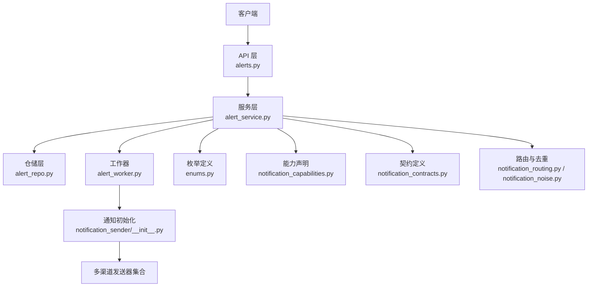
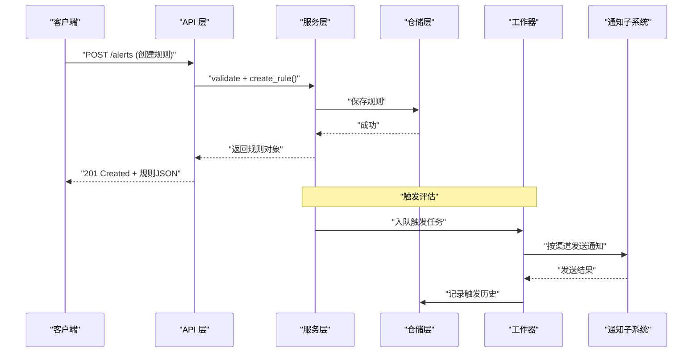
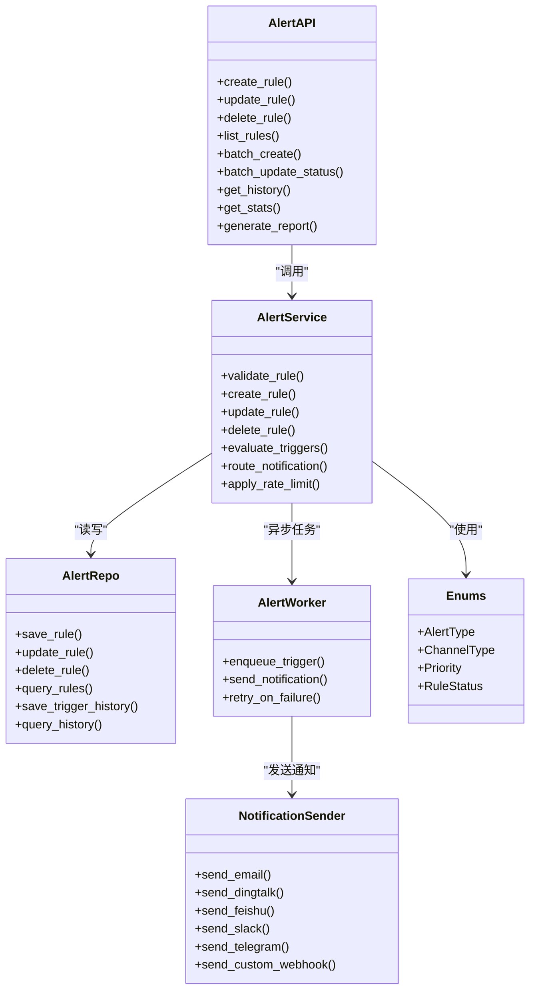

# 警报系统API

<cite>
**本文引用的文件**
- [api/v1/endpoints/alerts.py](file://api/v1/endpoints/alerts.py)
- [api/v1/schemas/alerts.py](file://api/v1/schemas/alerts.py)
- [src/services/alert_service.py](file://src/services/alert_service.py)
- [src/repositories/alert_repo.py](file://src/repositories/alert_repo.py)
- [src/services/alert_worker.py](file://src/services/alert_worker.py)
- [src/notification_sender/__init__.py](file://src/notification_sender/__init__.py)
- [src/notification_capabilities.py](file://src/notification_capabilities.py)
- [src/notification_contracts.py](file://src/notification_contracts.py)
- [src/notification_routing.py](file://src/notification_routing.py)
- [src/notification_noise.py](file://src/notification_noise.py)
- [src/enums.py](file://src/enums.py)
- [tests/test_alert_api.py](file://tests/test_alert_api.py)
- [tests/test_alert_worker.py](file://tests/test_alert_worker.py)
</cite>

## 目录
1. [简介](#简介)
2. [项目结构](#项目结构)
3. [核心组件](#核心组件)
4. [架构总览](#架构总览)
5. [详细组件分析](#详细组件分析)
6. [依赖关系分析](#依赖关系分析)
7. [性能考虑](#性能考虑)
8. [故障排查指南](#故障排查指南)
9. [结论](#结论)
10. [附录](#附录)

## 简介
本文件面向开发者与使用者，系统化说明“警报系统”的API接口设计、数据模型、触发条件、通知渠道与频率控制，覆盖价格警报、技术指标警报与新闻情感警报的配置方式。文档同时提供批量操作、条件组合与优先级管理的使用建议，并给出监控、统计与报告生成的能力说明，以及最佳实践与性能优化建议。

## 项目结构
警报系统在后端采用分层架构：
- API层：定义REST接口与请求/响应Schema
- 服务层：编排业务逻辑（规则校验、触发判定、通知路由）
- 仓储层：持久化规则与触发历史
- 工作器：异步处理触发任务与通知发送
- 通知子系统：统一抽象多种通知渠道与降噪策略

图表来源
- [api/v1/endpoints/alerts.py](file://api/v1/endpoints/alerts.py)
- [src/services/alert_service.py](file://src/services/alert_service.py)
- [src/repositories/alert_repo.py](file://src/repositories/alert_repo.py)
- [src/services/alert_worker.py](file://src/services/alert_worker.py)
- [src/notification_sender/__init__.py](file://src/notification_sender/__init__.py)
- [src/enums.py](file://src/enums.py)
- [src/notification_capabilities.py](file://src/notification_capabilities.py)
- [src/notification_contracts.py](file://src/notification_contracts.py)
- [src/notification_routing.py](file://src/notification_routing.py)
- [src/notification_noise.py](file://src/notification_noise.py)

章节来源
- [api/v1/endpoints/alerts.py](file://api/v1/endpoints/alerts.py)
- [api/v1/schemas/alerts.py](file://api/v1/schemas/alerts.py)
- [src/services/alert_service.py](file://src/services/alert_service.py)
- [src/repositories/alert_repo.py](file://src/repositories/alert_repo.py)
- [src/services/alert_worker.py](file://src/services/alert_worker.py)

## 核心组件
- 接口层（API）
  - 负责接收HTTP请求，参数校验，调用服务层，返回标准化JSON响应
  - 关键路径：创建/更新/删除/查询规则、批量操作、触发历史查询、统计与报告
- 服务层（AlertService）
  - 实现规则生命周期管理、触发判定、通知路由、频率控制、优先级排序
  - 与仓储交互读写规则与历史；与工作器协作异步执行通知
- 仓储层（AlertRepo）
  - 规则与触发历史的持久化访问（增删改查、分页、过滤）
- 工作器（AlertWorker）
  - 消费触发事件，执行通知发送，支持重试与失败记录
- 通知子系统
  - 统一抽象：渠道能力、消息契约、路由策略、噪声抑制（去重/限流）

章节来源
- [api/v1/endpoints/alerts.py](file://api/v1/endpoints/alerts.py)
- [api/v1/schemas/alerts.py](file://api/v1/schemas/alerts.py)
- [src/services/alert_service.py](file://src/services/alert_service.py)
- [src/repositories/alert_repo.py](file://src/repositories/alert_repo.py)
- [src/services/alert_worker.py](file://src/services/alert_worker.py)
- [src/notification_sender/__init__.py](file://src/notification_sender/__init__.py)
- [src/notification_capabilities.py](file://src/notification_capabilities.py)
- [src/notification_contracts.py](file://src/notification_contracts.py)
- [src/notification_routing.py](file://src/notification_routing.py)
- [src/notification_noise.py](file://src/notification_noise.py)

## 架构总览
警报系统整体流程如下：
- 客户端通过API创建或修改规则
- 服务层校验规则、写入仓储
- 外部数据源或定时任务触发评估
- 服务层计算触发条件，生成触发事件
- 工作器异步发送通知，应用路由与降噪策略
- 触发历史持久化，供查询与报表使用

图表来源
- [api/v1/endpoints/alerts.py](file://api/v1/endpoints/alerts.py)
- [src/services/alert_service.py](file://src/services/alert_service.py)
- [src/repositories/alert_repo.py](file://src/repositories/alert_repo.py)
- [src/services/alert_worker.py](file://src/services/alert_worker.py)
- [src/notification_sender/__init__.py](file://src/notification_sender/__init__.py)

## 详细组件分析

### API 接口定义与用法
- 规则CRUD
  - 创建规则：POST /v1/alerts
  - 更新规则：PUT /v1/alerts/{id}
  - 删除规则：DELETE /v1/alerts/{id}
  - 查询规则：GET /v1/alerts?filters...
- 批量操作
  - 批量创建：POST /v1/alerts/batch
  - 批量启用/禁用：PATCH /v1/alerts/batch/status
- 触发历史
  - 查询历史：GET /v1/alerts/{id}/history?filters...
- 统计与报告
  - 统计概览：GET /v1/alerts/stats
  - 生成报告：POST /v1/alerts/report

请求与响应要点
- 请求体遵循Pydantic Schema定义，包含规则类型、标的范围、条件表达式、通知渠道、频率限制、优先级等字段
- 响应统一包含状态码、消息、数据体；错误响应包含错误码与详情
- 分页与过滤：列表接口支持分页参数与多维过滤（类型、状态、时间范围等）

章节来源
- [api/v1/endpoints/alerts.py](file://api/v1/endpoints/alerts.py)
- [api/v1/schemas/alerts.py](file://api/v1/schemas/alerts.py)
- [tests/test_alert_api.py](file://tests/test_alert_api.py)

### 数据模型与Schema
- 规则模型
  - 标识：id、名称、描述、状态（启用/禁用）、优先级
  - 类型：价格警报、技术指标警报、新闻情感警报
  - 标的：单只或多只股票/指数，支持代码映射与别名
  - 条件：阈值、区间、指标公式、情感阈值、时间窗口
  - 通知：渠道列表、模板变量、静默时段、频率限制
  - 元数据：创建/更新时间、版本、标签
- 触发历史
  - 关联规则ID、触发时间、触发值、匹配条件摘要、通知结果、重试次数

章节来源
- [api/v1/schemas/alerts.py](file://api/v1/schemas/alerts.py)
- [src/enums.py](file://src/enums.py)

### 服务层逻辑
- 规则生命周期
  - 创建：校验条件合法性、渠道可用性、频率配置合理性；落库并返回
  - 更新：增量字段校验、冲突检测、版本控制
  - 删除：软删除标记、清理关联缓存
- 触发判定
  - 价格警报：实时/历史价格对比阈值、波动率、缺口检测
  - 技术指标警报：均线交叉、RSI超买超卖、MACD信号、布林带突破等
  - 新闻情感警报：情感分数阈值、关键词命中、突发新闻权重
- 通知路由与频率控制
  - 路由：根据规则渠道配置选择发送器，支持多通道并行
  - 频率：滑动窗口去重、冷却时间、每日上限、紧急通道豁免
  - 降噪：重复内容合并、相似触发聚合、静默期过滤
- 优先级管理
  - 全局优先级队列，高优规则优先触发；同优先级按时间戳顺序
  - 支持动态调整优先级，影响调度与资源分配

章节来源
- [src/services/alert_service.py](file://src/services/alert_service.py)
- [src/notification_routing.py](file://src/notification_routing.py)
- [src/notification_noise.py](file://src/notification_noise.py)
- [src/notification_capabilities.py](file://src/notification_capabilities.py)
- [src/notification_contracts.py](file://src/notification_contracts.py)
- [src/enums.py](file://src/enums.py)

### 仓储层
- 规则存储
  - 索引：规则ID、类型、状态、优先级、更新时间
  - 查询：按标的、类型、状态、时间范围过滤；分页与排序
- 触发历史存储
  - 索引：规则ID、触发时间、通知结果
  - 查询：按规则、时间范围、结果过滤；导出CSV/JSON

章节来源
- [src/repositories/alert_repo.py](file://src/repositories/alert_repo.py)

### 工作器与异步处理
- 任务队列
  - 触发事件入队，支持重试与死信队列
- 发送执行
  - 按渠道适配发送器，统一结果封装
  - 失败重试策略：指数退避、最大重试次数
- 历史记录
  - 发送结果与重试信息持久化

章节来源
- [src/services/alert_worker.py](file://src/services/alert_worker.py)
- [src/notification_sender/__init__.py](file://src/notification_sender/__init__.py)

### 通知子系统
- 渠道能力
  - 邮件、企业微信、钉钉、飞书、Slack、Telegram、Pushover、Gotify、Ntfy、Server酱3、自定义Webhook等
- 消息契约
  - 统一消息体：标题、正文、富文本、图片、附件、回调链接
- 路由与降噪
  - 基于规则配置的渠道选择与优先级
  - 去重、聚合、静默期、频率限制

章节来源
- [src/notification_sender/__init__.py](file://src/notification_sender/__init__.py)
- [src/notification_capabilities.py](file://src/notification_capabilities.py)
- [src/notification_contracts.py](file://src/notification_contracts.py)
- [src/notification_routing.py](file://src/notification_routing.py)
- [src/notification_noise.py](file://src/notification_noise.py)

### 触发条件与配置示例（概念性）
- 价格警报
  - 条件：收盘价高于/低于阈值、盘中涨跌幅超过X%、成交量异常放大
  - 频率：每分钟/每5分钟检查，同一规则在冷却期内不重复通知
- 技术指标警报
  - 条件：RSI>70且放量、MA5上穿MA20、布林带上轨突破
  - 频率：日线级别或分钟级，支持多周期叠加
- 新闻情感警报
  - 条件：情感分数>0.8、关键词命中数量>3、突发新闻权重>阈值
  - 频率：小时级扫描，避免高频噪音

[本节为概念性说明，不直接分析具体文件]

### 批量操作与条件组合
- 批量创建/更新/启用禁用
  - 支持一次性提交多条规则，服务端进行批量校验与事务处理
- 条件组合
  - AND/OR逻辑嵌套，支持时间窗口与多指标复合条件
  - 优先级影响触发顺序与资源占用

章节来源
- [api/v1/endpoints/alerts.py](file://api/v1/endpoints/alerts.py)
- [api/v1/schemas/alerts.py](file://api/v1/schemas/alerts.py)
- [src/services/alert_service.py](file://src/services/alert_service.py)

### 监控、统计与报告
- 监控
  - 规则健康度、触发成功率、渠道送达率、平均延迟
- 统计
  - 按规则类型、标的、渠道维度统计触发次数与趋势
- 报告
  - 生成日报/周报，包含触发Top规则、误报率、渠道表现

章节来源
- [src/services/alert_service.py](file://src/services/alert_service.py)
- [src/repositories/alert_repo.py](file://src/repositories/alert_repo.py)

## 依赖关系分析

图表来源
- [api/v1/endpoints/alerts.py](file://api/v1/endpoints/alerts.py)
- [src/services/alert_service.py](file://src/services/alert_service.py)
- [src/repositories/alert_repo.py](file://src/repositories/alert_repo.py)
- [src/services/alert_worker.py](file://src/services/alert_worker.py)
- [src/notification_sender/__init__.py](file://src/notification_sender/__init__.py)
- [src/enums.py](file://src/enums.py)

章节来源
- [api/v1/endpoints/alerts.py](file://api/v1/endpoints/alerts.py)
- [src/services/alert_service.py](file://src/services/alert_service.py)
- [src/repositories/alert_repo.py](file://src/repositories/alert_repo.py)
- [src/services/alert_worker.py](file://src/services/alert_worker.py)
- [src/notification_sender/__init__.py](file://src/notification_sender/__init__.py)
- [src/enums.py](file://src/enums.py)

## 性能考虑
- 触发评估
  - 增量计算：仅对变更标的与指标重新计算
  - 缓存热点：常用指标与价格快照缓存，降低IO压力
- 通知发送
  - 并发控制：按渠道限制并发数，避免被限流
  - 批量合并：相同内容合并发送，减少冗余
- 存储与查询
  - 索引优化：规则与历史表的关键字段建立索引
  - 分页与过滤：避免全表扫描，限制返回大小
- 频率控制
  - 滑动窗口与令牌桶算法结合，平滑突发流量
  - 静默期与冷却时间降低重复触发

[本节为通用性能建议，不直接分析具体文件]

## 故障排查指南
- 常见问题
  - 规则创建失败：检查条件语法、渠道配置、频率限制
  - 未收到通知：确认渠道连通性、认证配置、黑名单与静默期
  - 触发延迟：检查工作器负载、队列积压、外部数据源延迟
- 诊断步骤
  - 查看触发历史与发送结果，定位失败原因
  - 检查日志中的错误码与重试次数
  - 验证渠道能力与消息契约是否匹配
- 恢复措施
  - 调整频率与静默期，缓解噪音
  - 增加重试与降级策略，提升鲁棒性

章节来源
- [src/services/alert_worker.py](file://src/services/alert_worker.py)
- [src/notification_sender/__init__.py](file://src/notification_sender/__init__.py)
- [tests/test_alert_worker.py](file://tests/test_alert_worker.py)

## 结论
警报系统通过清晰的API与服务分层，实现了灵活的条件配置、可靠的通知发送与高效的频率控制。借助仓储与工作器的解耦设计，系统在可扩展性与稳定性方面具备良好基础。建议在实际使用中遵循最佳实践，合理配置条件与频率，充分利用监控与报告能力，持续优化体验与性能。

## 附录
- 最佳实践
  - 规则命名规范：类型_标的_条件简述
  - 条件设计：避免过于复杂，优先使用可解释性强的阈值
  - 渠道选择：重要告警使用多通道冗余，日常提醒使用轻量渠道
  - 频率控制：默认保守，逐步放宽，避免打扰
- 性能优化建议
  - 热点数据缓存、批量处理、异步发送、索引优化
  - 监控告警：队列长度、发送失败率、延迟分位数

[本节为通用指导，不直接分析具体文件]